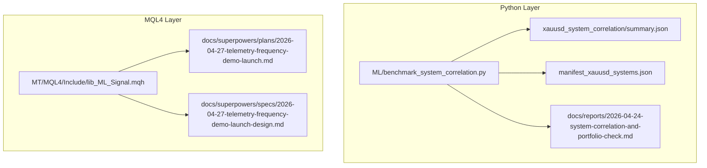
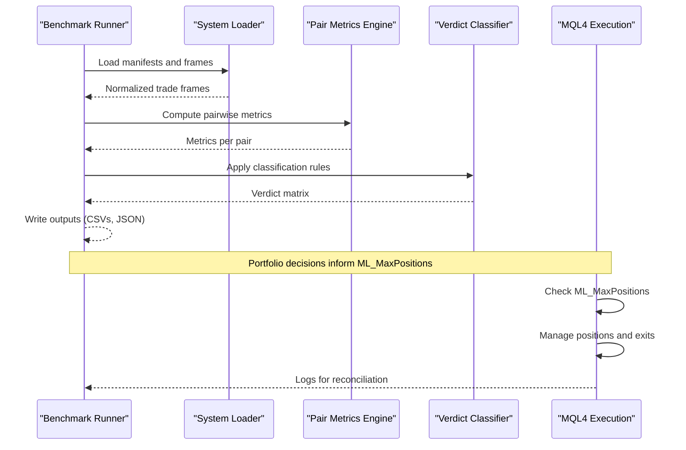
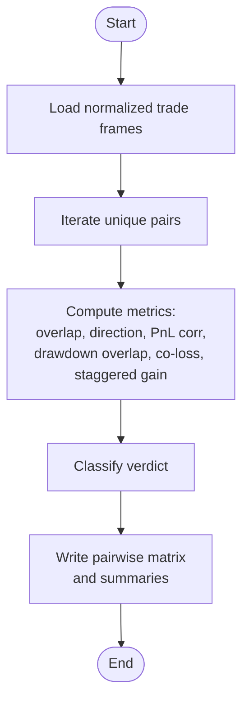
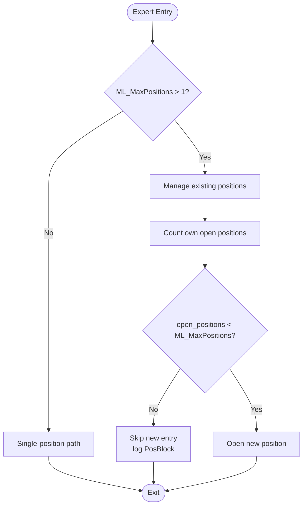
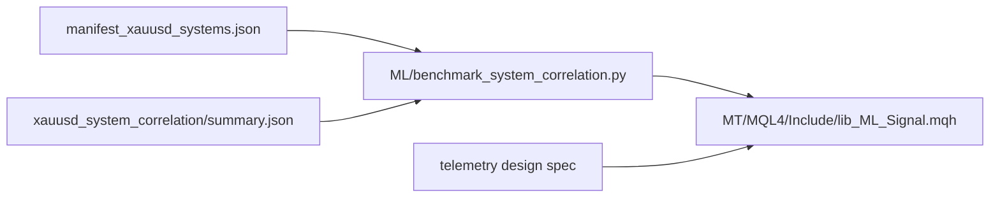

# Correlation and Position Concentration Controls

<cite>
**Referenced Files in This Document**
- [benchmark_system_correlation.py](file://ML/benchmark_system_correlation.py)
- [2026-04-24-system-correlation-and-portfolio-check.md](file://docs/reports/2026-04-24-system-correlation-and-portfolio-check.md)
- [summary.json](file://ML/reports/system_correlation_portfolio/xauusd_system_correlation/summary.json)
- [manifest_xauusd_systems.json](file://ML/reports/system_correlation_portfolio/manifest_xauusd_systems.json)
- [lib_ML_Signal.mqh](file://MT/MQL4/Include/lib_ML_Signal.mqh)
- [2026-04-27-telemetry-frequency-demo-launch.md](file://docs/superpowers/plans/2026-04-27-telemetry-frequency-demo-launch.md)
- [2026-04-27-telemetry-frequency-demo-launch-design.md](file://docs/superpowers/specs/2026-04-27-telemetry-frequency-demo-launch-design.md)
- [test_benchmark_system_correlation.py](file://tests/test_benchmark_system_correlation.py)
</cite>

## Table of Contents
1. [Introduction](#introduction)
2. [Project Structure](#project-structure)
3. [Core Components](#core-components)
4. [Architecture Overview](#architecture-overview)
5. [Detailed Component Analysis](#detailed-component-analysis)
6. [Dependency Analysis](#dependency-analysis)
7. [Performance Considerations](#performance-considerations)
8. [Troubleshooting Guide](#troubleshooting-guide)
9. [Conclusion](#conclusion)

## Introduction
This document explains correlation controls and position concentration management in the SoSimple system. It focuses on:
- The ML_MaxPositions parameter and its impact on concurrent position limits
- Correlation detection across systems/instruments using a canonical pairwise benchmark
- Position concentration monitoring to avoid overexposure
- Practical scenarios for correlation-based position adjustments
- Interaction between correlation controls and ML signal filtering
- Position sizing adjustments under correlation analysis and market regime changes

## Project Structure
The correlation and position management capabilities span three layers:
- Benchmarking and reporting (Python): pairwise system correlation and portfolio verdicts
- Trading execution (MQL4): multi-position control via ML_MaxPositions and related functions
- Documentation and design specs: plans and specifications for telemetry and safety boundaries

**Diagram sources**
- [benchmark_system_correlation.py:1-625](file://ML/benchmark_system_correlation.py#L1-L625)
- [summary.json:1-259](file://ML/reports/system_correlation_portfolio/xauusd_system_correlation/summary.json#L1-L259)
- [manifest_xauusd_systems.json:1-59](file://ML/reports/system_correlation_portfolio/manifest_xauusd_systems.json#L1-L59)
- [lib_ML_Signal.mqh:269-667](file://MT/MQL4/Include/lib_ML_Signal.mqh#L269-L667)
- [2026-04-24-system-correlation-and-portfolio-check.md:1-167](file://docs/reports/2026-04-24-system-correlation-and-portfolio-check.md#L1-L167)
- [2026-04-27-telemetry-frequency-demo-launch.md:385-434](file://docs/superpowers/plans/2026-04-27-telemetry-frequency-demo-launch.md#L385-L434)
- [2026-04-27-telemetry-frequency-demo-launch-design.md:148-166](file://docs/superpowers/specs/2026-04-27-telemetry-frequency-demo-launch-design.md#L148-L166)

**Section sources**
- [benchmark_system_correlation.py:1-625](file://ML/benchmark_system_correlation.py#L1-L625)
- [2026-04-24-system-correlation-and-portfolio-check.md:1-167](file://docs/reports/2026-04-24-system-correlation-and-portfolio-check.md#L1-L167)

## Core Components
- Pairwise correlation benchmark: computes trade overlap, direction agreement, PnL correlations (daily/weekly), drawdown overlap, co-loss ratio, and staggered gain ratio; classifies pairs into complementary, partially overlapping, redundant, or unclear.
- System baseline loader: supports trade CSV and entry-path prediction CSV sources, normalizes to a canonical contract, and simulates trades when needed.
- Multi-position execution: MQL4 library enforces ML_MaxPositions as a global cap on open ML positions, with logging and safety checks.

Key outcomes:
- Correlation matrices and verdicts guide portfolio construction decisions.
- ML_MaxPositions enables controlled multi-position exposure while preventing unbounded concentration.

**Section sources**
- [benchmark_system_correlation.py:35-501](file://ML/benchmark_system_correlation.py#L35-L501)
- [lib_ML_Signal.mqh:269-667](file://MT/MQL4/Include/lib_ML_Signal.mqh#L269-L667)

## Architecture Overview
The correlation and position control architecture integrates Python benchmarking with MQL4 execution:

**Diagram sources**
- [benchmark_system_correlation.py:531-601](file://ML/benchmark_system_correlation.py#L531-L601)
- [lib_ML_Signal.mqh:603-667](file://MT/MQL4/Include/lib_ML_Signal.mqh#L603-L667)

## Detailed Component Analysis

### Pairwise Correlation Benchmark
The benchmark defines a canonical trade-level contract and computes multiple metrics:
- Trade overlap ratio and Jaccard similarity of entry times
- Direction agreement
- Trade PnL correlation and period-wise PnL correlation (daily/weekly)
- Drawdown overlap ratio, co-loss ratio, and staggered gain ratio
- Final verdicts: complementary, partially overlapping, redundant, or unclear

**Diagram sources**
- [benchmark_system_correlation.py:531-601](file://ML/benchmark_system_correlation.py#L531-L601)

**Section sources**
- [benchmark_system_correlation.py:382-501](file://ML/benchmark_system_correlation.py#L382-L501)
- [2026-04-24-system-correlation-and-portfolio-check.md:87-144](file://docs/reports/2026-04-24-system-correlation-and-portfolio-check.md#L87-L144)

### System Baseline Loader and Simulation
The loader supports two source types:
- Trade CSV: reads and normalizes historical trades
- Entry-path predictions: simulates trades using OHLC and exit policies

Normalization ensures consistent columns and types for downstream correlation analysis.

**Section sources**
- [benchmark_system_correlation.py:266-318](file://ML/benchmark_system_correlation.py#L266-L318)
- [summary.json:4-58](file://ML/reports/system_correlation_portfolio/xauusd_system_correlation/summary.json#L4-L58)

### Multi-Position Control in MQL4
The MQL4 library enforces ML_MaxPositions globally:
- If ML_MaxPositions > 1, the expert manages multiple positions per bar time
- It counts own market orders and blocks new entries when the cap is reached
- It logs open/close events with fields including open_positions and max_positions
- Design specifications define safety boundaries and logging requirements

**Diagram sources**
- [lib_ML_Signal.mqh:603-667](file://MT/MQL4/Include/lib_ML_Signal.mqh#L603-L667)

**Section sources**
- [lib_ML_Signal.mqh:269-304](file://MT/MQL4/Include/lib_ML_Signal.mqh#L269-L304)
- [lib_ML_Signal.mqh:603-667](file://MT/MQL4/Include/lib_ML_Signal.mqh#L603-L667)
- [2026-04-27-telemetry-frequency-demo-launch-design.md:148-166](file://docs/superpowers/specs/2026-04-27-telemetry-frequency-demo-launch-design.md#L148-L166)

### Practical Scenarios and Examples
- Redundancy detection: frequency × original_plus_path on XAUUSD are classified as redundant, indicating one should be chosen for portfolio inclusion.
- Complementary pairs: quality × entry_path_v1 and quality × entry_path_v1_quantile show negative daily/weekly PnL correlations and zero drawdown overlap, suggesting diversification benefits.
- Partial overlap: pairs like frequency × entry_path_v1_quantile have high trade overlap but weak positive PnL correlation, signaling caution in simultaneous exposure.

These verdicts inform position sizing and composition decisions.

**Section sources**
- [2026-04-24-system-correlation-and-portfolio-check.md:114-138](file://docs/reports/2026-04-24-system-correlation-and-portfolio-check.md#L114-L138)
- [summary.json:60-201](file://ML/reports/system_correlation_portfolio/xauusd_system_correlation/summary.json#L60-L201)

### Position Sizing Adjustments Based on Correlation and Market Regime Changes
- Use verdicts to weight capital: allocate more to complementary pairs and less to redundant ones.
- Temporal regime splits (e.g., by ATR buckets or sessions) can refine allocation within a single verdict category.
- ML signal filtering (score thresholds) acts as a first-pass gate; correlation analysis then informs second-pass position sizing and sector concentration limits.

[No sources needed since this section synthesizes guidance from referenced analyses]

## Dependency Analysis
The correlation benchmark depends on:
- System baseline loaders and simulators
- Consistent trade-level contracts across systems
- Execution policy protocols for fair comparisons

MQL4 execution depends on:
- ML_MaxPositions as a hard cap
- Logging and reconciliation for operational safety

**Diagram sources**
- [manifest_xauusd_systems.json:1-59](file://ML/reports/system_correlation_portfolio/manifest_xauusd_systems.json#L1-L59)
- [summary.json:1-259](file://ML/reports/system_correlation_portfolio/xauusd_system_correlation/summary.json#L1-L259)
- [benchmark_system_correlation.py:531-601](file://ML/benchmark_system_correlation.py#L531-L601)
- [lib_ML_Signal.mqh:603-667](file://MT/MQL4/Include/lib_ML_Signal.mqh#L603-L667)
- [2026-04-27-telemetry-frequency-demo-launch-design.md:148-166](file://docs/superpowers/specs/2026-04-27-telemetry-frequency-demo-launch-design.md#L148-L166)

**Section sources**
- [benchmark_system_correlation.py:320-379](file://ML/benchmark_system_correlation.py#L320-L379)
- [lib_ML_Signal.mqh:603-667](file://MT/MQL4/Include/lib_ML_Signal.mqh#L603-L667)

## Performance Considerations
- Correlation computations scale with the number of pairs and aligned time indices; use manifests that minimize unnecessary comparisons.
- Multi-position enforcement adds O(N_orders) scans per bar; keep ML_MaxPositions reasonable to avoid excessive churn.
- Logging overhead increases with higher position counts; ensure log fields are minimal and targeted.

[No sources needed since this section provides general guidance]

## Troubleshooting Guide
Common issues and resolutions:
- Empty or misaligned trade frames: verify required columns and timestamps; ensure deduplication by entry_time.
- Zero or constant series in correlation: the benchmark handles degenerate cases by returning safe defaults.
- Multi-position blocking: when open_positions equals ML_MaxPositions, new entries are skipped; adjust ML_MaxPositions or reduce concurrent signals.
- Verdict instability: review trade overlap and PnL alignment; consider regime splits to stabilize metrics.

**Section sources**
- [benchmark_system_correlation.py:67-82](file://ML/benchmark_system_correlation.py#L67-L82)
- [benchmark_system_correlation.py:146-154](file://ML/benchmark_system_correlation.py#L146-L154)
- [lib_ML_Signal.mqh:653-663](file://MT/MQL4/Include/lib_ML_Signal.mqh#L653-L663)
- [test_benchmark_system_correlation.py:174-234](file://tests/test_benchmark_system_correlation.py#L174-L234)

## Conclusion
Correlation controls and position concentration management in SoSimple combine:
- A robust pairwise benchmark to detect redundancy and complementarity
- A clear trade-level contract enabling fair comparisons
- A multi-position execution engine governed by ML_MaxPositions
- Operational safety through logging and reconciliation

Together, these components support informed portfolio construction, dynamic position sizing, and disciplined risk management across systems and regimes.