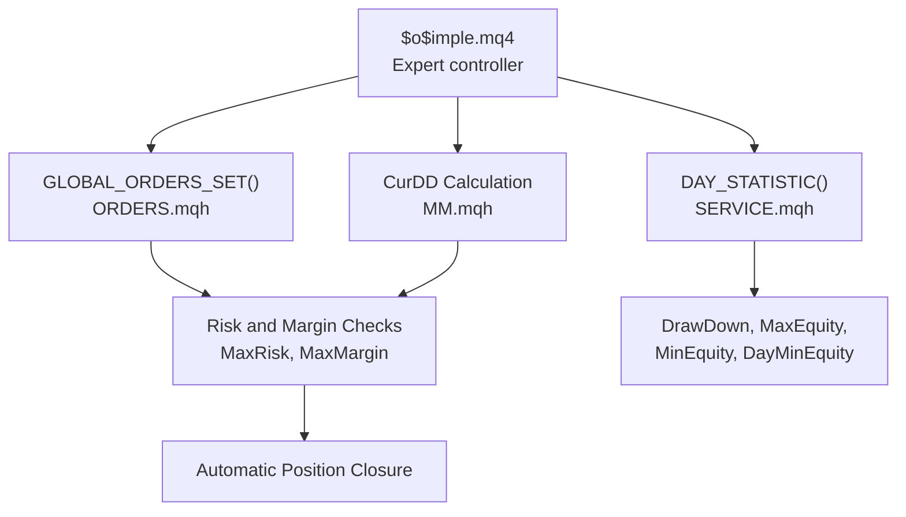
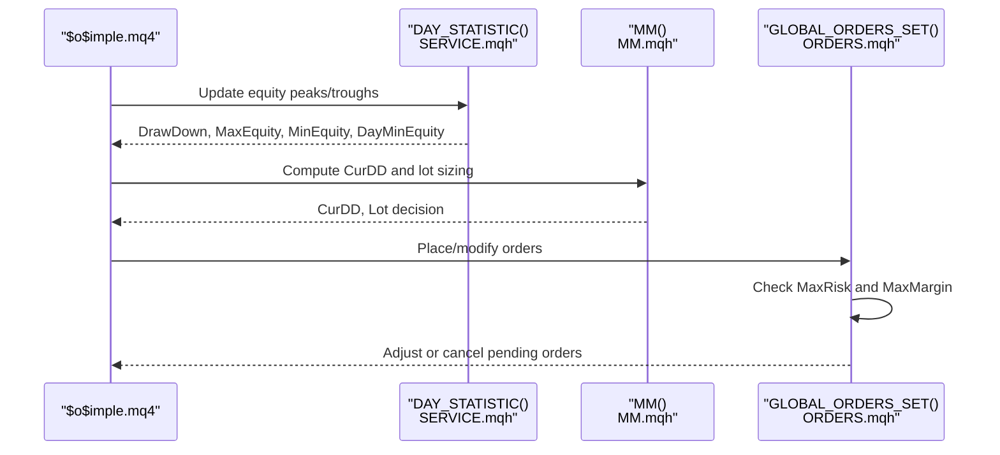
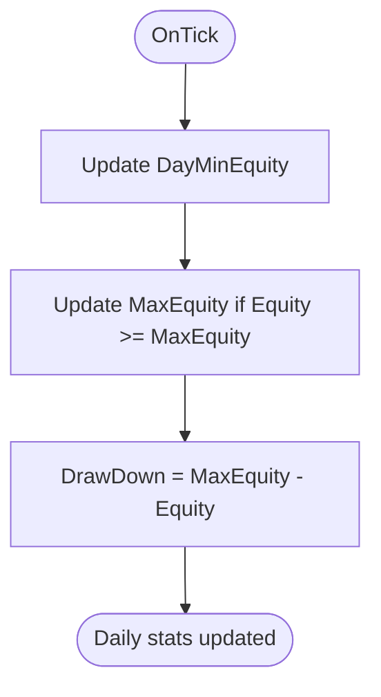
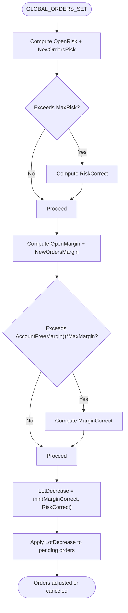
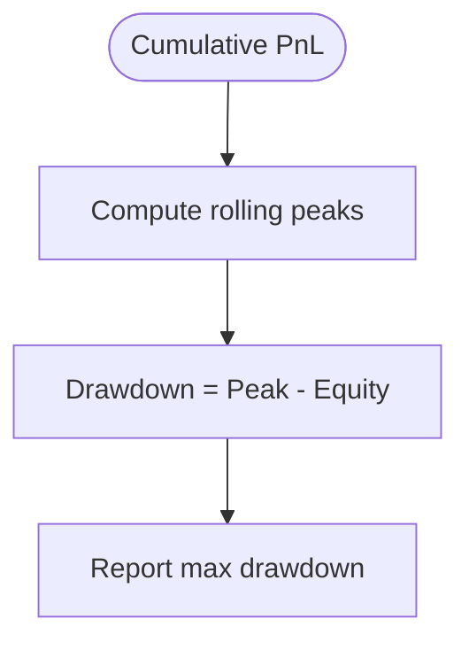
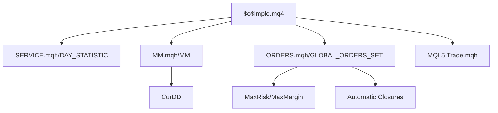

# Drawdown and Equity Monitoring

<cite>
**Referenced Files in This Document**
- [$o$imple.mq4](file://MT/MQL4/Experts/$o$imple.mq4)
- [MM.mqh](file://MT/MQL4/Include/MM.mqh)
- [ORDERS.mqh](file://MT/MQL4/Include/ORDERS.mqh)
- [SERVICE.mqh](file://MT/MQL4/Include/SERVICE.mqh)
- [Trade.mqh](file://MT/MQL5/Include/Trade/Trade.mqh)
- [_max_drawdown_atr function](file://ML/benchmark_take_skip_trailing_stop.py)
- [exit_policy_research.py](file://API/exit_policy_research.py)
</cite>

## Table of Contents
1. [Introduction](#introduction)
2. [Project Structure](#project-structure)
3. [Core Components](#core-components)
4. [Architecture Overview](#architecture-overview)
5. [Detailed Component Analysis](#detailed-component-analysis)
6. [Dependency Analysis](#dependency-analysis)
7. [Performance Considerations](#performance-considerations)
8. [Troubleshooting Guide](#troubleshooting-guide)
9. [Conclusion](#conclusion)

## Introduction
This document explains the drawdown monitoring and equity tracking systems implemented in the SoSimple trading system. It focuses on the CurDD, DrawDown, MaxEquity, MinEquity, and DayMinEquity variables, the DAY_STATISTIC() function, daily drawdown reporting, automatic position closure via risk controls, and the relationship to risk control parameters such as MaxMargin (0.7). Practical examples illustrate drawdown scenarios, equity curve analysis, and emergency shutdown procedures. Guidance is also provided for drawdown calculation methods across different timeframes and market conditions.

## Project Structure
The drawdown and equity monitoring logic spans three primary areas:
- Live trading expert ($o$imple.mq4): declares global variables and invokes daily statistics updates.
- Risk control and drawdown computation (MM.mqh): calculates current drawdown per expert and enforces risk limits.
- Daily statistics and reporting (SERVICE.mqh): maintains equity peaks/minima and computes drawdown metrics.
- Order management and automatic closures (ORDERS.mqh): applies MaxRisk and MaxMargin thresholds to automatically reduce or cancel orders.
- Equity analytics utilities (ML benchmarking): provides drawdown calculation routines used for backtesting and evaluation.
- Exit policy research (API): defines profit-guard and layered exit policies that complement drawdown monitoring.

**Diagram sources**
- [$o$imple.mq4:123-132](file://MT/MQL4/Experts/$o$imple.mq4#L123-L132)
- [SERVICE.mqh:469-482](file://MT/MQL4/Include/SERVICE.mqh#L469-L482)
- [ORDERS.mqh:258-278](file://MT/MQL4/Include/ORDERS.mqh#L258-L278)
- [MM.mqh:40-50](file://MT/MQL4/Include/MM.mqh#L40-L50)

**Section sources**
- [$o$imple.mq4:87-89](file://MT/MQL4/Experts/$o$imple.mq4#L87-L89)
- [SERVICE.mqh:469-482](file://MT/MQL4/Include/SERVICE.mqh#L469-L482)
- [MM.mqh:40-50](file://MT/MQL4/Include/MM.mqh#L40-L50)
- [ORDERS.mqh:258-278](file://MT/MQL4/Include/ORDERS.mqh#L258-L278)

## Core Components
- CurDD (Current Drawdown): Per-expert current drawdown computed dynamically during order sizing and risk checks. It influences lot sizing and can trigger automatic order deletion when exceeded historical thresholds.
- DrawDown: Maximum peak-to-trough drawdown observed during the session, tracked via daily statistics.
- MaxEquity: Highest recorded equity level during the session.
- MinEquity: Lowest recorded equity level during the session.
- DayMinEquity: Minimum equity observed during the current day; reset at day boundary and used to compute daily drawdown increments.

These variables are updated inside DAY_STATISTIC() and are used for daily reporting and risk control triggers.

**Section sources**
- [$o$imple.mq4:87-89](file://MT/MQL4/Experts/$o$imple.mq4#L87-L89)
- [SERVICE.mqh:469-482](file://MT/MQL4/Include/SERVICE.mqh#L469-L482)

## Architecture Overview
The drawdown and equity monitoring pipeline integrates real-time equity tracking with risk control enforcement:
- On each tick, the expert calls DAY_STATISTIC() to update equity peaks/troughs and drawdown metrics.
- During order placement, MM() computes CurDD and enforces CurDD ≤ Historical DD; if violated, new orders are rejected.
- GLOBAL_ORDERS_SET() enforces two independent risk controls:
  - MaxRisk: Sum of open and pending order risks must not exceed a configured percentage of account balance.
  - MaxMargin: Combined margin exposure must not exceed AccountFreeMargin() × MaxMargin (default 0.7).
- When either control is breached, LotDecrease is computed and applied to pending orders, potentially reducing or deleting them.

**Diagram sources**
- [$o$imple.mq4:123-132](file://MT/MQL4/Experts/$o$imple.mq4#L123-L132)
- [SERVICE.mqh:469-482](file://MT/MQL4/Include/SERVICE.mqh#L469-L482)
- [MM.mqh:1-30](file://MT/MQL4/Include/MM.mqh#L1-L30)
- [ORDERS.mqh:258-278](file://MT/MQL4/Include/ORDERS.mqh#L258-L278)

## Detailed Component Analysis

### CurDD, DrawDown, MaxEquity, MinEquity, DayMinEquity Variables
- CurDD: Computed per expert to measure the current drawdown from the expert’s last recorded maximum profit level. It is used to prevent further risky order placement when exceeded historical thresholds.
- DrawDown: Session-wide peak-to-trough drawdown computed from MaxEquity minus current equity.
- MaxEquity: Running maximum equity during the session.
- MinEquity: Running minimum equity during the session.
- DayMinEquity: Daily minimum equity; used to compute incremental drawdowns per day.

Calculation and update logic:
- DAY_STATISTIC() updates DayMinEquity, MaxEquity, and DrawDown on each tick.
- CurDD is computed in MM() using expert-specific profit history after the test end time.

**Diagram sources**
- [SERVICE.mqh:469-482](file://MT/MQL4/Include/SERVICE.mqh#L469-L482)

**Section sources**
- [SERVICE.mqh:469-482](file://MT/MQL4/Include/SERVICE.mqh#L469-L482)
- [MM.mqh:40-50](file://MT/MQL4/Include/MM.mqh#L40-L50)
- [$o$imple.mq4:87-89](file://MT/MQL4/Experts/$o$imple.mq4#L87-L89)

### DAY_STATISTIC() Function and Daily Drawdown Reporting
- Purpose: Recalculate daily equity minima and drawdown metrics on each tick.
- Key steps:
  - Initialize DayMinEquity at day start.
  - Track AccountEquity() and update DayMinEquity if lower.
  - Track MaxEquity and update DrawDown as MaxEquity − Equity.
- Reporting: The function participates in daily reporting strings that include DrawDown and LastTestDD.

Practical implications:
- DayMinEquity resets at day boundaries and is used to monitor intraday equity stress.
- DrawDown reflects the session’s largest peak-to-trough drop, aiding risk-aware position sizing.

**Section sources**
- [SERVICE.mqh:469-482](file://MT/MQL4/Include/SERVICE.mqh#L469-L482)
- [SERVICE.mqh:402-402](file://MT/MQL4/Include/SERVICE.mqh#L402-L402)
- [SERVICE.mqh:420-420](file://MT/MQL4/Include/SERVICE.mqh#L420-L420)
- [SERVICE.mqh:444-444](file://MT/MQL4/Include/SERVICE.mqh#L444-L444)

### Automatic Position Closure Procedures (MaxRisk and MaxMargin)
- MaxRisk enforcement:
  - Sum of open and pending order risks must not exceed MaxRisk% of AccountBalance().
  - If exceeded, LotDecrease is computed and applied to pending orders.
- MaxMargin enforcement:
  - Combined margin of open and pending orders must not exceed AccountFreeMargin() × MaxMargin.
  - Default MaxMargin is 0.7; if exceeded, LotDecrease reduces pending order sizes or cancels them.

**Diagram sources**
- [ORDERS.mqh:258-278](file://MT/MQL4/Include/ORDERS.mqh#L258-L278)

**Section sources**
- [ORDERS.mqh:258-278](file://MT/MQL4/Include/ORDERS.mqh#L258-L278)
- [$o$imple.mq4:88](file://MT/MQL4/Experts/$o$imple.mq4#L88)

### Relationship Between Drawdown Monitoring and Risk Control Parameters (MaxMargin 0.7)
- MaxMargin directly constrains leverage/margin exposure. When combined with equity drawdown tracking, it prevents excessive exposure during adverse equity moves.
- CurDD and historical DD inform lot sizing decisions. If CurDD exceeds historical DD, new orders are rejected to avoid compounding drawdown.

Practical effect:
- Even if MaxRisk allows higher exposure, MaxMargin may force reductions when equity is low, protecting against margin calls.

**Section sources**
- [MM.mqh:10-11](file://MT/MQL4/Include/MM.mqh#L10-L11)
- [ORDERS.mqh:269-276](file://MT/MQL4/Include/ORDERS.mqh#L269-L276)
- [$o$imple.mq4:88](file://MT/MQL4/Experts/$o$imple.mq4#L88)

### Drawdown Calculation Methods Across Timeframes and Market Conditions
- Session-level drawdown (DrawDown) is computed from MaxEquity and current equity.
- In backtesting and evaluation contexts, drawdown is often computed from cumulative PnL using rolling peaks and troughs. See the benchmark utility for a standard approach.

**Diagram sources**
- [_max_drawdown_atr function:57-64](file://ML/benchmark_take_skip_trailing_stop.py#L57-L64)

**Section sources**
- [_max_drawdown_atr function:57-64](file://ML/benchmark_take_skip_trailing_stop.py#L57-L64)

### Equity Curve Analysis and Practical Scenarios
- Scenario A: Rapid drawdown
  - DayMinEquity plummets; DrawDown increases; CurDD rises; GLOBAL_ORDERS_SET reduces pending order sizes or cancels them.
- Scenario B: Slow decline
  - DrawDown grows gradually; MaxEquity remains high; CurDD remains below historical DD; order sizing continues until risk control triggers.
- Scenario C: Recovery
  - Equity rebounds; DayMinEquity stabilizes; DrawDown decreases; CurDD falls below historical DD; normal order sizing resumes.

These scenarios demonstrate how equity tracking and risk controls work together to manage exposure and preserve capital.

[No sources needed since this section synthesizes behavior without quoting specific code]

### Emergency Shutdown Procedures
- Immediate order cancellation:
  - When LotDecrease becomes zero due to MaxRisk or MaxMargin breaches, pending orders are canceled (lot set to zero).
- Expert-level protection:
  - If CurDD exceeds historical DD during lot sizing, new orders are rejected outright to prevent worsening drawdown.

**Section sources**
- [ORDERS.mqh:278-313](file://MT/MQL4/Include/ORDERS.mqh#L278-L313)
- [MM.mqh:10-11](file://MT/MQL4/Include/MM.mqh#L10-L11)

### Exit Policy Research and Profit-Guard Mechanisms
- Profit-guard exits:
  - Exit policies define thresholds for profit-based exits (e.g., keep_ratio_min, profit_start_atr). These complement drawdown monitoring by locking in gains proactively.
- Layered exits:
  - Policies can combine reverse ratios and hold bars to protect profits as markets move favorably.

These policies integrate with the broader risk control framework to reduce drawdown severity and improve recovery factors.

**Section sources**
- [exit_policy_research.py:98-131](file://API/exit_policy_research.py#L98-L131)

## Dependency Analysis
Key dependencies and interactions:
- $o$imple.mq4 depends on DAY_STATISTIC() for equity tracking and on MM() for CurDD computation.
- MM() depends on expert profit history post-test end time to compute CurDD.
- ORDERS.mqh depends on both CurDD and account risk/margin to adjust pending orders.
- Trade execution (MQL5) supports partial closes and position management, complementing emergency shutdowns.

**Diagram sources**
- [$o$imple.mq4:123-132](file://MT/MQL4/Experts/$o$imple.mq4#L123-L132)
- [MM.mqh:1-30](file://MT/MQL4/Include/MM.mqh#L1-30)
- [ORDERS.mqh:258-278](file://MT/MQL4/Include/ORDERS.mqh#L258-L278)
- [Trade.mqh:434-474](file://MT/MQL5/Include/Trade/Trade.mqh#L434-L474)

**Section sources**
- [$o$imple.mq4:123-132](file://MT/MQL4/Experts/$o$imple.mq4#L123-L132)
- [MM.mqh:1-30](file://MT/MQL4/Include/MM.mqh#L1-30)
- [ORDERS.mqh:258-278](file://MT/MQL4/Include/ORDERS.mqh#L258-L278)
- [Trade.mqh:434-474](file://MT/MQL5/Include/Trade/Trade.mqh#L434-L474)

## Performance Considerations
- Minimize redundant equity computations by updating only on tick changes and at day boundaries.
- Use rolling peak calculations efficiently to avoid scanning entire histories repeatedly.
- Keep LotDecrease calculations conservative to prevent oscillation around thresholds.

[No sources needed since this section provides general guidance]

## Troubleshooting Guide
Common issues and resolutions:
- Orders not placed despite available risk budget:
  - Verify MaxRisk and MaxMargin thresholds; confirm CurDD vs. historical DD.
- Frequent order cancellations:
  - Review MaxMargin sensitivity (default 0.7) and equity drawdown trends.
- Equity tracking anomalies:
  - Confirm DAY_STATISTIC() runs on each tick and that DayMinEquity resets at day start.

**Section sources**
- [ORDERS.mqh:258-278](file://MT/MQL4/Include/ORDERS.mqh#L258-L278)
- [SERVICE.mqh:469-482](file://MT/MQL4/Include/SERVICE.mqh#L469-L482)
- [MM.mqh:10-11](file://MT/MQL4/Include/MM.mqh#L10-L11)

## Conclusion
The SoSimple system combines real-time equity tracking with robust risk controls to manage drawdowns effectively. CurDD, DrawDown, MaxEquity, MinEquity, and DayMinEquity provide granular visibility into equity dynamics. MaxRisk and MaxMargin (default 0.7) enforce automatic position adjustments or closures when exposure becomes excessive. Together with profit-guard and layered exit policies, these mechanisms support disciplined risk management and improved long-term performance.