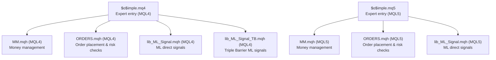
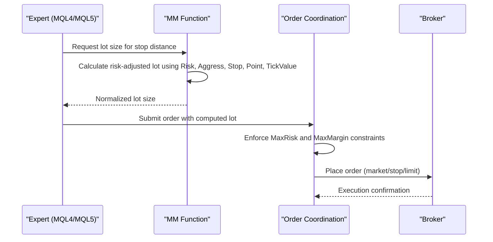
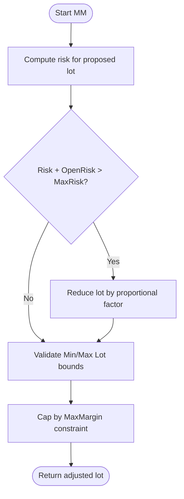
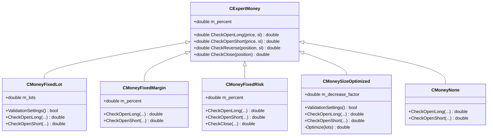
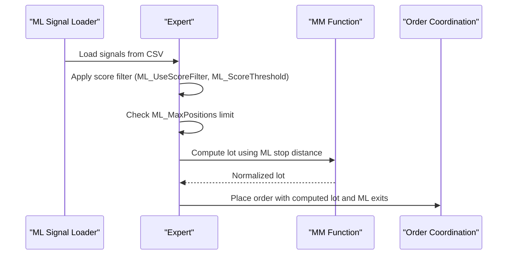
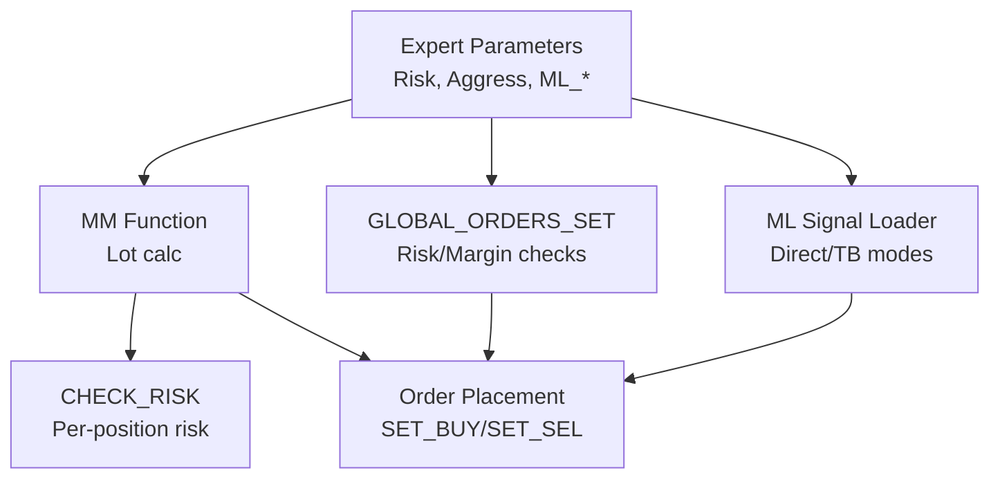

# Position Sizing Algorithms

<cite>
**Referenced Files in This Document**
- [$o$imple.mq4](file://MT/MQL4/Experts/$o$imple.mq4)
- [$o$imple.mq5](file://MT/MQL5/Experts/$o$imple.mq5)
- [MM.mqh](file://MT/MQL4/Include/MM.mqh)
- [MM.mqh](file://MT/MQL5/Include/MM.mqh)
- [ORDERS.mqh](file://MT/MQL4/Include/ORDERS.mqh)
- [ORDERS.mqh](file://MT/MQL5/Include/ORDERS.mqh)
- [MAIN.mqh](file://MT/MQL4/Include/MAIN.mqh)
- [lib_ML_Signal.mqh](file://MT/MQL4/Include/lib_ML_Signal.mqh)
- [lib_ML_Signal.mqh](file://MT/MQL5/Include/lib_ML_Signal.mqh)
- [lib_ML_Signal_TB.mqh](file://MT/MQL4/Include/lib_ML_Signal_TB.mqh)
- [MoneyFixedLot.mqh](file://MT/MQL5/Include/Expert/Money/MoneyFixedLot.mqh)
- [MoneyFixedMargin.mqh](file://MT/MQL5/Include/Expert/Money/MoneyFixedMargin.mqh)
- [MoneyFixedRisk.mqh](file://MT/MQL5/Include/Expert/Money/MoneyFixedRisk.mqh)
- [MoneyNone.mqh](file://MT/MQL5/Include/Expert/Money/MoneyNone.mqh)
- [MoneySizeOptimized.mqh](file://MT/MQL5/Include/Expert/Money/MoneySizeOptimized.mqh)
</cite>

## Table of Contents
1. [Introduction](#introduction)
2. [Project Structure](#project-structure)
3. [Core Components](#core-components)
4. [Architecture Overview](#architecture-overview)
5. [Detailed Component Analysis](#detailed-component-analysis)
6. [Dependency Analysis](#dependency-analysis)
7. [Performance Considerations](#performance-considerations)
8. [Troubleshooting Guide](#troubleshooting-guide)
9. [Conclusion](#conclusion)

## Introduction
This document explains the position sizing algorithms used by the SoSimple expert advisor, focusing on how risk is calculated, how money management modes influence position sizing, and how machine learning signal strength affects trade sizing. It covers:
- The MAX_RISK parameter (10%) and its role in constraining total risk exposure
- Money management modes: MoneyFixedLot, MoneyFixedMargin, MoneyFixedRisk, MoneyNone, and MoneySizeOptimized
- The Risk parameter's influence on deposit percentage allocation per trade
- Practical examples across different market conditions, account sizes, and volatility scenarios
- Interaction between ML signal strength and position sizing via ML_MinRatio, ML_ScaleK, and related parameters
- Differences between backtesting and real trading environments

## Project Structure
The position sizing logic spans several MQL files:
- Expert entry points define parameters and global risk limits
- Money management routines calculate lot sizes based on risk, account metrics, and instrument specifics
- Order placement and global order coordination enforce risk caps and margin constraints
- Machine learning modules integrate external signals and optional score filters to drive entries and exits

**Diagram sources**
- [$o$imple.mq4:1-149](file://MT/MQL4/Experts/$o$imple.mq4#L1-L149)
- [$o$imple.mq5:1-157](file://MT/MQL5/Experts/$o$imple.mq5#L1-L157)
- [MM.mqh:1-82](file://MT/MQL4/Include/MM.mqh#L1-L82)
- [MM.mqh:1-82](file://MT/MQL5/Include/MM.mqh#L1-L82)
- [ORDERS.mqh:1-401](file://MT/MQL4/Include/ORDERS.mqh#L1-L401)
- [ORDERS.mqh:1-401](file://MT/MQL5/Include/ORDERS.mqh#L1-L401)
- [lib_ML_Signal.mqh:1-951](file://MT/MQL4/Include/lib_ML_Signal.mqh#L1-L951)
- [lib_ML_Signal.mqh:1-951](file://MT/MQL5/Include/lib_ML_Signal.mqh#L1-L951)
- [lib_ML_Signal_TB.mqh:1-215](file://MT/MQL4/Include/lib_ML_Signal_TB.mqh#L1-L215)

**Section sources**
- [$o$imple.mq4:1-149](file://MT/MQL4/Experts/$o$imple.mq4#L1-L149)
- [$o$imple.mq5:1-157](file://MT/MQL5/Experts/$o$imple.mq5#L1-L157)

## Core Components
- MAX_RISK parameter: Defines the maximum allowable risk percentage across all positions in a direction (long or short). The system enforces this cap globally and per-expert.
- MM function: Calculates lot size based on risk, stop distance, point value, and tick value, with bounds checking against minimum/maximum lot sizes.
- MONEY MANAGEMENT MODES: MQL5 provides dedicated money management classes for fixed lot, fixed margin, fixed risk, none, and optimized sizing.
- ML SIGNAL INTEGRATION: ML signals from CSV feed entries/exits; optional score filtering and multi-position support; ML parameters influence stop/target distances and exit timing.

Key parameters influencing position sizing:
- Risk (percent): Deposit percentage allocated per trade when Risk > 0
- Aggress: Multiplier applied to risk in MM calculations
- ML_MinRatio, ML_MaxRatio, ML_ScaleK, ML_Min_SL_ATR: Control ML-driven stop distances and R:R scaling
- ML_MaxPositions: Allows multiple concurrent ML positions
- ML_TakeProfitATR, ML_TrailATR, ML_HoldBars: Control exit mechanics for ML direct mode

**Section sources**
- [MM.mqh:1-82](file://MT/MQL4/Include/MM.mqh#L1-L82)
- [MM.mqh:1-82](file://MT/MQL5/Include/MM.mqh#L1-L82)
- [ORDERS.mqh:258-277](file://MT/MQL4/Include/ORDERS.mqh#L258-L277)
- [lib_ML_Signal.mqh:306-387](file://MT/MQL4/Include/lib_ML_Signal.mqh#L306-L387)
- [lib_ML_Signal.mqh:150-157](file://MT/MQL5/Include/lib_ML_Signal.mqh#L150-L157)

## Architecture Overview
The position sizing pipeline integrates expert parameters, money management, and order coordination:

**Diagram sources**
- [MM.mqh:1-30](file://MT/MQL4/Include/MM.mqh#L1-L30)
- [ORDERS.mqh:258-322](file://MT/MQL4/Include/ORDERS.mqh#L258-L322)

## Detailed Component Analysis

### MAX_RISK Parameter and Risk Enforcement
- MAX_RISK is defined as 10% in both MQL4 and MQL5 expert files.
- The system computes the total risk across pending/new orders and compares it to MaxRisk, reducing lot sizes proportionally if needed.
- Per-position risk is recalculated using CHECK_RISK to ensure compliance.

**Diagram sources**
- [MM.mqh:1-30](file://MT/MQL4/Include/MM.mqh#L1-L30)
- [ORDERS.mqh:258-277](file://MT/MQL4/Include/ORDERS.mqh#L258-L277)

**Section sources**
- [$o$imple.mq4:1-10](file://MT/MQL4/Experts/$o$imple.mq4#L1-L10)
- [$o$imple.mq5:1-10](file://MT/MQL5/Experts/$o$imple.mq5#L1-L10)
- [MM.mqh:33-37](file://MT/MQL4/Include/MM.mqh#L33-L37)
- [ORDERS.mqh:258-277](file://MT/MQL4/Include/ORDERS.mqh#L258-L277)

### Money Management Modes (MQL5)
The MQL5 money management framework provides distinct sizing approaches:

- MoneyFixedLot: Fixed lot size regardless of risk or margin
- MoneyFixedMargin: Percent of margin used for position sizing
- MoneyFixedRisk: Percent of account risk used for sizing
- MoneySizeOptimized: Optimized sizing with a decrease factor
- MoneyNone: Minimal lot sizing (no optimization)

**Diagram sources**
- [MoneyFixedLot.mqh:20-51](file://MT/MQL5/Include/Expert/Money/MoneyFixedLot.mqh#L20-L51)
- [MoneyFixedMargin.mqh:19-76](file://MT/MQL5/Include/Expert/Money/MoneyFixedMargin.mqh#L19-L76)
- [MoneyFixedRisk.mqh:23-94](file://MT/MQL5/Include/Expert/Money/MoneyFixedRisk.mqh#L23-L94)
- [MoneySizeOptimized.mqh:21-86](file://MT/MQL5/Include/Expert/Money/MoneySizeOptimized.mqh#L21-L86)
- [MoneyNone.mqh:53-71](file://MT/MQL5/Include/Expert/Money/MoneyNone.mqh#L53-L71)

**Section sources**
- [MoneyFixedLot.mqh:20-51](file://MT/MQL5/Include/Expert/Money/MoneyFixedLot.mqh#L20-L51)
- [MoneyFixedMargin.mqh:19-76](file://MT/MQL5/Include/Expert/Money/MoneyFixedMargin.mqh#L19-L76)
- [MoneyFixedRisk.mqh:23-94](file://MT/MQL5/Include/Expert/Money/MoneyFixedRisk.mqh#L23-L94)
- [MoneySizeOptimized.mqh:21-86](file://MT/MQL5/Include/Expert/Money/MoneySizeOptimized.mqh#L21-L86)
- [MoneyNone.mqh:53-71](file://MT/MQL5/Include/Expert/Money/MoneyNone.mqh#L53-L71)

### Risk Parameter and Deposit Percentage Allocation
- When Risk > 0, the system calculates lot size based on a percentage of the deposit allocated per trade.
- The MM function multiplies the deposit by Risk × Aggress and divides by the stop distance measured in point/tick value units.
- In backtesting, when Risk = 0, a default small lot (0.1) is used for order placement.

Practical implications:
- Higher Risk increases per-trade exposure but is capped by MAX_RISK and instrument constraints.
- Aggress acts as a multiplier to increase/decrease effective risk within the MM calculation.

**Section sources**
- [MM.mqh:1-30](file://MT/MQL4/Include/MM.mqh#L1-L30)
- [MM.mqh:1-30](file://MT/MQL5/Include/MM.mqh#L1-L30)
- [ORDERS.mqh:9-13](file://MT/MQL4/Include/ORDERS.mqh#L9-L13)

### ML Signal Strength and Position Sizing
ML-driven entries use external CSV signals with optional score filtering and multi-position support. Key parameters:
- ML_MinRatio: Minimum acceptable signal strength ratio; below this threshold, entries are skipped
- ML_MaxRatio: Optional upper bound on ratio; entries exceeding this may be filtered out
- ML_ScaleK: Multiplier converting prediction-derived targets into ATR-based stops
- ML_Min_SL_ATR: Minimum stop distance in ATR units
- ML_MaxPositions: Number of concurrent ML positions allowed
- ML_TakeProfitATR, ML_TrailATR, ML_HoldBars: Exit controls for ML direct mode

**Diagram sources**
- [lib_ML_Signal.mqh:306-387](file://MT/MQL4/Include/lib_ML_Signal.mqh#L306-L387)
- [lib_ML_Signal.mqh:150-157](file://MT/MQL5/Include/lib_ML_Signal.mqh#L150-L157)

**Section sources**
- [lib_ML_Signal.mqh:306-387](file://MT/MQL4/Include/lib_ML_Signal.mqh#L306-L387)
- [lib_ML_Signal.mqh:150-157](file://MT/MQL5/Include/lib_ML_Signal.mqh#L150-L157)
- [lib_ML_Signal_TB.mqh:118-200](file://MT/MQL4/Include/lib_ML_Signal_TB.mqh#L118-L200)

### Practical Position Sizing Examples

Example 1: Standard risk-based sizing
- Account balance: $50,000
- Risk = 2.0%, Aggress = 1.0
- Stop distance = 20 ATR
- Instrument point/tick value yields a base lot
- MM normalizes to lot step and applies bounds
- Total risk across pending orders ≤ 10% (MAX_RISK)

Example 2: High-volatility scenario
- Same parameters, but Stop = 50 ATR
- MM reduces lot to maintain risk within 10%
- If multiple pending orders exceed risk, global correction proportionally reduces all new/later orders

Example 3: ML direct mode with strong signals
- ML_MinRatio = 3.5, ML_ScaleK = 20.0
- Entry signal ratio = 5.0 → accepted
- Stop = max(ML_Up12[idx] × ML_ScaleK × ATR, ML_Min_SL_ATR × ATR)
- If ML_MaxPositions = 3 and two positions already open, third position is blocked until existing positions close

Example 4: Backtesting vs. real trading
- Backtesting: When Risk = 0, default lot 0.1 is used for order placement
- Real trading: MM is invoked with actual spreads, broker slippage, and CHECK_RISK enforced

**Section sources**
- [MM.mqh:1-30](file://MT/MQL4/Include/MM.mqh#L1-L30)
- [ORDERS.mqh:9-13](file://MT/MQL4/Include/ORDERS.mqh#L9-L13)
- [lib_ML_Signal.mqh:306-387](file://MT/MQL4/Include/lib_ML_Signal.mqh#L306-L387)

### Backtesting vs. Real Trading Environment
- Backtesting: Risk = 0 triggers default lot sizing; MM still validates but uses simplified assumptions
- Real trading: MM enforces CHECK_RISK against actual broker conditions; global order coordination adjusts pending orders to stay within MaxRisk and MaxMargin

**Section sources**
- [ORDERS.mqh:258-322](file://MT/MQL4/Include/ORDERS.mqh#L258-L322)
- [MM.mqh:24-29](file://MT/MQL4/Include/MM.mqh#L24-L29)

## Dependency Analysis
Position sizing depends on:
- Expert parameters (Risk, Aggress, ML_* settings)
- Money management functions (MM, CHECK_RISK, DEPO)
- Order coordination (global order enforcement, margin/risk checks)
- ML signal loader (CSV parsing, score filtering, exit logic)

**Diagram sources**
- [MM.mqh:1-82](file://MT/MQL4/Include/MM.mqh#L1-L82)
- [ORDERS.mqh:258-322](file://MT/MQL4/Include/ORDERS.mqh#L258-L322)
- [lib_ML_Signal.mqh:306-387](file://MT/MQL4/Include/lib_ML_Signal.mqh#L306-L387)

**Section sources**
- [MM.mqh:1-82](file://MT/MQL4/Include/MM.mqh#L1-L82)
- [ORDERS.mqh:258-322](file://MT/MQL4/Include/ORDERS.mqh#L258-L322)
- [lib_ML_Signal.mqh:306-387](file://MT/MQL4/Include/lib_ML_Signal.mqh#L306-L387)

## Performance Considerations
- MM computation is O(1) per order; global order coordination scales with number of pending orders
- CSV-based ML loading is efficient with binary search for signal lookup
- Frequent CHECK_OUT in real trading may trigger global recalculation; avoid unnecessary parameter changes to minimize overhead

## Troubleshooting Guide
Common issues and resolutions:
- Lot reduced to minimum: Verify Risk, Aggress, Stop distance, and instrument lot step
- Orders not placed: CHECK_RISK exceeds MaxRisk; reduce Risk or increase account equity
- ML positions blocked: ML_MaxPositions reached; wait for exits or increase limit
- Score-filtered entries: Adjust ML_ScoreThreshold or disable ML_UseScoreFilter

**Section sources**
- [MM.mqh:18-29](file://MT/MQL4/Include/MM.mqh#L18-L29)
- [ORDERS.mqh:258-277](file://MT/MQL4/Include/ORDERS.mqh#L258-L277)
- [lib_ML_Signal.mqh:631-666](file://MT/MQL4/Include/lib_ML_Signal.mqh#L631-L666)

## Conclusion
SoSimple’s position sizing combines explicit risk caps (MAX_RISK), flexible money management modes, and ML-driven entry/exit logic. The Risk parameter directly controls deposit percentage allocation per trade, while ML parameters scale stops and R:R based on signal strength. Real trading adds dynamic risk checks and global order coordination to ensure safety within margin and risk constraints, whereas backtesting simplifies defaults for repeatability.