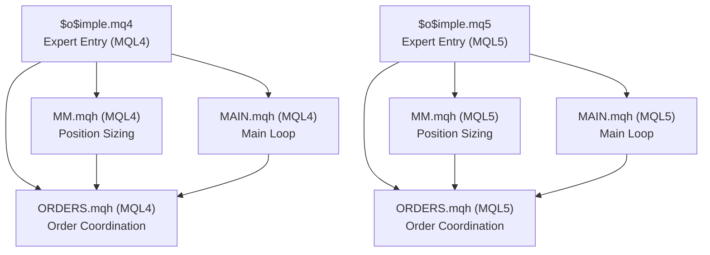
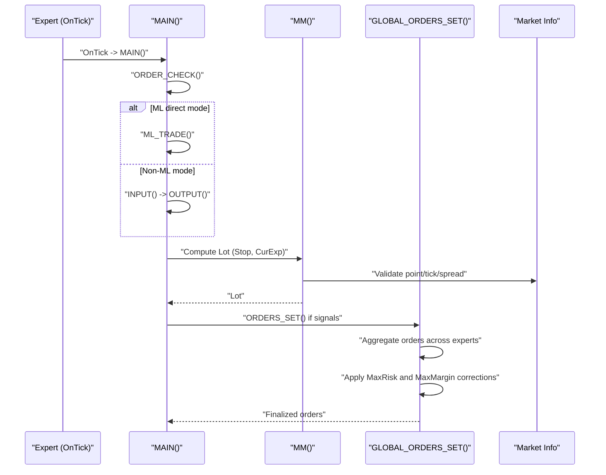
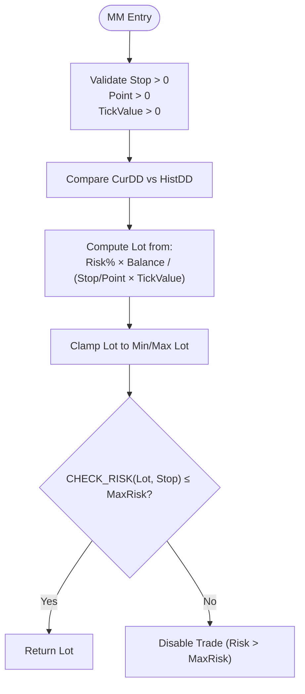
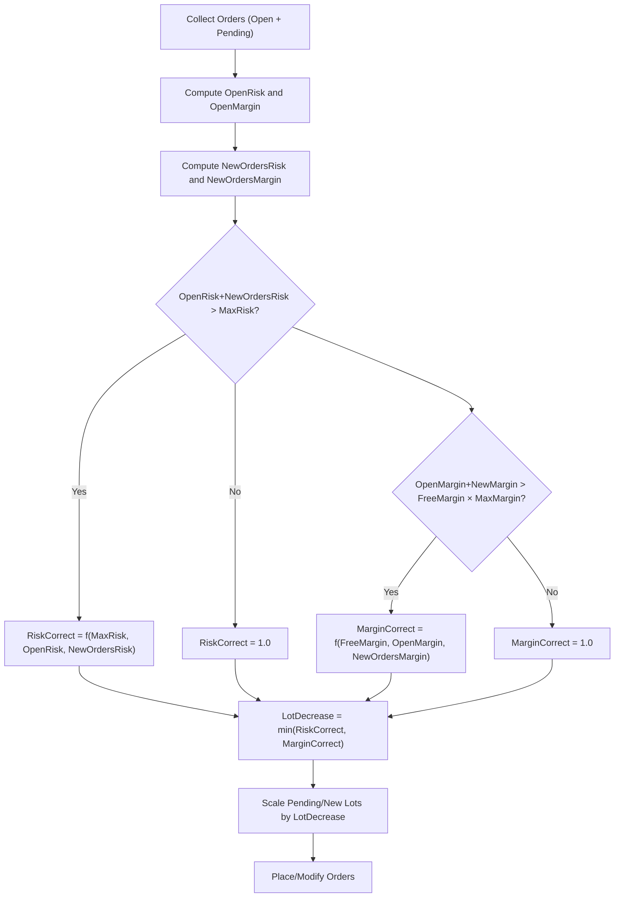
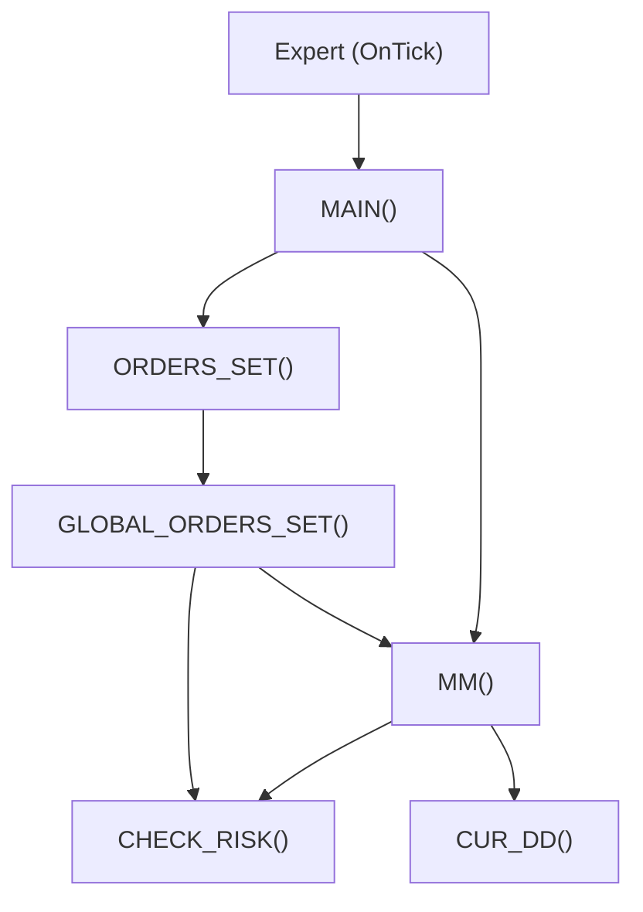

# Risk Controls and Controls

<cite>
**Referenced Files in This Document**
- [$o$imple.mq4](file://MT/MQL4/Experts/$o$imple.mq4)
- [$o$imple.mq5](file://MT/MQL5/Experts/$o$imple.mq5)
- [MM.mqh](file://MT/MQL4/Include/MM.mqh)
- [MM.mqh](file://MT/MQL5/Include/MM.mqh)
- [ORDERS.mqh](file://MT/MQL4/Include/ORDERS.mqh)
- [ORDERS.mqh](file://MT/MQL5/Include/ORDERS.mqh)
- [MAIN.mqh](file://MT/MQL4/Include/MAIN.mqh)
- [MAIN.mqh](file://MT/MQL5/Include/MAIN.mqh)
- [Trade.mqh](file://MT/MQL5/Include/Trade/Trade.mqh)
</cite>

## Table of Contents
1. [Introduction](#introduction)
2. [Project Structure](#project-structure)
3. [Core Components](#core-components)
4. [Architecture Overview](#architecture-overview)
5. [Detailed Component Analysis](#detailed-component-analysis)
6. [Dependency Analysis](#dependency-analysis)
7. [Performance Considerations](#performance-considerations)
8. [Troubleshooting Guide](#troubleshooting-guide)
9. [Conclusion](#conclusion)

## Introduction
This document explains the risk control mechanisms implemented in the SoSimple expert advisor across MetaQuotes platforms (MQL4 and MQL5). It focuses on:
- Maximum risk parameters (MAX_RISK, MaxRisk, MaxMargin)
- Position sizing via Money Management (MM) and CHECK_RISK
- Drawdown monitoring and internal risk checks
- Automatic position closure and global order coordination
- Margin management and correlation controls
- Platform-specific risk handling differences
- Interaction between internal risk controls and external ML signal quality filters

## Project Structure
The risk control logic is distributed across:
- Expert entry points (MQL4 and MQL5)
- Money Management (MM) routines
- Order lifecycle and global order coordination
- Main expert loop and ML integration points

**Diagram sources**
- [$o$imple.mq4:123-132](file://MT/MQL4/Experts/$o$imple.mq4#L123-L132)
- [$o$imple.mq5:137-147](file://MT/MQL5/Experts/$o$imple.mq5#L137-L147)
- [MM.mqh:1-30](file://MT/MQL4/Include/MM.mqh#L1-L30)
- [MM.mqh:1-30](file://MT/MQL5/Include/MM.mqh#L1-L30)
- [ORDERS.mqh:5-13](file://MT/MQL4/Include/ORDERS.mqh#L5-L13)
- [ORDERS.mqh:5-13](file://MT/MQL5/Include/ORDERS.mqh#L5-L13)
- [MAIN.mqh:117-143](file://MT/MQL4/Include/MAIN.mqh#L117-L143)
- [MAIN.mqh:131-143](file://MT/MQL5/Include/MAIN.mqh#L131-L143)

**Section sources**
- [$o$imple.mq4:1-149](file://MT/MQL4/Experts/$o$imple.mq4#L1-L149)
- [$o$imple.mq5:1-157](file://MT/MQL5/Experts/$o$imple.mq5#L1-L157)

## Core Components
- Maximum risk parameters:
  - MAX_RISK constant defines the per-expert risk cap.
  - MaxRisk (percent of account balance) and MaxMargin (fraction of free margin) act as global caps during order placement.
- Money Management (MM):
  - Computes lot sizes considering stop distance, point/tick value, and risk percentage.
  - Validates stop distance and market info prerequisites.
  - Enforces CurDD vs historical drawdown checks.
- Order Coordination (GLOBAL_ORDERS_SET):
  - Aggregates new and pending orders across experts.
  - Applies risk and margin corrections to avoid exceeding MaxRisk and MaxMargin.
  - Normalizes and reduces lot sizes when necessary.
- Drawdown Monitoring:
  - CUR_DD computes the expert’s recent drawdown against peak profit in the current test window.
- ML Signal Quality Filters:
  - ML_* parameters gate and refine ML-driven entries/exits and position sizing.

**Section sources**
- [$o$imple.mq4:1-14](file://MT/MQL4/Experts/$o$imple.mq4#L1-L14)
- [$o$imple.mq4:87-89](file://MT/MQL4/Experts/$o$imple.mq4#L87-L89)
- [$o$imple.mq5:1-4](file://MT/MQL5/Experts/$o$imple.mq5#L1-L4)
- [$o$imple.mq5:77-79](file://MT/MQL5/Experts/$o$imple.mq5#L77-L79)
- [MM.mqh:1-30](file://MT/MQL4/Include/MM.mqh#L1-L30)
- [MM.mqh:1-30](file://MT/MQL5/Include/MM.mqh#L1-L30)
- [ORDERS.mqh:259-278](file://MT/MQL4/Include/ORDERS.mqh#L259-L278)
- [ORDERS.mqh:259-278](file://MT/MQL5/Include/ORDERS.mqh#L259-L278)
- [MAIN.mqh:117-143](file://MT/MQL4/Include/MAIN.mqh#L117-L143)
- [MAIN.mqh:131-143](file://MT/MQL5/Include/MAIN.mqh#L131-L143)

## Architecture Overview
The risk control pipeline integrates position sizing, drawdown checks, and global order coordination.

**Diagram sources**
- [$o$imple.mq4:123-132](file://MT/MQL4/Experts/$o$imple.mq4#L123-L132)
- [$o$imple.mq5:137-147](file://MT/MQL5/Experts/$o$imple.mq5#L137-L147)
- [MAIN.mqh:117-143](file://MT/MQL4/Include/MAIN.mqh#L117-L143)
- [MAIN.mqh:131-143](file://MT/MQL5/Include/MAIN.mqh#L131-L143)
- [MM.mqh:1-30](file://MT/MQL4/Include/MM.mqh#L1-L30)
- [MM.mqh:1-30](file://MT/MQL5/Include/MM.mqh#L1-L30)
- [ORDERS.mqh:184-322](file://MT/MQL4/Include/ORDERS.mqh#L184-L322)
- [ORDERS.mqh:184-322](file://MT/MQL5/Include/ORDERS.mqh#L184-L322)

## Detailed Component Analysis

### Maximum Risk Parameters and Limits
- MAX_RISK: Constant risk cap per expert.
- MaxRisk: Percent of account balance reserved for risk per expert.
- MaxMargin: Fraction of free margin allowed for simultaneous orders.
- These parameters are initialized in the expert globals and enforced during MM and GLOBAL_ORDERS_SET.

Implementation highlights:
- Expert globals define MaxRisk and MaxMargin.
- MM enforces risk caps and validates prerequisites.
- GLOBAL_ORDERS_SET recalculates risk/margin contributions and applies corrective lot scaling.

**Section sources**
- [$o$imple.mq4:1-14](file://MT/MQL4/Experts/$o$imple.mq4#L1-L14)
- [$o$imple.mq4:87-89](file://MT/MQL4/Experts/$o$imple.mq4#L87-L89)
- [$o$imple.mq5:1-4](file://MT/MQL5/Experts/$o$imple.mq5#L1-L4)
- [$o$imple.mq5:77-79](file://MT/MQL5/Experts/$o$imple.mq5#L77-L79)
- [MM.mqh:1-30](file://MT/MQL4/Include/MM.mqh#L1-L30)
- [MM.mqh:1-30](file://MT/MQL5/Include/MM.mqh#L1-L30)
- [ORDERS.mqh:259-278](file://MT/MQL4/Include/ORDERS.mqh#L259-L278)
- [ORDERS.mqh:259-278](file://MT/MQL5/Include/ORDERS.mqh#L259-L278)

### Position Sizing and CHECK_RISK
- MM calculates lot size from risk%, stop distance, point, and tick value.
- CHECK_RISK estimates realized risk percentage post-lot computation.
- MM also validates stop distance and market info prerequisites and compares CurDD to historical drawdown.

**Diagram sources**
- [MM.mqh:1-30](file://MT/MQL4/Include/MM.mqh#L1-L30)
- [MM.mqh:1-30](file://MT/MQL5/Include/MM.mqh#L1-L30)

**Section sources**
- [MM.mqh:1-30](file://MT/MQL4/Include/MM.mqh#L1-L30)
- [MM.mqh:1-30](file://MT/MQL5/Include/MM.mqh#L1-L30)

### Drawdown Monitoring and CurDD
- CUR_DD measures the expert’s recent drawdown against the peak profit recorded during the current test period.
- MM uses CurDD to prevent further risky orders when current drawdown exceeds historical thresholds.

Key behaviors:
- CUR_DD aggregates realized profits from orders after the test end time.
- MM compares CurDD to EXP[].HistDD and halts order placement if exceeded.

**Section sources**
- [MM.mqh:40-50](file://MT/MQL4/Include/MM.mqh#L40-L50)
- [MM.mqh:40-50](file://MT/MQL5/Include/MM.mqh#L40-L50)

### Global Order Coordination and Risk Correction
- GLOBAL_ORDERS_SET consolidates:
  - Pending orders from all experts (via global variables)
  - Existing open/stop/limit orders
- It computes:
  - OpenRisk and OpenMargin (existing positions)
  - NewOrdersRisk and NewOrdersMargin (pending/new orders)
- Applies two correction factors:
  - RiskCorrect: proportionally reduce risk if total risk exceeds MaxRisk
  - MarginCorrect: proportionally reduce risk if total margin exceeds MaxMargin
- Final LotDecrease is the minimum of RiskCorrect and MarginCorrect, applied to pending/new orders.

**Diagram sources**
- [ORDERS.mqh:184-322](file://MT/MQL4/Include/ORDERS.mqh#L184-L322)
- [ORDERS.mqh:184-322](file://MT/MQL5/Include/ORDERS.mqh#L184-L322)

**Section sources**
- [ORDERS.mqh:184-322](file://MT/MQL4/Include/ORDERS.mqh#L184-L322)
- [ORDERS.mqh:184-322](file://MT/MQL5/Include/ORDERS.mqh#L184-L322)

### Automatic Position Closure Procedures
- MAIN triggers MODIFY() to adjust or cancel pending orders and close open positions when targets/stops are hit or when conditions change.
- ML modes (direct and triple barrier) integrate with closing logic via ML_* parameters and trailing stops.

Operational flow:
- MAIN calls ORDER_CHECK() to refresh open/pending order state.
- MODIFY() deletes or modifies pending orders and closes open positions as needed.
- ML-specific exits (ML_ExitEnabled, ML_ExitThreshold, ML_TrailATR, ML_TakeProfitATR) influence closing decisions.

**Section sources**
- [MAIN.mqh:117-143](file://MT/MQL4/Include/MAIN.mqh#L117-L143)
- [MAIN.mqh:131-143](file://MT/MQL5/Include/MAIN.mqh#L131-L143)
- [ORDERS.mqh:66-130](file://MT/MQL4/Include/ORDERS.mqh#L66-L130)
- [ORDERS.mqh:66-130](file://MT/MQL5/Include/ORDERS.mqh#L66-L130)

### Margin Management and Platform Differences
- Both MQL4 and MQL5 implement identical risk control logic for MM and GLOBAL_ORDERS_SET.
- Differences:
  - MQL5 includes a dedicated Trade API (Trade.mqh) for order operations, which can impact partial fills and hedging behavior.
  - MQL5’s MONEY MANAGEMENT interface supports additional money management classes (e.g., fixed margin), enabling alternative strategies.

Practical implications:
- Use Trade.mqh for robust order handling under MQL5.
- MONEY MANAGEMENT classes can be leveraged for advanced margin strategies.

**Section sources**
- [Trade.mqh:434-474](file://MT/MQL5/Include/Trade/Trade.mqh#L434-L474)
- [$o$imple.mq5:121-123](file://MT/MQL5/Experts/$o$imple.mq5#L121-L123)

### Correlation Controls Between Positions
- GLOBAL_ORDERS_SET aggregates orders across all experts and applies unified risk/margin checks.
- This acts as a portfolio-level constraint: cumulative risk and margin across experts are monitored and adjusted collectively.
- While explicit correlation metrics are not present in the code, the global aggregation effectively prevents over-concentration in any single direction or symbol.

**Section sources**
- [ORDERS.mqh:184-322](file://MT/MQL4/Include/ORDERS.mqh#L184-L322)
- [ORDERS.mqh:184-322](file://MT/MQL5/Include/ORDERS.mqh#L184-L322)

### Emergency Shutdown Procedures
- GLOBAL_ORDERS_SET disables new pending orders when either:
  - Total risk exceeds MaxRisk and existing risk equals or exceeds MaxRisk, or
  - Total margin exceeds FreeMargin × MaxMargin.
- In these cases, pending orders are canceled (lot set to zero) to prevent further exposure.

**Section sources**
- [ORDERS.mqh:264-276](file://MT/MQL4/Include/ORDERS.mqh#L264-L276)
- [ORDERS.mqh:264-276](file://MT/MQL5/Include/ORDERS.mqh#L264-L276)

### Interaction Between Internal Risk Controls and External ML Signal Quality Filters
- ML_* parameters govern ML-driven trading behavior:
  - ML_MinRatio, ML_MaxRatio, ML_MaxRR, ML_RR_Mode, ML_RR_Cap: shape reward-to-risk behavior and caps.
  - ML_ScaleK, ML_Min_SL_ATR: influence stop distances derived from ML predictions.
  - ML_BypassTrend, ML_ExitEnabled, ML_ExitThreshold: control trend filtering and exit logic.
  - ML_Filter3, ML_Filter6, ML_UseScoreFilter, ML_ScoreThreshold: apply external signal quality filters.
  - ML_MaxPositions: enable multiple concurrent ML positions.
- Internal risk controls (MM, CUR_DD, GLOBAL_ORDERS_SET) operate independently but coordinate with ML decisions:
  - ML signals trigger ORDERS_SET; MM scales lots; GLOBAL_ORDERS_SET enforces portfolio-level risk.
  - ML filters can reduce the number of signals, indirectly lowering risk exposure.

**Section sources**
- [$o$imple.mq4:58-81](file://MT/MQL4/Experts/$o$imple.mq4#L58-L81)
- [$o$imple.mq5:58-99](file://MT/MQL5/Experts/$o$imple.mq5#L58-L99)
- [MAIN.mqh:117-143](file://MT/MQL4/Include/MAIN.mqh#L117-L143)
- [MAIN.mqh:131-143](file://MT/MQL5/Include/MAIN.mqh#L131-L143)
- [MM.mqh:1-30](file://MT/MQL4/Include/MM.mqh#L1-L30)
- [MM.mqh:1-30](file://MT/MQL5/Include/MM.mqh#L1-L30)
- [ORDERS.mqh:184-322](file://MT/MQL4/Include/ORDERS.mqh#L184-L322)
- [ORDERS.mqh:184-322](file://MT/MQL5/Include/ORDERS.mqh#L184-L322)

## Dependency Analysis

**Diagram sources**
- [MAIN.mqh:117-143](file://MT/MQL4/Include/MAIN.mqh#L117-L143)
- [MAIN.mqh:131-143](file://MT/MQL5/Include/MAIN.mqh#L131-L143)
- [ORDERS.mqh:5-13](file://MT/MQL4/Include/ORDERS.mqh#L5-L13)
- [ORDERS.mqh:5-13](file://MT/MQL5/Include/ORDERS.mqh#L5-L13)
- [MM.mqh:1-30](file://MT/MQL4/Include/MM.mqh#L1-L30)
- [MM.mqh:1-30](file://MT/MQL5/Include/MM.mqh#L1-L30)

**Section sources**
- [MAIN.mqh:117-143](file://MT/MQL4/Include/MAIN.mqh#L117-L143)
- [MAIN.mqh:131-143](file://MT/MQL5/Include/MAIN.mqh#L131-L143)
- [ORDERS.mqh:5-13](file://MT/MQL4/Include/ORDERS.mqh#L5-L13)
- [ORDERS.mqh:5-13](file://MT/MQL5/Include/ORDERS.mqh#L5-L13)
- [MM.mqh:1-30](file://MT/MQL4/Include/MM.mqh#L1-L30)
- [MM.mqh:1-30](file://MT/MQL5/Include/MM.mqh#L1-L30)

## Performance Considerations
- Risk checks occur on each tick and during order placement; keep parameter updates minimal to reduce overhead.
- Using ML filters can reduce the number of signals and thus lower transaction costs and risk concentration.
- Hedging and partial fills (MQL5 Trade API) can improve capital efficiency but require careful monitoring.

## Troubleshooting Guide
Common issues and resolutions:
- Risk disabled (Lot = 0):
  - Cause: CurDD > HistDD or CHECK_RISK > MaxRisk.
  - Resolution: Reduce risk parameters or improve signal quality; monitor CurDD.
- Orders not placed:
  - Cause: RiskCorrect or MarginCorrect reduced lot below MinLot or MaxRisk exceeded.
  - Resolution: Lower MaxRisk, increase MaxMargin, or reduce pending order count.
- Pending orders canceled:
  - Cause: GLOBAL_ORDERS_SET detected risk/margin overload.
  - Resolution: Reduce new order risk contribution or wait for margin to recover.
- Spread-related failures:
  - Cause: StopLevel proximity to market price.
  - Resolution: Adjust ML_* parameters to ensure adequate stop distances.

**Section sources**
- [MM.mqh:1-30](file://MT/MQL4/Include/MM.mqh#L1-L30)
- [MM.mqh:1-30](file://MT/MQL5/Include/MM.mqh#L1-L30)
- [ORDERS.mqh:259-278](file://MT/MQL4/Include/ORDERS.mqh#L259-L278)
- [ORDERS.mqh:259-278](file://MT/MQL5/Include/ORDERS.mqh#L259-L278)

## Conclusion
SoSimple’s risk controls combine per-expert risk caps (MAX_RISK, MaxRisk), dynamic position sizing (MM/CHECK_RISK), and portfolio-level coordination (GLOBAL_ORDERS_SET) to manage exposure across experts and instruments. Drawdown monitoring (CUR_DD) and margin enforcement (MaxMargin) provide layered protection. ML signal quality filters complement internal controls by reducing low-quality entries. Tuning ML parameters and understanding platform-specific behaviors (MQL5 Trade API) enables robust risk-adjusted performance across market regimes.