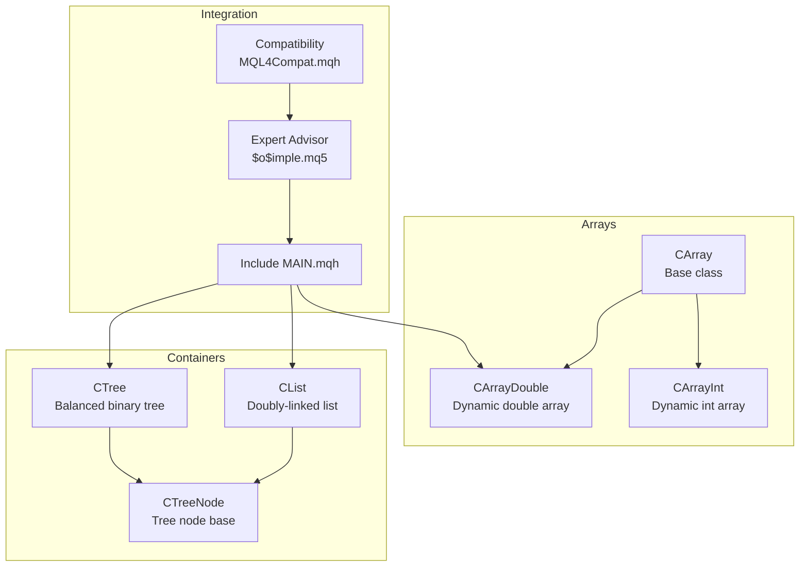
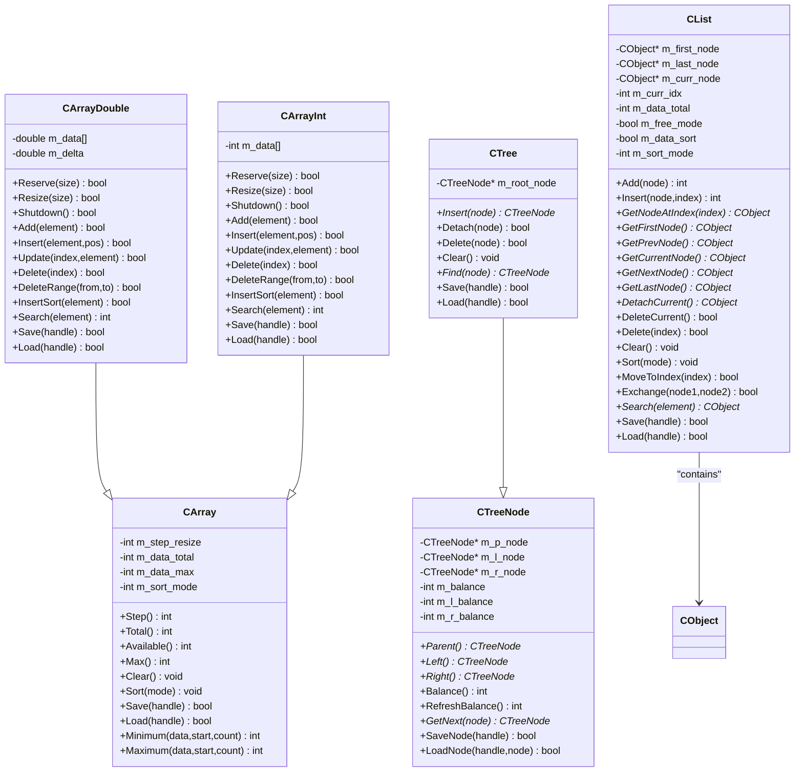
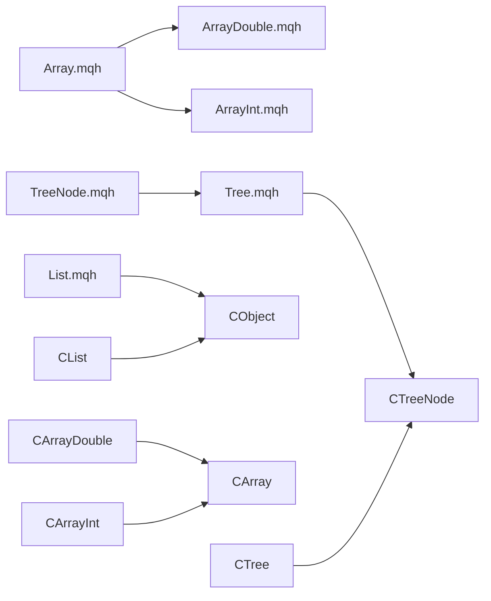

# Array Management Systems

<cite>
**Referenced Files in This Document**
- [Array.mqh](file://MT/MQL5/Include/Arrays/Array.mqh)
- [ArrayDouble.mqh](file://MT/MQL5/Include/Arrays/ArrayDouble.mqh)
- [ArrayInt.mqh](file://MT/MQL5/Include/Arrays/ArrayInt.mqh)
- [List.mqh](file://MT/MQL5/Include/Arrays/List.mqh)
- [Tree.mqh](file://MT/MQL5/Include/Arrays/Tree.mqh)
- [TreeNode.mqh](file://MT/MQL5/Include/Arrays/TreeNode.mqh)
- [StdLibErr.mqh](file://MT/MQL4/Include/StdLibErr.mqh)
- [$o$imple.mq5](file://MT/MQL5/Experts/$o$imple.mq5)
- [MAIN.mqh](file://MT/MQL5/Include/MAIN.mqh)
- [MQL4Compat.mqh](file://MT/MQL5/Include/MQL4Compat.mqh)
</cite>

## Table of Contents
1. [Introduction](#introduction)
2. [Project Structure](#project-structure)
3. [Core Components](#core-components)
4. [Architecture Overview](#architecture-overview)
5. [Detailed Component Analysis](#detailed-component-analysis)
6. [Dependency Analysis](#dependency-analysis)
7. [Performance Considerations](#performance-considerations)
8. [Troubleshooting Guide](#troubleshooting-guide)
9. [Conclusion](#conclusion)

## Introduction
This document describes the MetaTrader array management systems implemented in the repository. It focuses on the custom dynamic array classes, linked lists, and binary trees used for trading data handling. The documentation covers array types, initialization, dynamic resizing, memory allocation strategies, data manipulation functions, bounds checking, error handling, and integration patterns with trading components.

## Project Structure
The array management systems are primarily located under the MQL5 Include/Arrays directory. They provide typed dynamic containers that wrap MQL5 arrays with additional capabilities such as automatic resizing, sorting, searching, and persistence to files. The system also includes a linked list and a balanced binary tree for specialized use cases.

**Diagram sources**
- [Array.mqh:12-46](file://MT/MQL5/Include/Arrays/Array.mqh#L12-L46)
- [ArrayDouble.mqh:12-71](file://MT/MQL5/Include/Arrays/ArrayDouble.mqh#L12-L71)
- [ArrayInt.mqh:12-67](file://MT/MQL5/Include/Arrays/ArrayInt.mqh#L12-L67)
- [List.mqh:13-68](file://MT/MQL5/Include/Arrays/List.mqh#L13-L68)
- [Tree.mqh:13-41](file://MT/MQL5/Include/Arrays/Tree.mqh#L13-L41)
- [TreeNode.mqh:12-48](file://MT/MQL5/Include/Arrays/TreeNode.mqh#L12-L48)
- [$o$imple.mq5:113-128](file://MT/MQL5/Experts/$o$imple.mq5#L113-L128)
- [MAIN.mqh:1-200](file://MT/MQL5/Include/MAIN.mqh#L1-L200)
- [MQL4Compat.mqh:1-200](file://MT/MQL5/Include/MQL4Compat.mqh#L1-L200)

**Section sources**
- [Array.mqh:1-183](file://MT/MQL5/Include/Arrays/Array.mqh#L1-L183)
- [ArrayDouble.mqh:1-778](file://MT/MQL5/Include/Arrays/ArrayDouble.mqh#L1-L778)
- [ArrayInt.mqh:1-770](file://MT/MQL5/Include/Arrays/ArrayInt.mqh#L1-L770)
- [List.mqh:1-658](file://MT/MQL5/Include/Arrays/List.mqh#L1-L658)
- [Tree.mqh:1-416](file://MT/MQL5/Include/Arrays/Tree.mqh#L1-L416)
- [TreeNode.mqh:1-175](file://MT/MQL5/Include/Arrays/TreeNode.mqh#L1-L175)
- [$o$imple.mq5:113-128](file://MT/MQL5/Experts/$o$imple.mq5#L113-L128)
- [MAIN.mqh:1-200](file://MT/MQL5/Include/MAIN.mqh#L1-L200)
- [MQL4Compat.mqh:1-200](file://MT/MQL5/Include/MQL4Compat.mqh#L1-L200)

## Core Components
- CArray: Base class for dynamic arrays. Manages step size, total and maximum capacity, sorting mode, and provides generic min/max helpers and file I/O header routines.
- CArrayDouble: Dynamic array of doubles with reserve/resize/shutdown, add/insert/update/delete operations, sorted insertion, and binary search with tolerance.
- CArrayInt: Dynamic array of integers with similar operations to CArrayDouble.
- CList: Doubly-linked list of CObject-derived items supporting navigation, insertion/deletion, sorting, and file persistence.
- CTree/CTreeNode: Balanced binary tree of CTreeNode-derived objects with rotation-based balancing and file serialization.

Key capabilities:
- Dynamic resizing with configurable step increments
- Bounds-checked access with error signaling
- Sorting and binary search for ordered data
- File serialization/deserialization for arrays and containers
- Memory cleanup via Shutdown/Clear

**Section sources**
- [Array.mqh:12-183](file://MT/MQL5/Include/Arrays/Array.mqh#L12-L183)
- [ArrayDouble.mqh:12-778](file://MT/MQL5/Include/Arrays/ArrayDouble.mqh#L12-L778)
- [ArrayInt.mqh:12-770](file://MT/MQL5/Include/Arrays/ArrayInt.mqh#L12-L770)
- [List.mqh:13-658](file://MT/MQL5/Include/Arrays/List.mqh#L13-L658)
- [Tree.mqh:13-416](file://MT/MQL5/Include/Arrays/Tree.mqh#L13-L416)
- [TreeNode.mqh:12-175](file://MT/MQL5/Include/Arrays/TreeNode.mqh#L12-L175)

## Architecture Overview
The system is layered:
- Base classes define shared behavior (CArray, CTreeNode)
- Specialized array classes encapsulate typed data and operations (CArrayDouble, CArrayInt)
- Container classes provide higher-level structures (CList, CTree)
- Integration occurs in expert advisors and include files that use these containers for data management

**Diagram sources**
- [Array.mqh:12-183](file://MT/MQL5/Include/Arrays/Array.mqh#L12-L183)
- [ArrayDouble.mqh:12-778](file://MT/MQL5/Include/Arrays/ArrayDouble.mqh#L12-L778)
- [ArrayInt.mqh:12-770](file://MT/MQL5/Include/Arrays/ArrayInt.mqh#L12-L770)
- [TreeNode.mqh:12-175](file://MT/MQL5/Include/Arrays/TreeNode.mqh#L12-L175)
- [Tree.mqh:13-416](file://MT/MQL5/Include/Arrays/Tree.mqh#L13-L416)
- [List.mqh:13-658](file://MT/MQL5/Include/Arrays/List.mqh#L13-L658)

## Detailed Component Analysis

### CArray (Base Dynamic Array)
Responsibilities:
- Tracks step size, total elements, max capacity, and sort mode
- Provides reserve/resize helpers and file header I/O
- Implements generic min/max helpers that delegate to platform-specific functions

Key behaviors:
- Step controls chunked growth during reserve
- Available() indicates free capacity
- Sort delegates to derived classes’ QuickSort
- Minimum/Maximum validate inputs and set user errors on invalid ranges

Usage examples (conceptual):
- Initialize with default step size
- Call Reserve before bulk inserts to minimize reallocations
- Use Sort with a chosen mode to enable binary search variants

**Section sources**
- [Array.mqh:12-183](file://MT/MQL5/Include/Arrays/Array.mqh#L12-L183)

### CArrayDouble (Dynamic Double Array)
Responsibilities:
- Typed dynamic array of doubles with tolerance-based comparisons
- Memory management: Reserve, Resize, Shutdown
- Data manipulation: Add, Insert, Update, Delete, DeleteRange, Shift
- Ordered operations: InsertSort, Binary search variants with tolerance
- File I/O: Save/Load with array length and data

Dynamic resizing:
- Reserve ensures at least size free slots by growing in steps
- Resize rounds up to next step boundary and truncates if shrinking
- Shutdown releases all memory and resets counters

Bounds checking and error handling:
- At returns sentinel value for out-of-range indices
- Many operations return false or -1 on invalid parameters
- Minimum/Maximum set user errors for empty or out-of-range requests

Searching:
- Linear search with tolerance Delta
- Binary search variants for sorted arrays with tolerance support

**Section sources**
- [ArrayDouble.mqh:12-778](file://MT/MQL5/Include/Arrays/ArrayDouble.mqh#L12-L778)

### CArrayInt (Dynamic Integer Array)
Responsibilities:
- Identical interface to CArrayDouble but for integers
- Uses integer-specific min/max helpers

Dynamic resizing and memory:
- Same Reserve/Resize/Shutdown semantics as CArrayDouble

Searching:
- Linear and binary search variants for sorted arrays

**Section sources**
- [ArrayInt.mqh:12-770](file://MT/MQL5/Include/Arrays/ArrayInt.mqh#L12-L770)

### CList (Doubly-Linked List)
Responsibilities:
- Maintains a doubly-linked list of CObject-derived nodes
- Navigation: first/last/current, prev/next, indexed access with internal cursor optimization
- Insertion/deletion at index or current position
- Sorting via QuickSort with custom Compare
- File persistence: writes/loads list size and iterates nodes

Memory management:
- FreeMode controls whether detached nodes are physically deleted
- Clear removes all nodes appropriately

Navigation optimization:
- GetNodeAtIndex optimizes traversal by choosing direction from current position

**Section sources**
- [List.mqh:13-658](file://MT/MQL5/Include/Arrays/List.mqh#L13-L658)

### CTree and CTreeNode (Balanced Binary Tree)
Responsibilities:
- Stores CTreeNode-derived objects in a balanced binary search tree
- Insertion with rebalancing rotations
- Deletion with node replacement and rebalancing
- Find by comparison
- File I/O: pre-order serialization of nodes with directional markers

Balancing:
- RefreshBalance computes subtree heights
- Balance applies AVL-style rotations to maintain balance

**Section sources**
- [TreeNode.mqh:12-175](file://MT/MQL5/Include/Arrays/TreeNode.mqh#L12-L175)
- [Tree.mqh:13-416](file://MT/MQL5/Include/Arrays/Tree.mqh#L13-L416)

### Integration Patterns with Trading Components
- Expert advisors include compatibility and main include files, which in turn reference array and container classes for data management.
- Price arrays and series are simulated via MQL4Compat macros and functions to bridge MQL4-style access in MQL5.
- The expert’s OnTick routine refreshes price arrays and coordinates with array-backed data structures for signal generation and order management.

**Section sources**
- [$o$imple.mq5:113-128](file://MT/MQL5/Experts/$o$imple.mq5#L113-L128)
- [MQL4Compat.mqh:46-92](file://MT/MQL5/Include/MQL4Compat.mqh#L46-L92)
- [MAIN.mqh:1-200](file://MT/MQL5/Include/MAIN.mqh#L1-L200)

## Dependency Analysis
The following diagram shows import and inheritance dependencies among the core array components:

**Diagram sources**
- [Array.mqh:6-12](file://MT/MQL5/Include/Arrays/Array.mqh#L6-L12)
- [ArrayDouble.mqh:6-12](file://MT/MQL5/Include/Arrays/ArrayDouble.mqh#L6-L12)
- [ArrayInt.mqh:6-12](file://MT/MQL5/Include/Arrays/ArrayInt.mqh#L6-L12)
- [TreeNode.mqh:6-12](file://MT/MQL5/Include/Arrays/TreeNode.mqh#L6-L12)
- [Tree.mqh:6-13](file://MT/MQL5/Include/Arrays/Tree.mqh#L6-L13)
- [List.mqh:6-13](file://MT/MQL5/Include/Arrays/List.mqh#L6-L13)

**Section sources**
- [Array.mqh:6-12](file://MT/MQL5/Include/Arrays/Array.mqh#L6-L12)
- [ArrayDouble.mqh:6-12](file://MT/MQL5/Include/Arrays/ArrayDouble.mqh#L6-L12)
- [ArrayInt.mqh:6-12](file://MT/MQL5/Include/Arrays/ArrayInt.mqh#L6-L12)
- [TreeNode.mqh:6-12](file://MT/MQL5/Include/Arrays/TreeNode.mqh#L6-L12)
- [Tree.mqh:6-13](file://MT/MQL5/Include/Arrays/Tree.mqh#L6-L13)
- [List.mqh:6-13](file://MT/MQL5/Include/Arrays/List.mqh#L6-L13)

## Performance Considerations
- Dynamic resizing:
  - Reserve grows memory in fixed step increments to amortize reallocation costs. Choose step sizes appropriate to expected growth patterns to minimize frequent ArrayResize calls.
  - Resize rounds up to the next step boundary, avoiding partial reallocations when shrinking.
- Memory allocation:
  - Shutdown releases all memory immediately; prefer Shutdown over repeated deletes for large datasets.
- Access patterns:
  - Prefer indexed access via At with bounds checks; avoid repeated expansions inside tight loops.
- Sorting and searching:
  - Use InsertSort for maintaining sorted arrays; binary search variants are efficient for sorted data.
  - For approximate equality, configure Delta to reduce sensitivity to floating-point noise.
- Lists:
  - CList navigation is optimized around the current position; batch operations near the current index reduce traversal overhead.
- Trees:
  - Balancing maintains logarithmic height; insertion/deletion/find are O(log n) on average.

[No sources needed since this section provides general guidance]

## Troubleshooting Guide
Common issues and resolutions:
- Empty or out-of-range access:
  - At returns sentinel values for invalid indices; check Total and index ranges before access.
  - Minimum/Maximum set user errors for empty arrays or invalid start positions.
- Invalid parameters:
  - Methods return false for negative sizes, invalid positions, or null pointers; validate inputs before calling.
- File I/O failures:
  - Save/Load return false if handles are invalid or if type/header mismatches occur; ensure proper file handle lifecycle and matching types.
- Sorting state:
  - After mutating data, sorting flags are reset; re-sort if relying on binary search variants.

Error codes:
- User error constants indicate invalid handle, item not found, and empty array conditions.

**Section sources**
- [ArrayDouble.mqh:360-367](file://MT/MQL5/Include/Arrays/ArrayDouble.mqh#L360-L367)
- [Array.mqh:131-181](file://MT/MQL5/Include/Arrays/Array.mqh#L131-L181)
- [StdLibErr.mqh:6-10](file://MT/MQL4/Include/StdLibErr.mqh#L6-L10)

## Conclusion
The MetaTrader array management systems provide robust, typed, and extensible containers for trading data. They offer dynamic resizing, bounds-checked access, sorting and searching, and persistence. By leveraging these components, trading applications can efficiently manage time-series data, maintain sorted collections, and integrate seamlessly with expert advisors and indicators.