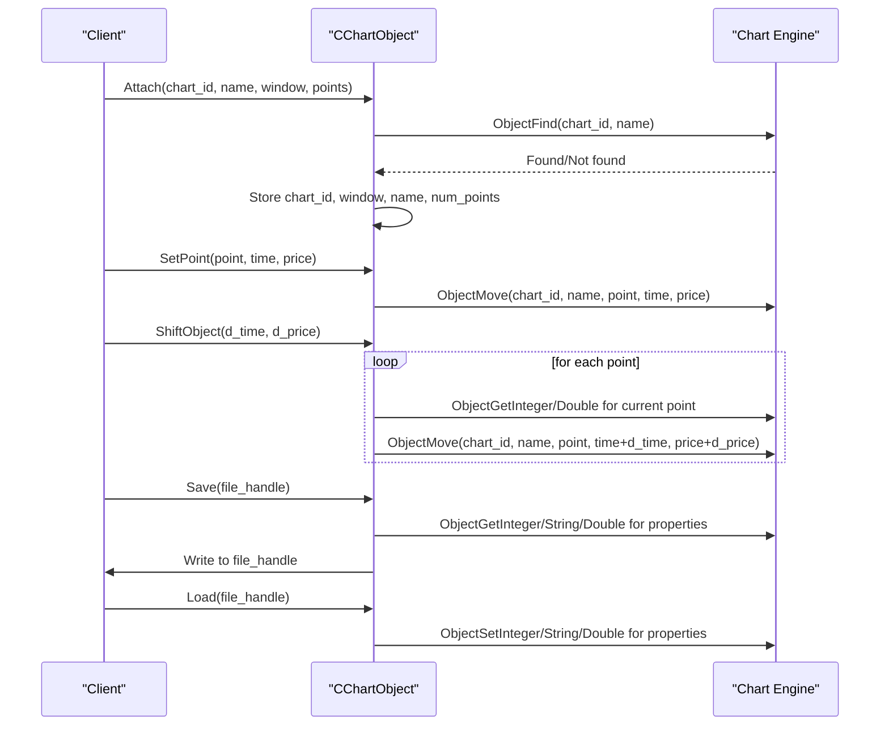
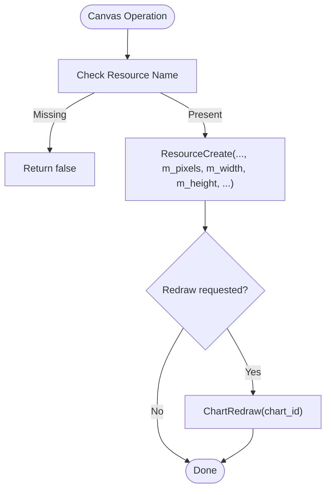
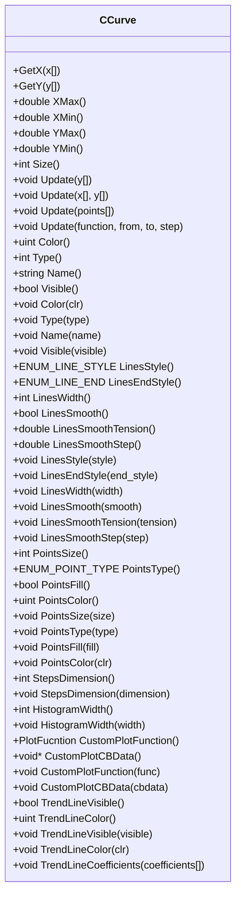
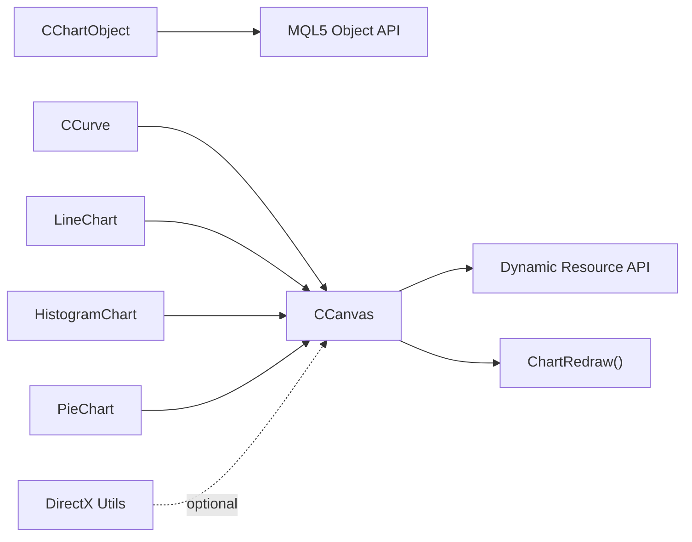

# Chart Objects System

<cite>
**Referenced Files in This Document**
- [ChartObject.mqh](file://MT/MQL5/Include/ChartObjects/ChartObject.mqh)
- [Canvas.mqh](file://MT/MQL5/Include/Canvas/Canvas.mqh)
- [Curve.mqh](file://MT/MQL5/Include/Graphics/Curve.mqh)
- [ChartCanvas.mqh](file://MT/MQL5/Include/Canvas/Charts/ChartCanvas.mqh)
- [Axis.mqh](file://MT/MQL5/Include/Graphics/Axis.mqh)
- [ColorGenerator.mqh](file://MT/MQL5/Include/Graphics/ColorGenerator.mqh)
- [LineChart.mqh](file://MT/MQL5/Include/Canvas/Charts/LineChart.mqh)
- [HistogramChart.mqh](file://MT/MQL5/Include/Canvas/Charts/HistogramChart.mqh)
- [PieChart.mqh](file://MT/MQL5/Include/Canvas/Charts/PieChart.mqh)
- [DXBox.mqh](file://MT/MQL5/Include/Canvas/DX/DXBox.mqh)
- [DXDispatcher.mqh](file://MT/MQL5/Include/Canvas/DX/DXDispatcher.mqh)
- [DXMesh.mqh](file://MT/MQL5/Include/Canvas/DX/DXMesh.mqh)
- [DXSurface.mqh](file://MT/MQL5/Include/Canvas/DX/DXSurface.mqh)
- [DXUtils.mqh](file://MT/MQL5/Include/Canvas/DX/DXUtils.mqh)
- [FlameCanvas.mqh](file://MT/MQL5/Include/Canvas/FlameCanvas.mqh)
- [ChartObjectsArrows.mqh](file://MT/MQL5/Include/ChartObjects/ChartObjectsArrows.mqh)
- [ChartObjectsChannels.mqh](file://MT/MQL5/Include/ChartObjects/ChartObjectsChannels.mqh)
- [ChartObjectsFibo.mqh](file://MT/MQL5/Include/ChartObjects/ChartObjectsFibo.mqh)
- [ChartObjectsGann.mqh](file://MT/MQL5/Include/ChartObjects/ChartObjectsGann.mqh)
- [ChartObjectsLines.mqh](file://MT/MQL5/Include/ChartObjects/ChartObjectsLines.mqh)
- [ChartObjectsShapes.mqh](file://MT/MQL5/Include/ChartObjects/ChartObjectsShapes.mqh)
- [ChartObjectsTxtControls.mqh](file://MT/MQL5/Include/ChartObjects/ChartObjectsTxtControls.mqh)
- [ChartObjectPanel.mqh](file://MT/MQL5/Include/ChartObjects/ChartObjectPanel.mqh)
- [ChartObjectSubChart.mqh](file://MT/MQL5/Include/ChartObjects/ChartObjectSubChart.mqh)
- [ChartObjectsBmpControls.mqh](file://MT/MQL5/Include/ChartObjects/ChartObjectsBmpControls.mqh)
</cite>

## Table of Contents
1. [Introduction](#introduction)
2. [Project Structure](#project-structure)
3. [Core Components](#core-components)
4. [Architecture Overview](#architecture-overview)
5. [Detailed Component Analysis](#detailed-component-analysis)
6. [Dependency Analysis](#dependency-analysis)
7. [Performance Considerations](#performance-considerations)
8. [Troubleshooting Guide](#troubleshooting-guide)
9. [Conclusion](#conclusion)

## Introduction
This document describes the chart objects and visualization systems used in the SoSimple project, focusing on MQL5 chart object management, canvas rendering, and graphics primitives. It covers object creation, positioning, styling, lifecycle management, and integration with trading data visualization. The system centers around a base chart object class and a flexible canvas abstraction that supports both vector primitives and bitmap-backed rendering.

## Project Structure
The visualization system spans several namespaces and modules:
- Chart objects: Base class and specialized geometric objects (lines, channels, Fibonacci, Gann, arrows, shapes, text controls, panels, subcharts, bitmap controls)
- Canvas and rendering: Dynamic resource-backed drawing surface, primitive drawing, antialiasing, thick lines, smoothing, and bitmap operations
- Graphics helpers: Curves, axes, color generation
- Charts: Specialized chart types (line, histogram, pie) built atop the canvas
- DirectX integration: Optional GPU-accelerated mesh/surface utilities
- FlameCanvas: A specialized canvas variant

```mermaid
graph TB
subgraph "Chart Objects"
CO["CChartObject<br/>Base class"]
L["ChartObjectsLines.mqh"]
A["ChartObjectsArrows.mqh"]
F["ChartObjectsFibo.mqh"]
G["ChartObjectsGann.mqh"]
C["ChartObjectsChannels.mqh"]
S["ChartObjectsShapes.mqh"]
T["ChartObjectsTxtControls.mqh"]
P["ChartObjectPanel.mqh"]
SC["ChartObjectSubChart.mqh"]
B["ChartObjectsBmpControls.mqh"]
end
subgraph "Canvas Rendering"
CAN["CCanvas<br/>Dynamic resource bitmap"]
CH["ChartCanvas.mqh"]
LC["LineChart.mqh"]
HC["HistogramChart.mqh"]
PC["PieChart.mqh"]
AX["Axis.mqh"]
CG["ColorGenerator.mqh"]
CR["Curve.mqh"]
end
subgraph "DirectX"
DXB["DXBox.mqh"]
DXD["DXDispatcher.mqh"]
DXM["DXMesh.mqh"]
DXS["DXSurface.mqh"]
DXU["DXUtils.mqh"]
end
subgraph "Specialized"
FC["FlameCanvas.mqh"]
end
CO --> L
CO --> A
CO --> F
CO --> G
CO --> C
CO --> S
CO --> T
CO --> P
CO --> SC
CO --> B
CO --> CAN
CAN --> CH
CAN --> LC
CAN --> HC
CAN --> PC
CAN --> AX
CAN --> CG
CAN --> CR
CAN -. optional .-> DXB
CAN -. optional .-> DXD
CAN -. optional .-> DXM
CAN -. optional .-> DXS
CAN -. optional .-> DXU
CAN --> FC
```

**Diagram sources**
- [ChartObject.mqh:12-113](file://MT/MQL5/Include/ChartObjects/ChartObject.mqh#L12-L113)
- [Canvas.mqh:39-206](file://MT/MQL5/Include/Canvas/Canvas.mqh#L39-L206)
- [Curve.mqh:52-164](file://MT/MQL5/Include/Graphics/Curve.mqh#L52-L164)
- [ChartCanvas.mqh](file://MT/MQL5/Include/Canvas/Charts/ChartCanvas.mqh)
- [Axis.mqh](file://MT/MQL5/Include/Graphics/Axis.mqh)
- [ColorGenerator.mqh](file://MT/MQL5/Include/Graphics/ColorGenerator.mqh)
- [LineChart.mqh](file://MT/MQL5/Include/Canvas/Charts/LineChart.mqh)
- [HistogramChart.mqh](file://MT/MQL5/Include/Canvas/Charts/HistogramChart.mqh)
- [PieChart.mqh](file://MT/MQL5/Include/Canvas/Charts/PieChart.mqh)
- [DXBox.mqh](file://MT/MQL5/Include/Canvas/DX/DXBox.mqh)
- [DXDispatcher.mqh](file://MT/MQL5/Include/Canvas/DX/DXDispatcher.mqh)
- [DXMesh.mqh](file://MT/MQL5/Include/Canvas/DX/DXMesh.mqh)
- [DXSurface.mqh](file://MT/MQL5/Include/Canvas/DX/DXSurface.mqh)
- [DXUtils.mqh](file://MT/MQL5/Include/Canvas/DX/DXUtils.mqh)
- [FlameCanvas.mqh](file://MT/MQL5/Include/Canvas/FlameCanvas.mqh)

**Section sources**
- [ChartObject.mqh:12-113](file://MT/MQL5/Include/ChartObjects/ChartObject.mqh#L12-L113)
- [Canvas.mqh:39-206](file://MT/MQL5/Include/Canvas/Canvas.mqh#L39-L206)
- [Curve.mqh:52-164](file://MT/MQL5/Include/Graphics/Curve.mqh#L52-L164)

## Core Components
- CChartObject: Base class for all chart objects. Provides identification, attachment to charts, anchor point management, property accessors/mutators (color, style, width, background, fill, z-order, selection, tooltips, descriptions), visibility across timeframes, levels support, and persistence via save/load.
- CCanvas: Dynamic resource-backed drawing surface supporting bitmap creation/attachment, resizing, pixel access, primitive drawing (lines, rectangles, circles, arcs, polygons), filled primitives, flood fill, antialiasing (standard and Wu), thick lines with end styles, smoothing, text rendering, and resource management.

Key capabilities:
- Coordinate system: Uses time (datetime) and price (double) anchors per point; supports relative shifting of objects and individual points.
- Styling: Line color/style/width, background/fill flags, z-order, selection flags, tooltips, descriptions, and per-level properties (color, style, width, value, description).
- Persistence: Save/load object metadata and levels to/from binary streams.
- Rendering: Vector primitives and bitmap updates; optional DirectX integration for advanced scenarios.

**Section sources**
- [ChartObject.mqh:12-113](file://MT/MQL5/Include/ChartObjects/ChartObject.mqh#L12-L113)
- [ChartObject.mqh:134-185](file://MT/MQL5/Include/ChartObjects/ChartObject.mqh#L134-L185)
- [ChartObject.mqh:152-237](file://MT/MQL5/Include/ChartObjects/ChartObject.mqh#L152-L237)
- [ChartObject.mqh:241-369](file://MT/MQL5/Include/ChartObjects/ChartObject.mqh#L241-L369)
- [ChartObject.mqh:384-463](file://MT/MQL5/Include/ChartObjects/ChartObject.mqh#L384-L463)
- [ChartObject.mqh:467-518](file://MT/MQL5/Include/ChartObjects/ChartObject.mqh#L467-L518)
- [ChartObject.mqh:522-648](file://MT/MQL5/Include/ChartObjects/ChartObject.mqh#L522-L648)
- [ChartObject.mqh:652-789](file://MT/MQL5/Include/ChartObjects/ChartObject.mqh#L652-L789)
- [ChartObject.mqh:793-821](file://MT/MQL5/Include/ChartObjects/ChartObject.mqh#L793-L821)
- [ChartObject.mqh:825-999](file://MT/MQL5/Include/ChartObjects/ChartObject.mqh#L825-L999)
- [Canvas.mqh:39-206](file://MT/MQL5/Include/Canvas/Canvas.mqh#L39-L206)
- [Canvas.mqh:249-352](file://MT/MQL5/Include/Canvas/Canvas.mqh#L249-L352)
- [Canvas.mqh:356-404](file://MT/MQL5/Include/Canvas/Canvas.mqh#L356-L404)
- [Canvas.mqh:408-441](file://MT/MQL5/Include/Canvas/Canvas.mqh#L408-L441)
- [Canvas.mqh:445-465](file://MT/MQL5/Include/Canvas/Canvas.mqh#L445-L465)
- [Canvas.mqh:469-492](file://MT/MQL5/Include/Canvas/Canvas.mqh#L469-L492)
- [Canvas.mqh:496-552](file://MT/MQL5/Include/Canvas/Canvas.mqh#L496-L552)
- [Canvas.mqh:556-617](file://MT/MQL5/Include/Canvas/Canvas.mqh#L556-L617)
- [Canvas.mqh:619-730](file://MT/MQL5/Include/Canvas/Canvas.mqh#L619-L730)
- [Canvas.mqh:734-765](file://MT/MQL5/Include/Canvas/Canvas.mqh#L734-L765)
- [Canvas.mqh:769-784](file://MT/MQL5/Include/Canvas/Canvas.mqh#L769-L784)
- [Canvas.mqh:788-830](file://MT/MQL5/Include/Canvas/Canvas.mqh#L788-L830)
- [Canvas.mqh:833-909](file://MT/MQL5/Include/Canvas/Canvas.mqh#L833-L909)
- [Canvas.mqh:912-999](file://MT/MQL5/Include/Canvas/Canvas.mqh#L912-L999)

## Architecture Overview
The system separates concerns between:
- Object model: CChartObject and derived chart objects manage chart anchors, properties, and persistence.
- Rendering model: CCanvas manages a dynamic resource bitmap and exposes drawing primitives; specialized chart types encapsulate domain-specific rendering logic.
- Graphics helpers: Curves, axes, and color utilities support data visualization and styling.
- Optional acceleration: DirectX utilities enable advanced rendering scenarios.

```mermaid
classDiagram
class CChartObject {
+long ChartId()
+int Window()
+string Name()
+bool Name(name)
+int NumPoints()
+bool Attach(chart_id, name, window, points)
+bool SetPoint(point, time, price)
+bool Delete()
+void Detach()
+datetime Time(point)
+bool Time(point, time)
+double Price(point)
+bool Price(point, price)
+color Color()
+bool Color(new_color)
+ENUM_LINE_STYLE Style()
+bool Style(new_style)
+int Width()
+bool Width(new_width)
+bool Background()
+bool Background(new_back)
+bool Fill()
+bool Fill(new_fill)
+long Z_Order()
+bool Z_Order(value)
+bool Selected()
+bool Selected(new_sel)
+bool Selectable()
+bool Selectable(new_sel)
+string Description()
+bool Description(new_text)
+string Tooltip()
+bool Tooltip(new_text)
+int Timeframes()
+bool Timeframes(timeframes)
+datetime CreateTime()
+int LevelsCount()
+bool LevelsCount(new_count)
+color LevelColor(level)
+bool LevelColor(level, new_color)
+ENUM_LINE_STYLE LevelStyle(level)
+bool LevelStyle(level, new_style)
+int LevelWidth(level)
+bool LevelWidth(level, new_width)
+double LevelValue(level)
+bool LevelValue(level, new_value)
+string LevelDescription(level)
+bool LevelDescription(level, new_text)
+bool ShiftObject(d_time, d_price)
+bool ShiftPoint(point, d_time, d_price)
+bool Save(file_handle)
+bool Load(file_handle)
}
class CCanvas {
+bool Create(name, width, height, clrfmt)
+bool CreateBitmap(name, time, price, width, height, clrfmt)
+bool CreateBitmap(chart_id, subwin, name, time, price, width, height, clrfmt)
+bool CreateBitmapLabel(name, x, y, width, height, clrfmt)
+bool CreateBitmapLabel(chart_id, subwin, name, x, y, width, height, clrfmt)
+bool Attach(chart_id, objname, clrfmt)
+bool Attach(chart_id, objname, width, height, clrfmt)
+void Destroy()
+void Update(redraw)
+bool Resize(width, height)
+void Erase(clr)
+uint PixelGet(x, y)
+void PixelSet(x, y, clr)
+void LineVertical(x, y1, y2, clr)
+void LineHorizontal(x1, x2, y, clr)
+void Line(x1, y1, x2, y2, clr)
+void Polyline(x[], y[], clr)
+void Polygon(x[], y[], clr)
+void Rectangle(x1, y1, x2, y2, clr)
+void Triangle(x1, y1, x2, y2, x3, y3, clr)
+void Circle(x, y, r, clr)
+void Ellipse(x1, y1, x2, y2, clr)
+void Arc(...)
+void Pie(...)
+void FillRectangle(x1, y1, x2, y2, clr)
+void FillTriangle(...)
+void FillPolygon(...)
+void FillCircle(...)
+void FillEllipse(...)
+void Fill(x, y, clr)
+void Fill(x, y, clr, threshold)
+void PixelSetAA(x, y, clr)
+void LineAA(...)
+void PolylineAA(...)
+void PolygonAA(...)
+void TriangleAA(...)
+void CircleAA(...)
+void EllipseAA(...)
+void LineWu(...)
+void PolylineWu(...)
+void PolygonWu(...)
+void TriangleWu(...)
+void CircleWu(...)
+void EllipseWu(...)
+void LineThickVertical(...)
+void LineThickHorizontal(...)
+void LineThick(...)
+void PolylineThick(...)
+void PolygonThick(...)
+void PolylineSmooth(...)
+void PolygonSmooth(...)
+void BitBlt(dst_x, dst_y, src[], src_width, src_height, src_x, src_y, src_dx, src_dy, mode)
+bool FontSet(name, size, flags, angle)
+bool FontNameSet(name)
+bool FontSizeSet(size)
+bool FontFlagsSet(flags)
+bool FontAngleSet(angle)
+void FontGet(name, size, flags, angle)
+void TextOut(x, y, text, clr, alignment)
+int TextWidth(text)
+int TextHeight(text)
+void TextSize(text, width, height)
+static uint GetDefaultColor(i)
+void TransparentLevelSet(value)
+bool LoadFromFile(filename)
+uint LineStyleGet()
+void LineStyleSet(style)
+static bool LoadBitmap(filename, data[], width, height)
}
class CCurve {
+double XMax()
+double XMin()
+double YMax()
+double YMin()
+int Size()
+void Update(y[])
+void Update(x[], y[])
+void Update(points[])
+void Update(function, from, to, step)
+uint Color()
+int Type()
+string Name()
+bool Visible()
+void Color(clr)
+void Type(type)
+void Name(name)
+void Visible(visible)
+ENUM_LINE_STYLE LinesStyle()
+ENUM_LINE_END LinesEndStyle()
+int LinesWidth()
+bool LinesSmooth()
+double LinesSmoothTension()
+double LinesSmoothStep()
+void LinesStyle(style)
+void LinesEndStyle(end_style)
+void LinesWidth(width)
+void LinesSmooth(smooth)
+void LinesSmoothTension(tension)
+void LinesSmoothStep(step)
+int PointsSize()
+ENUM_POINT_TYPE PointsType()
+bool PointsFill()
+uint PointsColor()
+void PointsSize(size)
+void PointsType(type)
+void PointsFill(fill)
+void PointsColor(clr)
+int StepsDimension()
+void StepsDimension(dimension)
+int HistogramWidth()
+void HistogramWidth(width)
+PlotFucntion CustomPlotFunction()
+void* CustomPlotCBData()
+void CustomPlotFunction(func)
+void CustomPlotCBData(cbdata)
+bool TrendLineVisible()
+uint TrendLineColor()
+void TrendLineVisible(visible)
+void TrendLineColor(clr)
+void TrendLineCoefficients(coefficients[])
}
CChartObject <|-- CCanvas
CCanvas <.. CCurve : "used by"
```

**Diagram sources**
- [ChartObject.mqh:12-113](file://MT/MQL5/Include/ChartObjects/ChartObject.mqh#L12-L113)
- [Canvas.mqh:39-206](file://MT/MQL5/Include/Canvas/Canvas.mqh#L39-L206)
- [Curve.mqh:52-164](file://MT/MQL5/Include/Graphics/Curve.mqh#L52-L164)

## Detailed Component Analysis

### CChartObject Lifecycle and Management
- Creation and attachment: Attach associates an existing chart object with a chart/window and sets the number of anchor points. Detach clears internal identifiers.
- Positioning: SetPoint moves a single anchor; ShiftObject shifts all points by time and price deltas; ShiftPoint moves a specific anchor.
- Styling and properties: Color, Style, Width, Background, Fill, Z_Order, Selected, Selectable, Description, Tooltip, Timeframes, LevelsCount, and per-level properties.
- Persistence: Save writes object metadata and levels; Load restores them.

**Diagram sources**
- [ChartObject.mqh:134-185](file://MT/MQL5/Include/ChartObjects/ChartObject.mqh#L134-L185)
- [ChartObject.mqh:152-237](file://MT/MQL5/Include/ChartObjects/ChartObject.mqh#L152-L237)
- [ChartObject.mqh:793-821](file://MT/MQL5/Include/ChartObjects/ChartObject.mqh#L793-L821)
- [ChartObject.mqh:825-999](file://MT/MQL5/Include/ChartObjects/ChartObject.mqh#L825-L999)

**Section sources**
- [ChartObject.mqh:134-185](file://MT/MQL5/Include/ChartObjects/ChartObject.mqh#L134-L185)
- [ChartObject.mqh:152-237](file://MT/MQL5/Include/ChartObjects/ChartObject.mqh#L152-L237)
- [ChartObject.mqh:241-369](file://MT/MQL5/Include/ChartObjects/ChartObject.mqh#L241-L369)
- [ChartObject.mqh:384-463](file://MT/MQL5/Include/ChartObjects/ChartObject.mqh#L384-L463)
- [ChartObject.mqh:467-518](file://MT/MQL5/Include/ChartObjects/ChartObject.mqh#L467-L518)
- [ChartObject.mqh:522-648](file://MT/MQL5/Include/ChartObjects/ChartObject.mqh#L522-L648)
- [ChartObject.mqh:652-789](file://MT/MQL5/Include/ChartObjects/ChartObject.mqh#L652-L789)
- [ChartObject.mqh:793-821](file://MT/MQL5/Include/ChartObjects/ChartObject.mqh#L793-L821)
- [ChartObject.mqh:825-999](file://MT/MQL5/Include/ChartObjects/ChartObject.mqh#L825-L999)

### CCanvas Drawing Primitives and Bitmap Management
- Dynamic resource creation: Create allocates a pixel buffer and registers a dynamic resource; CreateBitmap/Label attach resources to OBJ_BITMAP/OBJ_BITMAP_LABEL objects.
- Update/resize: Update recreates the resource and optionally redraws the chart; Resize resizes the buffer and updates the resource.
- Pixel access: Erase fills the buffer; PixelGet/PixelSet access individual pixels.
- Primitives: Vertical/horizontal lines, general lines (Bresenham), polylines/polygons, rectangles, triangles, circles, ellipses, arcs, pies.
- Filled primitives and flood fill: Rectangle/triangle/polygon/circle/ellipse fills and flood fill with threshold.
- Antialiasing: Standard AA, Wu’s algorithm variants, and thick lines with configurable end styles.
- Smoothing: Smooth polylines/polygons with Bezier curves and tension/step parameters.
- Text: Font management and text rendering with alignment and sizing.
- Bitmap operations: BitBlt for block transfers and loading images from files.

**Diagram sources**
- [Canvas.mqh:433-441](file://MT/MQL5/Include/Canvas/Canvas.mqh#L433-L441)

**Section sources**
- [Canvas.mqh:249-352](file://MT/MQL5/Include/Canvas/Canvas.mqh#L249-L352)
- [Canvas.mqh:356-404](file://MT/MQL5/Include/Canvas/Canvas.mqh#L356-L404)
- [Canvas.mqh:408-441](file://MT/MQL5/Include/Canvas/Canvas.mqh#L408-L441)
- [Canvas.mqh:445-465](file://MT/MQL5/Include/Canvas/Canvas.mqh#L445-L465)
- [Canvas.mqh:469-492](file://MT/MQL5/Include/Canvas/Canvas.mqh#L469-L492)
- [Canvas.mqh:496-552](file://MT/MQL5/Include/Canvas/Canvas.mqh#L496-L552)
- [Canvas.mqh:556-617](file://MT/MQL5/Include/Canvas/Canvas.mqh#L556-L617)
- [Canvas.mqh:619-730](file://MT/MQL5/Include/Canvas/Canvas.mqh#L619-L730)
- [Canvas.mqh:734-765](file://MT/MQL5/Include/Canvas/Canvas.mqh#L734-L765)
- [Canvas.mqh:769-784](file://MT/MQL5/Include/Canvas/Canvas.mqh#L769-L784)
- [Canvas.mqh:788-830](file://MT/MQL5/Include/Canvas/Canvas.mqh#L788-L830)
- [Canvas.mqh:833-909](file://MT/MQL5/Include/Canvas/Canvas.mqh#L833-L909)
- [Canvas.mqh:912-999](file://MT/MQL5/Include/Canvas/Canvas.mqh#L912-L999)

### CCurve Data Visualization Model
- Construction: Accepts y array, (x,y) arrays, point arrays, or function ranges; computes min/max extents.
- Properties: Color, type (points, lines, points+lines, steps, histogram, custom), visibility, and trend line coefficients.
- Rendering options: Lines style/end style/width/smooth/tension/step; points size/type/fill/color; steps dimension; histogram width; custom plotting callback with user data.
- Trend line: Linear regression coefficients computed lazily.

**Diagram sources**
- [Curve.mqh:52-164](file://MT/MQL5/Include/Graphics/Curve.mqh#L52-L164)

**Section sources**
- [Curve.mqh:168-224](file://MT/MQL5/Include/Graphics/Curve.mqh#L168-L224)
- [Curve.mqh:228-302](file://MT/MQL5/Include/Graphics/Curve.mqh#L228-L302)
- [Curve.mqh:306-382](file://MT/MQL5/Include/Graphics/Curve.mqh#L306-L382)
- [Curve.mqh:386-442](file://MT/MQL5/Include/Graphics/Curve.mqh#L386-L442)
- [Curve.mqh:452-493](file://MT/MQL5/Include/Graphics/Curve.mqh#L452-L493)
- [Curve.mqh:497-553](file://MT/MQL5/Include/Graphics/Curve.mqh#L497-L553)
- [Curve.mqh:557-617](file://MT/MQL5/Include/Graphics/Curve.mqh#L557-L617)
- [Curve.mqh:621-661](file://MT/MQL5/Include/Graphics/Curve.mqh#L621-L661)
- [Curve.mqh:665-673](file://MT/MQL5/Include/Graphics/Curve.mqh#L665-L673)
- [Curve.mqh:677-699](file://MT/MQL5/Include/Graphics/Curve.mqh#L677-L699)

### Chart Types Built on Canvas
- ChartCanvas: Base for chart-specific canvases.
- LineChart: Renders line series using CCurve and CCanvas primitives.
- HistogramChart: Renders bars aligned to time/price grid.
- PieChart: Renders proportional segments with labels.

These components leverage CCanvas for pixel-level drawing and integrate CCurve for data-driven visualization.

**Section sources**
- [ChartCanvas.mqh](file://MT/MQL5/Include/Canvas/Charts/ChartCanvas.mqh)
- [LineChart.mqh](file://MT/MQL5/Include/Canvas/Charts/LineChart.mqh)
- [HistogramChart.mqh](file://MT/MQL5/Include/Canvas/Charts/HistogramChart.mqh)
- [PieChart.mqh](file://MT/MQL5/Include/Canvas/Charts/PieChart.mqh)

### DirectX Rendering Utilities
Optional GPU-accelerated utilities for advanced scenarios:
- DXBox: Bounding box operations
- DXDispatcher: Dispatch/rendering coordination
- DXMesh: Mesh construction and manipulation
- DXSurface: Surface operations
- DXUtils: Utility functions

**Section sources**
- [DXBox.mqh](file://MT/MQL5/Include/Canvas/DX/DXBox.mqh)
- [DXDispatcher.mqh](file://MT/MQL5/Include/Canvas/DX/DXDispatcher.mqh)
- [DXMesh.mqh](file://MT/MQL5/Include/Canvas/DX/DXMesh.mqh)
- [DXSurface.mqh](file://MT/MQL5/Include/Canvas/DX/DXSurface.mqh)
- [DXUtils.mqh](file://MT/MQL5/Include/Canvas/DX/DXUtils.mqh)

### FlameCanvas
A specialized canvas variant optimized for specific rendering needs.

**Section sources**
- [FlameCanvas.mqh](file://MT/MQL5/Include/Canvas/FlameCanvas.mqh)

### Chart Object Specializations
- Lines, Arrows, Channels, Fibonacci, Gann, Shapes, Text Controls, Panels, SubCharts, Bitmap Controls: Derived from CChartObject, exposing specialized anchors and properties for geometric and annotation objects.

**Section sources**
- [ChartObjectsLines.mqh](file://MT/MQL5/Include/ChartObjects/ChartObjectsLines.mqh)
- [ChartObjectsArrows.mqh](file://MT/MQL5/Include/ChartObjects/ChartObjectsArrows.mqh)
- [ChartObjectsChannels.mqh](file://MT/MQL5/Include/ChartObjects/ChartObjectsChannels.mqh)
- [ChartObjectsFibo.mqh](file://MT/MQL5/Include/ChartObjects/ChartObjectsFibo.mqh)
- [ChartObjectsGann.mqh](file://MT/MQL5/Include/ChartObjects/ChartObjectsGann.mqh)
- [ChartObjectsShapes.mqh](file://MT/MQL5/Include/ChartObjects/ChartObjectsShapes.mqh)
- [ChartObjectsTxtControls.mqh](file://MT/MQL5/Include/ChartObjects/ChartObjectsTxtControls.mqh)
- [ChartObjectPanel.mqh](file://MT/MQL5/Include/ChartObjects/ChartObjectPanel.mqh)
- [ChartObjectSubChart.mqh](file://MT/MQL5/Include/ChartObjects/ChartObjectSubChart.mqh)
- [ChartObjectsBmpControls.mqh](file://MT/MQL5/Include/ChartObjects/ChartObjectsBmpControls.mqh)

## Dependency Analysis
- CChartObject depends on MQL5 Object API for property access and mutation.
- CCanvas depends on dynamic resource management and chart redraw hooks.
- CCurve depends on CCanvas for rendering and CPoint2D for geometry.
- Chart types depend on CCanvas for drawing primitives.
- DirectX utilities are optional and decoupled from core rendering.

**Diagram sources**
- [ChartObject.mqh:12-113](file://MT/MQL5/Include/ChartObjects/ChartObject.mqh#L12-L113)
- [Canvas.mqh:39-206](file://MT/MQL5/Include/Canvas/Canvas.mqh#L39-L206)
- [Curve.mqh:52-164](file://MT/MQL5/Include/Graphics/Curve.mqh#L52-L164)
- [LineChart.mqh](file://MT/MQL5/Include/Canvas/Charts/LineChart.mqh)
- [HistogramChart.mqh](file://MT/MQL5/Include/Canvas/Charts/HistogramChart.mqh)
- [PieChart.mqh](file://MT/MQL5/Include/Canvas/Charts/PieChart.mqh)
- [DXBox.mqh](file://MT/MQL5/Include/Canvas/DX/DXBox.mqh)
- [DXDispatcher.mqh](file://MT/MQL5/Include/Canvas/DX/DXDispatcher.mqh)
- [DXMesh.mqh](file://MT/MQL5/Include/Canvas/DX/DXMesh.mqh)
- [DXSurface.mqh](file://MT/MQL5/Include/Canvas/DX/DXSurface.mqh)
- [DXUtils.mqh](file://MT/MQL5/Include/Canvas/DX/DXUtils.mqh)

**Section sources**
- [ChartObject.mqh:12-113](file://MT/MQL5/Include/ChartObjects/ChartObject.mqh#L12-L113)
- [Canvas.mqh:39-206](file://MT/MQL5/Include/Canvas/Canvas.mqh#L39-L206)
- [Curve.mqh:52-164](file://MT/MQL5/Include/Graphics/Curve.mqh#L52-L164)

## Performance Considerations
- Prefer batch updates: Minimize repeated ObjectSet calls; group property updates when possible.
- Use CCanvas efficiently: Reuse dynamic resources and avoid frequent Create/Destroy cycles; leverage Update to refresh resources instead of recreating.
- Antialiasing cost: AA and Wu algorithms improve visual quality but increase CPU usage; use selectively for critical paths.
- Thick lines and smoothing: These operations are more expensive; cache computed curves when data does not change frequently.
- Bitmap operations: BitBlt and image loading are costly; use sparingly and consider caching.
- DirectX path: When available, offload heavy rendering to GPU via DirectX utilities for improved throughput.

[No sources needed since this section provides general guidance]

## Troubleshooting Guide
Common issues and resolutions:
- Object not found during attach: Ensure the object exists on the target chart and window before attaching.
- Property access failures: Verify the object is attached (chart_id != -1) and indices are within bounds.
- Persistence errors: Confirm file handle validity and that Save/Load sequences match object type and structure.
- Canvas resource errors: Check dynamic resource creation and destruction; ensure proper resource names and sizes.

**Section sources**
- [ChartObject.mqh:134-148](file://MT/MQL5/Include/ChartObjects/ChartObject.mqh#L134-L148)
- [ChartObject.mqh:189-237](file://MT/MQL5/Include/ChartObjects/ChartObject.mqh#L189-L237)
- [ChartObject.mqh:825-999](file://MT/MQL5/Include/ChartObjects/ChartObject.mqh#L825-L999)
- [Canvas.mqh:249-276](file://MT/MQL5/Include/Canvas/Canvas.mqh#L249-L276)
- [Canvas.mqh:408-441](file://MT/MQL5/Include/Canvas/Canvas.mqh#L408-L441)

## Conclusion
The SoSimple chart visualization system combines a robust object model (CChartObject) with a flexible canvas abstraction (CCanvas) to support rich, interactive charting. It provides comprehensive styling, positioning, persistence, and rendering capabilities, with optional DirectX acceleration. By leveraging CCurve for data-driven visualization and specialized chart types for domain-specific needs, the system enables efficient and extensible trading data visualization.