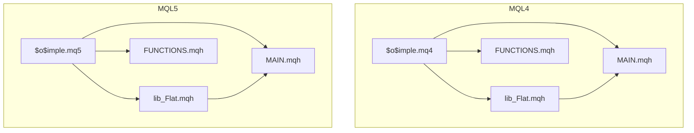
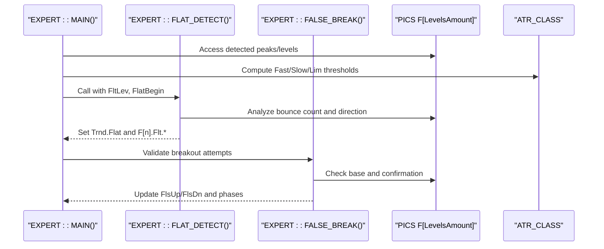
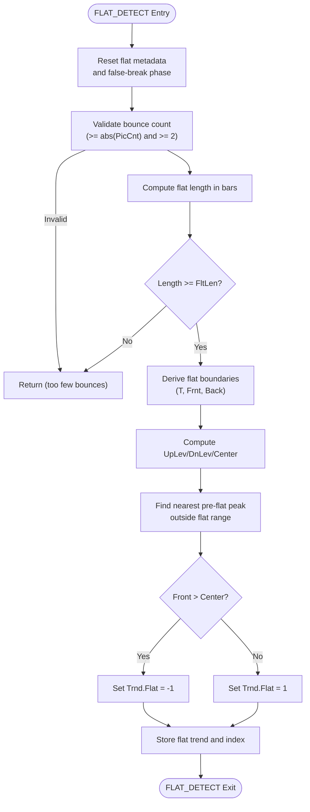
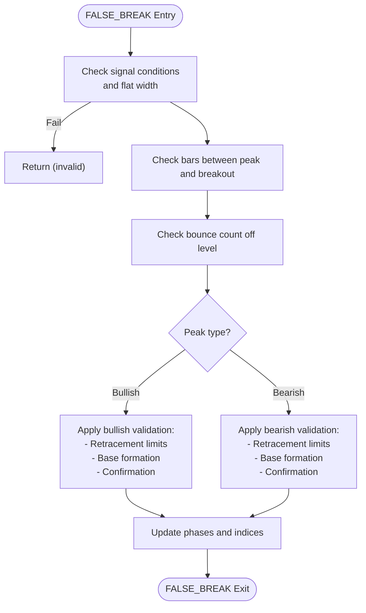
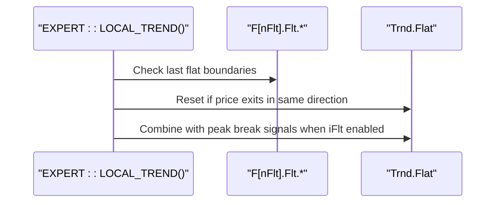
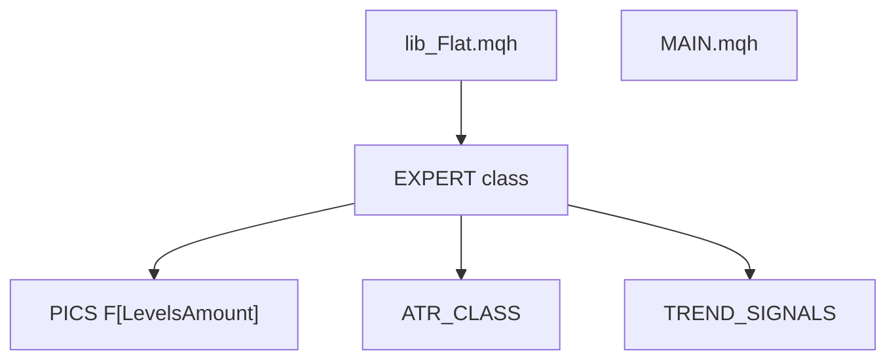

# Flat Detection Utilities

<cite>
**Referenced Files in This Document**
- [lib_Flat.mqh](file://MT/MQL4/Include/lib_Flat.mqh)
- [lib_Flat.mqh](file://MT/MQL5/Include/lib_Flat.mqh)
- [MAIN.mqh](file://MT/MQL4/Include/MAIN.mqh)
- [MAIN.mqh](file://MT/MQL5/Include/MAIN.mqh)
- [$o$imple.mq4](file://MT/MQL4/Experts/$o$imple.mq4)
- [$o$imple.mq5](file://MT/MQL5/Experts/$o$imple.mq5)
- [lib_PIC_old.mqh](file://MT/MQL4/Trash/lib_PIC_old.mqh)
- [FUNCTIONS.mqh](file://MT/MQL4/Include/FUNCTIONS.mqh)
- [FUNCTIONS.mqh](file://MT/MQL5/Include/FUNCTIONS.mqh)
</cite>

## Table of Contents
1. [Introduction](#introduction)
2. [Project Structure](#project-structure)
3. [Core Components](#core-components)
4. [Architecture Overview](#architecture-overview)
5. [Detailed Component Analysis](#detailed-component-analysis)
6. [Dependency Analysis](#dependency-analysis)
7. [Performance Considerations](#performance-considerations)
8. [Troubleshooting Guide](#troubleshooting-guide)
9. [Conclusion](#conclusion)

## Introduction
This document provides comprehensive technical documentation for the Flat Detection Utilities library within the SoSimple trading system. The library implements algorithms to identify flat market conditions, detect false breakouts, and support trend continuation decisions. It operates as part of the broader MQL4/MQL5 expert advisor framework, integrating with peak/level detection, ATR computation, and order management subsystems.

The documentation covers:
- Mathematical foundations of flat market identification
- Parameter configurations and threshold settings
- Function references with parameter specifications and return value descriptions
- Usage examples in trading decisions
- Performance optimization techniques
- Integration with other trading components
- Accuracy considerations, false positive handling, and adaptive threshold mechanisms

## Project Structure
The Flat Detection Utilities reside in the MQL4 and MQL5 include directories and are consumed by the main expert logic. The key files are:
- Flat detection library (MQL4 and MQL5): `lib_Flat.mqh`
- Main expert interface and method declarations: `MAIN.mqh`
- Expert advisors (MQL4/MQL5): `$o$imple.mq4`, `$o$imple.mq5`
- Supporting utilities: `FUNCTIONS.mqh`
- Legacy integration reference: `lib_PIC_old.mqh`

**Diagram sources**
- [lib_Flat.mqh:1-155](file://MT/MQL4/Include/lib_Flat.mqh#L1-L155)
- [lib_Flat.mqh:1-156](file://MT/MQL5/Include/lib_Flat.mqh#L1-L156)
- [MAIN.mqh:1-213](file://MT/MQL4/Include/MAIN.mqh#L1-L213)
- [MAIN.mqh:1-202](file://MT/MQL5/Include/MAIN.mqh#L1-L202)
- [$o$imple.mq4:1-149](file://MT/MQL4/Experts/$o$imple.mq4#L1-L149)
- [$o$imple.mq5:1-157](file://MT/MQL5/Experts/$o$imple.mq5#L1-L157)

**Section sources**
- [lib_Flat.mqh:1-155](file://MT/MQL4/Include/lib_Flat.mqh#L1-L155)
- [lib_Flat.mqh:1-156](file://MT/MQL5/Include/lib_Flat.mqh#L1-L156)
- [MAIN.mqh:1-213](file://MT/MQL4/Include/MAIN.mqh#L1-L213)
- [MAIN.mqh:1-202](file://MT/MQL5/Include/MAIN.mqh#L1-L202)
- [$o$imple.mq4:1-149](file://MT/MQL4/Experts/$o$imple.mq4#L1-L149)
- [$o$imple.mq5:1-157](file://MT/MQL5/Experts/$o$imple.mq5#L1-L157)

## Core Components
The Flat Detection Utilities consist of two primary functions:
- `FLAT_DETECT`: Identifies flat markets by analyzing level formation, bounce counts, and directional bias
- `FALSE_BREAK`: Validates breakout attempts against established levels to reduce false positives

These functions integrate with:
- Peak/level detection and storage (`PICS F[LevelsAmount]`)
- ATR-based thresholds (`ATR_CLASS`)
- Trend signals (`TREND_SIGNALS`)
- Order management and output drawing utilities

Key parameters influencing behavior:
- `FltLen`: Minimum flat length in bars
- `PicCnt`: Required number of bounces off a level
- `PicPwr`: Level strength threshold relative to ATR
- `iFlt`: Enable/disable flat exit logic
- `iLoc`: Local trend sensitivity to level breaks

**Section sources**
- [lib_Flat.mqh:1-155](file://MT/MQL4/Include/lib_Flat.mqh#L1-L155)
- [lib_Flat.mqh:1-156](file://MT/MQL5/Include/lib_Flat.mqh#L1-L156)
- [MAIN.mqh:10-122](file://MT/MQL4/Include/MAIN.mqh#L10-L122)
- [MAIN.mqh:10-122](file://MT/MQL5/Include/MAIN.mqh#L10-L122)

## Architecture Overview
The flat detection pipeline operates during each tick within the expert's main loop. It leverages detected peaks/levels, computes ATR thresholds, and applies bounce counting and directional bias logic to determine flat conditions and validate breakouts.

**Diagram sources**
- [MAIN.mqh:117-143](file://MT/MQL4/Include/MAIN.mqh#L117-L143)
- [MAIN.mqh:131-143](file://MT/MQL5/Include/MAIN.mqh#L131-L143)
- [lib_Flat.mqh:2-42](file://MT/MQL4/Include/lib_Flat.mqh#L2-L42)
- [lib_Flat.mqh:2-42](file://MT/MQL5/Include/lib_Flat.mqh#L2-L42)

## Detailed Component Analysis

### FLAT_DETECT Function
Purpose: Detect flat markets by validating level formation, bounce counts, and directional bias.

Parameters:
- `FltLev` (float): Average level of the flat region
- `FlatBegin` (uchar): Index of the first peak that initiated the flat pattern

Processing logic:
1. Initialize flat metadata and reset false-break phase
2. Validate bounce count (`F[n].Flt.Num >= abs(PicCnt)`) and minimum threshold (`F[n].Flt.Num >= 2`)
3. Compute flat length in bars and enforce minimum length (`FltLen`)
4. Derive flat boundaries (`F[n].Flt.T`, `F[n].Flt.Frnt`, `F[n].Flt.Back`)
5. Calculate level extremes and center
6. Search for the nearest pre-flat peak outside the flat range to infer directional bias
7. Determine flat exit direction based on front vs center comparison
8. Store flat-specific trend and index

Return value: None (updates internal state via class members)

**Diagram sources**
- [lib_Flat.mqh:2-42](file://MT/MQL4/Include/lib_Flat.mqh#L2-L42)
- [lib_Flat.mqh:2-42](file://MT/MQL5/Include/lib_Flat.mqh#L2-L42)

**Section sources**
- [lib_Flat.mqh:2-42](file://MT/MQL4/Include/lib_Flat.mqh#L2-L42)
- [lib_Flat.mqh:2-42](file://MT/MQL5/Include/lib_Flat.mqh#L2-L42)
- [MAIN.mqh:89-89](file://MT/MQL4/Include/MAIN.mqh#L89-L89)
- [MAIN.mqh:89-89](file://MT/MQL5/Include/MAIN.mqh#L89-L89)

### FALSE_BREAK Function
Purpose: Validate breakout attempts against established levels to reduce false positives.

Processing logic:
1. Verify signal conditions and minimum flat width
2. Check minimum bars between peak and breakout (`F[f].Per >= FltLen`)
3. Ensure sufficient bounce count off the level (`F[f].Flt.Num >= PicCnt`)
4. For bullish peaks:
   - Reject excessive retracement beyond `F[f].P + Atr.Max * 2`
   - Reject deep retracements below `F[f].Back + F[f].BackVal / 3` during formation
   - Track breakout potential and base formation
   - Confirm breakout via base breakthrough
5. For bearish peaks:
   - Apply symmetric checks with opposite thresholds
6. Update false-break phases and indices upon confirmation

**Diagram sources**
- [lib_Flat.mqh:47-145](file://MT/MQL4/Include/lib_Flat.mqh#L47-L145)
- [lib_Flat.mqh:47-145](file://MT/MQL5/Include/lib_Flat.mqh#L47-L145)

**Section sources**
- [lib_Flat.mqh:47-145](file://MT/MQL4/Include/lib_Flat.mqh#L47-L145)
- [lib_Flat.mqh:47-145](file://MT/MQL5/Include/lib_Flat.mqh#L47-L145)

### Integration with Trend Signals and Local Trend
Flat detection influences local and global trend signals:
- `Trnd.Flat` is set based on flat exit direction
- `LOCAL_TREND` resets flat trend when price exits the flat zone in the same direction as entry
- `LOCAL_TREND` combines peak break signals with flat exit logic when enabled

**Diagram sources**
- [lib_PIC_old.mqh:324-336](file://MT/MQL4/Trash/lib_PIC_old.mqh#L324-L336)

**Section sources**
- [lib_PIC_old.mqh:313-336](file://MT/MQL4/Trash/lib_PIC_old.mqh#L313-L336)

## Dependency Analysis
The Flat Detection Utilities depend on:
- Peak/level storage and management (`PICS F[LevelsAmount]`)
- ATR computation and thresholds (`ATR_CLASS`)
- Trend signal aggregation (`TREND_SIGNALS`)
- Drawing utilities for debug overlays (`LINE`, `V`, `X`)

**Diagram sources**
- [lib_Flat.mqh:1-155](file://MT/MQL4/Include/lib_Flat.mqh#L1-L155)
- [lib_Flat.mqh:1-156](file://MT/MQL5/Include/lib_Flat.mqh#L1-L156)
- [MAIN.mqh:10-122](file://MT/MQL4/Include/MAIN.mqh#L10-L122)
- [MAIN.mqh:10-122](file://MT/MQL5/Include/MAIN.mqh#L10-L122)

**Section sources**
- [lib_Flat.mqh:1-155](file://MT/MQL4/Include/lib_Flat.mqh#L1-L155)
- [lib_Flat.mqh:1-156](file://MT/MQL5/Include/lib_Flat.mqh#L1-L156)
- [MAIN.mqh:10-122](file://MT/MQL4/Include/MAIN.mqh#L10-L122)
- [MAIN.mqh:10-122](file://MT/MQL5/Include/MAIN.mqh#L10-L122)

## Performance Considerations
- Early termination: Functions return immediately when bounce counts or lengths are insufficient
- Minimal loops: Flat detection scans only up to `LevelsAmount` peaks
- Threshold-based pruning: ATR-based limits prevent unnecessary computations
- Visualization toggles: Debug drawing macros can be disabled to reduce overhead

Recommendations:
- Tune `FltLen` and `PicCnt` to balance sensitivity and robustness
- Monitor ATR computation performance; adjust periods (`A`, `a`) for desired responsiveness
- Disable debug drawing macros in production builds

[No sources needed since this section provides general guidance]

## Troubleshooting Guide
Common issues and resolutions:
- Too few bounces: Increase `PicCnt` or relax `abs(PicCnt)` requirement
- Short flat duration: Raise `FltLen` to avoid premature detections
- False positives on breakouts: Tighten ATR-based thresholds or enable base confirmation
- Incorrect directional bias: Review `iFlt` setting and peak selection logic
- Overdrawn charts: Disable debug drawing macros

Accuracy considerations:
- Parameter interplay: `FltLen`, `PicCnt`, and ATR thresholds must be tuned together
- Market regime adaptation: Consider dynamic threshold scaling based on volatility regimes
- False positive handling: Use base confirmation and minimum bar requirements before signaling

Adaptive threshold mechanisms:
- ATR-based thresholds (`Atr.Lim`, `Atr.Max`, `Atr.Min`) adapt to current volatility
- Consider implementing dynamic `FltLen` and `PicCnt` based on recent volatility measures

**Section sources**
- [lib_Flat.mqh:47-145](file://MT/MQL4/Include/lib_Flat.mqh#L47-L145)
- [lib_Flat.mqh:47-145](file://MT/MQL5/Include/lib_Flat.mqh#L47-L145)
- [lib_PIC_old.mqh:324-336](file://MT/MQL4/Trash/lib_PIC_old.mqh#L324-L336)

## Conclusion
The Flat Detection Utilities provide robust flat market identification and breakout validation within the SoSimple trading system. By combining bounce counting, directional bias analysis, and ATR-based thresholds, the library supports informed trading decisions while minimizing false positives. Proper tuning of parameters such as `FltLen`, `PicCnt`, and ATR thresholds, along with integration into the broader expert framework, ensures reliable performance across diverse market conditions.