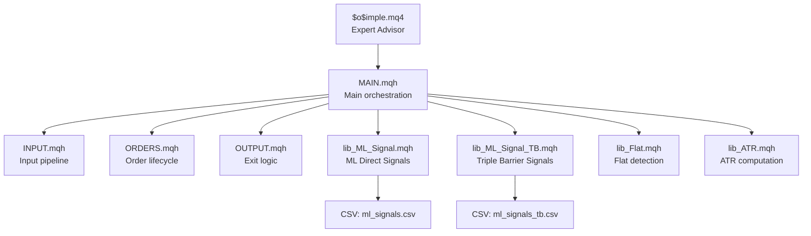
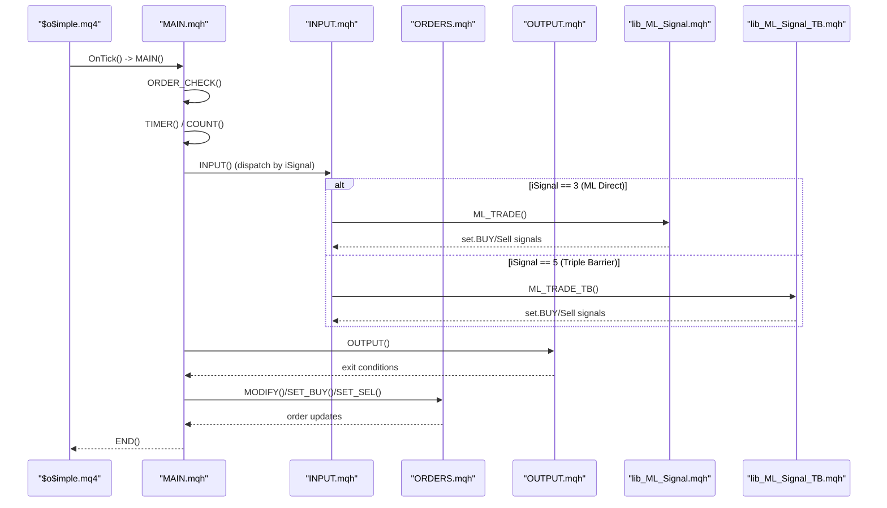
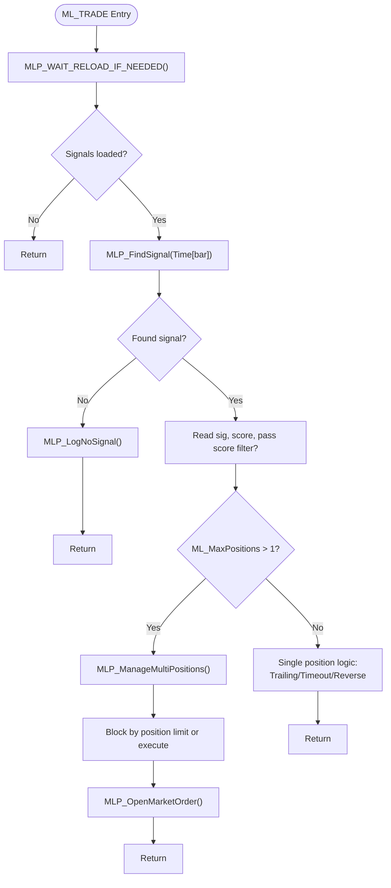
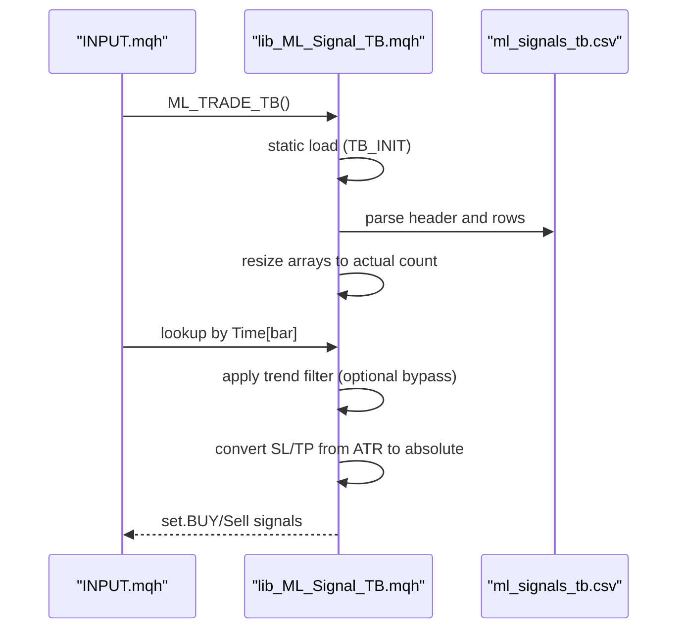
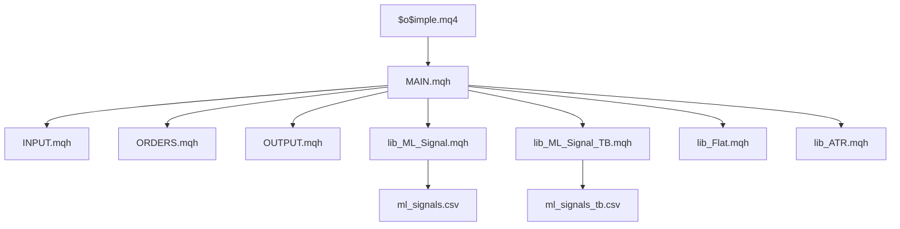

# Library and Utility Systems

<cite>
**Referenced Files in This Document**
- [$o$imple.mq4](file://MT/MQL4/Experts/$o$imple.mq4)
- [lib_ML_Signal.mqh](file://MT/MQL4/Include/lib_ML_Signal.mqh)
- [lib_ML_Signal_TB.mqh](file://MT/MQL4/Include/lib_ML_Signal_TB.mqh)
- [lib_ML_Signal_back.mqh](file://MT/MQL4/Include/lib_ML_Signal_back.mqh)
- [lib_Flat.mqh](file://MT/MQL4/Include/lib_Flat.mqh)
- [lib_ATR.mqh](file://MT/MQL4/Include/lib_ATR.mqh)
- [INPUT.mqh](file://MT/MQL4/Include/INPUT.mqh)
- [MAIN.mqh](file://MT/MQL4/Include/MAIN.mqh)
- [ORDERS.mqh](file://MT/MQL4/Include/ORDERS.mqh)
- [OUTPUT.mqh](file://MT/MQL4/Include/OUTPUT.mqh)
- [stdlib.mqh](file://MT/MQL4/Libraries/stdlib.mqh)
- [lib_ML_Signal.mqh (MQL5)](file://MT/MQL5/Include/lib_ML_Signal.mqh)
- [lib_Flat.mqh (MQL5)](file://MT/MQL5/Include/lib_Flat.mqh)
- [lib_ATR.mqh (MQL5)](file://MT/MQL5/Include/lib_ATR.mqh)
</cite>

## Table of Contents
1. [Introduction](#introduction)
2. [Project Structure](#project-structure)
3. [Core Components](#core-components)
4. [Architecture Overview](#architecture-overview)
5. [Detailed Component Analysis](#detailed-component-analysis)
6. [Dependency Analysis](#dependency-analysis)
7. [Performance Considerations](#performance-considerations)
8. [Troubleshooting Guide](#troubleshooting-guide)
9. [Conclusion](#conclusion)

## Introduction
This document describes the MetaTrader library systems that power the SoSimple trading framework. It focuses on the ML signal libraries, flat detection utilities, array management systems, and standard library integrations. The documentation explains the library architecture, function implementations, and integration patterns with the expert advisor. It also provides detailed function references, parameter specifications, return value descriptions, usage examples, performance considerations, troubleshooting guidance, memory management practices, error handling strategies, and optimization techniques.

## Project Structure
The SoSimple framework organizes trading logic across MQL4 and MQL5 environments with reusable libraries and an expert advisor that orchestrates them. Key areas:
- Expert Advisor: Orchestrates initialization, timing, input generation, order placement/modification, and output/close logic.
- ML Signal Libraries: Load precomputed signals from CSV and execute trades accordingly, with variants for parity checks, triple barrier, and backtesting.
- Flat Detection Utilities: Identify flat markets and false breakouts to inform trading decisions.
- ATR Utilities: Compute Average True Range for stops and risk management.
- Standard Library Integrations: Provide essential MQL4/5 utilities for error handling, string operations, and market data access.

**Diagram sources**
- [$o$imple.mq4:123-149](file://MT/MQL4/Experts/$o$imple.mq4#L123-L149)
- [MAIN.mqh:117-143](file://MT/MQL4/Include/MAIN.mqh#L117-L143)
- [INPUT.mqh:3-26](file://MT/MQL4/Include/INPUT.mqh#L3-L26)
- [ORDERS.mqh:5-13](file://MT/MQL4/Include/ORDERS.mqh#L5-L13)
- [OUTPUT.mqh:6-62](file://MT/MQL4/Include/OUTPUT.mqh#L6-L62)
- [lib_ML_Signal.mqh:457-551](file://MT/MQL4/Include/lib_ML_Signal.mqh#L457-L551)
- [lib_ML_Signal_TB.mqh:46-99](file://MT/MQL4/Include/lib_ML_Signal_TB.mqh#L46-L99)
- [lib_Flat.mqh:2-42](file://MT/MQL4/Include/lib_Flat.mqh#L2-L42)
- [lib_ATR.mqh:2-47](file://MT/MQL4/Include/lib_ATR.mqh#L2-L47)

**Section sources**
- [$o$imple.mq4:1-149](file://MT/MQL4/Experts/$o$imple.mq4#L1-L149)
- [MAIN.mqh:111-143](file://MT/MQL4/Include/MAIN.mqh#L111-L143)

## Core Components

### ML Signal Library (Direct Execution)
The direct execution ML signal library loads precomputed signals from CSV and executes trades immediately, supporting parity checks and optional multi-position management. It includes:
- CSV loading with dynamic score column detection
- Binary search for signal lookup by bar time
- Score filtering and position blocking logic
- Multi-position management with trailing stop or timeout exits
- Detailed diagnostic counters and logging

Key functions and behaviors:
- Initialization and reload logic with file modification time checks
- Signal lookup via binary search
- Score filtering and trend filters
- Multi-position management with trailing stop and timeout logic
- Diagnostic reporting

**Section sources**
- [lib_ML_Signal.mqh:27-551](file://MT/MQL4/Include/lib_ML_Signal.mqh#L27-L551)
- [lib_ML_Signal.mqh:603-951](file://MT/MQL4/Include/lib_ML_Signal.mqh#L603-L951)

### ML Signal Library (Triple Barrier)
The triple barrier library reads fixed SL/TP signals from CSV and applies them to entries. It supports:
- CSV parsing with fixed columns for SL and TP in ATR units
- Binary search for signal lookup
- Trend filter bypass capability
- Dynamic SL/TP conversion to absolute prices
- Diagnostic counters and print statements

**Section sources**
- [lib_ML_Signal_TB.mqh:46-215](file://MT/MQL4/Include/lib_ML_Signal_TB.mqh#L46-L215)

### ML Signal Library (Backtesting Variant)
A backtesting variant of the ML signal library that:
- Loads multiple prediction horizons from CSV
- Computes ratios dynamically from predictions
- Applies adaptive SL/TP based on R:R modes
- Supports exit-on-reverse logic and multiple filters

**Section sources**
- [lib_ML_Signal_back.mqh:55-325](file://MT/MQL4/Include/lib_ML_Signal_back.mqh#L55-L325)

### Flat Detection Utilities
Flat detection utilities identify consolidation periods and false breakouts:
- Flat detection algorithm with length, level, and range calculations
- False breakout confirmation logic with base level determination
- Visual drawing controls for debugging

**Section sources**
- [lib_Flat.mqh:2-155](file://MT/MQL4/Include/lib_Flat.mqh#L2-L155)

### ATR Utilities
ATR utilities compute fast/slow ATR and related thresholds:
- Rolling ATR calculation over configurable periods
- Daily recalculation for slow ATR
- Threshold computation for level matching and stop distances

**Section sources**
- [lib_ATR.mqh:2-56](file://MT/MQL4/Include/lib_ATR.mqh#L2-L56)

### Standard Library Integrations
Standard library integrations provide:
- Error description utilities
- Color construction helpers
- Double comparison utilities
- Hex string conversions

**Section sources**
- [stdlib.mqh:8-14](file://MT/MQL4/Libraries/stdlib.mqh#L8-L14)

## Architecture Overview
The expert advisor coordinates library interactions:
- Initialization sets expert parameters and ML mode flags
- MAIN orchestrates order checking, timing, counting, input generation, output, and trailing logic
- INPUT dispatches to ML signal libraries based on iSignal
- ORDERS manages order lifecycle, risk checks, and global order coordination
- OUTPUT handles exits, trailing stops, and impulse validations
- ATR and Flat utilities feed market context

**Diagram sources**
- [$o$imple.mq4:123-149](file://MT/MQL4/Experts/$o$imple.mq4#L123-L149)
- [MAIN.mqh:117-143](file://MT/MQL4/Include/MAIN.mqh#L117-L143)
- [INPUT.mqh:3-26](file://MT/MQL4/Include/INPUT.mqh#L3-L26)
- [ORDERS.mqh:5-13](file://MT/MQL4/Include/ORDERS.mqh#L5-L13)
- [OUTPUT.mqh:6-62](file://MT/MQL4/Include/OUTPUT.mqh#L6-L62)
- [lib_ML_Signal.mqh:603-951](file://MT/MQL4/Include/lib_ML_Signal.mqh#L603-L951)
- [lib_ML_Signal_TB.mqh:118-200](file://MT/MQL4/Include/lib_ML_Signal_TB.mqh#L118-L200)

## Detailed Component Analysis

### ML Signal Library (Direct Execution) Analysis
This library implements a robust CSV-driven trading system with:
- Static arrays for time, signal, and optional score
- Binary search for O(log n) signal lookup
- Score filtering and position blocking
- Multi-position support with trailing stop and timeout
- Comprehensive diagnostics

**Diagram sources**
- [lib_ML_Signal.mqh:603-951](file://MT/MQL4/Include/lib_ML_Signal.mqh#L603-L951)

**Section sources**
- [lib_ML_Signal.mqh:27-551](file://MT/MQL4/Include/lib_ML_Signal.mqh#L27-L551)
- [lib_ML_Signal.mqh:603-951](file://MT/MQL4/Include/lib_ML_Signal.mqh#L603-L951)

### Triple Barrier Signal Library Analysis
Triple barrier signals are fixed SL/TP targets derived from CSV:
- CSV parsing with fixed column layout
- Binary search for signal lookup
- Trend filter bypass option
- SL/TP conversion to absolute values using ATR

**Diagram sources**
- [lib_ML_Signal_TB.mqh:46-215](file://MT/MQL4/Include/lib_ML_Signal_TB.mqh#L46-L215)
- [INPUT.mqh:17-21](file://MT/MQL4/Include/INPUT.mqh#L17-L21)

**Section sources**
- [lib_ML_Signal_TB.mqh:46-215](file://MT/MQL4/Include/lib_ML_Signal_TB.mqh#L46-L215)

### Backtesting ML Signal Library Analysis
Backtesting variant computes ratios dynamically and applies adaptive SL/TP:
- Parses multiple prediction columns from CSV
- Computes ratios from up_12/dn_12
- Applies trend filters, ratio thresholds, and exit-on-reverse logic
- Supports multiple R:R modes with caps

**Section sources**
- [lib_ML_Signal_back.mqh:55-325](file://MT/MQL4/Include/lib_ML_Signal_back.mqh#L55-L325)

### Flat Detection Utilities Analysis
Flat detection identifies consolidation periods and validates false breakouts:
- Calculates flat length, level, and range
- Determines breakout direction based on front vs center
- Confirms false breakouts with base level and return checks
- Optional visual drawing aids

**Section sources**
- [lib_Flat.mqh:2-155](file://MT/MQL4/Include/lib_Flat.mqh#L2-L155)

### ATR Utilities Analysis
ATR utilities compute market volatility measures:
- Fast ATR over short period
- Slow ATR with daily recalculation
- Threshold computation for level matching
- Selection of ATR variant for stops

**Section sources**
- [lib_ATR.mqh:2-56](file://MT/MQL4/Include/lib_ATR.mqh#L2-L56)

### Standard Library Integrations Analysis
Standard library provides:
- ErrorDescription for actionable diagnostics
- RGB color construction
- Double comparison utilities
- High-precision double-to-string conversions
- Hex string conversions

**Section sources**
- [stdlib.mqh:8-14](file://MT/MQL4/Libraries/stdlib.mqh#L8-L14)

## Dependency Analysis
The expert advisor depends on several libraries, which themselves depend on standard MQL constructs and CSV data sources.

**Diagram sources**
- [MAIN.mqh:114-116](file://MT/MQL4/Include/MAIN.mqh#L114-L116)
- [lib_ML_Signal.mqh:457-551](file://MT/MQL4/Include/lib_ML_Signal.mqh#L457-L551)
- [lib_ML_Signal_TB.mqh:46-99](file://MT/MQL4/Include/lib_ML_Signal_TB.mqh#L46-L99)

**Section sources**
- [MAIN.mqh:114-116](file://MT/MQL4/Include/MAIN.mqh#L114-L116)

## Performance Considerations
- CSV Loading: Pre-size arrays to maximum capacity to avoid repeated reallocations. Resize arrays to actual count after loading to minimize memory overhead.
- Binary Search: Maintain sorted time arrays for efficient O(log n) signal lookup.
- Multi-Position Management: Use efficient loops and early exits to minimize order scanning overhead.
- ATR Computation: Recalculate slow ATR only when needed (daily) to reduce computational cost.
- Diagnostics: Use selective printing and counters to avoid excessive logging in production.
- Risk Checks: Perform risk calculations once per order update to prevent redundant computations.

## Troubleshooting Guide
Common issues and resolutions:
- CSV Parsing Failures: Verify CSV headers and column counts. Ensure file encoding compatibility.
- Score Filtering Disabled: Confirm presence of score column in CSV when score filtering is enabled.
- Position Blocking: Review ML_MaxPositions and existing orders before attempting new entries.
- Trend Filter Blocking: Disable ML_BypassTrend temporarily to validate trade logic.
- Order Placement Errors: Check stop/profit proximity to market price and minimum distance requirements.
- Multi-Position Exit Issues: Verify trailing stop and timeout configurations for proper exits.
- ATR Calculation Errors: Ensure sufficient historical bars and correct period parameters.

**Section sources**
- [lib_ML_Signal.mqh:457-551](file://MT/MQL4/Include/lib_ML_Signal.mqh#L457-L551)
- [lib_ML_Signal.mqh:603-951](file://MT/MQL4/Include/lib_ML_Signal.mqh#L603-L951)
- [ORDERS.mqh:14-130](file://MT/MQL4/Include/ORDERS.mqh#L14-L130)

## Conclusion
The SoSimple MetaTrader library systems provide a modular, efficient framework for ML-driven trading. The direct execution ML signal library, triple barrier library, flat detection utilities, and ATR computations integrate seamlessly through the expert advisor. Proper configuration of parameters, careful CSV management, and attention to performance and error handling ensure reliable operation across backtests and live trading.