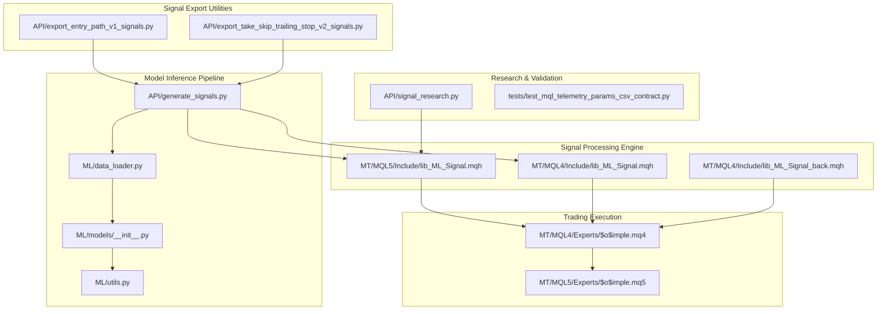
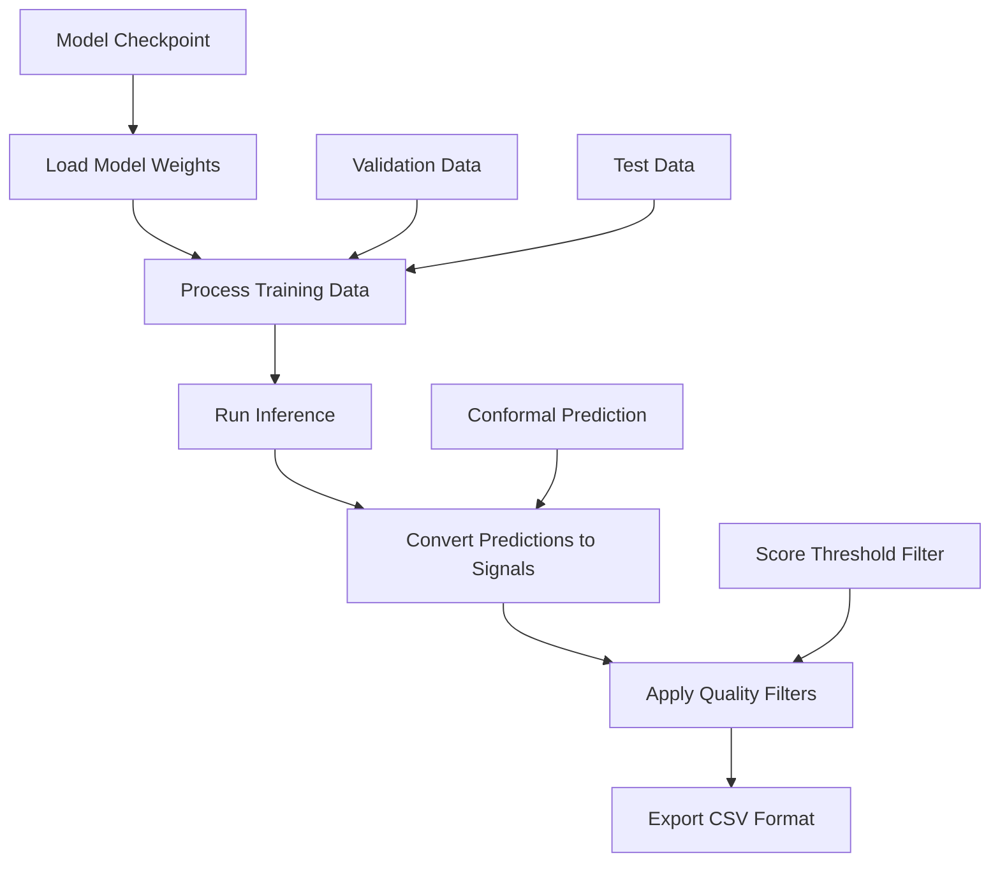
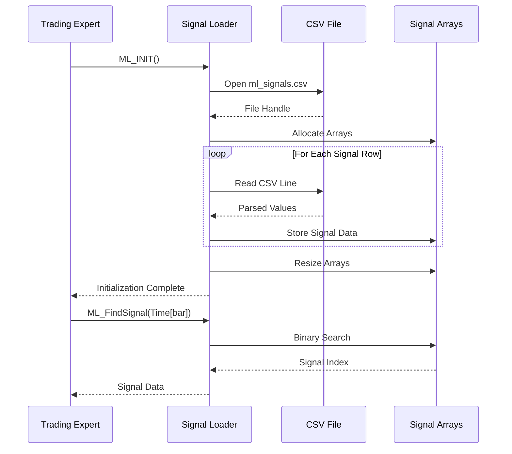
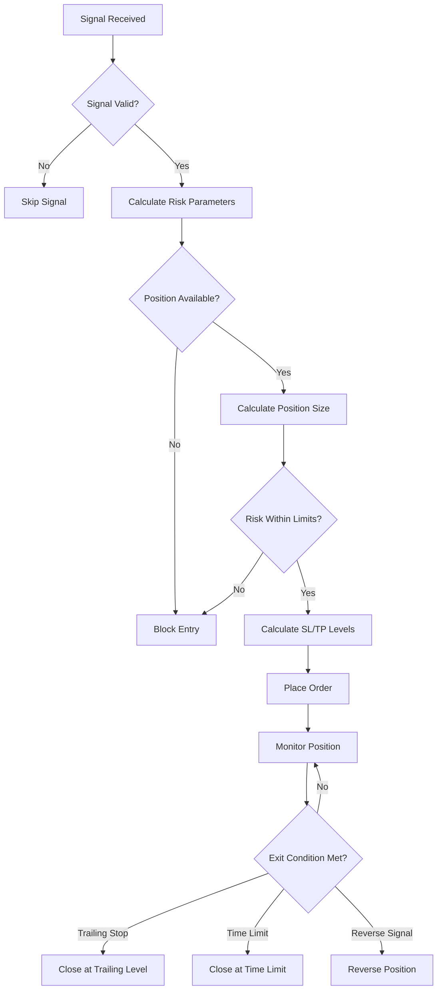
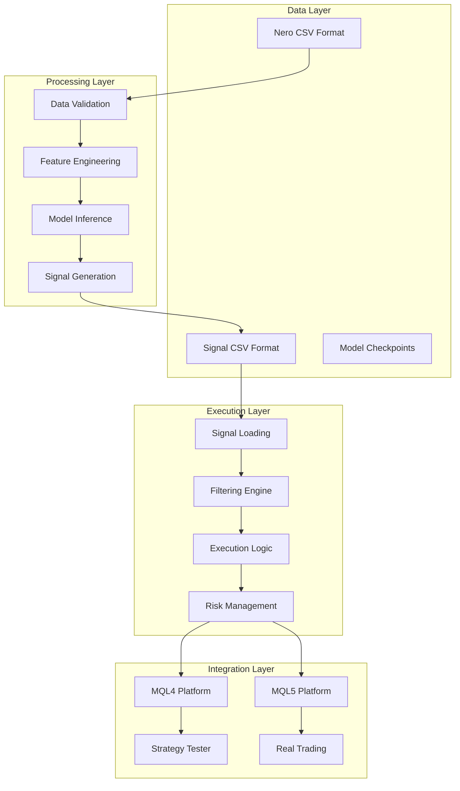
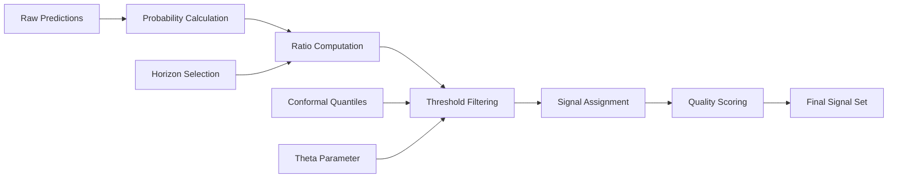
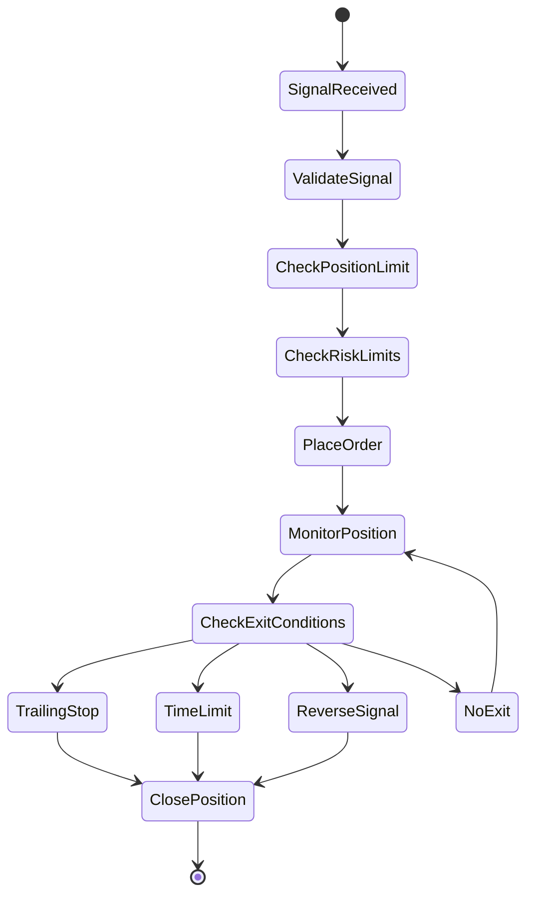
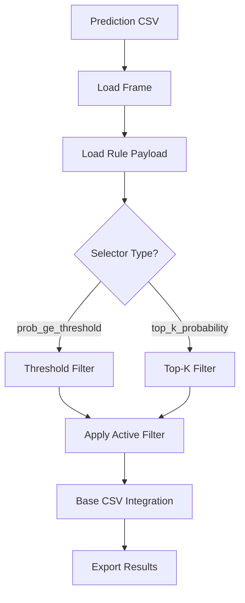
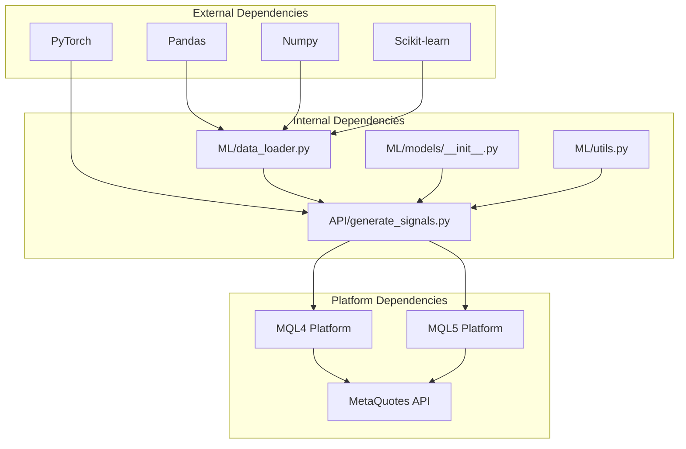
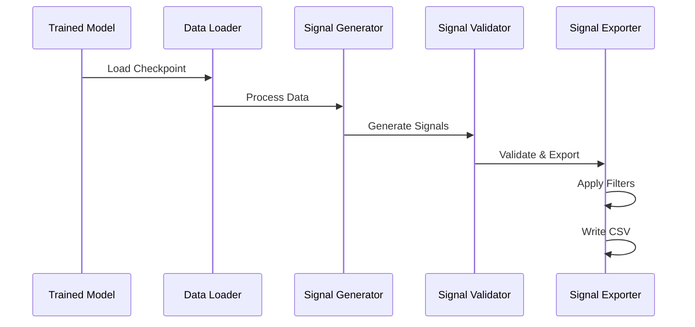

# ML Signal Library

<cite>
**Referenced Files in This Document**
- [lib_ML_Signal.mqh](file://MT/MQL5/Include/lib_ML_Signal.mqh)
- [lib_ML_Signal.mqh](file://MT/MQL4/Include/lib_ML_Signal.mqh)
- [lib_ML_Signal_back.mqh](file://MT/MQL4/Include/lib_ML_Signal_back.mqh)
- [$o$imple.mq4](file://MT/MQL4/Experts/$o$imple.mq4)
- [$o$imple.mq5](file://MT/MQL5/Experts/$o$imple.mq5)
- [generate_signals.py](file://API/generate_signals.py)
- [export_entry_path_v1_signals.py](file://API/export_entry_path_v1_signals.py)
- [export_take_skip_trailing_stop_v2_signals.py](file://API/export_take_skip_trailing_stop_v2_signals.py)
- [data_loader.py](file://ML/data_loader.py)
- [models/__init__.py](file://ML/models/__init__.py)
- [signal_research.py](file://API/signal_research.py)
- [utils.py](file://ML/utils.py)
- [test_mql_telemetry_params_csv_contract.py](file://tests/test_mql_telemetry_params_csv_contract.py)
</cite>

## Table of Contents
1. [Introduction](#introduction)
2. [Project Structure](#project-structure)
3. [Core Components](#core-components)
4. [Architecture Overview](#architecture-overview)
5. [Detailed Component Analysis](#detailed-component-analysis)
6. [Dependency Analysis](#dependency-analysis)
7. [Performance Considerations](#performance-considerations)
8. [Troubleshooting Guide](#troubleshooting-guide)
9. [Conclusion](#conclusion)

## Introduction
The ML Signal Library is the core component of the SoSimple trading system responsible for generating, validating, and executing machine learning-powered trading signals. It bridges the gap between ML model inference and real-time trading execution by providing:
- CSV-based signal generation from trained models
- Real-time signal loading and filtering in MetaQuotes platforms
- Adaptive position sizing and risk management
- Comprehensive diagnostics and performance tracking
- Support for multiple signal formats and execution modes

The library operates through a three-tier architecture: model inference pipeline, signal processing engine, and trading execution interface, enabling seamless integration between research-grade ML models and production trading environments.

## Project Structure
The ML Signal Library is organized across three primary domains within the SoSimple ecosystem:



**Diagram sources**
- [generate_signals.py:1-745](file://API/generate_signals.py#L1-L745)
- [lib_ML_Signal.mqh:1-325](file://MT/MQL5/Include/lib_ML_Signal.mqh#L1-L325)
- [$o$imple.mq4:1-149](file://MT/MQL4/Experts/$o$imple.mq4#L1-L149)

**Section sources**
- [generate_signals.py:1-745](file://API/generate_signals.py#L1-L745)
- [lib_ML_Signal.mqh:1-325](file://MT/MQL5/Include/lib_ML_Signal.mqh#L1-L325)
- [$o$imple.mq4:1-149](file://MT/MQL4/Experts/$o$imple.mq4#L1-L149)

## Core Components

### Signal Generation Pipeline
The signal generation pipeline transforms trained ML models into executable trading signals through a multi-stage process:



**Diagram sources**
- [generate_signals.py:126-178](file://API/generate_signals.py#L126-L178)
- [generate_signals.py:342-668](file://API/generate_signals.py#L342-L668)

### Signal Loading and Processing
The signal loading mechanism provides efficient access to pre-computed signals with built-in validation and filtering capabilities:



**Diagram sources**
- [lib_ML_Signal.mqh:55-131](file://MT/MQL5/Include/lib_ML_Signal.mqh#L55-L131)
- [lib_ML_Signal.mqh:135-146](file://MT/MQL5/Include/lib_ML_Signal.mqh#L135-L146)

### Execution Logic and Risk Management
The execution engine implements sophisticated risk management with adaptive position sizing and multiple exit strategies:



**Diagram sources**
- [lib_ML_Signal.mqh:161-299](file://MT/MQL5/Include/lib_ML_Signal.mqh#L161-L299)
- [lib_ML_Signal.mqh:603-801](file://MT/MQL4/Include/lib_ML_Signal.mqh#L603-L801)

**Section sources**
- [generate_signals.py:126-178](file://API/generate_signals.py#L126-L178)
- [lib_ML_Signal.mqh:55-131](file://MT/MQL5/Include/lib_ML_Signal.mqh#L55-L131)
- [lib_ML_Signal.mqh:161-299](file://MT/MQL5/Include/lib_ML_Signal.mqh#L161-L299)

## Architecture Overview

### System Architecture
The ML Signal Library follows a modular architecture designed for scalability and maintainability:



**Diagram sources**
- [data_loader.py:231-285](file://ML/data_loader.py#L231-L285)
- [generate_signals.py:342-668](file://API/generate_signals.py#L342-L668)
- [lib_ML_Signal.mqh:1-325](file://MT/MQL5/Include/lib_ML_Signal.mqh#L1-L325)

### Signal File Format Specifications
The library supports multiple signal formats optimized for different use cases:

| Format Type | File Name | Columns | Purpose |
|-------------|-----------|---------|---------|
| Standard ML | `ml_signals.csv` | `time;signal;up_3;dn_3;...;up_48;dn_48` | Primary trading signals |
| Triple Barrier | `ml_signals_tb.csv` | `time;signal;sl_atr;tp_atr;prob;ev` | Probabilistic signals |
| Entry Path | `ml_signals_entry_path.csv` | `time;signal;pred_ret_24_dir_atr` | Research signals |
| Take/Skip | `ml_signals_take_skip.csv` | `time;signal;pred_take_*` | Execution policy signals |

**Section sources**
- [lib_ML_Signal.mqh:12-14](file://MT/MQL5/Include/lib_ML_Signal.mqh#L12-L14)
- [generate_signals.py:28-34](file://API/generate_signals.py#L28-L34)
- [export_entry_path_v1_signals.py:1-14](file://API/export_entry_path_v1_signals.py#L1-L14)

## Detailed Component Analysis

### Signal Generation Engine
The signal generation engine transforms model predictions into actionable trading signals through a comprehensive processing pipeline:

#### Core Functions and Parameters

**preds_to_signals Function**
- **Purpose**: Converts model predictions to trading signals
- **Parameters**: 
  - `y_pred`: Model prediction array
  - `horizon`: Forecast horizon (3, 6, 12, 24, 48)
  - `theta`: Probability threshold
  - `conformal_quantiles`: Optional conformal prediction thresholds
- **Returns**: Array of signals (-1, 0, 1)

**tb_preds_to_signals Function**
- **Purpose**: Processes triple barrier model predictions
- **Parameters**:
  - `y_pred_logits`: Raw logits from triple barrier model
  - `theta`: Probability threshold
  - `min_ev`: Minimum expected value
- **Returns**: DataFrame with signal, SL/TP levels, probability, and expected value

#### Signal Processing Workflow



**Diagram sources**
- [generate_signals.py:147-178](file://API/generate_signals.py#L147-L178)
- [generate_signals.py:185-198](file://API/generate_signals.py#L185-L198)

**Section sources**
- [generate_signals.py:147-178](file://API/generate_signals.py#L147-L178)
- [generate_signals.py:185-198](file://API/generate_signals.py#L185-L198)

### Signal Loading and Validation
The signal loading system provides robust validation and efficient access to pre-computed signals:

#### Memory Management and Data Structures

**Signal Storage Arrays**
- `ML_Times[]`: Timestamp array for binary search
- `ML_Signals[]`: Signal values (-1, 0, 1)
- `ML_Up3[]` to `ML_Dn48[]`: Prediction confidence values
- `ML_SignalCount`: Current signal count

**Memory Allocation Strategy**
- Pre-allocate arrays with `ML_MAX_SIGNALS` capacity
- Dynamically resize arrays to actual signal count
- Support up to 200,000 signals per file

#### Binary Search Implementation
The signal lookup uses efficient binary search for O(log n) access times:

```mermaid
flowchart TD
A[Target Time] --> B{Search Range Valid?}
B --> |Yes| C[Calculate Midpoint]
C --> D{Match Found?}
D --> |Yes| E[Return Index]
D --> |No| F{Target < Midpoint?}
F --> |Yes| G[Search Lower Half]
F --> |No| H[Search Upper Half]
G --> B
H --> B
B --> |No| I[Return -1 (Not Found)]
```

**Diagram sources**
- [lib_ML_Signal.mqh:135-146](file://MT/MQL5/Include/lib_ML_Signal.mqh#L135-L146)

**Section sources**
- [lib_ML_Signal.mqh:39-51](file://MT/MQL5/Include/lib_ML_Signal.mqh#L39-L51)
- [lib_ML_Signal.mqh:135-146](file://MT/MQL5/Include/lib_ML_Signal.mqh#L135-L146)

### Execution Logic and Risk Management
The execution engine implements sophisticated risk management with multiple protective mechanisms:

#### Position Sizing and Risk Control
- **Adaptive Lot Sizing**: Uses MM (Money Management) with ATR-based risk limits
- **Position Limits**: Configurable maximum concurrent positions
- **Risk Thresholds**: Maximum risk percentage per trade
- **Stop Loss Protection**: Dynamic SL placement based on model confidence

#### Exit Strategy Options
- **Trailing Stop Mode**: Automatic trailing stop with configurable ATR multiplier
- **Time-Based Exit**: Fixed holding period with automatic closure
- **Reverse Signal Exit**: Immediate closure on conflicting signals
- **Profit Target Exit**: Take-profit levels based on risk-reward ratios

#### Execution Flow



**Diagram sources**
- [lib_ML_Signal.mqh:246-287](file://MT/MQL5/Include/lib_ML_Signal.mqh#L246-L287)
- [lib_ML_Signal.mqh:669-744](file://MT/MQL4/Include/lib_ML_Signal.mqh#L669-L744)

**Section sources**
- [lib_ML_Signal.mqh:246-287](file://MT/MQL5/Include/lib_ML_Signal.mqh#L246-L287)
- [lib_ML_Signal.mqh:669-744](file://MT/MQL4/Include/lib_ML_Signal.mqh#L669-L744)

### Signal Export Utilities
The signal export utilities provide specialized processing for different signal types:

#### Entry Path Signal Export
Processes entry path model predictions with score-based filtering:


**Diagram sources**
- [export_entry_path_v1_signals.py:72-97](file://API/export_entry_path_v1_signals.py#L72-L97)

#### Take/Skip Signal Export
Handles complex execution policy signals with advanced filtering:



**Diagram sources**
- [export_take_skip_trailing_stop_v2_signals.py:93-116](file://API/export_take_skip_trailing_stop_v2_signals.py#L93-L116)

**Section sources**
- [export_entry_path_v1_signals.py:72-97](file://API/export_entry_path_v1_signals.py#L72-L97)
- [export_take_skip_trailing_stop_v2_signals.py:93-116](file://API/export_take_skip_trailing_stop_v2_signals.py#L93-L116)

## Dependency Analysis

### Component Dependencies
The ML Signal Library exhibits a well-structured dependency hierarchy:



**Diagram sources**
- [generate_signals.py:40-72](file://API/generate_signals.py#L40-L72)
- [data_loader.py:40-46](file://ML/data_loader.py#L40-L46)
- [models/__init__.py:17-28](file://ML/models/__init__.py#L17-L28)

### Data Flow Dependencies
The signal processing pipeline maintains clear data flow boundaries:



**Diagram sources**
- [generate_signals.py:342-668](file://API/generate_signals.py#L342-L668)
- [data_loader.py:549-784](file://ML/data_loader.py#L549-L784)

**Section sources**
- [generate_signals.py:40-72](file://API/generate_signals.py#L40-L72)
- [data_loader.py:40-46](file://ML/data_loader.py#L40-L46)
- [models/__init__.py:17-28](file://ML/models/__init__.py#L17-L28)

## Performance Considerations

### Memory Management
The signal library implements several memory optimization strategies:

**Array Management**
- Pre-allocated arrays with `ML_MAX_SIGNALS` capacity (200,000 signals)
- Dynamic resizing to actual signal count reduces memory overhead
- Efficient memory layout minimizes cache misses during binary search

**File I/O Optimization**
- Single-pass CSV parsing with minimal memory footprint
- Buffered file operations reduce disk I/O overhead
- Atomic file writing prevents partial writes and corruption

**Computational Efficiency**
- Vectorized operations using NumPy for prediction processing
- Binary search algorithm provides O(log n) signal lookup
- Early termination in filtering logic reduces unnecessary computations

### Real-Time Performance
The library is optimized for real-time trading execution:

**Signal Lookup Performance**
- Binary search implementation ensures fast signal retrieval
- Pre-processed arrays eliminate parsing overhead during execution
- Static signal arrays provide constant-time access during trading

**Execution Latency**
- Minimal processing between signal reception and order placement
- Asynchronous file monitoring for real-time signal updates
- Optimized risk calculation algorithms minimize execution delays

### Scalability Considerations
The architecture supports horizontal scaling through:

**Modular Design**
- Independent signal generation and execution components
- Pluggable model interfaces support multiple architectures
- Configurable parameters enable deployment flexibility

**Resource Management**
- Memory pools prevent fragmentation during long-running sessions
- Garbage collection optimization reduces pause times
- Efficient data structures minimize resource consumption

## Troubleshooting Guide

### Common Signal-Related Issues

**Signal File Loading Failures**
- **Symptom**: "Cannot open ml_signals.csv" error messages
- **Causes**: File permissions, incorrect file path, missing file
- **Solutions**: Verify file exists in correct location, check file permissions, ensure proper file encoding

**Signal Validation Errors**
- **Symptom**: "Unexpected header" or "Missing columns" warnings
- **Causes**: Incorrect CSV format, missing required columns, wrong delimiter
- **Solutions**: Validate CSV structure matches expected format, ensure semicolon delimiter, verify all required columns are present

**Binary Search Failures**
- **Symptom**: Signals not found despite existing in file
- **Causes**: Time mismatch between signal timestamps and bar times, incorrect time format
- **Solutions**: Verify time zone consistency, check signal timestamp format, ensure chronological ordering

**Execution Logic Issues**
- **Symptom**: Orders not placed despite valid signals
- **Causes**: Risk limits exceeded, position limits reached, invalid signal values
- **Solutions**: Adjust risk parameters, increase position limits, validate signal quality scores

### Error Handling Mechanisms

**File Operation Error Codes**
The library implements comprehensive error handling for file operations:

| Error Code | Description | Resolution |
|------------|-------------|------------|
| 5010 | File must be opened with FILE_READ flag | Use correct file opening flags |
| 5014 | File must be opened with FILE_CSV flag | Ensure CSV file format |
| 5015 | File read error | Check file integrity and permissions |
| 5020 | File does not exist | Verify file path and existence |

**Signal Processing Error Recovery**
- Graceful degradation when individual signals fail validation
- Automatic retry mechanisms for transient file access issues
- Comprehensive logging for debugging signal processing failures

**Section sources**
- [lib_ML_Signal.mqh:55-60](file://MT/MQL5/Include/lib_ML_Signal.mqh#L55-L60)
- [lib_ML_Signal.mqh:457-472](file://MT/MQL4/Include/lib_ML_Signal.mqh#L457-L472)
- [test_mql_telemetry_params_csv_contract.py:13-43](file://tests/test_mql_telemetry_params_csv_contract.py#L13-L43)

### Performance Monitoring
The library provides extensive diagnostic capabilities:

**Built-in Statistics Collection**
- Signal processing counters for trend filters, ratio thresholds, and position blocking
- Execution statistics including successful trades, rejections, and reasons
- Real-time performance metrics for signal loading and processing

**Diagnostic Reporting**
- Comprehensive signal processing reports with rejection percentages
- Execution performance summaries with win rates and expectancy calculations
- Memory usage monitoring and optimization suggestions

**Section sources**
- [lib_ML_Signal.mqh:303-324](file://MT/MQL5/Include/lib_ML_Signal.mqh#L303-L324)
- [lib_ML_Signal.mqh:1-800](file://MT/MQL4/Include/lib_ML_Signal.mqh#L1-L800)

## Conclusion
The ML Signal Library represents a comprehensive solution for integrating machine learning models into production trading systems. Its modular architecture, robust error handling, and performance optimizations make it suitable for both research and production environments.

Key strengths include:
- **Flexible Signal Formats**: Support for multiple signal types and export formats
- **Robust Validation**: Comprehensive data validation and error handling mechanisms
- **Performance Optimization**: Efficient memory management and real-time processing capabilities
- **Risk Management**: Sophisticated risk controls and multiple exit strategies
- **Extensible Design**: Modular architecture supporting various model architectures and trading strategies

The library successfully bridges the gap between research-grade ML models and production trading execution, providing traders with reliable, high-performance signal processing capabilities essential for modern algorithmic trading systems.