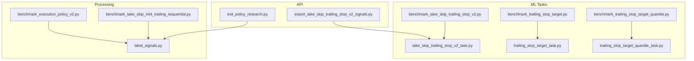
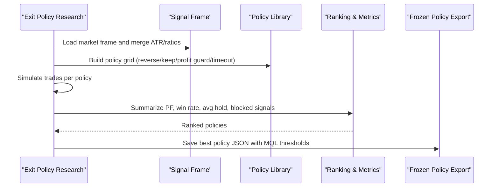
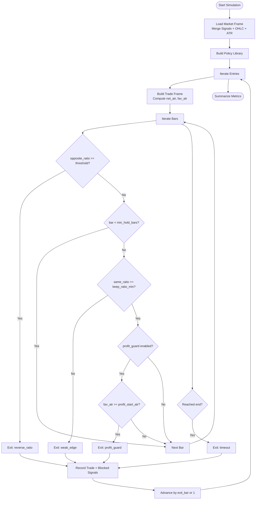
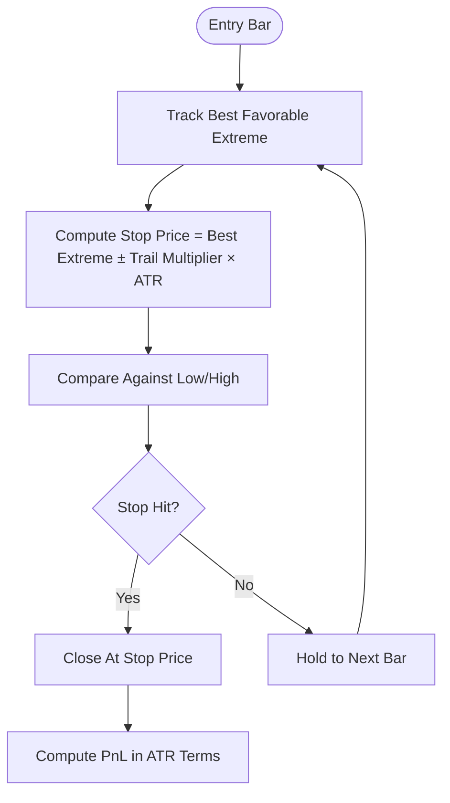
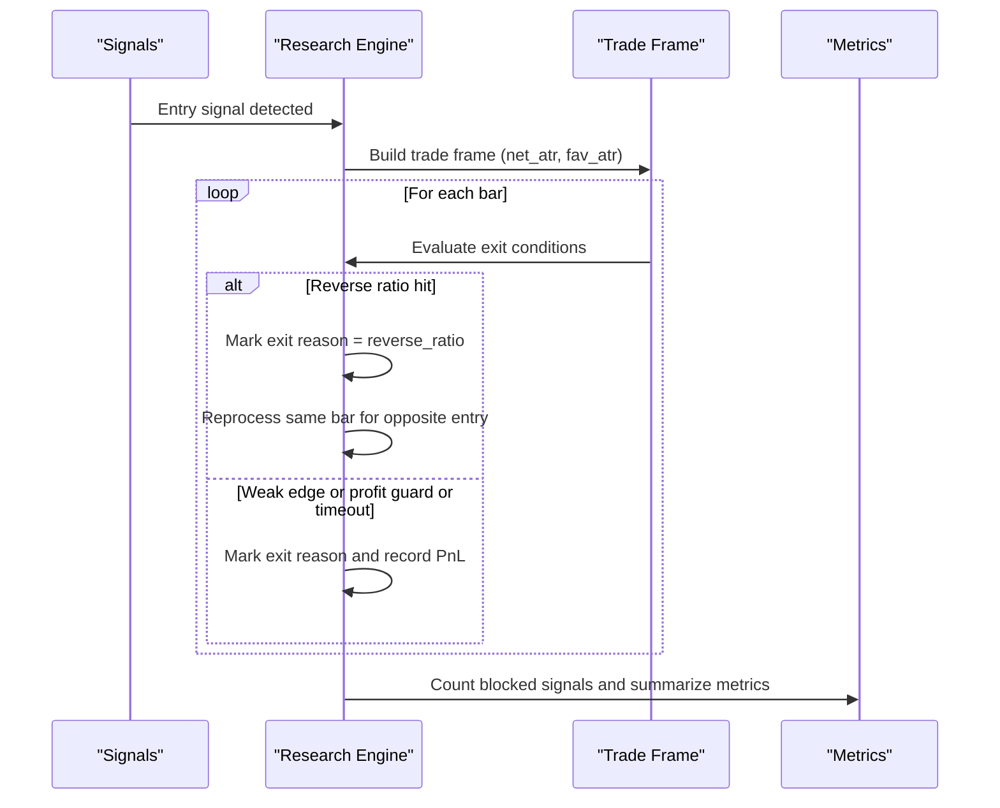
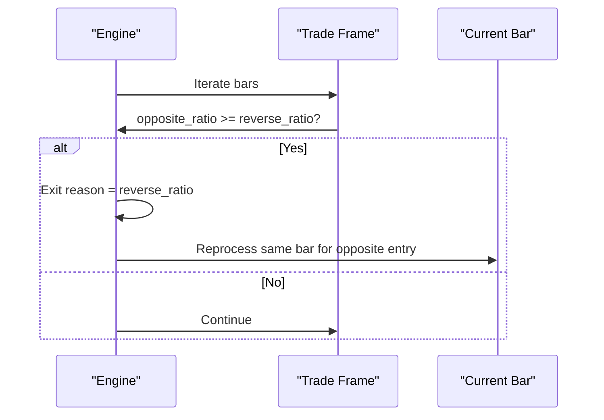
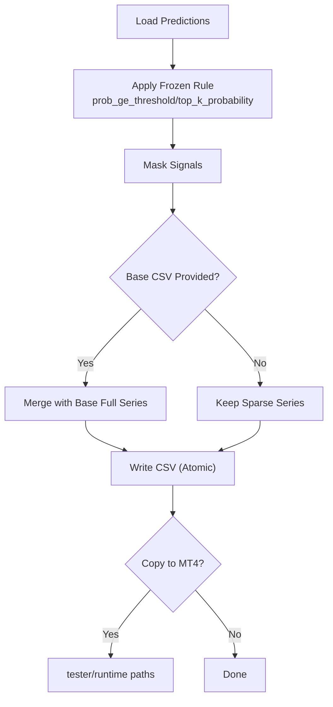
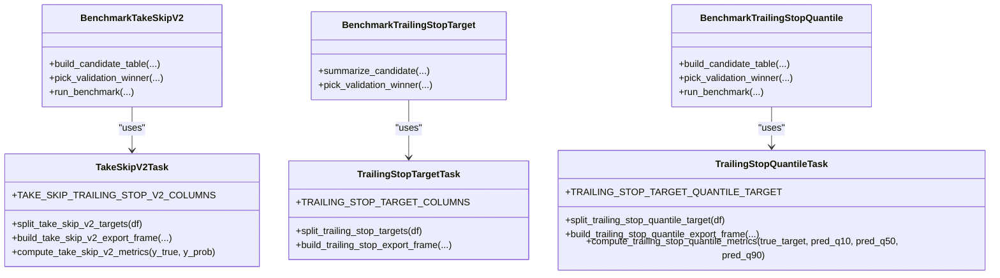
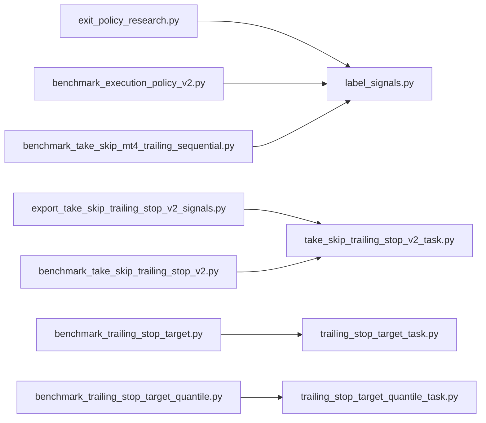

# Position Management and Exit Strategies

<cite>
**Referenced Files in This Document**
- [exit_policy_research.py](file://API/exit_policy_research.py)
- [test_exit_policy_research.py](file://tests/test_exit_policy_research.py)
- [export_take_skip_trailing_stop_v2_signals.py](file://API/export_take_skip_trailing_stop_v2_signals.py)
- [take_skip_trailing_stop_v2_task.py](file://ML/take_skip_trailing_stop_v2_task.py)
- [benchmark_take_skip_trailing_stop_v2.py](file://ML/benchmark_take_skip_trailing_stop_v2.py)
- [trailing_stop_target_task.py](file://ML/trailing_stop_target_task.py)
- [trailing_stop_target_quantile_task.py](file://ML/trailing_stop_target_quantile_task.py)
- [benchmark_trailing_stop_target.py](file://ML/benchmark_trailing_stop_target.py)
- [benchmark_trailing_stop_target_quantile.py](file://ML/benchmark_trailing_stop_target_quantile.py)
- [label_signals.py](file://processing/label_signals.py)
- [benchmark_execution_policy_v2.py](file://ML/benchmark_execution_policy_v2.py)
- [benchmark_take_skip_mt4_trailing_sequential.py](file://ML/benchmark_take_skip_mt4_trailing_sequential.py)
</cite>

## Table of Contents
1. [Introduction](#introduction)
2. [Project Structure](#project-structure)
3. [Core Components](#core-components)
4. [Architecture Overview](#architecture-overview)
5. [Detailed Component Analysis](#detailed-component-analysis)
6. [Dependency Analysis](#dependency-analysis)
7. [Performance Considerations](#performance-considerations)
8. [Troubleshooting Guide](#troubleshooting-guide)
9. [Conclusion](#conclusion)

## Introduction
This document explains position management and exit strategy implementation in the ML Signal Library. It focuses on two primary exit modes:
- Trailing stop based on ATR multiples
- Fixed hold period timeout

It also covers best price tracking for trailing stops, position state management, multi-position coordination, reversal logic for allowing opposite-side entries when signals contradict existing positions, and performance metrics tracking. Edge cases such as partial exits and position blocking are addressed.

## Project Structure
The relevant components span three areas:
- API-level offline research and export utilities
- ML tasks for labeling and benchmarking trailing stop targets and take/skip rules
- Processing utilities for generating synthetic labels and simulating exits

**Diagram sources**
- [exit_policy_research.py:1-416](file://API/exit_policy_research.py#L1-L416)
- [export_take_skip_trailing_stop_v2_signals.py:1-323](file://API/export_take_skip_trailing_stop_v2_signals.py#L1-L323)
- [take_skip_trailing_stop_v2_task.py:1-111](file://ML/take_skip_trailing_stop_v2_task.py#L1-L111)
- [trailing_stop_target_task.py:1-25](file://ML/trailing_stop_target_task.py#L1-L25)
- [trailing_stop_target_quantile_task.py:1-107](file://ML/trailing_stop_target_quantile_task.py#L1-L107)
- [benchmark_take_skip_trailing_stop_v2.py:1-144](file://ML/benchmark_take_skip_trailing_stop_v2.py#L1-L144)
- [benchmark_trailing_stop_target.py:1-32](file://ML/benchmark_trailing_stop_target.py#L1-L32)
- [benchmark_trailing_stop_target_quantile.py:1-248](file://ML/benchmark_trailing_stop_target_quantile.py#L1-L248)
- [label_signals.py:728-843](file://processing/label_signals.py#L728-L843)
- [benchmark_execution_policy_v2.py:271-299](file://ML/benchmark_execution_policy_v2.py#L271-L299)
- [benchmark_take_skip_mt4_trailing_sequential.py:135-162](file://ML/benchmark_take_skip_mt4_trailing_sequential.py#L135-L162)

**Section sources**
- [exit_policy_research.py:1-416](file://API/exit_policy_research.py#L1-L416)
- [export_take_skip_trailing_stop_v2_signals.py:1-323](file://API/export_take_skip_trailing_stop_v2_signals.py#L1-L323)
- [take_skip_trailing_stop_v2_task.py:1-111](file://ML/take_skip_trailing_stop_v2_task.py#L1-L111)
- [trailing_stop_target_task.py:1-25](file://ML/trailing_stop_target_task.py#L1-L25)
- [trailing_stop_target_quantile_task.py:1-107](file://ML/trailing_stop_target_quantile_task.py#L1-L107)
- [benchmark_take_skip_trailing_stop_v2.py:1-144](file://ML/benchmark_take_skip_trailing_stop_v2.py#L1-L144)
- [benchmark_trailing_stop_target.py:1-32](file://ML/benchmark_trailing_stop_target.py#L1-L32)
- [benchmark_trailing_stop_target_quantile.py:1-248](file://ML/benchmark_trailing_stop_target_quantile.py#L1-L248)
- [label_signals.py:728-843](file://processing/label_signals.py#L728-L843)
- [benchmark_execution_policy_v2.py:271-299](file://ML/benchmark_execution_policy_v2.py#L271-L299)
- [benchmark_take_skip_mt4_trailing_sequential.py:135-162](file://ML/benchmark_take_skip_mt4_trailing_sequential.py#L135-L162)

## Core Components
- Exit policy research engine: builds and evaluates policy variants offline, computes performance metrics, and exports a frozen policy suitable for runtime.
- Take/skip and trailing stop labeling and benchmarking: defines target columns, computes metrics, and supports rule-based selection of signals for MT4.
- Trailing stop simulation and labeling: generates synthetic trailing stop PnL labels for training and evaluation.
- Execution policy benchmarks: simulate fixed and shrinking trailing stops, and compare outcomes.

Key responsibilities:
- Policy library construction and ranking
- Best price tracking for trailing stops
- Position state transitions and multi-position coordination
- Reversal logic for opposite-side entries
- Metrics: profit factor, win rate, average hold, blocked signals

**Section sources**
- [exit_policy_research.py:81-122](file://API/exit_policy_research.py#L81-L122)
- [exit_policy_research.py:202-246](file://API/exit_policy_research.py#L202-L246)
- [exit_policy_research.py:259-283](file://API/exit_policy_research.py#L259-L283)
- [label_signals.py:728-843](file://processing/label_signals.py#L728-L843)
- [benchmark_execution_policy_v2.py:271-299](file://ML/benchmark_execution_policy_v2.py#L271-L299)

## Architecture Overview
The system separates offline research and labeling from runtime export and execution.

**Diagram sources**
- [exit_policy_research.py:329-358](file://API/exit_policy_research.py#L329-L358)
- [exit_policy_research.py:360-370](file://API/exit_policy_research.py#L360-L370)

**Section sources**
- [exit_policy_research.py:329-370](file://API/exit_policy_research.py#L329-L370)

## Detailed Component Analysis

### Exit Policy Research Engine
This module:
- Loads market data and merges OHLC with ML signals
- Computes derived ratios and ATR fallbacks
- Builds a library of exit policies (timeout, reverse close, weak edge, profit guard, layered)
- Simulates trades per policy and aggregates performance metrics
- Exports a frozen policy with MQL-friendly thresholds

Key logic highlights:
- Trade frame construction tracks best favorable excursion (peak high/low) and net PnL in ATR terms
- Exit triggers include reverse ratio crossing, weak edge keep ratio, profit guard threshold, and timeout
- Multi-position coordination: after an exit, blocked signals between entry and exit are counted; reversal logic reprocesses the same bar when the signal flips

**Diagram sources**
- [exit_policy_research.py:47-72](file://API/exit_policy_research.py#L47-L72)
- [exit_policy_research.py:158-194](file://API/exit_policy_research.py#L158-L194)
- [exit_policy_research.py:202-246](file://API/exit_policy_research.py#L202-L246)

**Section sources**
- [exit_policy_research.py:47-72](file://API/exit_policy_research.py#L47-L72)
- [exit_policy_research.py:158-194](file://API/exit_policy_research.py#L158-L194)
- [exit_policy_research.py:202-246](file://API/exit_policy_research.py#L202-L246)
- [test_exit_policy_research.py:7-21](file://tests/test_exit_policy_research.py#L7-L21)
- [test_exit_policy_research.py:23-37](file://tests/test_exit_policy_research.py#L23-L37)
- [test_exit_policy_research.py:39-59](file://tests/test_exit_policy_research.py#L39-L59)
- [test_exit_policy_research.py:113-129](file://tests/test_exit_policy_research.py#L113-L129)

### Best Price Tracking for Trailing Stops
Two complementary mechanisms are used:
- Synthetic labels: compute trailing stop PnL under fixed ATR trails for training targets
- Runtime simulation: track best favorable price and compute active trailing stops

**Diagram sources**
- [label_signals.py:728-754](file://processing/label_signals.py#L728-L754)
- [benchmark_execution_policy_v2.py:271-299](file://ML/benchmark_execution_policy_v2.py#L271-L299)
- [benchmark_take_skip_mt4_trailing_sequential.py:135-162](file://ML/benchmark_take_skip_mt4_trailing_sequential.py#L135-L162)

**Section sources**
- [label_signals.py:728-754](file://processing/label_signals.py#L728-L754)
- [label_signals.py:757-843](file://processing/label_signals.py#L757-L843)
- [benchmark_execution_policy_v2.py:271-299](file://ML/benchmark_execution_policy_v2.py#L271-L299)
- [benchmark_take_skip_mt4_trailing_sequential.py:135-162](file://ML/benchmark_take_skip_mt4_trailing_sequential.py#L135-L162)

### Position State Management and Multi-Position Coordination
- Position state transitions:
  - Enter: signal != 0 and bar is entry
  - Exit: triggered by reverse ratio, weak edge keep ratio, profit guard, or timeout
  - Reversal: when exiting due to reverse ratio on an opposite signal, the same bar is reprocessed to allow immediate opposite entry
- Multi-position coordination:
  - During a trade, blocked signals between entry and exit are counted to quantify interference
  - After exit, the iterator advances either by exit_bar (for reversals) or by 1 (for normal exits)

**Diagram sources**
- [exit_policy_research.py:202-246](file://API/exit_policy_research.py#L202-L246)
- [exit_policy_research.py:259-283](file://API/exit_policy_research.py#L259-L283)

**Section sources**
- [exit_policy_research.py:202-246](file://API/exit_policy_research.py#L202-L246)
- [exit_policy_research.py:259-283](file://API/exit_policy_research.py#L259-L283)
- [test_exit_policy_research.py:113-129](file://tests/test_exit_policy_research.py#L113-L129)

### Reversal Logic for Opposite Entry
- When a trade exits because the opposite ratio crosses the reverse threshold, the engine reprocesses the same bar to allow an immediate opposite entry
- This ensures that contradictory signals do not block profitable reversals

**Diagram sources**
- [exit_policy_research.py:241-244](file://API/exit_policy_research.py#L241-L244)
- [test_exit_policy_research.py:113-129](file://tests/test_exit_policy_research.py#L113-L129)

**Section sources**
- [exit_policy_research.py:241-244](file://API/exit_policy_research.py#L241-L244)
- [test_exit_policy_research.py:113-129](file://tests/test_exit_policy_research.py#L113-L129)

### Take/Skip and Trailing Stop Target Export
- Rule application selects signals based on probability thresholds or top-K selection among active rows
- Export pipeline writes atomic CSV files and optionally copies to MT4 tester/runtime locations
- Diagnostic mode can expand sparse predictions into full series using base CSV and direction source

**Diagram sources**
- [export_take_skip_trailing_stop_v2_signals.py:93-117](file://API/export_take_skip_trailing_stop_v2_signals.py#L93-L117)
- [export_take_skip_trailing_stop_v2_signals.py:179-250](file://API/export_take_skip_trailing_stop_v2_signals.py#L179-L250)

**Section sources**
- [export_take_skip_trailing_stop_v2_signals.py:93-117](file://API/export_take_skip_trailing_stop_v2_signals.py#L93-L117)
- [export_take_skip_trailing_stop_v2_signals.py:179-250](file://API/export_take_skip_trailing_stop_v2_signals.py#L179-L250)

### Benchmarking Targets and Metrics
- Take/skip trailing stop v2: define target columns and compute BCE, positive rates, and per-column metrics
- Trailing stop target v1: extract true PnL targets for training
- Quantile targets: compute pinball loss, interval coverage, median width, and correlation metrics

**Diagram sources**
- [take_skip_trailing_stop_v2_task.py:12-111](file://ML/take_skip_trailing_stop_v2_task.py#L12-L111)
- [trailing_stop_target_task.py:5-25](file://ML/trailing_stop_target_task.py#L5-L25)
- [trailing_stop_target_quantile_task.py:5-107](file://ML/trailing_stop_target_quantile_task.py#L5-L107)
- [benchmark_take_skip_trailing_stop_v2.py:71-144](file://ML/benchmark_take_skip_trailing_stop_v2.py#L71-L144)
- [benchmark_trailing_stop_target.py:4-32](file://ML/benchmark_trailing_stop_target.py#L4-L32)
- [benchmark_trailing_stop_target_quantile.py:150-248](file://ML/benchmark_trailing_stop_target_quantile.py#L150-L248)

**Section sources**
- [take_skip_trailing_stop_v2_task.py:12-111](file://ML/take_skip_trailing_stop_v2_task.py#L12-L111)
- [trailing_stop_target_task.py:5-25](file://ML/trailing_stop_target_task.py#L5-L25)
- [trailing_stop_target_quantile_task.py:5-107](file://ML/trailing_stop_target_quantile_task.py#L5-L107)
- [benchmark_take_skip_trailing_stop_v2.py:71-144](file://ML/benchmark_take_skip_trailing_stop_v2.py#L71-L144)
- [benchmark_trailing_stop_target.py:4-32](file://ML/benchmark_trailing_stop_target.py#L4-L32)
- [benchmark_trailing_stop_target_quantile.py:150-248](file://ML/benchmark_trailing_stop_target_quantile.py#L150-L248)

## Dependency Analysis
- The research engine depends on market data and computed ATR/ratio columns
- Labeling utilities depend on OHLC and ATR computation
- Export utilities depend on frozen rule payloads and optional base CSVs
- Benchmarking utilities depend on labeled frames and target columns

**Diagram sources**
- [exit_policy_research.py:329-358](file://API/exit_policy_research.py#L329-L358)
- [export_take_skip_trailing_stop_v2_signals.py:179-250](file://API/export_take_skip_trailing_stop_v2_signals.py#L179-L250)
- [benchmark_take_skip_trailing_stop_v2.py:71-144](file://ML/benchmark_take_skip_trailing_stop_v2.py#L71-L144)
- [benchmark_trailing_stop_target.py:4-32](file://ML/benchmark_trailing_stop_target.py#L4-L32)
- [benchmark_trailing_stop_target_quantile.py:150-248](file://ML/benchmark_trailing_stop_target_quantile.py#L150-L248)
- [label_signals.py:728-843](file://processing/label_signals.py#L728-L843)
- [benchmark_execution_policy_v2.py:271-299](file://ML/benchmark_execution_policy_v2.py#L271-L299)
- [benchmark_take_skip_mt4_trailing_sequential.py:135-162](file://ML/benchmark_take_skip_mt4_trailing_sequential.py#L135-L162)

**Section sources**
- [exit_policy_research.py:329-358](file://API/exit_policy_research.py#L329-L358)
- [export_take_skip_trailing_stop_v2_signals.py:179-250](file://API/export_take_skip_trailing_stop_v2_signals.py#L179-L250)
- [benchmark_take_skip_trailing_stop_v2.py:71-144](file://ML/benchmark_take_skip_trailing_stop_v2.py#L71-L144)
- [benchmark_trailing_stop_target.py:4-32](file://ML/benchmark_trailing_stop_target.py#L4-L32)
- [benchmark_trailing_stop_target_quantile.py:150-248](file://ML/benchmark_trailing_stop_target_quantile.py#L150-L248)
- [label_signals.py:728-843](file://processing/label_signals.py#L728-L843)
- [benchmark_execution_policy_v2.py:271-299](file://ML/benchmark_execution_policy_v2.py#L271-L299)
- [benchmark_take_skip_mt4_trailing_sequential.py:135-162](file://ML/benchmark_take_skip_mt4_trailing_sequential.py#L135-L162)

## Performance Considerations
- Policy ranking prioritizes profit factor and applies a minimum trade floor to avoid overfitting to small samples
- Metrics include PF, win rate, average hold bars, and average blocked signals to balance expectancy and interference
- Export pipeline writes atomic CSVs and optionally mirrors to MT4 paths for parity testing

[No sources needed since this section provides general guidance]

## Troubleshooting Guide
Common issues and checks:
- Missing ATR column: fallback computation is applied during market frame loading
- Invalid rule selectors: only supported selectors are accepted; thresholds validated accordingly
- Non-finite values in metrics: strict validation prevents invalid inputs
- Split profile mismatch: test_final requires a frozen policy JSON; otherwise, a policy library is built

**Section sources**
- [exit_policy_research.py:286-289](file://API/exit_policy_research.py#L286-L289)
- [exit_policy_research.py:387-386](file://API/exit_policy_research.py#L387-L386)
- [export_take_skip_trailing_stop_v2_signals.py:60-91](file://API/export_take_skip_trailing_stop_v2_signals.py#L60-L91)
- [take_skip_trailing_stop_v2_task.py:82-94](file://ML/take_skip_trailing_stop_v2_task.py#L82-L94)

## Conclusion
The ML Signal Library provides a robust framework for position management and exit strategies. The research engine enables offline evaluation of multiple exit policies, while labeling and benchmarking utilities support reliable training and selection of trailing stop targets. The export pipeline integrates seamlessly with MT4 environments, and the reversal logic ensures dynamic responsiveness to contradictory signals. Together, these components deliver a production-ready foundation for disciplined trading with ATR-based exits and performance-driven policy selection.