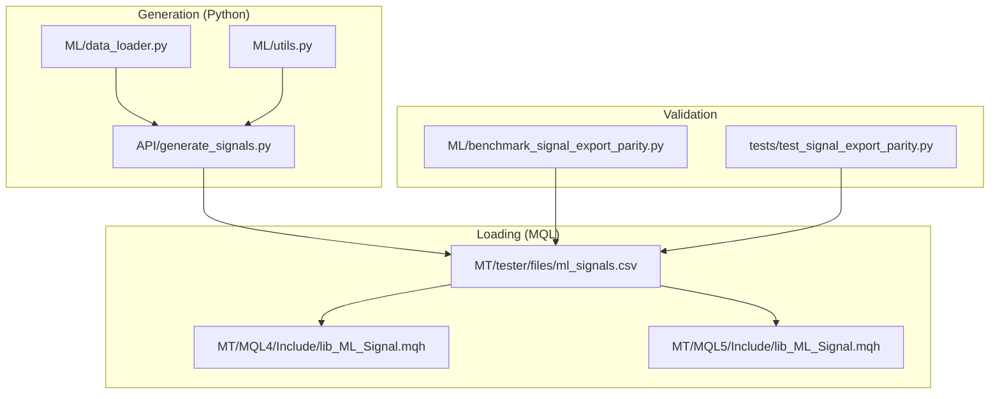
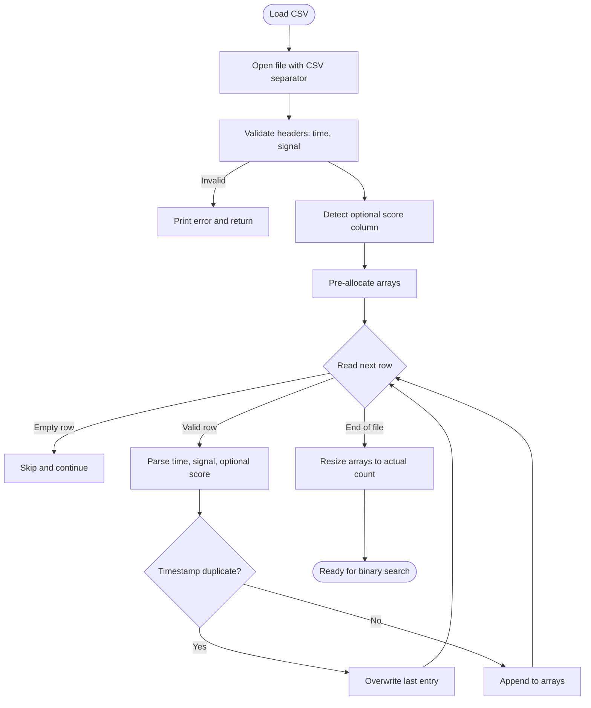
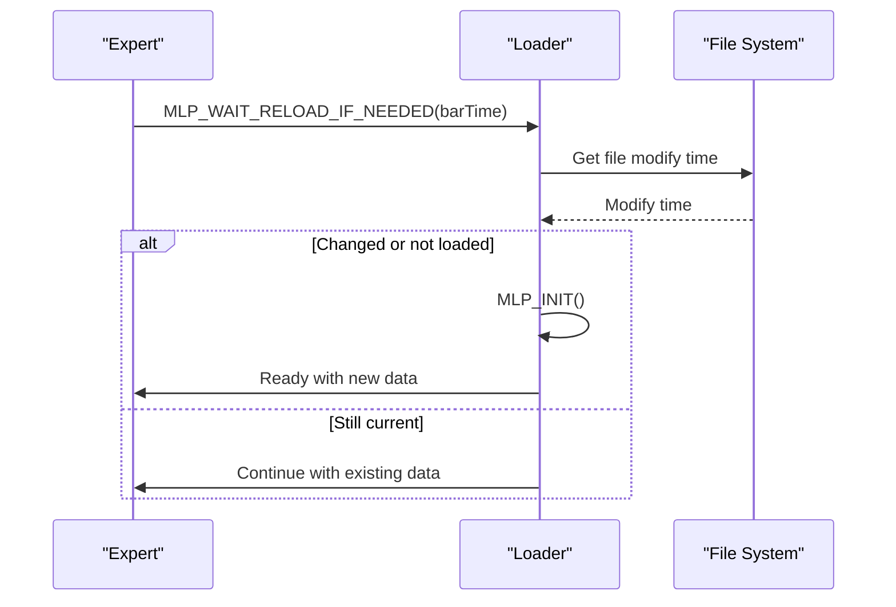
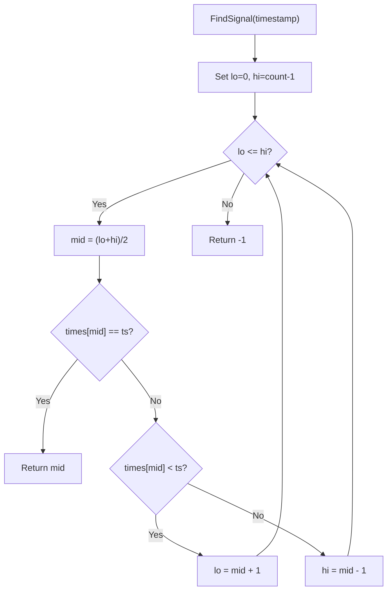
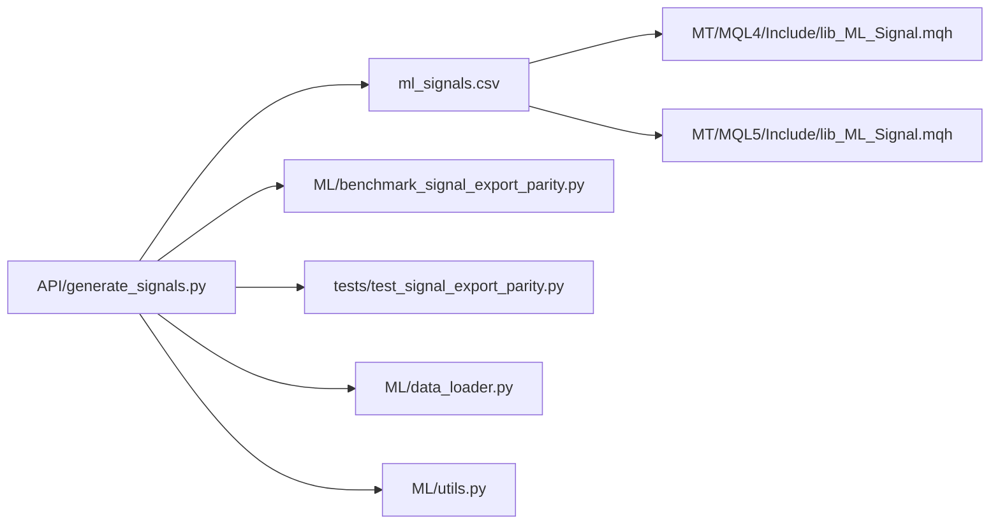

# Signal File Processing

<cite>
**Referenced Files in This Document**
- [generate_signals.py](file://API/generate_signals.py)
- [lib_ML_Signal.mqh](file://MT/MQL4/Include/lib_ML_Signal.mqh)
- [lib_ML_Signal.mqh](file://MT/MQL5/Include/lib_ML_Signal.mqh)
- [ml_signals.csv](file://MT/tester/files/ml_signals.csv)
- [benchmark_signal_export_parity.py](file://ML/benchmark_signal_export_parity.py)
- [test_signal_export_parity.py](file://tests/test_signal_export_parity.py)
- [data_loader.py](file://ML/data_loader.py)
- [utils.py](file://ML/utils.py)
</cite>

## Table of Contents
1. [Introduction](#introduction)
2. [Project Structure](#project-structure)
3. [Core Components](#core-components)
4. [Architecture Overview](#architecture-overview)
5. [Detailed Component Analysis](#detailed-component-analysis)
6. [Dependency Analysis](#dependency-analysis)
7. [Performance Considerations](#performance-considerations)
8. [Troubleshooting Guide](#troubleshooting-guide)
9. [Conclusion](#conclusion)

## Introduction
This document explains the signal file processing functionality in the ML Signal Library. It covers the CSV file format specifications, signal loading mechanisms with automatic reloading and validation, the indexing system using binary search for timestamp lookup, examples of file structure and parsing logic, error handling for malformed data, and memory management considerations for large datasets. The goal is to provide a comprehensive understanding for both technical and non-technical readers.

## Project Structure
The signal processing spans three main areas:
- Generation: Python scripts produce ml_signals.csv with standardized columns and deduplication by timestamp.
- Loading: MQL libraries read and parse CSV files for Strategy Tester and live trading.
- Validation: Utilities and tests validate CSV structure and detect anomalies.



**Diagram sources**
- [generate_signals.py:652-668](file://API/generate_signals.py#L652-L668)
- [lib_ML_Signal.mqh:557-551](file://MT/MQL4/Include/lib_ML_Signal.mqh#L557-L551)
- [lib_ML_Signal.mqh:55-131](file://MT/MQL5/Include/lib_ML_Signal.mqh#L55-L131)
- [ml_signals.csv:1-50](file://MT/tester/files/ml_signals.csv#L1-L50)
- [benchmark_signal_export_parity.py:35-59](file://ML/benchmark_signal_export_parity.py#L35-L59)
- [test_signal_export_parity.py:14-38](file://tests/test_signal_export_parity.py#L14-L38)

**Section sources**
- [generate_signals.py:1-26](file://API/generate_signals.py#L1-L26)
- [lib_ML_Signal.mqh:1-26](file://MT/MQL4/Include/lib_ML_Signal.mqh#L1-L26)
- [lib_ML_Signal.mqh:1-16](file://MT/MQL5/Include/lib_ML_Signal.mqh#L1-L16)
- [ml_signals.csv:1-50](file://MT/tester/files/ml_signals.csv#L1-L50)

## Core Components
- CSV generation pipeline: Produces ml_signals.csv with time, signal, and optional prediction columns; sorts by time and deduplicates by timestamp.
- MQL4/MQL5 signal loaders: Parse CSV, detect optional score/score-like columns, maintain arrays for fast lookup, and support automatic reload on file change.
- Binary search indexing: Efficient timestamp lookup for real-time trading decisions.
- Validation utilities: Detect duplicate timestamps, opposite signals at the same time, and malformed rows.

**Section sources**
- [generate_signals.py:652-668](file://API/generate_signals.py#L652-L668)
- [lib_ML_Signal.mqh:457-551](file://MT/MQL4/Include/lib_ML_Signal.mqh#L457-L551)
- [lib_ML_Signal.mqh:55-131](file://MT/MQL5/Include/lib_ML_Signal.mqh#L55-L131)

## Architecture Overview
The system follows a generation-to-loading-to-validation architecture:
- Generation creates a sorted, deduplicated CSV with a strict contract for columns.
- MQL loaders read the CSV, validate headers, and populate in-memory arrays.
- Binary search enables O(log n) timestamp lookup during live trading.
- Validation utilities and tests ensure data integrity and parity across exports.

```mermaid
sequenceDiagram
participant GEN as "Generator (Python)"
participant FS as "File System"
participant MQL4 as "MQL4 Loader"
participant MQL5 as "MQL5 Loader"
participant VALID as "Validator"
GEN->>FS : Write ml_signals.csv (time;signal[;preds...])
FS-->>MQL4 : File available
FS-->>MQL5 : File available
MQL4->>MQL4 : Header validation<br/>Optional score detection
MQL5->>MQL5 : Header validation<br/>Optional score detection
MQL4->>MQL4 : Load CSV into arrays
MQL5->>MQL5 : Load CSV into arrays
MQL4->>MQL4 : Binary search by timestamp
MQL5->>MQL5 : Binary search by timestamp
VALID->>FS : Analyze CSV structure and duplicates
```

**Diagram sources**
- [generate_signals.py:652-668](file://API/generate_signals.py#L652-L668)
- [lib_ML_Signal.mqh:457-551](file://MT/MQL4/Include/lib_ML_Signal.mqh#L457-L551)
- [lib_ML_Signal.mqh:55-131](file://MT/MQL5/Include/lib_ML_Signal.mqh#L55-L131)
- [benchmark_signal_export_parity.py:35-59](file://ML/benchmark_signal_export_parity.py#L35-L59)

## Detailed Component Analysis

### CSV File Format Specifications
- Minimal format: time;signal
- Extended format: time;signal;up_3;dn_3;...;up_48;dn_48
- Optional score-like column: pred_ret_24_dir_atr (detected automatically)
- Timestamp format: "YYYY.MM.DD HH:MM" (matches MT4 Time[bar])
- Sorting: ascending by time
- Deduplication: keep last occurrence for duplicate timestamps

Examples of structure:
- Minimal: [ml_signals.csv:1-50](file://MT/tester/files/ml_signals.csv#L1-L50)
- Extended: [lib_ML_Signal.mqh:12-14](file://MT/MQL5/Include/lib_ML_Signal.mqh#L12-L14)

Validation and deduplication logic:
- Generator sorts by time and drops duplicates by keeping the last timestamp occurrence.
- Validator detects duplicate timestamps and opposite signals at the same time.

**Section sources**
- [ml_signals.csv:1-50](file://MT/tester/files/ml_signals.csv#L1-L50)
- [lib_ML_Signal.mqh:12-14](file://MT/MQL5/Include/lib_ML_Signal.mqh#L12-L14)
- [generate_signals.py:652-668](file://API/generate_signals.py#L652-L668)
- [benchmark_signal_export_parity.py:35-59](file://ML/benchmark_signal_export_parity.py#L35-L59)
- [test_signal_export_parity.py:14-38](file://tests/test_signal_export_parity.py#L14-L38)

### Signal Loading Mechanism
- File opening and header validation: Ensures first two columns are "time" and "signal".
- Optional column detection: Reads additional columns and detects presence of pred_ret_24_dir_atr to enable score filtering.
- Memory pre-allocation: Pre-allocates arrays for time, signal, and scores to minimize reallocations.
- Row parsing loop: Skips empty rows, parses time and signal, optionally reads score column.
- Deduplication handling: Overwrites last entry if timestamp repeats.
- Final resize: Resizes arrays to actual loaded count.
- Modification detection: Stores file modification time and reloads when changed.



**Diagram sources**
- [lib_ML_Signal.mqh:457-551](file://MT/MQL4/Include/lib_ML_Signal.mqh#L457-L551)
- [lib_ML_Signal.mqh:55-131](file://MT/MQL5/Include/lib_ML_Signal.mqh#L55-L131)

**Section sources**
- [lib_ML_Signal.mqh:457-551](file://MT/MQL4/Include/lib_ML_Signal.mqh#L457-L551)
- [lib_ML_Signal.mqh:55-131](file://MT/MQL5/Include/lib_ML_Signal.mqh#L55-L131)

### Automatic Reloading and File Change Detection
- Modification time check: Compares file modification date against cached value.
- Conditional reload: If file changed, re-initializes arrays and resets runtime start time.
- Real-time waiting mode: In live mode, waits up to a configured timeout for newer data and logs progress.



**Diagram sources**
- [lib_ML_Signal.mqh:553-601](file://MT/MQL4/Include/lib_ML_Signal.mqh#L553-L601)

**Section sources**
- [lib_ML_Signal.mqh:553-601](file://MT/MQL4/Include/lib_ML_Signal.mqh#L553-L601)

### Signal Indexing System with Binary Search
- Sorted arrays: Times array is kept sorted by ascending timestamp.
- Binary search: O(log n) lookup by timestamp for both MQL4 and MQL5 loaders.
- Insert position: Additional helper finds insertion position for timestamp-aware logic.



**Diagram sources**
- [lib_ML_Signal.mqh:389-401](file://MT/MQL4/Include/lib_ML_Signal.mqh#L389-L401)
- [lib_ML_Signal.mqh:135-146](file://MT/MQL5/Include/lib_ML_Signal.mqh#L135-L146)

**Section sources**
- [lib_ML_Signal.mqh:389-401](file://MT/MQL4/Include/lib_ML_Signal.mqh#L389-L401)
- [lib_ML_Signal.mqh:135-146](file://MT/MQL5/Include/lib_ML_Signal.mqh#L135-L146)

### Parsing Logic and Data Validation
- Header validation: Ensures first two columns are "time" and "signal".
- Optional score detection: Reads extra columns and sets flag if pred_ret_24_dir_atr is present.
- Type conversion: Converts time strings to datetime and signal values to integers; score to float.
- Empty row handling: Skips rows with missing time values.
- Duplicate handling: Overwrites last entry for repeated timestamps.
- Post-load resize: Reduces arrays to actual size to save memory.

**Section sources**
- [lib_ML_Signal.mqh:457-551](file://MT/MQL4/Include/lib_ML_Signal.mqh#L457-L551)
- [lib_ML_Signal.mqh:55-131](file://MT/MQL5/Include/lib_ML_Signal.mqh#L55-L131)

### Error Handling for Malformed Data
Common issues and handling:
- Missing or unexpected headers: Loader prints an error and returns without loading.
- Empty or invalid time values: Rows are skipped.
- Duplicate timestamps: Last occurrence overwrites previous entries.
- Missing score column: Score filtering is disabled with a warning.
- Zero-length files: Loader logs that zero rows were loaded.

Detection and logging:
- Header mismatch: Explicit print with column names.
- Score column absence: Prints a message indicating score filter is disabled.
- No signals: Logs count and range information.

**Section sources**
- [lib_ML_Signal.mqh:465-472](file://MT/MQL4/Include/lib_ML_Signal.mqh#L465-L472)
- [lib_ML_Signal.mqh:546-548](file://MT/MQL4/Include/lib_ML_Signal.mqh#L546-L548)
- [lib_ML_Signal.mqh:530-533](file://MT/MQL4/Include/lib_ML_Signal.mqh#L530-L533)

### Memory Management for Large Datasets
- Pre-allocation: Arrays are allocated to a maximum capacity to reduce dynamic resizing overhead.
- Final resize: After loading, arrays are resized down to the actual number of rows.
- Fixed-size limits: Maximum signal count constants prevent unbounded growth.
- Optional score arrays: Only allocated when the score column is detected.

Practical implications:
- Memory footprint equals the number of rows times the size of stored fields.
- For very large datasets, consider reducing maximum capacity or using external storage with streaming.

**Section sources**
- [lib_ML_Signal.mqh:20-25](file://MT/MQL4/Include/lib_ML_Signal.mqh#L20-L25)
- [lib_ML_Signal.mqh:484-525](file://MT/MQL4/Include/lib_ML_Signal.mqh#L484-L525)
- [lib_ML_Signal.mqh:20-25](file://MT/MQL5/Include/lib_ML_Signal.mqh#L20-L25)
- [lib_ML_Signal.mqh:67-117](file://MT/MQL5/Include/lib_ML_Signal.mqh#L67-L117)

### Performance Considerations for Real-Time Processing
- Binary search: O(log n) lookup ensures fast timestamp retrieval during live trading.
- Pre-allocated arrays: Minimizes allocation overhead and improves cache locality.
- Optional score filtering: Adds minimal overhead but enables robust gating of low-confidence signals.
- File watching: In live mode, periodic checks with sleep intervals balance responsiveness and CPU usage.
- Deduplication: Keeps data compact and reduces search space.

Recommendations:
- Keep CSV sorted and deduplicated at generation time to avoid repeated work.
- Monitor file modification frequency; adjust wait timeouts for live environments.
- Use score filtering when available to reduce noisy trades.

**Section sources**
- [lib_ML_Signal.mqh:389-401](file://MT/MQL4/Include/lib_ML_Signal.mqh#L389-L401)
- [lib_ML_Signal.mqh:567-601](file://MT/MQL4/Include/lib_ML_Signal.mqh#L567-L601)
- [generate_signals.py:652-668](file://API/generate_signals.py#L652-L668)

## Dependency Analysis
The signal processing pipeline depends on:
- Python generator for CSV creation and validation.
- MQL loaders for runtime consumption.
- Validation utilities for parity checks and anomaly detection.



**Diagram sources**
- [generate_signals.py:652-668](file://API/generate_signals.py#L652-L668)
- [lib_ML_Signal.mqh:557-551](file://MT/MQL4/Include/lib_ML_Signal.mqh#L557-L551)
- [lib_ML_Signal.mqh:55-131](file://MT/MQL5/Include/lib_ML_Signal.mqh#L55-L131)
- [benchmark_signal_export_parity.py:35-59](file://ML/benchmark_signal_export_parity.py#L35-L59)
- [test_signal_export_parity.py:14-38](file://tests/test_signal_export_parity.py#L14-L38)
- [data_loader.py:549-784](file://ML/data_loader.py#L549-L784)
- [utils.py:326-340](file://ML/utils.py#L326-L340)

**Section sources**
- [generate_signals.py:652-668](file://API/generate_signals.py#L652-L668)
- [lib_ML_Signal.mqh:557-551](file://MT/MQL4/Include/lib_ML_Signal.mqh#L557-L551)
- [lib_ML_Signal.mqh:55-131](file://MT/MQL5/Include/lib_ML_Signal.mqh#L55-L131)
- [benchmark_signal_export_parity.py:35-59](file://ML/benchmark_signal_export_parity.py#L35-L59)
- [test_signal_export_parity.py:14-38](file://tests/test_signal_export_parity.py#L14-L38)
- [data_loader.py:549-784](file://ML/data_loader.py#L549-L784)
- [utils.py:326-340](file://ML/utils.py#L326-L340)

## Performance Considerations
- CSV generation: Sorting and deduplication occur once during export; ensure sufficient disk space and I/O bandwidth.
- MQL loading: Pre-allocation minimizes allocations; binary search is efficient for typical signal counts.
- Live mode: File modification polling introduces periodic overhead; tune polling intervals for latency vs. CPU trade-offs.
- Memory: Arrays are resized post-load; for very large datasets, consider external storage or streaming approaches.

## Troubleshooting Guide
Common issues and resolutions:
- CSV header mismatch: Verify first two columns are "time" and "signal".
- Missing score column: Enable score filtering only when pred_ret_24_dir_atr exists.
- Duplicate timestamps: Ensure deduplication occurs at generation time; loader overwrites duplicates.
- Empty or zero-row files: Confirm CSV generation succeeded and file is not locked.
- Live reload not triggering: Check file modification permissions and ensure the file is being rewritten rather than moved.

Diagnostic aids:
- Loader logs show counts, ranges, and reasons for skipping signals.
- Validation utilities summarize duplicates and opposite signals at the same timestamp.

**Section sources**
- [lib_ML_Signal.mqh:465-472](file://MT/MQL4/Include/lib_ML_Signal.mqh#L465-L472)
- [lib_ML_Signal.mqh:546-548](file://MT/MQL4/Include/lib_ML_Signal.mqh#L546-L548)
- [lib_ML_Signal.mqh:530-533](file://MT/MQL4/Include/lib_ML_Signal.mqh#L530-L533)
- [benchmark_signal_export_parity.py:35-59](file://ML/benchmark_signal_export_parity.py#L35-L59)
- [test_signal_export_parity.py:14-38](file://tests/test_signal_export_parity.py#L14-L38)

## Conclusion
The ML Signal Library provides a robust pipeline for generating, loading, and validating CSV-based signals. The generation stage ensures sorted, deduplicated data with a strict column contract. The MQL loaders efficiently parse CSVs, detect optional score columns, and support automatic reloading. Binary search indexing enables fast timestamp lookups essential for real-time trading. Validation utilities and tests help maintain data integrity and parity across exports. Together, these components deliver a scalable and reliable foundation for signal-driven trading systems.