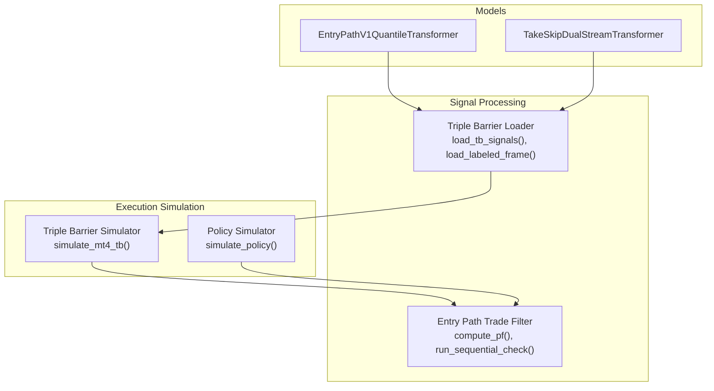
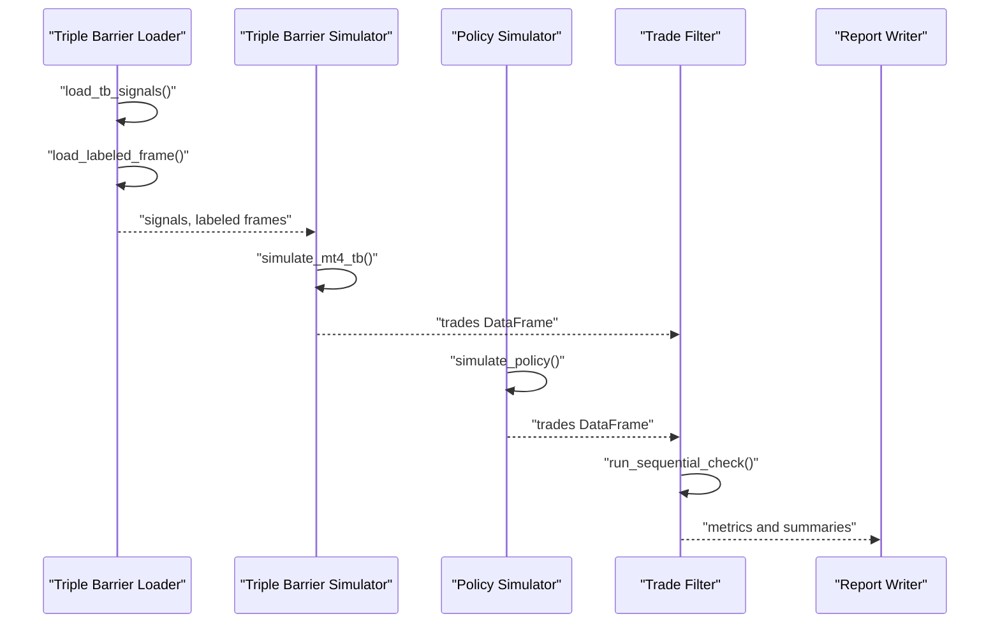
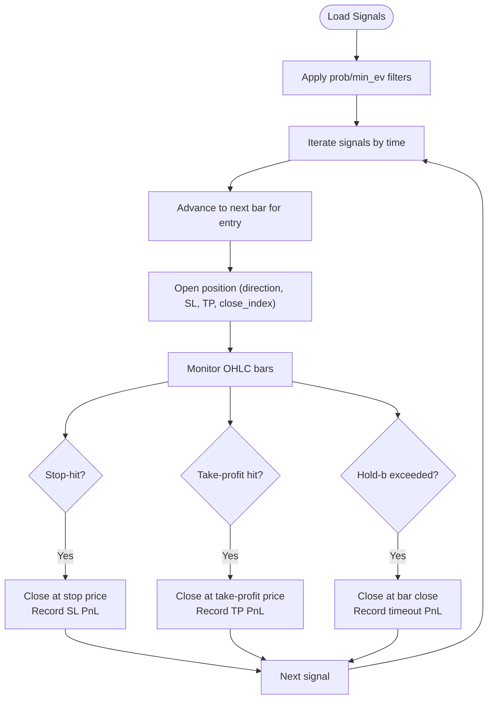
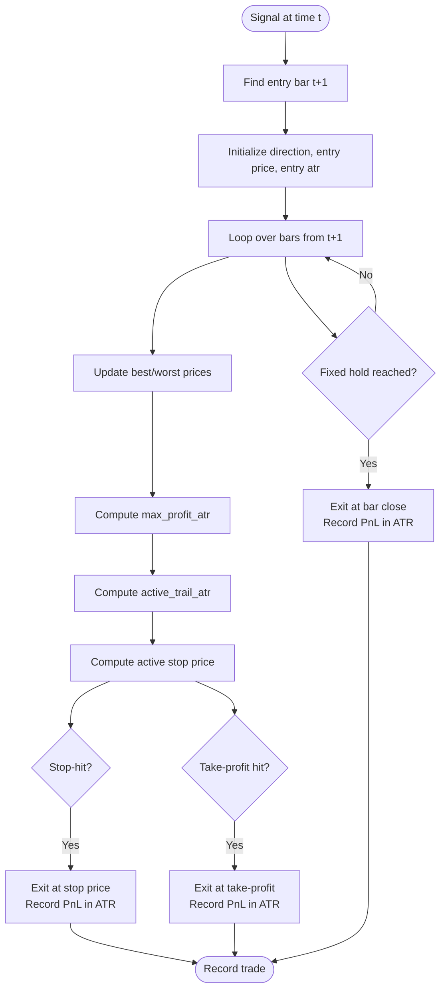
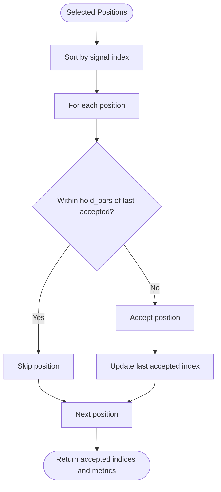
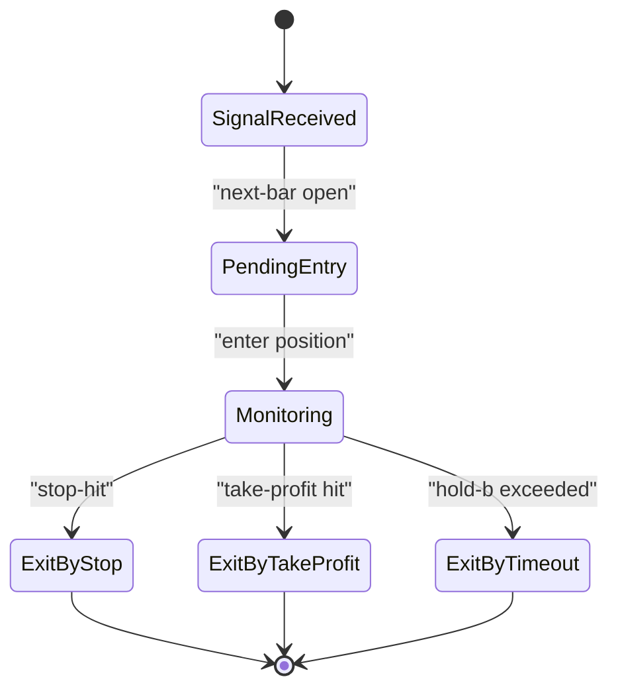
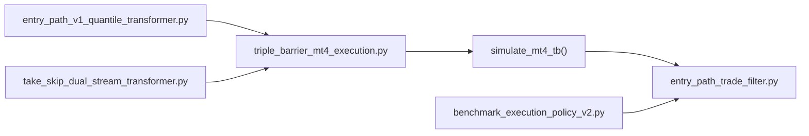

# Trading Execution Logic

<cite>
**Referenced Files in This Document**
- [triple_barrier_mt4_execution.py](file://ML/triple_barrier_mt4_execution.py)
- [benchmark_triple_barrier_mt4_execution.py](file://ML/benchmark_triple_barrier_mt4_execution.py)
- [benchmark_execution_policy_v2.py](file://ML/benchmark_execution_policy_v2.py)
- [entry_path_trade_filter.py](file://ML/entry_path_trade_filter.py)
- [entry_path_v1_quantile_transformer.py](file://ML/models/entry_path_v1_quantile_transformer.py)
- [take_skip_dual_stream_transformer.py](file://ML/models/take_skip_dual_stream_transformer.py)
</cite>

## Table of Contents
1. [Introduction](#introduction)
2. [Project Structure](#project-structure)
3. [Core Components](#core-components)
4. [Architecture Overview](#architecture-overview)
5. [Detailed Component Analysis](#detailed-component-analysis)
6. [Dependency Analysis](#dependency-analysis)
7. [Performance Considerations](#performance-considerations)
8. [Troubleshooting Guide](#troubleshooting-guide)
9. [Conclusion](#conclusion)

## Introduction
This document explains the trading execution logic within the ML Signal Library, focusing on how machine learning signals are transformed into simulated trades and how exit policies are evaluated. It covers:
- Order placement mechanisms via market orders at next-bar open
- Position sizing and risk controls using ATR-based stop-loss and optional take-profit
- Trailing stops with optional shrinking tiers
- Multi-position management with hold-barring to prevent consecutive entries
- Trade validation, error handling, and retry strategies
- Order lifecycle, position tracking, and execution state management
- Performance optimization and memory usage patterns

## Project Structure
The execution logic spans three primary areas:
- Signal loading and filtering for triple barrier labeling
- Policy simulation for fixed-stop, trailing-stop, and take-profit exits
- Trade filtering and sequential checks to manage position limits

**Diagram sources**
- [triple_barrier_mt4_execution.py:31-169](file://ML/triple_barrier_mt4_execution.py#L31-L169)
- [benchmark_execution_policy_v2.py:75-342](file://ML/benchmark_execution_policy_v2.py#L75-L342)
- [entry_path_trade_filter.py:86-342](file://ML/entry_path_trade_filter.py#L86-L342)
- [entry_path_v1_quantile_transformer.py:13-125](file://ML/models/entry_path_v1_quantile_transformer.py#L13-L125)
- [take_skip_dual_stream_transformer.py:24-92](file://ML/models/take_skip_dual_stream_transformer.py#L24-L92)

**Section sources**
- [triple_barrier_mt4_execution.py:1-169](file://ML/triple_barrier_mt4_execution.py#L1-L169)
- [benchmark_execution_policy_v2.py:1-424](file://ML/benchmark_execution_policy_v2.py#L1-L424)
- [entry_path_trade_filter.py:1-378](file://ML/entry_path_trade_filter.py#L1-L378)
- [entry_path_v1_quantile_transformer.py:1-125](file://ML/models/entry_path_v1_quantile_transformer.py#L1-L125)
- [take_skip_dual_stream_transformer.py:1-92](file://ML/models/take_skip_dual_stream_transformer.py#L1-L92)

## Core Components
- Triple barrier signal loader and simulator: Loads ML signals and labeled outcomes, filters by probability and expected value, and simulates trade outcomes using triple barrier labels.
- Execution policy simulator: Simulates market orders at next-bar open with configurable stop-loss (ATR-multiplied), optional take-profit (ATR-multiplied), trailing stops, and fixed-hold exits.
- Trade filter and sequential checks: Computes profitability metrics, enforces position limits via hold-barring, and validates trade sequences.

Key responsibilities:
- Market order placement: Entry occurs at the open of the bar following the signal time.
- Risk controls: Stop-loss and optional take-profit are computed in ATR terms; trailing stops adjust dynamically with optional shrinking tiers.
- Position management: Hold-barring prevents new entries within a fixed number of bars after an accepted trade.
- Validation and reporting: Metrics include P/F, win rate, drawdown, ulcer index, and period-wise stability.

**Section sources**
- [triple_barrier_mt4_execution.py:31-169](file://ML/triple_barrier_mt4_execution.py#L31-L169)
- [benchmark_execution_policy_v2.py:75-342](file://ML/benchmark_execution_policy_v2.py#L75-L342)
- [entry_path_trade_filter.py:86-342](file://ML/entry_path_trade_filter.py#L86-L342)

## Architecture Overview
The execution pipeline integrates ML signals with OHLC data and exit policies to produce trade simulations and performance summaries.

**Diagram sources**
- [benchmark_triple_barrier_mt4_execution.py:20-73](file://ML/benchmark_triple_barrier_mt4_execution.py#L20-L73)
- [triple_barrier_mt4_execution.py:31-169](file://ML/triple_barrier_mt4_execution.py#L31-L169)
- [benchmark_execution_policy_v2.py:231-342](file://ML/benchmark_execution_policy_v2.py#L231-L342)
- [entry_path_trade_filter.py:278-342](file://ML/entry_path_trade_filter.py#L278-L342)

## Detailed Component Analysis

### Triple Barrier Execution Engine
This module loads ML signals and labeled triple barrier outcomes, applies optional thresholds on probability and expected value, and simulates trades using the triple barrier labeling scheme.

- Signal ingestion: Reads CSV with time, signal, and optional prob and ev columns; coerces time and filters zero signals.
- Outcome classification: Converts numeric labels into TP/SL/Timeout categories based on thresholds.
- Trade lifecycle: For each signal, opens a position at the next bar’s open, evaluates exits at each subsequent bar until stop/take-profit hit, timeout, or fixed hold, then closes and records PnL in ATR terms.

**Diagram sources**
- [triple_barrier_mt4_execution.py:60-149](file://ML/triple_barrier_mt4_execution.py#L60-L149)

**Section sources**
- [triple_barrier_mt4_execution.py:31-169](file://ML/triple_barrier_mt4_execution.py#L31-L169)

### Execution Policy Simulator (Fixed Stop, Trailing Stop, Take-Profit)
This module simulates market orders at the next bar’s open with configurable risk controls:
- Fixed stop-loss and optional take-profit, both expressed in ATR multiples
- Optional trailing stop with dynamic adjustment based on realized profits and optional shrinking tiers
- Optional fixed-hold exit after a set number of bars

**Diagram sources**
- [benchmark_execution_policy_v2.py:231-342](file://ML/benchmark_execution_policy_v2.py#L231-L342)

**Section sources**
- [benchmark_execution_policy_v2.py:75-342](file://ML/benchmark_execution_policy_v2.py#L75-L342)

### Trade Filtering and Position Limits
This module computes performance metrics and enforces position limits:
- Profit factor computation
- Sequential acceptance check that skips entries closer than a configured number of bars to the last accepted trade
- Period-wise stability assessment

**Diagram sources**
- [entry_path_trade_filter.py:278-342](file://ML/entry_path_trade_filter.py#L278-L342)

**Section sources**
- [entry_path_trade_filter.py:86-342](file://ML/entry_path_trade_filter.py#L86-L342)

### Order Lifecycle Management and State Tracking
- Entry state: Captured at t+1 open with direction, entry time, and computed SL/TP in ATR terms.
- Monitoring state: Tracks best/worst prices, realized profit in ATR, and active trailing stop.
- Exit state: Records exit reason (stop/trail/take-profit/fixed-hold), exit time, exit price, and PnL in ATR.
- Trade metadata: Includes signal time, entry/exit times, direction, reasons, and derived metrics like hold duration.

**Diagram sources**
- [benchmark_execution_policy_v2.py:231-342](file://ML/benchmark_execution_policy_v2.py#L231-L342)
- [triple_barrier_mt4_execution.py:60-149](file://ML/triple_barrier_mt4_execution.py#L60-L149)

**Section sources**
- [benchmark_execution_policy_v2.py:231-342](file://ML/benchmark_execution_policy_v2.py#L231-L342)
- [triple_barrier_mt4_execution.py:60-149](file://ML/triple_barrier_mt4_execution.py#L60-L149)

### Position Tracking and Multi-Position Management
- Single-threaded simulation per policy: The policy simulator processes signals sequentially, opening one position at a time and closing it before opening the next.
- Hold-barring: Prevents overlapping positions by skipping signals that occur within a fixed number of bars after the last accepted trade.
- Concurrent trade handling: Not modeled in these simulators; multi-threading or concurrency would require external broker APIs and is outside the scope here.

**Section sources**
- [benchmark_execution_policy_v2.py:231-342](file://ML/benchmark_execution_policy_v2.py#L231-L342)
- [entry_path_trade_filter.py:319-342](file://ML/entry_path_trade_filter.py#L319-L342)

### Order Validation, Error Handling, and Retry Strategies
- Input validation:
  - Time parsing and sorting; missing or invalid timestamps skipped.
  - Zero signals filtered out; optional prob and ev thresholds applied.
  - Non-positive ATR values skip entries.
- Index alignment:
  - Signal-to-market index mapping ensures entry occurs on the next bar.
- Robustness:
  - Out-of-range hold exits gracefully fallback to bar close.
  - Classification of triple barrier outcomes handles edge cases near boundaries.
- Retry mechanisms:
  - No automatic retries are implemented in these simulators; failures are logged via returned metrics and summaries.

**Section sources**
- [triple_barrier_mt4_execution.py:31-169](file://ML/triple_barrier_mt4_execution.py#L31-L169)
- [benchmark_execution_policy_v2.py:75-342](file://ML/benchmark_execution_policy_v2.py#L75-L342)

### Examples of Order Lifecycle Management
- Example A: Triple barrier evaluation with hold-barring and timeout PnL
  - Load labeled triple barrier signals and outcomes
  - Simulate trades with configurable hold-bars and timeout PnL in ATR
  - Aggregate yearly performance and write outputs
- Example B: Policy comparison across multiple exit strategies
  - Run multiple exit policies (fixed stop, trailing, take-profit, shrinking trails)
  - Summarize performance metrics and write consolidated reports

**Section sources**
- [benchmark_triple_barrier_mt4_execution.py:20-73](file://ML/benchmark_triple_barrier_mt4_execution.py#L20-L73)
- [benchmark_execution_policy_v2.py:344-424](file://ML/benchmark_execution_policy_v2.py#L344-L424)

## Dependency Analysis
- Triple barrier execution depends on:
  - Signal loader for ML predictions and labeled outcomes
  - Trade filter for performance metrics and sequential checks
- Execution policy depends on:
  - OHLC dataset with ATR series
  - Exit policy configuration (stop, trail, take-profit, hold-bars, shrinking tiers)
- Trade filter depends on:
  - PnL arrays for performance computations and sequential acceptance

**Diagram sources**
- [triple_barrier_mt4_execution.py:31-169](file://ML/triple_barrier_mt4_execution.py#L31-L169)
- [benchmark_execution_policy_v2.py:75-342](file://ML/benchmark_execution_policy_v2.py#L75-L342)
- [entry_path_trade_filter.py:86-342](file://ML/entry_path_trade_filter.py#L86-L342)
- [entry_path_v1_quantile_transformer.py:13-125](file://ML/models/entry_path_v1_quantile_transformer.py#L13-L125)
- [take_skip_dual_stream_transformer.py:24-92](file://ML/models/take_skip_dual_stream_transformer.py#L24-L92)

**Section sources**
- [triple_barrier_mt4_execution.py:31-169](file://ML/triple_barrier_mt4_execution.py#L31-L169)
- [benchmark_execution_policy_v2.py:75-342](file://ML/benchmark_execution_policy_v2.py#L75-L342)
- [entry_path_trade_filter.py:86-342](file://ML/entry_path_trade_filter.py#L86-L342)
- [entry_path_v1_quantile_transformer.py:13-125](file://ML/models/entry_path_v1_quantile_transformer.py#L13-L125)
- [take_skip_dual_stream_transformer.py:24-92](file://ML/models/take_skip_dual_stream_transformer.py#L24-L92)

## Performance Considerations
- Vectorization:
  - Pandas operations and NumPy arrays are used for efficient computation of PnL, metrics, and filtering.
- Memory usage patterns:
  - DataFrames are constructed per dataset and policy; concatenation of trades is deferred until final output.
  - Index-by-time dictionaries minimize repeated lookups during simulation.
- Complexity:
  - Policy simulation loops over OHLC bars per signal; overall complexity scales with number of signals × average holding periods.
  - Triple barrier simulation iterates signals and aligns with labeled outcomes; complexity depends on signal density and labeled coverage.
- Recommendations:
  - Pre-sort and deduplicate inputs to reduce overhead.
  - Use chunked processing for very long datasets.
  - Cache computed scalers and percentile ranks for repeated evaluations.

[No sources needed since this section provides general guidance]

## Troubleshooting Guide
Common issues and resolutions:
- Missing or misaligned timestamps:
  - Ensure time format matches expectations; invalid timestamps are coerced and skipped.
- Zero or missing ATR:
  - Entries with non-positive ATR are skipped; verify ATR calculation and data availability.
- Out-of-range exits:
  - Fixed-hold exits beyond available bars fall back to bar close; confirm dataset bounds.
- Misaligned indices:
  - Sequential checks require proper index alignment; mismatched lengths raise explicit errors with diagnostic messages.
- Metric anomalies:
  - Profit factor returns inf or zero when gross loss is zero or both gross profit/loss are zero; handle accordingly in downstream analysis.

**Section sources**
- [triple_barrier_mt4_execution.py:31-169](file://ML/triple_barrier_mt4_execution.py#L31-L169)
- [benchmark_execution_policy_v2.py:231-342](file://ML/benchmark_execution_policy_v2.py#L231-L342)
- [entry_path_trade_filter.py:278-342](file://ML/entry_path_trade_filter.py#L278-L342)

## Conclusion
The ML Signal Library’s execution logic combines ML-driven signals with robust risk controls and position management:
- Market orders are placed at the next bar’s open with ATR-based stops and optional take-profits.
- Trailing stops adapt dynamically, optionally shrinking as profits increase.
- Position limits are enforced via hold-barring to avoid overlapping trades.
- Comprehensive metrics and sequential checks support performance evaluation and stability assessment.
- The design emphasizes vectorized computation, clear state transitions, and explicit error handling for reliable backtesting and research.