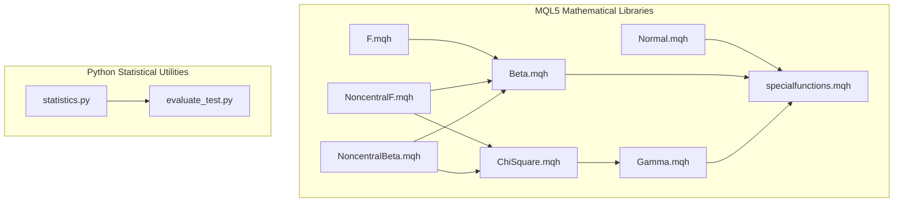
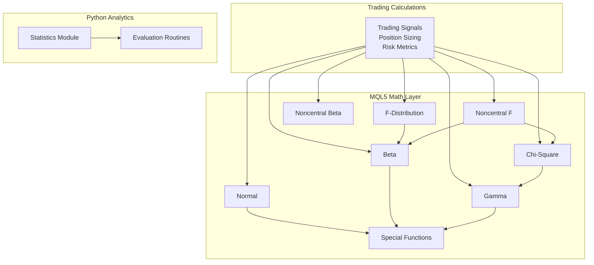
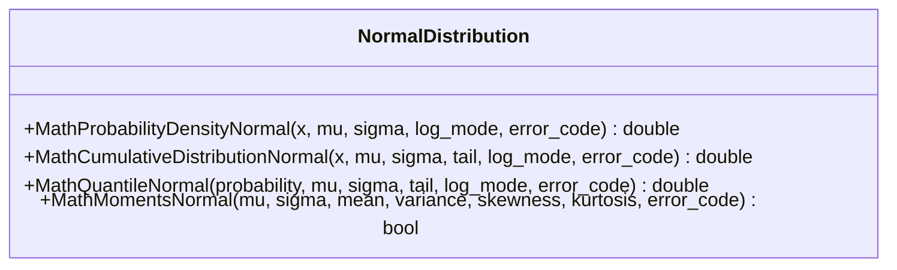
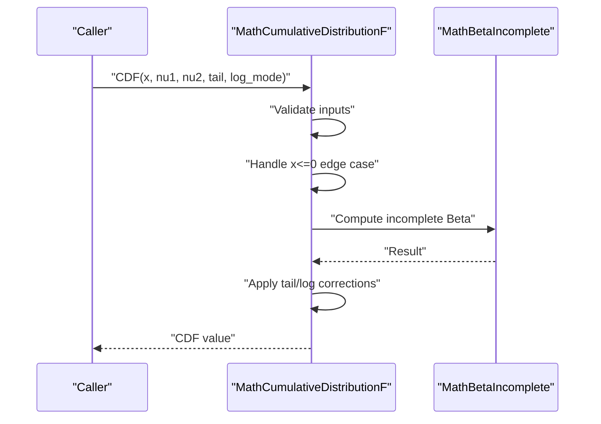
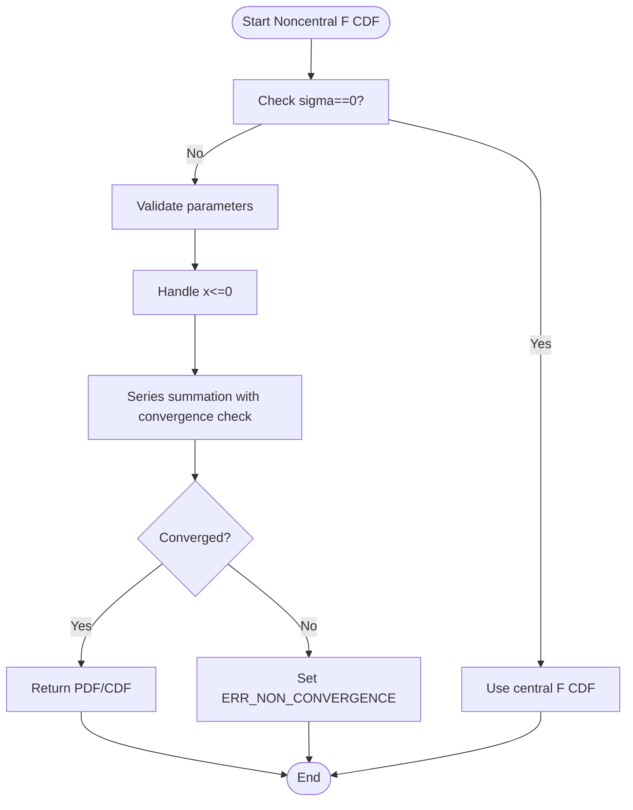
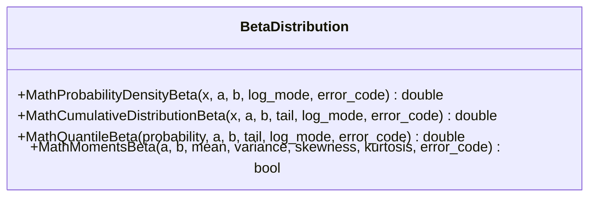
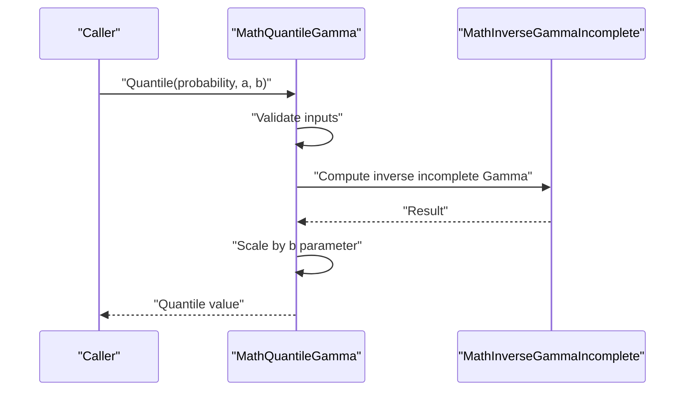
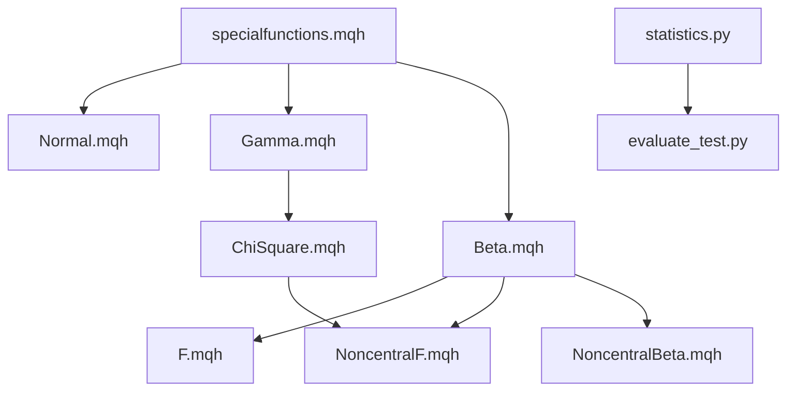

# Mathematical Functions

<cite>
**Referenced Files in This Document**
- [Normal.mqh](file://MT/MQL5/Include/Math/Stat/Normal.mqh)
- [F.mqh](file://MT/MQL5/Include/Math/Stat/F.mqh)
- [NoncentralF.mqh](file://MT/MQL5/Include/Math/Stat/NoncentralF.mqh)
- [Beta.mqh](file://MT/MQL5/Include/Math/Stat/Beta.mqh)
- [Gamma.mqh](file://MT/MQL5/Include/Math/Stat/Gamma.mqh)
- [ChiSquare.mqh](file://MT/MQL5/Include/Math/Stat/ChiSquare.mqh)
- [NoncentralBeta.mqh](file://MT/MQL5/Include/Math/Stat/NoncentralBeta.mqh)
- [specialfunctions.mqh](file://MT/MQL5/Include/Math/Alglib/specialfunctions.mqh)
- [ERRORs.mqh](file://MT/MQL5/Include/ERRORs.mqh)
- [statistics.py](file://statistics/statistics.py)
- [evaluate_test.py](file://ML/evaluate_test.py)
</cite>

## Table of Contents
1. [Introduction](#introduction)
2. [Project Structure](#project-structure)
3. [Core Components](#core-components)
4. [Architecture Overview](#architecture-overview)
5. [Detailed Component Analysis](#detailed-component-analysis)
6. [Dependency Analysis](#dependency-analysis)
7. [Performance Considerations](#performance-considerations)
8. [Troubleshooting Guide](#troubleshooting-guide)
9. [Conclusion](#conclusion)

## Introduction
This document provides comprehensive technical documentation for the mathematical and error handling functions within the SoSimple trading system. It focuses on precision calculations, statistical distributions, numerical stability measures, and robust error handling mechanisms. The documentation covers both the MQL5 mathematical libraries and Python-based statistical utilities, explaining function signatures, parameter specifications, return values, mathematical formulations, and practical integration patterns for trading calculations.

## Project Structure
The mathematical functionality spans two primary domains:
- MQL5 Statistical Libraries: Provides probability density functions (PDF), cumulative distribution functions (CDF), quantile functions, random variate generation, and moments for standard distributions (Normal, F, Beta, Gamma, Chi-Square, Noncentral variants).
- Python Statistical Utilities: Offers trading-focused analytics, performance metrics, and evaluation routines used in ML pipelines and research.

**Diagram sources**
- [Normal.mqh:113-147](file://MT/MQL5/Include/Math/Stat/Normal.mqh#L113-L147)
- [F.mqh:26-52](file://MT/MQL5/Include/Math/Stat/F.mqh#L26-L52)
- [NoncentralF.mqh:28-93](file://MT/MQL5/Include/Math/Stat/NoncentralF.mqh#L28-L93)
- [Beta.mqh:25-51](file://MT/MQL5/Include/Math/Stat/Beta.mqh#L25-L51)
- [Gamma.mqh:149-173](file://MT/MQL5/Include/Math/Stat/Gamma.mqh#L149-L173)
- [ChiSquare.mqh:24-48](file://MT/MQL5/Include/Math/Stat/ChiSquare.mqh#L24-L48)
- [NoncentralBeta.mqh:33-82](file://MT/MQL5/Include/Math/Stat/NoncentralBeta.mqh#L33-L82)
- [specialfunctions.mqh:39-47](file://MT/MQL5/Include/Math/Alglib/specialfunctions.mqh#L39-L47)
- [statistics.py](file://statistics/statistics.py)
- [evaluate_test.py:768-804](file://ML/evaluate_test.py#L768-L804)

**Section sources**
- [Normal.mqh:113-147](file://MT/MQL5/Include/Math/Stat/Normal.mqh#L113-L147)
- [F.mqh:26-52](file://MT/MQL5/Include/Math/Stat/F.mqh#L26-L52)
- [NoncentralF.mqh:28-93](file://MT/MQL5/Include/Math/Stat/NoncentralF.mqh#L28-L93)
- [Beta.mqh:25-51](file://MT/MQL5/Include/Math/Stat/Beta.mqh#L25-L51)
- [Gamma.mqh:149-173](file://MT/MQL5/Include/Math/Stat/Gamma.mqh#L149-L173)
- [ChiSquare.mqh:24-48](file://MT/MQL5/Include/Math/Stat/ChiSquare.mqh#L24-L48)
- [NoncentralBeta.mqh:33-82](file://MT/MQL5/Include/Math/Stat/NoncentralBeta.mqh#L33-L82)
- [specialfunctions.mqh:39-47](file://MT/MQL5/Include/Math/Alglib/specialfunctions.mqh#L39-L47)
- [statistics.py](file://statistics/statistics.py)
- [evaluate_test.py:768-804](file://ML/evaluate_test.py#L768-L804)

## Core Components
This section outlines the principal mathematical components and their roles in the SoSimple system.

- Normal Distribution (PDF, CDF, Quantile, Moments)
  - Provides density, distribution, quantile, and moment calculations for normally distributed variables.
  - Includes support for arrays, log-mode outputs, and error code reporting.
  - Implements numerical stability safeguards against overflow and invalid inputs.

- F-Distribution (PDF, CDF, Quantile, Moments)
  - Implements density, distribution, quantile, and moments for F-distributed variables.
  - Uses Beta functions internally and handles edge cases for x ≤ 0 and invalid parameters.

- Noncentral F-Distribution (PDF, CDF, Quantile, Moments)
  - Extends F-distribution with noncentrality parameter.
  - Employs series summation with convergence checks and fallback to central F when sigma=0.

- Beta Distribution (PDF, CDF, Quantile, Moments)
  - Supports shape parameters a, b > 0.
  - Uses incomplete Beta functions and implements Newton-Raphson quantile estimation.

- Gamma Distribution (PDF, CDF, Quantile, Moments)
  - Supports shape a > 0, scale b > 0.
  - Uses incomplete Gamma functions and specialized generators for various shapes.

- Chi-Square Distribution (PDF, CDF, Quantile, Moments)
  - Special case of Gamma with shape ν/2 and scale 2.
  - Provides direct conversions to Gamma-based implementations.

- Noncentral Beta Distribution (PDF, CDF, Quantile)
  - Series expansion with Poisson weights and incomplete Beta functions.
  - Quantile via Newton-Raphson with combined PDF/CDF evaluations.

- Special Functions (ALGLIB Integration)
  - Gamma, Log-Gamma, Beta, and related functions used across distributions.
  - Ensures numerical precision and handles extreme parameter ranges.

- Error Handling and Logging
  - Centralized error reporting and logging for trading operations.
  - Structured handling of common MQL5 error codes with retry/backoff strategies.

**Section sources**
- [Normal.mqh:287-382](file://MT/MQL5/Include/Math/Stat/Normal.mqh#L287-L382)
- [F.mqh:159-181](file://MT/MQL5/Include/Math/Stat/F.mqh#L159-L181)
- [NoncentralF.mqh:244-268](file://MT/MQL5/Include/Math/Stat/NoncentralF.mqh#L244-L268)
- [Beta.mqh:163-188](file://MT/MQL5/Include/Math/Stat/Beta.mqh#L163-L188)
- [Gamma.mqh:282-304](file://MT/MQL5/Include/Math/Stat/Gamma.mqh#L282-L304)
- [ChiSquare.mqh:153-173](file://MT/MQL5/Include/Math/Stat/ChiSquare.mqh#L153-L173)
- [NoncentralBeta.mqh:231-287](file://MT/MQL5/Include/Math/Stat/NoncentralBeta.mqh#L231-L287)
- [specialfunctions.mqh:61-146](file://MT/MQL5/Include/Math/Alglib/specialfunctions.mqh#L61-L146)
- [ERRORs.mqh:10-63](file://MT/MQL5/Include/ERRORs.mqh#L10-L63)

## Architecture Overview
The mathematical architecture integrates MQL5 statistical functions with Python analytics for trading research and evaluation.

**Diagram sources**
- [Normal.mqh:113-147](file://MT/MQL5/Include/Math/Stat/Normal.mqh#L113-L147)
- [F.mqh:26-52](file://MT/MQL5/Include/Math/Stat/F.mqh#L26-L52)
- [NoncentralF.mqh:28-93](file://MT/MQL5/Include/Math/Stat/NoncentralF.mqh#L28-L93)
- [Beta.mqh:25-51](file://MT/MQL5/Include/Math/Stat/Beta.mqh#L25-L51)
- [Gamma.mqh:149-173](file://MT/MQL5/Include/Math/Stat/Gamma.mqh#L149-L173)
- [ChiSquare.mqh:24-48](file://MT/MQL5/Include/Math/Stat/ChiSquare.mqh#L24-L48)
- [NoncentralBeta.mqh:33-82](file://MT/MQL5/Include/Math/Stat/NoncentralBeta.mqh#L33-L82)
- [specialfunctions.mqh:39-47](file://MT/MQL5/Include/Math/Alglib/specialfunctions.mqh#L39-L47)
- [statistics.py](file://statistics/statistics.py)
- [evaluate_test.py:768-804](file://ML/evaluate_test.py#L768-L804)

## Detailed Component Analysis

### Normal Distribution Functions
The Normal distribution module provides:
- Density function with optional log-mode output
- Cumulative distribution function with tail and log-mode support
- Quantile function with inverse CDF and log-probability handling
- Moment calculations (mean, variance, skewness, kurtosis)

Key implementation characteristics:
- Input validation for NaN and invalid sigma
- Overflow protection for extreme z-scores
- Round-off error correction for probabilities
- Array-based batch processing support

**Diagram sources**
- [Normal.mqh:113-147](file://MT/MQL5/Include/Math/Stat/Normal.mqh#L113-L147)
- [Normal.mqh:287-382](file://MT/MQL5/Include/Math/Stat/Normal.mqh#L287-L382)
- [Normal.mqh:569-647](file://MT/MQL5/Include/Math/Stat/Normal.mqh#L569-L647)

**Section sources**
- [Normal.mqh:113-147](file://MT/MQL5/Include/Math/Stat/Normal.mqh#L113-L147)
- [Normal.mqh:287-382](file://MT/MQL5/Include/Math/Stat/Normal.mqh#L287-L382)
- [Normal.mqh:569-647](file://MT/MQL5/Include/Math/Stat/Normal.mqh#L569-L647)

### F-Distribution Functions
The F-distribution module implements:
- Density function using Beta function ratios
- Cumulative distribution via incomplete Beta functions
- Quantile function with Beta distribution inversion
- Moment calculations for mean, variance, skewness, kurtosis

Numerical stability features:
- Proper handling of x ≤ 0 cases
- Argument validation for degrees of freedom
- Round-off error correction in CDF calculations

**Diagram sources**
- [F.mqh:159-181](file://MT/MQL5/Include/Math/Stat/F.mqh#L159-L181)
- [F.mqh:198-201](file://MT/MQL5/Include/Math/Stat/F.mqh#L198-L201)

**Section sources**
- [F.mqh:26-52](file://MT/MQL5/Include/Math/Stat/F.mqh#L26-L52)
- [F.mqh:159-181](file://MT/MQL5/Include/Math/Stat/F.mqh#L159-L181)
- [F.mqh:288-325](file://MT/MQL5/Include/Math/Stat/F.mqh#L288-L325)

### Noncentral F-Distribution Functions
The Noncentral F extension adds:
- Series summation with Poisson weights
- Convergence checking with maximum term limits
- Fallback to central F when noncentrality parameter equals zero
- Quantile estimation via Newton-Raphson method

Precision considerations:
- Iterative convergence with tolerance thresholds
- Proper handling of extreme parameter regimes
- Error code propagation for non-convergence scenarios

**Diagram sources**
- [NoncentralF.mqh:244-268](file://MT/MQL5/Include/Math/Stat/NoncentralF.mqh#L244-L268)
- [NoncentralF.mqh:434-473](file://MT/MQL5/Include/Math/Stat/NoncentralF.mqh#L434-L473)

**Section sources**
- [NoncentralF.mqh:28-93](file://MT/MQL5/Include/Math/Stat/NoncentralF.mqh#L28-L93)
- [NoncentralF.mqh:244-268](file://MT/MQL5/Include/Math/Stat/NoncentralF.mqh#L244-L268)
- [NoncentralF.mqh:390-473](file://MT/MQL5/Include/Math/Stat/NoncentralF.mqh#L390-L473)

### Beta Distribution Functions
The Beta distribution provides:
- Density function with log-mode support
- CDF via incomplete Beta functions
- Quantile estimation using Newton-Raphson
- Moment calculations for standard distribution parameters

Advanced features:
- Robust parameter validation (a,b > 0)
- Efficient quantile computation with adaptive initial guesses
- Comprehensive error handling for edge cases

**Diagram sources**
- [Beta.mqh:25-51](file://MT/MQL5/Include/Math/Stat/Beta.mqh#L25-L51)
- [Beta.mqh:163-188](file://MT/MQL5/Include/Math/Stat/Beta.mqh#L163-L188)
- [Beta.mqh:304-382](file://MT/MQL5/Include/Math/Stat/Beta.mqh#L304-L382)

**Section sources**
- [Beta.mqh:25-51](file://MT/MQL5/Include/Math/Stat/Beta.mqh#L25-L51)
- [Beta.mqh:163-188](file://MT/MQL5/Include/Math/Stat/Beta.mqh#L163-L188)
- [Beta.mqh:304-382](file://MT/MQL5/Include/Math/Stat/Beta.mqh#L304-L382)

### Gamma Distribution Functions
The Gamma distribution implementation includes:
- Density function with log-mode support
- CDF via incomplete Gamma functions
- Quantile estimation using inverse incomplete Gamma
- Random variate generation for various shapes

Numerical techniques:
- Stirling approximation for large parameters
- Newton-Raphson iteration for quantile computation
- Box-Muller transform for normal variates in generators

**Diagram sources**
- [Gamma.mqh:414-458](file://MT/MQL5/Include/Math/Stat/Gamma.mqh#L414-L458)
- [Gamma.mqh:13-132](file://MT/MQL5/Include/Math/Stat/Gamma.mqh#L13-L132)

**Section sources**
- [Gamma.mqh:149-173](file://MT/MQL5/Include/Math/Stat/Gamma.mqh#L149-L173)
- [Gamma.mqh:282-304](file://MT/MQL5/Include/Math/Stat/Gamma.mqh#L282-L304)
- [Gamma.mqh:414-458](file://MT/MQL5/Include/Math/Stat/Gamma.mqh#L414-L458)

### Chi-Square Distribution Functions
The Chi-Square distribution leverages Gamma relationships:
- Direct conversion from Gamma(shape=ν/2, scale=2)
- Consistent API with other distributions
- Specialized random variate generation

Integration benefits:
- Reuse of Gamma implementation details
- Unified error handling and validation
- Simplified API surface for degrees-of-freedom parameters

**Section sources**
- [ChiSquare.mqh:24-48](file://MT/MQL5/Include/Math/Stat/ChiSquare.mqh#L24-L48)
- [ChiSquare.mqh:153-173](file://MT/MQL5/Include/Math/Stat/ChiSquare.mqh#L153-L173)
- [ChiSquare.mqh:277-315](file://MT/MQL5/Include/Math/Stat/ChiSquare.mqh#L277-L315)

### Noncentral Beta Distribution Functions
The Noncentral Beta extends Beta with Poisson weighting:
- Series expansion with convergence criteria
- Combined PDF/CDF evaluation in quantile estimation
- Support for array-based computations

Computational approach:
- Adaptive truncation based on λ parameter
- Efficient recurrence relations for factorials and Beta functions
- Robust numerical stability for extreme parameter combinations

**Section sources**
- [NoncentralBeta.mqh:33-82](file://MT/MQL5/Include/Math/Stat/NoncentralBeta.mqh#L33-L82)
- [NoncentralBeta.mqh:231-287](file://MT/MQL5/Include/Math/Stat/NoncentralBeta.mqh#L231-L287)
- [NoncentralBeta.mqh:430-588](file://MT/MQL5/Include/Math/Stat/NoncentralBeta.mqh#L430-L588)

### Special Functions (ALGLIB Integration)
The special functions module provides:
- Gamma function with Stirling approximation
- Log-Gamma computation with reflection formula
- Error functions and normal distribution utilities
- Bivariate normal distribution support

Precision characteristics:
- High-precision implementations for extreme ranges
- Proper handling of overflow and underflow conditions
- Comprehensive error code propagation

**Section sources**
- [specialfunctions.mqh:61-146](file://MT/MQL5/Include/Math/Alglib/specialfunctions.mqh#L61-L146)
- [specialfunctions.mqh:169-283](file://MT/MQL5/Include/Math/Alglib/specialfunctions.mqh#L169-L283)
- [specialfunctions.mqh:353-514](file://MT/MQL5/Include/Math/Alglib/specialfunctions.mqh#L353-L514)

### Python Statistical Utilities
The Python statistics module supports:
- Trading performance analysis and metrics
- Signal quality assessment and filtering
- Evaluation routines for ML models and trading strategies

Integration patterns:
- Seamless integration with MQL5 trading calculations
- Consistent numerical precision handling
- Comprehensive error handling and logging

**Section sources**
- [statistics.py](file://statistics/statistics.py)
- [evaluate_test.py:768-804](file://ML/evaluate_test.py#L768-L804)

## Dependency Analysis
The mathematical components exhibit clear dependency relationships:

**Diagram sources**
- [specialfunctions.mqh:39-47](file://MT/MQL5/Include/Math/Alglib/specialfunctions.mqh#L39-L47)
- [Normal.mqh](file://MT/MQL5/Include/Math/Stat/Normal.mqh#L6)
- [Gamma.mqh](file://MT/MQL5/Include/Math/Stat/Gamma.mqh#L6)
- [Beta.mqh](file://MT/MQL5/Include/Math/Stat/Beta.mqh#L6)
- [ChiSquare.mqh](file://MT/MQL5/Include/Math/Stat/ChiSquare.mqh#L6)
- [F.mqh](file://MT/MQL5/Include/Math/Stat/F.mqh#L6)
- [NoncentralF.mqh](file://MT/MQL5/Include/Math/Stat/NoncentralF.mqh#L6)
- [NoncentralBeta.mqh](file://MT/MQL5/Include/Math/Stat/NoncentralBeta.mqh#L6)

**Section sources**
- [specialfunctions.mqh:39-47](file://MT/MQL5/Include/Math/Alglib/specialfunctions.mqh#L39-L47)
- [Normal.mqh](file://MT/MQL5/Include/Math/Stat/Normal.mqh#L6)
- [Gamma.mqh](file://MT/MQL5/Include/Math/Stat/Gamma.mqh#L6)
- [Beta.mqh](file://MT/MQL5/Include/Math/Stat/Beta.mqh#L6)
- [ChiSquare.mqh](file://MT/MQL5/Include/Math/Stat/ChiSquare.mqh#L6)
- [F.mqh](file://MT/MQL5/Include/Math/Stat/F.mqh#L6)
- [NoncentralF.mqh](file://MT/MQL5/Include/Math/Stat/NoncentralF.mqh#L6)
- [NoncentralBeta.mqh](file://MT/MQL5/Include/Math/Stat/NoncentralBeta.mqh#L6)

## Performance Considerations
Numerical precision and computational efficiency are addressed through several mechanisms:

Floating-Point Precision and Rounding Errors
- All distribution functions implement round-off error correction for probabilities using MathMin(result, 1.0)
- Log-mode support enables numerical stability for extreme tail probabilities
- TailLogValue and TailLog0/1 helpers manage edge cases consistently

Overflow and Underflow Protection
- Normal distribution includes overflow checks for extreme z-scores
- Gamma and Log-Gamma functions use reflection formulas and Stirling approximations
- Chi-Square distribution leverages Gamma implementations for stability

Convergence Criteria
- Noncentral F and Noncentral Beta use iterative series with tolerance thresholds
- Quantile functions employ Newton-Raphson with adaptive step sizes
- Maximum iteration limits prevent infinite loops

Memory and Batch Processing
- Array-based functions minimize repeated allocations
- Precomputed constants reduce computational overhead
- Vectorized operations improve throughput for bulk calculations

Computational Efficiency Considerations
- Early termination in series expansions when terms fall below thresholds
- Adaptive initial guesses in quantile estimation
- Shared computation of common factors in multi-term expressions

## Troubleshooting Guide
Error handling follows a structured approach across the system:

Common Error Categories
- Argument validation errors (ERR_ARGUMENTS_NAN, ERR_ARGUMENTS_INVALID)
- Convergence failures (ERR_NON_CONVERGENCE)
- Infinite results (ERR_RESULT_INFINITE)
- Standard MQL5 trading errors (ERR_NOT_ENOUGH_MONEY, ERR_SERVER_BUSY)

Error Propagation Patterns
- Functions return QNaN on validation failures
- Error codes are set and propagated through reference parameters
- Quantile functions distinguish between finite and infinite results

Debugging Strategies
- Enable log-mode outputs to inspect intermediate calculations
- Verify parameter ranges for distribution-specific constraints
- Check for overflow conditions in extreme tail calculations
- Validate array sizes and element validity for batch operations

Logging and Reporting
- Centralized ERROR_LOG function captures comprehensive context
- Structured CSV output for error analysis and post-mortem investigation
- Retry/backoff strategies for transient network/server issues

**Section sources**
- [ERRORs.mqh:10-63](file://MT/MQL5/Include/ERRORs.mqh#L10-L63)
- [ERRORs.mqh:86-103](file://MT/MQL5/Include/ERRORs.mqh#L86-L103)

## Conclusion
The SoSimple trading system provides a comprehensive mathematical foundation through carefully implemented statistical distributions, robust numerical algorithms, and systematic error handling. The MQL5 mathematical libraries offer production-ready implementations of essential distributions with attention to numerical precision, while the Python statistical utilities enable advanced analytics and evaluation. Together, these components form a reliable framework for trading calculations, risk management, and performance analysis, with clear integration patterns and extensive error handling capabilities.