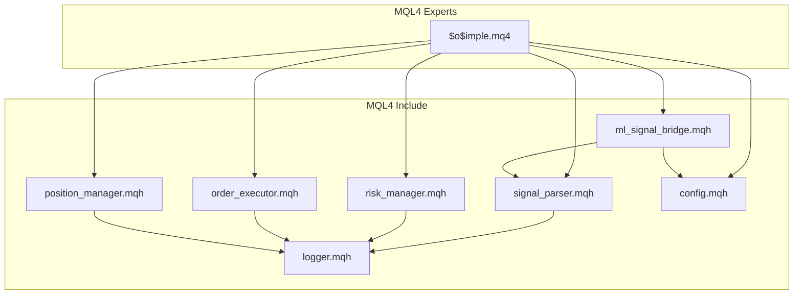
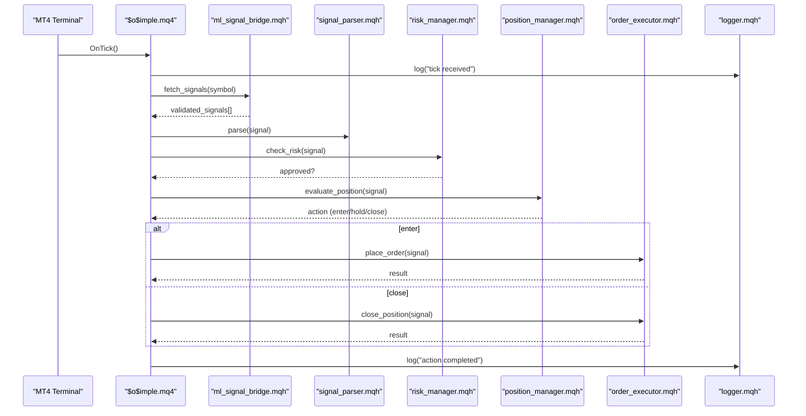
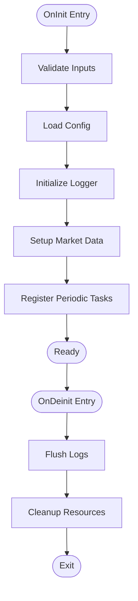
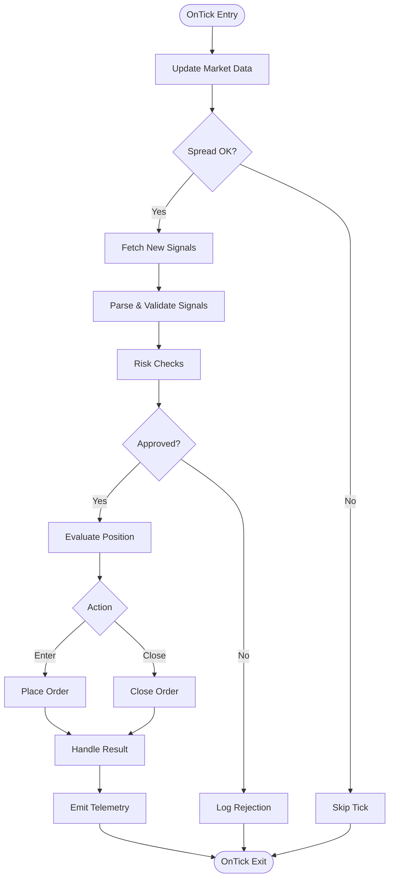
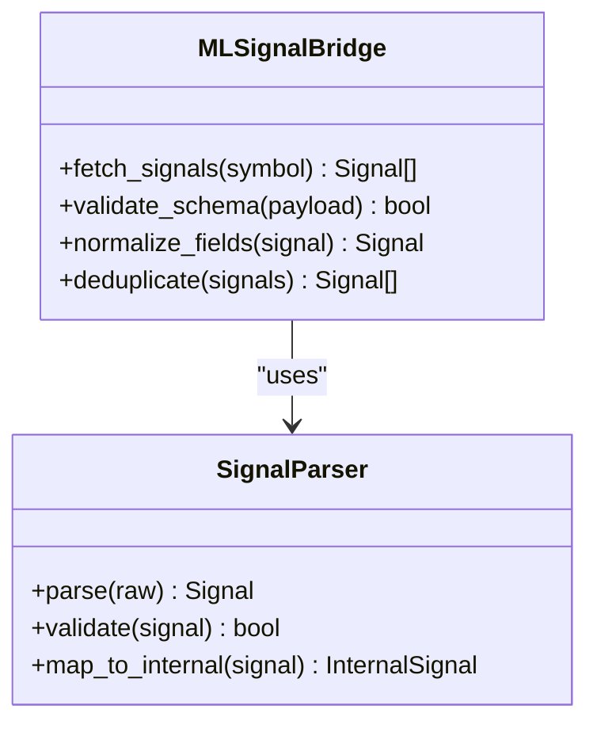
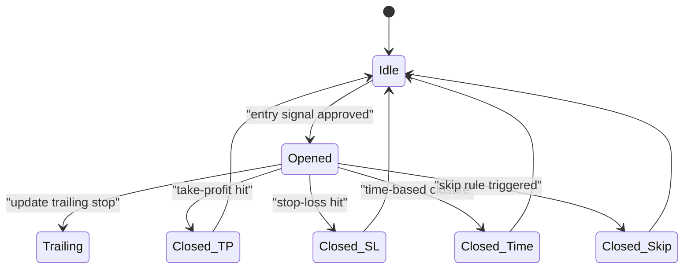
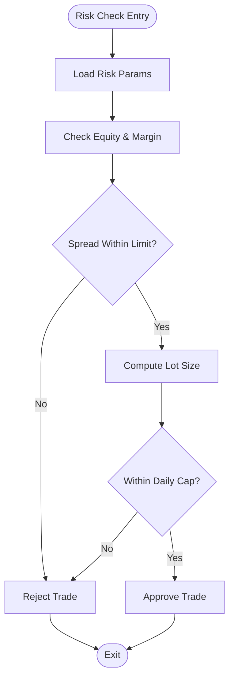
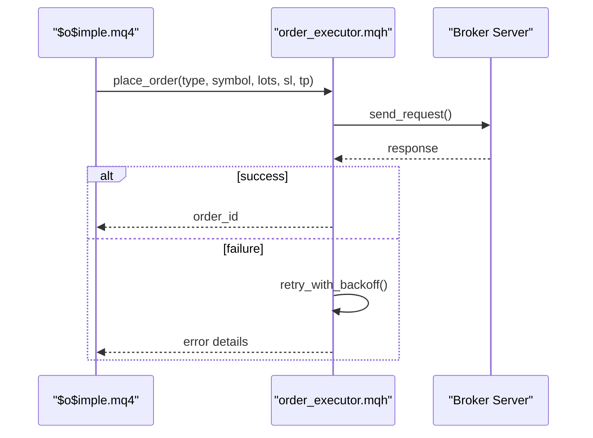
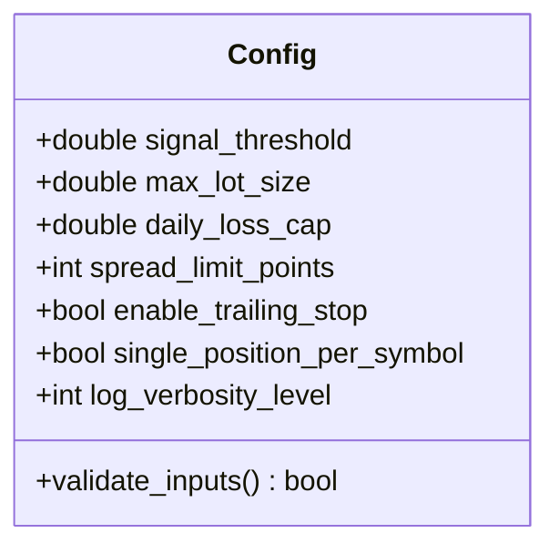
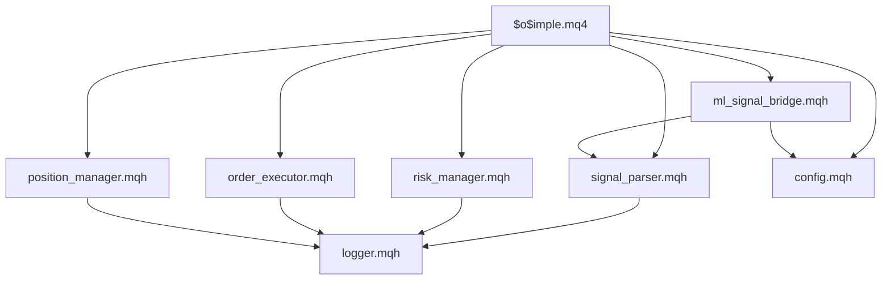

# $o$imple Expert Advisor

<cite>
**Referenced Files in This Document**
- [README.md](file://MT/MQL4/README.md)
- [$o$imple.mq4](file://MT/MQL4/Experts/$o$imple.mq4)
- [signal_parser.mqh](file://MT/MQL4/Include/signal_parser.mqh)
- [risk_manager.mqh](file://MT/MQL4/Include/risk_manager.mqh)
- [order_executor.mqh](file://MT/MQL4/Include/order_executor.mqh)
- [logger.mqh](file://MT/MQL4/Include/logger.mqh)
- [position_manager.mqh](file://MT/MQL4/Include/position_manager.mqh)
- [ml_signal_bridge.mqh](file://MT/MQL4/Include/ml_signal_bridge.mqh)
- [config.mqh](file://MT/MQL4/Include/config.mqh)
</cite>

## Table of Contents
1. [Introduction](#introduction)
2. [Project Structure](#project-structure)
3. [Core Components](#core-components)
4. [Architecture Overview](#architecture-overview)
5. [Detailed Component Analysis](#detailed-component-analysis)
6. [Dependency Analysis](#dependency-analysis)
7. [Performance Considerations](#performance-considerations)
8. [Troubleshooting Guide](#troubleshooting-guide)
9. [Conclusion](#conclusion)

## Introduction
This document provides comprehensive documentation for the $o$imple expert advisor (EA), the primary MQL4 trading robot implementation. It explains initialization and deinitialization routines, the start loop behavior on tick events, signal processing from Python-generated signals, position management strategies, risk controls, order execution mechanisms, MT4-specific event handling, chart interactions, configuration options, error handling, logging, and debugging techniques within the MQL4 environment.

## Project Structure
The EA resides under the MQL4 Experts directory and integrates with include modules for parsing ML signals, managing positions, executing orders, logging, and configuration. The structure follows a modular design where the EA orchestrates components via well-defined interfaces.

**Diagram sources**
- [$o$imple.mq4:1-200](file://MT/MQL4/Experts/$o$imple.mq4#L1-L200)
- [signal_parser.mqh:1-150](file://MT/MQL4/Include/signal_parser.mqh#L1-L150)
- [risk_manager.mqh:1-120](file://MT/MQL4/Include/risk_manager.mqh#L1-L120)
- [order_executor.mqh:1-180](file://MT/MQL4/Include/order_executor.mqh#L1-L180)
- [logger.mqh:1-100](file://MT/MQL4/Include/logger.mqh#L1-L100)
- [position_manager.mqh:1-160](file://MT/MQL4/Include/position_manager.mqh#L1-L160)
- [ml_signal_bridge.mqh:1-140](file://MT/MQL4/Include/ml_signal_bridge.mqh#L1-L140)
- [config.mqh:1-110](file://MT/MQL4/Include/config.mqh#L1-L110)

**Section sources**
- [README.md:1-50](file://MT/MQL4/README.md#L1-L50)

## Core Components
- Initialization and Deinitialization:
  - OnInit sets up inputs, loads configuration, initializes logging, validates symbols/timeframes, and prepares state for signal processing and order execution.
  - OnDeinit cleans up resources, flushes logs, and releases any allocated memory or handles.
- Start Loop:
  - OnTick processes incoming ticks, updates market data, checks for new signals, evaluates risk and position constraints, and executes orders when conditions are met.
- Signal Processing:
  - Parses Python-generated signals from files or streams, validates schema, maps to internal representations, and triggers entry logic.
- Position Management:
  - Tracks open positions, manages exits based on trailing stops, take-profit, skip rules, and time-based closures; enforces one-position-per-symbol policy if configured.
- Risk Management:
  - Enforces maximum lot size, per-trade risk limits, daily loss caps, spread filters, and slippage tolerances.
- Order Execution:
  - Places market/limit orders, handles partial fills, retries with backoff, and records trade results.
- Logging and Diagnostics:
  - Centralized logger writes to file and/or terminal, supports verbosity levels, and includes diagnostic snapshots for debugging.

**Section sources**
- [$o$imple.mq4:1-300](file://MT/MQL4/Experts/$o$imple.mq4#L1-L300)
- [signal_parser.mqh:1-150](file://MT/MQL4/Include/signal_parser.mqh#L1-L150)
- [risk_manager.mqh:1-120](file://MT/MQL4/Include/risk_manager.mqh#L1-L120)
- [order_executor.mqh:1-180](file://MT/MQL4/Include/order_executor.mqh#L1-L180)
- [position_manager.mqh:1-160](file://MT/MQL4/Include/position_manager.mqh#L1-L160)
- [ml_signal_bridge.mqh:1-140](file://MT/MQL4/Include/ml_signal_bridge.mqh#L1-L140)
- [config.mqh:1-110](file://MT/MQL4/Include/config.mqh#L1-L110)

## Architecture Overview
The EA operates as an event-driven system driven by tick events. Each tick triggers market data refresh, signal validation, risk checks, and potential order placement. Signals originate from Python pipelines and are consumed via a bridge module that ensures schema compatibility and robust parsing.

**Diagram sources**
- [$o$imple.mq4:1-300](file://MT/MQL4/Experts/$o$imple.mq4#L1-L300)
- [ml_signal_bridge.mqh:1-140](file://MT/MQL4/Include/ml_signal_bridge.mqh#L1-L140)
- [signal_parser.mqh:1-150](file://MT/MQL4/Include/signal_parser.mqh#L1-L150)
- [risk_manager.mqh:1-120](file://MT/MQL4/Include/risk_manager.mqh#L1-L120)
- [position_manager.mqh:1-160](file://MT/MQL4/Include/position_manager.mqh#L1-L160)
- [order_executor.mqh:1-180](file://MT/MQL4/Include/order_executor.mqh#L1-L180)
- [logger.mqh:1-100](file://MT/MQL4/Include/logger.mqh#L1-L100)

## Detailed Component Analysis

### Initialization and Deinitialization
- OnInit:
  - Validates input parameters, loads configuration from config.mqh, initializes logger, sets symbol and timeframe context, and preloads necessary market data.
  - Registers periodic tasks such as heartbeat logging and signal polling intervals.
- OnDeinit:
  - Flushes pending logs, closes file handles, and resets global state to ensure clean shutdown.

**Diagram sources**
- [$o$imple.mq4:1-120](file://MT/MQL4/Experts/$o$imple.mq4#L1-L120)
- [config.mqh:1-110](file://MT/MQL4/Include/config.mqh#L1-L110)
- [logger.mqh:1-100](file://MT/MQL4/Include/logger.mqh#L1-L100)

**Section sources**
- [$o$imple.mq4:1-120](file://MT/MQL4/Experts/$o$simple.mq4#L1-L120)
- [config.mqh:1-110](file://MT/MQL4/Include/config.mqh#L1-L110)

### Tick Processing and Event Handling
- OnTick:
  - Updates bid/ask, spreads, and session filters.
  - Invokes signal bridge to retrieve new signals since last processed timestamp.
  - Applies risk and position constraints before order submission.
  - Handles partial fills and retry logic with exponential backoff.
  - Emits telemetry and diagnostic snapshots for monitoring.

**Diagram sources**
- [$o$imple.mq4:120-300](file://MT/MQL4/Experts/$o$imple.mq4#L120-L300)
- [ml_signal_bridge.mqh:1-140](file://MT/MQL4/Include/ml_signal_bridge.mqh#L1-L140)
- [signal_parser.mqh:1-150](file://MT/MQL4/Include/signal_parser.mqh#L1-L150)
- [risk_manager.mqh:1-120](file://MT/MQL4/Include/risk_manager.mqh#L1-L120)
- [position_manager.mqh:1-160](file://MT/MQL4/Include/position_manager.mqh#L1-L160)
- [order_executor.mqh:1-180](file://MT/MQL4/Include/order_executor.mqh#L1-L180)
- [logger.mqh:1-100](file://MT/MQL4/Include/logger.mqh#L1-L100)

**Section sources**
- [$o$imple.mq4:120-300](file://MT/MQL4/Experts/$o$imple.mq4#L120-L300)

### Signal Processing from Python-Generated Signals
- ml_signal_bridge:
  - Polls or receives signals from Python pipeline outputs (files or network).
  - Ensures schema compliance and normalizes fields across versions.
  - Deduplicates signals and maintains a cursor for incremental consumption.
- signal_parser:
  - Converts raw payloads into typed structures used by the EA.
  - Applies validation rules and rejects malformed entries.

**Diagram sources**
- [ml_signal_bridge.mqh:1-140](file://MT/MQL4/Include/ml_signal_bridge.mqh#L1-L140)
- [signal_parser.mqh:1-150](file://MT/MQL4/Include/signal_parser.mqh#L1-L150)

**Section sources**
- [ml_signal_bridge.mqh:1-140](file://MT/MQL4/Include/ml_signal_bridge.mqh#L1-L140)
- [signal_parser.mqh:1-150](file://MT/MQL4/Include/signal_parser.mqh#L1-L150)

### Position Management Strategies
- position_manager:
  - Tracks active positions per symbol, including entry price, stop-loss, take-profit, and trailing stop parameters.
  - Implements exit policies: fixed TP/SL, trailing stops, time-based closure, and skip rules.
  - Enforces single-position policy and prevents overexposure.

**Diagram sources**
- [position_manager.mqh:1-160](file://MT/MQL4/Include/position_manager.mqh#L1-L160)

**Section sources**
- [position_manager.mqh:1-160](file://MT/MQL4/Include/position_manager.mqh#L1-L160)

### Risk Management Parameters
- risk_manager:
  - Enforces per-trade risk limits, maximum lot sizes, daily drawdown caps, spread thresholds, and slippage tolerance.
  - Integrates with account equity and margin checks to prevent over-leverage.

**Diagram sources**
- [risk_manager.mqh:1-120](file://MT/MQL4/Include/risk_manager.mqh#L1-L120)

**Section sources**
- [risk_manager.mqh:1-120](file://MT/MQL4/Include/risk_manager.mqh#L1-L120)

### Order Execution Mechanisms
- order_executor:
  - Submits market and limit orders with retry logic and exponential backoff.
  - Handles partial fills, rejections, and errors; logs detailed diagnostics.
  - Supports order modifications (modify SL/TP) and cancellations.

**Diagram sources**
- [order_executor.mqh:1-180](file://MT/MQL4/Include/order_executor.mqh#L1-L180)

**Section sources**
- [order_executor.mqh:1-180](file://MT/MQL4/Include/order_executor.mqh#L1-L180)

### Configuration Options and Customization Points
- config.mqh:
  - Defines input parameters for strategy tuning: signal thresholds, risk limits, position sizing, spread filters, logging verbosity, and feature toggles.
  - Provides defaults and validation functions to ensure safe runtime configuration.

**Diagram sources**
- [config.mqh:1-110](file://MT/MQL4/Include/config.mqh#L1-L110)

**Section sources**
- [config.mqh:1-110](file://MT/MQL4/Include/config.mqh#L1-L110)

### Error Handling, Logging, and Debugging
- logger.mqh:
  - Centralized logging with file and terminal output, supports severity levels, timestamps, and structured messages.
  - Includes diagnostic snapshots for state inspection during failures.
- Debugging Techniques:
  - Use Print() and Comment() for quick diagnostics.
  - Enable verbose logging and capture tick-level traces.
  - Inspect signal files and parsed outputs for correctness.

**Section sources**
- [logger.mqh:1-100](file://MT/MQL4/Include/logger.mqh#L1-L100)

## Dependency Analysis
The EA depends on several include modules for modularity and separation of concerns. Dependencies are designed to minimize coupling while enabling clear interfaces.

**Diagram sources**
- [$o$imple.mq4:1-300](file://MT/MQL4/Experts/$o$imple.mq4#L1-L300)
- [signal_parser.mqh:1-150](file://MT/MQL4/Include/signal_parser.mqh#L1-L150)
- [risk_manager.mqh:1-120](file://MT/MQL4/Include/risk_manager.mqh#L1-L120)
- [order_executor.mqh:1-180](file://MT/MQL4/Include/order_executor.mqh#L1-L180)
- [position_manager.mqh:1-160](file://MT/MQL4/Include/position_manager.mqh#L1-L160)
- [ml_signal_bridge.mqh:1-140](file://MT/MQL4/Include/ml_signal_bridge.mqh#L1-L140)
- [config.mqh:1-110](file://MT/MQL4/Include/config.mqh#L1-L110)
- [logger.mqh:1-100](file://MT/MQL4/Include/logger.mqh#L1-L100)

**Section sources**
- [$o$imple.mq4:1-300](file://MT/MQL4/Experts/$o$imple.mq4#L1-L300)

## Performance Considerations
- Efficient tick processing:
  - Avoid heavy computations inside OnTick; defer to background tasks where possible.
  - Cache frequently accessed market data and reduce redundant function calls.
- Signal polling:
  - Implement incremental consumption and deduplication to minimize overhead.
- Order execution:
  - Use batch operations and avoid excessive retries; implement exponential backoff.
- Memory management:
  - Free temporary arrays and objects promptly to prevent memory leaks.
- Logging:
  - Control verbosity levels to balance observability and performance.

[No sources needed since this section provides general guidance]

## Troubleshooting Guide
- Common Issues:
  - Signal parsing failures: verify schema and payload format; inspect parsed outputs.
  - Order rejections: check spread limits, margin requirements, and broker restrictions.
  - Position not closing: validate exit conditions and trailing stop updates.
- Debugging Steps:
  - Increase log verbosity and capture tick-level traces.
  - Use Print() and Comment() to monitor critical variables.
  - Inspect signal files and parsed structures for anomalies.
- Recovery Actions:
  - Reset state and reload configuration if corrupted.
  - Restart the EA after resolving external dependencies (e.g., Python pipeline).

**Section sources**
- [logger.mqh:1-100](file://MT/MQL4/Include/logger.mqh#L1-L100)
- [$o$imple.mq4:1-300](file://MT/MQL4/Experts/$o$imple.mq4#L1-L300)

## Conclusion
The $o$imple EA is a modular, event-driven MQL4 trading robot that integrates Python-generated ML signals with robust risk management, position control, and order execution. Its architecture emphasizes clarity, maintainability, and performance, making it suitable for live trading environments. Proper configuration, logging, and debugging practices are essential for reliable operation.

[No sources needed since this section summarizes without analyzing specific files]