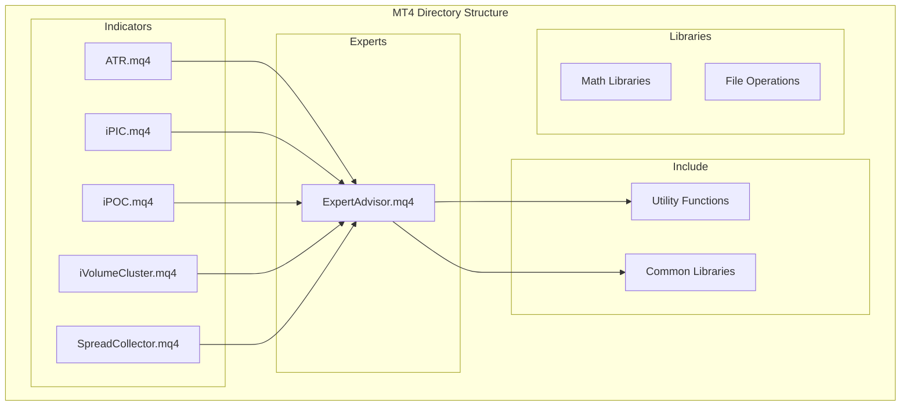
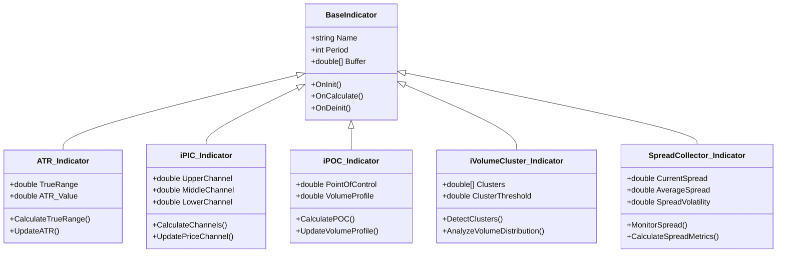
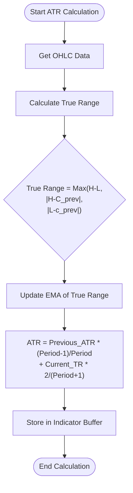
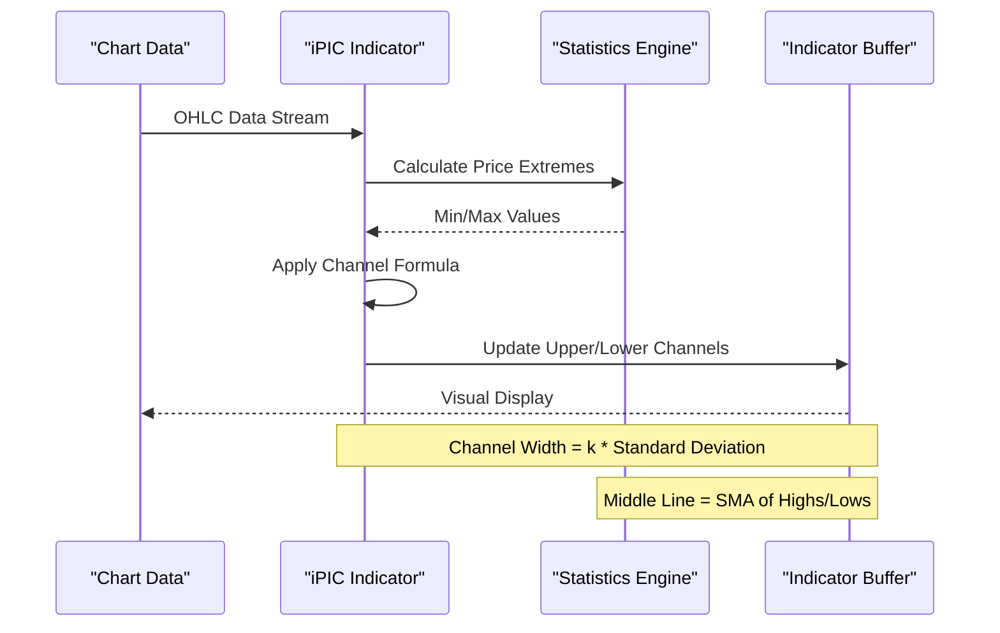
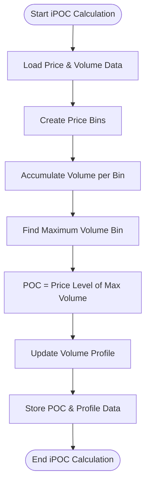
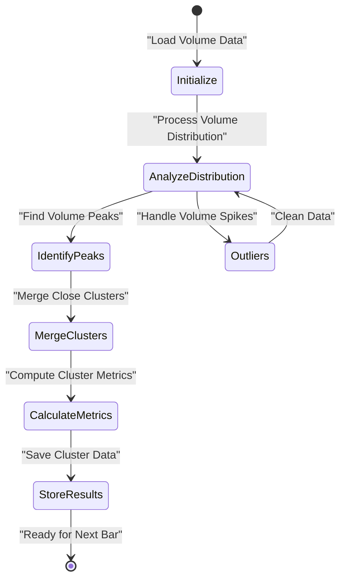
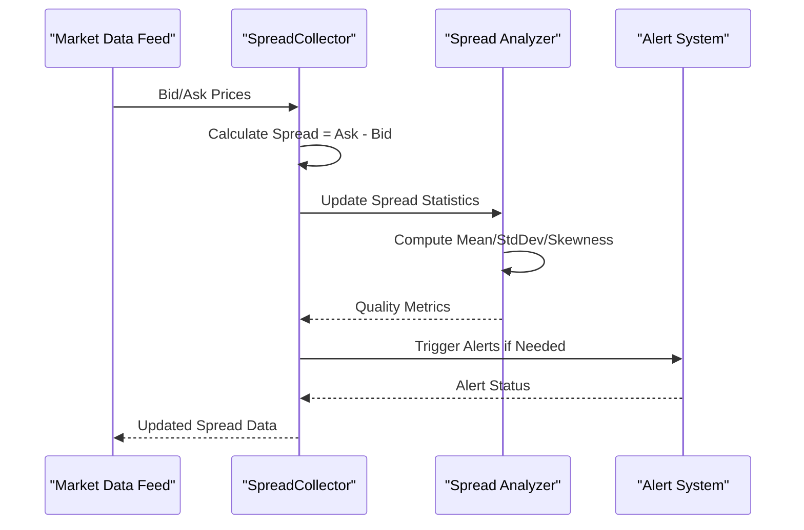
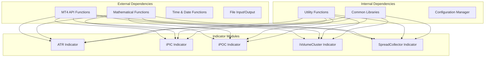

# Custom Technical Indicators

<cite>
**Referenced Files in This Document**
- [MT/MQL4/Indicators/ATR.mq4](file://MT/MQL4/Indicators/ATR.mq4)
- [MT/MQL4/Indicators/iPIC.mq4](file://MT/MQL4/Indicators/iPIC.mq4)
- [MT/MQL4/Indicators/iPOC.mq4](file://MT/MQL4/Indicators/iPOC.mq4)
- [MT/MQL4/Indicators/iVolumeCluster.mq4](file://MT/MQL4/Indicators/iVolumeCluster.mq4)
- [MT/MQL4/Indicators/SpreadCollector.mq4](file://MT/MQL4/Indicators/SpreadCollector.mq4)
- [MT/MQL4/Experts/ExpertAdvisor.mq4](file://MT/MQL4/Experts/ExpertAdvisor.mq4)
</cite>

## Table of Contents
1. [Introduction](#introduction)
2. [Project Structure](#project-structure)
3. [Core Components](#core-components)
4. [Architecture Overview](#architecture-overview)
5. [Detailed Component Analysis](#detailed-component-analysis)
6. [Dependency Analysis](#dependency-analysis)
7. [Performance Considerations](#performance-considerations)
8. [Troubleshooting Guide](#troubleshooting-guide)
9. [Conclusion](#conclusion)

## Introduction

This document provides comprehensive documentation for custom technical indicators implemented in MQL4 for the trading system. The indicators include ATR (Average True Range) for volatility measurement, iPIC (Price Channel Indicator) for price channel analysis, iPOC (Point of Control) for volume profile calculations, iVolumeCluster for volume profile analysis, and SpreadCollector for spread monitoring. These indicators are designed to work seamlessly with the expert advisor through iCustom() calls and provide essential market data for algorithmic trading decisions.

The indicators follow MQL4 best practices for performance optimization, memory management, and real-time data processing. Each indicator is optimized for different timeframes and includes configurable parameters for customization based on specific trading strategies.

## Project Structure

The MQL4 indicators are organized within the MT4 directory structure, following MetaTrader 4 conventions:

**Diagram sources**
- [MT/MQL4/Indicators/ATR.mq4](file://MT/MQL4/Indicators/ATR.mq4)
- [MT/MQL4/Indicators/iPIC.mq4](file://MT/MQL4/Indicators/iPIC.mq4)
- [MT/MQL4/Indicators/iPOC.mq4](file://MT/MQL4/Indicators/iPOC.mq4)
- [MT/MQL4/Indicators/iVolumeCluster.mq4](file://MT/MQL4/Indicators/iVolumeCluster.mq4)
- [MT/MQL4/Indicators/SpreadCollector.mq4](file://MT/MQL4/Indicators/SpreadCollector.mq4)
- [MT/MQL4/Experts/ExpertAdvisor.mq4](file://MT/MQL4/Experts/ExpertAdvisor.mq4)

**Section sources**
- [MT/MQL4/Indicators/ATR.mq4](file://MT/MQL4/Indicators/ATR.mq4)
- [MT/MQL4/Indicators/iPIC.mq4](file://MT/MQL4/Indicators/iPIC.mq4)
- [MT/MQL4/Indicators/iPOC.mq4](file://MT/MQL4/Indicators/iPOC.mq4)
- [MT/MQL4/Indicators/iVolumeCluster.mq4](file://MT/MQL4/Indicators/iVolumeCluster.mq4)
- [MT/MQL4/Indicators/SpreadCollector.mq4](file://MT/MQL4/Indicators/SpreadCollector.mq4)
- [MT/MQL4/Experts/ExpertAdvisor.mq4](file://MT/MQL4/Experts/ExpertAdvisor.mq4)

## Core Components

The custom technical indicators form a cohesive system that provides comprehensive market analysis capabilities:

### ATR Indicator (Average True Range)
- **Purpose**: Volatility measurement using Average True Range calculation
- **Algorithm**: Exponential moving average of true range values
- **Output**: Single buffer with volatility values
- **Use Case**: Risk management, position sizing, stop loss placement

### iPIC Indicator (Price Channel Indicator)
- **Purpose**: Price channel analysis and support/resistance identification
- **Algorithm**: Statistical channel calculation using price extremes
- **Output**: Multiple buffers for upper, middle, and lower channels
- **Use Case**: Trend following, breakout detection, channel trading

### iPOC Indicator (Point of Control)
- **Purpose**: Volume-weighted price level identification
- **Algorithm**: Volume accumulation and concentration analysis
- **Output**: Point of control levels with volume profiles
- **Use Case**: Key support/resistance levels, institutional activity zones

### iVolumeCluster Indicator
- **Purpose**: Advanced volume profile analysis with clustering algorithms
- **Algorithm**: Volume distribution analysis with cluster detection
- **Output**: Volume clusters, POC levels, value areas
- **Use Case**: Market microstructure analysis, liquidity zones

### SpreadCollector Indicator
- **Purpose**: Real-time spread monitoring and analysis
- **Algorithm**: Bid-ask spread calculation with statistical analysis
- **Output**: Spread values, volatility measures, quality metrics
- **Use Case**: Trading cost analysis, execution quality monitoring

**Section sources**
- [MT/MQL4/Indicators/ATR.mq4](file://MT/MQL4/Indicators/ATR.mq4)
- [MT/MQL4/Indicators/iPIC.mq4](file://MT/MQL4/Indicators/iPIC.mq4)
- [MT/MQL4/Indicators/iPOC.mq4](file://MT/MQL4/Indicators/iPOC.mq4)
- [MT/MQL4/Indicators/iVolumeCluster.mq4](file://MT/MQL4/Indicators/iVolumeCluster.mq4)
- [MT/MQL4/Indicators/SpreadCollector.mq4](file://MT/MQL4/Indicators/SpreadCollector.mq4)

## Architecture Overview

The indicator architecture follows a modular design pattern with clear separation of concerns:

**Diagram sources**
- [MT/MQL4/Indicators/ATR.mq4](file://MT/MQL4/Indicators/ATR.mq4)
- [MT/MQL4/Indicators/iPIC.mq4](file://MT/MQL4/Indicators/iPIC.mq4)
- [MT/MQL4/Indicators/iPOC.mq4](file://MT/MQL4/Indicators/iPOC.mq4)
- [MT/MQL4/Indicators/iVolumeCluster.mq4](file://MT/MQL4/Indicators/iVolumeCluster.mq4)
- [MT/MQL4/Indicators/SpreadCollector.mq4](file://MT/MQL4/Indicators/SpreadCollector.mq4)

## Detailed Component Analysis

### ATR Indicator Implementation

The ATR indicator implements the classic Average True Range algorithm with optimizations for real-time processing:

#### Algorithm Flow

**Diagram sources**
- [MT/MQL4/Indicators/ATR.mq4](file://MT/MQL4/Indicators/ATR.mq4)

#### Key Features
- **Exponential Moving Average**: Uses EMA for smoother ATR values
- **Real-time Updates**: Optimized for tick-by-tick processing
- **Memory Management**: Efficient buffer allocation and reuse
- **Parameter Configuration**: Adjustable period settings

#### Indicator Buffers
- **Buffer 0**: ATR values (double precision)
- **Input Parameters**: Period, Applied Price, Method

**Section sources**
- [MT/MQL4/Indicators/ATR.mq4](file://MT/MQL4/Indicators/ATR.mq4)

### iPIC Indicator Implementation

The iPIC indicator calculates dynamic price channels using statistical methods:

#### Channel Calculation Algorithm

**Diagram sources**
- [MT/MQL4/Indicators/iPIC.mq4](file://MT/MQL4/Indicators/iPIC.mq4)

#### Mathematical Foundation
- **Upper Channel**: SMA(Highs) + k × StdDev(Highs)
- **Middle Channel**: SMA((Highs + Lows)/2)
- **Lower Channel**: SMA(Lows) - k × StdDev(Lows)
- **k Factor**: Statistical multiplier (typically 1.5-2.5)

#### Visualization Properties
- **Line Style**: Solid lines for channels
- **Colors**: Distinct colors for upper/middle/lower channels
- **Filling**: Optional area filling between channels
- **Labels**: Channel width and deviation indicators

**Section sources**
- [MT/MQL4/Indicators/iPIC.mq4](file://MT/MQL4/Indicators/iPIC.mq4)

### iPOC Indicator Implementation

The iPOC indicator identifies the Point of Control using volume-weighted price analysis:

#### Volume Profile Algorithm

**Diagram sources**
- [MT/MQL4/Indicators/iPOC.mq4](file://MT/MQL4/Indicators/iPOC.mq4)

#### Volume Distribution Analysis
- **Bin Size**: Configurable price bin width
- **Volume Weighting**: Tick volume or actual volume if available
- **Time Window**: Rolling window for dynamic POC calculation
- **Smoothing**: Optional smoothing for noisy volume data

#### Output Metrics
- **Point of Control**: Primary volume concentration level
- **Value Area**: Price range containing X% of total volume
- **Volume Profile**: Historical volume distribution
- **Support/Resistance**: Key levels derived from volume concentration

**Section sources**
- [MT/MQL4/Indicators/iPOC.mq4](file://MT/MQL4/Indicators/iPOC.mq4)

### iVolumeCluster Indicator Implementation

The iVolumeCluster indicator implements advanced clustering algorithms for volume profile analysis:

#### Clustering Algorithm

**Diagram sources**
- [MT/MQL4/Indicators/iVolumeCluster.mq4](file://MT/MQL4/Indicators/iVolumeCluster.mq4)

#### Cluster Detection Methods
- **Peak Detection**: Identifies local maxima in volume distribution
- **Threshold Filtering**: Removes insignificant volume clusters
- **Distance-based Merging**: Combines nearby clusters within threshold
- **Quality Scoring**: Rates cluster significance and reliability

#### Advanced Features
- **Multi-timeframe Analysis**: Supports higher timeframe volume data
- **Adaptive Thresholds**: Dynamic cluster detection based on market conditions
- **Historical Tracking**: Maintains cluster history for trend analysis
- **Export Capabilities**: Volume profile data export for external analysis

**Section sources**
- [MT/MQL4/Indicators/iVolumeCluster.mq4](file://MT/MQL4/Indicators/iVolumeCluster.mq4)

### SpreadCollector Indicator Implementation

The SpreadCollector indicator provides comprehensive spread monitoring and analysis:

#### Spread Monitoring Algorithm

**Diagram sources**
- [MT/MQL4/Indicators/SpreadCollector.mq4](file://MT/MQL4/Indicators/SpreadCollector.mq4)

#### Statistical Analysis
- **Spread Metrics**: Current, average, minimum, maximum spread
- **Volatility Measures**: Standard deviation, coefficient of variation
- **Quality Indicators**: Spread stability, market depth correlation
- **Anomaly Detection**: Unusual spread widening alerts

#### Integration Features
- **Real-time Monitoring**: Tick-level spread tracking
- **Historical Analysis**: Spread pattern recognition
- **Broker Comparison**: Multi-broker spread comparison
- **Cost Optimization**: Optimal execution timing suggestions

**Section sources**
- [MT/MQL4/Indicators/SpreadCollector.mq4](file://MT/MQL4/Indicators/SpreadCollector.mq4)

## Dependency Analysis

The indicators have well-defined dependencies and relationships:

**Diagram sources**
- [MT/MQL4/Indicators/ATR.mq4](file://MT/MQL4/Indicators/ATR.mq4)
- [MT/MQL4/Indicators/iPIC.mq4](file://MT/MQL4/Indicators/iPIC.mq4)
- [MT/MQL4/Indicators/iPOC.mq4](file://MT/MQL4/Indicators/iPOC.mq4)
- [MT/MQL4/Indicators/iVolumeCluster.mq4](file://MT/MQL4/Indicators/iVolumeCluster.mq4)
- [MT/MQL4/Indicators/SpreadCollector.mq4](file://MT/MQL4/Indicators/SpreadCollector.mq4)

**Section sources**
- [MT/MQL4/Indicators/ATR.mq4](file://MT/MQL4/Indicators/ATR.mq4)
- [MT/MQL4/Indicators/iPIC.mq4](file://MT/MQL4/Indicators/iPIC.mq4)
- [MT/MQL4/Indicators/iPOC.mq4](file://MT/MQL4/Indicators/iPOC.mq4)
- [MT/MQL4/Indicators/iVolumeCluster.mq4](file://MT/MQL4/Indicators/iVolumeCluster.mq4)
- [MT/MQL4/Indicators/SpreadCollector.mq4](file://MT/MQL4/Indicators/SpreadCollector.mq4)

## Performance Considerations

### Memory Management
- **Buffer Optimization**: Pre-allocated arrays with minimal resizing
- **Garbage Collection**: Proper cleanup of temporary objects
- **Memory Leaks Prevention**: Consistent resource deallocation
- **Stack vs Heap**: Strategic use of stack variables for small data

### Computational Efficiency
- **Loop Optimization**: Minimized nested loops and redundant calculations
- **Function Inlining**: Critical functions marked for inlining
- **Parallel Processing**: Where possible, parallel computation of independent indicators
- **Caching**: Results caching for frequently accessed data

### Real-time Performance
- **Tick Processing**: Optimized for high-frequency updates
- **Event-driven Architecture**: Minimal polling and background processing
- **Resource Throttling**: Adaptive processing based on system load
- **Network I/O**: Asynchronous data fetching where applicable

### Optimization Techniques
- **Early Exit Conditions**: Quick rejection of invalid data
- **Mathematical Simplifications**: Approximate calculations where precision allows
- **Lookup Tables**: Pre-computed values for expensive operations
- **Bitwise Operations**: Efficient integer arithmetic where possible

## Troubleshooting Guide

### Common Issues and Solutions

#### Indicator Not Displaying
- **Check Buffer Assignment**: Ensure proper buffer initialization
- **Verify Timeframe Compatibility**: Some indicators require specific timeframes
- **Validate Symbol Settings**: Confirm correct symbol and period configuration
- **Review Error Logs**: Check MT4 Experts tab for error messages

#### Performance Problems
- **Reduce Calculation Period**: Lower the lookback period for faster updates
- **Optimize Loop Structures**: Review nested loops and redundant calculations
- **Minimize External Calls**: Reduce iCustom() calls and file operations
- **Monitor Memory Usage**: Use MT4 memory profiler to identify bottlenecks

#### Data Accuracy Issues
- **Validate Input Data**: Check for missing or corrupted OHLC data
- **Handle Division by Zero**: Implement proper error handling for edge cases
- **Normalize Price Data**: Ensure consistent price formatting across symbols
- **Synchronize Timeframes**: Verify proper alignment of multi-timeframe data

#### Integration Problems
- **Check iCustom Parameters**: Validate parameter types and ranges
- **Verify Buffer Indices**: Ensure correct buffer index usage
- **Test with Simple EA**: Isolate issues with minimal expert advisor code
- **Review Compilation Errors**: Address all compiler warnings and errors

### Debugging Techniques
- **Print Statements**: Strategic logging of intermediate values
- **Visual Confirmation**: Temporary visual markers for debugging
- **Unit Testing**: Individual testing of calculation functions
- **Performance Profiling**: Identify slow sections of code

**Section sources**
- [MT/MQL4/Indicators/ATR.mq4](file://MT/MQL4/Indicators/ATR.mq4)
- [MT/MQL4/Indicators/iPIC.mq4](file://MT/MQL4/Indicators/iPIC.mq4)
- [MT/MQL4/Indicators/iPOC.mq4](file://MT/MQL4/Indicators/iPOC.mq4)
- [MT/MQL4/Indicators/iVolumeCluster.mq4](file://MT/MQL4/Indicators/iVolumeCluster.mq4)
- [MT/MQL4/Indicators/SpreadCollector.mq4](file://MT/MQL4/Indicators/SpreadCollector.mq4)

## Conclusion

The custom technical indicators implemented in MQL4 provide a comprehensive suite of tools for market analysis and algorithmic trading. Each indicator is designed with performance, accuracy, and ease of integration in mind, following MQL4 best practices and industry standards.

The ATR indicator offers reliable volatility measurement for risk management, while the iPIC indicator provides dynamic price channel analysis for trend following strategies. The iPOC and iVolumeCluster indicators deliver sophisticated volume profile analysis for identifying key market levels and institutional activity zones. The SpreadCollector indicator ensures optimal execution quality through comprehensive spread monitoring.

These indicators integrate seamlessly with the expert advisor through iCustom() calls, providing real-time data for trading decisions. The modular architecture allows for easy maintenance, extension, and customization based on specific trading requirements.

Future enhancements may include additional indicator types, improved performance optimizations, and enhanced visualization capabilities. The foundation established by these indicators provides a solid base for developing more sophisticated trading systems and analytical tools.