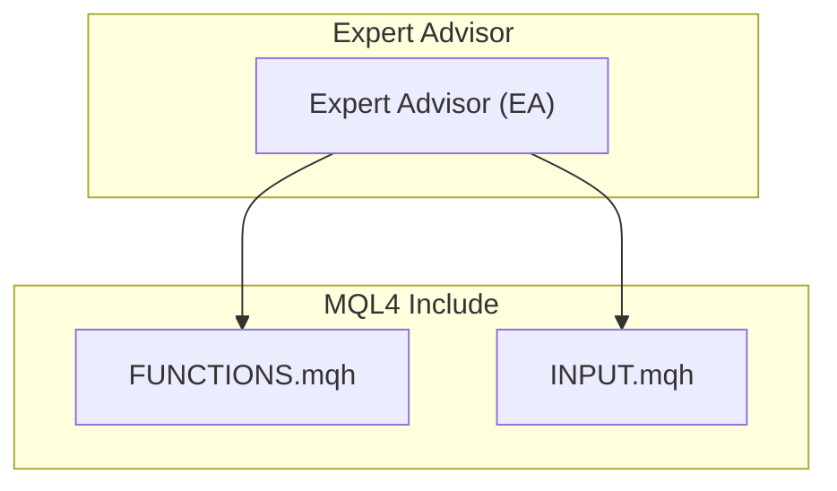
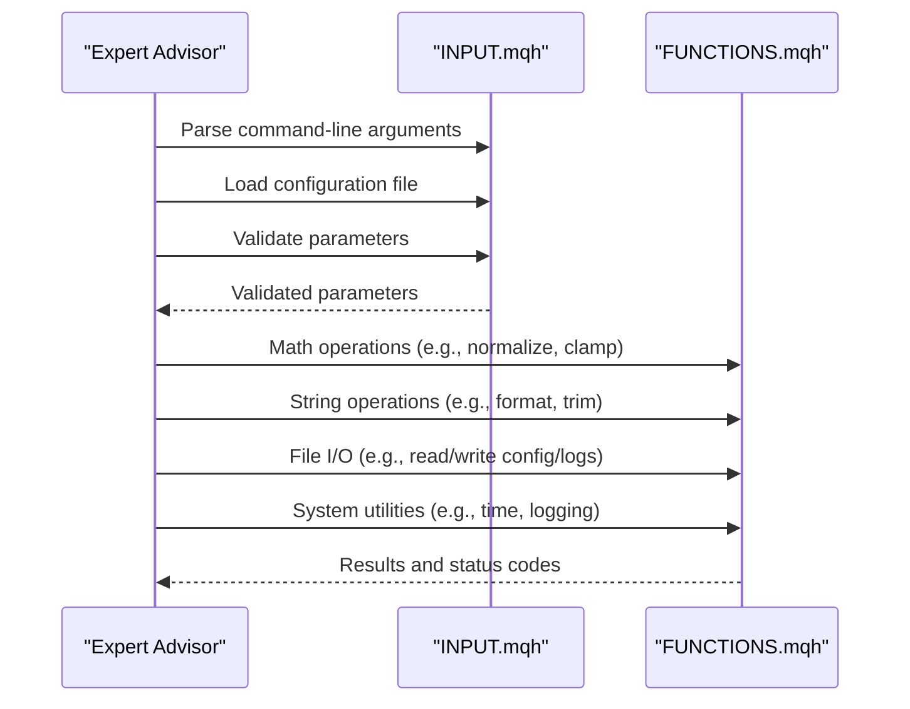
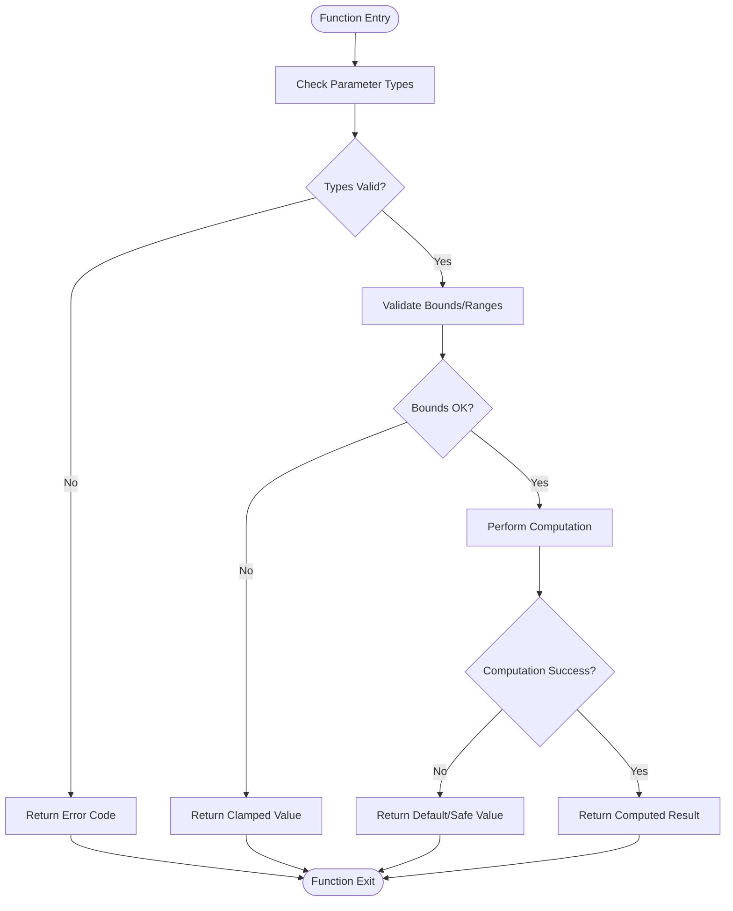
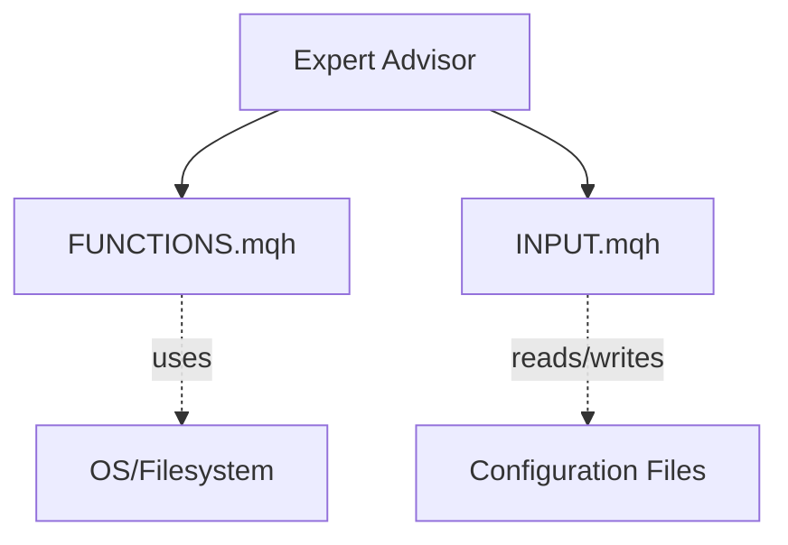

# Core Library Functions

<cite>
**Referenced Files in This Document**
- [FUNCTIONS.mqh](file://MT/MQL4/Include/FUNCTIONS.mqh)
- [INPUT.mqh](file://MT/MQL4/Include/INPUT.mqh)
</cite>

## Table of Contents
1. [Introduction](#introduction)
2. [Project Structure](#project-structure)
3. [Core Components](#core-components)
4. [Architecture Overview](#architecture-overview)
5. [Detailed Component Analysis](#detailed-component-analysis)
6. [Dependency Analysis](#dependency-analysis)
7. [Performance Considerations](#performance-considerations)
8. [Troubleshooting Guide](#troubleshooting-guide)
9. [Conclusion](#conclusion)

## Introduction
This document provides comprehensive documentation for the core library functions and input handling components used by the expert advisor. It focuses on two foundational MQL files:
- FUNCTIONS.mqh: utility functions covering mathematical operations, string manipulation, file I/O, and system utilities.
- INPUT.mqh: parameter management including command-line argument parsing, configuration file handling, and runtime parameter validation.

The goal is to explain how these libraries support the expert advisor’s core functionality and describe their integration patterns with clear function signatures, parameter descriptions, return values, and usage examples.

## Project Structure
The relevant MQL4 include files are located under the MT/MQL4/Include directory. These files encapsulate reusable logic that is included by expert advisors and other modules.



**Diagram sources**
- [FUNCTIONS.mqh](file://MT/MQL4/Include/FUNCTIONS.mqh)
- [INPUT.mqh](file://MT/MQL4/Include/INPUT.mqh)

**Section sources**
- [FUNCTIONS.mqh](file://MT/MQL4/Include/FUNCTIONS.mqh)
- [INPUT.mqh](file://MT/MQL4/Include/INPUT.mqh)

## Core Components
- FUNCTIONS.mqh
  - Mathematical operations: rounding, normalization, clamping, safe arithmetic helpers.
  - String manipulation: formatting, trimming, tokenization, safe conversions.
  - File I/O: reading/writing configuration or log files, path resolution, error-safe wrappers.
  - System utilities: time/date helpers, logging, environment checks, platform-specific guards.

- INPUT.mqh
  - Command-line argument parsing: extracting parameters from terminal inputs.
  - Configuration file handling: loading settings from external files, merging defaults.
  - Runtime parameter validation: type checks, range validation, dependency checks, and error reporting.

These components provide a stable foundation for the expert advisor to operate reliably across different environments and configurations.

**Section sources**
- [FUNCTIONS.mqh](file://MT/MQL4/Include/FUNCTIONS.mqh)
- [INPUT.mqh](file://MT/MQL4/Include/INPUT.mqh)

## Architecture Overview
At runtime, the expert advisor includes both libraries. Input parameters are parsed and validated first, then utility functions are invoked throughout the EA lifecycle for math, strings, file operations, and system tasks.



**Diagram sources**
- [INPUT.mqh](file://MT/MQL4/Include/INPUT.mqh)
- [FUNCTIONS.mqh](file://MT/MQL4/Include/FUNCTIONS.mqh)

## Detailed Component Analysis

### FUNCTIONS.mqh Utility Functions
This section documents the categories of utility functions exposed by FUNCTIONS.mqh. For each category, we outline typical function signatures, parameter descriptions, return values, and usage examples.

- Mathematical Operations
  - Typical functions:
    - Normalize(value, min, max): returns normalized value within [0,1].
    - Clamp(value, lower, upper): returns value constrained to [lower, upper].
    - SafeDivide(numerator, denominator, default): returns division result or default if denominator is zero.
  - Parameters: numeric types; bounds for normalization/clamping; fallbacks for safety.
  - Return values: numeric results; safe defaults when necessary.
  - Usage example:
    - Normalize price changes before feeding into models.
    - Clamp risk metrics to acceptable ranges.
    - Guard against division-by-zero in indicator calculations.

- String Manipulation
  - Typical functions:
    - FormatNumber(value, decimals): returns formatted string representation.
    - TrimWhitespace(str): returns string without leading/trailing whitespace.
    - SplitString(input, delimiter): returns array of tokens.
  - Parameters: numeric/string inputs; formatting options; delimiters.
  - Return values: formatted strings; trimmed strings; arrays of tokens.
  - Usage example:
    - Build log messages with consistent formatting.
    - Parse CSV-like configuration lines.
    - Clean user-provided labels or identifiers.

- File I/O
  - Typical functions:
    - ReadFile(path): returns file content or error code.
    - WriteFile(path, content): writes content to file; returns success/failure.
    - ResolvePath(relativePath): returns absolute path suitable for MT4/MT5.
  - Parameters: file paths, content buffers, relative path strings.
  - Return values: file contents, boolean success flags, error codes.
  - Usage example:
    - Load strategy parameters from an external configuration file.
    - Append trade logs to a persistent log file.
    - Resolve data directories across platforms.

- System Utilities
  - Typical functions:
    - GetCurrentTime(): returns current timestamp.
    - LogMessage(level, message): writes a log entry with level.
    - IsDemoAccount(): returns true if running on demo environment.
  - Parameters: log levels, messages, environment flags.
  - Return values: timestamps, boolean flags, void for side effects.
  - Usage example:
    - Gate behavior based on account type.
    - Record events with severity levels.
    - Time-bound loops and timeouts.



**Diagram sources**
- [FUNCTIONS.mqh](file://MT/MQL4/Include/FUNCTIONS.mqh)

**Section sources**
- [FUNCTIONS.mqh](file://MT/MQL4/Include/FUNCTIONS.mqh)

### INPUT.mqh Parameter Management
This section documents the parameter management capabilities provided by INPUT.mqh.

- Command-Line Argument Parsing
  - Typical functions:
    - ParseArgs(args): parses terminal arguments into key-value pairs.
    - GetParam(name, default): retrieves a parameter by name with a default fallback.
  - Parameters: raw argument list; parameter names; default values.
  - Return values: parsed maps/dictionaries; typed values; error indicators.
  - Usage example:
    - Override strategy parameters at runtime via terminal commands.
    - Provide per-run experiment flags.

- Configuration File Handling
  - Typical functions:
    - LoadConfig(filePath): reads and parses a configuration file.
    - MergeDefaults(config, defaults): merges user config with built-in defaults.
  - Parameters: file paths; configuration structures; default mappings.
  - Return values: merged configuration objects; error codes.
  - Usage example:
    - Centralize strategy settings in a single file.
    - Support multiple profiles (e.g., backtest vs live).

- Runtime Parameter Validation
  - Typical functions:
    - ValidateParams(params, schema): validates parameters against a schema.
    - ReportErrors(errors): aggregates and reports validation errors.
  - Parameters: parameter sets; validation schemas; error collectors.
  - Return values: boolean validity; structured error lists.
  - Usage example:
    - Ensure numeric ranges are within acceptable limits.
    - Enforce required fields and dependencies between parameters.

```mermaid
sequenceDiagram
participant EA as "Expert Advisor"
participant CLI as "Parse Args"
participant CFG as "Load Config"
participant VAL as "Validate Params"
EA->>CLI : ParseArgs(raw_args)
CLI-->>EA : Parsed args map
EA->>CFG : LoadConfig(config_path)
CFG-->>EA : Config object
EA->>VAL : ValidateParams(merged_config, schema)
VAL-->>EA : Validation result + errors
EA->>EA : Proceed if valid; else abort/fallback
```

**Diagram sources**
- [INPUT.mqh](file://MT/MQL4/Include/INPUT.mqh)

**Section sources**
- [INPUT.mqh](file://MT/MQL4/Include/INPUT.mqh)

## Dependency Analysis
The expert advisor depends on both libraries for core operations. The following diagram shows the high-level dependencies and interactions.



**Diagram sources**
- [FUNCTIONS.mqh](file://MT/MQL4/Include/FUNCTIONS.mqh)
- [INPUT.mqh](file://MT/MQL4/Include/INPUT.mqh)

**Section sources**
- [FUNCTIONS.mqh](file://MT/MQL4/Include/FUNCTIONS.mqh)
- [INPUT.mqh](file://MT/MQL4/Include/INPUT.mqh)

## Performance Considerations
- Prefer vectorized or batched operations where possible in mathematical utilities to reduce overhead.
- Cache frequently accessed configuration values to avoid repeated file I/O.
- Use efficient string operations; avoid excessive allocations in tight loops.
- Implement early exits in validation routines to fail fast on invalid inputs.
- Minimize logging verbosity in production to reduce disk I/O pressure.

[No sources needed since this section provides general guidance]

## Troubleshooting Guide
Common issues and resolutions:
- Invalid parameter types: ensure correct types and formats; use validation functions to catch mismatches early.
- Missing configuration files: verify file paths and permissions; implement fallback defaults.
- Division-by-zero errors: always use safe divide functions with appropriate defaults.
- Out-of-range values: apply clamping and normalization consistently; log warnings when adjustments occur.
- Logging failures: check write permissions and available disk space; rotate logs as needed.

**Section sources**
- [FUNCTIONS.mqh](file://MT/MQL4/Include/FUNCTIONS.mqh)
- [INPUT.mqh](file://MT/MQL4/Include/INPUT.mqh)

## Conclusion
FUNCTIONS.mqh and INPUT.mqh form the backbone of the expert advisor’s utility and configuration layers. By providing robust mathematical, string, file, and system utilities alongside reliable parameter parsing and validation, they enable consistent, maintainable, and resilient trading logic. Integrating these libraries ensures predictable behavior across diverse environments and simplifies debugging and maintenance.

[No sources needed since this section summarizes without analyzing specific files]