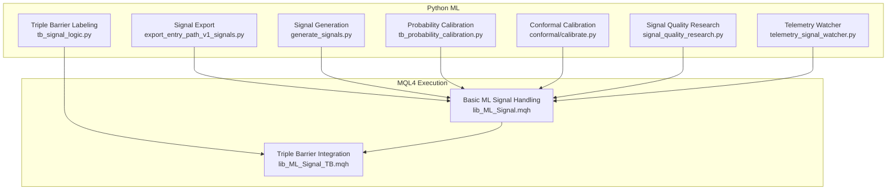
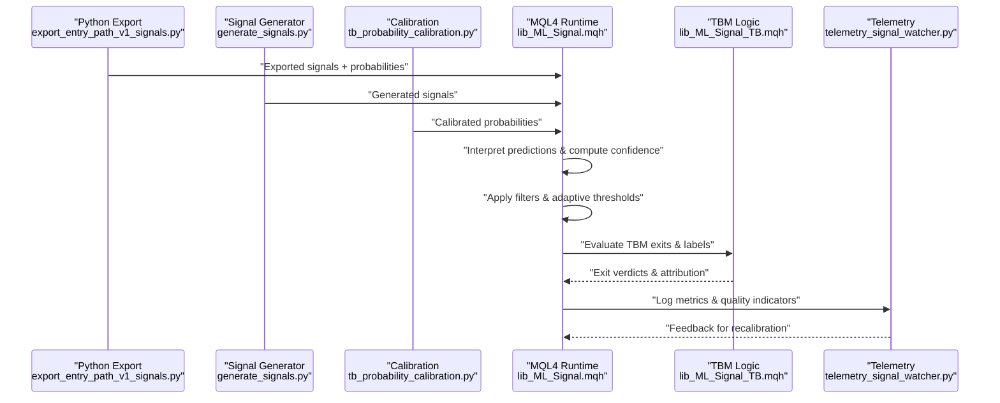
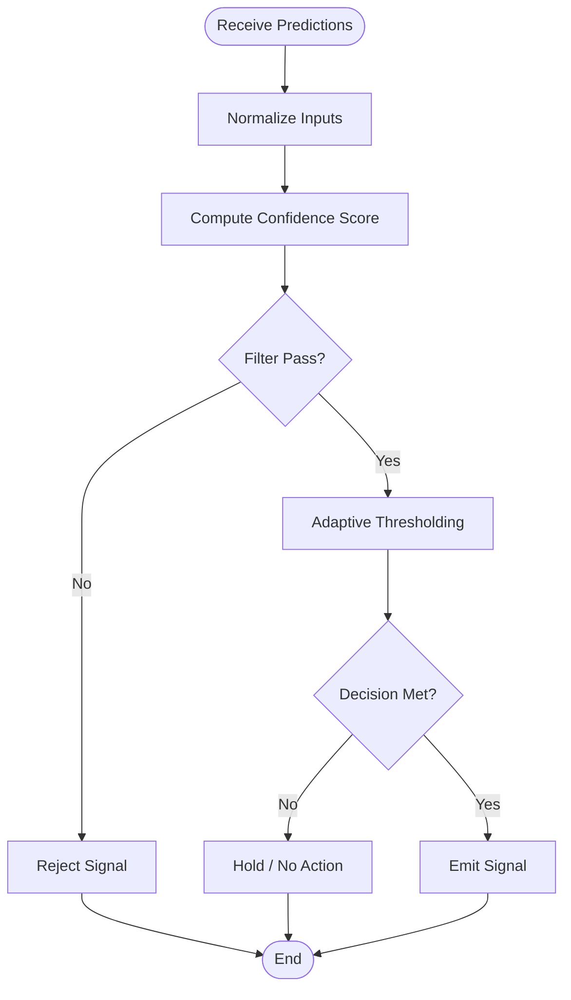
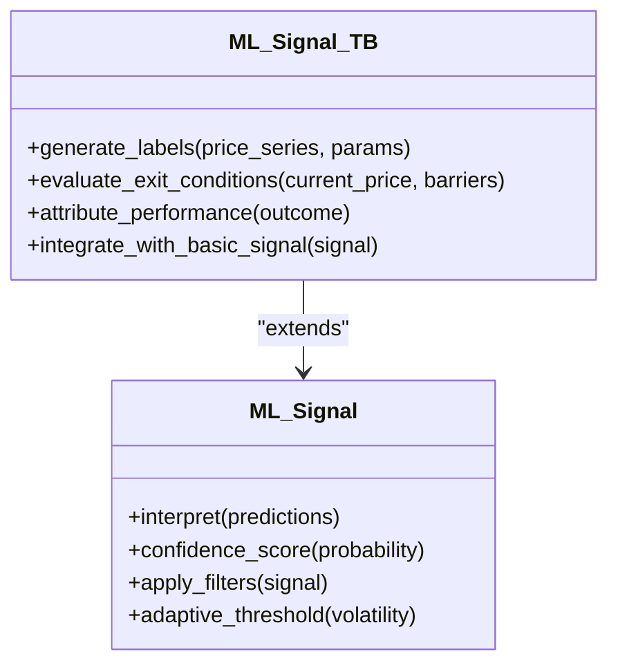
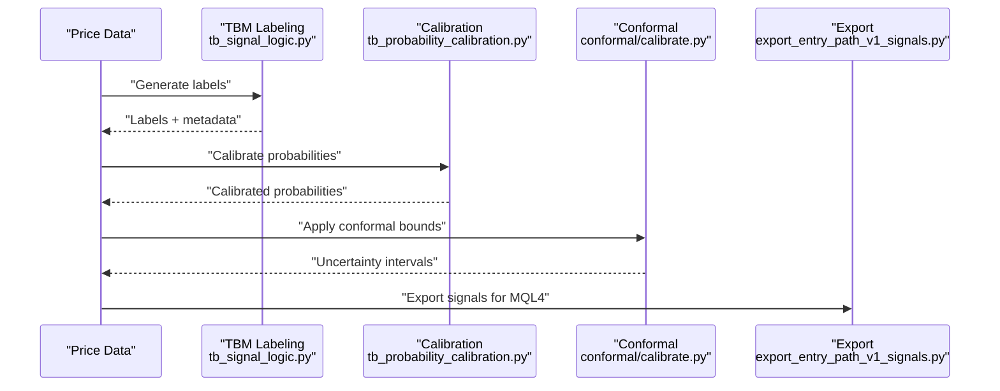
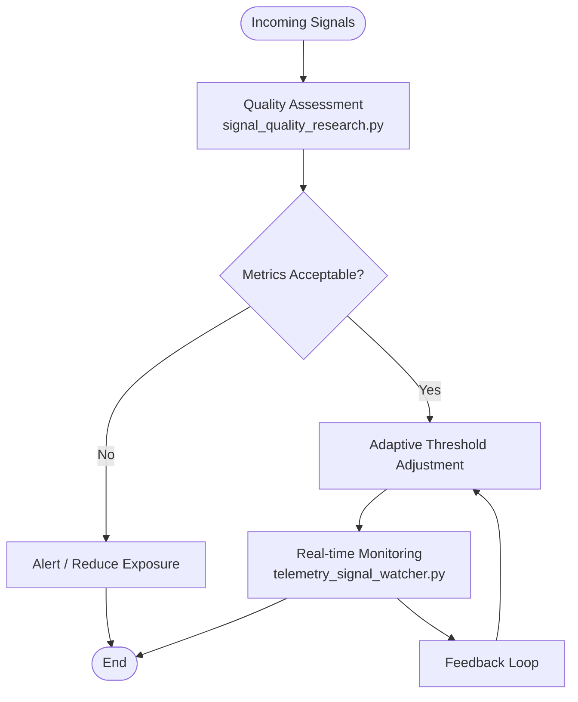
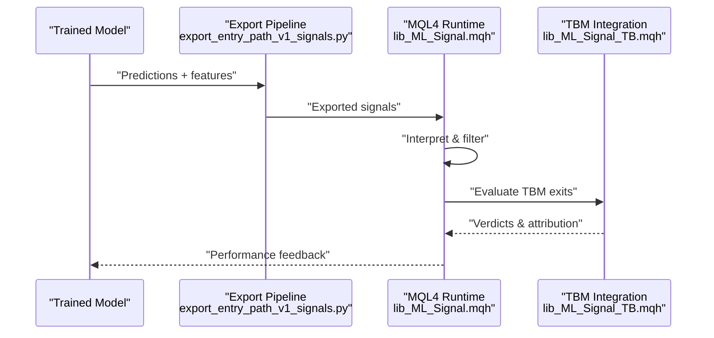
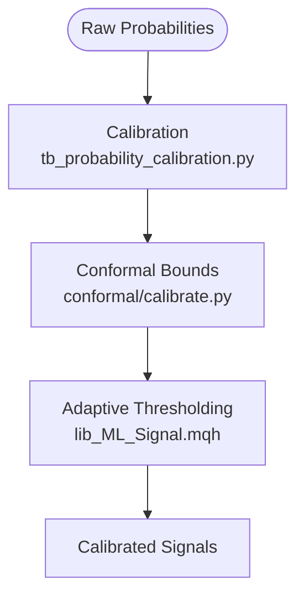
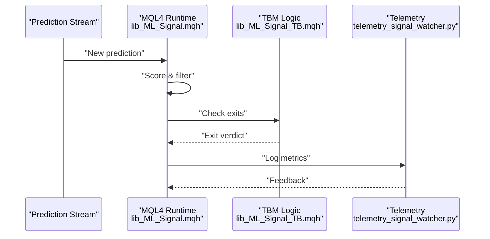
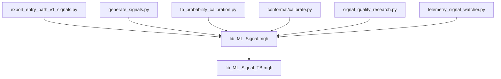

# ML Signal Processing Libraries

<cite>
**Referenced Files in This Document**
- [lib_ML_Signal.mqh](file://MT/MQL4/Include/lib_ML_Signal.mqh)
- [lib_ML_Signal_TB.mqh](file://MT/MQL4/Include/lib_ML_Signal_TB.mqh)
- [triple_barrier_mt4_execution.py](file://ML/triple_barrier_mt4_execution.py)
- [tb_signal_logic.py](file://ML/tb_signal_logic.py)
- [tb_probability_calibration.py](file://ML/tb_probability_calibration.py)
- [conformal/calibrate.py](file://ML/conformal/calibrate.py)
- [export_entry_path_v1_signals.py](file://API/export_entry_path_v1_signals.py)
- [generate_signals.py](file://API/generate_signals.py)
- [signal_quality_research.py](file://API/signal_quality_research.py)
- [telemetry_signal_watcher.py](file://API/telemetry_signal_watcher.py)
</cite>

## Table of Contents
1. [Introduction](#introduction)
2. [Project Structure](#project-structure)
3. [Core Components](#core-components)
4. [Architecture Overview](#architecture-overview)
5. [Detailed Component Analysis](#detailed-component-analysis)
6. [Dependency Analysis](#dependency-analysis)
7. [Performance Considerations](#performance-considerations)
8. [Troubleshooting Guide](#troubleshooting-guide)
9. [Conclusion](#conclusion)
10. [Appendices](#appendices)

## Introduction
This document provides comprehensive documentation for the machine learning signal processing libraries used to bridge Python-trained models with MQL4 execution. It focuses on:
- lib_ML_Signal.mqh: basic ML signal handling, prediction interpretation, confidence scoring, and filtering
- lib_ML_Signal_TB.mqh: triple barrier method integration including label generation, exit condition evaluation, and performance attribution
- Signal validation, quality assessment, and adaptive thresholding
- Integration patterns between Python model outputs and MQL4 runtime workflows
- Real-time prediction processing and calibration techniques

The goal is to make these libraries accessible to both technical and non-technical readers while providing precise references to implementation files.

## Project Structure
At a high level, the project separates Python-side ML development (data preparation, training, export, and research) from MQL4-side execution (signal processing, risk controls, and live trading). The key components relevant to this document are:
- MQL4 include libraries for signal handling and triple barrier logic
- Python modules for triple barrier labeling, probability calibration, and signal generation
- API utilities for exporting signals and monitoring telemetry

**Diagram sources**
- [lib_ML_Signal.mqh](file://MT/MQL4/Include/lib_ML_Signal.mqh)
- [lib_ML_Signal_TB.mqh](file://MT/MQL4/Include/lib_ML_Signal_TB.mqh)
- [tb_signal_logic.py](file://ML/tb_signal_logic.py)
- [tb_probability_calibration.py](file://ML/tb_probability_calibration.py)
- [conformal/calibrate.py](file://ML/conformal/calibrate.py)
- [export_entry_path_v1_signals.py](file://API/export_entry_path_v1_signals.py)
- [generate_signals.py](file://API/generate_signals.py)
- [signal_quality_research.py](file://API/signal_quality_research.py)
- [telemetry_signal_watcher.py](file://API/telemetry_signal_watcher.py)

**Section sources**
- [lib_ML_Signal.mqh](file://MT/MQL4/Include/lib_ML_Signal.mqh)
- [lib_ML_Signal_TB.mqh](file://MT/MQL4/Include/lib_ML_Signal_TB.mqh)
- [tb_signal_logic.py](file://ML/tb_signal_logic.py)
- [tb_probability_calibration.py](file://ML/tb_probability_calibration.py)
- [conformal/calibrate.py](file://ML/conformal/calibrate.py)
- [export_entry_path_v1_signals.py](file://API/export_entry_path_v1_signals.py)
- [generate_signals.py](file://API/generate_signals.py)
- [signal_quality_research.py](file://API/signal_quality_research.py)
- [telemetry_signal_watcher.py](file://API/telemetry_signal_watcher.py)

## Core Components
- lib_ML_Signal.mqh: Provides foundational functions for interpreting ML predictions, computing confidence scores, applying filters, and managing thresholds. It serves as the base layer for all signal operations in MQL4.
- lib_ML_Signal_TB.mqh: Extends basic signal handling with triple barrier method support. It includes label generation logic, exit condition evaluation, and performance attribution routines tailored to MT4 execution.

Key responsibilities:
- Prediction interpretation: mapping raw model outputs to actionable signals
- Confidence scoring: quantifying reliability per signal
- Filtering: removing low-quality or unstable signals
- Adaptive thresholding: adjusting decision boundaries based on market conditions
- Triple barrier integration: aligning labels and exits with the TBM framework
- Performance attribution: decomposing outcomes into drivers (e.g., direction, timing, volatility)

**Section sources**
- [lib_ML_Signal.mqh](file://MT/MQL4/Include/lib_ML_Signal.mqh)
- [lib_ML_Signal_TB.mqh](file://MT/MQL4/Include/lib_ML_Signal_TB.mqh)

## Architecture Overview
The architecture connects Python-trained models to MQL4 execution through exported signals and calibrated probabilities. The flow typically involves:
1. Python exports signals and probabilities (optionally conformally calibrated)
2. MQL4 loads signals and applies confidence-based filtering
3. Triple barrier logic evaluates exit conditions and attributes performance
4. Telemetry monitors signal quality and system health

**Diagram sources**
- [export_entry_path_v1_signals.py](file://API/export_entry_path_v1_signals.py)
- [generate_signals.py](file://API/generate_signals.py)
- [tb_probability_calibration.py](file://ML/tb_probability_calibration.py)
- [lib_ML_Signal.mqh](file://MT/MQL4/Include/lib_ML_Signal.mqh)
- [lib_ML_Signal_TB.mqh](file://MT/MQL4/Include/lib_ML_Signal_TB.mqh)
- [telemetry_signal_watcher.py](file://API/telemetry_signal_watcher.py)

## Detailed Component Analysis

### lib_ML_Signal.mqh: Basic ML Signal Handling
Responsibilities:
- Interpretation of model outputs into directional signals
- Confidence scoring using probabilities or quantiles
- Filtering mechanisms to suppress weak signals
- Adaptive thresholding to maintain stability across regimes

Typical workflow:
- Receive predictions/probabilities
- Normalize and scale if needed
- Compute confidence score
- Apply filters (e.g., minimum confidence, consistency checks)
- Adjust thresholds adaptively based on recent performance or volatility
- Emit final signal state

**Diagram sources**
- [lib_ML_Signal.mqh](file://MT/MQL4/Include/lib_ML_Signal.mqh)

**Section sources**
- [lib_ML_Signal.mqh](file://MT/MQL4/Include/lib_ML_Signal.mqh)

### lib_ML_Signal_TB.mqh: Triple Barrier Method Integration
Responsibilities:
- Label generation aligned with TBM rules (time horizon, take profit, stop loss)
- Exit condition evaluation during live execution
- Performance attribution to identify drivers of PnL
- Integration with basic signal handling for coherent workflows

Typical workflow:
- Initialize TBM parameters (horizon, barriers)
- On entry, track price path against barriers
- Evaluate exit conditions at each bar
- Assign labels based on first-touch or time-out
- Attribute performance by decomposing contributions

**Diagram sources**
- [lib_ML_Signal.mqh](file://MT/MQL4/Include/lib_ML_Signal.mqh)
- [lib_ML_Signal_TB.mqh](file://MT/MQL4/Include/lib_ML_Signal_TB.mqh)

**Section sources**
- [lib_ML_Signal_TB.mqh](file://MT/MQL4/Include/lib_ML_Signal_TB.mqh)

### Python-Side Triple Barrier Labeling and Calibration
- tb_signal_logic.py: Implements TBM label generation and exit logic consistent with TBM methodology
- tb_probability_calibration.py: Calibrates predicted probabilities to improve reliability
- conformal/calibrate.py: Applies conformal prediction methods for robust uncertainty quantification

These modules ensure that signals exported to MQL4 are well-calibrated and aligned with TBM expectations.

**Diagram sources**
- [tb_signal_logic.py](file://ML/tb_signal_logic.py)
- [tb_probability_calibration.py](file://ML/tb_probability_calibration.py)
- [conformal/calibrate.py](file://ML/conformal/calibrate.py)
- [export_entry_path_v1_signals.py](file://API/export_entry_path_v1_signals.py)

**Section sources**
- [tb_signal_logic.py](file://ML/tb_signal_logic.py)
- [tb_probability_calibration.py](file://ML/tb_probability_calibration.py)
- [conformal/calibrate.py](file://ML/conformal/calibrate.py)
- [export_entry_path_v1_signals.py](file://API/export_entry_path_v1_signals.py)

### Signal Validation, Quality Assessment, and Adaptive Thresholding
- signal_quality_research.py: Analyzes signal quality metrics, stability, and drift detection
- telemetry_signal_watcher.py: Monitors real-time signal behavior and logs diagnostics
- Adaptive thresholding in lib_ML_Signal.mqh adjusts decision boundaries based on recent performance and volatility

**Diagram sources**
- [signal_quality_research.py](file://API/signal_quality_research.py)
- [telemetry_signal_watcher.py](file://API/telemetry_signal_watcher.py)
- [lib_ML_Signal.mqh](file://MT/MQL4/Include/lib_ML_Signal.mqh)

**Section sources**
- [signal_quality_research.py](file://API/signal_quality_research.py)
- [telemetry_signal_watcher.py](file://API/telemetry_signal_watcher.py)
- [lib_ML_Signal.mqh](file://MT/MQL4/Include/lib_ML_Signal.mqh)

### Integrating Python-Trained Models with MQL4 Execution
- Export pipelines generate signals compatible with MQL4 consumption
- Calibration ensures probabilities are reliable under live conditions
- Telemetry provides feedback for continuous improvement

**Diagram sources**
- [export_entry_path_v1_signals.py](file://API/export_entry_path_v1_signals.py)
- [lib_ML_Signal.mqh](file://MT/MQL4/Include/lib_ML_Signal.mqh)
- [lib_ML_Signal_TB.mqh](file://MT/MQL4/Include/lib_ML_Signal_TB.mqh)

**Section sources**
- [export_entry_path_v1_signals.py](file://API/export_entry_path_v1_signals.py)
- [lib_ML_Signal.mqh](file://MT/MQL4/Include/lib_ML_Signal.mqh)
- [lib_ML_Signal_TB.mqh](file://MT/MQL4/Include/lib_ML_Signal_TB.mqh)

### Signal Calibration Techniques
- Probability calibration improves reliability of confidence scores
- Conformal prediction adds robust uncertainty bounds
- Adaptive thresholding maintains stability across regimes

**Diagram sources**
- [tb_probability_calibration.py](file://ML/tb_probability_calibration.py)
- [conformal/calibrate.py](file://ML/conformal/calibrate.py)
- [lib_ML_Signal.mqh](file://MT/MQL4/Include/lib_ML_Signal.mqh)

**Section sources**
- [tb_probability_calibration.py](file://ML/tb_probability_calibration.py)
- [conformal/calibrate.py](file://ML/conformal/calibrate.py)
- [lib_ML_Signal.mqh](file://MT/MQL4/Include/lib_ML_Signal.mqh)

### Real-Time Prediction Processing Workflows
- Ingest incoming predictions
- Apply confidence scoring and filtering
- Evaluate TBM exit conditions
- Log telemetry for monitoring and recalibration

**Diagram sources**
- [lib_ML_Signal.mqh](file://MT/MQL4/Include/lib_ML_Signal.mqh)
- [lib_ML_Signal_TB.mqh](file://MT/MQL4/Include/lib_ML_Signal_TB.mqh)
- [telemetry_signal_watcher.py](file://API/telemetry_signal_watcher.py)

**Section sources**
- [lib_ML_Signal.mqh](file://MT/MQL4/Include/lib_ML_Signal.mqh)
- [lib_ML_Signal_TB.mqh](file://MT/MQL4/Include/lib_ML_Signal_TB.mqh)
- [telemetry_signal_watcher.py](file://API/telemetry_signal_watcher.py)

## Dependency Analysis
The dependencies between core components form a clear pipeline from Python exports to MQL4 execution, with calibration and telemetry providing feedback loops.

**Diagram sources**
- [export_entry_path_v1_signals.py](file://API/export_entry_path_v1_signals.py)
- [generate_signals.py](file://API/generate_signals.py)
- [tb_probability_calibration.py](file://ML/tb_probability_calibration.py)
- [conformal/calibrate.py](file://ML/conformal/calibrate.py)
- [signal_quality_research.py](file://API/signal_quality_research.py)
- [telemetry_signal_watcher.py](file://API/telemetry_signal_watcher.py)
- [lib_ML_Signal.mqh](file://MT/MQL4/Include/lib_ML_Signal.mqh)
- [lib_ML_Signal_TB.mqh](file://MT/MQL4/Include/lib_ML_Signal_TB.mqh)

**Section sources**
- [export_entry_path_v1_signals.py](file://API/export_entry_path_v1_signals.py)
- [generate_signals.py](file://API/generate_signals.py)
- [tb_probability_calibration.py](file://ML/tb_probability_calibration.py)
- [conformal/calibrate.py](file://ML/conformal/calibrate.py)
- [signal_quality_research.py](file://API/signal_quality_research.py)
- [telemetry_signal_watcher.py](file://API/telemetry_signal_watcher.py)
- [lib_ML_Signal.mqh](file://MT/MQL4/Include/lib_ML_Signal.mqh)
- [lib_ML_Signal_TB.mqh](file://MT/MQL4/Include/lib_ML_Signal_TB.mqh)

## Performance Considerations
- Minimize computational overhead in MQL4 by precomputing where possible in Python
- Use efficient data structures for signal queues and history buffers
- Implement batch processing for calibration updates
- Monitor latency in real-time prediction processing
- Tune adaptive thresholds to balance responsiveness and stability

[No sources needed since this section provides general guidance]

## Troubleshooting Guide
Common issues and resolutions:
- Signal rejection due to low confidence: review calibration and threshold settings
- Drift in signal quality: check telemetry metrics and recalibrate probabilities
- TBM exit mismatches: verify label generation logic and barrier parameters
- Latency spikes: optimize filtering and reduce unnecessary computations

**Section sources**
- [signal_quality_research.py](file://API/signal_quality_research.py)
- [telemetry_signal_watcher.py](file://API/telemetry_signal_watcher.py)
- [tb_signal_logic.py](file://ML/tb_signal_logic.py)

## Conclusion
The ML signal processing libraries provide a robust foundation for integrating Python-trained models with MQL4 execution. By combining confident signal interpretation, adaptive thresholding, triple barrier integration, and continuous monitoring, the system achieves reliable and adaptable trading signals. Proper calibration and quality assessment ensure long-term stability and performance.

[No sources needed since this section summarizes without analyzing specific files]

## Appendices
- Additional references to triple barrier execution and MT4-specific considerations can be found in related Python modules and documentation.

[No sources needed since this section provides general guidance]