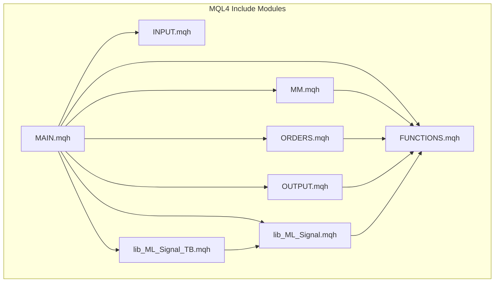
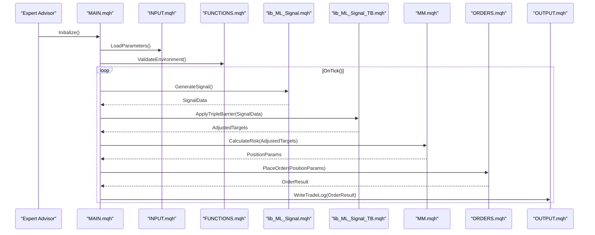
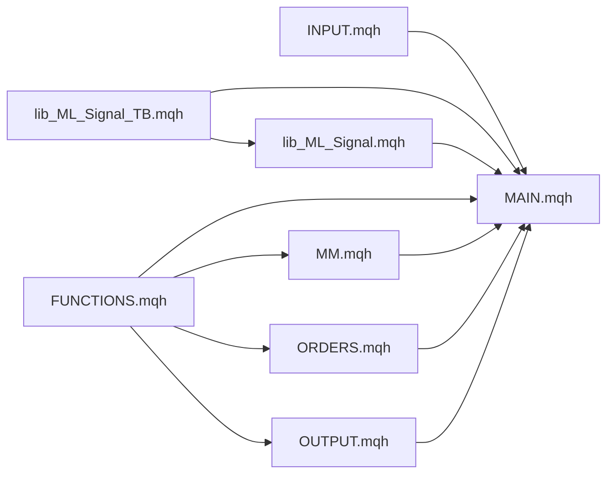

# MQL4 Library Components

<cite>
**Referenced Files in This Document**
- [FUNCTIONS.mqh](file://MT/MQL4/Include/FUNCTIONS.mqh)
- [INPUT.mqh](file://MT/MQL4/Include/INPUT.mqh)
- [MAIN.mqh](file://MT/MQL4/Include/MAIN.mqh)
- [MM.mqh](file://MT/MQL4/Include/MM.mqh)
- [ORDERS.mqh](file://MT/MQL4/Include/ORDERS.mqh)
- [OUTPUT.mqh](file://MT/MQL4/Include/OUTPUT.mqh)
- [lib_ML_Signal.mqh](file://MT/MQL4/Include/lib_ML_Signal.mqh)
- [lib_ML_Signal_TB.mqh](file://MT/MQL4/Include/lib_ML_Signal_TB.mqh)
</cite>

## Table of Contents
1. [Introduction](#introduction)
2. [Project Structure](#project-structure)
3. [Core Components](#core-components)
4. [Architecture Overview](#architecture-overview)
5. [Detailed Component Analysis](#detailed-component-analysis)
6. [Dependency Analysis](#dependency-analysis)
7. [Performance Considerations](#performance-considerations)
8. [Troubleshooting Guide](#troubleshooting-guide)
9. [Conclusion](#conclusion)

## Introduction
This document provides a comprehensive guide to the MQL4 library components that power the expert advisor functionality. It explains the purpose, key functions, parameters, return values, and usage patterns for each include file: FUNCTIONS.mqh (utility functions), INPUT.mqh (parameter handling), MAIN.mqh (core logic orchestration), MM.mqh (money management), ORDERS.mqh (order operations), OUTPUT.mqh (reporting and logging), lib_ML_Signal.mqh (machine learning signal processing), and lib_ML_Signal_TB.mqh (triple barrier method integration). It also shows how these libraries are called from the main expert advisor and their interdependencies.

## Project Structure
The MQL4 expert advisor is organized into modular include files under the Include directory. Each module encapsulates a specific responsibility:
- Utility and helper functions
- Input parameter parsing and validation
- Core orchestration of the trading loop
- Money management calculations
- Order placement and lifecycle management
- Reporting and logging utilities
- Machine learning signal generation
- Triple barrier method integration for exit/target logic

**Diagram sources**
- [MAIN.mqh](file://MT/MQL4/Include/MAIN.mqh)
- [INPUT.mqh](file://MT/MQL4/Include/INPUT.mqh)
- [FUNCTIONS.mqh](file://MT/MQL4/Include/FUNCTIONS.mqh)
- [MM.mqh](file://MT/MQL4/Include/MM.mqh)
- [ORDERS.mqh](file://MT/MQL4/Include/ORDERS.mqh)
- [OUTPUT.mqh](file://MT/MQL4/Include/OUTPUT.mqh)
- [lib_ML_Signal.mqh](file://MT/MQL4/Include/lib_ML_Signal.mqh)
- [lib_ML_Signal_TB.mqh](file://MT/MQL4/Include/lib_ML_Signal_TB.mqh)

**Section sources**
- [MAIN.mqh](file://MT/MQL4/Include/MAIN.mqh)
- [INPUT.mqh](file://MT/MQL4/Include/INPUT.mqh)
- [FUNCTIONS.mqh](file://MT/MQL4/Include/FUNCTIONS.mqh)
- [MM.mqh](file://MT/MQL4/Include/MM.mqh)
- [ORDERS.mqh](file://MT/MQL4/Include/ORDERS.mqh)
- [OUTPUT.mqh](file://MT/MQL4/Include/OUTPUT.mqh)
- [lib_ML_Signal.mqh](file://MT/MQL4/Include/lib_ML_Signal.mqh)
- [lib_ML_Signal_TB.mqh](file://MT/MQL4/Include/lib_ML_Signal_TB.mqh)

## Core Components
- FUNCTIONS.mqh: Provides utility functions used across modules, such as math helpers, time/date formatting, string manipulation, and common checks.
- INPUT.mqh: Parses and validates expert advisor inputs, including risk settings, symbol filters, ML model paths, and execution flags.
- MAIN.mqh: Orchestrates the core EA loop, integrating signals, money management, order execution, and reporting.
- MM.mqh: Calculates position sizing, stop loss/take profit levels, and risk exposure based on account equity and user parameters.
- ORDERS.mqh: Encapsulates order placement, modification, and closure operations with error handling and retry logic.
- OUTPUT.mqh: Centralizes logging, debugging prints, and report generation for trades and performance metrics.
- lib_ML_Signal.mqh: Interfaces with machine learning models to generate directional or probabilistic signals.
- lib_ML_Signal_TB.mqh: Implements triple barrier method logic for dynamic targets, stops, and time-based exits.

**Section sources**
- [FUNCTIONS.mqh](file://MT/MQL4/Include/FUNCTIONS.mqh)
- [INPUT.mqh](file://MT/MQL4/Include/INPUT.mqh)
- [MAIN.mqh](file://MT/MQL4/Include/MAIN.mqh)
- [MM.mqh](file://MT/MQL4/Include/MM.mqh)
- [ORDERS.mqh](file://MT/MQL4/Include/ORDERS.mqh)
- [OUTPUT.mqh](file://MT/MQL4/Include/OUTPUT.mqh)
- [lib_ML_Signal.mqh](file://MT/MQL4/Include/lib_ML_Signal.mqh)
- [lib_ML_Signal_TB.mqh](file://MT/MQL4/Include/lib_ML_Signal_TB.mqh)

## Architecture Overview
The expert advisor follows a layered architecture where MAIN.mqh coordinates calls to other modules. Signals are generated via lib_ML_Signal.mqh and refined using lib_ML_Signal_TB.mqh. Risk and sizing are handled by MM.mqh, while ORDERS.mqh executes trades. All outputs are logged through OUTPUT.mqh, and shared utilities come from FUNCTIONS.mqh.

**Diagram sources**
- [MAIN.mqh](file://MT/MQL4/Include/MAIN.mqh)
- [INPUT.mqh](file://MT/MQL4/Include/INPUT.mqh)
- [FUNCTIONS.mqh](file://MT/MQL4/Include/FUNCTIONS.mqh)
- [lib_ML_Signal.mqh](file://MT/MQL4/Include/lib_ML_Signal.mqh)
- [lib_ML_Signal_TB.mqh](file://MT/MQL4/Include/lib_ML_Signal_TB.mqh)
- [MM.mqh](file://MT/MQL4/Include/MM.mqh)
- [ORDERS.mqh](file://MT/MQL4/Include/ORDERS.mqh)
- [OUTPUT.mqh](file://MT/MQL4/Include/OUTPUT.mqh)

## Detailed Component Analysis

### FUNCTIONS.mqh
Purpose:
- Provides reusable utility functions for mathematical operations, string formatting, time conversions, and environment checks.

Key responsibilities:
- Math helpers: rounding, normalization, percentage calculations.
- Time utilities: bar indexing, timestamp conversion, session detection.
- String utilities: formatting logs, building messages.
- Environment checks: symbol validity, lot size validation, margin checks.

Usage patterns:
- Called by all modules for consistent behavior.
- Used in INPUT.mqh for parameter validation.
- Used in MM.mqh for risk calculations.
- Used in ORDERS.mqh for order parameter formatting.

**Section sources**
- [FUNCTIONS.mqh](file://MT/MQL4/Include/FUNCTIONS.mqh)

### INPUT.mqh
Purpose:
- Handles loading, parsing, and validating expert advisor input parameters.

Key responsibilities:
- Define external input variables (risk %, symbol filters, model paths).
- Validate ranges and dependencies between parameters.
- Provide getters for validated parameters.

Usage patterns:
- Called during initialization in MAIN.mqh.
- Used throughout the EA to access configuration safely.

**Section sources**
- [INPUT.mqh](file://MT/MQL4/Include/INPUT.mqh)

### MAIN.mqh
Purpose:
- Orchestrates the core expert advisor logic, coordinating signal generation, risk management, order execution, and reporting.

Key responsibilities:
- Initialize modules and load parameters.
- Implement the OnTick() loop.
- Call ML signal generation and triple barrier adjustments.
- Compute position sizing and place orders.
- Log results and handle errors.

Usage patterns:
- Entry point for the EA.
- Integrates all other modules in a cohesive workflow.

**Section sources**
- [MAIN.mqh](file://MT/MQL4/Include/MAIN.mqh)

### MM.mqh
Purpose:
- Implements money management logic for position sizing, stop loss, and take profit calculations.

Key responsibilities:
- Calculate lot size based on risk percentage and account equity.
- Determine stop loss and take profit levels using market data and volatility.
- Enforce minimum/maximum lot constraints.

Usage patterns:
- Called by MAIN.mqh after signal adjustment.
- Uses FUNCTIONS.mqh for math operations.

**Section sources**
- [MM.mqh](file://MT/MQL4/Include/MM.mqh)

### ORDERS.mqh
Purpose:
- Encapsulates order operations including placement, modification, and closure.

Key responsibilities:
- Place market and limit orders with proper error handling.
- Modify existing orders (SL/TP updates).
- Close positions with partial or full closure support.
- Retry logic for network failures.

Usage patterns:
- Called by MAIN.mqh after position sizing.
- Logs outcomes via OUTPUT.mqh.

**Section sources**
- [ORDERS.mqh](file://MT/MQL4/Include/ORDERS.mqh)

### OUTPUT.mqh
Purpose:
- Centralizes logging, debugging, and report generation.

Key responsibilities:
- Format and write log messages to terminal and files.
- Generate trade summaries and performance reports.
- Provide debug flags for verbose output.

Usage patterns:
- Used by all modules to record events and errors.
- Supports different log levels (info, warning, error).

**Section sources**
- [OUTPUT.mqh](file://MT/MQL4/Include/OUTPUT.mqh)

### lib_ML_Signal.mqh
Purpose:
- Interfaces with machine learning models to generate trading signals.

Key responsibilities:
- Load trained models and feature pipelines.
- Process incoming market data into features.
- Return directional signals or probabilities.

Usage patterns:
- Called by MAIN.mqh on each tick.
- May cache model instances for efficiency.

**Section sources**
- [lib_ML_Signal.mqh](file://MT/MQL4/Include/lib_ML_Signal.mqh)

### lib_ML_Signal_TB.mqh
Purpose:
- Implements triple barrier method logic for dynamic target, stop, and time-based exit decisions.

Key responsibilities:
- Apply triple barrier rules to raw signals.
- Adjust SL/TP levels based on volatility and time decay.
- Handle early exits due to time barriers.

Usage patterns:
- Called by MAIN.mqh after ML signal generation.
- Works closely with MM.mqh for final position parameters.

**Section sources**
- [lib_ML_Signal_TB.mqh](file://MT/MQL4/Include/lib_ML_Signal_TB.mqh)

## Dependency Analysis
The following diagram illustrates the dependency relationships between modules:

**Diagram sources**
- [MAIN.mqh](file://MT/MQL4/Include/MAIN.mqh)
- [INPUT.mqh](file://MT/MQL4/Include/INPUT.mqh)
- [FUNCTIONS.mqh](file://MT/MQL4/Include/FUNCTIONS.mqh)
- [MM.mqh](file://MT/MQL4/Include/MM.mqh)
- [ORDERS.mqh](file://MT/MQL4/Include/ORDERS.mqh)
- [OUTPUT.mqh](file://MT/MQL4/Include/OUTPUT.mqh)
- [lib_ML_Signal.mqh](file://MT/MQL4/Include/lib_ML_Signal.mqh)
- [lib_ML_Signal_TB.mqh](file://MT/MQL4/Include/lib_ML_Signal_TB.mqh)

**Section sources**
- [MAIN.mqh](file://MT/MQL4/Include/MAIN.mqh)
- [INPUT.mqh](file://MT/MQL4/Include/INPUT.mqh)
- [FUNCTIONS.mqh](file://MT/MQL4/Include/FUNCTIONS.mqh)
- [MM.mqh](file://MT/MQL4/Include/MM.mqh)
- [ORDERS.mqh](file://MT/MQL4/Include/ORDERS.mqh)
- [OUTPUT.mqh](file://MT/MQL4/Include/OUTPUT.mqh)
- [lib_ML_Signal.mqh](file://MT/MQL4/Include/lib_ML_Signal.mqh)
- [lib_ML_Signal_TB.mqh](file://MT/MQL4/Include/lib_ML_Signal_TB.mqh)

## Performance Considerations
- Minimize function calls in tight loops by caching frequently used values.
- Use efficient data structures for feature processing in ML modules.
- Avoid excessive logging in production; use selective debug flags.
- Implement retry mechanisms with exponential backoff for network operations.
- Precompute static values like symbol properties at initialization.

[No sources needed since this section provides general guidance]

## Troubleshooting Guide
Common issues and resolutions:
- Parameter validation errors: Ensure all inputs are within valid ranges and dependencies are satisfied.
- ML model loading failures: Verify model file paths and permissions.
- Order execution errors: Check symbol validity, margin requirements, and server connectivity.
- Logging issues: Confirm file write permissions and disk space availability.

**Section sources**
- [INPUT.mqh](file://MT/MQL4/Include/INPUT.mqh)
- [lib_ML_Signal.mqh](file://MT/MQL4/Include/lib_ML_Signal.mqh)
- [ORDERS.mqh](file://MT/MQL4/Include/ORDERS.mqh)
- [OUTPUT.mqh](file://MT/MQL4/Include/OUTPUT.mqh)

## Conclusion
The MQL4 library components form a modular and maintainable architecture for expert advisor development. Each module has a clear responsibility, enabling easy testing and updates. The integration between ML signal generation, triple barrier methods, money management, and order execution creates a robust trading system. Proper error handling and logging ensure reliability in live trading environments.

[No sources needed since this section summarizes without analyzing specific files]