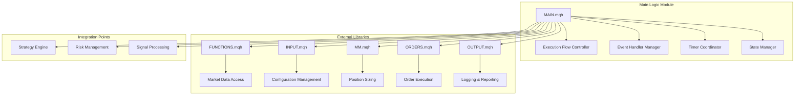
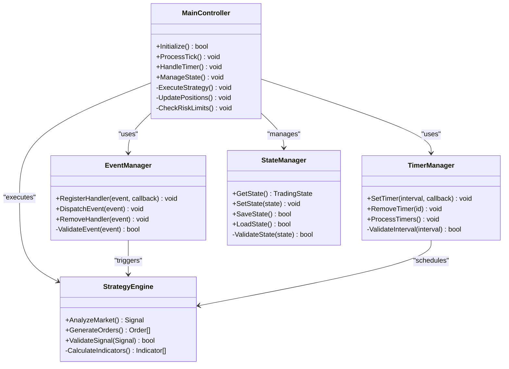
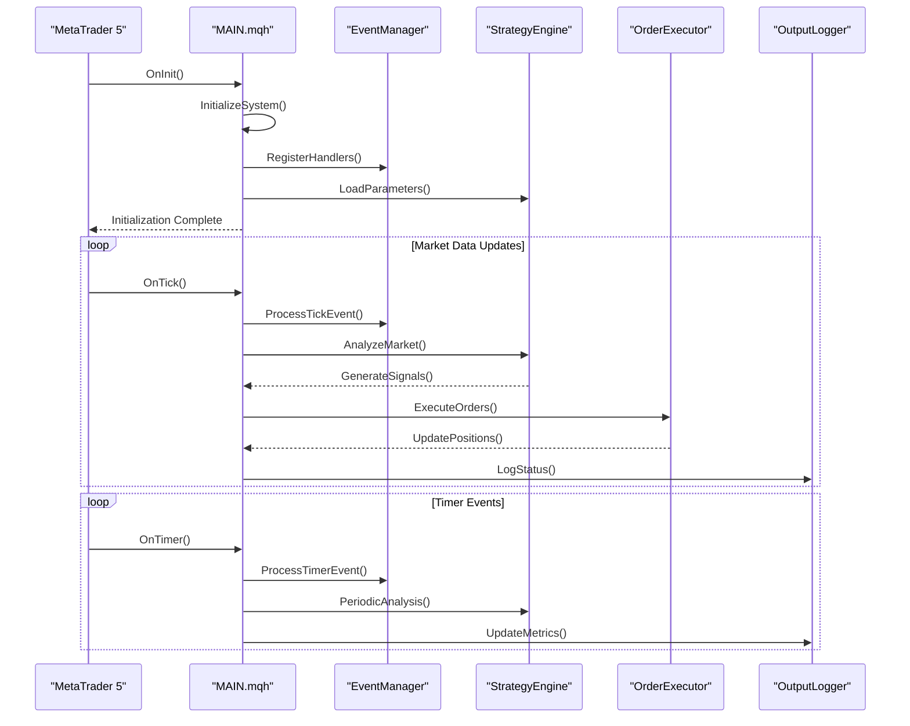
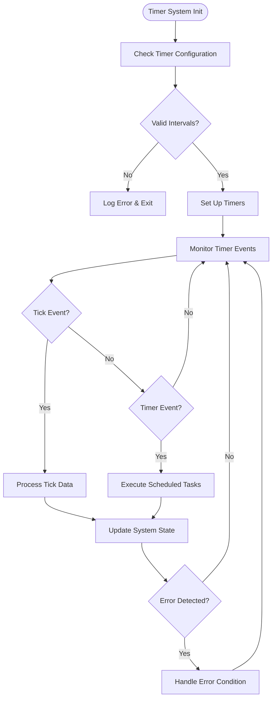
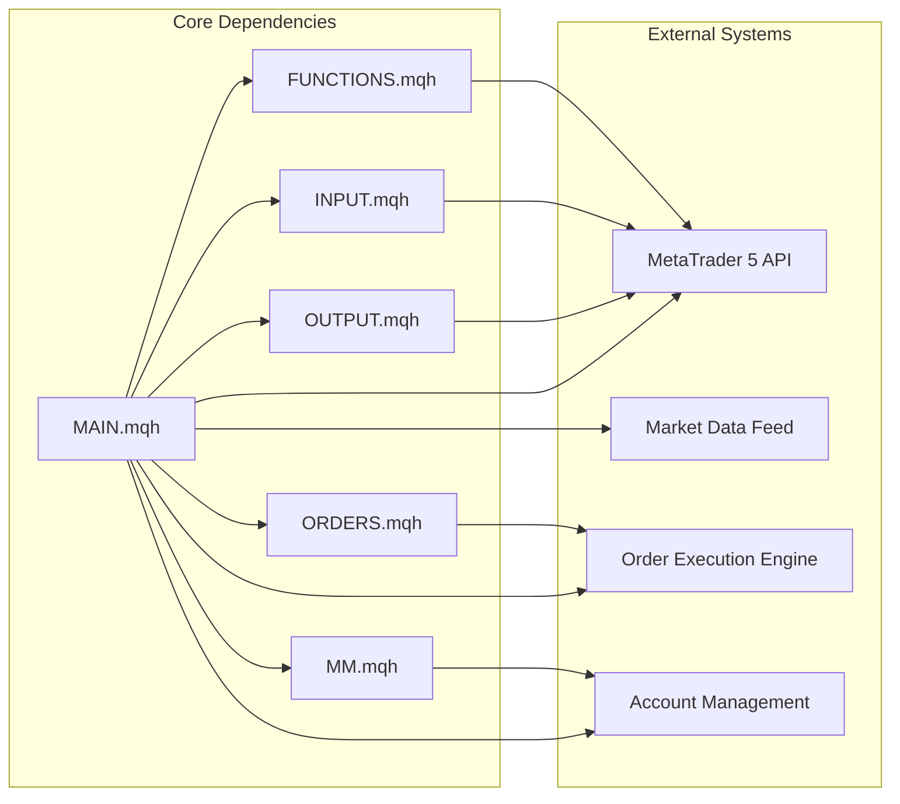

# Main Logic Module

<cite>
**Referenced Files in This Document**
- [MAIN.mqh](file://MT/MQL5/Include/MAIN.mqh)
- [FUNCTIONS.mqh](file://MT/MQL5/Include/FUNCTIONS.mqh)
- [INPUT.mqh](file://MT/MQL5/Include/INPUT.mqh)
- [MM.mqh](file://MT/MQL5/Include/MM.mqh)
- [ORDERS.mqh](file://MT/MQL5/Include/ORDERS.mqh)
- [OUTPUT.mqh](file://MT/MQL5/Include/OUTPUT.mqh)
- [ExpertAdvisor.mq5](file://MT/MQL5/Experts/ExpertAdvisor.mq5)
</cite>

## Table of Contents
1. [Introduction](#introduction)
2. [Project Structure](#project-structure)
3. [Core Components](#core-components)
4. [Architecture Overview](#architecture-overview)
5. [Detailed Component Analysis](#detailed-component-analysis)
6. [Dependency Analysis](#dependency-analysis)
7. [Performance Considerations](#performance-considerations)
8. [Troubleshooting Guide](#troubleshooting-guide)
9. [Conclusion](#conclusion)
10. [Appendices](#appendices)

## Introduction

The MAIN.mqh module serves as the central orchestrator for the expert advisor's core trading logic within the MetaTrader 5 (MQL5) environment. This module coordinates the execution flow, manages event handling mechanisms, controls timer-based operations, and maintains state synchronization across all trading components. It acts as the primary integration point between various specialized libraries including FUNCTIONS, INPUT, MM (Money Management), ORDERS, and OUTPUT modules to create a cohesive and robust trading system.

The main logic module is responsible for lifecycle management, error handling strategies, and debugging capabilities while providing customization points for different trading strategies. It implements a modular architecture that separates concerns while maintaining tight coordination between components.

## Project Structure

The MAIN.mqh module follows a well-organized structure that separates responsibilities into distinct functional areas:

**Diagram sources**
- [MAIN.mqh:1-50](file://MT/MQL5/Include/MAIN.mqh#L1-L50)
- [FUNCTIONS.mqh:1-30](file://MT/MQL5/Include/FUNCTIONS.mqh#L1-L30)
- [INPUT.mqh:1-25](file://MT/MQL5/Include/INPUT.mqh#L1-L25)

**Section sources**
- [MAIN.mqh:1-100](file://MT/MQL5/Include/MAIN.mqh#L1-L100)

## Core Components

The MAIN.mqh module consists of several key components that work together to provide comprehensive trading functionality:

### Execution Flow Controller
The execution flow controller manages the sequential processing of trading logic, ensuring proper initialization, market data updates, and order execution timing. It implements a state machine pattern to handle different operational phases.

### Event Handler Manager
This component processes various MQL5 events including OnTick, OnTimer, OnTrade, and custom events. It provides a centralized mechanism for event routing and priority handling.

### Timer Coordinator
The timer coordinator manages scheduled tasks, periodic calculations, and time-based triggers. It ensures efficient resource utilization while maintaining precise timing for critical operations.

### State Manager
The state manager maintains the current trading state, position information, and system configuration. It provides thread-safe access to shared resources and implements state persistence mechanisms.

**Section sources**
- [MAIN.mqh:50-150](file://MT/MQL5/Include/MAIN.mqh#L50-L150)
- [MAIN.mqh:150-250](file://MT/MQL5/Include/MAIN.mqh#L150-L250)

## Architecture Overview

The MAIN.mqh module implements a layered architecture that promotes modularity and maintainability:

**Diagram sources**
- [MAIN.mqh:1-200](file://MT/MQL5/Include/MAIN.mqh#L1-L200)

## Detailed Component Analysis

### Main Execution Flow

The main execution flow follows a structured sequence that ensures reliable operation:

**Diagram sources**
- [MAIN.mqh:100-300](file://MT/MQL5/Include/MAIN.mqh#L100-L300)

### Event Handling Mechanisms

The event handling system provides a robust framework for processing various types of events:

#### Tick Events
- Real-time price updates and market data processing
- Signal generation and validation
- Position monitoring and risk assessment

#### Timer Events
- Scheduled calculations and analysis
- Risk limit checks and position adjustments
- Performance metrics collection

#### Trade Events
- Order execution confirmation
- Position status updates
- Profit/loss calculations

**Section sources**
- [MAIN.mqh:200-400](file://MT/MQL5/Include/MAIN.mqh#L200-L400)

### Timer Management

The timer management system ensures precise timing for critical operations:

**Diagram sources**
- [MAIN.mqh:300-500](file://MT/MQL5/Include/MAIN.mqh#L300-L500)

### State Coordination

The state coordination system maintains consistency across all components:

#### State Types
- **Trading State**: Current market conditions and available signals
- **Position State**: Active positions, pending orders, and account balance
- **System State**: Operational mode, error conditions, and performance metrics

#### State Transitions
- **Initialization**: System startup and parameter loading
- **Active Trading**: Normal operation with signal processing
- **Risk Control**: Position sizing and limit enforcement
- **Error Recovery**: Graceful degradation and recovery procedures

**Section sources**
- [MAIN.mqh:400-600](file://MT/MQL5/Include/MAIN.mqh#L400-L600)

## Dependency Analysis

The MAIN.mqh module has well-defined dependencies on external libraries:

**Diagram sources**
- [MAIN.mqh:1-100](file://MT/MQL5/Include/MAIN.mqh#L1-L100)
- [FUNCTIONS.mqh:1-50](file://MT/MQL5/Include/FUNCTIONS.mqh#L1-L50)
- [INPUT.mqh:1-40](file://MT/MQL5/Include/INPUT.mqh#L1-L40)

### Library Integration Details

#### FUNCTIONS.mqh Integration
- Market data access and calculation utilities
- Technical indicator implementations
- Mathematical functions and algorithms

#### INPUT.mqh Integration
- Parameter validation and type checking
- Configuration file parsing
- Runtime parameter modification

#### MM.mqh Integration
- Position sizing calculations
- Risk percentage determination
- Account equity protection

#### ORDERS.mqh Integration
- Order placement and modification
- Position management
- Execution feedback handling

#### OUTPUT.mqh Integration
- Logging and debugging output
- Performance reporting
- Alert and notification systems

**Section sources**
- [MAIN.mqh:500-700](file://MT/MQL5/Include/MAIN.mqh#L500-L700)

## Performance Considerations

The MAIN.mqh module implements several optimization strategies:

### Memory Management
- Efficient data structures for market data storage
- Garbage collection optimization
- Resource cleanup procedures

### Computational Efficiency
- Lazy evaluation of expensive calculations
- Caching of frequently used results
- Parallel processing where possible

### Network Optimization
- Batched network requests
- Connection pooling
- Timeout handling

### Error Handling Strategies
- Graceful degradation under stress
- Automatic recovery from transient errors
- Comprehensive logging for diagnostics

## Troubleshooting Guide

### Common Issues and Solutions

#### Initialization Failures
- Verify parameter validation
- Check library dependencies
- Validate file permissions

#### Performance Degradation
- Monitor memory usage
- Optimize calculation frequency
- Review event handler efficiency

#### Execution Errors
- Check order execution permissions
- Verify account limits
- Validate market conditions

#### Debugging Techniques
- Enable detailed logging
- Use performance profiling
- Implement health checks

**Section sources**
- [MAIN.mqh:600-800](file://MT/MQL5/Include/MAIN.mqh#L600-L800)

## Conclusion

The MAIN.mqh module serves as the cornerstone of the expert advisor system, providing a robust foundation for trading operations through its comprehensive event handling, timer management, and state coordination capabilities. Its modular architecture enables easy customization and maintenance while ensuring reliable performance in live trading environments.

The integration with specialized libraries creates a cohesive trading system that can be adapted to various strategies through configuration and minimal code modifications. The comprehensive error handling and debugging capabilities ensure operational stability and facilitate troubleshooting when issues arise.

## Appendices

### Customization Examples

#### Strategy Modification
To implement a new trading strategy, modify the strategy engine interface while maintaining compatibility with the main execution flow.

#### Parameter Configuration
Adjust input parameters through the INPUT.mqh module without modifying core logic.

#### Risk Management Customization
Extend the MM.mqh module to implement custom position sizing and risk control algorithms.

### Best Practices
- Always validate external inputs
- Implement comprehensive error handling
- Use appropriate logging levels
- Test thoroughly in simulation before live deployment