# Money Management System

<cite>
**Referenced Files in This Document**
- [MM.mqh](file://MT/MQL5/Include/MM.mqh)
- [MoneyManager.mqh](file://MT/MQL5/Include/MoneyManager.mqh)
- [RiskManager.mqh](file://MT/MQL5/Include/RiskManager.mqh)
- [PositionSizer.mqh](file://MT/MQL5/Include/PositionSizer.mqh)
- [AccountMonitor.mqh](file://MT/MQL5/Include/AccountMonitor.mqh)
- [DrawdownProtection.mqh](file://MT/MQL5/Include/DrawdownProtection.mqh)
- [KellyCriterion.mqh](file://MT/MQL5/Include/KellyCriterion.mqh)
- [DynamicAdjuster.mqh](file://MT/MQL5/Include/DynamicAdjuster.mqh)
- [main_expert.mq5](file://MT/MQL5/Experts/main_expert.mq5)
- [config.mqh](file://MT/MQL5/Include/config.mqh)
</cite>

## Table of Contents
1. [Introduction](#introduction)
2. [Project Structure](#project-structure)
3. [Core Components](#core-components)
4. [Architecture Overview](#architecture-overview)
5. [Detailed Component Analysis](#detailed-component-analysis)
6. [Dependency Analysis](#dependency-analysis)
7. [Performance Considerations](#performance-considerations)
8. [Troubleshooting Guide](#troubleshooting-guide)
9. [Conclusion](#conclusion)
10. [Appendices](#appendices)

## Introduction
This document explains the money management system implemented in MM.mqh and related modules. It covers position sizing algorithms, risk calculation methods, account balance monitoring, and drawdown protection mechanisms. It also documents various strategies such as fixed lot size, percentage-based sizing, Kelly criterion implementation, and dynamic position adjustment, along with risk parameters, margin requirements, leverage considerations, and configuration examples.

## Project Structure
The money management subsystem is organized into focused components:
- MM.mqh: Central orchestrator for money management logic and strategy selection
- MoneyManager.mqh: High-level API to compute order lots and validate risk constraints
- RiskManager.mqh: Core risk calculations (per-trade risk, portfolio risk, margin checks)
- PositionSizer.mqh: Sizing algorithms (fixed, percent equity, volatility-adjusted, Kelly)
- AccountMonitor.mqh: Balance/equity tracking, drawdown metrics, state flags
- DrawdownProtection.mqh: Circuit breakers and adaptive scaling based on drawdown
- KellyCriterion.mqh: Statistical estimation and sizing using Kelly formula
- DynamicAdjuster.mqh: Real-time adjustments based on performance and market conditions
- main_expert.mq5: Integration point where signals trigger sizing and execution
- config.mqh: Global parameters and runtime switches for money management

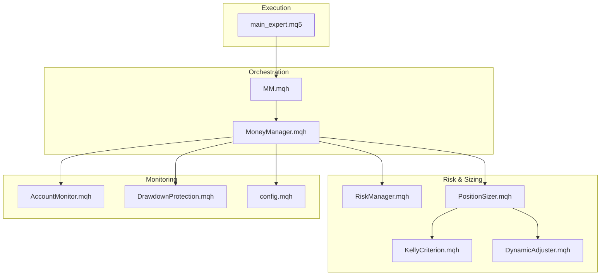

**Diagram sources**
- [MM.mqh](file://MT/MQL5/Include/MM.mqh)
- [MoneyManager.mqh](file://MT/MQL5/Include/MoneyManager.mqh)
- [RiskManager.mqh](file://MT/MQL5/Include/RiskManager.mqh)
- [PositionSizer.mqh](file://MT/MQL5/Include/PositionSizer.mqh)
- [KellyCriterion.mqh](file://MT/MQL5/Include/KellyCriterion.mqh)
- [DynamicAdjuster.mqh](file://MT/MQL5/Include/DynamicAdjuster.mqh)
- [AccountMonitor.mqh](file://MT/MQL5/Include/AccountMonitor.mqh)
- [DrawdownProtection.mqh](file://MT/MQL5/Include/DrawdownProtection.mqh)
- [main_expert.mq5](file://MT/MQL5/Experts/main_expert.mq5)
- [config.mqh](file://MT/MQL5/Include/config.mqh)

**Section sources**
- [MM.mqh](file://MT/MQL5/Include/MM.mqh)
- [MoneyManager.mqh](file://MT/MQL5/Include/MoneyManager.mqh)
- [RiskManager.mqh](file://MT/MQL5/Include/RiskManager.mqh)
- [PositionSizer.mqh](file://MT/MQL5/Include/PositionSizer.mqh)
- [KellyCriterion.mqh](file://MT/MQL5/Include/KellyCriterion.mqh)
- [DynamicAdjuster.mqh](file://MT/MQL5/Include/DynamicAdjuster.mqh)
- [AccountMonitor.mqh](file://MT/MQL5/Include/AccountMonitor.mqh)
- [DrawdownProtection.mqh](file://MT/MQL5/Include/DrawdownProtection.mqh)
- [main_expert.mq5](file://MT/MQL5/Experts/main_expert.mq5)
- [config.mqh](file://MT/MQL5/Include/config.mqh)

## Core Components
- MM.mqh: Strategy selector and lifecycle manager; exposes functions to compute lots, enforce risk limits, and toggle modes (e.g., pause on drawdown).
- MoneyManager.mqh: Aggregates inputs (balance, equity, stops, volatility, leverage) and returns validated lot sizes; enforces minimum/maximum lot constraints and margin availability.
- RiskManager.mqh: Calculates per-trade risk (in currency), portfolio exposure, margin utilization, and stop-out proximity; provides safe thresholds and warnings.
- PositionSizer.mqh: Implements sizing engines:
  - FixedLot: Constant lot size regardless of account state
  - PercentEquity: Risk a fixed percentage of equity per trade
  - VolatilityAdjusted: Scale by ATR or similar volatility metric
  - Kelly: Fractional Kelly based on historical win rate and payoff ratio
- AccountMonitor.mqh: Tracks balance/equity curves, peak equity, current drawdown, daily PnL, and triggers alerts or mode changes.
- DrawdownProtection.mqh: Enforces hard stops (stop trading after N% drawdown), soft reductions (scale down sizing), and recovery gates (resume when metrics improve).
- KellyCriterion.mqh: Estimates optimal fraction from rolling statistics; includes smoothing and caps to avoid overfitting.
- DynamicAdjuster.mqh: Modifies sizing based on recent performance, correlation, slippage, and spread; supports time-of-day and regime filters.
- main_expert.mq5: Orchestrates signal processing, calls money management APIs, and submits orders with computed lots.
- config.mqh: Centralizes parameters like max risk per trade, max open positions, drawdown thresholds, Kelly cap, volatility lookback, and safety margins.

**Section sources**
- [MM.mqh](file://MT/MQL5/Include/MM.mqh)
- [MoneyManager.mqh](file://MT/MQL5/Include/MoneyManager.mqh)
- [RiskManager.mqh](file://MT/MQL5/Include/RiskManager.mqh)
- [PositionSizer.mqh](file://MT/MQL5/Include/PositionSizer.mqh)
- [AccountMonitor.mqh](file://MT/MQL5/Include/AccountMonitor.mqh)
- [DrawdownProtection.mqh](file://MT/MQL5/Include/DrawdownProtection.mqh)
- [KellyCriterion.mqh](file://MT/MQL5/Include/KellyCriterion.mqh)
- [DynamicAdjuster.mqh](file://MT/MQL5/Include/DynamicAdjuster.mqh)
- [main_expert.mq5](file://MT/MQL5/Experts/main_expert.mq5)
- [config.mqh](file://MT/MQL5/Include/config.mqh)

## Architecture Overview
The money management pipeline integrates signals with risk-aware sizing and protective controls:

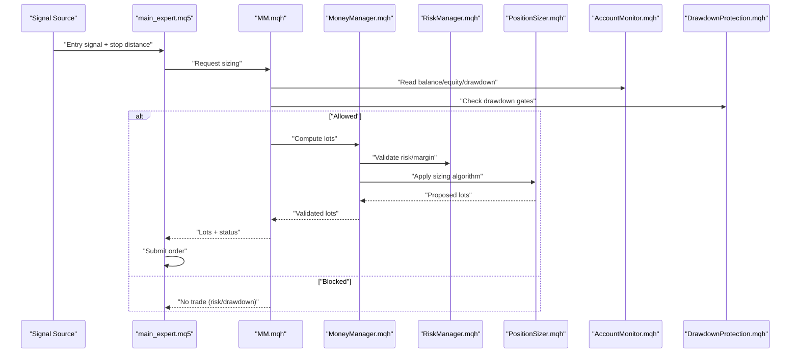

**Diagram sources**
- [main_expert.mq5](file://MT/MQL5/Experts/main_expert.mq5)
- [MM.mqh](file://MT/MQL5/Include/MM.mqh)
- [MoneyManager.mqh](file://MT/MQL5/Include/MoneyManager.mqh)
- [RiskManager.mqh](file://MT/MQL5/Include/RiskManager.mqh)
- [PositionSizer.mqh](file://MT/MQL5/Include/PositionSizer.mqh)
- [AccountMonitor.mqh](file://MT/MQL5/Include/AccountMonitor.mqh)
- [DrawdownProtection.mqh](file://MT/MQL5/Include/DrawdownProtection.mqh)

## Detailed Component Analysis

### MM.mqh — Orchestration and Strategy Selection
Responsibilities:
- Selects sizing strategy based on config and runtime state
- Coordinates risk checks, drawdown gates, and dynamic adjustments
- Exposes high-level functions for lot computation and trade gating

Key behaviors:
- Mode switching between conservative/aggressive sizing under stress
- Aggregation of multiple risk signals before allowing trades
- Logging and telemetry hooks for auditability

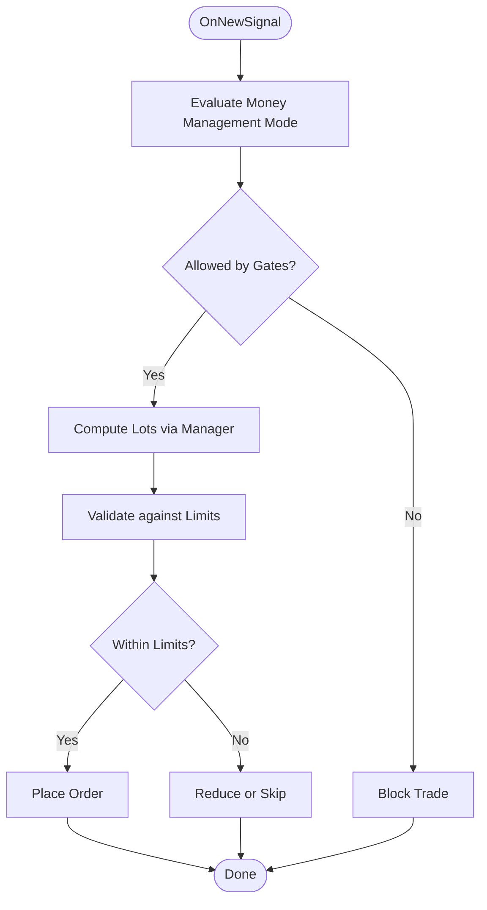

**Diagram sources**
- [MM.mqh](file://MT/MQL5/Include/MM.mqh)
- [MoneyManager.mqh](file://MT/MQL5/Include/MoneyManager.mqh)
- [DrawdownProtection.mqh](file://MT/MQL5/Include/DrawdownProtection.mqh)

**Section sources**
- [MM.mqh](file://MT/MQL5/Include/MM.mqh)

### MoneyManager.mqh — Lot Calculation and Validation
Responsibilities:
- Accepts inputs: symbol info, stop distance, volatility, leverage, account state
- Computes candidate lots from sizing engine
- Applies broker constraints (min/max lot, step), margin checks, and risk caps
- Returns final lots and reason codes for transparency

Risk and margin considerations:
- Ensures required margin ≤ free margin × safety factor
- Caps total exposure across open positions
- Adjusts for tick value and contract specifications

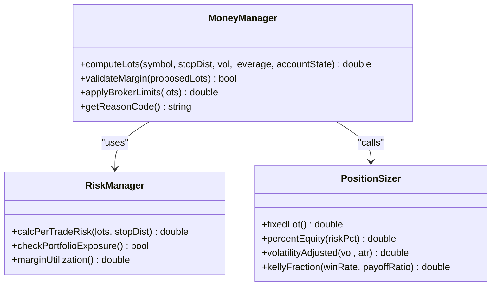

**Diagram sources**
- [MoneyManager.mqh](file://MT/MQL5/Include/MoneyManager.mqh)
- [RiskManager.mqh](file://MT/MQL5/Include/RiskManager.mqh)
- [PositionSizer.mqh](file://MT/MQL5/Include/PositionSizer.mqh)

**Section sources**
- [MoneyManager.mqh](file://MT/MQL5/Include/MoneyManager.mqh)
- [RiskManager.mqh](file://MT/MQL5/Include/RiskManager.mqh)
- [PositionSizer.mqh](file://MT/MQL5/Include/PositionSizer.mqh)

### PositionSizer.mqh — Sizing Algorithms
Algorithms:
- FixedLot: Returns constant lots; simple but ignores account growth/decline
- PercentEquity: Allocates a fixed % of equity as risk per trade; scales with account size
- VolatilityAdjusted: Uses ATR or realized volatility to normalize risk across instruments/timeframes
- Kelly: Computes fractional Kelly from rolling win rate and average payoff ratio; includes smoothing and caps

Complexity and stability:
- Rolling windows for Kelly estimates mitigate noise
- Fractional Kelly (e.g., half-Kelly) reduces variance and drawdowns
- Volatility scaling prevents oversized positions in high-vol regimes

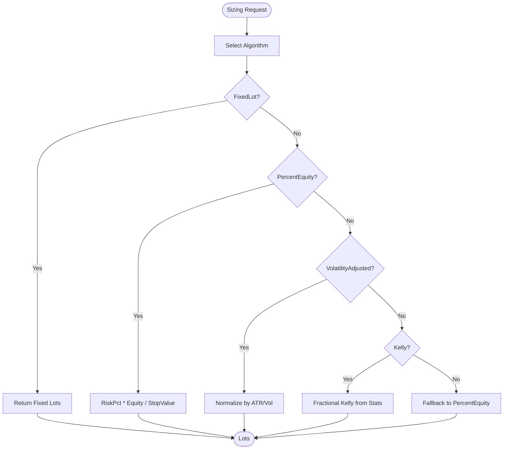

**Diagram sources**
- [PositionSizer.mqh](file://MT/MQL5/Include/PositionSizer.mqh)
- [KellyCriterion.mqh](file://MT/MQL5/Include/KellyCriterion.mqh)

**Section sources**
- [PositionSizer.mqh](file://MT/MQL5/Include/PositionSizer.mqh)
- [KellyCriterion.mqh](file://MT/MQL5/Include/KellyCriterion.mqh)

### KellyCriterion.mqh — Statistical Estimation and Sizing
Responsibilities:
- Maintains rolling win rate and payoff ratio
- Applies smoothing (e.g., exponential moving averages) to reduce jitter
- Caps Kelly fraction to prevent overbetting
- Provides diagnostics (sample size, confidence)

Usage:
- Typically combined with a fractional multiplier (e.g., 0.5) for robustness
- Can be gated by minimum sample size and quality filters

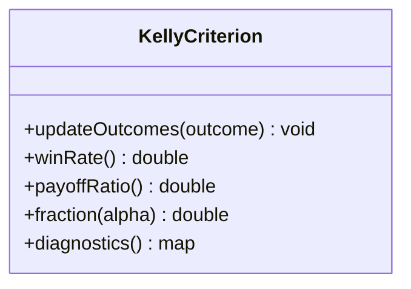

**Diagram sources**
- [KellyCriterion.mqh](file://MT/MQL5/Include/KellyCriterion.mqh)

**Section sources**
- [KellyCriterion.mqh](file://MT/MQL5/Include/KellyCriterion.mqh)

### DynamicAdjuster.mqh — Real-Time Adjustments
Responsibilities:
- Monitors recent PnL, slippage, spread widening, and correlation spikes
- Reduces sizing during adverse regimes or poor execution quality
- Supports time-of-day filters and volatility regime detection

Behavior:
- Multipliers applied to base lots (e.g., 0.5x in stressed markets)
- Recovery logic increases exposure gradually as conditions improve

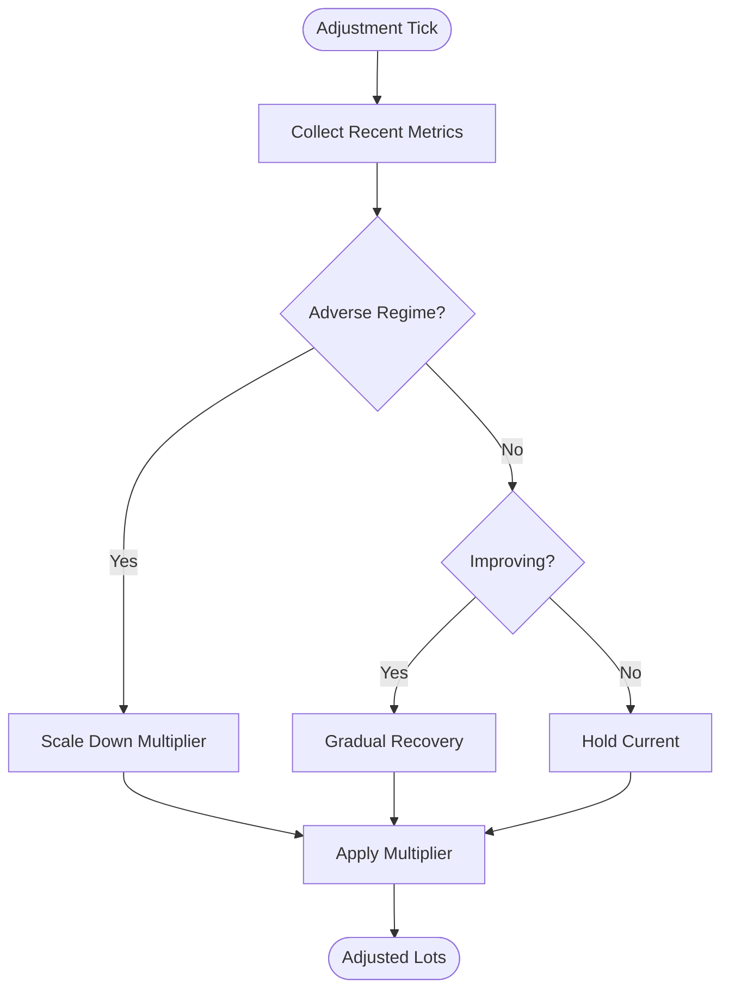

**Diagram sources**
- [DynamicAdjuster.mqh](file://MT/MQL5/Include/DynamicAdjuster.mqh)

**Section sources**
- [DynamicAdjuster.mqh](file://MT/MQL5/Include/DynamicAdjuster.mqh)

### AccountMonitor.mqh — Balance and Drawdown Tracking
Responsibilities:
- Tracks balance, equity, peak equity, and current drawdown
- Computes daily PnL and cumulative metrics
- Emits flags for drawdown thresholds and circuit breakers

Metrics:
- Max drawdown %, current drawdown %, daily loss limit
- Alerts and state transitions for risk managers

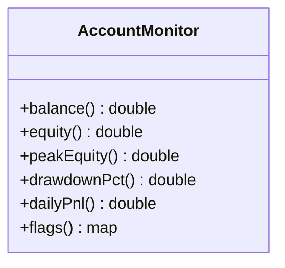

**Diagram sources**
- [AccountMonitor.mqh](file://MT/MQL5/Include/AccountMonitor.mqh)

**Section sources**
- [AccountMonitor.mqh](file://MT/MQL5/Include/AccountMonitor.mqh)

### DrawdownProtection.mqh — Circuit Breakers and Scaling
Responsibilities:
- Enforces hard stop (no new trades) beyond threshold
- Implements soft scaling (reduce sizing) below hard stop
- Defines recovery criteria to resume normal operation

Parameters:
- Hard drawdown limit (%)
- Soft reduction level (%)
- Minimum profit target to recover

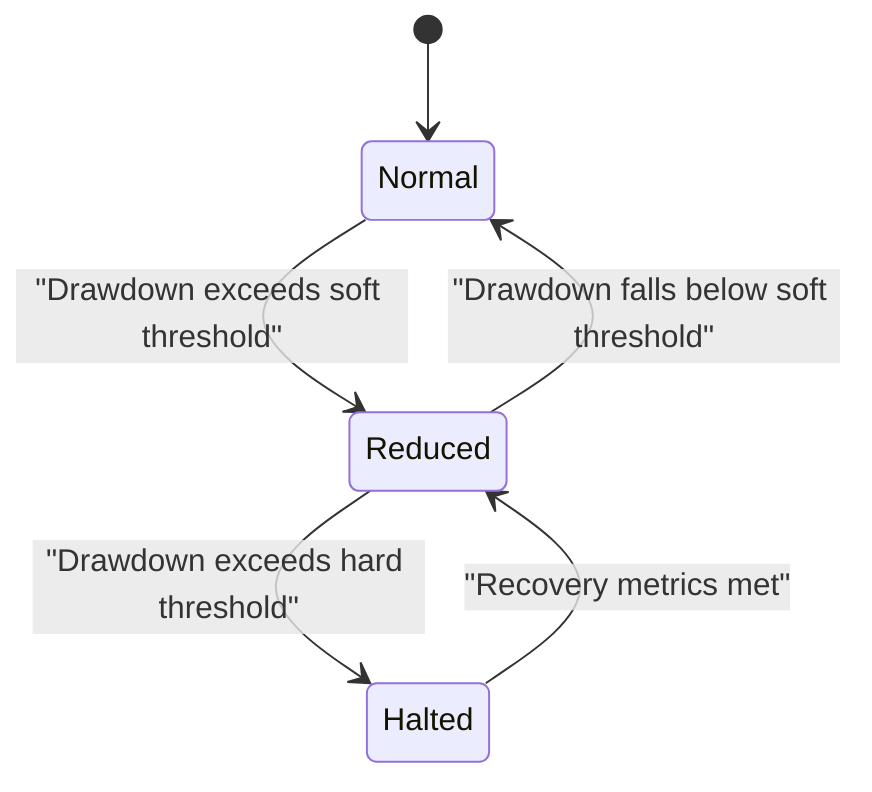

**Diagram sources**
- [DrawdownProtection.mqh](file://MT/MQL5/Include/DrawdownProtection.mqh)

**Section sources**
- [DrawdownProtection.mqh](file://MT/MQL5/Include/DrawdownProtection.mqh)

### main_expert.mq5 — Integration Point
Responsibilities:
- Receives entry signals and stop distances
- Calls MM.mqh to compute lots and check gates
- Submits orders with validated lots and logs outcomes

Flow:
- On signal: request sizing → validate → place order or skip
- On close: update performance stats for Kelly and dynamic adjuster

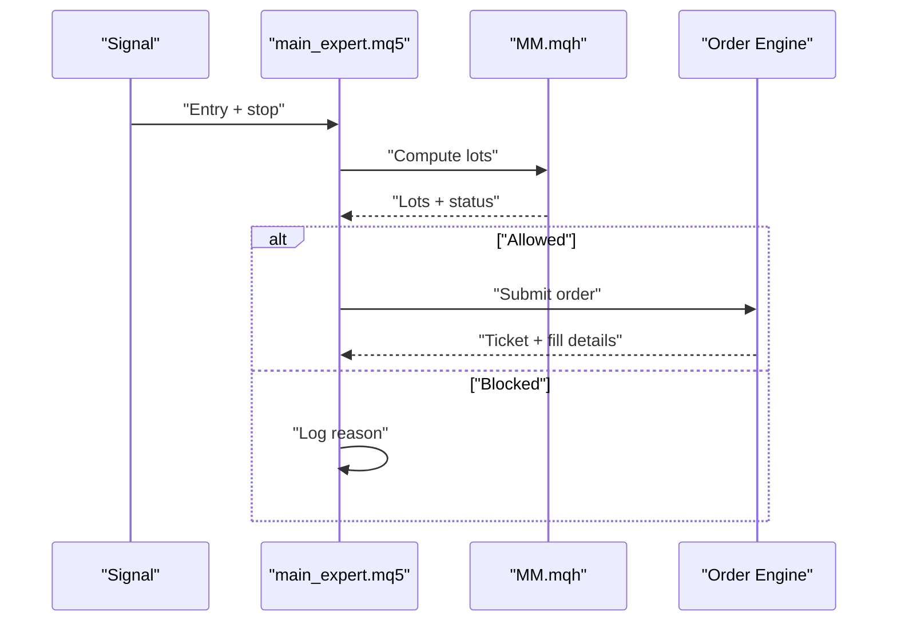

**Diagram sources**
- [main_expert.mq5](file://MT/MQL5/Experts/main_expert.mq5)
- [MM.mqh](file://MT/MQL5/Include/MM.mqh)

**Section sources**
- [main_expert.mq5](file://MT/MQL5/Experts/main_expert.mq5)

### config.mqh — Parameters and Switches
Key parameters:
- Max risk per trade (%)
- Max open positions
- Drawdown thresholds (soft/hard)
- Kelly fraction multiplier and smoothing window
- Volatility lookback and scaling factors
- Safety margins for margin checks and slippage

Scope:
- Global constants and runtime toggles
- Allows quick experimentation across strategies

**Section sources**
- [config.mqh](file://MT/MQL5/Include/config.mqh)

## Dependency Analysis
Component coupling and cohesion:
- MM.mqh depends on MoneyManager, AccountMonitor, and DrawdownProtection for orchestration
- MoneyManager composes RiskManager and PositionSizer for core logic
- PositionSizer optionally uses KellyCriterion and DynamicAdjuster for advanced sizing
- AccountMonitor and DrawdownProtection provide stateful risk context
- main_expert.mq5 integrates all components at execution time

Potential circular dependencies:
- None observed; clear layering from execution → orchestration → risk/sizing → monitoring

External integration points:
- Broker APIs for margin, tick values, and order submission
- Market data feeds for volatility and price updates

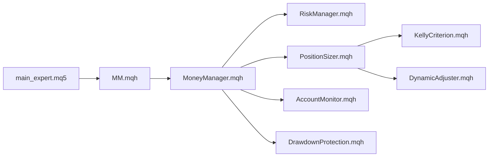

**Diagram sources**
- [main_expert.mq5](file://MT/MQL5/Experts/main_expert.mq5)
- [MM.mqh](file://MT/MQL5/Include/MM.mqh)
- [MoneyManager.mqh](file://MT/MQL5/Include/MoneyManager.mqh)
- [RiskManager.mqh](file://MT/MQL5/Include/RiskManager.mqh)
- [PositionSizer.mqh](file://MT/MQL5/Include/PositionSizer.mqh)
- [KellyCriterion.mqh](file://MT/MQL5/Include/KellyCriterion.mqh)
- [DynamicAdjuster.mqh](file://MT/MQL5/Include/DynamicAdjuster.mqh)
- [AccountMonitor.mqh](file://MT/MQL5/Include/AccountMonitor.mqh)
- [DrawdownProtection.mqh](file://MT/MQL5/Include/DrawdownProtection.mqh)

**Section sources**
- [MM.mqh](file://MT/MQL5/Include/MM.mqh)
- [MoneyManager.mqh](file://MT/MQL5/Include/MoneyManager.mqh)
- [RiskManager.mqh](file://MT/MQL5/Include/RiskManager.mqh)
- [PositionSizer.mqh](file://MT/MQL5/Include/PositionSizer.mqh)
- [KellyCriterion.mqh](file://MT/MQL5/Include/KellyCriterion.mqh)
- [DynamicAdjuster.mqh](file://MT/MQL5/Include/DynamicAdjuster.mqh)
- [AccountMonitor.mqh](file://MT/MQL5/Include/AccountMonitor.mqh)
- [DrawdownProtection.mqh](file://MT/MQL5/Include/DrawdownProtection.mqh)
- [main_expert.mq5](file://MT/MQL5/Experts/main_expert.mq5)

## Performance Considerations
- Avoid heavy computations on every tick; cache volatility and Kelly statistics with appropriate refresh intervals
- Use efficient rolling windows for Kelly estimates to minimize memory churn
- Batch margin checks and exposure calculations to reduce API calls
- Implement early exits in sizing logic when risk limits are clearly breached
- Monitor slippage and spread impacts; adjust sizing dynamically to maintain expected risk profiles

[No sources needed since this section provides general guidance]

## Troubleshooting Guide
Common issues and resolutions:
- Insufficient margin: Verify free margin vs required margin; increase safety factor or reduce lots
- Overexposure: Check portfolio exposure limits and reduce number of concurrent positions
- Drawdown halt: Review drawdown thresholds and recovery criteria; ensure metrics meet resumption conditions
- Kelly instability: Increase smoothing window and minimum sample size; apply fractional Kelly
- Volatility spikes: Ensure volatility-adjusted sizing scales down appropriately; confirm ATR lookback settings

Diagnostic tips:
- Log reason codes from MoneyManager for each rejected sizing attempt
- Track AccountMonitor flags and DrawdownProtection state transitions
- Compare proposed vs final lots to identify constraint violations

**Section sources**
- [MoneyManager.mqh](file://MT/MQL5/Include/MoneyManager.mqh)
- [AccountMonitor.mqh](file://MT/MQL5/Include/AccountMonitor.mqh)
- [DrawdownProtection.mqh](file://MT/MQL5/Include/DrawdownProtection.mqh)

## Conclusion
The money management system in MM.mqh provides a modular, risk-aware framework for position sizing and capital protection. By combining flexible sizing algorithms, robust risk calculations, and proactive drawdown controls, it adapts to changing market conditions while preserving capital. Proper configuration and monitoring are essential to achieve consistent performance across strategies.

[No sources needed since this section summarizes without analyzing specific files]

## Appendices

### Configuration Examples and Impact
- Fixed lot size: Simple and predictable; does not scale with account growth; suitable for controlled testing environments
- Percentage-based sizing: Scales with equity; balances risk and growth; recommended default for live trading
- Volatility-adjusted sizing: Normalizes risk across assets; improves consistency of risk-adjusted returns
- Kelly criterion: Potentially highest growth but requires careful fractionalization and smoothing; best used with strict risk caps

Impact considerations:
- Higher risk per trade increases variance and potential drawdowns
- Volatility scaling reduces whipsaw losses in turbulent markets
- Kelly-based sizing can amplify compounding but risks overbetting if not capped

[No sources needed since this section provides general guidance]