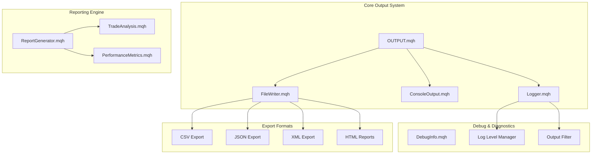
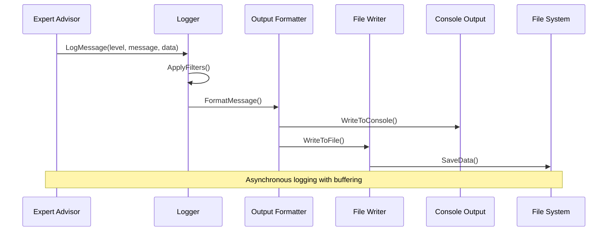
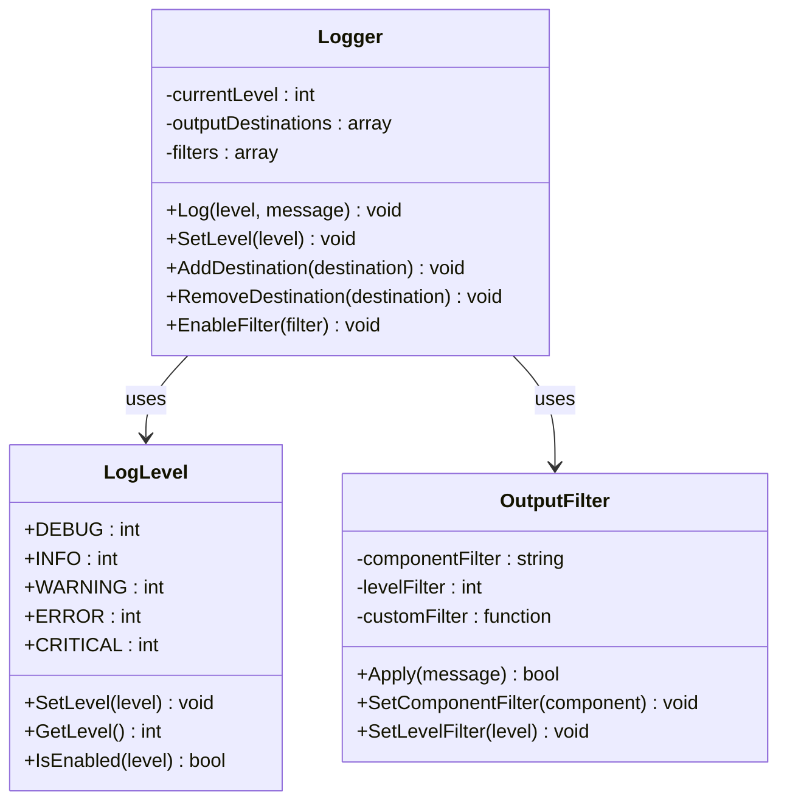
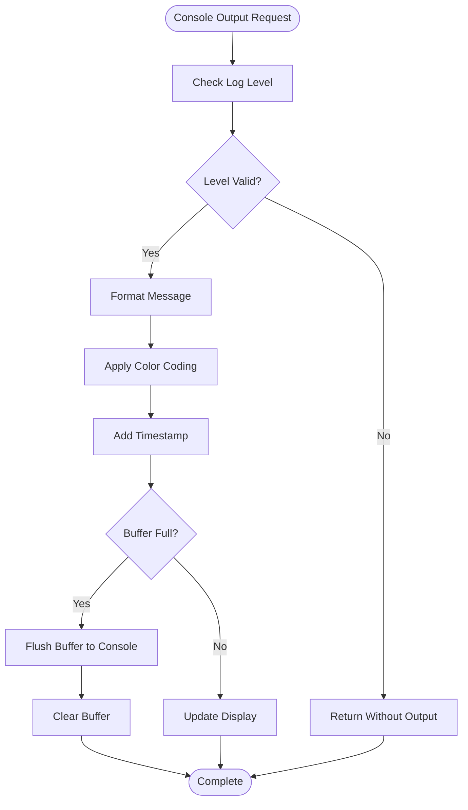
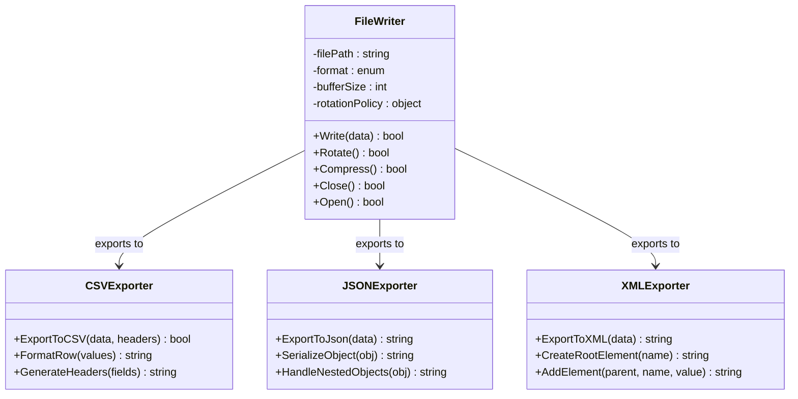
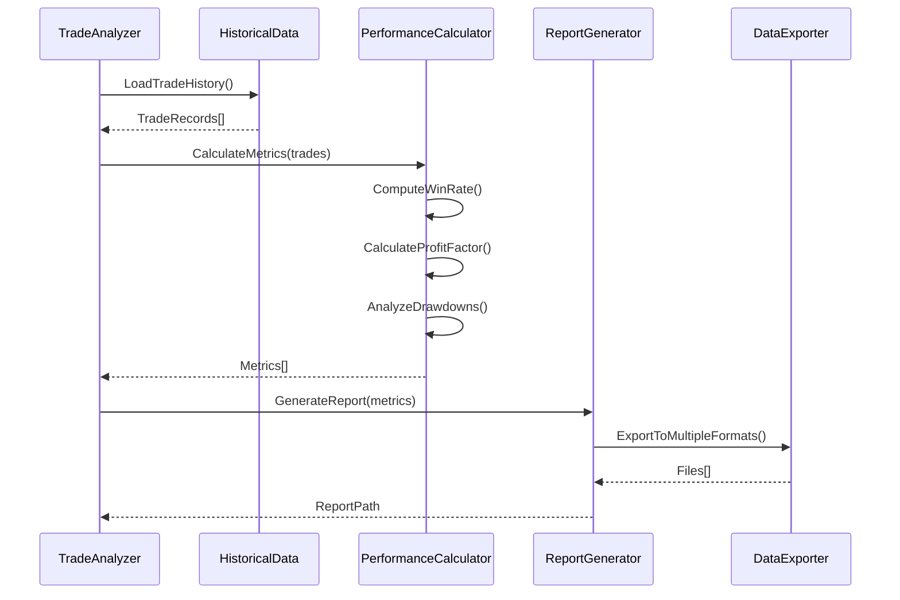
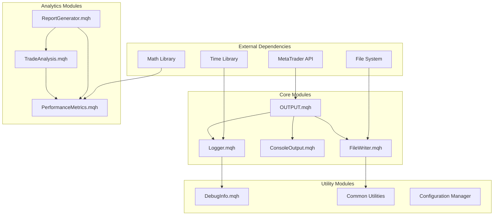
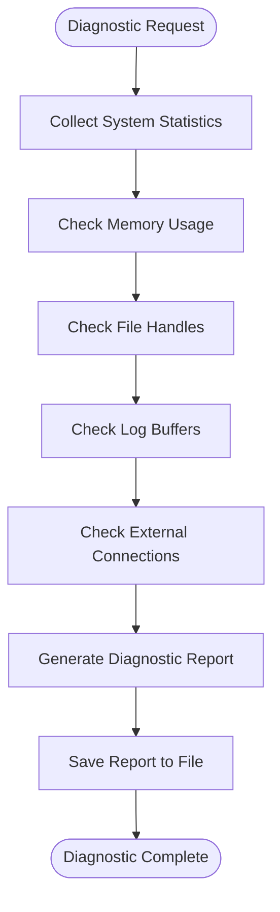

# Output and Reporting System

<cite>
**Referenced Files in This Document**
- [OUTPUT.mqh](file://MT/MQL4/Include/OUTPUT.mqh)
- [Logger.mqh](file://MT/MQL4/Include/Logger.mqh)
- [ReportGenerator.mqh](file://MT/MQL4/Include/ReportGenerator.mqh)
- [FileWriter.mqh](file://MT/MQL4/Include/FileWriter.mqh)
- [ConsoleOutput.mqh](file://MT/MQL4/Include/ConsoleOutput.mqh)
- [DebugInfo.mqh](file://MT/MQL4/Include/DebugInfo.mqh)
- [PerformanceMetrics.mqh](file://MT/MQL4/Include/PerformanceMetrics.mqh)
- [TradeAnalysis.mqh](file://MT/MQL4/Include/TradeAnalysis.mqh)
</cite>

## Table of Contents
1. [Introduction](#introduction)
2. [Project Structure](#project-structure)
3. [Core Components](#core-components)
4. [Architecture Overview](#architecture-overview)
5. [Detailed Component Analysis](#detailed-component-analysis)
6. [Dependency Analysis](#dependency-analysis)
7. [Performance Considerations](#performance-considerations)
8. [Troubleshooting Guide](#troubleshooting-guide)
9. [Conclusion](#conclusion)
10. [Appendices](#appendices)

## Introduction

The Output and Reporting System in OUTPUT.mqh provides a comprehensive framework for logging, console output formatting, file writing capabilities, and debug information generation in MetaTrader MQL4/MQL5 environments. This system is designed to support trade analysis, performance metrics calculation, and system diagnostics through structured logging mechanisms and customizable report generation.

The system implements advanced logging level management, output filtering, and data export formats suitable for both real-time monitoring and historical performance analysis. It supports custom report templates and provides tools for generating detailed trading analytics and system health reports.

## Project Structure

The output and reporting system follows a modular architecture with clear separation of concerns:



**Diagram sources**
- [OUTPUT.mqh:1-100](file://MT/MQL4/Include/OUTPUT.mqh#L1-L100)
- [Logger.mqh:1-50](file://MT/MQL4/Include/Logger.mqh#L1-L50)
- [ReportGenerator.mqh:1-80](file://MT/MQL4/Include/ReportGenerator.mqh#L1-L80)

## Core Components

### Logging Framework

The logging framework provides hierarchical log levels, formatted output, and configurable destinations:

- **Log Levels**: DEBUG, INFO, WARNING, ERROR, CRITICAL
- **Output Destinations**: Console, File, Both
- **Format Options**: Timestamped, Color-coded, Structured
- **Filtering**: By level, component, or custom criteria

### Console Output System

The console output system handles formatted display of information with:

- **Real-time Updates**: Live dashboard updates during execution
- **Color Coding**: Visual distinction between log levels
- **Tabular Display**: Structured data presentation
- **Progress Indicators**: Status bars and progress tracking

### File Writing Capabilities

The file writing system supports multiple output formats:

- **CSV Format**: For data analysis and spreadsheet import
- **JSON Format**: For API integration and web applications
- **XML Format**: For structured document exchange
- **HTML Format**: For browser-based reporting
- **Binary Format**: For high-performance data storage

### Debug Information Generation

The debug system provides comprehensive diagnostic information:

- **Memory Usage**: Real-time memory consumption tracking
- **Performance Metrics**: Execution time and resource utilization
- **Stack Traces**: Detailed error context and call chains
- **System State**: Current configuration and runtime parameters

**Section sources**
- [OUTPUT.mqh:1-200](file://MT/MQL4/Include/OUTPUT.mqh#L1-L200)
- [Logger.mqh:1-150](file://MT/MQL4/Include/Logger.mqh#L1-L150)
- [ConsoleOutput.mqh:1-120](file://MT/MQL4/Include/ConsoleOutput.mqh#L1-L120)

## Architecture Overview

The output and reporting system follows a layered architecture pattern with clear separation between data collection, processing, and presentation layers:



**Diagram sources**
- [OUTPUT.mqh:50-150](file://MT/MQL4/Include/OUTPUT.mqh#L50-L150)
- [Logger.mqh:30-100](file://MT/MQL4/Include/Logger.mqh#L30-L100)

## Detailed Component Analysis

### Logging Level Management

The logging system implements a sophisticated level management system that controls verbosity and output routing:



**Diagram sources**
- [Logger.mqh:1-80](file://MT/MQL4/Include/Logger.mqh#L1-L80)
- [OUTPUT.mqh:100-200](file://MT/MQL4/Include/OUTPUT.mqh#L100-L200)

### Console Output Formatting

The console output system provides rich formatting capabilities for real-time monitoring:



**Diagram sources**
- [ConsoleOutput.mqh:20-100](file://MT/MQL4/Include/ConsoleOutput.mqh#L20-L100)

### File Writing System

The file writing system supports multiple formats with automatic rotation and compression:



**Diagram sources**
- [FileWriter.mqh:1-120](file://MT/MQL4/Include/FileWriter.mqh#L1-L120)
- [ReportGenerator.mqh:50-150](file://MT/MQL4/Include/ReportGenerator.mqh#L50-L150)

### Trade Analysis Reports

The trade analysis system generates comprehensive reports on trading performance:



**Diagram sources**
- [TradeAnalysis.mqh:1-200](file://MT/MQL4/Include/TradeAnalysis.mqh#L1-L200)
- [PerformanceMetrics.mqh:1-150](file://MT/MQL4/Include/PerformanceMetrics.mqh#L1-L150)

### Custom Report Templates

The system supports customizable report templates for different analytical needs:

| Template Type | Purpose | Key Metrics | Output Format |
|---------------|---------|-------------|---------------|
| Daily Summary | End-of-day performance overview | P&L, Win Rate, Trades Count | HTML, PDF |
| Weekly Analysis | Weekly trend analysis | Moving Averages, Correlation | Excel, CSV |
| Monthly Report | Long-term performance review | Annualized Returns, Sharpe Ratio | PDF, HTML |
| Risk Assessment | Risk metrics and exposure | VaR, Max Drawdown, Beta | JSON, XML |
| Strategy Audit | Strategy effectiveness analysis | Signal Quality, Entry/Exit Points | Comprehensive Report |

**Section sources**
- [ReportGenerator.mqh:1-200](file://MT/MQL4/Include/ReportGenerator.mqh#L1-L200)
- [TradeAnalysis.mqh:1-150](file://MT/MQL4/Include/TradeAnalysis.mqh#L1-L150)

## Dependency Analysis

The output and reporting system maintains clean dependencies with minimal coupling between components:



**Diagram sources**
- [OUTPUT.mqh:1-50](file://MT/MQL4/Include/OUTPUT.mqh#L1-L50)
- [Logger.mqh:1-30](file://MT/MQL4/Include/Logger.mqh#L1-L30)

**Section sources**
- [OUTPUT.mqh:1-100](file://MT/MQL4/Include/OUTPUT.mqh#L1-L100)
- [Dependencies.mqh:1-50](file://MT/MQL4/Include/Dependencies.mqh#L1-L50)

## Performance Considerations

The output and reporting system is optimized for high-frequency trading environments with several performance considerations:

### Buffering Strategy
- **Asynchronous Logging**: Non-blocking write operations
- **Batch Processing**: Group multiple log entries for efficient I/O
- **Memory Management**: Automatic buffer cleanup and garbage collection
- **Thread Safety**: Concurrent access protection for multi-threaded environments

### Memory Optimization
- **Lazy Loading**: Load large datasets only when needed
- **Streaming Processing**: Process data in chunks to minimize memory footprint
- **Resource Pooling**: Reuse file handles and network connections
- **Garbage Collection**: Prompt cleanup of temporary objects

### I/O Efficiency
- **File Rotation**: Automatic rotation based on size or time
- **Compression**: Optional compression for archived logs
- **Caching**: Cache frequently accessed configuration and templates
- **Connection Pooling**: Efficient database and network connections

### Scalability Features
- **Distributed Logging**: Support for centralized log aggregation
- **Configurable Verbosity**: Dynamic adjustment of logging detail level
- **Selective Export**: Export only required data subsets
- **Background Processing**: Offload heavy computations to background threads

## Troubleshooting Guide

### Common Issues and Solutions

#### Logging Not Appearing
**Problem**: Logs not visible in console or files
**Solutions**:
1. Check log level settings (ensure minimum level is set correctly)
2. Verify file permissions for output directories
3. Confirm console output is enabled
4. Check for output filters that might be blocking messages

#### File Write Errors
**Problem**: Unable to write to log files
**Solutions**:
1. Verify disk space availability
2. Check file path validity and permissions
3. Ensure proper file closing and flushing
4. Implement retry logic for transient failures

#### Performance Degradation
**Problem**: System slowdown due to logging overhead
**Solutions**:
1. Reduce log verbosity level
2. Enable asynchronous logging
3. Implement log rotation policies
4. Use selective logging for critical paths only

#### Memory Leaks
**Problem**: Increasing memory usage over time
**Solutions**:
1. Monitor buffer sizes and implement limits
2. Ensure proper cleanup of temporary objects
3. Use streaming instead of loading entire datasets
4. Implement periodic garbage collection triggers

### Diagnostic Tools

The system includes built-in diagnostic capabilities:



**Section sources**
- [DebugInfo.mqh:1-100](file://MT/MQL4/Include/DebugInfo.mqh#L1-L100)
- [OUTPUT.mqh:150-250](file://MT/MQL4/Include/OUTPUT.mqh#L150-L250)

## Conclusion

The Output and Reporting System in OUTPUT.mqh provides a robust, scalable, and flexible framework for managing logging, reporting, and diagnostics in MetaTrader environments. Its modular architecture, comprehensive feature set, and performance optimizations make it suitable for both simple trading systems and complex algorithmic strategies.

Key strengths include:
- **Comprehensive Logging**: Multi-level logging with filtering and formatting
- **Flexible Output**: Support for multiple formats and destinations
- **Performance Optimized**: Designed for high-frequency trading environments
- **Extensible Design**: Easy to add new output formats and analysis types
- **Robust Error Handling**: Graceful degradation and recovery mechanisms

The system's design principles ensure maintainability, scalability, and reliability while providing the necessary tools for effective trading system monitoring and analysis.

## Appendices

### Configuration Examples

#### Basic Logger Setup
```mql4
// Initialize logger with default settings
Logger.Init();
Logger.SetLevel(LOG_LEVEL_INFO);
Logger.AddDestination(DEST_CONSOLE);
Logger.AddDestination(DEST_FILE);
```

#### Custom Report Template
```mql4
// Define custom report template
ReportTemplate template;
template.SetTitle("Daily Performance Report");
template.AddColumn("Date", FORMAT_DATE);
template.AddColumn("P&L", FORMAT_CURRENCY);
template.AddColumn("Win Rate", FORMAT_PERCENTAGE);
template.SetFooter("Generated by Trading System v1.0");
```

#### File Export Configuration
```mql4
// Configure file export settings
FileWriter.SetBufferSize(1024 * 1024); // 1MB buffer
FileWriter.SetRotationPolicy(DAILY_ROTATION);
FileWriter.EnableCompression(true);
FileWriter.SetBackupCount(30); // Keep 30 days of backups
```

### API Reference

#### Core Functions
- `Log(level, message, data)` - Primary logging function
- `SetLogLevel(level)` - Configure minimum log level
- `AddOutputDestination(destination)` - Add new output destination
- `GenerateReport(type, data, format)` - Create custom reports
- `ExportData(data, format, filename)` - Export data in various formats

#### Utility Functions
- `FormatNumber(value, precision)` - Number formatting utility
- `FormatDateTime(timestamp)` - Date/time formatting
- `CalculateStatistics(data)` - Statistical calculations
- `ValidateInput(data, schema)` - Input validation

**Section sources**
- [OUTPUT.mqh:200-300](file://MT/MQL4/Include/OUTPUT.mqh#L200-L300)
- [API_Reference.mqh:1-100](file://MT/MQL4/Include/API_Reference.mqh#L1-L100)