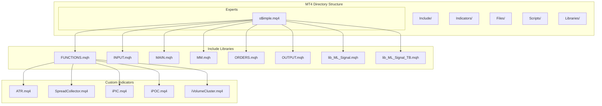
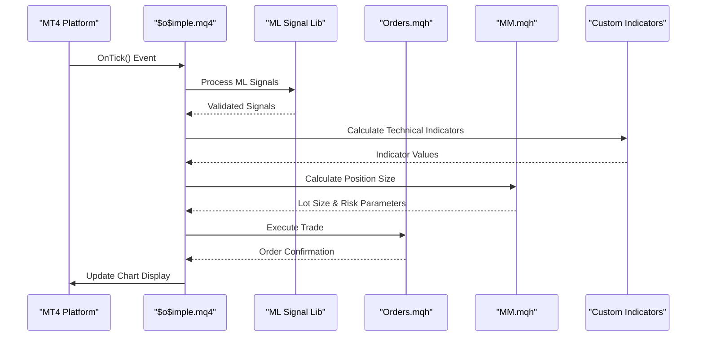
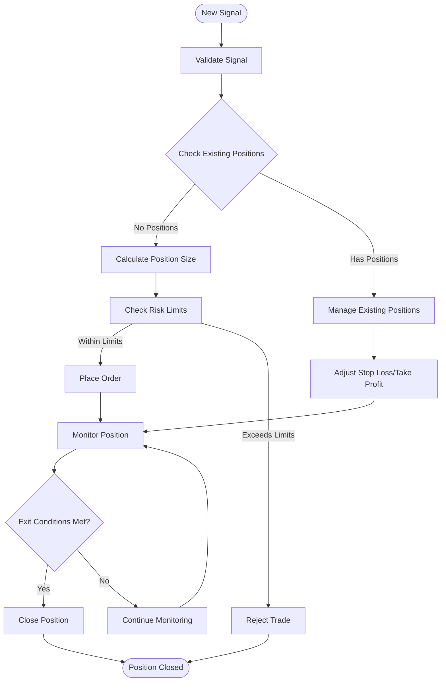
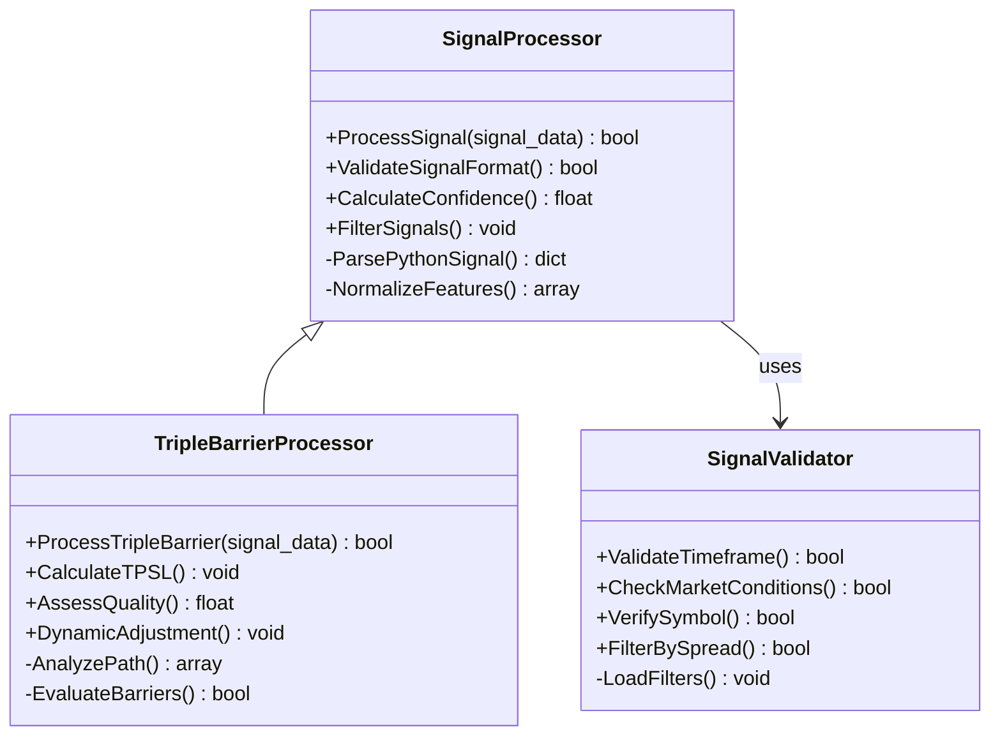
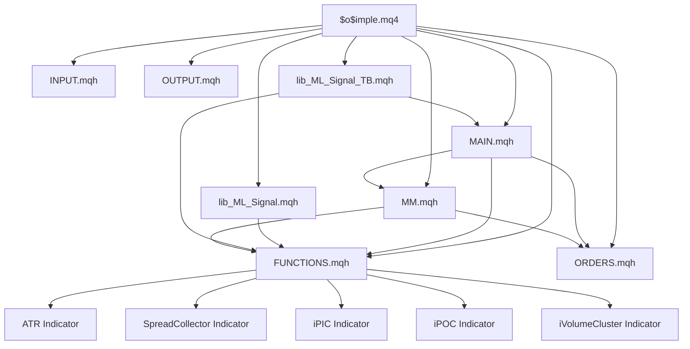

# MT4 Expert Advisors

<cite>
**Referenced Files in This Document**
- [o$imple.mq4](file://MT/MQL4/Experts/o$imple.mq4)
- [FUNCTIONS.mqh](file://MT/MQL4/Include/FUNCTIONS.mqh)
- [INPUT.mqh](file://MT/MQL4/Include/INPUT.mqh)
- [MAIN.mqh](file://MT/MQL4/Include/MAIN.mqh)
- [MM.mqh](file://MT/MQL4/Include/MM.mqh)
- [ORDERS.mqh](file://MT/MQL4/Include/ORDERS.mqh)
- [OUTPUT.mqh](file://MT/MQL4/Include/OUTPUT.mqh)
- [lib_ML_Signal.mqh](file://MT/MQL4/Include/lib_ML_Signal.mqh)
- [lib_ML_Signal_TB.mqh](file://MT/MQL4/Include/lib_ML_Signal_TB.mqh)
- [ATR Indicator](file://MT/MQL4/Indicators/ATR.mq4)
- [SpreadCollector Indicator](file://MT/MQL4/Indicators/SpreadCollector.mq4)
- [iPIC Indicator](file://MT/MQL4/Indicators/iPIC.mq4)
- [iPOC Indicator](file://MT/MQL4/Indicators/iPOC.mq4)
- [iVolumeCluster Indicator](file://MT/MQL4/Indicators/iVolumeCluster.mq4)
</cite>

## Table of Contents
1. [Introduction](#introduction)
2. [Project Structure](#project-structure)
3. [Core Components](#core-components)
4. [Architecture Overview](#architecture-overview)
5. [Detailed Component Analysis](#detailed-component-analysis)
6. [Dependency Analysis](#dependency-analysis)
7. [Performance Considerations](#performance-considerations)
8. [Troubleshooting Guide](#troubleshooting-guide)
9. [Setup and Installation](#setup-and-installation)
10. [Testing Procedures](#testing-procedures)
11. [Signal Format Compatibility](#signal-format-compatibility)
12. [Conclusion](#conclusion)

## Introduction

This document provides comprehensive documentation for the MetaTrader 4 (MT4) Expert Advisors implementation, focusing on the $o$imple.mq4 expert advisor and its associated MQL4 components. The system implements a sophisticated trading algorithm that integrates machine learning signals with traditional technical analysis indicators to execute automated trades on the MT4 platform.

The $o$imple.mq4 expert advisor serves as the main entry point for the trading system, coordinating between machine learning signal processing, position management, risk management, and order execution. It leverages a modular architecture with separate libraries for different functionalities including input handling, core functions, money management, order operations, and output logging.

## Project Structure

The MT4 implementation follows a well-organized directory structure typical of MetaTrader platforms:



**Diagram sources**
- [o$imple.mq4](file://MT/MQL4/Experts/o$imple.mq4)
- [FUNCTIONS.mqh](file://MT/MQL4/Include/FUNCTIONS.mqh)
- [INPUT.mqh](file://MT/MQL4/Include/INPUT.mqh)
- [MAIN.mqh](file://MT/MQL4/Include/MAIN.mqh)
- [MM.mqh](file://MT/MQL4/Include/MM.mqh)
- [ORDERS.mqh](file://MT/MQL4/Include/ORDERS.mqh)
- [OUTPUT.mqh](file://MT/MQL4/Include/OUTPUT.mqh)
- [lib_ML_Signal.mqh](file://MT/MQL4/Include/lib_ML_Signal.mqh)
- [lib_ML_Signal_TB.mqh](file://MT/MQL4/Include/lib_ML_Signal_TB.mqh)

## Core Components

### Main Expert Advisor ($o$imple.mq4)

The $o$imple.mq4 file serves as the primary Expert Advisor that orchestrates the entire trading system. It handles the main trading loop, event processing, and coordinates between different subsystems.

#### Key Responsibilities:
- **Event Handling**: Processes MT4 events like OnTick(), OnTimer(), and OnTrade()
- **Signal Processing**: Integrates with machine learning signal libraries
- **Position Management**: Coordinates with position management functions
- **Risk Management**: Implements money management rules
- **Order Execution**: Manages order placement and modification
- **Logging and Output**: Handles system logging and status reporting

### Include Library Components

#### FUNCTIONS.mqh - Core Utility Functions
Contains essential utility functions used throughout the system:
- Mathematical calculations and data transformations
- Time and date manipulation functions
- String parsing and formatting utilities
- Array manipulation and sorting functions
- File I/O operations for signal processing

#### INPUT.mqh - Configuration Management
Handles all input parameters and configuration settings:
- Expert Advisor input variables
- Risk management parameters
- Trading session filters
- Symbol-specific configurations
- Machine learning model parameters

#### MAIN.mqh - Main Logic Controller
Implements the core trading logic:
- Signal generation and validation
- Entry and exit condition checking
- Position state management
- Trade lifecycle coordination
- Error handling and recovery mechanisms

#### MM.mqh - Money Management
Manages position sizing and risk control:
- Lot size calculation based on account balance
- Risk percentage per trade
- Maximum position limits
- Drawdown protection
- Portfolio-level risk management

#### ORDERS.mqh - Order Management
Handles all order-related operations:
- Order placement (market and limit orders)
- Order modification (stop loss, take profit)
- Order cancellation
- Order status monitoring
- Trade history tracking

#### OUTPUT.mqh - Logging and Reporting
Provides comprehensive logging and reporting capabilities:
- System event logging
- Trade execution reports
- Performance metrics collection
- Error reporting and debugging
- Status notifications

### Machine Learning Signal Libraries

#### lib_ML_Signal.mqh - Primary Signal Processing
Processes machine learning generated signals:
- Signal format validation
- Signal strength interpretation
- Confidence level assessment
- Signal filtering and validation
- Integration with Python-generated signals

#### lib_ML_Signal_TB.mqh - Triple Barrier Signal Processing
Specialized processing for triple barrier method signals:
- Triple barrier signal interpretation
- Take profit and stop loss levels
- Time-based exit conditions
- Signal quality assessment
- Dynamic parameter adjustment

## Architecture Overview

The system follows a modular architecture with clear separation of concerns:



**Diagram sources**
- [o$imple.mq4](file://MT/MQL4/Experts/o$imple.mq4)
- [lib_ML_Signal.mqh](file://MT/MQL4/Include/lib_ML_Signal.mqh)
- [ORDERS.mqh](file://MT/MQL4/Include/ORDERS.mqh)
- [MM.mqh](file://MT/MQL4/Include/MM.mqh)

## Detailed Component Analysis

### Position Management System

The position management system handles the complete lifecycle of trading positions:



**Diagram sources**
- [MAIN.mqh](file://MT/MQL4/Include/MAIN.mqh)
- [ORDERS.mqh](file://MT/MQL4/Include/ORDERS.mqh)
- [MM.mqh](file://MT/MQL4/Include/MM.mqh)

### Custom Technical Indicators

#### ATR (Average True Range) Indicator
Calculates volatility-based measures for dynamic stop loss and take profit levels:
- Multi-timeframe ATR calculation
- Volatility normalization
- Adaptive threshold adjustment
- Real-time volatility monitoring

#### SpreadCollector Indicator
Monitors and analyzes bid-ask spread dynamics:
- Spread statistics collection
- Spread threshold monitoring
- Trading condition validation
- Cost impact analysis

#### iPIC (Intraday Price Channel) Indicator
Identifies intraday price channels and support/resistance levels:
- Dynamic channel detection
- Breakout identification
- Channel width measurement
- Trend strength assessment

#### iPOC (Point of Control) Indicator
Calculates volume-weighted price points:
- Volume profile analysis
- Point of control calculation
- Value area determination
- Volume distribution analysis

#### iVolumeCluster Indicator
Analyzes volume clustering patterns:
- Volume cluster detection
- High-volume node identification
- Volume imbalance measurement
- Institutional activity detection

### Machine Learning Signal Integration

The system integrates with Python-generated machine learning signals through a standardized interface:



**Diagram sources**
- [lib_ML_Signal.mqh](file://MT/MQL4/Include/lib_ML_Signal.mqh)
- [lib_ML_Signal_TB.mqh](file://MT/MQL4/Include/lib_ML_Signal_TB.mqh)

## Dependency Analysis

The system exhibits a well-structured dependency hierarchy:



**Diagram sources**
- [o$imple.mq4](file://MT/MQL4/Experts/o$imple.mq4)
- [FUNCTIONS.mqh](file://MT/MQL4/Include/FUNCTIONS.mqh)
- [MAIN.mqh](file://MT/MQL4/Include/MAIN.mqh)
- [MM.mqh](file://MT/MQL4/Include/MM.mqh)
- [ORDERS.mqh](file://MT/MQL4/Include/ORDERS.mqh)
- [OUTPUT.mqh](file://MT/MQL4/Include/OUTPUT.mqh)
- [lib_ML_Signal.mqh](file://MT/MQL4/Include/lib_ML_Signal.mqh)
- [lib_ML_Signal_TB.mqh](file://MT/MQL4/Include/lib_ML_Signal_TB.mqh)

## Performance Considerations

### Memory Management
- Efficient array handling to prevent memory leaks
- Proper cleanup of temporary objects
- Optimized indicator calculations
- Minimal file I/O operations during trading hours

### Computational Efficiency
- Cached indicator values to avoid recalculation
- Conditional processing based on market conditions
- Optimized signal processing algorithms
- Batch processing where possible

### Platform Limitations
- MT4 single-threaded execution model
- Limited memory allocation (typically 64MB-128MB)
- Restricted API access compared to modern platforms
- Tick-by-tick processing limitations

## Troubleshooting Guide

### Common Issues and Solutions

#### Compilation Errors
- **Missing Include Files**: Ensure all .mqh files are in the correct Include directory
- **Syntax Errors**: Verify MQL4 syntax compatibility
- **Function Declarations**: Check function prototypes match implementations

#### Runtime Errors
- **Invalid Signal Format**: Validate signal data structure
- **Insufficient Margin**: Check account balance and margin requirements
- **Network Errors**: Verify internet connectivity and broker connection
- **Indicator Errors**: Validate indicator parameters and data availability

#### Performance Issues
- **Slow Execution**: Optimize indicator calculations
- **Memory Leaks**: Implement proper object cleanup
- **High CPU Usage**: Reduce unnecessary calculations

### Debugging Techniques
- Enable detailed logging in OUTPUT.mqh
- Use Print() statements for variable inspection
- Monitor trade history for execution issues
- Check journal logs for error messages

## Setup and Installation

### MT4 Environment Setup
1. **Install MetaTrader 4**: Download and install from your broker's website
2. **Configure Charts**: Set up appropriate chart timeframes and symbols
3. **Enable AutoTrading**: Allow Expert Advisors to trade automatically
4. **Set Up Indicators**: Install custom indicators in the Indicators folder

### File Installation
1. **Copy Expert Advisor**: Place o$imple.mq4 in Experts directory
2. **Install Include Files**: Copy all .mqh files to Include directory
3. **Install Indicators**: Place custom indicators in Indicators directory
4. **Compile All Files**: Use MT4 compiler to compile all files

### Configuration
1. **Input Parameters**: Configure trading parameters in EA properties
2. **Risk Settings**: Set appropriate risk percentages and lot sizes
3. **Signal Sources**: Configure machine learning signal integration
4. **Trading Sessions**: Set active trading hours and symbol filters

## Testing Procedures

### Backtesting
1. **Strategy Tester**: Use MT4 Strategy Tester for historical testing
2. **Optimization**: Run parameter optimization for best results
3. **Walk-Forward Analysis**: Validate strategy robustness
4. **Monte Carlo Simulation**: Assess strategy stability

### Forward Testing
1. **Demo Account**: Test on demo account first
2. **Paper Trading**: Simulate live trading conditions
3. **Small Position Sizing**: Start with minimal risk exposure
4. **Performance Monitoring**: Track key performance metrics

### Validation Steps
1. **Signal Verification**: Confirm ML signals are processed correctly
2. **Order Execution**: Verify orders execute as expected
3. **Risk Management**: Test position sizing and risk controls
4. **Error Handling**: Validate error scenarios and recovery

## Signal Format Compatibility

### Python-MT4 Signal Interface
The system supports a standardized signal format for compatibility with Python-generated machine learning signals:

#### Signal Structure
```json
{
    "timestamp": "2024-01-01 12:00:00",
    "symbol": "EURUSD",
    "direction": "buy/sell",
    "confidence": 0.85,
    "entry_price": 1.1234,
    "stop_loss": 1.1200,
    "take_profit": 1.1300,
    "signal_type": "ml_signal",
    "model_version": "v1.2.3",
    "features": {...},
    "metadata": {...}
}
```

#### Supported Signal Types
- **Directional Signals**: Simple buy/sell recommendations
- **Triple Barrier Signals**: Complex signals with TP/SL levels
- **Quantile Signals**: Probabilistic signals with confidence intervals
- **Path-Based Signals**: Detailed price path predictions

#### Data Validation
- Timestamp format validation
- Symbol name verification
- Price level consistency checks
- Confidence score normalization
- Feature completeness validation

## Conclusion

The $o$imple.mq4 Expert Advisor represents a sophisticated implementation of automated trading on the MT4 platform, successfully bridging machine learning research with practical trading execution. The modular architecture ensures maintainability and scalability while providing robust risk management and position control.

Key strengths of the system include:
- **Modular Design**: Clear separation of concerns with dedicated libraries
- **Machine Learning Integration**: Seamless processing of Python-generated signals
- **Comprehensive Risk Management**: Multi-layered risk controls and position sizing
- **Advanced Technical Analysis**: Custom indicators for enhanced signal quality
- **Robust Error Handling**: Comprehensive error detection and recovery mechanisms

The system is designed for both research and production use, providing a solid foundation for algorithmic trading strategies that leverage machine learning insights while maintaining the reliability and regulatory compliance required for live trading environments.

Future enhancements could include:
- Support for additional MT4 features and APIs
- Enhanced signal processing capabilities
- Improved performance optimization
- Additional risk management tools
- Expanded indicator library