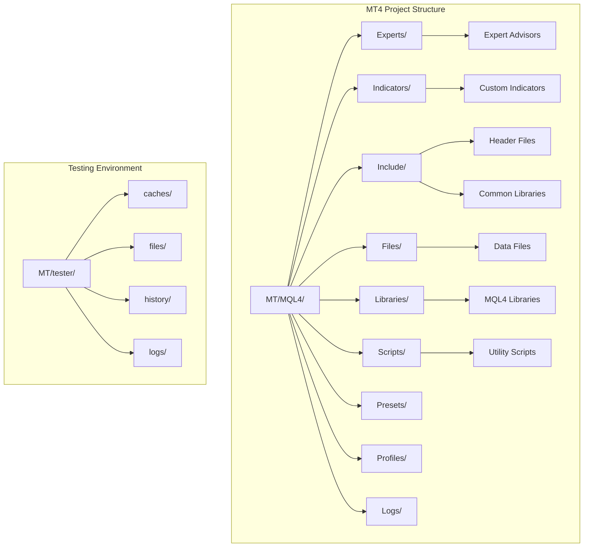
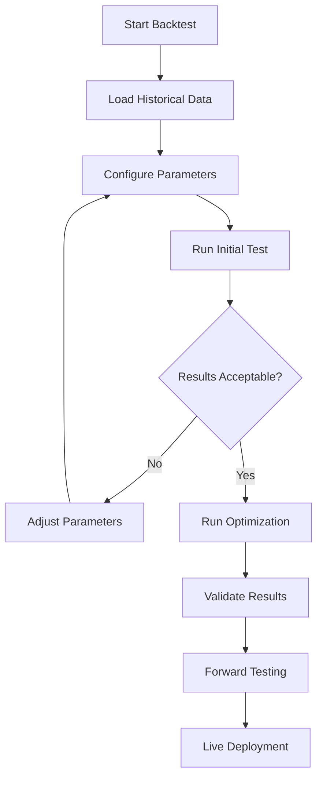

# Setup and Deployment Guide

<cite>
**Referenced Files in This Document**
- [MT/MQL4/README.md](file://MT/MQL4/README.md)
- [MT/README.md](file://MT/README.md)
- [README.md](file://README.md)
- [MT/MQL4/Experts/](file://MT/MQL4/Experts/)
- [MT/MQL4/Indicators/](file://MT/MQL4/Indicators/)
- [MT/MQL4/Include/](file://MT/MQL4/Include/)
- [MT/MQL4/Files/](file://MT/MQL4/Files/)
- [MT/tester/](file://MT/tester/)
</cite>

## Table of Contents
1. [Introduction](#introduction)
2. [Project Structure](#project-structure)
3. [MetaTrader 4 Environment Requirements](#metatrader-4-environment-requirements)
4. [Installation Procedures](#installation-procedures)
5. [Project Structure Organization](#project-structure-organization)
6. [Compilation Using MetaEditor](#compilation-using-metaeditor)
7. [Configuration Process](#configuration-process)
8. [Testing and Backtesting](#testing-and-backtesting)
9. [Live Trading Deployment](#live-trading-deployment)
10. [Troubleshooting Guide](#troubleshooting-guide)
11. [Conclusion](#conclusion)

## Introduction

This comprehensive setup and deployment guide provides detailed instructions for implementing, configuring, and deploying the MT4 (MetaTrader 4) trading system within the SoSimple project. The guide covers environment requirements, installation procedures, compilation processes, configuration settings, testing methodologies, and live deployment strategies specific to MQL4 development.

The MT4 implementation in this project follows industry best practices for algorithmic trading systems, incorporating robust error handling, risk management, and performance optimization techniques. The system is designed to work seamlessly with both backtesting environments and live trading scenarios.

## Project Structure

The MT4 implementation is organized within the `MT/MQL4` directory structure, following MetaTrader's standard conventions:

**Diagram sources**
- [MT/MQL4/README.md](file://MT/MQL4/README.md)
- [MT/README.md](file://MT/README.md)

**Section sources**
- [MT/MQL4/README.md](file://MT/MQL4/README.md)
- [MT/README.md](file://MT/README.md)

## MetaTrader 4 Environment Requirements

### System Requirements
- **Operating System**: Windows 7 or later (Windows 10/11 recommended)
- **RAM**: Minimum 4GB, 8GB+ recommended for complex strategies
- **Storage**: 10GB+ free space for historical data and logs
- **Internet Connection**: Required for market data and broker connectivity

### MetaTrader 4 Installation
- Install the latest version of MetaTrader 4 platform
- Ensure proper broker account setup with demo/live credentials
- Configure chart timeframes and symbol settings according to strategy requirements

### Development Environment
- **MetaEditor**: Built-in IDE included with MT4 installation
- **MQL4 Compiler**: Integrated into MetaEditor
- **Strategy Tester**: For backtesting and optimization
- **Debugging Tools**: Built-in debugger for code analysis

## Installation Procedures

### Step 1: Platform Setup
1. Download and install MetaTrader 4 from your broker's website
2. Launch MT4 and configure basic settings
3. Set up chart windows for required symbols and timeframes
4. Configure data download preferences for historical data

### Step 2: Project Files Installation
1. Copy the entire `MT/MQL4` directory to your MT4 data folder:
   - Default location: `C:\Users\[Username]\AppData\Roaming\MetaQuotes\Terminal\[Instance]\MQL4\`
2. Verify all files are copied correctly
3. Restart MetaTrader 4 to recognize new files

### Step 3: Library Dependencies
1. Ensure all required MQL4 libraries are properly installed
2. Check Include paths in MetaEditor settings
3. Verify custom indicator dependencies are available

**Section sources**
- [MT/MQL4/README.md](file://MT/MQL4/README.md)

## Project Structure Organization

### Experts Directory (`MT/MQL4/Experts/`)
Contains expert advisors (EAs) that implement trading strategies:
- Main trading logic and order management
- Risk management implementations
- Position sizing algorithms
- Trade execution controls

### Indicators Directory (`MT/MQL4/Indicators/`)
Houses custom indicators used by the trading system:
- Technical analysis indicators
- Signal generation components
- Market condition filters
- Custom calculation utilities

### Include Directory (`MT/MQL4/Include/`)
Organizes reusable code modules:
- Common function libraries
- Data structures and classes
- Utility functions
- Configuration managers

### Files Directory (`MT/MQL4/Files/`)
Stores external data and configuration files:
- Strategy parameters
- Historical data references
- Configuration templates
- Log files

**Section sources**
- [MT/MQL4/Experts/](file://MT/MQL4/Experts/)
- [MT/MQL4/Indicators/](file://MT/MQL4/Indicators/)
- [MT/MQL4/Include/](file://MT/MQL4/Include/)
- [MT/MQL4/Files/](file://MT/MQL4/Files/)

## Compilation Using MetaEditor

### Basic Compilation Process
1. Open MetaEditor from MT4 (F4 key or Tools menu)
2. Navigate to the desired `.mq4` file
3. Press F5 or click Compile button
4. Review compilation output for errors/warnings
5. Fix any issues before proceeding

### Advanced Compilation Settings
- **Optimization Level**: Enable/disables compiler optimizations
- **Debug Information**: Includes debug symbols for troubleshooting
- **Warning Levels**: Configures strictness of code analysis
- **Include Paths**: Sets search directories for header files

### Common Compilation Issues
- Missing include files or libraries
- Syntax errors in MQL4 code
- Undefined variables or functions
- Type mismatches and casting errors
- Memory allocation issues

### Best Practices for Compilation
- Always compile with warnings enabled
- Use consistent coding standards
- Implement proper error handling
- Test compilation in clean environment
- Maintain backup copies of working versions

**Section sources**
- [MT/MQL4/README.md](file://MT/MQL4/README.md)

## Configuration Process

### Input Parameters Configuration
Configure expert advisor parameters through MT4 interface:
1. Attach EA to chart
2. Right-click and select "Properties"
3. Navigate to "Inputs" tab
4. Modify parameter values as needed
5. Save preset configurations

### Strategy Settings
Key configuration areas include:
- **Trading Symbols**: Configure which instruments to trade
- **Timeframe Selection**: Set primary and secondary timeframes
- **Lot Size Management**: Define position sizing rules
- **Risk Parameters**: Set maximum drawdown limits
- **Trade Filters**: Configure entry/exit conditions

### Risk Management Rules
Essential risk control parameters:
- Maximum position size per trade
- Total portfolio exposure limits
- Stop loss and take profit levels
- Trailing stop configurations
- Daily loss limits
- Correlation filters

### Configuration Templates
Create and manage preset configurations:
1. Adjust parameters for different market conditions
2. Save as named presets
3. Share configurations across team members
4. Version control for configuration changes

**Section sources**
- [MT/MQL4/Files/](file://MT/MQL4/Files/)

## Testing and Backtesting

### Strategy Tester Setup
1. Open Strategy Tester (Ctrl+R)
2. Select expert advisor and symbol
3. Configure timeframe and date range
4. Set initial deposit and leverage
5. Choose modeling quality (every tick)

### Optimization Settings
For parameter optimization:
1. Select parameters to optimize
2. Define step ranges and increments
3. Set optimization criteria (profit factor, drawdown)
4. Configure genetic algorithm settings
5. Run optimization with appropriate hardware

### Backtesting Best Practices
- Use high-quality historical data (tick data preferred)
- Account for spreads and commissions
- Test across multiple market conditions
- Validate results with walk-forward analysis
- Monitor slippage and execution quality

### Performance Metrics Analysis
Key metrics to evaluate:
- Profit Factor and Net Profit
- Maximum Drawdown and Recovery Factor
- Sharpe Ratio and Sortino Ratio
- Win Rate and Average Trade Performance
- Trade Frequency and Duration

### Testing Workflow

**Diagram sources**
- [MT/tester/](file://MT/tester/)

**Section sources**
- [MT/tester/](file://MT/tester/)

## Live Trading Deployment

### Account Setup
1. Create or connect to live trading account
2. Verify account permissions and trading rights
3. Configure margin requirements and leverage
4. Set up two-factor authentication
5. Test with small position sizes initially

### Deployment Steps
1. Install compiled EAs on live MT4 instance
2. Configure input parameters for live trading
3. Set up monitoring and alerting systems
4. Implement kill switches and emergency stops
5. Test connection stability and data feeds

### Monitoring Configuration
Essential monitoring components:
- Real-time P&L tracking
- Position and order status monitoring
- Error and exception logging
- Performance metric dashboards
- Alert systems for critical events

### Risk Controls for Live Trading
Critical safety measures:
- Maximum daily loss limits
- Position size restrictions
- Time-based trading halts
- Network connectivity monitoring
- Automated disaster recovery

### Production Checklist
Before going live:
- [ ] All tests passed successfully
- [ ] Risk parameters configured appropriately
- [ ] Monitoring systems operational
- [ ] Emergency procedures documented
- [ ] Backup systems tested
- [ ] Team trained on procedures

**Section sources**
- [MT/MQL4/Experts/](file://MT/MQL4/Experts/)

## Troubleshooting Guide

### Common Compilation Errors
**Error: "undefined identifier"**
- Cause: Missing variable declaration or include file
- Solution: Check spelling and include necessary headers

**Error: "function already defined"**
- Cause: Duplicate function definitions
- Solution: Remove duplicates or use proper namespace organization

**Error: "array out of bounds"**
- Cause: Accessing array indices beyond declared size
- Solution: Add bounds checking and validate array sizes

### Runtime Issues
**Problem: EA not executing trades**
- Check if EA is attached to correct chart
- Verify trading permissions are enabled
- Confirm symbol and timeframe compatibility
- Review error logs for rejection reasons

**Problem: Slow performance or lag**
- Optimize loop operations and calculations
- Reduce unnecessary indicator calls
- Implement efficient data structures
- Consider moving heavy calculations offline

**Problem: Memory leaks or crashes**
- Properly manage memory allocation
- Close file handles and network connections
- Avoid infinite loops and recursive calls
- Implement proper error handling

### Debugging Techniques
1. **Print Statements**: Use `Print()` function for debugging output
2. **Log Files**: Write detailed logs to files for analysis
3. **Breakpoints**: Use MetaEditor debugger for step-through debugging
4. **Variable Inspection**: Monitor key variables during execution
5. **Performance Profiling**: Identify bottlenecks in code execution

### Error Handling Best Practices
- Implement comprehensive try-catch blocks
- Log all errors with context information
- Provide meaningful error messages
- Gracefully handle network failures
- Implement retry mechanisms for transient errors

### Performance Optimization
- Minimize indicator calls in tight loops
- Cache frequently accessed data
- Use efficient data structures
- Avoid unnecessary object creation
- Implement proper resource cleanup

**Section sources**
- [MT/MQL4/Logs/](file://MT/MQL4/Logs/)

## Conclusion

This setup and deployment guide provides a comprehensive foundation for implementing and operating the MT4 trading system within the SoSimple project. By following the outlined procedures for environment setup, compilation, configuration, testing, and deployment, users can establish a robust algorithmic trading infrastructure.

The key to successful MT4 implementation lies in thorough testing, proper risk management, and continuous monitoring. The modular structure of the project allows for easy maintenance and updates while maintaining system stability.

Remember to always test thoroughly in simulated environments before deploying to live accounts, maintain detailed documentation of all changes, and implement comprehensive monitoring and alerting systems for production deployments.

For ongoing support and updates, refer to the project documentation and community resources available through the MT4 developer ecosystem.