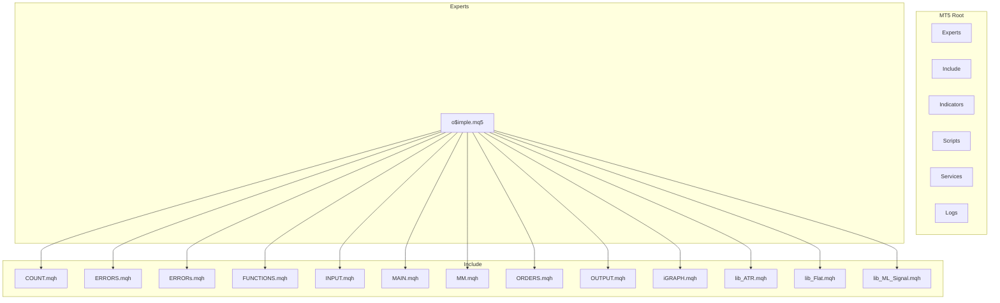
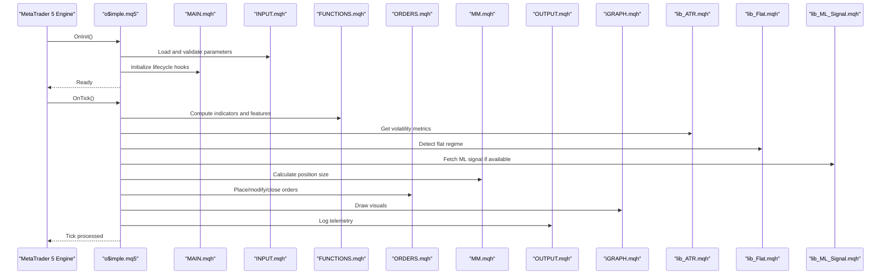
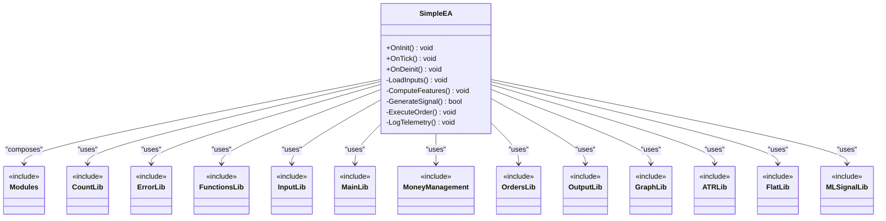
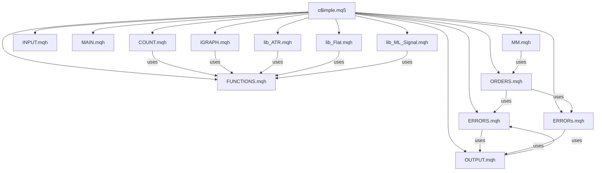

# MT5 Expert Advisors

<cite>
**Referenced Files in This Document**
- [README.md](file://MT/README.md)
- [o$imple.mq5](file://MT/MQL5/Experts/o$imple.mq5)
- [COUNT.mqh](file://MT/MQL5/Include/COUNT.mqh)
- [ERRORS.mqh](file://MT/MQL5/Include/ERRORS.mqh)
- [ERRORs.mqh](file://MT/MQL5/Include/ERRORs.mqh)
- [FUNCTIONS.mqh](file://MT/MQL5/Include/FUNCTIONS.mqh)
- [INPUT.mqh](file://MT/MQL5/Include/INPUT.mqh)
- [MAIN.mqh](file://MT/MQL5/Include/MAIN.mqh)
- [MM.mqh](file://MT/MQL5/Include/MM.mqh)
- [ORDERS.mqh](file://MT/MQL5/Include/ORDERS.mqh)
- [OUTPUT.mqh](file://MT/MQL5/Include/OUTPUT.mqh)
- [iGRAPH.mqh](file://MT/MQL5/Include/iGRAPH.mqh)
- [lib_ATR.mqh](file://MT/MQL5/Include/lib_ATR.mqh)
- [lib_Flat.mqh](file://MT/MQL5/Include/lib_Flat.mqh)
- [lib_ML_Signal.mqh](file://MT/MQL5/Include/lib_ML_Signal.mqh)
</cite>

## Table of Contents
1. [Introduction](#introduction)
2. [Project Structure](#project-structure)
3. [Core Components](#core-components)
4. [Architecture Overview](#architecture-overview)
5. [Detailed Component Analysis](#detailed-component-analysis)
6. [Dependency Analysis](#dependency-analysis)
7. [Performance Considerations](#performance-considerations)
8. [Troubleshooting Guide](#troubleshooting-guide)
9. [Conclusion](#conclusion)
10. [Appendices](#appendices)

## Introduction
This document provides comprehensive documentation for MetaTrader 5 Expert Advisors (EAs) and the modern MQL5 implementation, focusing on the $o$imple.mq5 expert advisor with enhanced features and improved architecture compared to its MT4 counterpart. It explains the MQL5 Include libraries used by the EA, details API differences between MT4 and MT5 (order management, symbol properties, market depth), outlines modern MQL5 programming patterns (asynchronous operations, multi-threading), and offers migration guidance and performance optimization techniques specific to MT5.

## Project Structure
The MT5 codebase is organized under the MT/MQL5 directory, following standard MetaTrader conventions:
- Experts: contains EAs such as o$imple.mq5
- Include: modular libraries for counting, errors, functions, inputs, main loop, money management, orders, output, graphing, ATR, flatness detection, and ML signal integration
- Indicators, Scripts, Services, Profiles, Logs: supporting assets and runtime artifacts

**Diagram sources**
- [README.md](file://MT/README.md)

**Section sources**
- [README.md](file://MT/README.md)

## Core Components
The $o$imple.mq5 EA orchestrates trading logic using a set of modular include files:
- COUNT.mqh: utilities for counting events, bars, or signals
- ERRORS.mqh / ERRORs.mqh: error handling and logging helpers
- FUNCTIONS.mqh: shared helper functions for calculations and data access
- INPUT.mqh: input parameter definitions and validation
- MAIN.mqh: core lifecycle hooks (OnInit, OnTick, OnDeinit)
- MM.mqh: position sizing and risk management
- ORDERS.mqh: order placement, modification, and closure
- OUTPUT.mqh: telemetry, logs, and chart outputs
- iGRAPH.mqh: drawing indicators and visual feedback
- lib_ATR.mqh: volatility measures via ATR
- lib_Flat.mqh: regime detection for flat markets
- lib_ML_Signal.mqh: integration with machine learning signals

These components are designed to be cohesive and loosely coupled, enabling clear separation of concerns and easier maintenance.

**Section sources**
- [o$imple.mq5](file://MT/MQL5/Experts/o$imple.mq5)
- [COUNT.mqh](file://MT/MQL5/Include/COUNT.mqh)
- [ERRORS.mqh](file://MT/MQL5/Include/ERRORS.mqh)
- [ERRORs.mqh](file://MT/MQL5/Include/ERRORs.mqh)
- [FUNCTIONS.mqh](file://MT/MQL5/Include/FUNCTIONS.mqh)
- [INPUT.mqh](file://MT/MQL5/Include/INPUT.mqh)
- [MAIN.mqh](file://MT/MQL5/Include/MAIN.mqh)
- [MM.mqh](file://MT/MQL5/Include/MM.mqh)
- [ORDERS.mqh](file://MT/MQL5/Include/ORDERS.mqh)
- [OUTPUT.mqh](file://MT/MQL5/Include/OUTPUT.mqh)
- [iGRAPH.mqh](file://MT/MQL5/Include/iGRAPH.mqh)
- [lib_ATR.mqh](file://MT/MQL5/Include/lib_ATR.mqh)
- [lib_Flat.mqh](file://MT/MQL5/Include/lib_Flat.mqh)
- [lib_ML_Signal.mqh](file://MT/MQL5/Include/lib_ML_Signal.mqh)

## Architecture Overview
The EA follows a layered architecture where the main file composes modules for input handling, strategy logic, order execution, and output. The flow emphasizes modularity and reusability.

**Diagram sources**
- [o$imple.mq5](file://MT/MQL5/Experts/o$imple.mq5)
- [MAIN.mqh](file://MT/MQL5/Include/MAIN.mqh)
- [INPUT.mqh](file://MT/MQL5/Include/INPUT.mqh)
- [FUNCTIONS.mqh](file://MT/MQL5/Include/FUNCTIONS.mqh)
- [ORDERS.mqh](file://MT/MQL5/Include/ORDERS.mqh)
- [MM.mqh](file://MT/MQL5/Include/MM.mqh)
- [OUTPUT.mqh](file://MT/MQL5/Include/OUTPUT.mqh)
- [iGRAPH.mqh](file://MT/MQL5/Include/iGRAPH.mqh)
- [lib_ATR.mqh](file://MT/MQL5/Include/lib_ATR.mqh)
- [lib_Flat.mqh](file://MT/MQL5/Include/lib_Flat.mqh)
- [lib_ML_Signal.mqh](file://MT/MQL5/Include/lib_ML_Signal.mqh)

## Detailed Component Analysis

### o$imple.mq5 Expert Advisor
The main EA file coordinates all modules and implements the trading lifecycle. It includes input parsing, indicator computation, signal generation, order management, and output logging.

Key responsibilities:
- Lifecycle management via OnInit, OnTick, OnDeinit
- Parameter validation and defaults
- Integration with ML signals and volatility filters
- Order execution and risk controls
- Telemetry and visualization

**Diagram sources**
- [o$imple.mq5](file://MT/MQL5/Experts/o$imple.mq5)
- [COUNT.mqh](file://MT/MQL5/Include/COUNT.mqh)
- [ERRORS.mqh](file://MT/MQL5/Include/ERRORS.mqh)
- [ERRORs.mqh](file://MT/MQL5/Include/ERRORs.mqh)
- [FUNCTIONS.mqh](file://MT/MQL5/Include/FUNCTIONS.mqh)
- [INPUT.mqh](file://MT/MQL5/Include/INPUT.mqh)
- [MAIN.mqh](file://MT/MQL5/Include/MAIN.mqh)
- [MM.mqh](file://MT/MQL5/Include/MM.mqh)
- [ORDERS.mqh](file://MT/MQL5/Include/ORDERS.mqh)
- [OUTPUT.mqh](file://MT/MQL5/Include/OUTPUT.mqh)
- [iGRAPH.mqh](file://MT/MQL5/Include/iGRAPH.mqh)
- [lib_ATR.mqh](file://MT/MQL5/Include/lib_ATR.mqh)
- [lib_Flat.mqh](file://MT/MQL5/Include/lib_Flat.mqh)
- [lib_ML_Signal.mqh](file://MT/MQL5/Include/lib_ML_Signal.mqh)

**Section sources**
- [o$imple.mq5](file://MT/MQL5/Experts/o$imple.mq5)

### Include Libraries Analysis

#### COUNT.mqh
Provides utility functions for counting occurrences of events, bars, or conditions. Useful for tracking trade frequency, signal counts, and bar-based metrics.

#### ERRORS.mqh and ERRORs.mqh
Implement error handling strategies, including error codes, logging, and recovery mechanisms. Ensures robust operation under various failure scenarios.

#### FUNCTIONS.mqh
Contains shared mathematical and data processing functions used across the EA. Includes normalization, filtering, and calculation helpers.

#### INPUT.mqh
Defines external input parameters, their types, default values, and validation rules. Centralizes configuration management for the EA.

#### MAIN.mqh
Implements core lifecycle methods (OnInit, OnTick, OnDeinit) and orchestrates the main execution flow. Acts as the backbone of the EA's runtime behavior.

#### MM.mqh
Handles money management logic, including position sizing, risk per trade, and portfolio-level constraints. Integrates with account balance and margin requirements.

#### ORDERS.mqh
Manages order lifecycle operations: placing new orders, modifying existing ones, and closing positions. Includes retry logic and error handling for failed operations.

#### OUTPUT.mqh
Provides logging, telemetry, and debugging output capabilities. Supports both console and file-based logging for analysis and monitoring.

#### iGRAPH.mqh
Offers drawing functions for creating visual indicators on charts. Helps visualize signals, levels, and trade states for better insight.

#### lib_ATR.mqh
Calculates Average True Range (ATR) and related volatility metrics. Used for dynamic stop-loss and take-profit adjustments based on market volatility.

#### lib_Flat.mqh
Detects flat or ranging market conditions using price action analysis. Helps filter trades during low-volatility periods to avoid false signals.

#### lib_ML_Signal.mqh
Integrates with machine learning models to generate trading signals. Handles model loading, prediction inference, and signal interpretation.

**Section sources**
- [COUNT.mqh](file://MT/MQL5/Include/COUNT.mqh)
- [ERRORS.mqh](file://MT/MQL5/Include/ERRORS.mqh)
- [ERRORs.mqh](file://MT/MQL5/Include/ERRORs.mqh)
- [FUNCTIONS.mqh](file://MT/MQL5/Include/FUNCTIONS.mqh)
- [INPUT.mqh](file://MT/MQL5/Include/INPUT.mqh)
- [MAIN.mqh](file://MT/MQL5/Include/MAIN.mqh)
- [MM.mqh](file://MT/MQL5/Include/MM.mqh)
- [ORDERS.mqh](file://MT/MQL5/Include/ORDERS.mqh)
- [OUTPUT.mqh](file://MT/MQL5/Include/OUTPUT.mqh)
- [iGRAPH.mqh](file://MT/MQL5/Include/iGRAPH.mqh)
- [lib_ATR.mqh](file://MT/MQL5/Include/lib_ATR.mqh)
- [lib_Flat.mqh](file://MT/MQL5/Include/lib_Flat.mqh)
- [lib_ML_Signal.mqh](file://MT/MQL5/Include/lib_ML_Signal.mqh)

## Dependency Analysis
The EA exhibits a modular dependency structure where o$imple.mq5 depends on multiple include files for specialized functionality. This design promotes cohesion within modules while maintaining loose coupling between them.

**Diagram sources**
- [o$imple.mq5](file://MT/MQL5/Experts/o$imple.mq5)
- [COUNT.mqh](file://MT/MQL5/Include/COUNT.mqh)
- [ERRORS.mqh](file://MT/MQL5/Include/ERRORS.mqh)
- [ERRORs.mqh](file://MT/MQL5/Include/ERRORs.mqh)
- [FUNCTIONS.mqh](file://MT/MQL5/Include/FUNCTIONS.mqh)
- [INPUT.mqh](file://MT/MQL5/Include/INPUT.mqh)
- [MAIN.mqh](file://MT/MQL5/Include/MAIN.mqh)
- [MM.mqh](file://MT/MQL5/Include/MM.mqh)
- [ORDERS.mqh](file://MT/MQL5/Include/ORDERS.mqh)
- [OUTPUT.mqh](file://MT/MQL5/Include/OUTPUT.mqh)
- [iGRAPH.mqh](file://MT/MQL5/Include/iGRAPH.mqh)
- [lib_ATR.mqh](file://MT/MQL5/Include/lib_ATR.mqh)
- [lib_Flat.mqh](file://MT/MQL5/Include/lib_Flat.mqh)
- [lib_ML_Signal.mqh](file://MT/MQL5/Include/lib_ML_Signal.mqh)

**Section sources**
- [o$imple.mq5](file://MT/MQL5/Experts/o$imple.mq5)

## Performance Considerations
MT5 offers several performance advantages over MT4 that can be leveraged in EA development:
- Multi-threading support through CTrade and asynchronous order operations
- Improved memory management and garbage collection
- Enhanced symbol property access and market depth retrieval
- Better event-driven architecture with OnTick optimizations

Key optimization techniques:
- Use SymbolInfoDouble for efficient symbol property queries
- Implement proper error handling to prevent cascading failures
- Optimize indicator calculations by caching results when possible
- Utilize built-in functions like CopyClose, CopyTime for faster data access
- Avoid excessive object creation in tight loops

## Troubleshooting Guide
Common issues and solutions in MT5 EA development:
- Order rejection errors: Check lot sizes, symbol status, and trading permissions
- Slippage issues: Implement proper stop levels and use market orders appropriately
- Memory leaks: Ensure proper cleanup in OnDeinit and avoid global variable accumulation
- Performance bottlenecks: Profile indicator calculations and optimize data access patterns
- ML integration failures: Validate model file paths and ensure proper serialization

Error handling best practices:
- Implement comprehensive error logging with context information
- Use try-catch blocks for critical operations
- Provide fallback mechanisms for failed operations
- Monitor system resources and implement graceful degradation

**Section sources**
- [ERRORS.mqh](file://MT/MQL5/Include/ERRORS.mqh)
- [ERRORs.mqh](file://MT/MQL5/Include/ERRORs.mqh)
- [OUTPUT.mqh](file://MT/MQL5/Include/OUTPUT.mqh)

## Conclusion
The $o$imple.mq5 EA demonstrates a well-structured approach to MT5 Expert Advisor development with modular architecture and comprehensive feature set. The separation of concerns through include files enables maintainable and scalable code. Migration from MT4 to MT5 brings significant performance improvements and additional capabilities that should be leveraged for optimal trading system performance.

## Appendices

### MT4 vs MT5 API Differences

#### Order Management
- MT4: Uses OrderSend with ticket-based operations
- MT5: Uses CTrade class with more sophisticated order types and management

#### Symbol Properties
- MT4: Limited symbol property access through MarketInfo
- MT5: Comprehensive SymbolInfo* functions for detailed symbol information

#### Market Depth
- MT4: Limited market depth access
- MT5: Full market depth retrieval through SymbolInfoDepth

### Migration Guidance
When migrating from MT4 to MT5:
1. Replace OrderSend with CTrade operations
2. Update symbol property calls from MarketInfo to SymbolInfo*
3. Implement proper error handling for async operations
4. Leverage multi-threading capabilities where appropriate
5. Optimize indicator calculations for better performance

### Modern MQL5 Programming Patterns
- Event-driven architecture with proper lifecycle management
- Asynchronous operations for non-blocking execution
- Modular design with clear separation of concerns
- Comprehensive error handling and logging
- Resource management and cleanup procedures