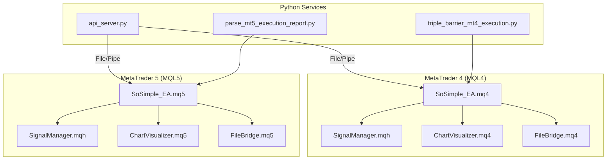
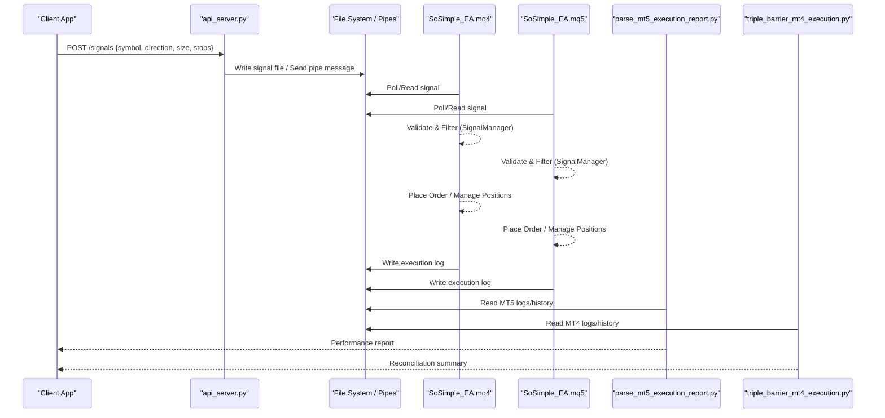
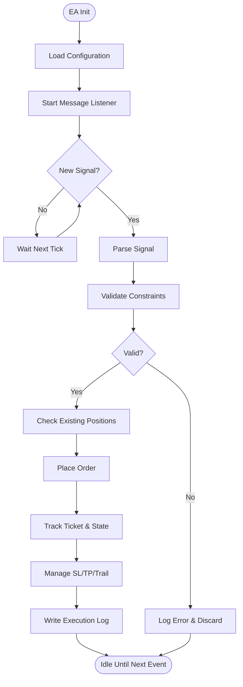
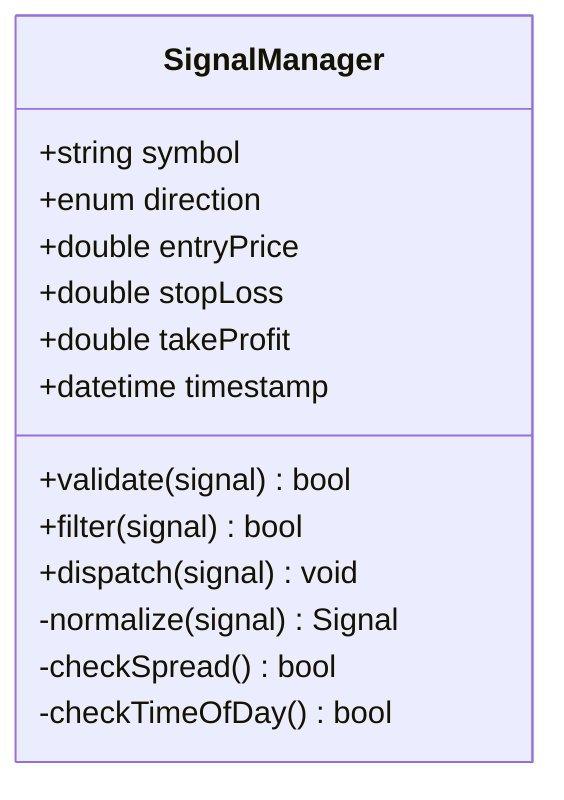
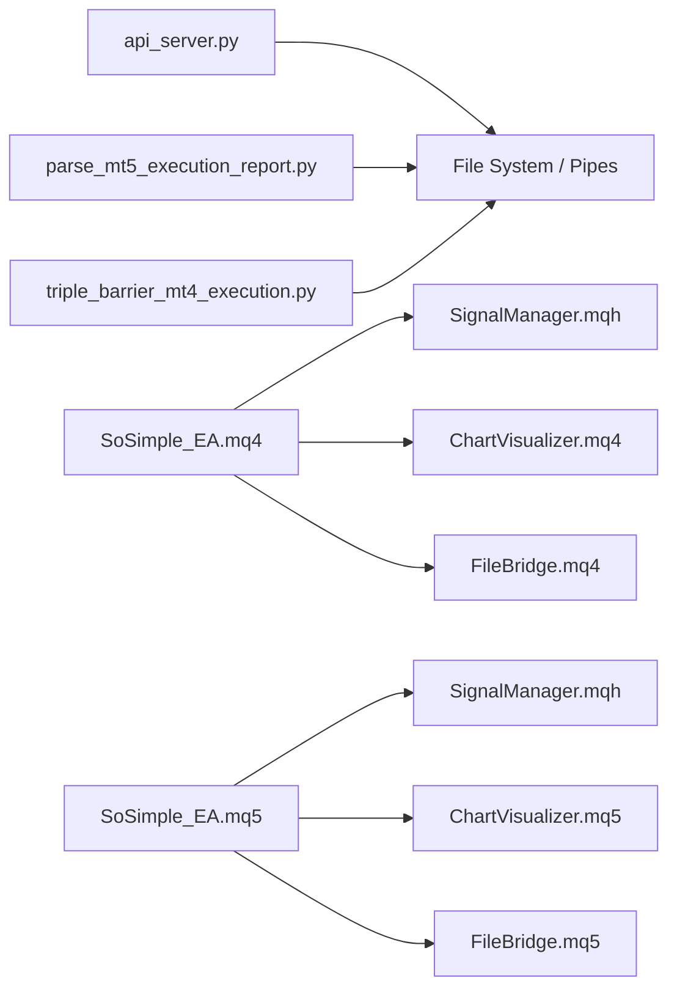

# MetaTrader Integration

<cite>
**Referenced Files in This Document**
- [MT/README.md](file://MT/README.md)
- [MT/MQL4/Experts/SoSimple_EA.mq4](file://MT/MQL4/Experts/SoSimple_EA.mq4)
- [MT/MQL5/Experts/SoSimple_EA.mq5](file://MT/MQL5/Experts/SoSimple_EA.mq5)
- [MT/MQL4/Include/SignalManager.mqh](file://MT/MQL4/Include/SignalManager.mqh)
- [MT/MQL5/Include/SignalManager.mqh](file://MT/MQL5/Include/SignalManager.mqh)
- [MT/MQL4/Indicators/ChartVisualizer.mq4](file://MT/MQL4/Indicators/ChartVisualizer.mq4)
- [MT/MQL5/Indicators/ChartVisualizer.mq5](file://MT/MQL5/Indicators/ChartVisualizer.mq5)
- [MT/MQL4/Libraries/FileBridge.mq4](file://MT/MQL4/Libraries/FileBridge.mq4)
- [MT/MQL5/Libraries/FileBridge.mq5](file://MT/MQL5/Libraries/FileBridge.mq5)
- [API/api_server.py](file://API/api_server.py)
- [ML/parse_mt5_execution_report.py](file://ML/parse_mt5_execution_report.py)
- [ML/triple_barrier_mt4_execution.py](file://ML/triple_barrier_mt4_execution.py)
- [tests/test_parse_mt5_execution_report.py](file://tests/test_parse_mt5_execution_report.py)
- [tests/test_triple_barrier_mt4_execution.py](file://tests/test_triple_barrier_mt4_execution.py)
</cite>

## Table of Contents
1. [Introduction](#introduction)
2. [Project Structure](#project-structure)
3. [Core Components](#core-components)
4. [Architecture Overview](#architecture-overview)
5. [Detailed Component Analysis](#detailed-component-analysis)
6. [Dependency Analysis](#dependency-analysis)
7. [Performance Considerations](#performance-considerations)
8. [Troubleshooting Guide](#troubleshooting-guide)
9. [Conclusion](#conclusion)
10. [Appendices](#appendices)

## Introduction
This document provides comprehensive integration guidance for connecting the SoSimple system to MetaTrader 4 (MQL4) and MetaTrader 5 (MQL5). It covers Expert Advisors (EAs) for signal execution and position management, indicator libraries for technical analysis and chart visualization, communication protocols between Python services and MT platforms (file-based and pipe-based), execution report parsing and reconciliation for performance tracking, setup instructions, configuration parameters, signal format compatibility, execution logic differences, and reliability/performance considerations for live trading.

## Project Structure
The MetaTrader integration spans three primary areas:
- MQL4 components under MT/MQL4: Experts, Include, Indicators, Libraries
- MQL5 components under MT/MQL5: Experts, Include, Indicators, Libraries
- Python bridge and analytics under API and ML directories

**Diagram sources**
- [MT/README.md](file://MT/README.md)
- [API/api_server.py](file://API/api_server.py)
- [ML/parse_mt5_execution_report.py](file://ML/parse_mt5_execution_report.py)
- [ML/triple_barrier_mt4_execution.py](file://ML/triple_barrier_mt4_execution.py)
- [MT/MQL4/Experts/SoSimple_EA.mq4](file://MT/MQL4/Experts/SoSimple_EA.mq4)
- [MT/MQL5/Experts/SoSimple_EA.mq5](file://MT/MQL5/Experts/SoSimple_EA.mq5)
- [MT/MQL4/Include/SignalManager.mqh](file://MT/MQL4/Include/SignalManager.mqh)
- [MT/MQL5/Include/SignalManager.mqh](file://MT/MQL5/Include/SignalManager.mqh)
- [MT/MQL4/Indicators/ChartVisualizer.mq4](file://MT/MQL4/Indicators/ChartVisualizer.mq4)
- [MT/MQL5/Indicators/ChartVisualizer.mq5](file://MT/MQL5/Indicators/ChartVisualizer.mq5)
- [MT/MQL4/Libraries/FileBridge.mq4](file://MT/MQL4/Libraries/FileBridge.mq4)
- [MT/MQL5/Libraries/FileBridge.mq5](file://MT/MQL5/Libraries/FileBridge.mq5)

**Section sources**
- [MT/README.md](file://MT/README.md)

## Core Components
- SoSimple_EA (MQL4/MQL5): Entry point EAs that receive signals from Python, manage positions, handle risk controls, and emit telemetry.
- SignalManager (MQL4/MQL5): Encapsulates signal parsing, validation, filtering, and dispatch to order placement routines.
- ChartVisualizer (MQL4/MQL5): Indicator library for custom chart overlays, drawing entry/exit zones, and visualizing signals and barriers.
- FileBridge (MQL4/MQL5): Low-level I/O utilities for file-based messaging and optional named pipes for inter-process communication with Python.
- api_server.py: Python service exposing endpoints to push signals and receive status updates; coordinates file/pipe messaging.
- parse_mt5_execution_report.py: Parses MT5 execution logs and trade history into structured reports for performance tracking.
- triple_barrier_mt4_execution.py: Implements triple-barrier execution logic and reconciliation for MT4 environments.

Key responsibilities:
- Signal ingestion and normalization across MT4/MT5
- Position lifecycle management (open, modify, close)
- Risk and exposure controls
- Telemetry and reporting
- Visualization aids for manual oversight

**Section sources**
- [MT/MQL4/Experts/SoSimple_EA.mq4](file://MT/MQL4/Experts/SoSimple_EA.mq4)
- [MT/MQL5/Experts/SoSimple_EA.mq5](file://MT/MQL5/Experts/SoSimple_EA.mq5)
- [MT/MQL4/Include/SignalManager.mqh](file://MT/MQL4/Include/SignalManager.mqh)
- [MT/MQL5/Include/SignalManager.mqh](file://MT/MQL5/Include/SignalManager.mqh)
- [MT/MQL4/Indicators/ChartVisualizer.mq4](file://MT/MQL4/Indicators/ChartVisualizer.mq4)
- [MT/MQL5/Indicators/ChartVisualizer.mq5](file://MT/MQL5/Indicators/ChartVisualizer.mq5)
- [MT/MQL4/Libraries/FileBridge.mq4](file://MT/MQL4/Libraries/FileBridge.mq4)
- [MT/MQL5/Libraries/FileBridge.mq5](file://MT/MQL5/Libraries/FileBridge.mq5)
- [API/api_server.py](file://API/api_server.py)
- [ML/parse_mt5_execution_report.py](file://ML/parse_mt5_execution_report.py)
- [ML/triple_barrier_mt4_execution.py](file://ML/triple_barrier_mt4_execution.py)

## Architecture Overview
The SoSimple system integrates with MT4/MT5 via a hybrid architecture:
- Python services generate or forward signals through REST endpoints and persist them as files or send via named pipes.
- MQL4/MQL5 EAs poll or listen for incoming messages, parse signals, validate constraints, and execute orders.
- Execution results and telemetry are written back to files/logs consumed by Python analytics for reconciliation and reporting.

**Diagram sources**
- [API/api_server.py](file://API/api_server.py)
- [MT/MQL4/Experts/SoSimple_EA.mq4](file://MT/MQL4/Experts/SoSimple_EA.mq4)
- [MT/MQL5/Experts/SoSimple_EA.mq5](file://MT/MQL5/Experts/SoSimple_EA.mq5)
- [MT/MQL4/Libraries/FileBridge.mq4](file://MT/MQL4/Libraries/FileBridge.mq4)
- [MT/MQL5/Libraries/FileBridge.mq5](file://MT/MQL5/Libraries/FileBridge.mq5)
- [ML/parse_mt5_execution_report.py](file://ML/parse_mt5_execution_report.py)
- [ML/triple_barrier_mt4_execution.py](file://ML/triple_barrier_mt4_execution.py)

## Detailed Component Analysis

### SoSimple_EA (MQL4/MQL5)
Responsibilities:
- Initialize runtime environment and load configuration
- Start message listeners (file polling or named pipes)
- Dispatch parsed signals to position managers
- Implement stop-loss, take-profit, trailing stops, and partial closes
- Emit telemetry and error handling

Execution flow highlights:
- On new tick or signal arrival, validate symbol and lot sizes
- Check existing positions and exposure limits
- Execute orders with appropriate ticket tracking
- Update internal state and write execution logs

**Diagram sources**
- [MT/MQL4/Experts/SoSimple_EA.mq4](file://MT/MQL4/Experts/SoSimple_EA.mq4)
- [MT/MQL5/Experts/SoSimple_EA.mq5](file://MT/MQL5/Experts/SoSimple_EA.mq5)

**Section sources**
- [MT/MQL4/Experts/SoSimple_EA.mq4](file://MT/MQL4/Experts/SoSimple_EA.mq4)
- [MT/MQL5/Experts/SoSimple_EA.mq5](file://MT/MQL5/Experts/SoSimple_EA.mq5)

### SignalManager (MQL4/MQL5)
Responsibilities:
- Normalize incoming signal formats across MT4/MT5
- Apply filters (e.g., spread checks, time-of-day, volatility thresholds)
- Map abstract signals to platform-specific order types and parameters
- Maintain signal queue and deduplication

Data structures:
- Signal object with fields like symbol, direction, entry price, stops, targets, timestamps
- Validation rules and thresholds
- Queue management for asynchronous processing

**Diagram sources**
- [MT/MQL4/Include/SignalManager.mqh](file://MT/MQL4/Include/SignalManager.mqh)
- [MT/MQL5/Include/SignalManager.mqh](file://MT/MQL5/Include/SignalManager.mqh)

**Section sources**
- [MT/MQL4/Include/SignalManager.mqh](file://MT/MQL4/Include/SignalManager.mqh)
- [MT/MQL5/Include/SignalManager.mqh](file://MT/MQL5/Include/SignalManager.mqh)

### ChartVisualizer (MQL4/MQL5)
Responsibilities:
- Draw entry/exit zones, barrier lines, and signal markers on charts
- Provide visual feedback for manual review and debugging
- Support dynamic updates based on current positions and pending orders

Usage patterns:
- Attach as an indicator to active charts
- Configure colors, styles, and visibility toggles
- Integrate with EA telemetry for synchronized visuals

**Section sources**
- [MT/MQL4/Indicators/ChartVisualizer.mq4](file://MT/MQL4/Indicators/ChartVisualizer.mq4)
- [MT/MQL5/Indicators/ChartVisualizer.mq5](file://MT/MQL5/Indicators/ChartVisualizer.mq5)

### FileBridge (MQL4/MQL5)
Responsibilities:
- Implement file-based messaging (read/write signal files, logs)
- Optional named pipe support for low-latency IPC
- Handle concurrency, locking, and error recovery

Communication protocol:
- Signal files follow a defined schema (JSON or CSV)
- Execution logs include timestamps, tickets, prices, and outcomes
- Pipe messages use delimited strings for real-time streaming

**Section sources**
- [MT/MQL4/Libraries/FileBridge.mq4](file://MT/MQL4/Libraries/FileBridge.mq4)
- [MT/MQL5/Libraries/FileBridge.mq5](file://MT/MQL5/Libraries/FileBridge.mq5)

### Python Bridge (api_server.py)
Responsibilities:
- Expose REST endpoints for signal submission and status queries
- Persist signals to shared files or send via named pipes
- Aggregate telemetry and orchestrate reconciliation workflows

Integration points:
- File paths must match those configured in MQL4/MQL5 EAs
- Named pipes require matching names and permissions across OS
- Error responses include diagnostic details for troubleshooting

**Section sources**
- [API/api_server.py](file://API/api_server.py)

### Execution Report Parsing (parse_mt5_execution_report.py)
Responsibilities:
- Parse MT5 execution logs and trade history
- Normalize data into structured reports for performance analysis
- Identify discrepancies between expected and actual executions

Reconciliation process:
- Match submitted signals with executed orders
- Compute slippage, fill rates, and latency metrics
- Generate summaries for monitoring dashboards

**Section sources**
- [ML/parse_mt5_execution_report.py](file://ML/parse_mt5_execution_report.py)
- [tests/test_parse_mt5_execution_report.py](file://tests/test_parse_mt5_execution_report.py)

### Triple Barrier Execution (triple_barrier_mt4_execution.py)
Responsibilities:
- Implement triple-barrier logic for MT4 environments
- Manage entry, stop-loss, and take-profit barriers
- Reconcile MT4 execution logs with expected outcomes

Workflow:
- Define barriers based on volatility and strategy rules
- Monitor price action against barriers
- Record outcomes and update performance metrics

**Section sources**
- [ML/triple_barrier_mt4_execution.py](file://ML/triple_barrier_mt4_execution.py)
- [tests/test_triple_barrier_mt4_execution.py](file://tests/test_triple_barrier_mt4_execution.py)

## Dependency Analysis
The integration relies on clear separation of concerns:
- Python services depend on file/pipe interfaces exposed by MQL4/MQL5
- EAs depend on SignalManager for validation and ChartVisualizer for display
- Analytics tools depend on standardized log formats

**Diagram sources**
- [API/api_server.py](file://API/api_server.py)
- [MT/MQL4/Experts/SoSimple_EA.mq4](file://MT/MQL4/Experts/SoSimple_EA.mq4)
- [MT/MQL5/Experts/SoSimple_EA.mq5](file://MT/MQL5/Experts/SoSimple_EA.mq5)
- [MT/MQL4/Include/SignalManager.mqh](file://MT/MQL4/Include/SignalManager.mqh)
- [MT/MQL5/Include/SignalManager.mqh](file://MT/MQL5/Include/SignalManager.mqh)
- [MT/MQL4/Indicators/ChartVisualizer.mq4](file://MT/MQL4/Indicators/ChartVisualizer.mq4)
- [MT/MQL5/Indicators/ChartVisualizer.mq5](file://MT/MQL5/Indicators/ChartVisualizer.mq5)
- [MT/MQL4/Libraries/FileBridge.mq4](file://MT/MQL4/Libraries/FileBridge.mq4)
- [MT/MQL5/Libraries/FileBridge.mq5](file://MT/MQL5/Libraries/FileBridge.mq5)
- [ML/parse_mt5_execution_report.py](file://ML/parse_mt5_execution_report.py)
- [ML/triple_barrier_mt4_execution.py](file://ML/triple_barrier_mt4_execution.py)

**Section sources**
- [MT/README.md](file://MT/README.md)

## Performance Considerations
- Use named pipes for low-latency IPC when supported by your OS and broker environment
- Minimize file polling frequency to reduce CPU usage; batch signals where possible
- Implement efficient logging with rotation to prevent disk I/O bottlenecks
- Cache frequently accessed market data within EAs to avoid redundant calls
- Validate inputs early to fail fast and reduce unnecessary computations
- Monitor memory usage in long-running EAs and implement periodic cleanup

[No sources needed since this section provides general guidance]

## Troubleshooting Guide
Common issues and resolutions:
- Signal not received by EA: Verify file paths and permissions; check named pipe names and connectivity
- Invalid signal errors: Ensure signal schema matches expectations; validate field types and ranges
- Execution failures: Check account settings, margin requirements, and symbol availability
- Log parsing errors: Confirm log format consistency; update parsers if broker changes output structure
- Performance degradation: Reduce polling frequency; optimize I/O operations; profile EA functions

Diagnostic steps:
- Enable verbose logging in EAs and Python services
- Inspect intermediate files and pipe buffers
- Use ChartVisualizer to confirm signal rendering and position states
- Run unit tests for parsers and execution logic

**Section sources**
- [MT/MQL4/Libraries/FileBridge.mq4](file://MT/MQL4/Libraries/FileBridge.mq4)
- [MT/MQL5/Libraries/FileBridge.mq5](file://MT/MQL5/Libraries/FileBridge.mq5)
- [API/api_server.py](file://API/api_server.py)
- [ML/parse_mt5_execution_report.py](file://ML/parse_mt5_execution_report.py)
- [ML/triple_barrier_mt4_execution.py](file://ML/triple_barrier_mt4_execution.py)

## Conclusion
The SoSimple MetaTrader integration provides a robust framework for executing signals and managing positions across MT4 and MT5 platforms. By leveraging modular components for signal processing, visualization, and I/O, the system ensures scalability and maintainability. Proper configuration, rigorous testing, and continuous monitoring are essential for reliable live trading operations.

[No sources needed since this section summarizes without analyzing specific files]

## Appendices

### Setup Instructions
- Install MT4/MT5 terminals and configure accounts
- Deploy EAs and indicators to respective directories
- Configure file paths and named pipes in EA settings
- Start Python services and verify connectivity
- Test with historical data before going live

### Configuration Parameters
- Signal source: file path or named pipe name
- Symbol mapping and lot size calculations
- Risk parameters: max exposure, stop-loss, take-profit
- Logging levels and rotation policies
- Visualization options for ChartVisualizer

### Signal Format Compatibility
- MQL4/MQL5 signal schemas should be aligned
- Field naming conventions and data types must match
- Timestamps and timezone handling should be consistent
- Error codes and status messages should be standardized

### Execution Logic Differences
- Order types and filling policies vary between MT4 and MT5
- Position management APIs differ in method signatures
- Market hours and session handling may impact execution timing
- Slippage and commission models can affect performance metrics

[No sources needed since this section provides general guidance]