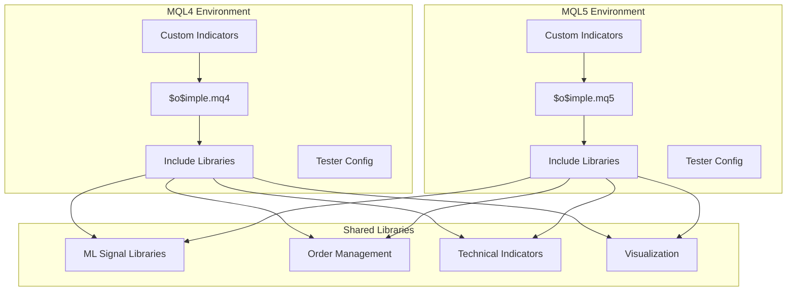
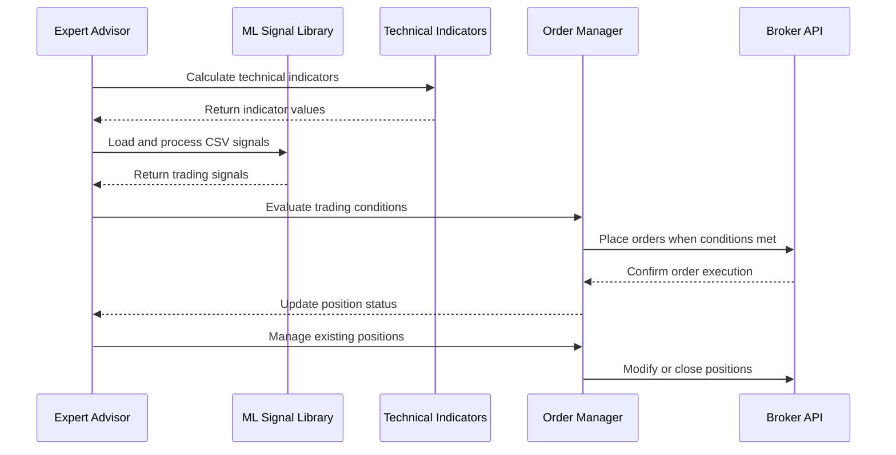
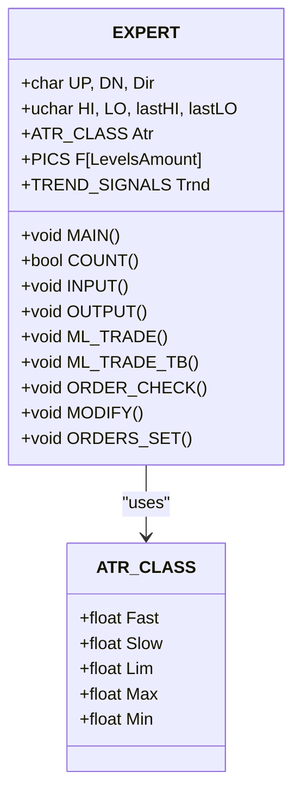
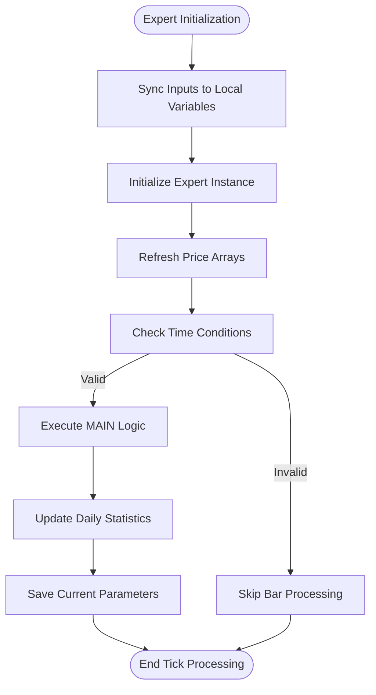
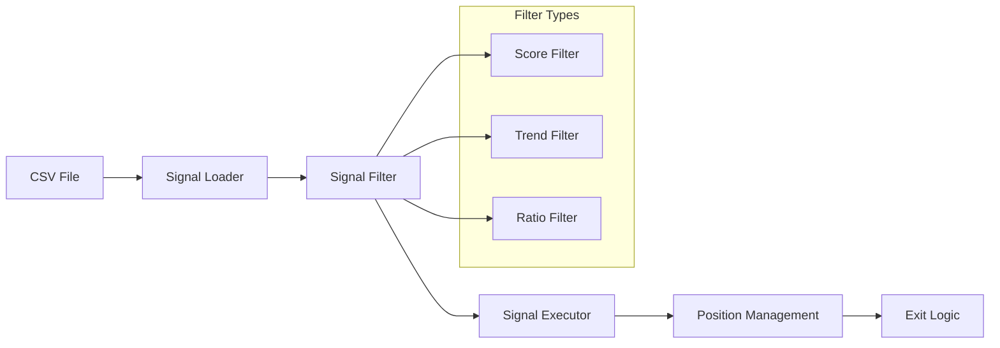
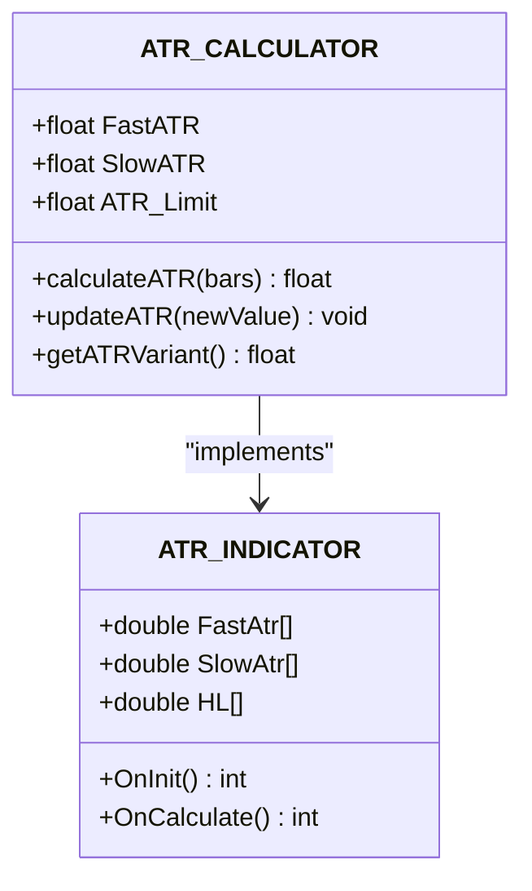
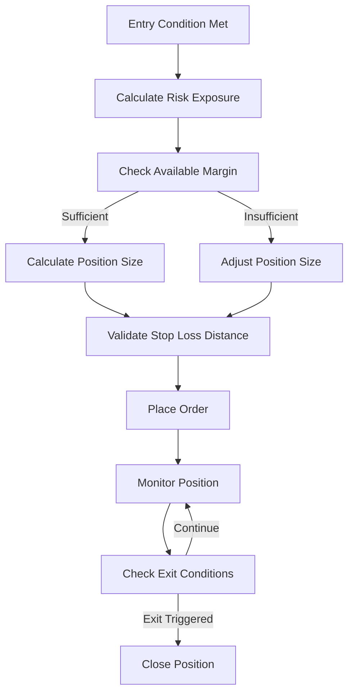
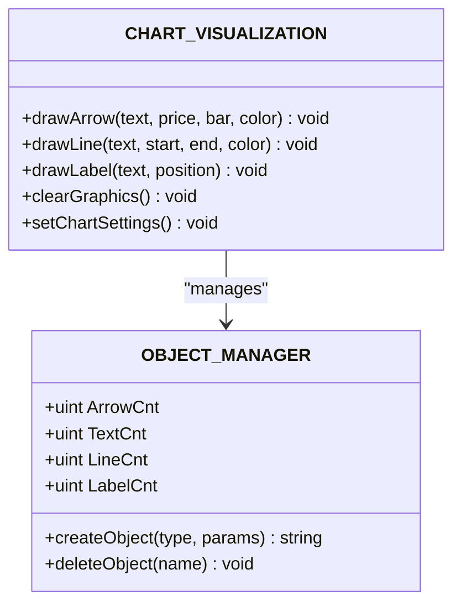
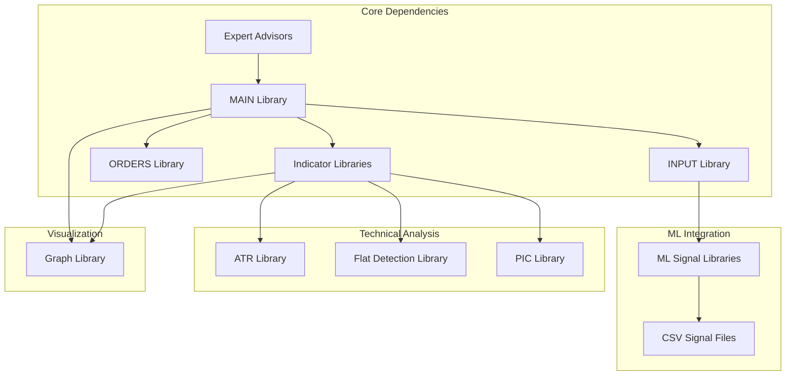

# MetaTrader Integration

<cite>
**Referenced Files in This Document**
- [$o$imple.mq4](file://MT/MQL4/Experts/$o$imple.mq4)
- [$o$imple.mq5](file://MT/MQL5/Experts/$o$imple.mq5)
- [lib_ML_Signal.mqh](file://MT/MQL4/Include/lib_ML_Signal.mqh)
- [lib_ML_Signal.mqh](file://MT/MQL5/Include/lib_ML_Signal.mqh)
- [lib_ML_Signal_TB.mqh](file://MT/MQL4/Include/lib_ML_Signal_TB.mqh)
- [MAIN.mqh](file://MT/MQL4/Include/MAIN.mqh)
- [MAIN.mqh](file://MT/MQL5/Include/MAIN.mqh)
- [INPUT.mqh](file://MT/MQL4/Include/INPUT.mqh)
- [ORDERS.mqh](file://MT/MQL4/Include/ORDERS.mqh)
- [iGRAPH.mqh](file://MT/MQL4/Include/iGRAPH.mqh)
- [lib_ATR.mqh](file://MT/MQL4/Include/lib_ATR.mqh)
- [lib_Flat.mqh](file://MT/MQL4/Include/lib_Flat.mqh)
- [iATR.mq4](file://MT/MQL4/Indicators/iATR.mq4)
- [iPIC.mq4](file://MT/MQL4/Indicators/iPIC.mq4)
- [lastparameters.ini](file://MT/tester/lastparameters.ini)
</cite>

## Table of Contents
1. [Introduction](#introduction)
2. [Project Structure](#project-structure)
3. [Core Components](#core-components)
4. [Architecture Overview](#architecture-overview)
5. [Detailed Component Analysis](#detailed-component-analysis)
6. [Dependency Analysis](#dependency-analysis)
7. [Performance Considerations](#performance-considerations)
8. [Troubleshooting Guide](#troubleshooting-guide)
9. [Conclusion](#conclusion)

## Introduction
This document provides comprehensive MetaTrader integration documentation for the SoSimple trading system. It covers the expert advisor implementation, custom indicator development, and library integration patterns for both MQL4 and MQL5 environments. The focus areas include the MQL4/MQL5 codebase structure, trading logic implementation, order management systems, risk controls, CSV-based signal delivery mechanisms, technical indicator calculations, and visualization components. Guidance is also provided for MetaTrader platform configuration, expert advisor deployment, and integration with external machine learning services.

## Project Structure
The SoSimple MetaTrader integration is organized into distinct layers:
- Expert Advisors: MQL4 ($o$imple.mq4) and MQL5 ($o$imple.mq5) implementations
- Library Modules: Shared libraries for ML signal processing, order management, technical indicators, and visualization
- Custom Indicators: Specialized indicators for ATR visualization and pattern recognition
- Tester Configuration: Automated testing parameters and preset configurations

**Diagram sources**
- [$o$imple.mq4:123-149](file://MT/MQL4/Experts/$o$imple.mq4#L123-L149)
- [$o$imple.mq5:137-147](file://MT/MQL5/Experts/$o$imple.mq5#L137-L147)

**Section sources**
- [$o$imple.mq4:1-149](file://MT/MQL4/Experts/$o$imple.mq4#L1-L149)
- [$o$imple.mq5:1-157](file://MT/MQL5/Experts/$o$imple.mq5#L1-L157)

## Core Components
The SoSimple system comprises several core components that work together to deliver automated trading functionality:

### Expert Advisor Implementation
The expert advisors serve as the primary trading engine, implementing sophisticated trading logic with multiple signal sources and risk management features.

### ML Signal Integration
The system integrates with external machine learning services through CSV-based signal delivery mechanisms, supporting both parity-check and triple barrier approaches.

### Technical Indicator Framework
Custom indicators provide advanced chart visualization and pattern recognition capabilities, including ATR calculations and level detection.

### Order Management System
A robust order management system handles position sizing, risk controls, and execution logic with support for both real trading and backtesting environments.

**Section sources**
- [lib_ML_Signal.mqh:1-951](file://MT/MQL4/Include/lib_ML_Signal.mqh#L1-L951)
- [lib_ML_Signal.mqh:1-325](file://MT/MQL5/Include/lib_ML_Signal.mqh#L1-L325)
- [lib_ML_Signal_TB.mqh:1-215](file://MT/MQL4/Include/lib_ML_Signal_TB.mqh#L1-L215)

## Architecture Overview
The SoSimple MetaTrader integration follows a modular architecture with clear separation of concerns:

**Diagram sources**
- [MAIN.mqh:117-143](file://MT/MQL4/Include/MAIN.mqh#L117-L143)
- [INPUT.mqh:3-54](file://MT/MQL4/Include/INPUT.mqh#L3-L54)
- [ORDERS.mqh:5-13](file://MT/MQL4/Include/ORDERS.mqh#L5-L13)

The architecture supports dual-mode operation:
- **Direct ML Mode**: Executes ML-generated signals directly from CSV files
- **Traditional Mode**: Uses internal technical analysis signals with ML filters

**Section sources**
- [MAIN.mqh:117-143](file://MT/MQL4/Include/MAIN.mqh#L117-L143)
- [MAIN.mqh:131-143](file://MT/MQL5/Include/MAIN.mqh#L131-L143)

## Detailed Component Analysis

### Expert Advisor Implementation

#### MQL4 Expert Advisor ($o$imple.mq4)
The MQL4 implementation provides comprehensive trading functionality with extensive parameter customization:

**Diagram sources**
- [MAIN.mqh:10-109](file://MT/MQL4/Include/MAIN.mqh#L10-L109)

Key features include:
- **Parameter-driven trading**: Extensive input parameters for signal generation and risk management
- **Multi-mode operation**: Supports both traditional technical analysis and ML signal execution
- **Advanced risk controls**: Dynamic position sizing and margin management
- **Visualization support**: Comprehensive chart annotation and drawing capabilities

#### MQL5 Expert Advisor ($o$imple.mq5)
The MQL5 implementation builds upon the MQL4 foundation with modernized syntax and enhanced functionality:

**Diagram sources**
- [$o$imple.mq5:137-147](file://MT/MQL5/Experts/$o$imple.mq5#L137-L147)

**Section sources**
- [$o$imple.mq4:123-149](file://MT/MQL4/Experts/$o$imple.mq4#L123-L149)
- [$o$imple.mq5:137-147](file://MT/MQL5/Experts/$o$imple.mq5#L137-L147)

### ML Signal Integration

#### CSV-Based Signal Delivery
The system implements two primary ML integration modes:

**Direct Parity-Check Mode (MLP)**: Executes signals directly from CSV files without intermediate processing
- **File Format**: `time;signal;pred_ret_24_dir_atr`
- **Features**: Real-time signal loading, score filtering, multi-position support
- **Exit Modes**: Timeout-based or trailing-stop based exits

**Triple Barrier Mode (TB)**: Uses fixed SL/TP levels from CSV files
- **File Format**: `time;signal;sl_atr;tp_atr;prob;ev`
- **Features**: Pre-calculated risk-reward ratios, probability thresholds
- **Integration**: Seamless switching between ML modes via parameter selection

**Diagram sources**
- [lib_ML_Signal.mqh:457-551](file://MT/MQL4/Include/lib_ML_Signal.mqh#L457-L551)
- [lib_ML_Signal_TB.mqh:46-99](file://MT/MQL4/Include/lib_ML_Signal_TB.mqh#L46-L99)

**Section sources**
- [lib_ML_Signal.mqh:1-951](file://MT/MQL4/Include/lib_ML_Signal.mqh#L1-L951)
- [lib_ML_Signal.mqh:1-325](file://MT/MQL5/Include/lib_ML_Signal.mqh#L1-L325)
- [lib_ML_Signal_TB.mqh:1-215](file://MT/MQL4/Include/lib_ML_Signal_TB.mqh#L1-L215)

### Technical Indicator Framework

#### ATR Calculation Engine
The system implements sophisticated ATR calculation with multiple variants:

**Diagram sources**
- [lib_ATR.mqh:2-47](file://MT/MQL4/Include/lib_ATR.mqh#L2-L47)
- [iATR.mq4:46-96](file://MT/MQL4/Indicators/iATR.mq4#L46-L96)

#### Pattern Recognition Indicators
The system includes advanced pattern recognition capabilities:

**iPIC Indicator**: Implements sophisticated fractal level detection and pattern recognition
- **Features**: Multi-level pattern detection, false breakout identification, trend confirmation
- **Visualization**: Comprehensive chart annotations and drawing capabilities
- **Integration**: Seamless integration with expert advisor trading logic

**Technical Analysis Features**:
- **Level Detection**: Sophisticated support/resistance level identification
- **Pattern Recognition**: Advanced breakout and reversal pattern detection
- **Trend Analysis**: Multi-timeframe trend assessment and confirmation

**Section sources**
- [lib_ATR.mqh:2-47](file://MT/MQL4/Include/lib_ATR.mqh#L2-L47)
- [iATR.mq4:1-98](file://MT/MQL4/Indicators/iATR.mq4#L1-L98)
- [iPIC.mq4:1-153](file://MT/MQL4/Indicators/iPIC.mq4#L1-L153)

### Order Management System

#### Position Sizing and Risk Control
The order management system implements sophisticated risk management:

**Diagram sources**
- [ORDERS.mqh:5-13](file://MT/MQL4/Include/ORDERS.mqh#L5-L13)

#### Multi-Position Support
The system supports concurrent position management:
- **Dynamic Position Limits**: Configurable maximum concurrent positions
- **Risk Distribution**: Intelligent risk allocation across multiple positions
- **Exit Coordination**: Coordinated exit strategies for multiple positions

**Section sources**
- [ORDERS.mqh:1-401](file://MT/MQL4/Include/ORDERS.mqh#L1-L401)

### Visualization Components

#### Chart Annotation System
The visualization system provides comprehensive chart annotation capabilities:

**Diagram sources**
- [iGRAPH.mqh:136-191](file://MT/MQL4/Include/iGRAPH.mqh#L136-L191)

**Section sources**
- [iGRAPH.mqh:1-452](file://MT/MQL4/Include/iGRAPH.mqh#L1-L452)

## Dependency Analysis

### Component Interdependencies
The SoSimple system exhibits well-defined dependency relationships:

**Diagram sources**
- [MAIN.mqh:114-116](file://MT/MQL4/Include/MAIN.mqh#L114-L116)
- [INPUT.mqh:17-21](file://MT/MQL4/Include/INPUT.mqh#L17-L21)

### Library Integration Patterns
The system employs several integration patterns:

**Strategy Pattern**: Different signal sources (technical vs ML) are implemented as interchangeable strategies
**Observer Pattern**: Chart updates and order status changes trigger appropriate reactions
**Template Method Pattern**: Common trading logic is standardized while allowing customization

**Section sources**
- [MAIN.mqh:114-116](file://MT/MQL4/Include/MAIN.mqh#L114-L116)
- [INPUT.mqh:17-21](file://MT/MQL4/Include/INPUT.mqh#L17-L21)

## Performance Considerations

### Optimization Strategies
The SoSimple system implements several performance optimization techniques:

**Efficient Memory Management**:
- Dynamic array resizing to minimize memory overhead
- Lazy initialization of expensive components
- Efficient signal loading and caching mechanisms

**Computational Efficiency**:
- Binary search algorithms for signal lookup
- Optimized indicator calculations with proper array handling
- Minimal redraw operations during chart updates

**Resource Management**:
- Proper cleanup of chart objects and graphics
- Efficient file I/O operations for CSV processing
- Thread-safe operations for multi-expert environments

### Platform-Specific Optimizations
- **MQL4**: Leverages optimized built-in functions and efficient array operations
- **MQL5**: Utilizes enhanced memory management and improved performance characteristics
- **Cross-platform compatibility**: Consistent behavior across different MetaQuotes versions

## Troubleshooting Guide

### Common Integration Issues

#### CSV Signal Loading Problems
**Issue**: Signals not loading from CSV files
**Solution**: Verify file path, format compliance, and encoding settings

#### Order Execution Failures
**Issue**: Orders not being placed or modified correctly
**Solution**: Check stop level proximity, margin availability, and broker connectivity

#### Indicator Visualization Issues
**Issue**: Chart annotations not appearing or displaying incorrectly
**Solution**: Verify chart settings, object creation permissions, and memory limits

#### Performance Degradation
**Issue**: Slow execution or excessive resource consumption
**Solution**: Review array sizes, optimize loops, and implement proper cleanup procedures

### Diagnostic Tools
The system includes comprehensive diagnostic capabilities:
- **Signal Processing Logs**: Detailed logging of CSV signal processing
- **Order Management Reports**: Complete order lifecycle tracking
- **Performance Metrics**: Real-time performance monitoring and reporting

**Section sources**
- [lib_ML_Signal.mqh:416-448](file://MT/MQL4/Include/lib_ML_Signal.mqh#L416-L448)
- [ORDERS.mqh:143-156](file://MT/MQL4/Include/ORDERS.mqh#L143-L156)

## Conclusion
The SoSimple MetaTrader integration provides a comprehensive, production-ready trading solution that combines advanced technical analysis with machine learning-driven signals. The modular architecture ensures maintainability and extensibility, while the robust risk management and order execution systems provide reliable operation across different market conditions.

Key strengths of the implementation include:
- **Flexible Signal Integration**: Support for multiple ML signal sources and formats
- **Advanced Risk Controls**: Sophisticated position sizing and margin management
- **Comprehensive Visualization**: Rich chart annotation and technical analysis capabilities
- **Production-Ready Architecture**: Well-tested patterns suitable for live trading environments

The system serves as a solid foundation for automated trading strategies and can be extended to accommodate additional signal sources, trading instruments, and market conditions.