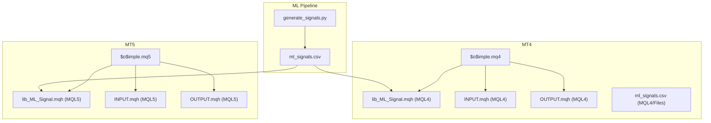
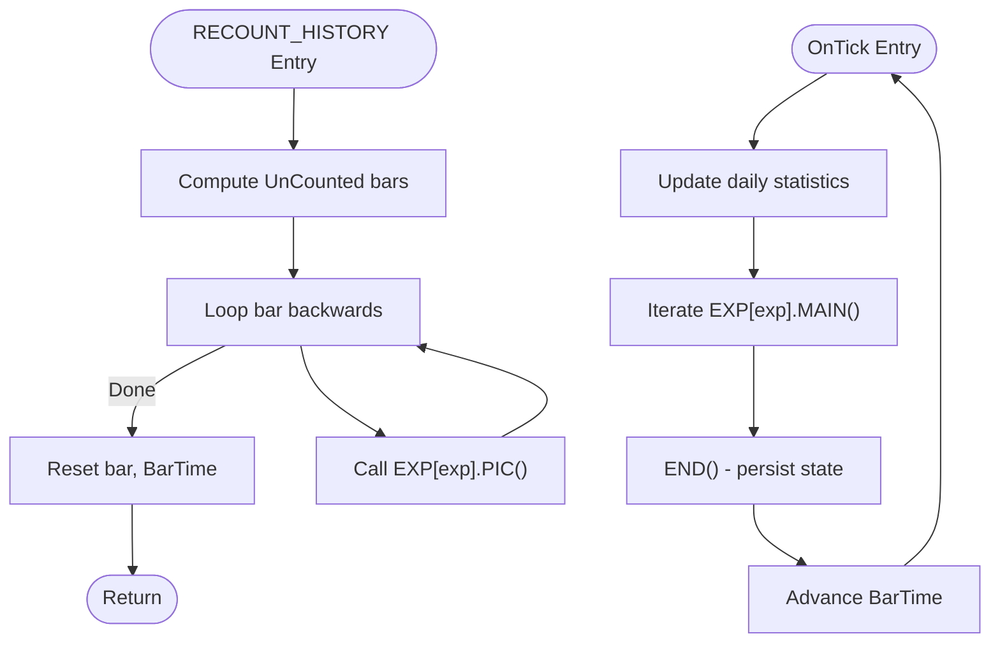
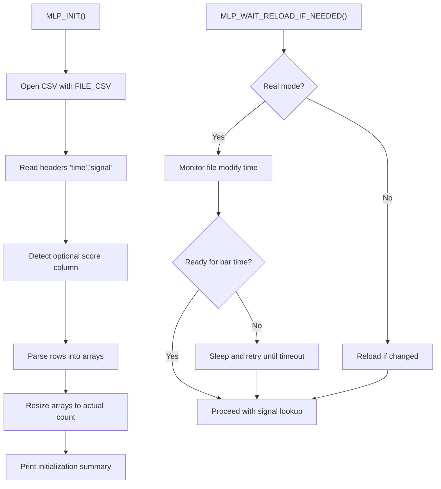
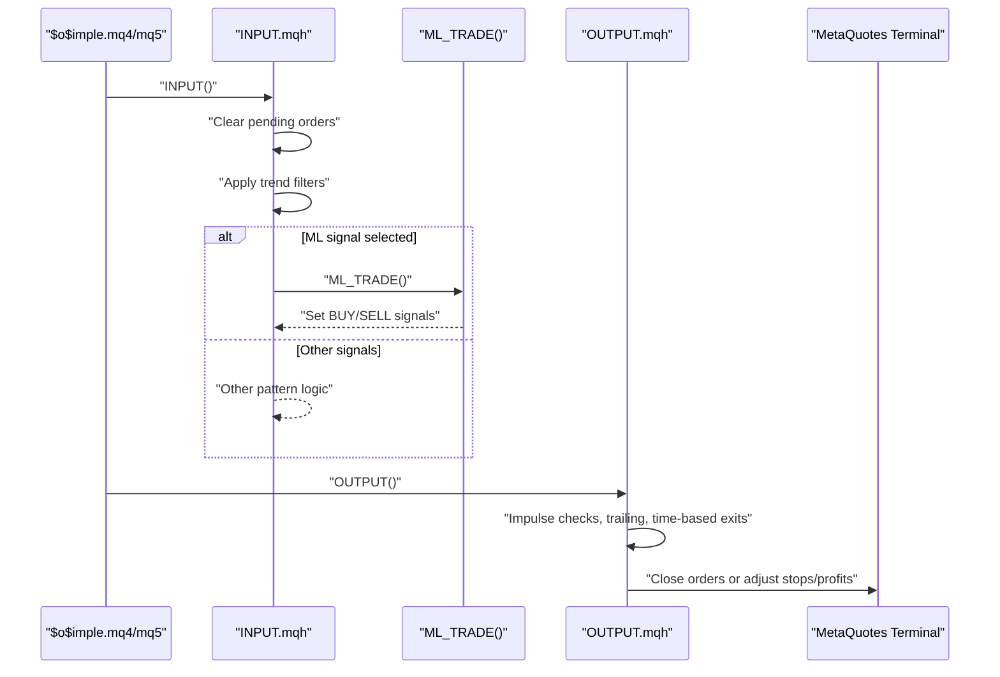
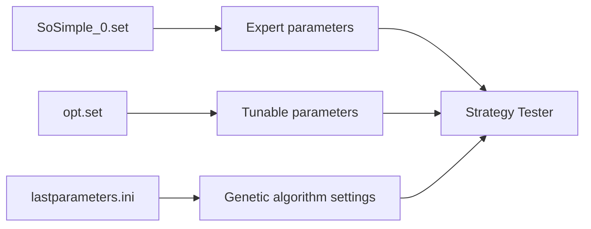
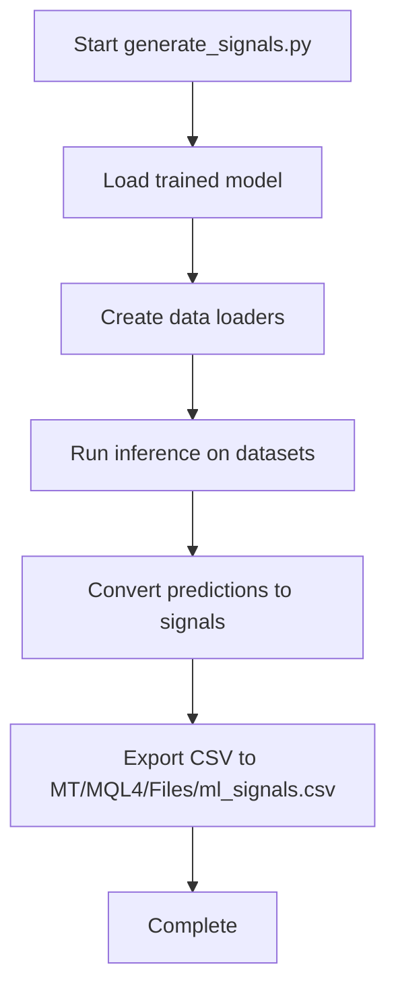
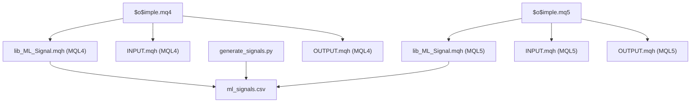

# Platform Configuration and Integration

<cite>
**Referenced Files in This Document**
- [$o$imple.mq4](file://MT/MQL4/Experts/$o$imple.mq4)
- [$o$imple.mq5](file://MT/MQL5/Experts/$o$imple.mq5)
- [lib_ML_Signal.mqh (MQL4)](file://MT/MQL4/Include/lib_ML_Signal.mqh)
- [lib_ML_Signal.mqh (MQL5)](file://MT/MQL5/Include/lib_ML_Signal.mqh)
- [INPUT.mqh (MQL4)](file://MT/MQL4/Include/INPUT.mqh)
- [INPUT.mqh (MQL5)](file://MT/MQL5/Include/INPUT.mqh)
- [OUTPUT.mqh (MQL4)](file://MT/MQL4/Include/OUTPUT.mqh)
- [OUTPUT.mqh (MQL5)](file://MT/MQL5/Include/OUTPUT.mqh)
- [FUNCTIONS.mqh (MQL4)](file://MT/MQL4/Include/FUNCTIONS.mqh)
- [FUNCTIONS.mqh (MQL5)](file://MT/MQL5/Include/FUNCTIONS.mqh)
- [SoSimple_0.set](file://MT/tester/files/SoSimple_0.set)
- [lastparameters.ini](file://MT/tester/lastparameters.ini)
- [opt.set](file://MT/tester/opt.set)
- [generate_signals.py](file://API/generate_signals.py)
- [ml_signals.csv](file://MT/MQL4/Files/ml_signals.csv)
</cite>

## Table of Contents
1. [Introduction](#introduction)
2. [Project Structure](#project-structure)
3. [Core Components](#core-components)
4. [Architecture Overview](#architecture-overview)
5. [Detailed Component Analysis](#detailed-component-analysis)
6. [Dependency Analysis](#dependency-analysis)
7. [Performance Considerations](#performance-considerations)
8. [Troubleshooting Guide](#troubleshooting-guide)
9. [Conclusion](#conclusion)

## Introduction
This document provides comprehensive guidance for configuring and integrating the SoSimple trading system with MetaTrader platforms (MT4 and MT5). It covers expert advisor deployment, CSV-based signal integration, tester configuration, performance optimization, platform-specific considerations, and production best practices. The system leverages externally generated machine learning signals exported to CSV files and consumed by dedicated MQL libraries to execute trades within MetaTrader environments.

## Project Structure
The SoSimple repository organizes platform integration assets under the MT directory, separating MQL4 and MQL5 implementations, tester configurations, and shared include libraries. Key elements include:
- Expert Advisors: MQL4 ($o$imple.mq4) and MQL5 ($o$imple.mq5)
- Signal processing libraries: lib_ML_Signal.mqh for both platforms
- Input/Output orchestration: INPUT.mqh and OUTPUT.mqh
- Tester presets and optimization sets
- ML signal generation pipeline via generate_signals.py



**Diagram sources**
- [$o$imple.mq4:1-149](file://MT/MQL4/Experts/$o$imple.mq4#L1-L149)
- [$o$imple.mq5:1-157](file://MT/MQL5/Experts/$o$imple.mq5#L1-L157)
- [lib_ML_Signal.mqh (MQL4):1-951](file://MT/MQL4/Include/lib_ML_Signal.mqh#L1-L951)
- [lib_ML_Signal.mqh (MQL5):1-325](file://MT/MQL5/Include/lib_ML_Signal.mqh#L1-L325)
- [INPUT.mqh (MQL4):1-251](file://MT/MQL4/Include/INPUT.mqh#L1-L251)
- [INPUT.mqh (MQL5):1-252](file://MT/MQL5/Include/INPUT.mqh#L1-L252)
- [OUTPUT.mqh (MQL4):1-328](file://MT/MQL4/Include/OUTPUT.mqh#L1-L328)
- [OUTPUT.mqh (MQL5):1-302](file://MT/MQL5/Include/OUTPUT.mqh#L1-L302)
- [generate_signals.py:1-200](file://API/generate_signals.py#L1-L200)
- [ml_signals.csv:1-200](file://MT/MQL4/Files/ml_signals.csv#L1-L200)

**Section sources**
- [$o$imple.mq4:1-149](file://MT/MQL4/Experts/$o$imple.mq4#L1-L149)
- [$o$imple.mq5:1-157](file://MT/MQL5/Experts/$o$imple.mq5#L1-L157)
- [lib_ML_Signal.mqh (MQL4):1-951](file://MT/MQL4/Include/lib_ML_Signal.mqh#L1-L951)
- [lib_ML_Signal.mqh (MQL5):1-325](file://MT/MQL5/Include/lib_ML_Signal.mqh#L1-L325)
- [INPUT.mqh (MQL4):1-251](file://MT/MQL4/Include/INPUT.mqh#L1-L251)
- [INPUT.mqh (MQL5):1-252](file://MT/MQL5/Include/INPUT.mqh#L1-L252)
- [OUTPUT.mqh (MQL4):1-328](file://MT/MQL4/Include/OUTPUT.mqh#L1-L328)
- [OUTPUT.mqh (MQL5):1-302](file://MT/MQL5/Include/OUTPUT.mqh#L1-L302)
- [generate_signals.py:1-200](file://API/generate_signals.py#L1-L200)
- [ml_signals.csv:1-200](file://MT/MQL4/Files/ml_signals.csv#L1-L200)

## Core Components
- Expert Advisors (MT4/MT5): Orchestrates trading logic, parameter synchronization, and lifecycle hooks (OnTick, RECOUNT_HISTORY).
- ML Signal Library: Loads and interprets CSV signals, manages position sizing, trailing stops, and exit conditions.
- Input/Output Modules: Define entry criteria, manage order placement, and enforce exit rules.
- Tester Configuration: Predefined sets for optimization and backtesting parameters.

Key configuration options exposed by the experts include:
- Risk management parameters (Risk, MM, MaxRisk)
- Pattern recognition filters (PicPer, FltLen, PicCnt, PicPwr, PicImp, Rev, Days, MidTyp)
- Trend filters (iGlb, iFlt, iLoc)
- ATR settings (A, a, Ak, PicVal)
- Signal selection (iSignal, iParam, Target)
- Order parameters (D, Stp, Prf)
- Output controls (oImp, oFlt, oGlb, oLoc, Trl, Wknd)
- Time-based filters (tk, T0, T1, tp)
- ML optimization parameters (ML_MinRatio, ML_MaxRatio, ML_MaxRR, ML_RR_Mode, ML_RR_Cap, ML_ScaleK, ML_Min_SL_ATR, ML_BypassTrend, ML_ExitEnabled, ML_ExitThreshold, ML_Filter3, ML_Filter6, ML_Trl_Start_ATR, ML_Trl_Step_ATR, ML_ExitMode, ML_TrailATR, ML_TakeProfitATR, ML_MaxPositions, ML_HoldBars, ML_AllowReversal, ML_UseScoreFilter, ML_ScoreThreshold, ML_BackStopATR)

**Section sources**
- [$o$imple.mq4:8-82](file://MT/MQL4/Experts/$o$imple.mq4#L8-L82)
- [$o$imple.mq5:7-98](file://MT/MQL5/Experts/$o$imple.mq5#L7-L98)
- [INPUT.mqh (MQL4):14-21](file://MT/MQL4/Include/INPUT.mqh#L14-L21)
- [INPUT.mqh (MQL5):14-21](file://MT/MQL5/Include/INPUT.mqh#L14-L21)
- [OUTPUT.mqh (MQL4):6-61](file://MT/MQL4/Include/OUTPUT.mqh#L6-L61)
- [OUTPUT.mqh (MQL5):6-61](file://MT/MQL5/Include/OUTPUT.mqh#L6-L61)

## Architecture Overview
The SoSimple trading system integrates ML-generated signals with MetaTrader through a layered architecture:
- ML Pipeline: generate_signals.py produces CSV files containing time-stamped signals and optional predictive scores.
- Signal Library: lib_ML_Signal.mqh loads CSV, validates headers, parses rows, and maintains internal arrays for fast lookup.
- Expert Advisor: Coordinates signal consumption, position sizing, and exits based on configured parameters.
- Input/Output: Translates parsed signals into executable orders and manages trailing stops and time-based exits.

```mermaid
sequenceDiagram
participant GEN as "generate_signals.py"
participant CSV as "ml_signals.csv"
participant EA as "$o$imple.mq4/mq5"
participant LIB as "lib_ML_Signal.mqh"
participant MT as "MetaQuotes Terminal"
GEN->>CSV : "Export CSV with time;signal[,pred_ret_24_dir_atr]"
EA->>LIB : "Initialize signal loader"
LIB->>CSV : "Open and parse CSV"
CSV-->>LIB : "Rows loaded into arrays"
EA->>LIB : "FindSignal(Time[bar])"
LIB-->>EA : "Signal index or none"
EA->>MT : "Place market orders with ML_* parameters"
MT-->>EA : "Execution results"
EA->>LIB : "Manage positions (trailing/timeout)"
```

**Diagram sources**
- [generate_signals.py:1-200](file://API/generate_signals.py#L1-L200)
- [lib_ML_Signal.mqh (MQL4):457-551](file://MT/MQL4/Include/lib_ML_Signal.mqh#L457-L551)
- [lib_ML_Signal.mqh (MQL5):55-131](file://MT/MQL5/Include/lib_ML_Signal.mqh#L55-L131)
- [$o$imple.mq4:123-132](file://MT/MQL4/Experts/$o$imple.mq4#L123-L132)
- [$o$imple.mq5:137-147](file://MT/MQL5/Experts/$o$imple.mq5#L137-L147)

## Detailed Component Analysis

### Expert Advisor Deployment (MT4 and MT5)
- Compilation: Both MQL4 and MQL5 experts compile with strict mode and include platform-specific compatibility headers.
- Parameter Exposure: Inputs are declared as extern/input with defaults suitable for backtesting and optimization.
- Lifecycle Hooks:
  - OnTick: Updates daily statistics, iterates experts, executes MAIN logic, and persists state.
  - RECOUNT_HISTORY: Recalculates historical patterns for initial bars when needed.



**Diagram sources**
- [$o$imple.mq4:123-147](file://MT/MQL4/Experts/$o$imple.mq4#L123-L147)
- [$o$imple.mq5:137-147](file://MT/MQL5/Experts/$o$imple.mq5#L137-L147)

**Section sources**
- [$o$imple.mq4:1-149](file://MT/MQL4/Experts/$o$imple.mq4#L1-L149)
- [$o$imple.mq5:1-157](file://MT/MQL5/Experts/$o$imple.mq5#L1-L157)

### CSV-Based Signal Integration
- Signal File: ml_signals.csv contains time-stamped entries with signal values and optional predictive scores.
- Loader Behavior:
  - Header validation ensures "time;signal" exists.
  - Optional score column detection enables filtering thresholds.
  - Binary search locates signals for the current bar time.
  - Real-time reload checks file modification timestamps.
- Position Management:
  - Multi-position support configurable via ML_MaxPositions.
  - Timeout-based exits and trailing-stop exits controlled by ML_ExitMode.
  - Score filtering based on ML_ScoreThreshold and ML_UseScoreFilter.



**Diagram sources**
- [lib_ML_Signal.mqh (MQL4):457-551](file://MT/MQL4/Include/lib_ML_Signal.mqh#L457-L551)
- [lib_ML_Signal.mqh (MQL4):567-601](file://MT/MQL4/Include/lib_ML_Signal.mqh#L567-L601)

**Section sources**
- [lib_ML_Signal.mqh (MQL4):1-951](file://MT/MQL4/Include/lib_ML_Signal.mqh#L1-L951)
- [lib_ML_Signal.mqh (MQL5):1-325](file://MT/MQL5/Include/lib_ML_Signal.mqh#L1-L325)
- [ml_signals.csv:1-200](file://MT/MQL4/Files/ml_signals.csv#L1-L200)

### Input/Output Orchestration
- INPUT Module:
  - Clears pending orders and resets signals.
  - Applies trend filters and pattern recognition.
  - Routes to ML_TRADE or ML_TRADE_TB based on iSignal selection.
  - Enforces order validation and replacement rules.
- OUTPUT Module:
  - Implements impulse checks, trend-based exits, and trailing stops.
  - Supports ML-specific trailing logic when iSignal=3.
  - Manages time-based exits and position blocking.



**Diagram sources**
- [INPUT.mqh (MQL4):3-54](file://MT/MQL4/Include/INPUT.mqh#L3-L54)
- [INPUT.mqh (MQL5):3-54](file://MT/MQL5/Include/INPUT.mqh#L3-L54)
- [OUTPUT.mqh (MQL4):6-61](file://MT/MQL4/Include/OUTPUT.mqh#L6-L61)
- [OUTPUT.mqh (MQL5):6-61](file://MT/MQL5/Include/OUTPUT.mqh#L6-L61)

**Section sources**
- [INPUT.mqh (MQL4):1-251](file://MT/MQL4/Include/INPUT.mqh#L1-L251)
- [INPUT.mqh (MQL5):1-252](file://MT/MQL5/Include/INPUT.mqh#L1-L252)
- [OUTPUT.mqh (MQL4):1-328](file://MT/MQL4/Include/OUTPUT.mqh#L1-L328)
- [OUTPUT.mqh (MQL5):1-302](file://MT/MQL5/Include/OUTPUT.mqh#L1-L302)

### Tester Setup and Optimization
- Tester Preset: SoSimple_0.set defines baseline parameters for backtesting and optimization runs.
- Optimization Set: opt.set enumerates tunable parameters with ranges and fitness modes.
- Global Tester Settings: lastparameters.ini configures optimization method, date range, and genetic algorithm parameters.



**Diagram sources**
- [SoSimple_0.set:1-42](file://MT/tester/files/SoSimple_0.set#L1-L42)
- [opt.set:1-269](file://MT/tester/opt.set#L1-L269)
- [lastparameters.ini:1-8](file://MT/tester/lastparameters.ini#L1-L8)

**Section sources**
- [SoSimple_0.set:1-42](file://MT/tester/files/SoSimple_0.set#L1-L42)
- [opt.set:1-269](file://MT/tester/opt.set#L1-L269)
- [lastparameters.ini:1-8](file://MT/tester/lastparameters.ini#L1-L8)

### ML Signal Generation Pipeline
- Purpose: Produce CSV files consumable by the MQL signal library.
- Features:
  - Loads trained models and applies inference across datasets.
  - Converts predictions to signals using configurable horizons and thresholds.
  - Supports conformal quantile filtering and triple barrier probability calibration.
  - Outputs CSV with sorted timestamps for efficient binary search.



**Diagram sources**
- [generate_signals.py:126-145](file://API/generate_signals.py#L126-L145)
- [generate_signals.py:147-178](file://API/generate_signals.py#L147-L178)

**Section sources**
- [generate_signals.py:1-200](file://API/generate_signals.py#L1-L200)
- [ml_signals.csv:1-200](file://MT/MQL4/Files/ml_signals.csv#L1-L200)

## Dependency Analysis
The system exhibits clear separation of concerns:
- Expert Advisors depend on shared include libraries for pattern recognition, order management, and ML signal processing.
- ML signal library depends on CSV files produced by the Python pipeline.
- Tester configuration files define parameter ranges and optimization strategies.



**Diagram sources**
- [$o$imple.mq4:100-122](file://MT/MQL4/Experts/$o$imple.mq4#L100-L122)
- [$o$imple.mq5:117-135](file://MT/MQL5/Experts/$o$imple.mq5#L117-L135)
- [lib_ML_Signal.mqh (MQL4):1-951](file://MT/MQL4/Include/lib_ML_Signal.mqh#L1-L951)
- [lib_ML_Signal.mqh (MQL5):1-325](file://MT/MQL5/Include/lib_ML_Signal.mqh#L1-L325)
- [INPUT.mqh (MQL4):1-251](file://MT/MQL4/Include/INPUT.mqh#L1-L251)
- [INPUT.mqh (MQL5):1-252](file://MT/MQL5/Include/INPUT.mqh#L1-L252)
- [OUTPUT.mqh (MQL4):1-328](file://MT/MQL4/Include/OUTPUT.mqh#L1-L328)
- [OUTPUT.mqh (MQL5):1-302](file://MT/MQL5/Include/OUTPUT.mqh#L1-L302)
- [generate_signals.py:1-200](file://API/generate_signals.py#L1-L200)
- [ml_signals.csv:1-200](file://MT/MQL4/Files/ml_signals.csv#L1-L200)

**Section sources**
- [$o$imple.mq4:100-122](file://MT/MQL4/Experts/$o$imple.mq4#L100-L122)
- [$o$imple.mq5:117-135](file://MT/MQL5/Experts/$o$imple.mq5#L117-L135)
- [lib_ML_Signal.mqh (MQL4):1-951](file://MT/MQL4/Include/lib_ML_Signal.mqh#L1-L951)
- [lib_ML_Signal.mqh (MQL5):1-325](file://MT/MQL5/Include/lib_ML_Signal.mqh#L1-L325)
- [INPUT.mqh (MQL4):1-251](file://MT/MQL4/Include/INPUT.mqh#L1-L251)
- [INPUT.mqh (MQL5):1-252](file://MT/MQL5/Include/INPUT.mqh#L1-L252)
- [OUTPUT.mqh (MQL4):1-328](file://MT/MQL4/Include/OUTPUT.mqh#L1-L328)
- [OUTPUT.mqh (MQL5):1-302](file://MT/MQL5/Include/OUTPUT.mqh#L1-L302)
- [generate_signals.py:1-200](file://API/generate_signals.py#L1-L200)
- [ml_signals.csv:1-200](file://MT/MQL4/Files/ml_signals.csv#L1-L200)

## Performance Considerations
- CSV Loading Efficiency: The MQL4 library performs binary search on sorted timestamps, minimizing lookup overhead.
- Real-Time Reloading: In real trading mode, the system monitors file modification timestamps to refresh signals dynamically.
- Position Management: Multi-position support requires careful tuning of ML_MaxPositions and exit modes to avoid over-concentration.
- Memory and Arrays: Signal arrays are pre-sized and resized to actual counts, reducing dynamic allocation overhead.
- Optimization Scope: Use opt.set ranges judiciously to prevent combinatorial explosion during genetic optimization.

[No sources needed since this section provides general guidance]

## Troubleshooting Guide
Common integration issues and resolutions:
- CSV Header Mismatch: Ensure the CSV starts with "time;signal". The loader validates headers and logs errors if mismatched.
- Empty Signal File: If no rows are loaded, the loader prints a diagnostic message. Verify the CSV path and content.
- Score Column Absent: If the optional score column is missing, score filtering is automatically disabled.
- File Modification Monitoring: In real mode, the system waits for file updates; ensure the CSV writer updates the modification timestamp.
- Position Blocking: When ML_MaxPositions is reached, new signals are skipped until existing positions are reduced.
- Exit Mode Configuration: Verify ML_ExitMode aligns with intended behavior (timeout vs trailing stop).
- Tester Parameter Conflicts: Validate that SoSimple_0.set and opt.set parameters are compatible with the chosen optimization method.

**Section sources**
- [lib_ML_Signal.mqh (MQL4):457-551](file://MT/MQL4/Include/lib_ML_Signal.mqh#L457-L551)
- [lib_ML_Signal.mqh (MQL4):567-601](file://MT/MQL4/Include/lib_ML_Signal.mqh#L567-L601)
- [SoSimple_0.set:1-42](file://MT/tester/files/SoSimple_0.set#L1-L42)
- [opt.set:1-269](file://MT/tester/opt.set#L1-L269)

## Conclusion
The SoSimple trading system provides a robust framework for integrating ML-generated signals with MetaTrader platforms. By leveraging CSV-based signal files, configurable expert advisors, and comprehensive tester presets, traders can deploy scalable, optimized strategies across MT4 and MT5. Proper configuration of ML parameters, position sizing, and exit rules ensures reliable performance in both backtesting and live environments.