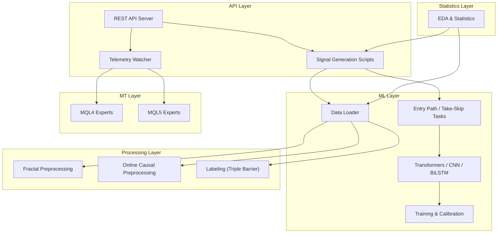
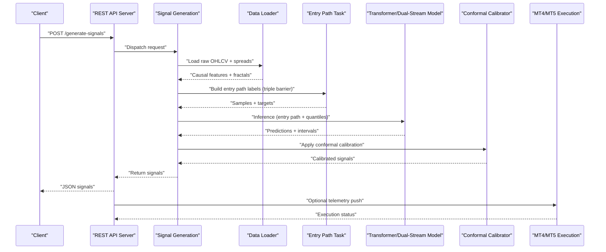
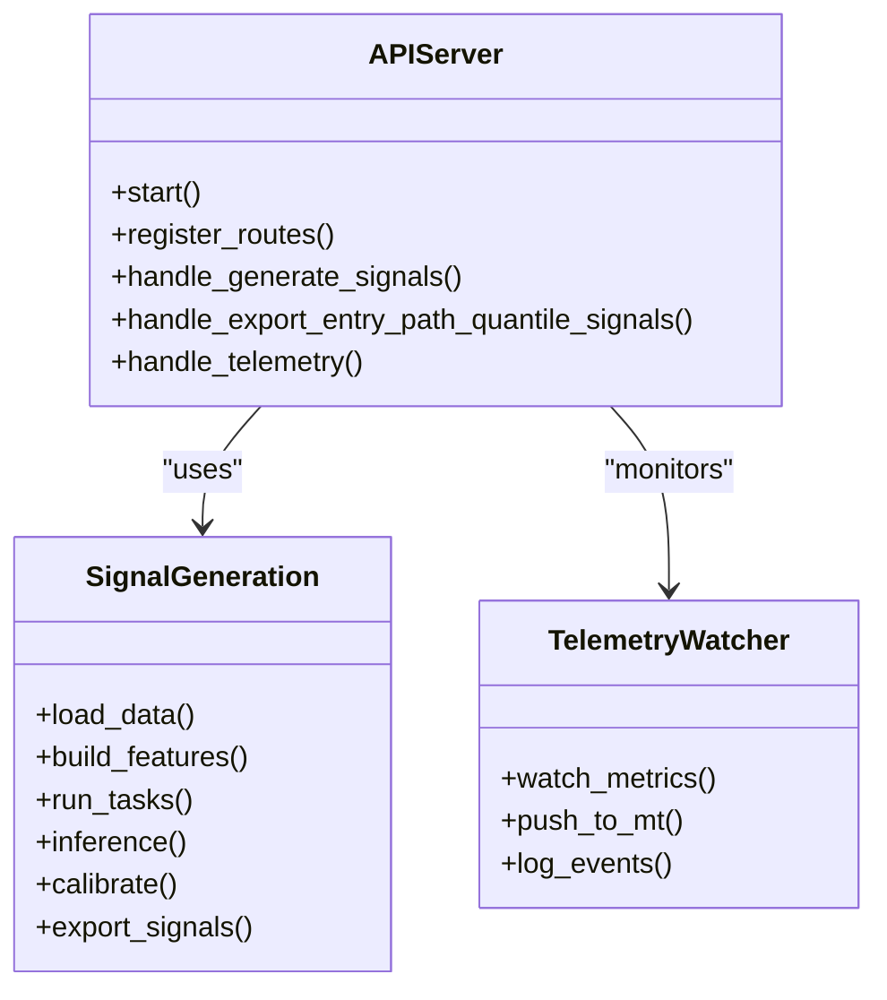
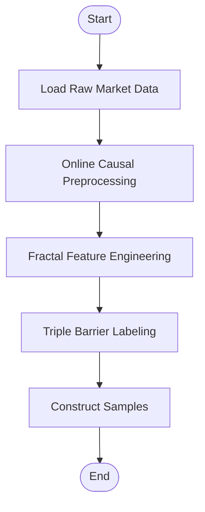
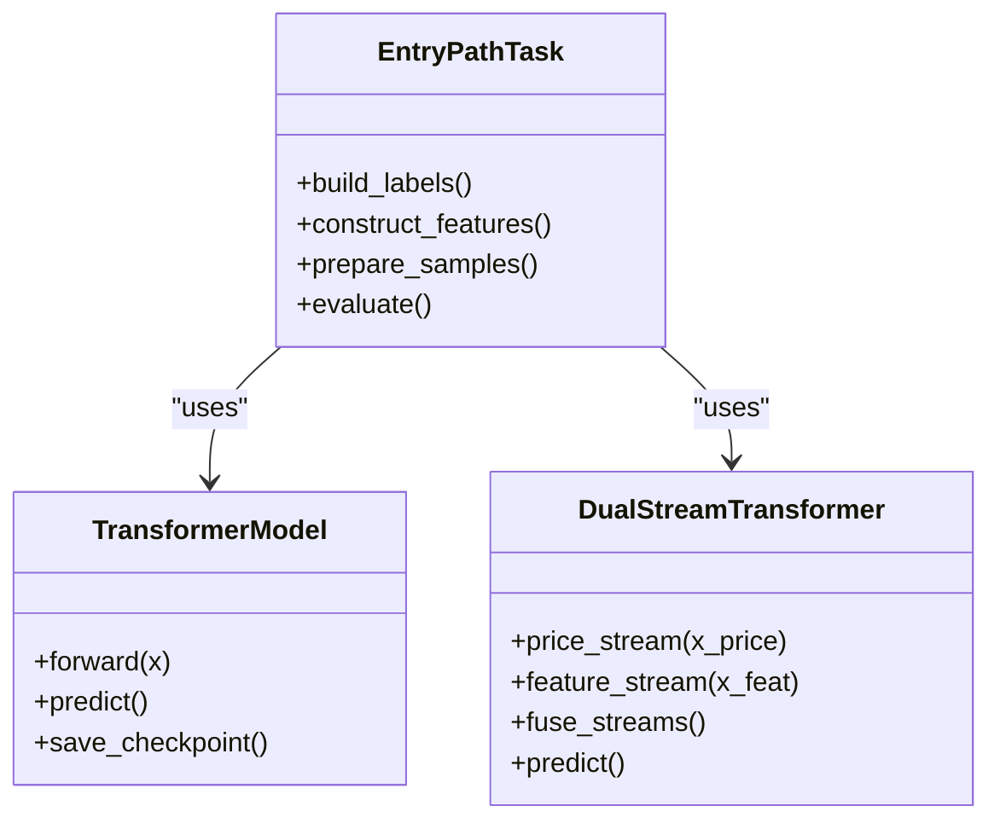
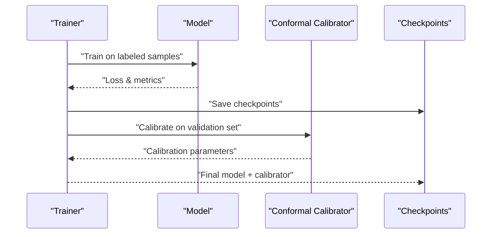
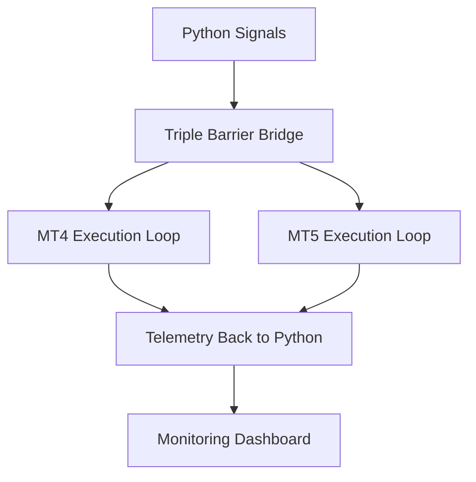
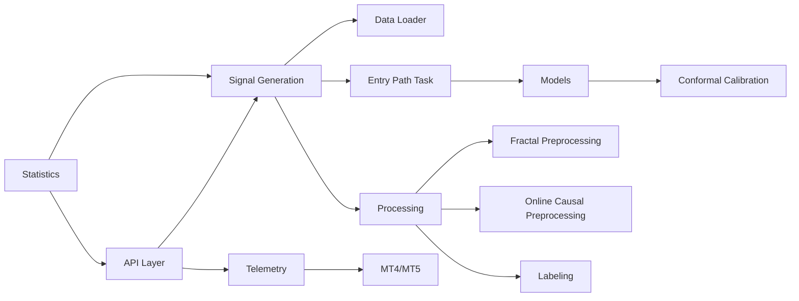

# Project Overview

<cite>
**Referenced Files in This Document**
- [README.md](file://README.md)
- [CONTEXT_HANDOFF.md](file://CONTEXT_HANDOFF.md)
- [MODULE_INDEX.md](file://MODULE_INDEX.md)
- [api_server.py](file://API/api_server.py)
- [generate_signals.py](file://API/generate_signals.py)
- [signal_path_atlas.py](file://API/signal_path_atlas.py)
- [telemetry_signal_watcher.py](file://API/telemetry_signal_watcher.py)
- [data_loader.py](file://ML/data_loader.py)
- [train.py](file://ML/train.py)
- [entry_path_v1_quantile_task.py](file://ML/entry_path_v1_quantile_task.py)
- [triple_barrier_mt4_execution.py](file://ML/triple_barrier_mt4_execution.py)
- [conformal/calibrate.py](file://ML/conformal/calibrate.py)
- [models/entry_path_transformer.py](file://ML/models/entry_path_transformer.py)
- [models/entry_path_dual_stream_transformer.py](file://ML/models/entry_path_dual_stream_transformer.py)
- [fractal_preprocessing.py](file://processing/fractal_preprocessing.py)
- [online_causal_preprocessing.py](file://processing/online_causal_preprocessing.py)
- [label_main.py](file://processing/label_main.py)
- [statistics.py](file://statistics/statistics.py)
- [test_api_client.py](file://API/test_api_client.py)
</cite>

## Table of Contents
1. [Introduction](#introduction)
2. [Project Structure](#project-structure)
3. [Core Components](#core-components)
4. [Architecture Overview](#architecture-overview)
5. [Detailed Component Analysis](#detailed-component-analysis)
6. [Dependency Analysis](#dependency-analysis)
7. [Performance Considerations](#performance-considerations)
8. [Troubleshooting Guide](#troubleshooting-guide)
9. [Conclusion](#conclusion)
10. [Appendices](#appendices)

## Introduction
SoSimple is a machine learning-powered algorithmic trading system that bridges research-grade Python models with live execution on MetaTrader 4 and MetaTrader 5. The platform combines neural network architectures (transformers, CNNs, BiLSTMs) with robust labeling and validation methodologies such as the triple barrier method, fractal analysis for feature engineering, and conformal prediction for calibrated uncertainty. A REST API exposes signal generation and telemetry endpoints to orchestrate end-to-end workflows from market data ingestion through model inference to order placement and monitoring.

The system targets both beginners new to algorithmic trading and experienced developers seeking a production-ready pipeline. It emphasizes causal preprocessing, strict validation freezes, walk-forward testing, and parity checks between Python research and MQL execution environments.

## Project Structure
At a high level, SoSimple organizes code into distinct layers:
- API layer: HTTP server, signal generation scripts, telemetry watchers, and client tests
- ML layer: data loading, tasks, models, training, calibration, and benchmarking
- Processing layer: fractal preprocessing, online causal preprocessing, labeling, normalization
- Statistics layer: exploratory data analysis, statistics utilities, and reporting
- MT layer: MQL4/MQL5 experts, indicators, libraries, and shared projects for execution
- Docs and wiki: methodology, audit reports, schemas, and conceptual guides

**Diagram sources**
- [api_server.py](file://API/api_server.py)
- [generate_signals.py](file://API/generate_signals.py)
- [telemetry_signal_watcher.py](file://API/telemetry_signal_watcher.py)
- [data_loader.py](file://ML/data_loader.py)
- [entry_path_v1_quantile_task.py](file://ML/entry_path_v1_quantile_task.py)
- [train.py](file://ML/train.py)
- [fractal_preprocessing.py](file://processing/fractal_preprocessing.py)
- [online_causal_preprocessing.py](file://processing/online_causal_preprocessing.py)
- [label_main.py](file://processing/label_main.py)
- [statistics.py](file://statistics/statistics.py)
- [MT4 README](file://MT/MQL4/README.md)
- [MT5 README](file://MT/MQL5/README.md)

**Section sources**
- [README.md](file://README.md)
- [CONTEXT_HANDOFF.md](file://CONTEXT_HANDOFF.md)
- [MODULE_INDEX.md](file://MODULE_INDEX.md)

## Core Components
- REST API Server: Exposes endpoints for generating signals, exporting entry path quantile signals, and watching telemetry. It coordinates data loading, task pipelines, and model inference.
- Signal Generation Pipeline: Orchestrates preprocessing, feature construction, model inference, and output formatting for downstream consumption by MT4/MT5 or external systems.
- ML Tasks and Models: Entry path tasks define labeling via triple barriers, feature engineering using fractals, and model architectures including transformers and dual-stream variants. Quantile modeling provides probabilistic outputs.
- Training and Calibration: Training routines support multiple architectures; conformal calibration ensures predictive intervals are statistically valid.
- Processing Utilities: Fractal preprocessing extracts multi-scale geometric features; online causal preprocessing ensures no leakage; labeling constructs triple barrier targets.
- Statistics and EDA: Tools for exploratory analysis, feature catalogs, and diagnostics.
- MT Integration: MQL4/MQL5 experts implement execution logic, risk controls, and telemetry back to the Python side.

Key terminology used throughout the codebase includes:
- Entry path: the predicted trajectory or sequence of price movements after an entry decision
- Triple barrier method: labeling scheme defining take-profit, stop-loss, and time-based exit
- Fractal analysis: multi-scale geometric feature extraction from price series
- Conformal prediction: post-hoc calibration producing statistically valid prediction sets

**Section sources**
- [api_server.py](file://API/api_server.py)
- [generate_signals.py](file://API/generate_signals.py)
- [signal_path_atlas.py](file://API/signal_path_atlas.py)
- [telemetry_signal_watcher.py](file://API/telemetry_signal_watcher.py)
- [data_loader.py](file://ML/data_loader.py)
- [entry_path_v1_quantile_task.py](file://ML/entry_path_v1_quantile_task.py)
- [train.py](file://ML/train.py)
- [conformal/calibrate.py](file://ML/conformal/calibrate.py)
- [fractal_preprocessing.py](file://processing/fractal_preprocessing.py)
- [online_causal_preprocessing.py](file://processing/online_causal_preprocessing.py)
- [label_main.py](file://processing/label_main.py)
- [statistics.py](file://statistics/statistics.py)

## Architecture Overview
The end-to-end flow starts with market data ingestion, proceeds through causal preprocessing and fractal feature engineering, then feeds labeled samples into ML tasks and models. Inference produces entry path predictions and quantiles, which are exposed via REST APIs. Telemetry watches monitor live performance and can trigger actions in MT4/MT5 experts.

**Diagram sources**
- [api_server.py](file://API/api_server.py)
- [generate_signals.py](file://API/generate_signals.py)
- [data_loader.py](file://ML/data_loader.py)
- [entry_path_v1_quantile_task.py](file://ML/entry_path_v1_quantile_task.py)
- [models/entry_path_transformer.py](file://ML/models/entry_path_transformer.py)
- [models/entry_path_dual_stream_transformer.py](file://ML/models/entry_path_dual_stream_transformer.py)
- [conformal/calibrate.py](file://ML/conformal/calibrate.py)
- [triple_barrier_mt4_execution.py](file://ML/triple_barrier_mt4_execution.py)

## Detailed Component Analysis

### REST API Server and Signal Generation
The API server exposes endpoints for generating signals and exporting entry path quantile signals. Signal generation scripts coordinate data loading, task execution, and model inference. Telemetry watchers monitor live metrics and can interact with MT4/MT5 execution loops.

**Diagram sources**
- [api_server.py](file://API/api_server.py)
- [generate_signals.py](file://API/generate_signals.py)
- [telemetry_signal_watcher.py](file://API/telemetry_signal_watcher.py)

**Section sources**
- [api_server.py](file://API/api_server.py)
- [generate_signals.py](file://API/generate_signals.py)
- [signal_path_atlas.py](file://API/signal_path_atlas.py)
- [telemetry_signal_watcher.py](file://API/telemetry_signal_watcher.py)
- [test_api_client.py](file://API/test_api_client.py)

### ML Data Loading and Processing
Data loaders ingest raw OHLCV and spread data, apply online causal preprocessing to prevent leakage, and construct fractal features across multiple scales. Labeling uses the triple barrier method to define take-profit, stop-loss, and time-based exits.

**Diagram sources**
- [data_loader.py](file://ML/data_loader.py)
- [online_causal_preprocessing.py](file://processing/online_causal_preprocessing.py)
- [fractal_preprocessing.py](file://processing/fractal_preprocessing.py)
- [label_main.py](file://processing/label_main.py)

**Section sources**
- [data_loader.py](file://ML/data_loader.py)
- [online_causal_preprocessing.py](file://processing/online_causal_preprocessing.py)
- [fractal_preprocessing.py](file://processing/fractal_preprocessing.py)
- [label_main.py](file://processing/label_main.py)

### Entry Path Tasks and Models
Entry path tasks define the problem formulation, including labeling via triple barriers and feature construction. Models include transformer-based architectures and dual-stream variants that jointly process price paths and auxiliary features. Quantile modeling outputs probabilistic predictions.

**Diagram sources**
- [entry_path_v1_quantile_task.py](file://ML/entry_path_v1_quantile_task.py)
- [models/entry_path_transformer.py](file://ML/models/entry_path_transformer.py)
- [models/entry_path_dual_stream_transformer.py](file://ML/models/entry_path_dual_stream_transformer.py)

**Section sources**
- [entry_path_v1_quantile_task.py](file://ML/entry_path_v1_quantile_task.py)
- [models/entry_path_transformer.py](file://ML/models/entry_path_transformer.py)
- [models/entry_path_dual_stream_transformer.py](file://ML/models/entry_path_dual_stream_transformer.py)

### Training and Conformal Calibration
Training routines support multiple architectures and loss functions. Conformal calibration adjusts model outputs to produce statistically valid prediction intervals, improving reliability under distribution shifts.

**Diagram sources**
- [train.py](file://ML/train.py)
- [conformal/calibrate.py](file://ML/conformal/calibrate.py)

**Section sources**
- [train.py](file://ML/train.py)
- [conformal/calibrate.py](file://ML/conformal/calibrate.py)

### MT Integration and Execution
The triple barrier execution module bridges Python-generated signals with MT4/MT5 experts. It handles order placement, position management, and telemetry synchronization.

**Diagram sources**
- [triple_barrier_mt4_execution.py](file://ML/triple_barrier_mt4_execution.py)
- [MT4 README](file://MT/MQL4/README.md)
- [MT5 README](file://MT/MQL5/README.md)

**Section sources**
- [triple_barrier_mt4_execution.py](file://ML/triple_barrier_mt4_execution.py)

## Dependency Analysis
The system exhibits clear separation of concerns:
- API depends on signal generation and telemetry modules
- Signal generation depends on data loaders, tasks, models, and calibration
- Processing modules provide foundational features and labels
- Statistics tools support EDA and diagnostics
- MT integration consumes exported signals and returns telemetry

**Diagram sources**
- [api_server.py](file://API/api_server.py)
- [generate_signals.py](file://API/generate_signals.py)
- [data_loader.py](file://ML/data_loader.py)
- [entry_path_v1_quantile_task.py](file://ML/entry_path_v1_quantile_task.py)
- [models/entry_path_transformer.py](file://ML/models/entry_path_transformer.py)
- [conformal/calibrate.py](file://ML/conformal/calibrate.py)
- [fractal_preprocessing.py](file://processing/fractal_preprocessing.py)
- [online_causal_preprocessing.py](file://processing/online_causal_preprocessing.py)
- [label_main.py](file://processing/label_main.py)
- [statistics.py](file://statistics/statistics.py)

**Section sources**
- [MODULE_INDEX.md](file://MODULE_INDEX.md)

## Performance Considerations
- Use causal preprocessing to avoid look-ahead bias and ensure real-time feasibility
- Employ walk-forward validation and frozen test sets to assess out-of-sample stability
- Leverage quantile modeling and conformal calibration for robust uncertainty estimates
- Optimize data loading and feature computation pipelines for low-latency inference
- Monitor telemetry closely to detect drift and schedule retraining when necessary

[No sources needed since this section provides general guidance]

## Troubleshooting Guide
Common issues and resolutions:
- Signal generation failures: Validate input data contracts and preprocessing steps; check API logs for errors
- Model inference errors: Ensure checkpoint compatibility and correct model configuration
- Calibration mismatches: Verify calibration dataset integrity and parameter tuning
- MT execution discrepancies: Confirm parity between Python and MQL implementations; review telemetry logs

**Section sources**
- [statistics.py](file://statistics/statistics.py)
- [test_api_client.py](file://API/test_api_client.py)

## Conclusion
SoSimple provides a comprehensive, production-ready framework for machine learning-driven algorithmic trading. By combining rigorous preprocessing, advanced neural architectures, and robust calibration techniques with seamless MT4/MT5 integration, it enables reliable signal generation and execution. The modular architecture supports experimentation, auditing, and continuous improvement while maintaining strict causal and statistical standards.

[No sources needed since this section summarizes without analyzing specific files]

## Appendices
- Methodology documents detail labeling conventions, feature engineering, and validation protocols
- Schemas define data contracts for fractals and MT5 features
- Audit reports document reproducibility, robustness, and parity checks

[No sources needed since this section provides general guidance]