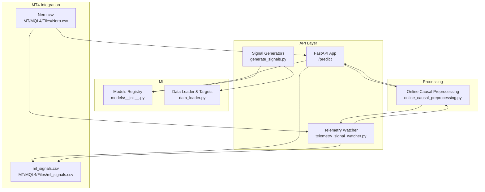
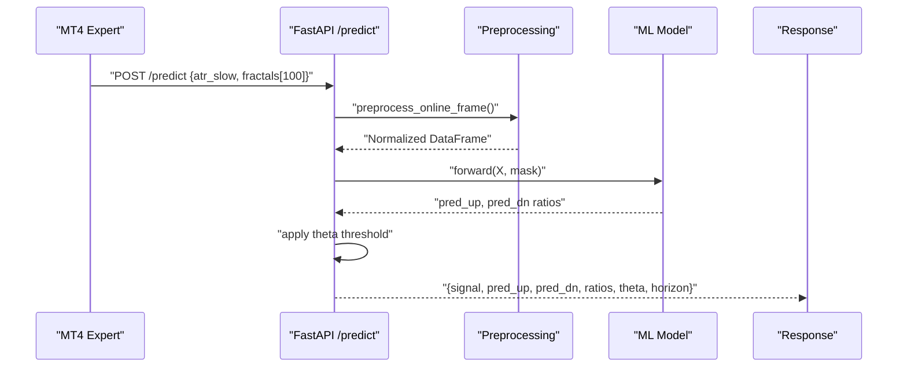
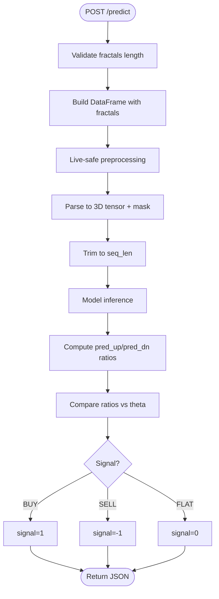
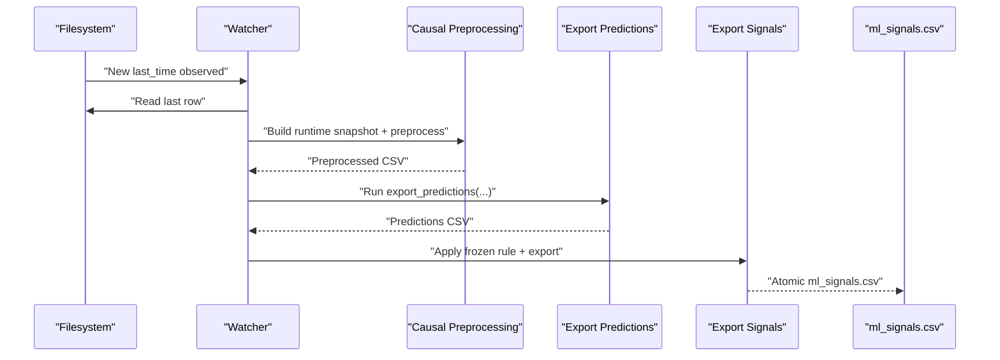
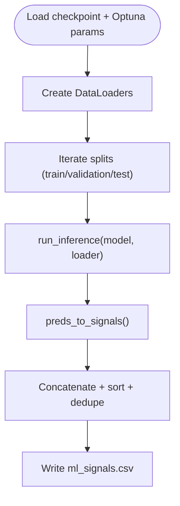
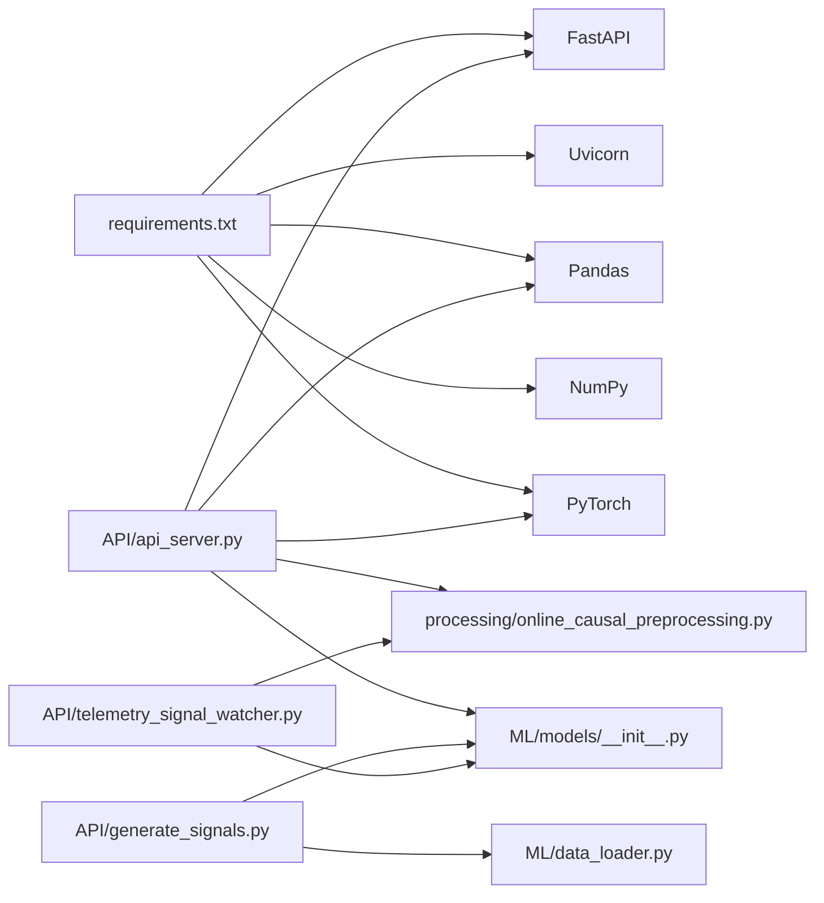

# API Services

<cite>
**Referenced Files in This Document**
- [API/api_server.py](file://API/api_server.py)
- [API/telemetry_signal_watcher.py](file://API/telemetry_signal_watcher.py)
- [API/generate_signals.py](file://API/generate_signals.py)
- [API/export_entry_path_v1_signals.py](file://API/export_entry_path_v1_signals.py)
- [API/export_entry_path_v1_quantile_signals.py](file://API/export_entry_path_v1_quantile_signals.py)
- [API/export_take_skip_trailing_stop_v2_signals.py](file://API/export_take_skip_trailing_stop_v2_signals.py)
- [API/test_api_client.py](file://API/test_api_client.py)
- [API/README.md](file://API/README.md)
- [processing/online_causal_preprocessing.py](file://processing/online_causal_preprocessing.py)
- [ML/data_loader.py](file://ML/data_loader.py)
- [ML/models/__init__.py](file://ML/models/__init__.py)
- [requirements.txt](file://requirements.txt)
- [README.md](file://README.md)
</cite>

## Table of Contents
1. [Introduction](#introduction)
2. [Project Structure](#project-structure)
3. [Core Components](#core-components)
4. [Architecture Overview](#architecture-overview)
5. [Detailed Component Analysis](#detailed-component-analysis)
6. [Dependency Analysis](#dependency-analysis)
7. [Performance Considerations](#performance-considerations)
8. [Troubleshooting Guide](#troubleshooting-guide)
9. [Conclusion](#conclusion)
10. [Appendices](#appendices)

## Introduction
This document describes the API services powering the SoSimple trading system. It covers:
- The FastAPI-based real-time inference service that accepts fractal data from MetaTrader 4 (MT4) and returns ML predictions.
- The signal generation pipeline that produces CSV files for MT4 Strategy Tester integration.
- The telemetry signal watcher that monitors live trading data and generates real-time signals.
- Export functions for multiple signal types: entry path signals, quantile signals, and trailing stop signals.
- REST API endpoints, request/response formats, and operational usage patterns.
- Practical examples, integration patterns with MetaTrader, performance considerations, error handling, and monitoring capabilities.

## Project Structure
The API services reside under the API/ directory and integrate with ML model loading, preprocessing utilities, and MT4 file I/O. Key areas:
- Real-time inference service: FastAPI app with a single prediction endpoint.
- Signal generation: Batch export of ML signals for MT4 tester and research.
- Telemetry watcher: Continuous monitoring of live data and incremental signal updates.
- Exporters: Apply frozen rules to prediction CSVs to produce final ml_signals.csv for MT4.

**Diagram sources**
- [API/api_server.py:103-169](file://API/api_server.py#L103-L169)
- [API/telemetry_signal_watcher.py:203-257](file://API/telemetry_signal_watcher.py#L203-L257)
- [API/generate_signals.py:342-668](file://API/generate_signals.py#L342-L668)
- [processing/online_causal_preprocessing.py:109-136](file://processing/online_causal_preprocessing.py#L109-L136)
- [ML/models/__init__.py:31-49](file://ML/models/__init__.py#L31-L49)
- [ML/data_loader.py:74-194](file://ML/data_loader.py#L74-L194)

**Section sources**
- [API/README.md:1-108](file://API/README.md#L1-L108)
- [README.md:1-25](file://README.md#L1-L25)

## Core Components
- Real-time inference service (FastAPI): Accepts fractal sequences from MT4, runs live-safe preprocessing, performs inference, and returns a trade-ready signal.
- Signal generation (batch): Loads trained models and exports CSVs suitable for MT4 Strategy Tester and research.
- Telemetry watcher: Monitors live data, applies causal preprocessing, runs inference, and writes atomic ml_signals.csv updates.
- Exporters: Apply frozen selection rules to prediction CSVs to produce final signals for MT4.

Key responsibilities and defaults:
- Model: transformer with regression_updn task, horizon 12H, theta 2.665.
- Preprocessing: fractal sorting, validation, and rowwise normalization (live-safe).
- Outputs: signals encoded as 1 (BUY), -1 (SELL), 0 (FLAT) with confidence ratios.

**Section sources**
- [API/api_server.py:28-88](file://API/api_server.py#L28-L88)
- [API/generate_signals.py:82-87](file://API/generate_signals.py#L82-L87)
- [processing/online_causal_preprocessing.py:109-122](file://processing/online_causal_preprocessing.py#L109-L122)

## Architecture Overview
The system comprises three primary pipelines:
- Real-time inference: MT4 → API → ML model → signal response.
- Batch signal generation: Labeled datasets → ML model → CSV export for MT4 tester.
- Telemetry streaming: Live Nero.csv → watcher → causal preprocessing → inference → ml_signals.csv.

**Diagram sources**
- [API/api_server.py:103-169](file://API/api_server.py#L103-L169)
- [processing/online_causal_preprocessing.py:109-122](file://processing/online_causal_preprocessing.py#L109-L122)
- [ML/models/__init__.py:31-49](file://ML/models/__init__.py#L31-L49)

## Detailed Component Analysis

### Real-time Inference Service (FastAPI)
- Endpoint: POST /predict
- Request body:
  - atr_slow: float
  - fractals: array of 100 strings representing fractal features
- Response:
  - signal: integer (-1, 0, 1)
  - pred_up, pred_dn: floats
  - ratio_up, ratio_dn: floats
  - theta, horizon: floats
- Behavior:
  - Validates fractal count equals N_FRACTALS.
  - Builds DataFrame in Nero-style format.
  - Applies live-safe preprocessing (sorting, validation, rowwise normalization).
  - Parses to 3D tensor and trims to seq_len.
  - Performs inference and computes ratios using configured horizon and theta.
  - Returns signal classification.

**Diagram sources**
- [API/api_server.py:103-169](file://API/api_server.py#L103-L169)
- [processing/online_causal_preprocessing.py:109-122](file://processing/online_causal_preprocessing.py#L109-L122)
- [ML/data_loader.py:80-83](file://ML/data_loader.py#L80-L83)

**Section sources**
- [API/api_server.py:45-169](file://API/api_server.py#L45-L169)
- [API/test_api_client.py:14-52](file://API/test_api_client.py#L14-L52)

### Telemetry Signal Watcher
- Purpose: Monitor live Nero.csv and continuously rebuild runtime signals.
- Inputs:
  - Nero.csv (MT4 live feed)
  - Checkpoint for take/skip v2 contour
  - Selected rule JSON for frozen selection
- Outputs:
  - Runtime snapshots and preprocessed CSV
  - Predictions CSV
  - Atomic ml_signals.csv for MT4 and tester
  - Optional metadata JSON
- Contract guard: Blocks legacy “original_contour/original_baseline” online inference by default to enforce live-safe constraints.
- Operation modes:
  - One-shot (--once)
  - Continuous polling with heartbeat logging

**Diagram sources**
- [API/telemetry_signal_watcher.py:203-327](file://API/telemetry_signal_watcher.py#L203-L327)
- [API/export_take_skip_trailing_stop_v2_signals.py:179-250](file://API/export_take_skip_trailing_stop_v2_signals.py#L179-L250)

**Section sources**
- [API/telemetry_signal_watcher.py:172-327](file://API/telemetry_signal_watcher.py#L172-L327)
- [API/telemetry_signal_watcher.py:180-201](file://API/telemetry_signal_watcher.py#L180-L201)

### Signal Generation Pipeline (Batch)
- Purpose: Generate CSVs of ML signals for MT4 Strategy Tester and research.
- Tasks supported:
  - regression_updn (default)
  - triple_barrier
  - entry_path_v1 (research-only CSVs)
  - trailing_stop_target_v1 (research-only CSVs)
  - trailing_stop_target_quantile_v1 (research-only CSVs)
- Features:
  - Optuna hyperparameters injection
  - Conformal prediction filtering (optional)
  - Horizon and theta thresholds
  - Deduplication and sorting by time

**Diagram sources**
- [API/generate_signals.py:342-668](file://API/generate_signals.py#L342-L668)
- [API/generate_signals.py:126-144](file://API/generate_signals.py#L126-L144)
- [API/generate_signals.py:147-178](file://API/generate_signals.py#L147-L178)

**Section sources**
- [API/generate_signals.py:342-668](file://API/generate_signals.py#L342-L668)

### Export Functions for Signal Types

#### Entry Path V1 Signals
- Purpose: Apply frozen entry_path_v1 rule to prediction CSV and export time;signal.
- Behavior:
  - Loads prediction frame with required columns.
  - Applies rule threshold to pred_ret_24_dir_atr and active signal.
  - Deduplicates runtime rows by time, prioritizing non-zero signals.

**Section sources**
- [API/export_entry_path_v1_signals.py:72-97](file://API/export_entry_path_v1_signals.py#L72-L97)

#### Entry Path V1 Quantile Signals
- Purpose: Apply production rule using baseline predictions and quantile logic.
- Behavior:
  - Loads prediction frame and production rule JSON.
  - Joins with baseline predictions by time and signal.
  - Applies conformal correction and rule mask.
  - Writes deduplicated time;signal CSV.

**Section sources**
- [API/export_entry_path_v1_quantile_signals.py:126-175](file://API/export_entry_path_v1_quantile_signals.py#L126-L175)

#### Take/Skip Trailing Stop V2 Signals
- Purpose: Apply frozen take/skip v2 rule to prediction CSV and export time;signal.
- Features:
  - Selector support: prob_ge_threshold or top_k_probability.
  - Optional metadata JSON with hashes and counts.
  - Diagnostic all-rows export using base CSV direction.
  - Atomic CSV writes to avoid partial reads.

**Section sources**
- [API/export_take_skip_trailing_stop_v2_signals.py:179-250](file://API/export_take_skip_trailing_stop_v2_signals.py#L179-L250)

### REST API Endpoints and Formats

- Base URL: http://host:port
- Health check: GET /
- Prediction: POST /predict
  - Request JSON:
    - atr_slow: number
    - fractals: array of 100 strings
  - Response JSON:
    - signal: integer (-1, 0, 1)
    - pred_up: number
    - pred_dn: number
    - ratio_up: number
    - ratio_dn: number
    - theta: number
    - horizon: number

Authentication: None (development/testing). For production, deploy behind a reverse proxy with TLS and authentication as appropriate.

**Section sources**
- [API/api_server.py:98-169](file://API/api_server.py#L98-L169)

### Integration Patterns with MetaTrader
- Real-time inference:
  - MT4 expert writes Nero.csv; client posts to /predict.
  - Use test_api_client.py to validate local deployment.
- Strategy Tester:
  - Run generate_signals.py to produce ml_signals.csv for backtesting.
- Live telemetry:
  - Run telemetry_signal_watcher.py in tmux for continuous updates.
  - Copy final ml_signals.csv to MT/tester/files and MT/MQL4/Files for runtime and tester.

**Section sources**
- [API/README.md:23-107](file://API/README.md#L23-L107)
- [API/test_api_client.py:14-52](file://API/test_api_client.py#L14-L52)

## Dependency Analysis
External dependencies include FastAPI, Uvicorn, Pydantic, Torch, Pandas, and NumPy. The API layer depends on:
- ML model registry for model instantiation.
- Data loader constants for fractal parsing and sequence lengths.
- Online causal preprocessing for live-safe transformations.

**Diagram sources**
- [requirements.txt:1-17](file://requirements.txt#L1-L17)
- [API/api_server.py:15-21](file://API/api_server.py#L15-L21)
- [ML/models/__init__.py:17-28](file://ML/models/__init__.py#L17-L28)
- [ML/data_loader.py:39-46](file://ML/data_loader.py#L39-L46)

**Section sources**
- [requirements.txt:1-17](file://requirements.txt#L1-L17)
- [API/api_server.py:15-21](file://API/api_server.py#L15-L21)
- [ML/models/__init__.py:17-28](file://ML/models/__init__.py#L17-L28)
- [ML/data_loader.py:39-46](file://ML/data_loader.py#L39-L46)

## Performance Considerations
- Model initialization occurs once at startup; keep GPU/CPU utilization balanced.
- Batch sizes for inference: 256 recommended for telemetry and batch export.
- seq_len trimming ensures consistent inference windows; align with training configuration.
- Atomic CSV writes prevent partial reads during live updates.
- Preprocessing validates sorting and normalization to avoid repeated work.

[No sources needed since this section provides general guidance]

## Troubleshooting Guide
Common issues and resolutions:
- Missing checkpoint: Ensure the configured checkpoint exists; otherwise, the service fails to start.
- Invalid fractal count: /predict expects exactly N_FRACTALS fractals; adjust MT4 export or client payload.
- Contract guard violation: Telemetry watcher blocks legacy “original_contour/original_baseline” online mode; retrain with a live-safe feature set.
- Preprocessing failures: Validate that fractal times are properly sorted and normalized; the system raises explicit errors on violations.
- API connectivity: Use test_api_client.py to verify endpoint availability and response format.

**Section sources**
- [API/api_server.py:59-60](file://API/api_server.py#L59-L60)
- [API/api_server.py:109-113](file://API/api_server.py#L109-L113)
- [API/telemetry_signal_watcher.py:193-200](file://API/telemetry_signal_watcher.py#L193-L200)
- [processing/online_causal_preprocessing.py:57-82](file://processing/online_causal_preprocessing.py#L57-L82)

## Conclusion
The SoSimple API services provide a robust foundation for real-time inference, batch signal generation, and live telemetry-driven signal updates. By enforcing live-safe preprocessing, applying frozen selection rules, and offering atomic file writes, the system integrates seamlessly with MT4 for both Strategy Tester and live trading scenarios.

[No sources needed since this section summarizes without analyzing specific files]

## Appendices

### Practical Usage Examples
- Real-time prediction:
  - Start API server and use test_api_client.py to send a sample row from DATA/Nero_test_labeled.csv.
- Batch signal export:
  - Generate ml_signals.csv for MT4 tester with default or custom theta and horizon.
- Telemetry watcher:
  - One-shot rebuild or continuous operation with heartbeat logging; copy outputs to MT4 directories.

**Section sources**
- [API/README.md:23-107](file://API/README.md#L23-L107)
- [API/test_api_client.py:14-52](file://API/test_api_client.py#L14-L52)