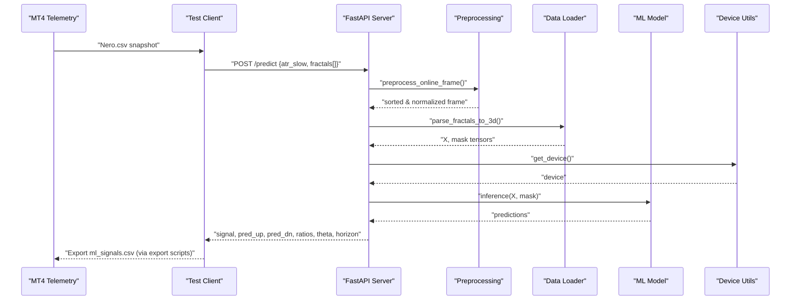
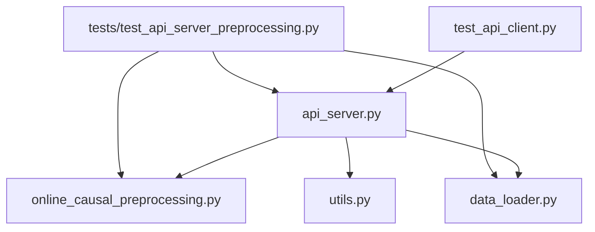

# API Testing and Client

<cite>
**Referenced Files in This Document**
- [API/test_api_client.py](file://API/test_api_client.py)
- [API/api_server.py](file://API/api_server.py)
- [API/README.md](file://API/README.md)
- [ML/data_loader.py](file://ML/data_loader.py)
- [ML/utils.py](file://ML/utils.py)
- [processing/online_causal_preprocessing.py](file://processing/online_causal_preprocessing.py)
- [tests/test_api_server_preprocessing.py](file://tests/test_api_server_preprocessing.py)
- [tests/test_online_causal_preprocessing.py](file://tests/test_online_causal_preprocessing.py)
- [tests/README.md](file://tests/README.md)
</cite>

## Table of Contents
1. [Introduction](#introduction)
2. [Project Structure](#project-structure)
3. [Core Components](#core-components)
4. [Architecture Overview](#architecture-overview)
5. [Detailed Component Analysis](#detailed-component-analysis)
6. [Dependency Analysis](#dependency-analysis)
7. [Performance Considerations](#performance-considerations)
8. [Troubleshooting Guide](#troubleshooting-guide)
9. [Conclusion](#conclusion)

## Introduction
This document explains the API testing framework and client utilities used to validate SoSimple's trading system. It focuses on:
- How the test client simulates MT4 API requests and validates response formats
- Testing methodologies for API endpoints, data validation, and signal generation accuracy
- Unit testing approaches for individual components, integration testing for end-to-end workflows, and performance considerations
- Client-side integration patterns, error handling strategies, and debugging techniques

The primary goal is to enable developers and QA engineers to confidently validate the ML-powered signal generation pipeline that connects MT4 telemetry to the FastAPI service and back to MT4 via exported signals.

## Project Structure
The API testing and validation spans several modules:
- API server: FastAPI service exposing /predict and health endpoints
- Test client: Simulates MT4 requests and validates responses
- Data loading and preprocessing: Shared utilities for parsing and validating fractal sequences
- Tests: Unit and integration tests for preprocessing and API behavior

```mermaid
graph TB
subgraph "API Layer"
API_Server["FastAPI Server<br/>api_server.py"]
Test_Client["Test Client<br/>test_api_client.py"]
end
subgraph "Processing Layer"
Preprocess["Online Causal Preprocessing<br/>online_causal_preprocessing.py"]
DataLoad["Data Loader & Validation<br/>data_loader.py"]
end
subgraph "ML Layer"
Utils["Utilities & Device Selection<br/>utils.py"]
end
subgraph "MT4 Integration"
MT4["MT4 Telemetry / Signals"]
end
Test_Client --> API_Server
API_Server --> Preprocess
API_Server --> DataLoad
API_Server --> Utils
Preprocess --> DataLoad
MT4 <- --> Test_Client
MT4 <- --> API_Server
```

**Diagram sources**
- [API/api_server.py:1-174](file://API/api_server.py#L1-L174)
- [API/test_api_client.py:1-55](file://API/test_api_client.py#L1-L55)
- [processing/online_causal_preprocessing.py:1-137](file://processing/online_causal_preprocessing.py#L1-L137)
- [ML/data_loader.py:1-800](file://ML/data_loader.py#L1-L800)
- [ML/utils.py:1-340](file://ML/utils.py#L1-L340)

**Section sources**
- [API/README.md:1-108](file://API/README.md#L1-L108)

## Core Components
- API server: FastAPI app with a /predict endpoint that accepts fractal sequences and ATR values, runs shared preprocessing, performs inference, and returns a structured signal response.
- Test client: Reads labeled test data, constructs a request payload, posts to /predict, and prints/validates the response.
- Shared preprocessing: Ensures fractals are sorted, normalized, and validated before inference.
- Data loader: Validates CSV contracts, parses fractals into 3D tensors, and applies normalization/time features.
- Utilities: Device selection and metrics helpers used during inference.

Key responsibilities:
- API server: Input validation, preprocessing orchestration, model inference, decision logic, and response formatting
- Test client: Request construction, HTTP transport, response validation, and error reporting
- Preprocessing: Sorting, validation, and row-wise normalization of fractal snapshots
- Data loader: Contract validation, parsing, and feature engineering for training/inference
- Utilities: Deterministic device selection and metric computation

**Section sources**
- [API/api_server.py:103-169](file://API/api_server.py#L103-L169)
- [API/test_api_client.py:14-52](file://API/test_api_client.py#L14-L52)
- [processing/online_causal_preprocessing.py:109-122](file://processing/online_causal_preprocessing.py#L109-L122)
- [ML/data_loader.py:248-285](file://ML/data_loader.py#L248-L285)
- [ML/utils.py:326-340](file://ML/utils.py#L326-L340)

## Architecture Overview
The end-to-end flow from MT4 telemetry to API response and signal export:



**Diagram sources**
- [API/api_server.py:103-169](file://API/api_server.py#L103-L169)
- [processing/online_causal_preprocessing.py:109-122](file://processing/online_causal_preprocessing.py#L109-L122)
- [ML/data_loader.py:331-424](file://ML/data_loader.py#L331-L424)
- [ML/utils.py:326-340](file://ML/utils.py#L326-L340)

## Detailed Component Analysis

### Test Client: MT4 API Simulation
The test client reads a labeled CSV, constructs a payload with ATR and 100 fractal entries, posts to the local API, and prints the response fields. It includes basic error handling for network issues and response decoding.

Implementation highlights:
- Loads test CSV from DATA directory
- Builds fractal array and ATR payload
- Sends HTTP POST to /predict
- Validates response keys and prints formatted results
- Handles request exceptions and prints error details

Testing methodology:
- Validates response schema and numeric rounding
- Exercises error handling for connection failures
- Demonstrates end-to-end request/response flow

**Section sources**
- [API/test_api_client.py:14-52](file://API/test_api_client.py#L14-L52)

### API Server: Endpoint, Validation, and Decision Logic
The API server exposes:
- GET "/" health-check
- POST "/predict" for signal generation

Core processing steps:
- Input validation: fractal count check
- DataFrame construction mirroring the training CSV contract
- Shared preprocessing: sorting, validation, and normalization
- Parsing to 3D tensor and mask
- Inference with model and device selection
- Decision logic: computes up/down probabilities, ratios, and signal
- Response formatting with signal, probabilities, ratios, thresholds, and horizon

Error handling:
- HTTPException for invalid fractal counts
- HTTPException for invalid horizon configuration
- Exception propagation for model loading and inference issues

**Section sources**
- [API/api_server.py:98-101](file://API/api_server.py#L98-L101)
- [API/api_server.py:103-169](file://API/api_server.py#L103-L169)

### Shared Preprocessing: Sorting, Validation, and Normalization
The preprocessing module ensures:
- Fractal timestamps are in descending order
- Row-wise normalization is applied only when needed
- Validation checks for sorting correctness
- Idempotent behavior for already processed frames

Validation coverage:
- Timestamp ordering validation
- Empty DataFrame handling
- Legacy fractal format support
- Idempotency verification

**Section sources**
- [processing/online_causal_preprocessing.py:57-82](file://processing/online_causal_preprocessing.py#L57-L82)
- [processing/online_causal_preprocessing.py:109-122](file://processing/online_causal_preprocessing.py#L109-L122)
- [tests/test_online_causal_preprocessing.py:67-130](file://tests/test_online_causal_preprocessing.py#L67-L130)

### Data Loader: CSV Contracts, Parsing, and Validation
The data loader enforces:
- Expected CSV columns contract
- Fractal field schema validation
- Parsed feature validation (e.g., minimum valid fraction, non-zero features)
- 3D tensor parsing with time features and ATR ratio

Validation safeguards:
- Field count and domain checks
- Feature sanity checks
- Cache invalidation and compatibility

**Section sources**
- [ML/data_loader.py:233-285](file://ML/data_loader.py#L233-L285)
- [ML/data_loader.py:331-424](file://ML/data_loader.py#L331-L424)

### Unit Testing Approaches
Unit tests validate isolated behaviors:
- Preprocessing: sorting, normalization, idempotency, empty frames, legacy formats
- API preprocessing integration: shared preprocessing hooking and response assertions
- Metrics and device utilities: deterministic device selection and metric computation

Test execution:
- pytest runner invoked from repository root
- Synthetic fixtures avoid external data dependencies

**Section sources**
- [tests/test_online_causal_preprocessing.py:67-218](file://tests/test_online_causal_preprocessing.py#L67-L218)
- [tests/test_api_server_preprocessing.py:48-76](file://tests/test_api_server_preprocessing.py#L48-L76)
- [ML/utils.py:326-340](file://ML/utils.py#L326-L340)
- [tests/README.md:1-40](file://tests/README.md#L1-L40)

### Integration Testing for End-to-End Workflows
Integration tests validate the API endpoint with mocked dependencies:
- Fake model that returns deterministic predictions
- Mocked preprocessing and parsing to isolate endpoint logic
- Assertions on response structure and computed signal

This pattern enables:
- Rapid feedback on endpoint behavior
- Isolation of model and preprocessing concerns
- Confidence in shared preprocessing reuse

**Section sources**
- [tests/test_api_server_preprocessing.py:15-76](file://tests/test_api_server_preprocessing.py#L15-L76)

### Performance Considerations
- Device selection: automatic GPU detection with fallback to CPU
- Tensor shapes and masks: fixed-size sequences for efficient inference
- Preprocessing idempotency: reduces redundant normalization overhead
- Model loading: single checkpoint load at startup with warm cache

Recommendations:
- Keep sequence length aligned with training configuration
- Monitor device utilization during inference
- Validate preprocessing logs only in debug mode

**Section sources**
- [ML/utils.py:326-340](file://ML/utils.py#L326-L340)
- [API/api_server.py:78-88](file://API/api_server.py#L78-L88)

## Dependency Analysis
The API server depends on shared preprocessing and data loader utilities, while the test client depends on the API server and test data.



**Diagram sources**
- [API/test_api_client.py:14-52](file://API/test_api_client.py#L14-L52)
- [API/api_server.py:103-169](file://API/api_server.py#L103-L169)
- [processing/online_causal_preprocessing.py:109-122](file://processing/online_causal_preprocessing.py#L109-L122)
- [ML/data_loader.py:331-424](file://ML/data_loader.py#L331-L424)
- [ML/utils.py:326-340](file://ML/utils.py#L326-L340)
- [tests/test_api_server_preprocessing.py:48-76](file://tests/test_api_server_preprocessing.py#L48-L76)

**Section sources**
- [API/api_server.py:18-21](file://API/api_server.py#L18-L21)
- [API/test_api_client.py:7-12](file://API/test_api_client.py#L7-L12)

## Performance Considerations
- Model inference throughput: leverage GPU when available; monitor memory usage
- Preprocessing efficiency: idempotent normalization avoids repeated work
- Request batching: consider extending the client to send multiple requests for load testing
- Endpoint health: use GET "/" to verify service readiness before heavy loads

[No sources needed since this section provides general guidance]

## Troubleshooting Guide
Common issues and resolutions:
- Invalid fractal count: ensure exactly 100 fractal entries are provided
- Model not loaded: verify checkpoint exists and architecture parameters match
- Preprocessing failures: confirm fractal timestamps are sorted and fields conform to schema
- Network errors: inspect connection URL, firewall, and server logs
- Response validation: confirm response keys and numeric rounding expectations

Debugging techniques:
- Enable verbose preprocessing only in controlled environments
- Use unit tests to validate preprocessing and API logic in isolation
- Capture and log request/response payloads for problematic cases

**Section sources**
- [API/api_server.py:109-113](file://API/api_server.py#L109-L113)
- [API/api_server.py:59-60](file://API/api_server.py#L59-L60)
- [processing/online_causal_preprocessing.py:78-82](file://processing/online_causal_preprocessing.py#L78-L82)
- [API/test_api_client.py:48-51](file://API/test_api_client.py#L48-L51)

## Conclusion
The API testing framework combines a focused test client with robust unit and integration tests to validate SoSimple’s ML-powered signal generation pipeline. By leveraging shared preprocessing, strict data contracts, and deterministic device selection, the system ensures reliable and repeatable behavior. The documented testing methodologies, error handling strategies, and debugging techniques provide a solid foundation for maintaining and evolving the API and client utilities.