# Batch Signal Generation

<cite>
**Referenced Files in This Document**
- [generate_signals.py](file://API/generate_signals.py)
- [export_entry_path_v1_signals.py](file://API/export_entry_path_v1_signals.py)
- [export_entry_path_v1_quantile_signals.py](file://API/export_entry_path_v1_quantile_signals.py)
- [export_take_skip_trailing_stop_v2_signals.py](file://API/export_take_skip_trailing_stop_v2_signals.py)
- [data_loader.py](file://ML/data_loader.py)
- [models/__init__.py](file://ML/models/__init__.py)
- [entry_path_task.py](file://ML/entry_path_task.py)
- [trailing_stop_target_task.py](file://ML/trailing_stop_target_task.py)
- [trailing_stop_target_quantile_task.py](file://ML/trailing_stop_target_quantile_task.py)
- [lib_ML_Signal.mqh](file://MT/MQL4/Include/lib_ML_Signal.mqh)
- [lib_ML_Signal_back.mqh](file://MT/MQL4/Include/lib_ML_Signal_back.mqh)
- [test_generate_signals_research.py](file://tests/test_generate_signals_research.py)
- [test_export_entry_path_v1_signals.py](file://tests/test_export_entry_path_v1_signals.py)
- [test_export_entry_path_v1_quantile_signals.py](file://tests/test_export_entry_path_v1_quantile_signals.py)
</cite>

## Table of Contents
1. [Introduction](#introduction)
2. [Project Structure](#project-structure)
3. [Core Components](#core-components)
4. [Architecture Overview](#architecture-overview)
5. [Detailed Component Analysis](#detailed-component-analysis)
6. [Dependency Analysis](#dependency-analysis)
7. [Performance Considerations](#performance-considerations)
8. [Troubleshooting Guide](#troubleshooting-guide)
9. [Conclusion](#conclusion)

## Introduction
This document describes the batch signal generation system that exports trading signals compatible with MetaTrader 4 Strategy Tester. It covers the generation of ML-driven entry signals, quantile-based trailing stop targets, and research-only exports for entry path classification. The system transforms trained models and prediction CSVs into CSV files that MT4 experts can consume for backtesting and live execution.

Key capabilities:
- Generate entry signals for MT4 tester from regression models (up/dn ratios) with configurable horizon and threshold
- Export Triple Barrier probability-based signals with calibrated expected value filtering
- Export research CSVs for entry path classification and trailing stop quantile targets
- Apply frozen production rules to prediction CSVs to produce final time;signal files for MT4

## Project Structure
The batch signal generation spans three layers:
- API scripts: orchestrate model inference and CSV export
- ML modules: data loaders, tasks, and model registry
- MT4 integration: CSV format expectations and expert library

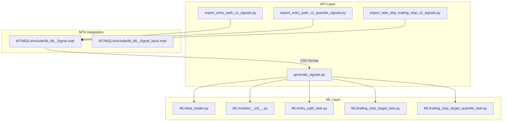

**Diagram sources**
- [generate_signals.py:1-745](file://API/generate_signals.py#L1-L745)
- [data_loader.py:1-200](file://ML/data_loader.py#L1-L200)
- [models/__init__.py:1-49](file://ML/models/__init__.py#L1-L49)
- [entry_path_task.py:1-200](file://ML/entry_path_task.py#L1-L200)
- [trailing_stop_target_task.py:1-25](file://ML/trailing_stop_target_task.py#L1-L25)
- [trailing_stop_target_quantile_task.py:1-107](file://ML/trailing_stop_target_quantile_task.py#L1-L107)
- [lib_ML_Signal.mqh:1-951](file://MT/MQL4/Include/lib_ML_Signal.mqh#L1-L951)

**Section sources**
- [generate_signals.py:1-745](file://API/generate_signals.py#L1-L745)
- [data_loader.py:1-200](file://ML/data_loader.py#L1-L200)
- [models/__init__.py:1-49](file://ML/models/__init__.py#L1-L49)
- [entry_path_task.py:1-200](file://ML/entry_path_task.py#L1-L200)
- [trailing_stop_target_task.py:1-25](file://ML/trailing_stop_target_task.py#L1-L25)
- [trailing_stop_target_quantile_task.py:1-107](file://ML/trailing_stop_target_quantile_task.py#L1-L107)
- [lib_ML_Signal.mqh:1-951](file://MT/MQL4/Include/lib_ML_Signal.mqh#L1-L951)

## Core Components
- generate_signals.py: Main orchestrator for entry signals and Triple Barrier signals; supports conformal filtering and research-only exports
- export_entry_path_v1_signals.py: Applies frozen entry path rule to prediction CSV and writes time;signal for MT4
- export_entry_path_v1_quantile_signals.py: Applies frozen quantile rule to prediction CSV and writes time;signal for MT4
- export_take_skip_trailing_stop_v2_signals.py: Applies frozen take/skip v2 rule to prediction CSV and writes time;signal for MT4
- ML/data_loader.py: Loads labeled datasets, builds data loaders, and defines task-specific targets and checkpoint suffixes
- ML/models/__init__.py: Model registry and factory for supported architectures
- Task modules: entry_path_task.py, trailing_stop_target_task.py, trailing_stop_target_quantile_task.py define export frames and target structures
- MT4 integration: lib_ML_Signal.mqh and lib_ML_Signal_back.mqh define CSV format expectations and expert behavior

**Section sources**
- [generate_signals.py:342-669](file://API/generate_signals.py#L342-L669)
- [export_entry_path_v1_signals.py:72-97](file://API/export_entry_path_v1_signals.py#L72-L97)
- [export_entry_path_v1_quantile_signals.py:126-175](file://API/export_entry_path_v1_quantile_signals.py#L126-L175)
- [export_take_skip_trailing_stop_v2_signals.py:179-250](file://API/export_take_skip_trailing_stop_v2_signals.py#L179-L250)
- [data_loader.py:74-200](file://ML/data_loader.py#L74-L200)
- [models/__init__.py:31-49](file://ML/models/__init__.py#L31-L49)
- [entry_path_task.py:109-168](file://ML/entry_path_task.py#L109-L168)
- [trailing_stop_target_task.py:17-24](file://ML/trailing_stop_target_task.py#L17-L24)
- [trailing_stop_target_quantile_task.py:32-57](file://ML/trailing_stop_target_quantile_task.py#L32-L57)
- [lib_ML_Signal.mqh:457-551](file://MT/MQL4/Include/lib_ML_Signal.mqh#L457-L551)

## Architecture Overview
The system follows a pipeline:
- Load trained model and optional calibration/rule JSON
- Run inference over train/validation/test splits
- Convert predictions to signals using thresholds and optional conformal filtering
- Write CSV files for MT4 tester or research-only exports
- MT4 experts read CSV and execute trades based on time-aligned signals

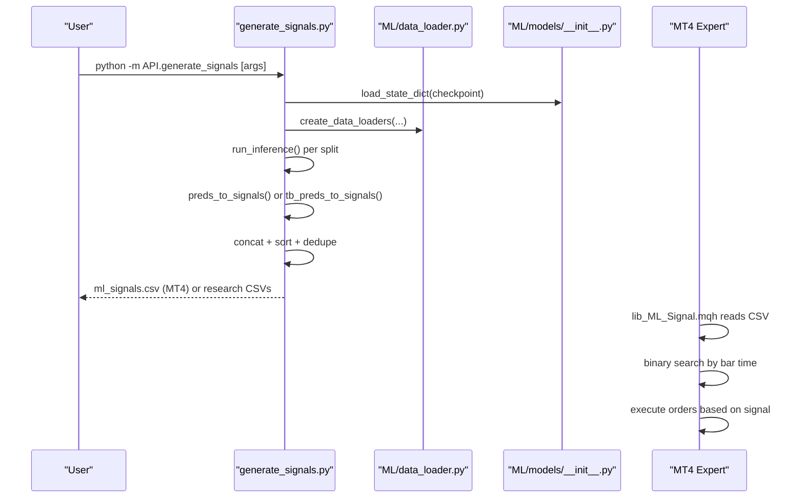

**Diagram sources**
- [generate_signals.py:342-669](file://API/generate_signals.py#L342-L669)
- [data_loader.py:153-200](file://ML/data_loader.py#L153-L200)
- [models/__init__.py:31-49](file://ML/models/__init__.py#L31-L49)
- [lib_ML_Signal.mqh:457-551](file://MT/MQL4/Include/lib_ML_Signal.mqh#L457-L551)

## Detailed Component Analysis

### Entry Signals Pipeline (MT4-compatible)
Generates time;signal CSV for MT4 tester plus optional research CSVs with prediction columns.

Key steps:
- Load checkpoint and optional Optuna hyperparameters
- Build model and move to device
- Iterate train/validation/test splits
- Run inference and convert to signals using horizon and theta
- Optionally apply conformal quantiles
- Sort by time, deduplicate by time, and write CSV

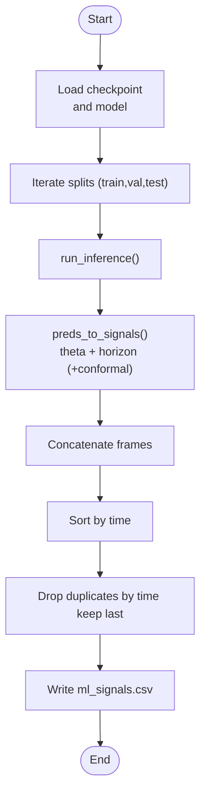

**Diagram sources**
- [generate_signals.py:342-669](file://API/generate_signals.py#L342-L669)
- [generate_signals.py:126-144](file://API/generate_signals.py#L126-L144)
- [generate_signals.py:147-178](file://API/generate_signals.py#L147-L178)

**Section sources**
- [generate_signals.py:342-669](file://API/generate_signals.py#L342-L669)
- [generate_signals.py:126-178](file://API/generate_signals.py#L126-L178)

### Triple Barrier Signals Pipeline
Exports ml_signals_tb.csv with signal, sl_atr, tp_atr, prob, ev for MT4.

Key steps:
- Load TB checkpoint and probability calibrator
- Iterate train/validation/test splits
- Convert logits to probabilities and apply calibration
- Select best signal per row using threshold and minimum expected value
- Sort by time, deduplicate, and write CSV

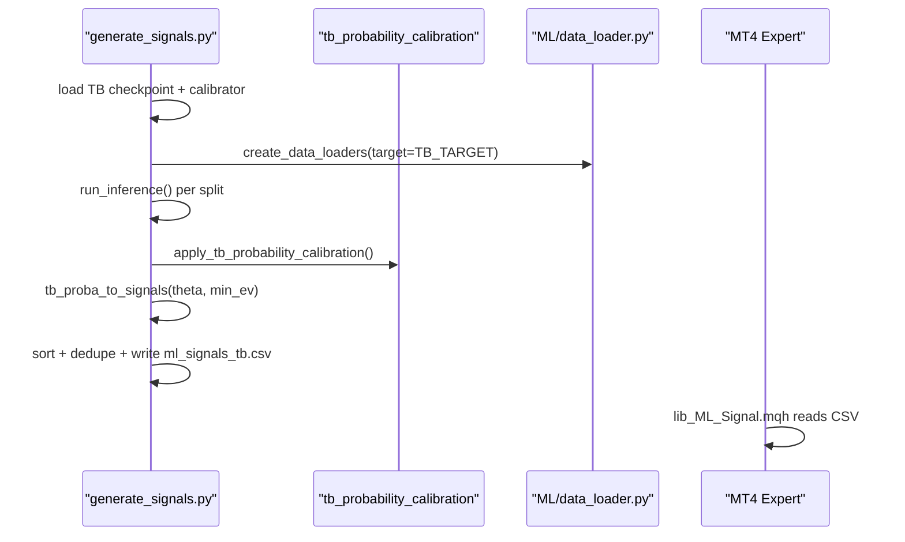

**Diagram sources**
- [generate_signals.py:201-335](file://API/generate_signals.py#L201-L335)
- [generate_signals.py:185-198](file://API/generate_signals.py#L185-L198)

**Section sources**
- [generate_signals.py:201-335](file://API/generate_signals.py#L201-L335)

### Entry Path v1 Research Export
Writes research CSVs with prediction columns for entry path regression/classification targets.

Key steps:
- Validate research prefix provided
- Load data loaders and test loader
- Run inference and collect outputs for ret, path_reg, path_cls
- Build export frame with ground truth if present
- Write CSVs for validation and test

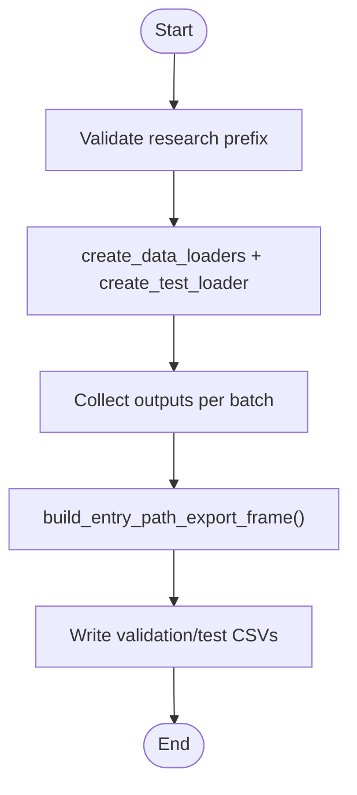

**Diagram sources**
- [generate_signals.py:420-487](file://API/generate_signals.py#L420-L487)
- [entry_path_task.py:109-168](file://ML/entry_path_task.py#L109-L168)

**Section sources**
- [generate_signals.py:420-487](file://API/generate_signals.py#L420-L487)
- [entry_path_task.py:109-168](file://ML/entry_path_task.py#L109-L168)

### Trailing Stop Target Research Export
Writes research CSVs with predicted trailing stop targets.

Key steps:
- Validate research prefix provided
- Load data loaders and test loader
- Run inference and build export frame with true targets
- Write CSVs for validation and test

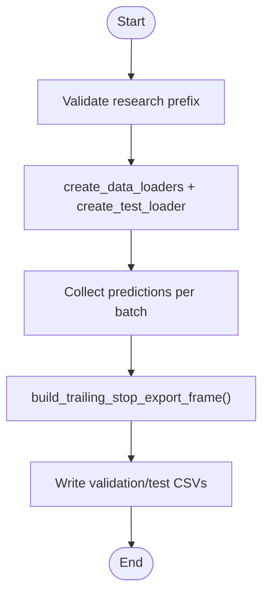

**Diagram sources**
- [generate_signals.py:489-536](file://API/generate_signals.py#L489-L536)
- [trailing_stop_target_task.py:17-24](file://ML/trailing_stop_target_task.py#L17-L24)

**Section sources**
- [generate_signals.py:489-536](file://API/generate_signals.py#L489-L536)
- [trailing_stop_target_task.py:17-24](file://ML/trailing_stop_target_task.py#L17-L24)

### Trailing Stop Quantile Target Research Export
Writes research CSVs with predicted quantiles.

Key steps:
- Validate research prefix provided
- Load data loaders and test loader
- Run inference and build export frame with q10/q50/q90
- Write CSVs for validation and test

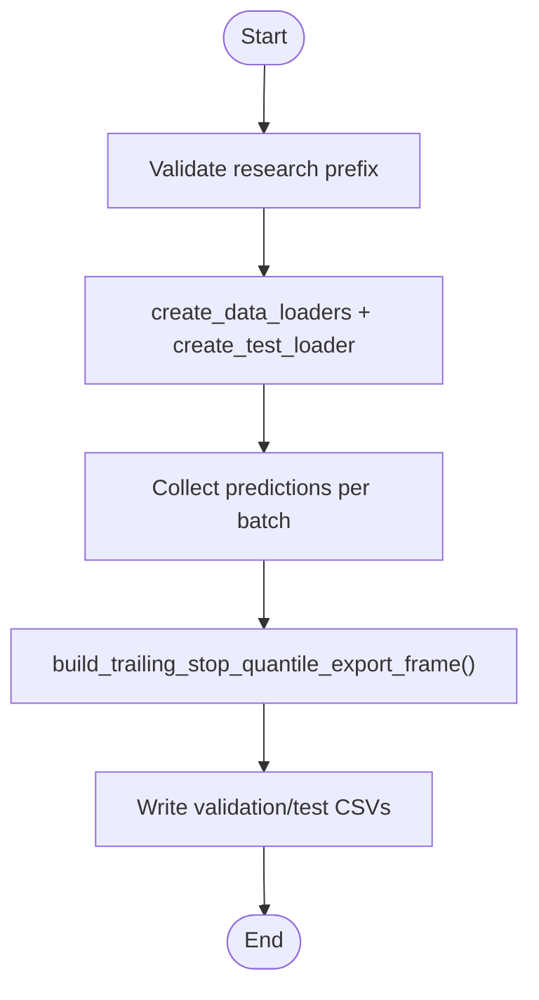

**Diagram sources**
- [generate_signals.py:538-589](file://API/generate_signals.py#L538-L589)
- [trailing_stop_target_quantile_task.py:32-57](file://ML/trailing_stop_target_quantile_task.py#L32-L57)

**Section sources**
- [generate_signals.py:538-589](file://API/generate_signals.py#L538-L589)
- [trailing_stop_target_quantile_task.py:32-57](file://ML/trailing_stop_target_quantile_task.py#L32-L57)

### Frozen Rule Application: Entry Path v1
Applies a frozen rule to prediction CSV and writes time;signal for MT4.

Key steps:
- Load prediction frame and rule payload
- Apply rule to select rows
- Deduplicate by time keeping highest absolute signal
- Write CSV and optionally copy to MT4 tester/runtime paths

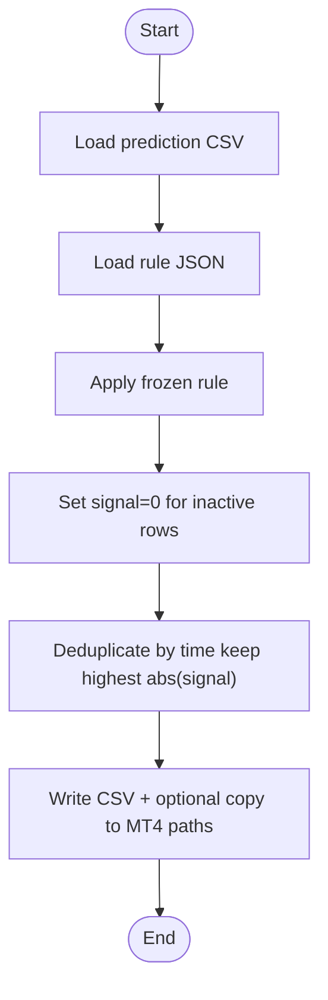

**Diagram sources**
- [export_entry_path_v1_signals.py:72-97](file://API/export_entry_path_v1_signals.py#L72-L97)

**Section sources**
- [export_entry_path_v1_signals.py:72-97](file://API/export_entry_path_v1_signals.py#L72-L97)

### Frozen Rule Application: Entry Path v1 Quantile
Applies a frozen quantile rule to prediction CSV and writes time;signal for MT4.

Key steps:
- Load prediction frame and rule payload
- Support legacy per-seed rule or production rule with baseline join
- Apply production rule using baseline predictions and quantile thresholds
- Deduplicate by time keeping highest absolute signal
- Write CSV and optionally copy to MT4 tester/runtime paths

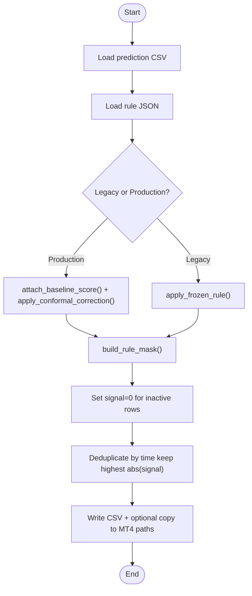

**Diagram sources**
- [export_entry_path_v1_quantile_signals.py:126-175](file://API/export_entry_path_v1_quantile_signals.py#L126-L175)

**Section sources**
- [export_entry_path_v1_quantile_signals.py:126-175](file://API/export_entry_path_v1_quantile_signals.py#L126-L175)

### Frozen Rule Application: Take/Skip v2 Trailing Stop
Applies a frozen take/skip v2 rule to prediction CSV and writes time;signal for MT4.

Key steps:
- Load prediction frame and rule payload
- Support selectors: prob_ge_threshold or top_k_probability
- Optional: expand sparse predictions to full series using base CSV
- Optional: build diagnostic signals per year
- Write CSV and optionally copy to MT4 tester/runtime paths

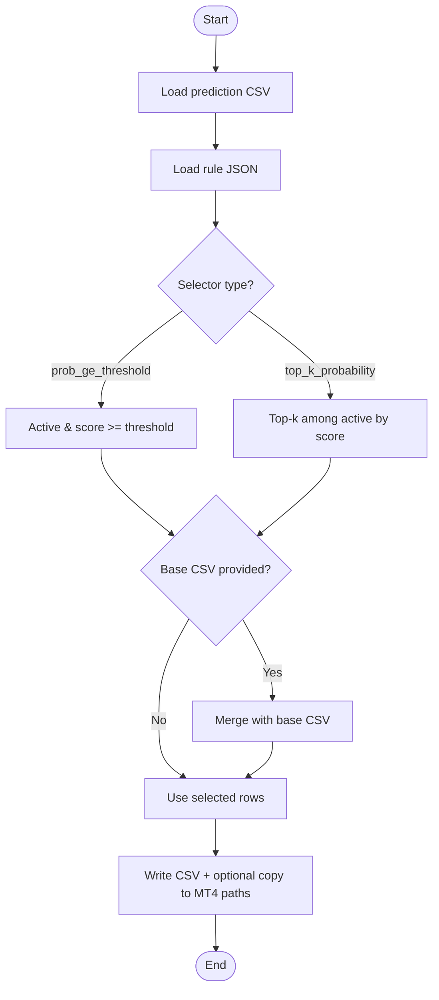

**Diagram sources**
- [export_take_skip_trailing_stop_v2_signals.py:179-250](file://API/export_take_skip_trailing_stop_v2_signals.py#L179-L250)

**Section sources**
- [export_take_skip_trailing_stop_v2_signals.py:179-250](file://API/export_take_skip_trailing_stop_v2_signals.py#L179-L250)

## Dependency Analysis
- API scripts depend on ML modules for data loading, model registry, and task-specific export frames
- MT4 experts depend on CSV format compatibility defined in lib_ML_Signal.mqh
- Conformal quantiles and TB probability calibration are optional integrations

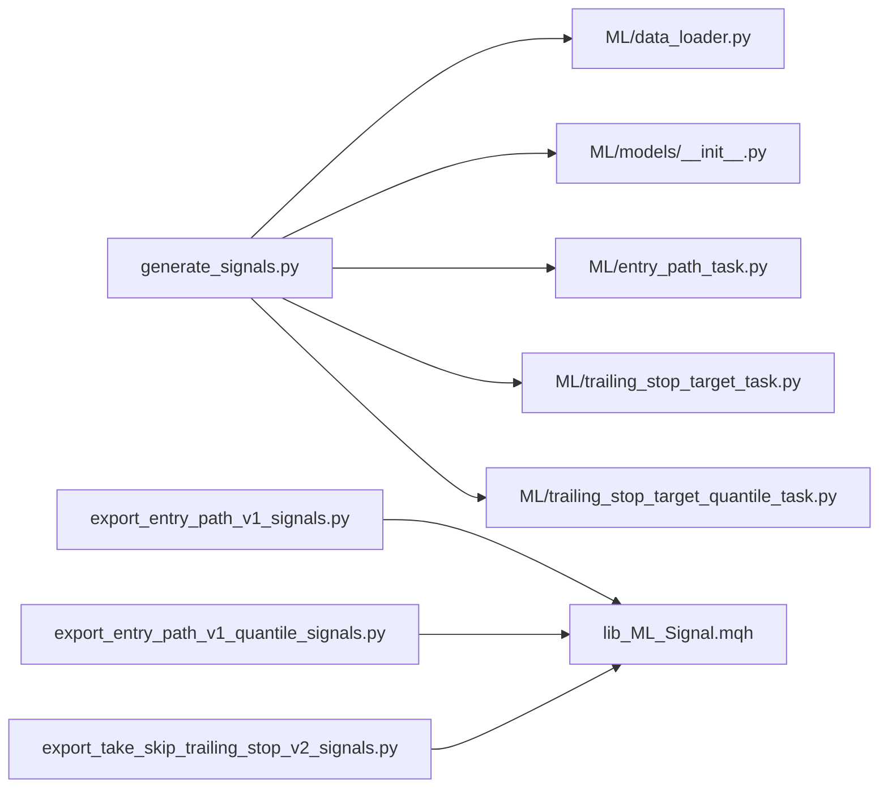

**Diagram sources**
- [generate_signals.py:342-669](file://API/generate_signals.py#L342-L669)
- [data_loader.py:74-200](file://ML/data_loader.py#L74-L200)
- [models/__init__.py:31-49](file://ML/models/__init__.py#L31-L49)
- [entry_path_task.py:109-168](file://ML/entry_path_task.py#L109-L168)
- [trailing_stop_target_task.py:17-24](file://ML/trailing_stop_target_task.py#L17-L24)
- [trailing_stop_target_quantile_task.py:32-57](file://ML/trailing_stop_target_quantile_task.py#L32-L57)
- [lib_ML_Signal.mqh:457-551](file://MT/MQL4/Include/lib_ML_Signal.mqh#L457-L551)

**Section sources**
- [generate_signals.py:342-669](file://API/generate_signals.py#L342-L669)
- [data_loader.py:74-200](file://ML/data_loader.py#L74-L200)
- [models/__init__.py:31-49](file://ML/models/__init__.py#L31-L49)
- [entry_path_task.py:109-168](file://ML/entry_path_task.py#L109-L168)
- [trailing_stop_target_task.py:17-24](file://ML/trailing_stop_target_task.py#L17-L24)
- [trailing_stop_target_quantile_task.py:32-57](file://ML/trailing_stop_target_quantile_task.py#L32-L57)
- [lib_ML_Signal.mqh:457-551](file://MT/MQL4/Include/lib_ML_Signal.mqh#L457-L551)

## Performance Considerations
- Batch size: The scripts use batch_size=256 for inference; adjust based on GPU memory
- num_workers: Set to 0 in scripts to avoid multiprocessing overhead with pandas; consider enabling for large datasets if I/O is not bottlenecked
- Sorting and deduplication: Sorting by time and deduplicating by time are O(n log n) and O(n) respectively; ensure CSV remains sorted for efficient binary search in MT4
- Device utilization: Move model to device once and reuse; inference runs with torch.no_grad() for speed
- Conformal filtering: Adds extra computation; enable only when needed
- CSV I/O: Writing CSVs is I/O bound; ensure fast storage for large datasets

[No sources needed since this section provides general guidance]

## Troubleshooting Guide
Common issues and resolutions:
- Missing checkpoint: Ensure model checkpoint exists for the selected task and model name
- Missing Optuna JSON: Provide a valid JSON path or rely on defaults
- Missing conformal quantiles: Generate conformal quantiles first using the conformal module
- Missing columns in prediction CSV: Ensure required columns are present for frozen rule exporters
- Unsupported rule winner: Only specific winners are supported for entry path v1 frozen rules
- Unknown rule for quantile exporter: Ensure rule name matches supported set
- CSV format mismatch: MT4 expects time;signal or extended format; verify separator and columns

**Section sources**
- [generate_signals.py:360-369](file://API/generate_signals.py#L360-L369)
- [export_entry_path_v1_signals.py:29-35](file://API/export_entry_path_v1_signals.py#L29-L35)
- [export_entry_path_v1_signals.py:42-44](file://API/export_entry_path_v1_signals.py#L42-L44)
- [export_entry_path_v1_quantile_signals.py:98-115](file://API/export_entry_path_v1_quantile_signals.py#L98-L115)
- [export_take_skip_trailing_stop_v2_signals.py:60-90](file://API/export_take_skip_trailing_stop_v2_signals.py#L60-L90)

## Conclusion
The batch signal generation system provides a robust pipeline to export ML-driven signals for MT4 Strategy Tester and research workflows. It supports multiple signal types (entry, triple barrier, trailing stop quantile) and integrates seamlessly with MT4 experts via CSV files. By following the documented workflows and parameter configurations, users can efficiently process historical data, apply frozen rules, and execute backtests or live trading with confidence.