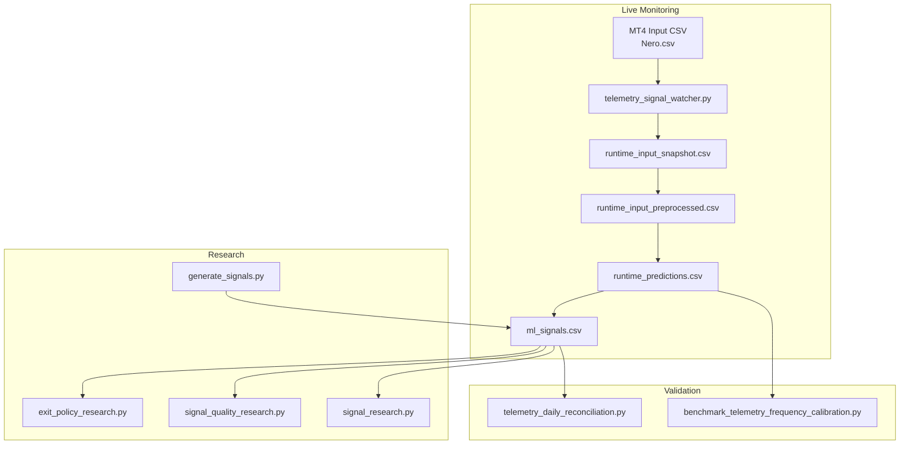
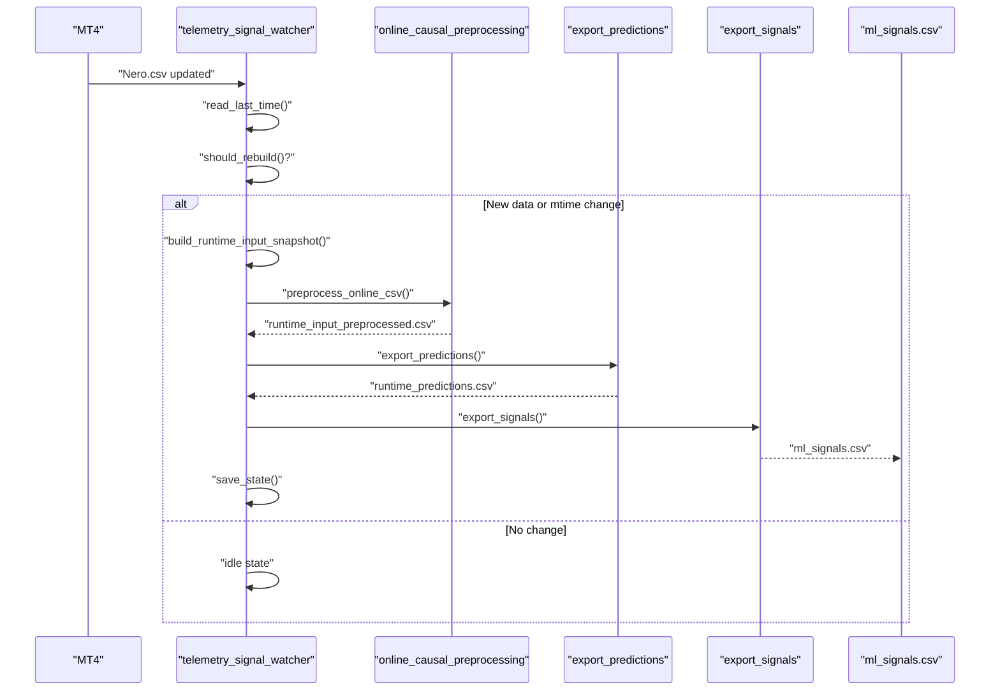
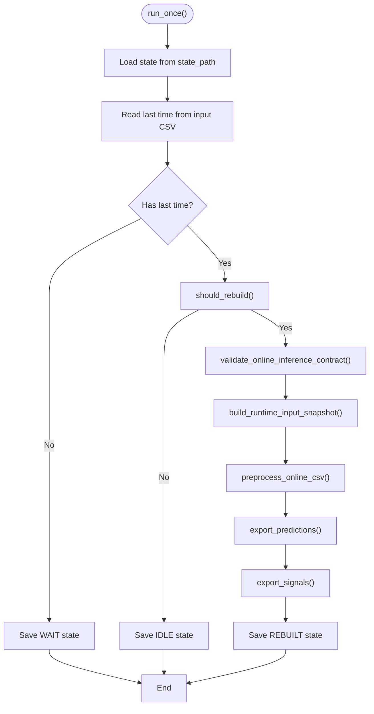
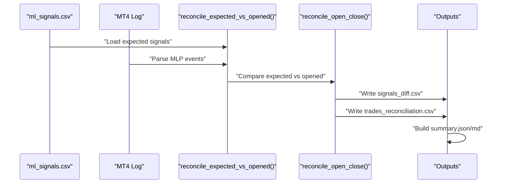
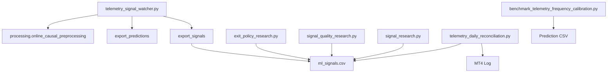

# Telemetry Monitoring

<cite>
**Referenced Files in This Document**
- [telemetry_signal_watcher.py](file://API/telemetry_signal_watcher.py)
- [exit_policy_research.py](file://API/exit_policy_research.py)
- [signal_quality_research.py](file://API/signal_quality_research.py)
- [generate_signals.py](file://API/generate_signals.py)
- [signal_research.py](file://API/signal_research.py)
- [telemetry_daily_reconciliation.py](file://ML/telemetry_daily_reconciliation.py)
- [benchmark_telemetry_frequency_calibration.py](file://ML/benchmark_telemetry_frequency_calibration.py)
- [ml_signals_telemetry_frequency_v1.csv](file://ML/reports/telemetry_frequency_v1/ml_signals_telemetry_frequency_v1.csv)
- [selected_rule.json](file://ML/reports/telemetry_frequency_v1/calibration/selected_rule.json)
</cite>

## Table of Contents
1. [Introduction](#introduction)
2. [Project Structure](#project-structure)
3. [Core Components](#core-components)
4. [Architecture Overview](#architecture-overview)
5. [Detailed Component Analysis](#detailed-component-analysis)
6. [Dependency Analysis](#dependency-analysis)
7. [Performance Considerations](#performance-considerations)
8. [Troubleshooting Guide](#troubleshooting-guide)
9. [Conclusion](#conclusion)
10. [Appendices](#appendices)

## Introduction
This document describes the telemetry monitoring system that continuously tracks live trading performance and generates real-time signals. It focuses on the telemetry_signal_watcher service that monitors trading data streams and triggers signal generation, along with supporting components for exit policy research, signal quality research, daily reconciliation, and frequency calibration. The system integrates machine learning predictions with MetaTrader 4 (MT4) execution via CSV-based telemetry, enabling operational monitoring, research validation, and automated alerting.

## Project Structure
The telemetry monitoring system spans several modules:
- Live watcher: continuously polls the MT4-generated input CSV and rebuilds signals when new data arrives
- Research modules: offline evaluation of exit policies, signal quality filters, and variant 3 execution scenarios
- Calibration and reconciliation: frequency calibration for diagnostic telemetry and daily reconciliation between expected and executed trades
- Signal generation: produces CSV exports for MT4 Strategy Tester and research consumption

**Diagram sources**
- [telemetry_signal_watcher.py:1-422](file://API/telemetry_signal_watcher.py#L1-L422)
- [telemetry_daily_reconciliation.py:1-364](file://ML/telemetry_daily_reconciliation.py#L1-L364)
- [benchmark_telemetry_frequency_calibration.py:1-310](file://ML/benchmark_telemetry_frequency_calibration.py#L1-L310)
- [exit_policy_research.py:1-416](file://API/exit_policy_research.py#L1-L416)
- [signal_quality_research.py:1-818](file://API/signal_quality_research.py#L1-L818)
- [signal_research.py:1-1855](file://API/signal_research.py#L1-L1855)
- [generate_signals.py:1-745](file://API/generate_signals.py#L1-L745)

**Section sources**
- [telemetry_signal_watcher.py:1-422](file://API/telemetry_signal_watcher.py#L1-L422)
- [telemetry_daily_reconciliation.py:1-364](file://ML/telemetry_daily_reconciliation.py#L1-L364)
- [benchmark_telemetry_frequency_calibration.py:1-310](file://ML/benchmark_telemetry_frequency_calibration.py#L1-L310)
- [exit_policy_research.py:1-416](file://API/exit_policy_research.py#L1-L416)
- [signal_quality_research.py:1-818](file://API/signal_quality_research.py#L1-L818)
- [signal_research.py:1-1855](file://API/signal_research.py#L1-L1855)
- [generate_signals.py:1-745](file://API/generate_signals.py#L1-L745)

## Core Components
- telemetry_signal_watcher: continuous polling and rebuild pipeline for live telemetry signals
- telemetry_daily_reconciliation: daily reconciliation between expected and executed trades
- benchmark_telemetry_frequency_calibration: frequency calibration for diagnostic telemetry
- exit_policy_research: offline research of ML exit and position management policies
- signal_quality_research: multi-horizon prediction feature research for signal quality filtering
- signal_research: variant 2/3 research for signal passport, barriers, and entry scenarios
- generate_signals: research and MT4 export of ML signals

Key runtime artifacts:
- runtime_input_snapshot.csv: tail snapshot of input for causal preprocessing
- runtime_input_preprocessed.csv: causal preprocessed input for inference
- runtime_predictions.csv: model predictions for the live window
- ml_signals.csv: final CSV for MT4 consumption

**Section sources**
- [telemetry_signal_watcher.py:1-422](file://API/telemetry_signal_watcher.py#L1-L422)
- [telemetry_daily_reconciliation.py:1-364](file://ML/telemetry_daily_reconciliation.py#L1-L364)
- [benchmark_telemetry_frequency_calibration.py:1-310](file://ML/benchmark_telemetry_frequency_calibration.py#L1-L310)
- [exit_policy_research.py:1-416](file://API/exit_policy_research.py#L1-L416)
- [signal_quality_research.py:1-818](file://API/signal_quality_research.py#L1-L818)
- [signal_research.py:1-1855](file://API/signal_research.py#L1-L1855)
- [generate_signals.py:1-745](file://API/generate_signals.py#L1-L745)

## Architecture Overview
The telemetry monitoring architecture comprises three primary flows:
- Live watcher flow: reads MT4 input CSV, snapshots recent rows, preprocesses causally, runs inference, and exports signals
- Research flow: evaluates exit policies, signal quality filters, and execution variants using historical signals and OHLC
- Validation flow: reconciles expected signals with MT4 open/close logs and validates telemetry frequency calibration

**Diagram sources**
- [telemetry_signal_watcher.py:260-327](file://API/telemetry_signal_watcher.py#L260-L327)
- [telemetry_signal_watcher.py:203-257](file://API/telemetry_signal_watcher.py#L203-L257)

**Section sources**
- [telemetry_signal_watcher.py:260-327](file://API/telemetry_signal_watcher.py#L260-L327)

## Detailed Component Analysis

### telemetry_signal_watcher: Live Telemetry Signal Watcher
The watcher continuously monitors the MT4 input CSV and rebuilds signals when new data appears. It enforces an online inference contract to prevent using features that require future information.

Key behaviors:
- Polling and heartbeat: configurable poll interval and heartbeat messages
- Contract enforcement: blocks legacy "original_contour/original_baseline" unless explicitly overridden
- Snapshot and preprocessing: builds a tail snapshot and applies causal preprocessing
- Inference and export: runs predictions and exports signals with metadata
- State persistence: maintains last processed time and mtime to detect changes

Configuration options:
- --input-csv: input CSV path (default: MT/MQL4/Files/Nero.csv)
- --checkpoint: model checkpoint path (default: ML/reports/take_skip_trailing_stop_v2_matrix/transformer_seq50/checkpoint.pt)
- --rule-path: telemetry rule JSON (default: ML/reports/telemetry_frequency_v1/calibration/selected_rule.json)
- --predictions-output: runtime predictions CSV (default: ML/reports/telemetry_frequency_v1/runtime/runtime_predictions.csv)
- --signals-output: ml_signals.csv (default: ML/reports/telemetry_frequency_v1/runtime/runtime_ml_signals.csv)
- --metadata-output: export metadata JSON (default: ML/reports/telemetry_frequency_v1/runtime/runtime_export_metadata.json)
- --state-path: watcher state JSON (default: ML/reports/telemetry_frequency_v1/runtime/runtime_state.json)
- --runtime-input-snapshot: snapshot CSV (default: ML/reports/telemetry_frequency_v1/runtime/runtime_input_snapshot.csv)
- --runtime-input-preprocessed: preprocessed CSV (default: ML/reports/telemetry_frequency_v1/runtime/runtime_input_preprocessed.csv)
- --poll-interval-sec: polling interval in seconds (default: 1)
- --heartbeat-sec: heartbeat interval in seconds (default: 60)
- --max-runtime-rows: maximum rows in runtime snapshot (default: 12000)
- --diagnostic-target-signals-per-year: diagnostic target signals per year (default: 500)
- --batch-size: inference batch size (default: 256)
- --allow-unsafe-future-features: bypass online contract guard (default: False)
- --once: run once and exit (default: False)
- --verbose: enable verbose logging (default: False)

Alert conditions and anomalies:
- Contract violation raises OnlineInferenceContractError for legacy "original_contour/original_baseline"
- Heartbeat messages indicate WAIT (first row missing), IDLE (no change), or REBUILT (successful rebuild)
- Runtime snapshot validation ensures non-empty input before inference

**Diagram sources**
- [telemetry_signal_watcher.py:260-327](file://API/telemetry_signal_watcher.py#L260-L327)
- [telemetry_signal_watcher.py:203-257](file://API/telemetry_signal_watcher.py#L203-L257)

**Section sources**
- [telemetry_signal_watcher.py:1-422](file://API/telemetry_signal_watcher.py#L1-L422)

### telemetry_daily_reconciliation: Daily Reconciliation
This module reconciles expected signals with actual MT4 open/close events and optionally compares against export metadata.

Inputs:
- ml_signals.csv (expected signals)
- MT4 log containing MLP BUY/SELL/CLOSE events
- Optional export metadata JSON

Outputs:
- signals_diff.csv: differences between expected and actual opens
- trades_reconciliation.csv: open/close linkage by ticket
- summary.json and summary.md: daily reconciliation metrics

Key metrics:
- expected_signals, opened_trades, closed_trades
- critical_mismatch_count (non-zero exit indicates critical mismatches)
- missing_close_count

**Diagram sources**
- [telemetry_daily_reconciliation.py:290-329](file://ML/telemetry_daily_reconciliation.py#L290-L329)

**Section sources**
- [telemetry_daily_reconciliation.py:1-364](file://ML/telemetry_daily_reconciliation.py#L1-L364)

### benchmark_telemetry_frequency_calibration: Frequency Calibration
Calibrates diagnostic telemetry frequency using take/skip scores from frozen exports. The winner is selected by trade frequency rather than profit factor.

Inputs:
- Prediction CSV with pred_take_* columns
- Score targets (e.g., take_24_x8)

Outputs:
- calibration_grid.csv: evaluation grid
- selected_rule.json: chosen diagnostic preset
- summary.json and summary.md: calibration summary

Selection criteria:
- Ranked by trades_per_day, then trades, then same_time_opposite_signal_groups
- Execution parameters include stop_atr, take_profit_atr, max_hold_bars, max_positions

**Section sources**
- [benchmark_telemetry_frequency_calibration.py:1-310](file://ML/benchmark_telemetry_frequency_calibration.py#L1-L310)
- [selected_rule.json](file://ML/reports/telemetry_frequency_v1/calibration/selected_rule.json)

### exit_policy_research: Exit Policy Research
Offline research comparing ML exit and position management policies without retraining. Supports layered exit policies with reverse ratios, keep ratios, profit guards, and minimum hold bars.

Key features:
- Policy library construction with configurable parameters
- Trade simulation with exit logic and blocked signals
- Ranking by profit factor and trade count with minimum trade floor
- Optional saving of best policy with MQL threshold rendering

**Section sources**
- [exit_policy_research.py:1-416](file://API/exit_policy_research.py#L1-L416)

### signal_quality_research: Signal Quality Research
Research on multi-horizon prediction features as signal quality filters. Includes variance checks, discovery/holdout splits, univariate response maps, shallow tree discovery, pairwise combinations, scoring, and holdout validation.

Key steps:
- Feature computation (ratio_h, spread_h, short_vs_long)
- Variance checks to prune near-constant features
- Discovery/holdout split and univariate analysis
- Shallow tree discovery for split identification
- Pairwise combination testing
- Score construction and holdout validation
- Year stability and cross-analysis with variant 3 pullback entry

**Section sources**
- [signal_quality_research.py:1-818](file://API/signal_quality_research.py#L1-L818)

### signal_research: Variant 2/3 Research
Computes excursions and barrier outcomes for signal passport analysis, pullback profiles, and variant 3 execution scenarios. Provides cohort summaries, entry opportunity profiles, and PIC price validation.

Key components:
- Excursion computation across horizons
- Barrier matrix outcomes and summaries
- Cohort analysis and entry opportunity profiling
- Variant 3 scenario specifications and outcomes

**Section sources**
- [signal_research.py:1-1855](file://API/signal_research.py#L1-L1855)

### generate_signals: Signal Generation
Generates CSV exports of ML signals for MT4 Strategy Tester and research-only exports. Supports multiple tasks and models, including regression_updn, triple barrier, entry path, and trailing stop targets.

Key features:
- Model loading and inference across train/validation/test splits
- Signal conversion from predictions with optional conformal quantiles
- Triple barrier probability calibration and signal generation
- Research export prefixes for entry path and trailing stop tasks

**Section sources**
- [generate_signals.py:1-745](file://API/generate_signals.py#L1-L745)

## Dependency Analysis
The telemetry system exhibits clear separation of concerns:
- Live watcher depends on preprocessing and export modules for inference and signal generation
- Research modules depend on signal exports and OHLC data for offline evaluation
- Validation modules depend on signal exports and MT4 logs for reconciliation
- Calibration depends on prediction CSVs with specific score columns

**Diagram sources**
- [telemetry_signal_watcher.py:203-257](file://API/telemetry_signal_watcher.py#L203-L257)
- [telemetry_daily_reconciliation.py:290-329](file://ML/telemetry_daily_reconciliation.py#L290-L329)
- [benchmark_telemetry_frequency_calibration.py:244-284](file://ML/benchmark_telemetry_frequency_calibration.py#L244-L284)
- [exit_policy_research.py:299-330](file://API/exit_policy_research.py#L299-L330)
- [signal_quality_research.py:735-740](file://API/signal_quality_research.py#L735-L740)
- [signal_research.py:170-209](file://API/signal_research.py#L170-L209)

**Section sources**
- [telemetry_signal_watcher.py:203-257](file://API/telemetry_signal_watcher.py#L203-L257)
- [telemetry_daily_reconciliation.py:290-329](file://ML/telemetry_daily_reconciliation.py#L290-L329)
- [benchmark_telemetry_frequency_calibration.py:244-284](file://ML/benchmark_telemetry_frequency_calibration.py#L244-L284)
- [exit_policy_research.py:299-330](file://API/exit_policy_research.py#L299-L330)
- [signal_quality_research.py:735-740](file://API/signal_quality_research.py#L735-L740)
- [signal_research.py:170-209](file://API/signal_research.py#L170-L209)

## Performance Considerations
- Polling interval: set --poll-interval-sec to balance responsiveness and resource usage (default 1 second)
- Batch size: adjust --batch-size for GPU/CPU throughput (default 256)
- Runtime rows: limit --max-runtime-rows to control memory footprint (default 12000)
- Heartbeat: --heartbeat-sec controls logging cadence for long-running watchers
- Concurrency: watcher runs sequentially; consider process isolation for production deployments
- Disk I/O: frequent writes to runtime CSVs; ensure adequate disk throughput

## Troubleshooting Guide
Common issues and resolutions:
- Contract violations: if encountering OnlineInferenceContractError for "original_contour/original_baseline", retrain with live-safe features or use --allow-unsafe-future-features only for diagnostics
- Empty input: ensure MT4 continues writing to Nero.csv; watcher logs WAIT until first row appears
- No rebuild: verify mtime changes or new last time; watcher ignores unchanged inputs
- Reconciliation failures: check MT4 log parsing and signal export completeness; review signals_diff.csv for critical mismatches
- Calibration warnings: confirm prediction CSV contains required pred_take_* columns and proper time formatting

Operational tips:
- Enable --verbose for detailed logging during development
- Monitor heartbeat messages for system health
- Validate runtime snapshots and preprocessed CSVs for data integrity
- Use --once for controlled testing before deploying continuous watchers

**Section sources**
- [telemetry_signal_watcher.py:72-201](file://API/telemetry_signal_watcher.py#L72-L201)
- [telemetry_daily_reconciliation.py:165-221](file://ML/telemetry_daily_reconciliation.py#L165-L221)
- [benchmark_telemetry_frequency_calibration.py:36-46](file://ML/benchmark_telemetry_frequency_calibration.py#L36-L46)

## Conclusion
The telemetry monitoring system provides a robust pipeline for live signal generation, research validation, and operational reconciliation. The telemetry_signal_watcher ensures timely updates from MT4, while research and validation modules maintain signal quality and operational accuracy. Frequency calibration supports diagnostic telemetry, and the modular design enables flexible deployment and maintenance.

## Appendices

### Telemetry Data Formats
Example telemetry CSV format (ml_signals_telemetry_frequency_v1.csv):
- Header: time;signal
- Values: time formatted as "YYYY.MM.DD HH:MM"; signal: 1 (BUY), -1 (SELL), 0 (FLAT)

**Section sources**
- [ml_signals_telemetry_frequency_v1.csv:1-200](file://ML/reports/telemetry_frequency_v1/ml_signals_telemetry_frequency_v1.csv#L1-L200)

### Monitoring Scripts and Integration
- Live watcher: python -m API.telemetry_signal_watcher [--once] [--poll-interval-sec N] [--heartbeat-sec M] [--verbose]
- Daily reconciliation: python -m ML.telemetry_daily_reconciliation --signals PATH --mt4-log PATH --output-dir PATH [--export-metadata PATH]
- Frequency calibration: python -m ML.benchmark_telemetry_frequency_calibration --predictions PATH --score-target take_24_x8 --output-dir PATH
- Exit policy research: python -m API.exit_policy_research --split-profile validation_research [--save-best PATH]
- Signal quality research: python -m API.signal_quality_research [--test-only]
- Signal research: python -m API.signal_research [--test-only]
- Signal generation: python -m API.generate_signals [--task regression_updn] [--theta FLOAT] [--conformal]

Integration notes:
- MT4 writes to MT/MQL4/Files/Nero.csv; watcher monitors this file
- Exported ml_signals.csv is consumed by MT4 Strategy Tester and EA
- Reconciliation compares expected signals with MLP open/close events in MT4 logs
- Calibration uses prediction CSVs with pred_take_* columns

**Section sources**
- [telemetry_signal_watcher.py:330-357](file://API/telemetry_signal_watcher.py#L330-L357)
- [telemetry_daily_reconciliation.py:335-344](file://ML/telemetry_daily_reconciliation.py#L335-L344)
- [benchmark_telemetry_frequency_calibration.py:287-294](file://ML/benchmark_telemetry_frequency_calibration.py#L287-L294)
- [exit_policy_research.py:372-385](file://API/exit_policy_research.py#L372-L385)
- [signal_quality_research.py:735-740](file://API/signal_quality_research.py#L735-L740)
- [signal_research.py:170-209](file://API/signal_research.py#L170-L209)
- [generate_signals.py:725-745](file://API/generate_signals.py#L725-L745)