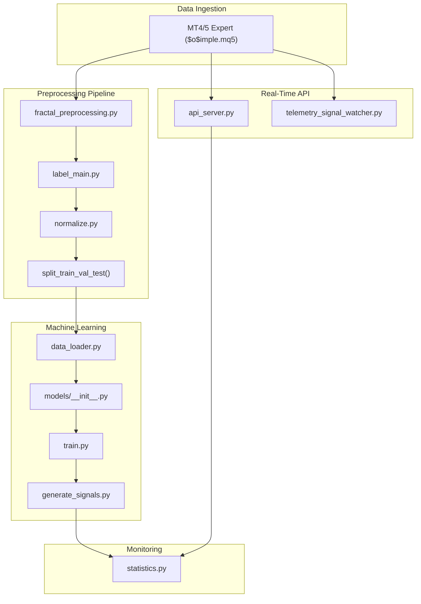
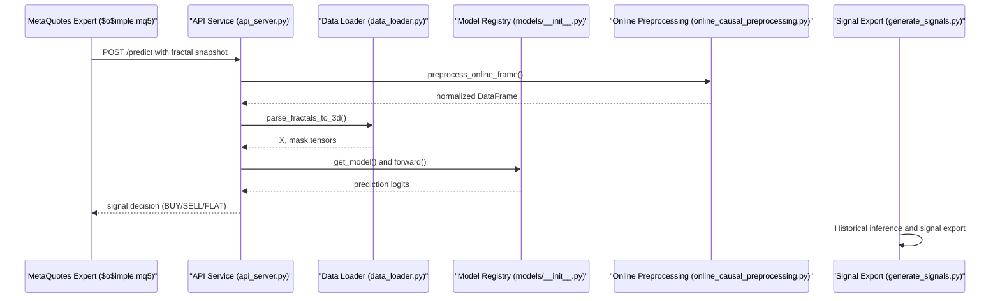
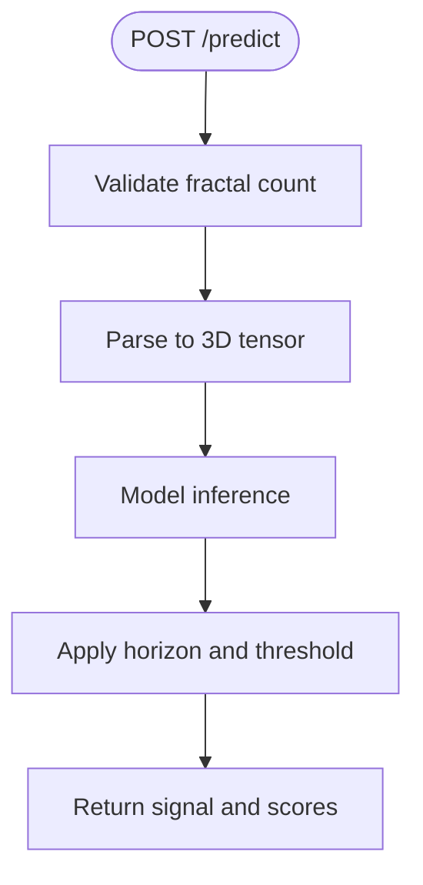
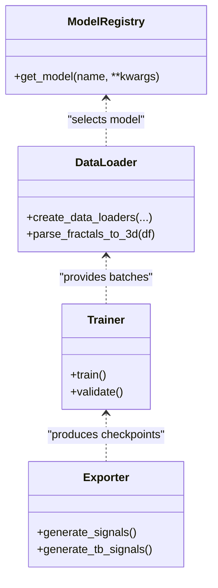
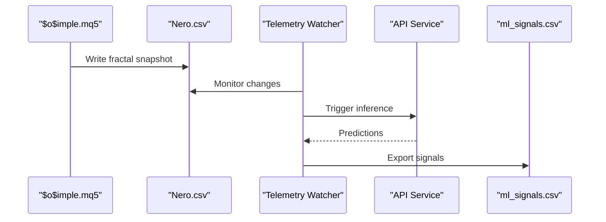
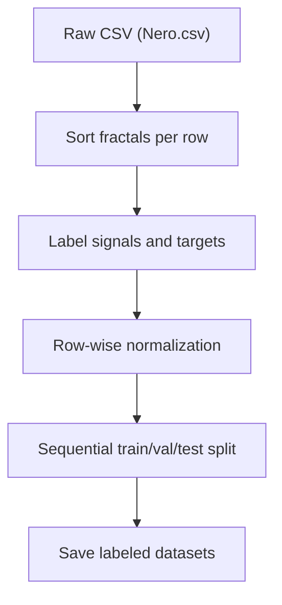
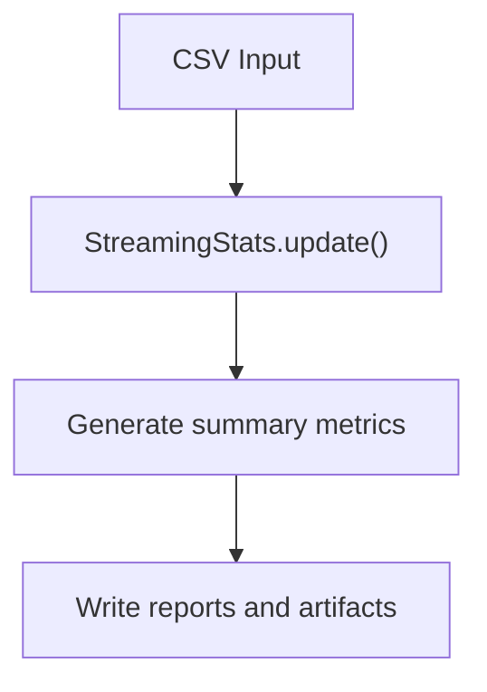
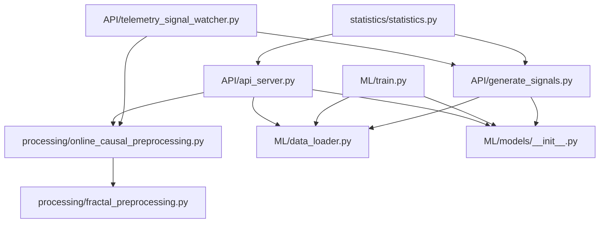

# Core Components Overview

<cite>
**Referenced Files in This Document**
- [README.md](file://README.md)
- [DATA_FLOW.md](file://docs/DATA_FLOW.md)
- [API/api_server.py](file://API/api_server.py)
- [API/generate_signals.py](file://API/generate_signals.py)
- [API/telemetry_signal_watcher.py](file://API/telemetry_signal_watcher.py)
- [ML/models/__init__.py](file://ML/models/__init__.py)
- [ML/data_loader.py](file://ML/data_loader.py)
- [ML/train.py](file://ML/train.py)
- [processing/label_main.py](file://processing/label_main.py)
- [processing/online_causal_preprocessing.py](file://processing/online_causal_preprocessing.py)
- [processing/fractal_preprocessing.py](file://processing/fractal_preprocessing.py)
- [statistics/statistics.py](file://statistics/statistics.py)
- [MT/MQL5/Experts/$o$imple.mq5](file://MT/MQL5/Experts/$o$imple.mq5)
</cite>

## Table of Contents
1. [Introduction](#introduction)
2. [Project Structure](#project-structure)
3. [Core Components](#core-components)
4. [Architecture Overview](#architecture-overview)
5. [Detailed Component Analysis](#detailed-component-analysis)
6. [Dependency Analysis](#dependency-analysis)
7. [Performance Considerations](#performance-considerations)
8. [Troubleshooting Guide](#troubleshooting-guide)
9. [Conclusion](#conclusion)

## Introduction
This document provides a comprehensive overview of the SoSimple trading system's core components and their interactions. The system integrates MetaTrader 4/5 market data ingestion, a data preprocessing pipeline, machine learning models for inference, a real-time API service, and statistical analysis for performance monitoring. It is designed to operate in both backtesting and live environments, with careful attention to preventing data leakage and maintaining temporal consistency.

## Project Structure
The repository is organized into distinct functional areas:
- API: REST endpoints and telemetry orchestration for real-time inference and signal generation
- ML: Model registry, training, evaluation, and export utilities
- processing: Data preparation, labeling, normalization, and causal preprocessing
- statistics: Statistical analysis and reporting for performance monitoring
- MT: MetaQuotes Expert Advisors and integration assets
- docs: Pipeline documentation and design specifications

**Diagram sources**
- [MT/MQL5/Experts/$o$imple.mq5:1-157](file://MT/MQL5/Experts/$o$imple.mq5#L1-L157)
- [processing/fractal_preprocessing.py:1-86](file://processing/fractal_preprocessing.py#L1-L86)
- [processing/label_main.py:1-332](file://processing/label_main.py#L1-L332)
- [ML/data_loader.py:1-800](file://ML/data_loader.py#L1-L800)
- [ML/models/__init__.py:1-49](file://ML/models/__init__.py#L1-L49)
- [ML/train.py:1-800](file://ML/train.py#L1-L800)
- [API/api_server.py:1-174](file://API/api_server.py#L1-L174)
- [API/telemetry_signal_watcher.py:1-422](file://API/telemetry_signal_watcher.py#L1-L422)
- [statistics/statistics.py:1-477](file://statistics/statistics.py#L1-L477)

**Section sources**
- [README.md:1-25](file://README.md#L1-L25)
- [DATA_FLOW.md:1-562](file://docs/DATA_FLOW.md#L1-L562)

## Core Components
This section describes the five main components and their roles in the SoSimple trading workflow:

- API Services for Real-Time Inference
  - Provides a FastAPI endpoint to accept fractal snapshots from MetaQuotes and return ML-driven trading signals
  - Implements live-safe preprocessing, model loading, inference, and decision logic
  - Supports configurable horizons and thresholds for signal generation

- ML Models for Prediction
  - Registry of neural network architectures (Transformer, BiLSTM, CNN1D, Hybrid)
  - Data loaders for parsing fractal sequences into tensors with causal preprocessing
  - Training and evaluation utilities with early stopping and scheduler support
  - Export utilities for generating historical and real-time signals

- MetaTrader Integration for Execution
  - Expert Advisor ($o$imple.mq5) creates the input CSV (Nero.csv) containing fractal features
  - Signals are consumed by the EA to place trades according to configured rules
  - Telemetry watcher orchestrates continuous runtime inference and signal updates

- Data Processing Pipeline for Feature Engineering
  - Sorts fractals per row to ensure temporal ordering
  - Labels datasets with signals, predictions, and outcome-aligned targets
  - Applies row-wise normalization to stabilize training and inference
  - Splits datasets temporally to prevent leakage

- Statistical Analysis for Performance Monitoring
  - Streams and aggregates statistics from CSV data for feature distributions and class balances
  - Generates diagnostic reports and reconciliations for trade-level analysis
  - Supports telemetry-based runtime monitoring and heartbeat logging

**Section sources**
- [API/api_server.py:1-174](file://API/api_server.py#L1-L174)
- [ML/models/__init__.py:1-49](file://ML/models/__init__.py#L1-L49)
- [ML/data_loader.py:1-800](file://ML/data_loader.py#L1-L800)
- [ML/train.py:1-800](file://ML/train.py#L1-L800)
- [processing/label_main.py:1-332](file://processing/label_main.py#L1-L332)
- [processing/online_causal_preprocessing.py:1-137](file://processing/online_causal_preprocessing.py#L1-L137)
- [statistics/statistics.py:1-477](file://statistics/statistics.py#L1-L477)
- [MT/MQL5/Experts/$o$imple.mq5:1-157](file://MT/MQL5/Experts/$o$imple.mq5#L1-L157)

## Architecture Overview
The SoSimple system follows a staged pipeline from market data ingestion to model-driven trading decisions, with optional real-time inference and continuous monitoring.

**Diagram sources**
- [API/api_server.py:103-169](file://API/api_server.py#L103-L169)
- [processing/online_causal_preprocessing.py:109-122](file://processing/online_causal_preprocessing.py#L109-L122)
- [ML/data_loader.py:331-424](file://ML/data_loader.py#L331-L424)
- [ML/models/__init__.py:31-49](file://ML/models/__init__.py#L31-L49)
- [API/generate_signals.py:342-668](file://API/generate_signals.py#L342-L668)

## Detailed Component Analysis

### API Services for Real-Time Inference
Responsibilities:
- Accepts fractal snapshots via REST API
- Performs live-safe preprocessing (sorting, validation, rowwise normalization)
- Loads trained model and performs inference
- Applies decision logic (horizon and threshold) to produce trading signals
- Integrates with telemetry watcher for continuous runtime inference

Interfaces and Integration Patterns:
- FastAPI endpoint "/predict" with Pydantic request model
- Uses ML data loader and model registry
- Integrates with telemetry watcher for automated runtime updates

**Diagram sources**
- [API/api_server.py:103-169](file://API/api_server.py#L103-L169)

**Section sources**
- [API/api_server.py:1-174](file://API/api_server.py#L1-L174)

### ML Models for Prediction
Responsibilities:
- Model registry and selection
- Data loading and parsing of fractal sequences
- Training with early stopping and schedulers
- Export utilities for historical and real-time signals

Interfaces and Integration Patterns:
- Unified model interface across architectures
- DataLoader factory for training and evaluation
- Export functions for MT4-compatible CSVs

**Diagram sources**
- [ML/models/__init__.py:1-49](file://ML/models/__init__.py#L1-L49)
- [ML/data_loader.py:549-800](file://ML/data_loader.py#L549-L800)
- [ML/train.py:176-441](file://ML/train.py#L176-L441)
- [API/generate_signals.py:342-668](file://API/generate_signals.py#L342-L668)

**Section sources**
- [ML/models/__init__.py:1-49](file://ML/models/__init__.py#L1-L49)
- [ML/data_loader.py:1-800](file://ML/data_loader.py#L1-L800)
- [ML/train.py:1-800](file://ML/train.py#L1-L800)
- [API/generate_signals.py:1-745](file://API/generate_signals.py#L1-L745)

### MetaTrader Integration for Execution
Responsibilities:
- Creates input CSV (Nero.csv) with fractal features
- Consumes ML signals for trade execution
- Telemetry watcher orchestrates runtime inference and signal updates

Integration Details:
- Expert Advisor writes structured CSV with fractal fields
- Watcher monitors CSV changes and triggers preprocessing and inference
- Exports ml_signals.csv for EA consumption

**Diagram sources**
- [MT/MQL5/Experts/$o$imple.mq5:1-157](file://MT/MQL5/Experts/$o$imple.mq5#L1-L157)
- [API/telemetry_signal_watcher.py:203-257](file://API/telemetry_signal_watcher.py#L203-L257)

**Section sources**
- [MT/MQL5/Experts/$o$imple.mq5:1-157](file://MT/MQL5/Experts/$o$imple.mq5#L1-L157)
- [API/telemetry_signal_watcher.py:1-422](file://API/telemetry_signal_watcher.py#L1-L422)

### Data Processing Pipeline for Feature Engineering
Responsibilities:
- Sort fractals per row to ensure temporal ordering
- Label datasets with signals, predictions, and outcome-aligned targets
- Apply row-wise normalization to stabilize training and inference
- Split datasets temporally to prevent leakage

Key Functions:
- sort_fractals_in_dataframe: Ensures descending time order per row
- label_all and label_updn: Creates supervised targets
- normalize_rowwise: Applies piecewise and min-max transformations
- split_train_val_test: Sequential split preserving time order

**Diagram sources**
- [processing/fractal_preprocessing.py:65-85](file://processing/fractal_preprocessing.py#L65-L85)
- [processing/label_main.py:205-332](file://processing/label_main.py#L205-L332)
- [processing/online_causal_preprocessing.py:109-122](file://processing/online_causal_preprocessing.py#L109-L122)

**Section sources**
- [processing/fractal_preprocessing.py:1-86](file://processing/fractal_preprocessing.py#L1-L86)
- [processing/label_main.py:1-332](file://processing/label_main.py#L1-L332)
- [processing/online_causal_preprocessing.py:1-137](file://processing/online_causal_preprocessing.py#L1-L137)

### Statistical Analysis for Performance Monitoring
Responsibilities:
- Stream and aggregate statistics from CSV data
- Generate reports on feature distributions and class balances
- Support telemetry-based runtime monitoring and reconciliation

Key Features:
- StreamingStats: Online computation of means, variances, and quantiles
- Processors for signal research and trade-level tracing
- Heartbeat logging for watcher operations

**Diagram sources**
- [statistics/statistics.py:51-167](file://statistics/statistics.py#L51-L167)

**Section sources**
- [statistics/statistics.py:1-477](file://statistics/statistics.py#L1-L477)

## Dependency Analysis
The components interact through well-defined interfaces and shared data contracts:

**Diagram sources**
- [API/api_server.py:1-174](file://API/api_server.py#L1-L174)
- [processing/online_causal_preprocessing.py:1-137](file://processing/online_causal_preprocessing.py#L1-L137)
- [processing/fractal_preprocessing.py:1-86](file://processing/fractal_preprocessing.py#L1-L86)
- [ML/data_loader.py:1-800](file://ML/data_loader.py#L1-L800)
- [ML/models/__init__.py:1-49](file://ML/models/__init__.py#L1-L49)
- [ML/train.py:1-800](file://ML/train.py#L1-L800)
- [API/generate_signals.py:1-745](file://API/generate_signals.py#L1-L745)
- [API/telemetry_signal_watcher.py:1-422](file://API/telemetry_signal_watcher.py#L1-L422)
- [statistics/statistics.py:1-477](file://statistics/statistics.py#L1-L477)

**Section sources**
- [DATA_FLOW.md:1-562](file://docs/DATA_FLOW.md#L1-L562)

## Performance Considerations
- Data preprocessing is vectorized and rowwise to minimize overhead during inference
- Model checkpoints include sequence length and architecture parameters for consistent inference
- DataLoader caching reduces repeated parsing costs for training and evaluation
- Telemetry watcher uses minimal polling intervals and atomic file writes to reduce I/O contention
- Normalization parameters are saved for denormalization and reproducible experiments

## Troubleshooting Guide
Common issues and resolutions:
- Model not found: Ensure checkpoint exists and matches expected suffix for the chosen task
- Invalid sequence length: Verify seq_len matches the model's expected input length
- Data leakage prevention: Confirm preprocessing steps are applied in the correct order and no future-looking features are introduced
- Telemetry watcher errors: Check CSV contract and ensure the watcher is allowed to use the selected feature mode

**Section sources**
- [API/api_server.py:59-88](file://API/api_server.py#L59-L88)
- [API/telemetry_signal_watcher.py:180-201](file://API/telemetry_signal_watcher.py#L180-L201)
- [DATA_FLOW.md:525-534](file://docs/DATA_FLOW.md#L525-L534)

## Conclusion
The SoSimple trading system integrates MetaTrader data ingestion, a robust preprocessing pipeline, flexible ML modeling, real-time inference capabilities, and comprehensive statistical monitoring. Its modular design enables iterative improvements in feature engineering, model architectures, and execution policies while maintaining strict temporal consistency and leak prevention. The documented interfaces and data flows provide a clear foundation for extending the system and deploying it in production environments.