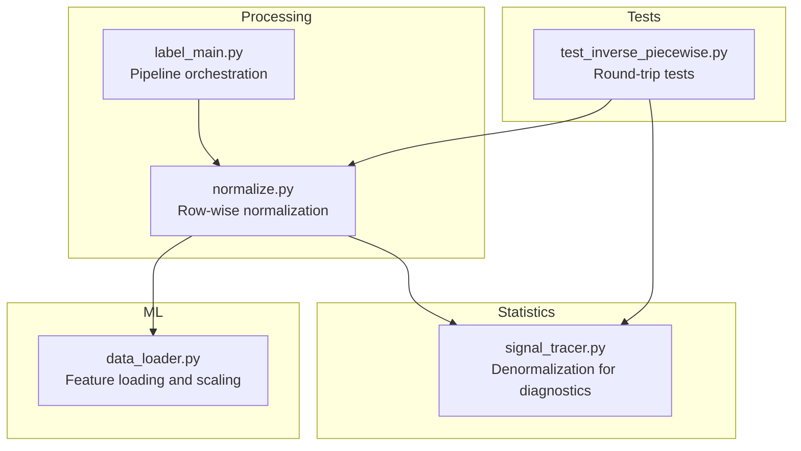
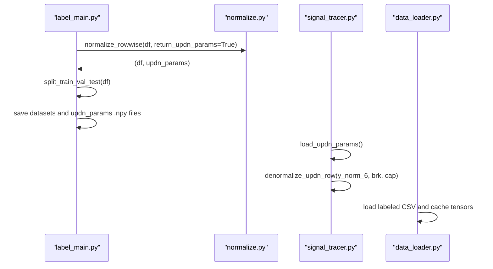
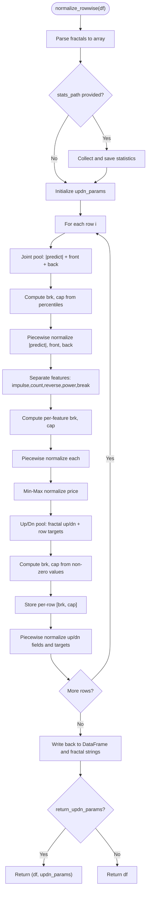
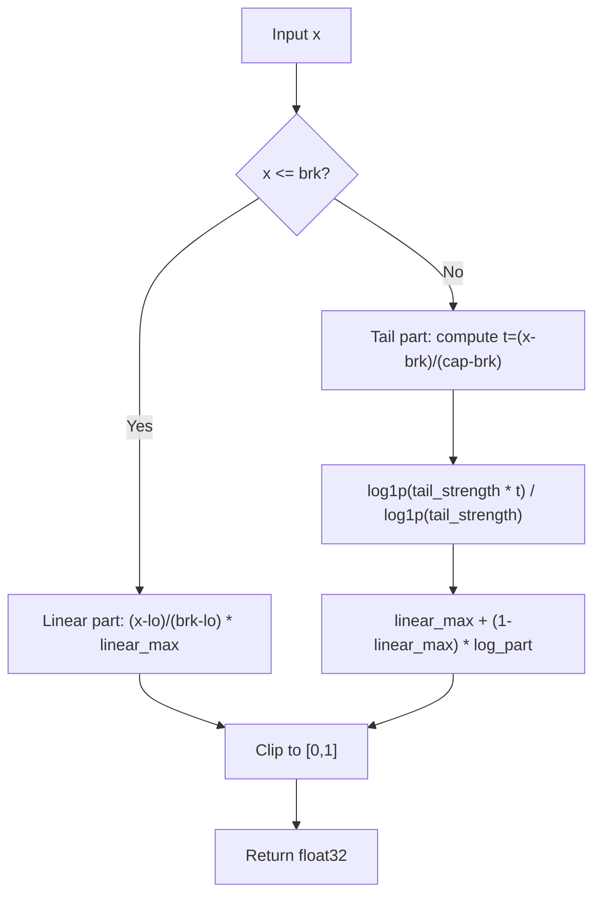
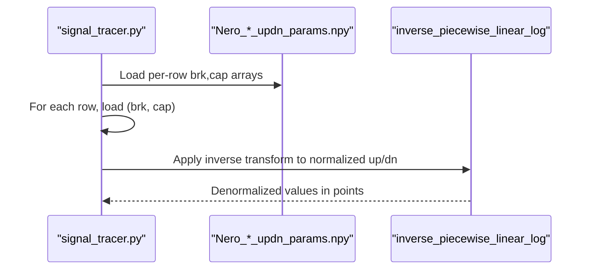
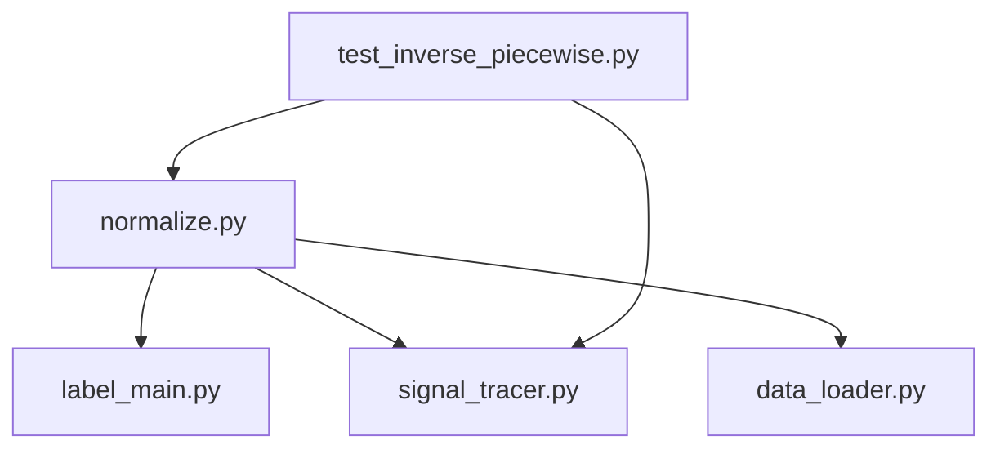

# Data Normalization and Scaling

<cite>
**Referenced Files in This Document**
- [normalize.py](file://processing/normalize.py)
- [label_main.py](file://processing/label_main.py)
- [signal_tracer.py](file://statistics/signal_tracer.py)
- [test_inverse_piecewise.py](file://tests/test_inverse_piecewise.py)
- [CHANGELOG.md](file://CHANGELOG.md)
- [data_loader.py](file://ML/data_loader.py)
</cite>

## Table of Contents
1. [Introduction](#introduction)
2. [Project Structure](#project-structure)
3. [Core Components](#core-components)
4. [Architecture Overview](#architecture-overview)
5. [Detailed Component Analysis](#detailed-component-analysis)
6. [Dependency Analysis](#dependency-analysis)
7. [Performance Considerations](#performance-considerations)
8. [Troubleshooting Guide](#troubleshooting-guide)
9. [Conclusion](#conclusion)
10. [Appendices](#appendices)

## Introduction
This document describes the data normalization system that ensures consistent feature scaling across the SoSimple pipeline. It focuses on the row-wise normalization procedure implemented in normalize_rowwise(), the underlying piecewise linear-log transformation, and the storage and usage of per-row normalization parameters for precise denormalization. It also covers mathematical foundations, statistical preservation, scaling strategies for different feature types, parameter validation, consistency checks, performance impact, and troubleshooting.

## Project Structure
The normalization system spans several modules:
- Processing module: row-wise normalization and ATR normalization
- Labeling pipeline: orchestration of labeling, normalization, splitting, and parameter persistence
- Statistics module: denormalization utilities for diagnostics
- Tests: round-trip validation of inverse transforms and parameter collection
- Data loading: downstream consumers of normalized features

**Diagram sources**
- [normalize.py:284-511](file://processing/normalize.py#L284-L511)
- [label_main.py:288-312](file://processing/label_main.py#L288-L312)
- [signal_tracer.py:58-82](file://statistics/signal_tracer.py#L58-L82)
- [test_inverse_piecewise.py:25-51](file://tests/test_inverse_piecewise.py#L25-L51)
- [data_loader.py:74-92](file://ML/data_loader.py#L74-L92)

**Section sources**
- [normalize.py:1-669](file://processing/normalize.py#L1-L669)
- [label_main.py:250-332](file://processing/label_main.py#L250-L332)
- [signal_tracer.py:1-200](file://statistics/signal_tracer.py#L1-L200)
- [test_inverse_piecewise.py:1-133](file://tests/test_inverse_piecewise.py#L1-L133)
- [data_loader.py:1-200](file://ML/data_loader.py#L1-L200)

## Core Components
- Row-wise normalization function: normalize_rowwise()
- Piecewise linear-log transform: piecewise_linear_log_transform()
- Min-Max normalization: minmax_normalize()
- ATR normalization: normalize_atr_train(), normalize_atr_inference()
- Per-row parameter storage: updn_params arrays saved as .npy files
- Denormalization utilities: inverse_piecewise_linear_log()

Key behaviors:
- Row-wise normalization preserves temporal independence and avoids data leakage across rows.
- Separate normalization pools are used for joint features (predict + front + back), separate features (impulse, count, reverse, power, break), price, and Up/Dn targets.
- Per-row parameters brk and cap are computed from percentiles and stored for later denormalization.

**Section sources**
- [normalize.py:284-511](file://processing/normalize.py#L284-L511)
- [normalize.py:213-282](file://processing/normalize.py#L213-L282)
- [normalize.py:596-662](file://processing/normalize.py#L596-L662)
- [signal_tracer.py:58-82](file://statistics/signal_tracer.py#L58-L82)

## Architecture Overview
The normalization pipeline integrates with the labeling and evaluation workflow:

**Diagram sources**
- [label_main.py:288-312](file://processing/label_main.py#L288-L312)
- [normalize.py:284-511](file://processing/normalize.py#L284-L511)
- [signal_tracer.py:85-110](file://statistics/signal_tracer.py#L85-L110)
- [data_loader.py:74-92](file://ML/data_loader.py#L74-L92)

## Detailed Component Analysis

### normalize_rowwise(): Row-wise normalization
normalize_rowwise() performs per-row normalization across fractal features and Up/Dn targets. It:
- Parses fractal strings into a 3D array for efficient computation
- Collects pre-normalization statistics if requested
- Normalizes:
  - Joint pool of |predict|, front, back using shared brk/cap
  - Separate features (impulse, count, reverse, power, break) using per-feature brk/cap
  - Price using min-max scaling
  - Up/Dn fields and row-level Up/Dn targets using per-row brk/cap derived from non-zero values
- Returns the normalized DataFrame and optionally the per-row updn_params array

**Diagram sources**
- [normalize.py:284-511](file://processing/normalize.py#L284-L511)

**Section sources**
- [normalize.py:284-511](file://processing/normalize.py#L284-L511)

### piecewise_linear_log_transform(): Mathematical foundation
The piecewise linear-log transform maps values to [0, 1] with:
- Linear zone: [lo, brk] mapped to [0, linear_max]
- Logarithmic tail: (brk, cap] mapped to (linear_max, 1] via log1p compression
- Numerical stability: uses eps to prevent division by zero and clips outputs to [0, 1]

**Diagram sources**
- [normalize.py:213-258](file://processing/normalize.py#L213-L258)

**Section sources**
- [normalize.py:213-258](file://processing/normalize.py#L213-L258)

### minmax_normalize(): Min-Max scaling
Min-Max normalization scales continuous features to [0, 1] using observed min and max. In degenerate cases (constant feature), it returns 0.5 to avoid undefined scaling.

**Section sources**
- [normalize.py:261-282](file://processing/normalize.py#L261-L282)

### ATR normalization: Global robust scaling
ATR normalization uses RobustScaler for global scaling across training data and applies the same scaler for validation/test. This ensures consistent scaling independent of row-wise normalization.

**Section sources**
- [normalize.py:596-662](file://processing/normalize.py#L596-L662)

### Parameter storage and persistence
Per-row Up/Dn normalization parameters (brk, cap) are computed and stored as .npy files during the labeling pipeline:
- label_main.py calls normalize_rowwise(..., return_updn_params=True)
- After splitting train/val/test, it saves:
  - {output_base}_train_updn_params.npy
  - {output_base}_validation_updn_params.npy
  - {output_base}_test_updn_params.npy

These arrays enable precise denormalization of Up/Dn targets and ground truth values.

**Section sources**
- [label_main.py:288-312](file://processing/label_main.py#L288-L312)
- [CHANGELOG.md:1189-1193](file://CHANGELOG.md#L1189-L1193)

### Denormalization utilities
signal_tracer.py loads per-row updn_params and applies inverse_piecewise_linear_log to convert normalized Up/Dn values back to raw point values. This enables accurate trade-level reconciliation and diagnostics.

**Diagram sources**
- [signal_tracer.py:85-110](file://statistics/signal_tracer.py#L85-L110)
- [signal_tracer.py:58-82](file://statistics/signal_tracer.py#L58-L82)

**Section sources**
- [signal_tracer.py:58-82](file://statistics/signal_tracer.py#L58-L82)
- [signal_tracer.py:85-110](file://statistics/signal_tracer.py#L85-L110)

### Statistical preservation and scaling strategies
- Joint normalization pools preserve relationships among related features (e.g., predict and distances) while maintaining robustness to outliers.
- Separate normalization pools handle heterogeneous distributions (e.g., impulse, count) independently.
- Price normalization uses min-max scaling to maintain boundedness suitable for distance-based models.
- Up/Dn targets are normalized jointly with fractal Up/Dn fields to align scales across features and targets.

**Section sources**
- [normalize.py:284-511](file://processing/normalize.py#L284-L511)

## Dependency Analysis
The normalization system interacts with:
- Labeling pipeline: label_main.py orchestrates normalization and parameter persistence
- Diagnostics: signal_tracer.py consumes per-row parameters for denormalization
- Downstream loaders: data_loader.py loads labeled datasets and prepares features for training
- Tests: test_inverse_piecewise.py validates round-trip transformations and parameter collection

**Diagram sources**
- [normalize.py:284-511](file://processing/normalize.py#L284-L511)
- [label_main.py:288-312](file://processing/label_main.py#L288-L312)
- [signal_tracer.py:85-110](file://statistics/signal_tracer.py#L85-L110)
- [data_loader.py:74-92](file://ML/data_loader.py#L74-L92)
- [test_inverse_piecewise.py:25-51](file://tests/test_inverse_piecewise.py#L25-L51)

**Section sources**
- [normalize.py:284-511](file://processing/normalize.py#L284-L511)
- [label_main.py:288-312](file://processing/label_main.py#L288-L312)
- [signal_tracer.py:85-110](file://statistics/signal_tracer.py#L85-L110)
- [data_loader.py:74-92](file://ML/data_loader.py#L74-L92)
- [test_inverse_piecewise.py:25-51](file://tests/test_inverse_piecewise.py#L25-L51)

## Performance Considerations
- Row-wise normalization is CPU-bound and scales linearly with the number of rows. The implementation uses vectorized NumPy operations to minimize overhead.
- Per-row parameter computation adds modest overhead proportional to the number of features and rows.
- Storing per-row parameters as .npy files is lightweight and enables fast loading during diagnostics.
- ATR normalization uses RobustScaler, which is efficient and robust to outliers.

[No sources needed since this section provides general guidance]

## Troubleshooting Guide
Common issues and resolutions:
- Degenerate features (constant values) in min-max normalization: handled by returning 0.5; verify feature engineering if unexpected.
- Zero values in Up/Dn normalization: intentionally treated as zeros; ensure upstream logic does not misrepresent zero movement.
- Parameter mismatch between training and inference: ensure the same output_base is used for saving and loading per-row parameters.
- Numerical instability: eps prevents division by zero; verify inputs are finite and non-empty before normalization.
- Round-trip failures: use test_inverse_piecewise.py to validate forward and inverse transforms.

Validation and tests:
- Round-trip tests for inverse transforms and parameter collection are provided in tests/test_inverse_piecewise.py.

**Section sources**
- [normalize.py:261-282](file://processing/normalize.py#L261-L282)
- [test_inverse_piecewise.py:83-133](file://tests/test_inverse_piecewise.py#L83-L133)

## Conclusion
The SoSimple normalization system provides robust, row-wise scaling that preserves statistical relationships while enabling precise denormalization for diagnostics. By computing per-row parameters and persisting them alongside datasets, the pipeline maintains consistency across training, validation, and test sets, and supports accurate trade-level reconciliation.

[No sources needed since this section summarizes without analyzing specific files]

## Appendices

### Appendix A: Normalization workflow examples
- Training pipeline: label_main.py → normalize_rowwise() → split → save labeled CSV + updn_params .npy
- Inference pipeline: load labeled CSV → apply per-row denormalization using loaded updn_params
- Diagnostics: signal_tracer.py → load per-row parameters → denormalize Up/Dn → reconcile outcomes

**Section sources**
- [label_main.py:288-312](file://processing/label_main.py#L288-L312)
- [signal_tracer.py:85-110](file://statistics/signal_tracer.py#L85-L110)

### Appendix B: Parameter validation checklist
- Verify per-row arrays shape matches dataset length
- Confirm brk and cap values are positive and ordered (cap ≥ brk)
- Ensure no NaN or infinite values in normalized outputs
- Cross-check round-trip accuracy using test_inverse_piecewise.py

**Section sources**
- [test_inverse_piecewise.py:107-133](file://tests/test_inverse_piecewise.py#L107-L133)