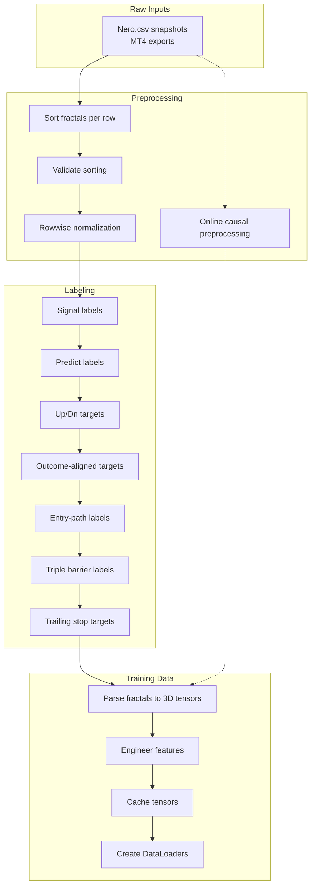
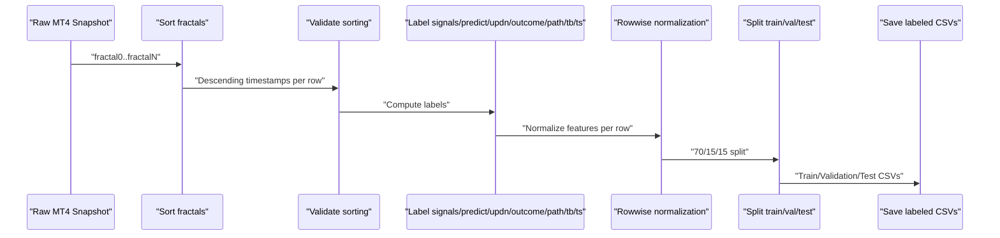
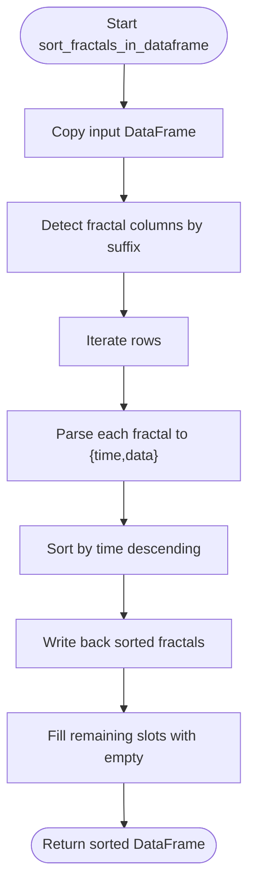
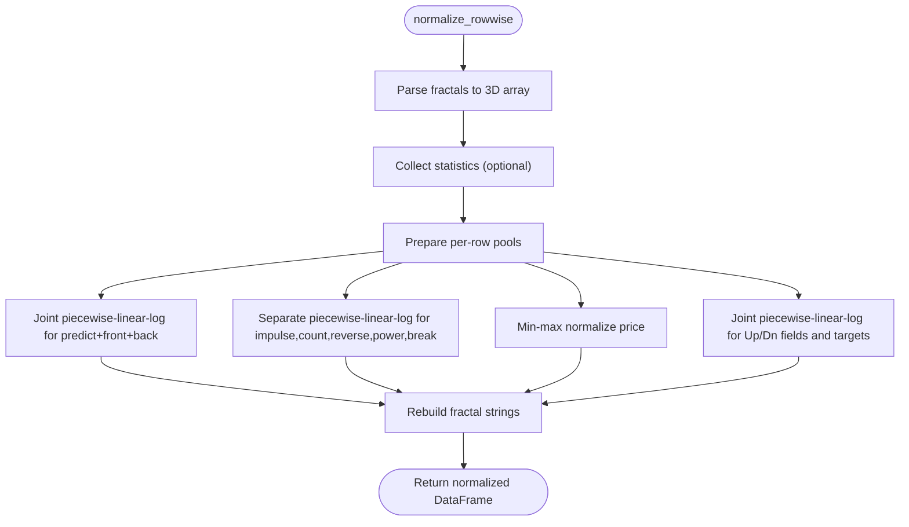
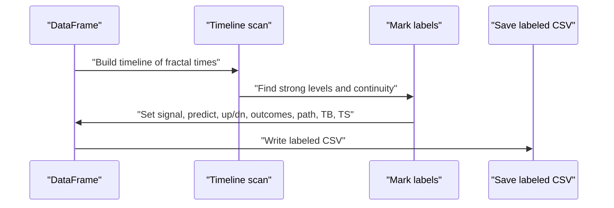
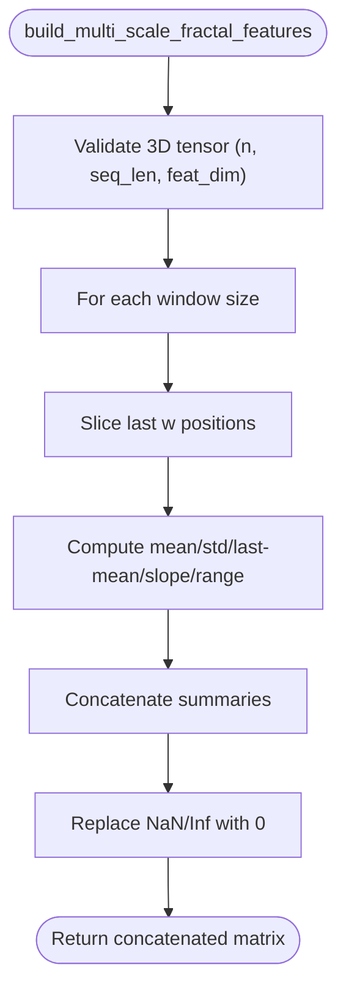
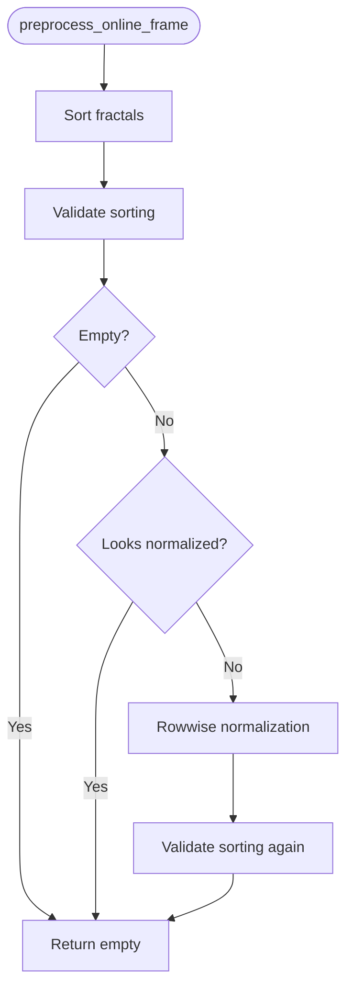
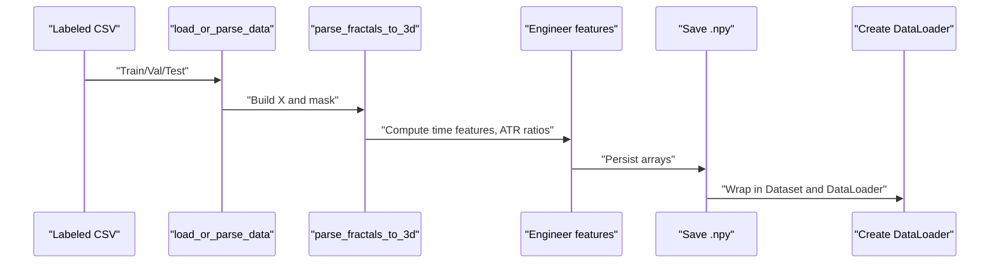
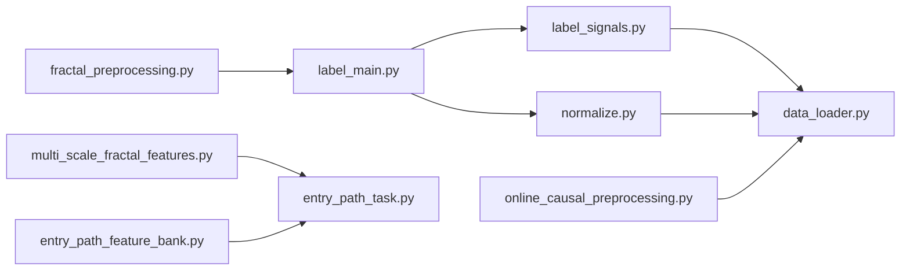

# Data Processing Pipeline

<cite>
**Referenced Files in This Document**
- [fractal_preprocessing.py](file://processing/fractal_preprocessing.py)
- [normalize.py](file://processing/normalize.py)
- [label_main.py](file://processing/label_main.py)
- [label_signals.py](file://processing/label_signals.py)
- [online_causal_preprocessing.py](file://processing/online_causal_preprocessing.py)
- [multi_scale_fractal_features.py](file://ML/multi_scale_fractal_features.py)
- [data_loader.py](file://ML/data_loader.py)
- [entry_path_task.py](file://ML/entry_path_task.py)
- [entry_path_feature_bank.py](file://ML/entry_path_feature_bank.py)
- [test_multi_scale_fractal_features.py](file://tests/test_multi_scale_fractal_features.py)
- [test_online_causal_preprocessing.py](file://tests/test_online_causal_preprocessing.py)
</cite>

## Table of Contents
1. [Introduction](#introduction)
2. [Project Structure](#project-structure)
3. [Core Components](#core-components)
4. [Architecture Overview](#architecture-overview)
5. [Detailed Component Analysis](#detailed-component-analysis)
6. [Dependency Analysis](#dependency-analysis)
7. [Performance Considerations](#performance-considerations)
8. [Troubleshooting Guide](#troubleshooting-guide)
9. [Conclusion](#conclusion)
10. [Appendices](#appendices)

## Introduction
This document describes the SoSimple trading system’s data processing pipeline that transforms raw MT4 fractal snapshots into labeled training datasets and ensures safe online preprocessing for live trading. It covers causal preprocessing to prevent information leakage, fractal feature extraction and normalization, label generation, multi-scale feature engineering, and validation workflows. The pipeline is designed to be robust, auditable, and production-ready.

## Project Structure
The pipeline spans several modules:
- Preprocessing: fractal sorting, normalization, and online causal preprocessing
- Labeling: signal and predict labels, Up/Dn targets, outcome-aligned targets, and entry-path labels
- Training data loading: parsing, feature normalization, caching, and batching
- Multi-scale engineering: sliding-window aggregations and feature banks
- Tests: validation of preprocessing and feature engineering

**Diagram sources**
- [fractal_preprocessing.py:65-85](file://processing/fractal_preprocessing.py#L65-L85)
- [normalize.py:284-510](file://processing/normalize.py#L284-L510)
- [label_main.py:205-332](file://processing/label_main.py#L205-L332)
- [label_signals.py:147-325](file://processing/label_signals.py#L147-L325)
- [data_loader.py:331-425](file://ML/data_loader.py#L331-L425)

**Section sources**
- [fractal_preprocessing.py:1-86](file://processing/fractal_preprocessing.py#L1-L86)
- [normalize.py:1-669](file://processing/normalize.py#L1-L669)
- [label_main.py:1-332](file://processing/label_main.py#L1-L332)
- [label_signals.py:1-800](file://processing/label_signals.py#L1-L800)
- [data_loader.py:1-1210](file://ML/data_loader.py#L1-L1210)

## Core Components
- Fractal sorting and validation: Ensures each row’s fractals are ordered by decreasing time to prevent future information leakage.
- Rowwise normalization: Applies piecewise linear-log and min-max transformations per row; preserves categorical and time fields.
- Label generation: Computes signal, predict, Up/Dn horizons, outcome-aligned targets, triple barrier, and trailing stop targets.
- Multi-scale feature engineering: Sliding-window aggregations and feature banks for entry-path modeling.
- Online causal preprocessing: Safe preprocessing for live snapshots without future-aware labeling.
- Data loaders: Parse CSVs, build 3D tensors, cache arrays, and create PyTorch DataLoaders.

**Section sources**
- [fractal_preprocessing.py:22-85](file://processing/fractal_preprocessing.py#L22-L85)
- [normalize.py:284-510](file://processing/normalize.py#L284-L510)
- [label_signals.py:147-529](file://processing/label_signals.py#L147-L529)
- [multi_scale_fractal_features.py:9-39](file://ML/multi_scale_fractal_features.py#L9-L39)
- [online_causal_preprocessing.py:109-137](file://processing/online_causal_preprocessing.py#L109-L137)
- [data_loader.py:331-425](file://ML/data_loader.py#L331-L425)

## Architecture Overview
The pipeline is composed of two major stages:
- Batch preprocessing and labeling: Full pipeline including labels and normalization, producing train/validation/test splits.
- Online causal preprocessing: Sorting, validation, and rowwise normalization only, safe for live snapshots.

**Diagram sources**
- [label_main.py:205-332](file://processing/label_main.py#L205-L332)
- [label_signals.py:147-529](file://processing/label_signals.py#L147-L529)
- [normalize.py:284-510](file://processing/normalize.py#L284-L510)

## Detailed Component Analysis

### Fractal Sorting and Validation
Purpose:
- Sort each row’s fractals by decreasing timestamp to ensure temporal causality.
- Validate that sorting is correct and reject malformed inputs.

Key behaviors:
- Extracts fractal columns by numeric suffix and sorts by time.
- Skips invalid entries and fills empty slots with empty strings.
- Validates that timestamps are non-ascending per row.

**Diagram sources**
- [fractal_preprocessing.py:65-85](file://processing/fractal_preprocessing.py#L65-L85)
- [fractal_preprocessing.py:36-63](file://processing/fractal_preprocessing.py#L36-L63)

**Section sources**
- [fractal_preprocessing.py:22-85](file://processing/fractal_preprocessing.py#L22-L85)

### Rowwise Normalization
Purpose:
- Normalize features per row to reduce distribution shifts while preserving row independence.
- Separate treatment for joint and individual features; preserve categorical and time fields.

Key behaviors:
- Parses fractal strings into arrays and validates structure.
- Computes per-row thresholds for piecewise linear-log normalization.
- Applies min-max normalization to price and piecewise linear-log to other features.
- Joint normalization for predict, front, and back; separate normalization for impulse, count, reverse, power, break.
- Up/Dn fields and targets normalized jointly with fractal features.

**Diagram sources**
- [normalize.py:284-510](file://processing/normalize.py#L284-L510)
- [normalize.py:151-211](file://processing/normalize.py#L151-L211)

**Section sources**
- [normalize.py:56-100](file://processing/normalize.py#L56-L100)
- [normalize.py:213-282](file://processing/normalize.py#L213-L282)
- [normalize.py:284-510](file://processing/normalize.py#L284-L510)

### Label Generation
Purpose:
- Build supervised targets for multiple tasks: signal classification, predict regression, Up/Dn horizons, outcome-aligned targets, entry path, triple barrier, and trailing stop.

Key behaviors:
- Signal labels: mark rows where fractal0 is strong.
- Predict labels: compute maximum back until break, respecting continuity of fractals across rows.
- Up/Dn targets: cumulative horizons extracted in two passes.
- Outcome-aligned targets: directional PnL and archetypes aligned with adverse moves.
- Entry path labels: return and path metrics for transformer-based models.
- Triple barrier and trailing stop targets: convert raw MFE to ATR-based binary or continuous targets.

**Diagram sources**
- [label_signals.py:147-325](file://processing/label_signals.py#L147-L325)
- [label_signals.py:360-433](file://processing/label_signals.py#L360-L433)
- [label_signals.py:439-529](file://processing/label_signals.py#L439-L529)

**Section sources**
- [label_signals.py:147-325](file://processing/label_signals.py#L147-L325)
- [label_signals.py:360-433](file://processing/label_signals.py#L360-L433)
- [label_signals.py:439-529](file://processing/label_signals.py#L439-L529)

### Multi-Scale Fractal Features Engineering
Purpose:
- Aggregate fractal sequences across multiple windows to capture short-, medium-, and long-term dynamics.

Key behaviors:
- Sliding windows of sizes 5, 10, 20, 50, 100.
- For each window, compute mean, std, last minus mean, slope, and range across features.
- Handles shorter sequences gracefully by using effective window length.

**Diagram sources**
- [multi_scale_fractal_features.py:18-39](file://ML/multi_scale_fractal_features.py#L18-L39)

**Section sources**
- [multi_scale_fractal_features.py:6-39](file://ML/multi_scale_fractal_features.py#L6-L39)
- [test_multi_scale_fractal_features.py:9-41](file://tests/test_multi_scale_fractal_features.py#L9-L41)

### Online Causal Preprocessing
Purpose:
- Safely preprocess live snapshots without future-aware labeling to prevent leakage in production.

Key behaviors:
- Sorts fractals per row and validates ordering.
- Detects if input is already normalized to avoid double normalization.
- Applies rowwise normalization only; does not compute labels.

**Diagram sources**
- [online_causal_preprocessing.py:109-137](file://processing/online_causal_preprocessing.py#L109-L137)

**Section sources**
- [online_causal_preprocessing.py:57-137](file://processing/online_causal_preprocessing.py#L57-L137)
- [test_online_causal_preprocessing.py:67-218](file://tests/test_online_causal_preprocessing.py#L67-L218)

### Training Data Loading and Caching
Purpose:
- Parse labeled CSVs into 3D tensors, engineer features, cache arrays, and create PyTorch DataLoaders.

Key behaviors:
- Parse fractal strings into (n, 100, 20) tensors; compute time features and ATR ratios.
- Normalize features with StandardScaler if enabled.
- Cache X, mask, and targets to .npy files for fast reload.
- Support multiple target profiles: signal, predict, Up/Dn, entry path, triple barrier, trailing stop.

**Diagram sources**
- [data_loader.py:549-925](file://ML/data_loader.py#L549-L925)
- [data_loader.py:331-425](file://ML/data_loader.py#L331-L425)

**Section sources**
- [data_loader.py:70-110](file://ML/data_loader.py#L70-L110)
- [data_loader.py:331-425](file://ML/data_loader.py#L331-L425)
- [data_loader.py:549-925](file://ML/data_loader.py#L549-L925)

## Dependency Analysis
The pipeline components depend on each other in a strict order to maintain causality and correctness.

**Diagram sources**
- [label_main.py:64-75](file://processing/label_main.py#L64-L75)
- [label_signals.py:50-64](file://processing/label_signals.py#L50-L64)
- [data_loader.py:47-66](file://ML/data_loader.py#L47-L66)
- [entry_path_task.py:5-7](file://ML/entry_path_task.py#L5-L7)

**Section sources**
- [label_main.py:50-75](file://processing/label_main.py#L50-L75)
- [label_signals.py:50-64](file://processing/label_signals.py#L50-L64)
- [data_loader.py:47-66](file://ML/data_loader.py#L47-L66)
- [entry_path_task.py:5-7](file://ML/entry_path_task.py#L5-L7)

## Performance Considerations
- Vectorized parsing: The fractal parsing and normalization routines operate on entire DataFrames efficiently.
- Per-row normalization: Avoids global leakage by computing thresholds per row; still benefits from vectorized operations.
- Caching: Training arrays are cached to .npy files to speed up repeated loads.
- Sequence truncation: Allows reducing computational cost by keeping only recent fractals.
- Memory layout: Tensors are contiguous and float32 to minimize memory footprint.

[No sources needed since this section provides general guidance]

## Troubleshooting Guide
Common issues and remedies:
- Sorting errors: Ensure fractal timestamps are strictly non-ascending per row; validation raises on violations.
- Double normalization: Online preprocessing guards against re-normalizing preprocessed snapshots.
- Legacy fractal formats: Parser supports both legacy 18-field and current 22-field formats.
- Empty or malformed rows: The pipeline skips invalid entries and fills empty slots; verify input CSV columns and fractal formats.
- Feature validation: Data loader validates parsed features and raises descriptive errors if distributions are degenerate.

**Section sources**
- [online_causal_preprocessing.py:57-82](file://processing/online_causal_preprocessing.py#L57-L82)
- [data_loader.py:248-285](file://ML/data_loader.py#L248-L285)
- [data_loader.py:300-327](file://ML/data_loader.py#L300-L327)

## Conclusion
The SoSimple pipeline ensures causal, robust, and scalable preparation of MT4 fractal data for training and online inference. By sorting and validating fractals, applying rowwise normalization, and generating multiple labels, it produces high-quality datasets. Multi-scale feature engineering and caching enable efficient training, while online causal preprocessing guarantees safety for live trading.

## Appendices

### Parameter and Configuration References
- Piecewise linear-log defaults:
  - q_break: 0.85
  - q_cap: 0.99
  - linear_max: 0.85
  - tail_strength: 9.0
  - eps: 1e-12
- Multi-scale windows: (5, 10, 20, 50, 100)
- Fractal feature indices and normalization groups are defined in the normalization module.

**Section sources**
- [normalize.py:92-100](file://processing/normalize.py#L92-L100)
- [multi_scale_fractal_features.py:6](file://ML/multi_scale_fractal_features.py#L6)