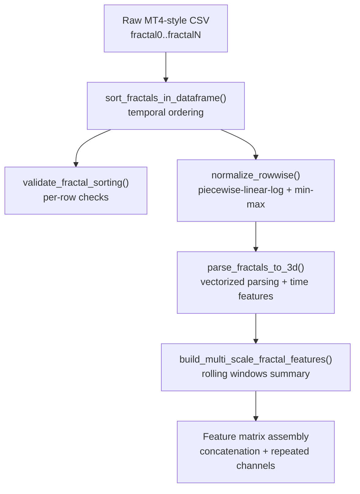
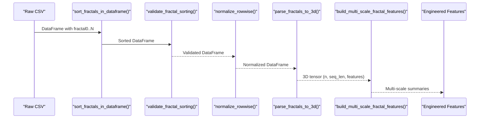
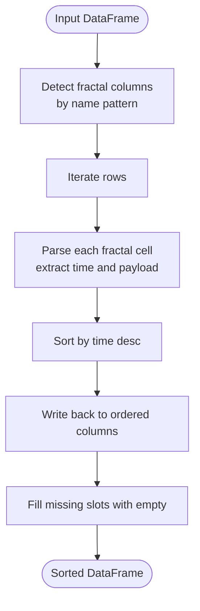
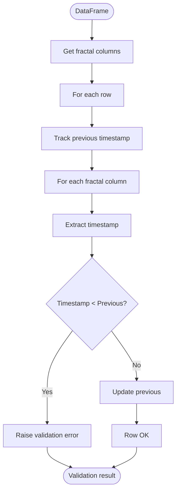
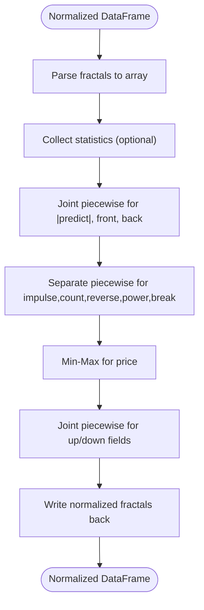
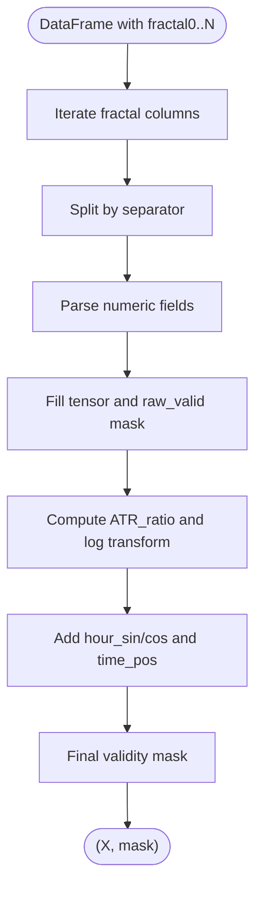
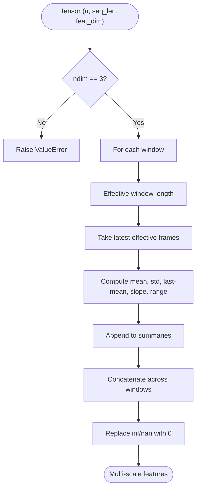
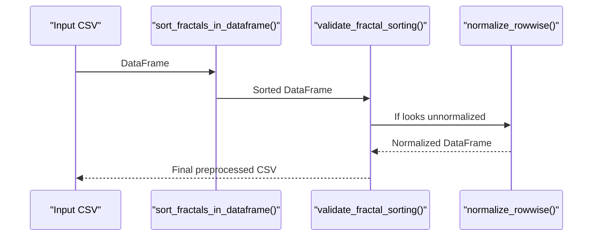
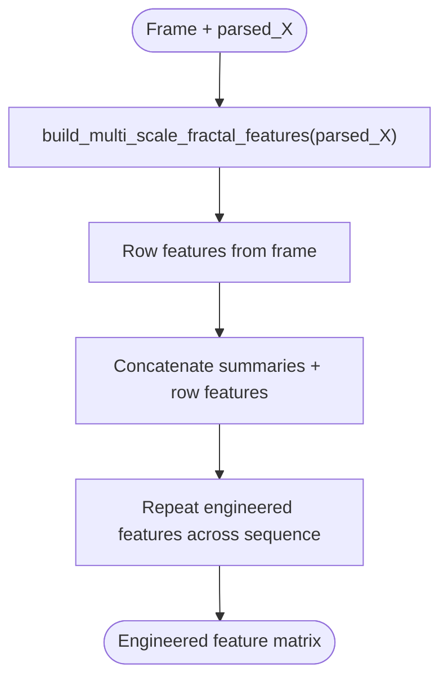
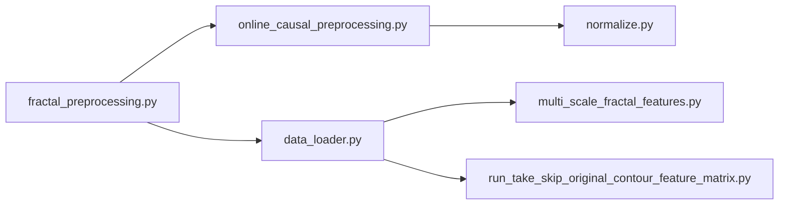

# Fractal Feature Extraction

<cite>
**Referenced Files in This Document**
- [fractal_preprocessing.py](file://processing/fractal_preprocessing.py)
- [online_causal_preprocessing.py](file://processing/online_causal_preprocessing.py)
- [normalize.py](file://processing/normalize.py)
- [multi_scale_fractal_features.py](file://ML/multi_scale_fractal_features.py)
- [data_loader.py](file://ML/data_loader.py)
- [label_signals.py](file://processing/label_signals.py)
- [test_multi_scale_fractal_features.py](file://tests/test_multi_scale_fractal_features.py)
- [run_take_skip_original_contour_feature_matrix.py](file://ML/run_take_skip_original_contour_feature_matrix.py)
- [EDA.ipynb](file://statistics/EDA.ipynb)
- [signal_tracer.py](file://statistics/signal_tracer.py)
</cite>

## Table of Contents
1. [Introduction](#introduction)
2. [Project Structure](#project-structure)
3. [Core Components](#core-components)
4. [Architecture Overview](#architecture-overview)
5. [Detailed Component Analysis](#detailed-component-analysis)
6. [Dependency Analysis](#dependency-analysis)
7. [Performance Considerations](#performance-considerations)
8. [Troubleshooting Guide](#troubleshooting-guide)
9. [Conclusion](#conclusion)
10. [Appendices](#appendices)

## Introduction
This document explains the fractal feature extraction and multi-scale analysis pipeline in the SoSimple trading system. It covers how fractal records are parsed from MetaTrader 4 (MT4)–style CSV snapshots, validated and temporally ordered, normalized, and transformed into multi-scale features for machine learning. It also documents the sort_fractals_in_dataframe() function, fractal validation algorithms, multi-scale feature engineering, normalization techniques, and quality assurance procedures. Guidance on performance optimization, memory management, and debugging is included.

## Project Structure
The fractal processing spans three main areas:
- Preprocessing and validation of raw fractal data
- Normalization of features (row-wise and global)
- Multi-scale feature engineering from parsed sequences

**Diagram sources**
- [fractal_preprocessing.py:65-85](file://processing/fractal_preprocessing.py#L65-L85)
- [online_causal_preprocessing.py:57-82](file://processing/online_causal_preprocessing.py#L57-L82)
- [normalize.py:284-510](file://processing/normalize.py#L284-L510)
- [data_loader.py:331-424](file://ML/data_loader.py#L331-L424)
- [multi_scale_fractal_features.py:18-38](file://ML/multi_scale_fractal_features.py#L18-L38)
- [run_take_skip_original_contour_feature_matrix.py:164-187](file://ML/run_take_skip_original_contour_feature_matrix.py#L164-L187)

**Section sources**
- [fractal_preprocessing.py:1-86](file://processing/fractal_preprocessing.py#L1-L86)
- [online_causal_preprocessing.py:1-137](file://processing/online_causal_preprocessing.py#L1-L137)
- [normalize.py:1-669](file://processing/normalize.py#L1-L669)
- [data_loader.py:330-529](file://ML/data_loader.py#L330-L529)
- [multi_scale_fractal_features.py:1-39](file://ML/multi_scale_fractal_features.py#L1-L39)
- [run_take_skip_original_contour_feature_matrix.py:164-187](file://ML/run_take_skip_original_contour_feature_matrix.py#L164-L187)

## Core Components
- sort_fractals_in_dataframe(): Ensures each row’s fractals are sorted by formation time in descending order, preserving temporal ordering while remaining causal (no future labels).
- validate_fractal_sorting(): Validates per-row monotonicity of fractal timestamps to catch data anomalies.
- normalize_rowwise(): Applies row-wise normalization using piecewise linear-log and min-max transforms to stabilize heavy-tailed features.
- parse_fractals_to_3d(): Vectorized parsing of fractal strings into a 3D tensor with padding masks and derived time features.
- build_multi_scale_fractal_features(): Computes rolling-window summaries across multiple scales to capture short-, medium-, and long-term dynamics.

**Section sources**
- [fractal_preprocessing.py:65-85](file://processing/fractal_preprocessing.py#L65-L85)
- [online_causal_preprocessing.py:57-82](file://processing/online_causal_preprocessing.py#L57-L82)
- [normalize.py:284-510](file://processing/normalize.py#L284-L510)
- [data_loader.py:331-424](file://ML/data_loader.py#L331-L424)
- [multi_scale_fractal_features.py:18-38](file://ML/multi_scale_fractal_features.py#L18-L38)

## Architecture Overview
The pipeline is designed to be live-safe and causal:
- Online preprocessing sorts and validates fractals, then applies row-wise normalization without leaking future information.
- Training pipeline parses fractals into tensors, computes multi-scale features, and concatenates with row-level features for modeling.

**Diagram sources**
- [online_causal_preprocessing.py:109-122](file://processing/online_causal_preprocessing.py#L109-L122)
- [data_loader.py:331-424](file://ML/data_loader.py#L331-L424)
- [multi_scale_fractal_features.py:18-38](file://ML/multi_scale_fractal_features.py#L18-L38)

## Detailed Component Analysis

### sort_fractals_in_dataframe()
Purpose:
- Sorts fractal entries within each row by formation time (descending) so the most recent appears first. This preserves temporal ordering and ensures causality.

Key behaviors:
- Identifies fractal columns by name pattern and orders them numerically.
- Parses each cell into a structured representation, extracting the timestamp.
- Sorts by timestamp descending and writes back to columns in order.
- Empties trailing slots if fewer fractals exist.

**Diagram sources**
- [fractal_preprocessing.py:22-33](file://processing/fractal_preprocessing.py#L22-L33)
- [fractal_preprocessing.py:36-62](file://processing/fractal_preprocessing.py#L36-L62)
- [fractal_preprocessing.py:65-85](file://processing/fractal_preprocessing.py#L65-L85)

**Section sources**
- [fractal_preprocessing.py:22-33](file://processing/fractal_preprocessing.py#L22-L33)
- [fractal_preprocessing.py:36-62](file://processing/fractal_preprocessing.py#L36-L62)
- [fractal_preprocessing.py:65-85](file://processing/fractal_preprocessing.py#L65-L85)

### validate_fractal_sorting() and sort_row_fractals()
Purpose:
- Enforce monotonic decreasing order of fractal timestamps per row to detect malformed or out-of-order data.

Validation logic:
- Iterates through sorted fractal columns in a row.
- Compares consecutive timestamps; raises an error if any timestamp is greater than the previous.

**Diagram sources**
- [online_causal_preprocessing.py:57-82](file://processing/online_causal_preprocessing.py#L57-L82)

**Section sources**
- [online_causal_preprocessing.py:57-82](file://processing/online_causal_preprocessing.py#L57-L82)

### normalize_rowwise()
Purpose:
- Applies row-wise normalization to stabilize heavy-tailed features and maintain scale invariance across rows.

Normalization groups:
- Predict + front + back: joint piecewise linear-log with shared parameters per row.
- impulse, count, reverse, power, break: separate piecewise linear-log per feature.
- price: min-max scaling.
- direction, strong, fractal_time: left unchanged.
- up_12, dn_12, up_24, dn_24, up_48, dn_48: joint piecewise linear-log with pooled values from fractals and row targets.

Guardrails:
- Prevents double normalization by detecting normalized ranges.
- Saves normalization statistics for auditing.

**Diagram sources**
- [normalize.py:284-510](file://processing/normalize.py#L284-L510)

**Section sources**
- [normalize.py:284-510](file://processing/normalize.py#L284-L510)

### parse_fractals_to_3d()
Purpose:
- Vectorized parsing of fractal strings into a 3D tensor with padding masks and derived time features.

Processing steps:
- Iterates fractal columns, splits by separator, parses numeric fields, and constructs a tensor of shape (n_samples, N_FRACTALS, N_FEATURES).
- Replaces fractal_atr with log(fractal_atr / ATR_slow) and adds cyclic hour encoding and time_pos.
- Produces a validity mask for padding positions.

**Diagram sources**
- [data_loader.py:331-424](file://ML/data_loader.py#L331-L424)

**Section sources**
- [data_loader.py:331-424](file://ML/data_loader.py#L331-L424)

### build_multi_scale_fractal_features()
Purpose:
- Compute multi-scale summaries across rolling windows to capture dynamics at different horizons.

Windows and summaries:
- Uses predefined windows (5, 10, 20, 50, 100).
- For each window, computes mean, std, last-minus-mean, slope, and value-range along the sequence dimension.
- Concatenates summaries across windows and replaces inf/nan with zeros.

**Diagram sources**
- [multi_scale_fractal_features.py:18-38](file://ML/multi_scale_fractal_features.py#L18-L38)

**Section sources**
- [multi_scale_fractal_features.py:18-38](file://ML/multi_scale_fractal_features.py#L18-L38)
- [test_multi_scale_fractal_features.py:9-40](file://tests/test_multi_scale_fractal_features.py#L9-L40)

### Online Causal Preprocessing Workflow
Purpose:
- Live-safe preprocessing that avoids future leakage by excluding labeling steps.

Workflow:
- Sort fractals per row.
- Validate monotonicity.
- If not already normalized, apply row-wise normalization.
- Re-validate after normalization.

**Diagram sources**
- [online_causal_preprocessing.py:109-122](file://processing/online_causal_preprocessing.py#L109-L122)

**Section sources**
- [online_causal_preprocessing.py:109-122](file://processing/online_causal_preprocessing.py#L109-L122)

### Feature Engineering and Baseline Assembly
Purpose:
- Combine multi-scale fractal summaries with row-level features for modeling.

Process:
- Build multi-scale summaries from parsed tensor.
- Concatenate with row features (baseline columns).
- Optionally repeat engineered features across sequence length to match input tensors.

**Diagram sources**
- [run_take_skip_original_contour_feature_matrix.py:164-187](file://ML/run_take_skip_original_contour_feature_matrix.py#L164-L187)

**Section sources**
- [run_take_skip_original_contour_feature_matrix.py:164-187](file://ML/run_take_skip_original_contour_feature_matrix.py#L164-L187)

## Dependency Analysis
- sort_fractals_in_dataframe() depends on fractal_columns_in_order() and sort_row_fractals().
- validate_fractal_sorting() depends on _fractal_time() and fractal_columns_in_order().
- normalize_rowwise() depends on parse_fractal() and various normalization helpers.
- parse_fractals_to_3d() depends on FRACTAL_SEP and feature indices.
- build_multi_scale_fractal_features() depends on numpy and operates on 3D arrays.

**Diagram sources**
- [fractal_preprocessing.py:22-33](file://processing/fractal_preprocessing.py#L22-L33)
- [online_causal_preprocessing.py:22-24](file://processing/online_causal_preprocessing.py#L22-L24)
- [normalize.py:102-126](file://processing/normalize.py#L102-L126)
- [data_loader.py:331-424](file://ML/data_loader.py#L331-L424)
- [multi_scale_fractal_features.py:18-38](file://ML/multi_scale_fractal_features.py#L18-L38)
- [run_take_skip_original_contour_feature_matrix.py:164-187](file://ML/run_take_skip_original_contour_feature_matrix.py#L164-L187)

**Section sources**
- [fractal_preprocessing.py:22-33](file://processing/fractal_preprocessing.py#L22-L33)
- [online_causal_preprocessing.py:22-24](file://processing/online_causal_preprocessing.py#L22-L24)
- [normalize.py:102-126](file://processing/normalize.py#L102-L126)
- [data_loader.py:331-424](file://ML/data_loader.py#L331-L424)
- [multi_scale_fractal_features.py:18-38](file://ML/multi_scale_fractal_features.py#L18-L38)
- [run_take_skip_original_contour_feature_matrix.py:164-187](file://ML/run_take_skip_original_contour_feature_matrix.py#L164-L187)

## Performance Considerations
- Vectorized parsing: parse_fractals_to_3d() uses pandas vectorized string operations and numpy to minimize Python loops.
- Rolling summaries: build_multi_scale_fractal_features() uses efficient numpy reductions; ensure window sizes are reasonable to avoid excessive memory.
- Memory footprint: 3D tensors can be large; consider reducing N_FRACTALS or sequence length during development.
- Validation overhead: validate_fractal_sorting() iterates columns per row; keep datasets chunked for large batches.
- Normalization caching: collect_statistics() can be used to cache normalization parameters for reproducibility.

[No sources needed since this section provides general guidance]

## Troubleshooting Guide
Common issues and remedies:
- Sorting anomalies: Use validate_fractal_sorting() to detect out-of-order timestamps; re-run sort_fractals_in_dataframe().
- Double normalization: _looks_rowwise_normalized() prevents applying row-wise normalization twice; ensure preprocessing order is correct.
- Parsing errors: parse_fractal() and parse_fractals_to_3d() handle malformed strings by filling NaN; inspect raw fractal strings and separators.
- Multi-scale shape errors: build_multi_scale_fractal_features() requires 3D input; verify tensor shape and window sizes.
- EDA and tracing: Use statistics/EDA.ipynb and statistics/signal_tracer.py to inspect distributions and lag biases.

**Section sources**
- [online_causal_preprocessing.py:57-82](file://processing/online_causal_preprocessing.py#L57-L82)
- [normalize.py:284-510](file://processing/normalize.py#L284-L510)
- [data_loader.py:331-424](file://ML/data_loader.py#L331-L424)
- [multi_scale_fractal_features.py:18-38](file://ML/multi_scale_fractal_features.py#L18-L38)
- [EDA.ipynb:210-2483](file://statistics/EDA.ipynb#L210-L2483)
- [signal_tracer.py:301-323](file://statistics/signal_tracer.py#L301-L323)

## Conclusion
The SoSimple system implements a robust, causal pipeline for fractal feature extraction and multi-scale analysis. By sorting and validating fractal timestamps, applying row-wise normalization, and building multi-scale summaries, it produces stable, interpretable features suitable for ML models. The design emphasizes temporal ordering preservation, data quality checks, and scalability via vectorized operations.

[No sources needed since this section summarizes without analyzing specific files]

## Appendices

### Mathematical Foundations and Technical Concepts
- Fractal geometry in financial markets: Fractals represent local extremes and reaction zones; the SoSimple pipeline captures formation time, price, direction, strength, and forward projections (up/dn horizons).
- Multi-scale analysis: Rolling windows summarize dynamics at different frequencies, enabling models to learn short-term momentum and longer-term trend persistence.
- Normalization: Piecewise linear-log compresses heavy tails while preserving rank order; min-max scaling stabilizes price features; robust ATR normalization mitigates outliers.

[No sources needed since this section provides general guidance]