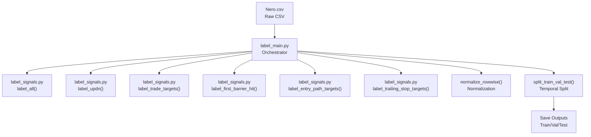
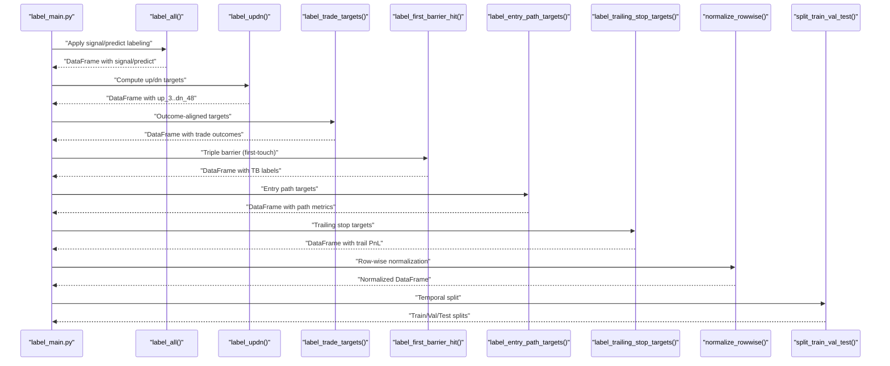
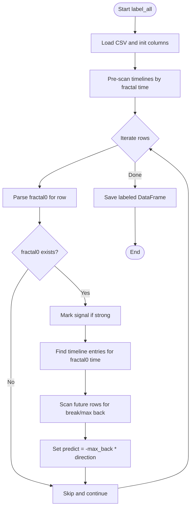
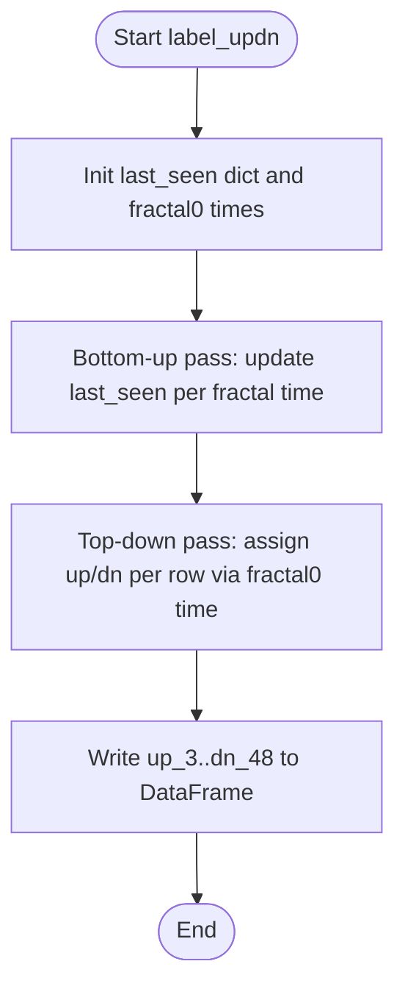
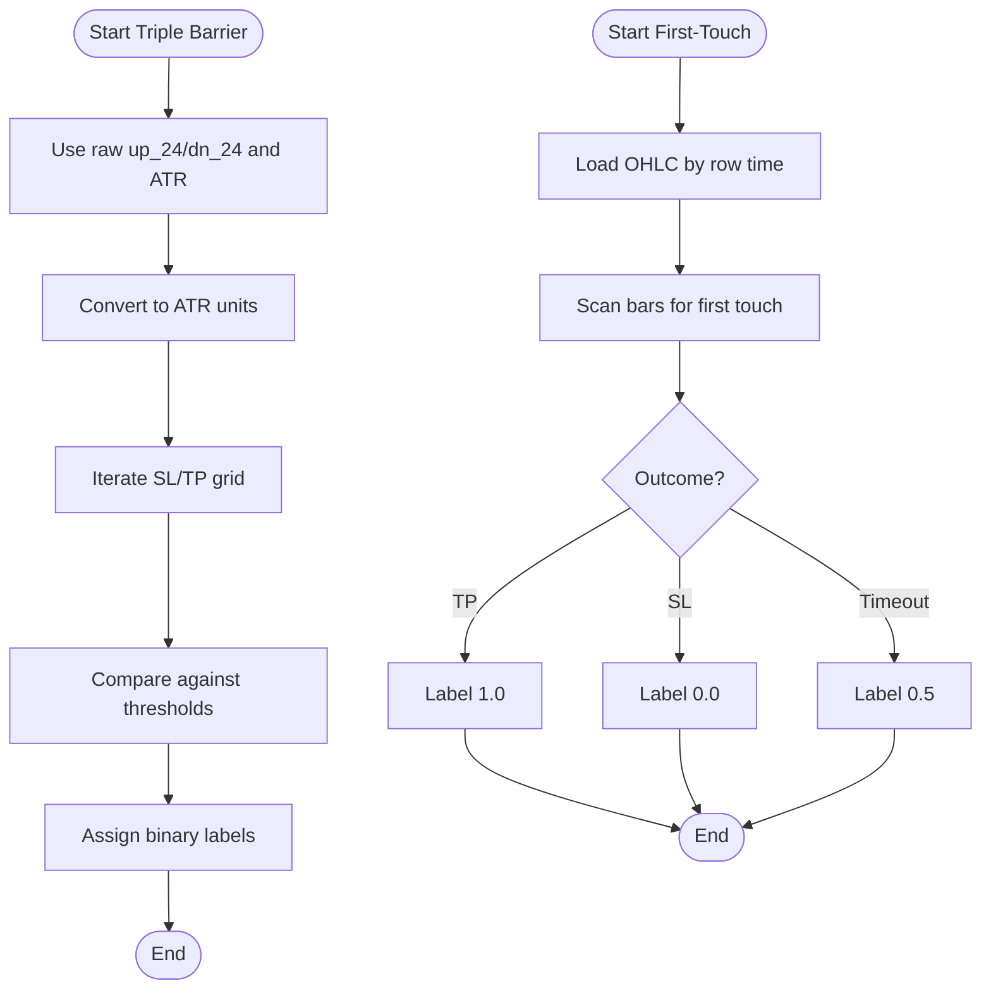
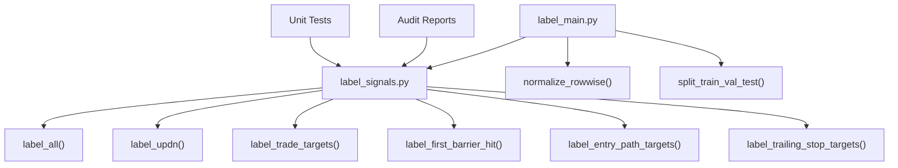

# Label Generation and Target Creation

<cite>
**Referenced Files in This Document**
- [label_main.py](file://processing/label_main.py)
- [label_signals.py](file://processing/label_signals.py)
- [test_label_updn.py](file://tests/test_label_updn.py)
- [test_triple_barrier_mt4_execution.py](file://tests/test_triple_barrier_mt4_execution.py)
- [test_tb_label_invariants.py](file://tests/test_tb_label_invariants.py)
- [2026-04-13-label-convention-audit.md](file://docs/reports/2026-04-13-label-convention-audit.md)
- [2026-04-12-tb-verdict.md](file://docs/reports/2026-04-12-tb-verdict.md)
- [2026-03-22-triple-barrier.md](file://docs/superpowers/plans/2026-03-22-triple-barrier.md)
</cite>

## Table of Contents
1. [Introduction](#introduction)
2. [Project Structure](#project-structure)
3. [Core Components](#core-components)
4. [Architecture Overview](#architecture-overview)
5. [Detailed Component Analysis](#detailed-component-analysis)
6. [Dependency Analysis](#dependency-analysis)
7. [Performance Considerations](#performance-considerations)
8. [Troubleshooting Guide](#troubleshooting-guide)
9. [Conclusion](#conclusion)
10. [Appendices](#appendices)

## Introduction
This document explains the label generation system that creates supervised learning targets from processed fractal data. It focuses on three core labeling functions:
- label_all(): creates signal and predict labels from fractal features
- label_updn(): extracts fixed-horizon up/down targets from accumulated fractal values
- label_triple_barrier() and label_first_barrier_hit(): apply barrier-based classification targets

It covers the target creation process, labeling strategies, validation and quality assurance, examples of label transformations, target distribution analysis, performance impact assessment, label leakage prevention, temporal consistency, and debugging techniques.

## Project Structure
The label generation pipeline is implemented primarily in the processing module and orchestrated by a CLI script:
- processing/label_signals.py: core labeling functions and barrier logic
- processing/label_main.py: orchestration script that applies labeling in order and performs normalization and splitting
- tests/: unit and integration tests validating label correctness and conventions
- docs/reports/ and docs/superpowers/: design and audit records for label conventions and triple barrier implementation

**Diagram sources**
- [label_main.py:205-332](file://processing/label_main.py#L205-L332)
- [label_signals.py:147-326](file://processing/label_signals.py#L147-L326)

**Section sources**
- [label_main.py:205-332](file://processing/label_main.py#L205-L332)
- [label_signals.py:147-326](file://processing/label_signals.py#L147-L326)

## Core Components
This section documents the three primary labeling functions and their roles in the supervised learning pipeline.

- label_all(input_path, output_path, debug, label_signal, label_predict)
  - Purpose: Creates signal and predict labels from fractal data
  - Strategy: Scans all rows to find strong fractals and computes predict as the maximum retracement until the first break
  - Complexity: O(N × K) preprocessing plus per-row scanning; resource-intensive due to future lookups
  - Output: Adds signal and predict columns to the dataset

- label_updn(df, debug)
  - Purpose: Extracts fixed-horizon up/down targets (up_3..dn_48) for each row
  - Strategy: Two-pass algorithm tracking last-seen values for each fractal time to avoid O(N^2) scans
  - Output: Adds up_3, dn_3, up_6, dn_6, up_12, dn_12, up_24, dn_24, up_48, dn_48

- label_triple_barrier(df, debug)
  - Purpose: Binary triple barrier labels using raw up_24/dn_24 and ATR
  - Strategy: Converts raw MFE to ATR units and compares against predefined SL/TP grids
  - Output: 12 binary columns (buy_slX_tpY and sell_slX_tpY)

- label_first_barrier_hit(df, ohlc_path, scan_bars, debug)
  - Purpose: Path-ordered triple barrier labels with precise first-touch semantics
  - Strategy: Scans OHLC bars sequentially to determine first barrier hit or timeout
  - Output: Overwrites TB columns with float labels {1.0, 0.0, 0.5}

**Section sources**
- [label_signals.py:147-326](file://processing/label_signals.py#L147-L326)
- [label_signals.py:360-434](file://processing/label_signals.py#L360-L434)
- [label_signals.py:548-588](file://processing/label_signals.py#L548-L588)
- [label_signals.py:986-1111](file://processing/label_signals.py#L986-L1111)

## Architecture Overview
The labeling pipeline follows a strict temporal order to prevent leakage and maintain consistency:
1. Sort and validate fractal ordering
2. Apply comprehensive labeling (signal, predict, up/dn)
3. Outcome-aligned targets (trade outcomes)
4. Triple barrier labels (first-touch or raw)
5. Entry path and trailing stop targets
6. Row-wise normalization
7. Temporal train/validation/test split
8. Save labeled datasets

**Diagram sources**
- [label_main.py:260-287](file://processing/label_main.py#L260-L287)
- [label_signals.py:147-326](file://processing/label_signals.py#L147-L326)
- [label_signals.py:360-434](file://processing/label_signals.py#L360-L434)
- [label_signals.py:439-529](file://processing/label_signals.py#L439-L529)
- [label_signals.py:986-1111](file://processing/label_signals.py#L986-L1111)
- [label_signals.py:874-983](file://processing/label_signals.py#L874-L983)
- [label_signals.py:757-845](file://processing/label_signals.py#L757-L845)

**Section sources**
- [label_main.py:260-287](file://processing/label_main.py#L260-L287)

## Detailed Component Analysis

### label_all(): Signal and Predict Labeling
- Input: CSV with fractal columns
- Process:
  - Pre-scan to collect timeline indices, back values, and break statuses for each fractal time
  - For each row, locate fractal0 and compute predict as the maximum retracement until the first break
  - Mark signal if fractal0 is strong
- Output: signal and predict columns
- Notes:
  - Resource-intensive due to per-fractal future scanning
  - Uses temporal continuity: rows must form a valid fractal sequence

**Diagram sources**
- [label_signals.py:147-326](file://processing/label_signals.py#L147-L326)

**Section sources**
- [label_signals.py:147-326](file://processing/label_signals.py#L147-L326)

### label_updn(): Fixed-Horizon Up/Down Targets
- Input: DataFrame with fractal columns
- Process:
  - Pass 1 (bottom-up): record last-seen up/dn values for each fractal time
  - Pass 2 (top-down): for each row, assign up/dn values based on fractal0 time
- Output: up_3, dn_3, ..., up_48, dn_48
- Notes:
  - O(N × K) becomes O(N × K) with two passes
  - Ensures temporal consistency by propagating last-seen values

**Diagram sources**
- [label_signals.py:360-434](file://processing/label_signals.py#L360-L434)

**Section sources**
- [label_signals.py:360-434](file://processing/label_signals.py#L360-L434)
- [test_label_updn.py:67-101](file://tests/test_label_updn.py#L67-L101)

### Triple Barrier Labeling Strategies
Two complementary approaches exist:

- label_triple_barrier(df, debug)
  - Strategy: Convert raw up_24/dn_24 to ATR units and compare against SL/TP grids
  - Output: 12 binary columns (buy/sell × SL=[2,3] × TP=[3,6,9])
  - Use case: Fast, raw-label approach before normalization

- label_first_barrier_hit(df, ohlc_path, scan_bars, debug)
  - Strategy: Bar-by-bar OHLC scan to determine first-touch outcome
  - Output: Same 12 columns with float labels {1.0, 0.0, 0.5}
  - Use case: Precise semantics for MT4 parity and execution studies

**Diagram sources**
- [label_signals.py:548-588](file://processing/label_signals.py#L548-L588)
- [label_signals.py:986-1111](file://processing/label_signals.py#L986-L1111)

**Section sources**
- [label_signals.py:548-588](file://processing/label_signals.py#L548-L588)
- [label_signals.py:986-1111](file://processing/label_signals.py#L986-L1111)
- [2026-03-22-triple-barrier.md:86-126](file://docs/superpowers/plans/2026-03-22-triple-barrier.md#L86-L126)

### Outcome-Aligned Targets
- label_trade_targets(df, ohlc_path)
  - Computes favorable/adverse ATR measures and directional PnL aligned with signal
  - Produces trade_outcome_h12, trade_pnl_h12_atr, archetype_target
  - Uses either OHLC window or up/dn horizons depending on availability

**Section sources**
- [label_signals.py:439-529](file://processing/label_signals.py#L439-L529)

### Entry Path and Trailing Stop Targets
- label_entry_path_targets(df, ohlc_path, ...)
  - Computes ret_dir_atr, fav_atr, adv_atr over multiple horizons and path classification
- label_trailing_stop_targets(df, ohlc_path, ...)
  - Simulates trailing stop exits and writes horizon-specific PnL in ATR terms

**Section sources**
- [label_signals.py:874-983](file://processing/label_signals.py#L874-L983)
- [label_signals.py:757-845](file://processing/label_signals.py#L757-L845)

## Dependency Analysis
Key dependencies and relationships:
- label_main.py orchestrates all labeling functions and ensures temporal order
- label_signals.py implements all labeling logic and is the single source of truth for label conventions
- Tests validate correctness and detect label convention drift
- Reports document audits and production verdicts for triple barrier

**Diagram sources**
- [label_main.py:260-287](file://processing/label_main.py#L260-L287)
- [label_signals.py:147-326](file://processing/label_signals.py#L147-L326)

**Section sources**
- [label_main.py:260-287](file://processing/label_main.py#L260-L287)
- [label_signals.py:147-326](file://processing/label_signals.py#L147-L326)

## Performance Considerations
- label_all() is computationally expensive due to per-fractal future scanning; consider:
  - Pre-filtering strong fractals
  - Parallelizing row-wise scans where safe
- label_updn() uses two passes to avoid O(N^2); maintain this pattern for large datasets
- Triple barrier computations are lightweight compared to signal labeling
- Normalization is row-wise to avoid leakage; keep it post-labeling

[No sources needed since this section provides general guidance]

## Troubleshooting Guide
Common issues and debugging techniques:

- Label convention drift (float labels)
  - Problem: Consumers incorrectly cast {1.0, 0.0, 0.5} to int or treat 0.5 as loss
  - Fix: Use float comparisons and explicit timeout branches
  - Evidence: Audit report and tests confirm fixes in tb_signal_logic.py and threshold_analysis.py

- Triple barrier MT4 parity
  - Problem: Incorrect handling of float outcomes in simulation
  - Fix: Added _classify_tb_outcome() and updated simulation logic
  - Evidence: tests/test_triple_barrier_mt4_execution.py and docs/reports/2026-04-12-tb-verdict.md

- Sorting quality validation
  - Use verify_sorting_quality() to ensure fractal time sequences are descending per row
  - Investigate rows flagged during debug mode

- Target distribution analysis
  - Inspect label proportions after triple barrier labeling
  - Use tests/test_tb_label_invariants.py to validate loss computation excludes timeouts

**Section sources**
- [2026-04-13-label-convention-audit.md:33-44](file://docs/reports/2026-04-13-label-convention-audit.md#L33-L44)
- [2026-04-12-tb-verdict.md:44-58](file://docs/reports/2026-04-12-tb-verdict.md#L44-L58)
- [label_main.py:79-131](file://processing/label_main.py#L79-L131)
- [test_tb_label_invariants.py:12-55](file://tests/test_tb_label_invariants.py#L12-L55)

## Conclusion
The label generation system establishes robust, leak-free, and temporally consistent targets for supervised learning:
- signal and predict labels capture fractal-driven expectations
- up/dn targets provide fixed-horizon supervision
- triple barrier labels enable barrier-based classification with precise semantics
- outcome-aligned and execution-relevant targets support downstream modeling and MT4 parity

Quality assurance through audits, tests, and production verdicts ensures reliability and prevents label leakage.

[No sources needed since this section summarizes without analyzing specific files]

## Appendices

### Label Validation and Quality Assurance Procedures
- Sorting validation: verify fractal time monotonicity per row
- Triple barrier convention: float semantics {1.0, 0.0, 0.5} enforced across consumers
- Unit tests: synthetic fractal parsing and up/dn assignment
- Production audit: frozen reruns confirm no regression in historical metrics

**Section sources**
- [label_main.py:79-131](file://processing/label_main.py#L79-L131)
- [test_label_updn.py:31-101](file://tests/test_label_updn.py#L31-L101)
- [2026-04-13-label-convention-audit.md:63-87](file://docs/reports/2026-04-13-label-convention-audit.md#L63-L87)

### Examples of Label Transformations
- From raw MFE to ATR units for triple barrier: up_atr = up_24 / ATR
- Outcome alignment: trade_pnl_h12_atr = net PnL / ATR in signal direction
- Entry path metrics: ret_dir_atr, fav_atr, adv_atr over multiple horizons

**Section sources**
- [label_signals.py:548-588](file://processing/label_signals.py#L548-L588)
- [label_signals.py:439-529](file://processing/label_signals.py#L439-L529)
- [label_signals.py:874-983](file://processing/label_signals.py#L874-L983)

### Performance Impact Assessment
- Historical triple barrier verdict: PF dropped from 4.33 to 1.28 on test, with two negative yearly slices
- Gate failure due to poor generalization and regime shift after 2023
- Baselines and quantile alternatives outperform TB in production settings

**Section sources**
- [2026-04-12-tb-verdict.md:72-123](file://docs/reports/2026-04-12-tb-verdict.md#L72-L123)