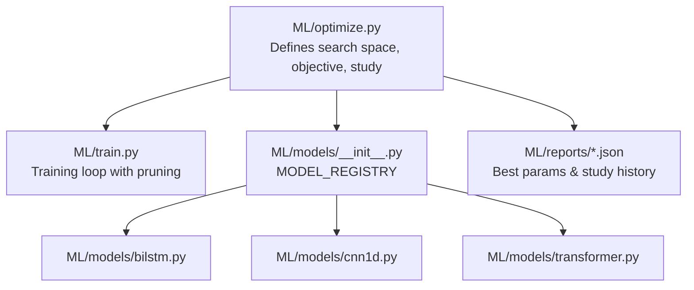
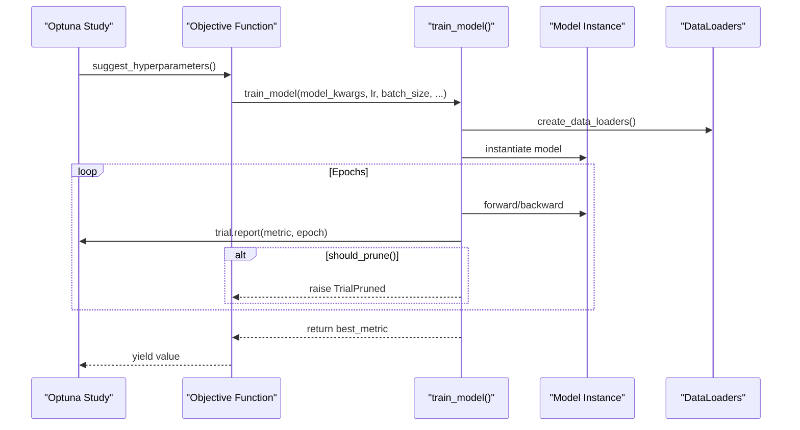
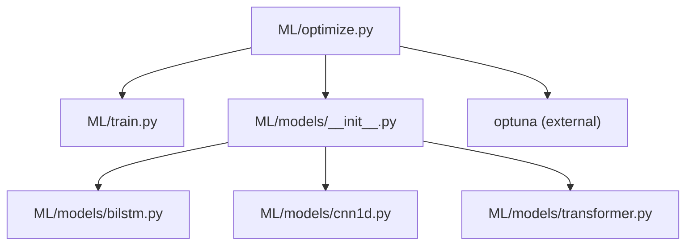

# Hyperparameter Optimization

<cite>
**Referenced Files in This Document**
- [optimize.py](file://ML/optimize.py)
- [train.py](file://ML/train.py)
- [__init__.py](file://ML/models/__init__.py)
- [bilstm.py](file://ML/models/bilstm.py)
- [cnn1d.py](file://ML/models/cnn1d.py)
- [transformer.py](file://ML/models/transformer.py)
- [optuna_best_params_bilstm_regression.json](file://ML/reports/optuna_best_params_bilstm_regression.json)
- [optuna_best_params_cnn1d_classification.json](file://ML/reports/optuna_best_params_cnn1d_classification.json)
- [optuna_best_params_transformer_regression_updn.json](file://ML/reports/optuna_best_params_transformer_regression_updn.json)
- [optuna_study_bilstm_regression_20260316_102024.json](file://ML/reports/optuna_study_bilstm_regression_20260316_102024.json)
</cite>

## Table of Contents
1. [Introduction](#introduction)
2. [Project Structure](#project-structure)
3. [Core Components](#core-components)
4. [Architecture Overview](#architecture-overview)
5. [Detailed Component Analysis](#detailed-component-analysis)
6. [Dependency Analysis](#dependency-analysis)
7. [Performance Considerations](#performance-considerations)
8. [Troubleshooting Guide](#troubleshooting-guide)
9. [Conclusion](#conclusion)

## Introduction
This document explains the hyperparameter optimization workflow implemented in the project using Optuna. It covers the optimization configuration for three model families—Bi-LSTM regression, CNN1D classification, and Transformer regression—and details the search space, objective function, pruning strategies, and integration with the training pipeline. It also provides guidance on interpreting results, applying constraints, and optimizing computational resources.

## Project Structure
The optimization system centers on a dedicated module that defines the search space, builds an objective function, and runs Optuna studies. The training module integrates Optuna pruning and serves as the backend for evaluating candidate hyperparameter sets.

**Diagram sources**
- [optimize.py:1-461](file://ML/optimize.py#L1-L461)
- [train.py:1027-1764](file://ML/train.py#L1027-L1764)
- [__init__.py:23-28](file://ML/models/__init__.py#L23-L28)
- [bilstm.py:30-113](file://ML/models/bilstm.py#L30-L113)
- [cnn1d.py:30-123](file://ML/models/cnn1d.py#L30-L123)
- [transformer.py:78-199](file://ML/models/transformer.py#L78-L199)

**Section sources**
- [optimize.py:1-461](file://ML/optimize.py#L1-L461)
- [train.py:1027-1764](file://ML/train.py#L1027-L1764)
- [__init__.py:23-28](file://ML/models/__init__.py#L23-L28)

## Core Components
- Search space definition: The search space includes learning rate, batch size, patience, weight decay, scheduler parameters, and model-specific architecture parameters. For classification, Focal Loss parameters are included; for regression, either Huber or asymmetric loss parameters are used.
- Objective function: The objective function samples hyperparameters, trains a model via the training pipeline, and returns the best validation metric. It supports Optuna pruning during training.
- Study configuration: The study uses TPE (Tree-structured Parzen Estimator) sampler and median pruning with warmup and interval controls.

Key implementation references:
- Search space and model kwargs: [suggest_hyperparameters:63-125](file://ML/optimize.py#L63-L125)
- Objective wrapper: [create_objective:132-200](file://ML/optimize.py#L132-L200)
- Study creation and pruning: [run_optimization:207-282](file://ML/optimize.py#L207-L282)
- Training integration with pruning: [train_model:1027-1764](file://ML/train.py#L1027-L1764)

**Section sources**
- [optimize.py:63-125](file://ML/optimize.py#L63-L125)
- [optimize.py:132-200](file://ML/optimize.py#L132-L200)
- [optimize.py:207-282](file://ML/optimize.py#L207-L282)
- [train.py:1027-1764](file://ML/train.py#L1027-L1764)

## Architecture Overview
The optimization workflow connects Optuna with the training pipeline. Optuna suggests hyperparameters, the objective function invokes training, and the training loop performs pruning checks after each epoch.

**Diagram sources**
- [optimize.py:132-200](file://ML/optimize.py#L132-L200)
- [train.py:1558-1565](file://ML/train.py#L1558-L1565)

**Section sources**
- [optimize.py:132-200](file://ML/optimize.py#L132-L200)
- [train.py:1558-1565](file://ML/train.py#L1558-L1565)

## Detailed Component Analysis

### Search Space Definition
The search space is defined in the objective function builder and includes:
- Common: learning rate (log-uniform), batch size (categorical), patience, weight decay (log-uniform), scheduler patience and factor.
- Classification: Focal Loss alpha weights derived from a minority weight parameter and gamma.
- Regression: Huber delta or asymmetric loss parameters (over/under penalties).
- Model-specific kwargs:
  - Bi-LSTM: hidden size, number of layers, dropout.
  - Transformer: d_model, nhead (must divide d_model), num_layers, dim_feedforward, dropout.
  - CNN1D/Hybrid: dropout.

These are sampled via Optuna trial suggestions and passed to the training function.

**Section sources**
- [optimize.py:63-125](file://ML/optimize.py#L63-L125)

### Objective Function and Pruning Integration
The objective function:
- Builds hyperparameter dictionary from the trial.
- Seeds each trial independently to reduce variance.
- Calls the training function with the sampled parameters.
- Returns the best validation metric observed during training.
- Raises a pruning exception when Optuna determines a trial should be pruned.

Pruning is integrated inside the training loop:
- After each epoch, the training function reports the current metric to Optuna.
- If Optuna decides to prune, the training loop raises a pruning exception, short-circuiting the trial.

**Section sources**
- [optimize.py:132-200](file://ML/optimize.py#L132-L200)
- [train.py:1558-1565](file://ML/train.py#L1558-L1565)

### Optimization Strategies
- Sampler: TPE (Tree-structured Parzen Estimator) for probabilistic modeling of good configurations.
- Pruner: Median pruning with startup and warmup steps, checking pruning every epoch.
- Direction: Maximization (F1 for classification, Pearson correlation for regression).
- Metric modes:
  - Classification: macro F1 by default, with alternatives for minority F1 and signal precision with minimum recall constraints.

**Section sources**
- [optimize.py:235-247](file://ML/optimize.py#L235-L247)
- [train.py:1526-1536](file://ML/train.py#L1526-L1536)

### Model-Specific Configurations and Best Parameters

#### Bi-LSTM Regression
- Task: regression with asymmetric loss.
- Best parameters (example):
  - Learning rate: ~0.008
  - Batch size: 256
  - Patience: 5
  - Weight decay: ~3.46e-05
  - Scheduler patience: 7, factor: ~0.50
  - Asymptotic under penalty: ~1.03
  - Architecture: hidden size 64, 3 layers, dropout ~0.16
- Study highlights: Multiple trials pruned early; best trial achieved a validation metric around 0.339.

**Section sources**
- [optuna_best_params_bilstm_regression.json:1-20](file://ML/reports/optuna_best_params_bilstm_regression.json#L1-L20)
- [optuna_study_bilstm_regression_20260316_102024.json:1-1020](file://ML/reports/optuna_study_bilstm_regression_20260316_102024.json#L1-L1020)

#### CNN1D Classification
- Task: classification with Focal Loss.
- Best parameters (example):
  - Learning rate: ~0.0022
  - Batch size: 64
  - Patience: 9
  - Weight decay: ~2.29e-05
  - Scheduler patience: 4, factor: ~0.49
  - Focal Loss: minority weight ~0.257, gamma ~1.84
- Study highlights: Balanced exploration across categorical batch sizes and moderate dropout.

**Section sources**
- [optuna_best_params_cnn1d_classification.json:1-18](file://ML/reports/optuna_best_params_cnn1d_classification.json#L1-L18)

#### Transformer Regression (Multi-target)
- Task: regression_updn (multi-target regression).
- Best parameters (example):
  - Learning rate: ~0.0023
  - Batch size: 256
  - Patience: 6
  - Weight decay: ~7.90e-05
  - Scheduler patience: 4, factor: ~0.39
  - Huber delta: ~0.85
  - Architecture: d_model 32, nhead 8, num_layers 3, dim_feedforward 128, dropout ~0.17
- Study highlights: Strong correlation performance; careful tuning of attention heads and model dimensionality.

**Section sources**
- [optuna_best_params_transformer_regression_updn.json:1-22](file://ML/reports/optuna_best_params_transformer_regression_updn.json#L1-L22)

### Custom Optimization Objectives and Constraints
- Custom objectives: The objective function can be adapted to maximize different metrics or incorporate custom constraints by modifying the returned value and adding penalties for constraint violations.
- Constraint handling: For classification, a signal precision mode enforces a minimum recall threshold; trials below the threshold receive a zero metric to discourage poor configurations.
- Metric modes: Macro F1, minority F1, and signal precision are selectable via CLI arguments.

**Section sources**
- [optimize.py:132-200](file://ML/optimize.py#L132-L200)
- [train.py:1526-1536](file://ML/train.py#L1526-L1536)
- [optimize.py:375-424](file://ML/optimize.py#L375-L424)

### Result Interpretation and Reporting
- Best parameters JSON captures the optimal configuration, best value, trial number, and timestamp.
- Full study JSON includes per-trial metrics, states (complete/pruned/failed), and timing metadata.
- Use these artifacts to compare model families, analyze pruning behavior, and select configurations for production training.

**Section sources**
- [optimize.py:285-342](file://ML/optimize.py#L285-L342)
- [optuna_best_params_bilstm_regression.json:1-20](file://ML/reports/optuna_best_params_bilstm_regression.json#L1-L20)
- [optuna_study_bilstm_regression_20260316_102024.json:1-1020](file://ML/reports/optuna_study_bilstm_regression_20260316_102024.json#L1-L1020)

## Dependency Analysis
The optimization module depends on:
- Training module for model instantiation, loss selection, and training/validation loops.
- Model registry for selecting architectures.
- Optuna for sampling and pruning.

**Diagram sources**
- [optimize.py:48-49](file://ML/optimize.py#L48-L49)
- [__init__.py:23-28](file://ML/models/__init__.py#L23-L28)
- [bilstm.py:30-113](file://ML/models/bilstm.py#L30-L113)
- [cnn1d.py:30-123](file://ML/models/cnn1d.py#L30-L123)
- [transformer.py:78-199](file://ML/models/transformer.py#L78-L199)

**Section sources**
- [optimize.py:48-49](file://ML/optimize.py#L48-L49)
- [__init__.py:23-28](file://ML/models/__init__.py#L23-L28)

## Performance Considerations
- Computational cost: Each trial trains a model for a limited number of epochs with early stopping. Use patience and scheduler parameters to balance convergence and runtime.
- Parallel execution: Optuna does not enforce parallelism internally; run multiple studies concurrently or use Optuna's multiprocessing features externally if needed.
- Resource management:
  - Reduce batch size for memory-constrained environments.
  - Tune learning rates and weight decay to avoid wasted iterations on unstable configurations.
  - Use pruning effectively by setting appropriate startup/warmup intervals and check frequencies.
- Model scaling: Larger architectures (e.g., Transformer with higher d_model/nhead) benefit from more data and longer training but increase compute cost.

## Troubleshooting Guide
- Optuna not installed: The optimization module checks for Optuna availability and exits with a clear message if missing.
- Trial failures: The objective catches exceptions and returns a minimal value to mark the trial as failed; inspect the study JSON for failure counts and timestamps.
- Pruning behavior: If many trials are pruned, consider increasing n_startup_trials or warmup steps to allow more exploration.
- Metric saturation: For classification, ensure metric_mode aligns with the task; for regression, choose between Huber and asymmetric loss depending on tolerance to over/under predictions.

**Section sources**
- [optimize.py:431-436](file://ML/optimize.py#L431-L436)
- [optimize.py:195-198](file://ML/optimize.py#L195-L198)
- [optimize.py:235-247](file://ML/optimize.py#L235-L247)

## Conclusion
The optimization system provides a robust framework for automated hyperparameter tuning across multiple model families and tasks. By combining structured search spaces, adaptive pruning, and integration with the training pipeline, it efficiently identifies high-performing configurations while managing computational resources. Use the provided best-parameter reports and study histories to guide production training and further experimentation.