# Machine Learning Models

<cite>
**Referenced Files in This Document**
- [transformer.py](file://ML/models/transformer.py)
- [entry_path_transformer.py](file://ML/models/entry_path_transformer.py)
- [entry_path_dual_stream_transformer.py](file://ML/models/entry_path_dual_stream_transformer.py)
- [entry_path_v1_quantile_transformer.py](file://ML/models/entry_path_v1_quantile_transformer.py)
- [take_skip_dual_stream_transformer.py](file://ML/models/take_skip_dual_stream_transformer.py)
- [trailing_stop_target_quantile_transformer.py](file://ML/models/trailing_stop_target_quantile_transformer.py)
- [data_loader.py](file://ML/data_loader.py)
- [train.py](file://ML/train.py)
- [evaluate_test.py](file://ML/evaluate_test.py)
- [losses.py](file://ML/losses.py)
- [optimize.py](file://ML/optimize.py)
- [utils.py](file://ML/utils.py)
- [entry_path_task.py](file://ML/entry_path_task.py)
- [README.md](file://ML/README.md)
</cite>

## Table of Contents
1. [Introduction](#introduction)
2. [Project Structure](#project-structure)
3. [Core Components](#core-components)
4. [Architecture Overview](#architecture-overview)
5. [Detailed Component Analysis](#detailed-component-analysis)
6. [Dependency Analysis](#dependency-analysis)
7. [Performance Considerations](#performance-considerations)
8. [Troubleshooting Guide](#troubleshooting-guide)
9. [Conclusion](#conclusion)
10. [Appendices](#appendices)

## Introduction
This document describes the machine learning models powering the SoSimple trading system with a focus on transformer-based architectures for sequence modeling of fractal data. It covers:
- Transformer encoders for sequence classification and multi-task entry path modeling
- Dual-stream architectures that fuse raw sequences with engineered features
- Quantile regression extensions for uncertainty-aware predictions
- Training pipeline, data loading, evaluation, and hyperparameter optimization
- Model checkpoints, versioning, and deployment strategies
- Model selection criteria, cross-validation strategies, and benchmarking against baselines

## Project Structure
The ML subsystem is organized into modular components:
- Core: data loading, loss functions, metrics, and utilities
- Models: transformer-based architectures and specialized dual-stream networks
- Training: unified training loop, early stopping, schedulers, and validation
- Evaluation: out-of-sample testing, threshold analysis, and comparative benchmarks
- Optimization: Optuna-based hyperparameter search with pruning

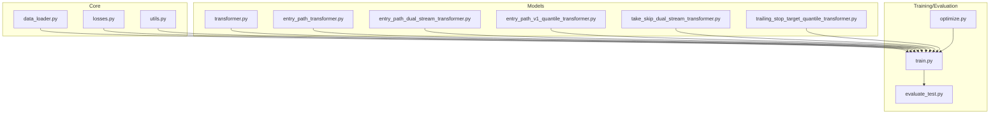

**Diagram sources**
- [data_loader.py:1-1210](file://ML/data_loader.py#L1-1210)
- [train.py:1-2506](file://ML/train.py#L1-2506)
- [evaluate_test.py:1-887](file://ML/evaluate_test.py#L1-887)
- [optimize.py:1-461](file://ML/optimize.py#L1-461)
- [transformer.py:1-199](file://ML/models/transformer.py#L1-199)
- [entry_path_transformer.py:1-116](file://ML/models/entry_path_transformer.py#L1-116)
- [entry_path_dual_stream_transformer.py:1-134](file://ML/models/entry_path_dual_stream_transformer.py#L1-134)
- [entry_path_v1_quantile_transformer.py:1-125](file://ML/models/entry_path_v1_quantile_transformer.py#L1-125)
- [take_skip_dual_stream_transformer.py:1-92](file://ML/models/take_skip_dual_stream_transformer.py#L1-92)
- [trailing_stop_target_quantile_transformer.py:1-76](file://ML/models/trailing_stop_target_quantile_transformer.py#L1-76)

**Section sources**
- [README.md:1-183](file://ML/README.md#L1-L183)

## Core Components
- Transformer Encoder with CLS token and positional encoding for sequence modeling
- Entry path transformers with multi-task heads for returns, path regression, and path classification
- Dual-stream transformers that fuse raw sequences with engineered features
- Quantile transformers for uncertainty quantification
- Data loaders with caching, normalization, and padding masks
- Training/validation loops with early stopping and schedulers
- Loss functions: Focal Loss, Huber Loss, Asymmetric Loss, directional asymmetric loss
- Metrics: classification F1, regression Pearson r, binary classification AUC/precision/recall
- Hyperparameter optimization via Optuna with pruning

**Section sources**
- [transformer.py:1-199](file://ML/models/transformer.py#L1-L199)
- [entry_path_transformer.py:1-116](file://ML/models/entry_path_transformer.py#L1-L116)
- [entry_path_dual_stream_transformer.py:1-134](file://ML/models/entry_path_dual_stream_transformer.py#L1-L134)
- [entry_path_v1_quantile_transformer.py:1-125](file://ML/models/entry_path_v1_quantile_transformer.py#L1-L125)
- [take_skip_dual_stream_transformer.py:1-92](file://ML/models/take_skip_dual_stream_transformer.py#L1-L92)
- [trailing_stop_target_quantile_transformer.py:1-76](file://ML/models/trailing_stop_target_quantile_transformer.py#L1-L76)
- [data_loader.py:1-1210](file://ML/data_loader.py#L1-L1210)
- [train.py:1-2506](file://ML/train.py#L1-L2506)
- [losses.py:1-233](file://ML/losses.py#L1-L233)
- [utils.py:1-340](file://ML/utils.py#L1-L340)
- [optimize.py:1-461](file://ML/optimize.py#L1-L461)

## Architecture Overview
The SoSimple ML stack builds on a shared transformer backbone:
- Positional encoding embeds temporal order into the sequence
- A learnable CLS token aggregates global sequence information
- Transformer encoder layers capture long-range dependencies
- Task-specific heads produce logits for classification/regression/quantile outputs
- Optional dual-stream fusion injects engineered features for richer context

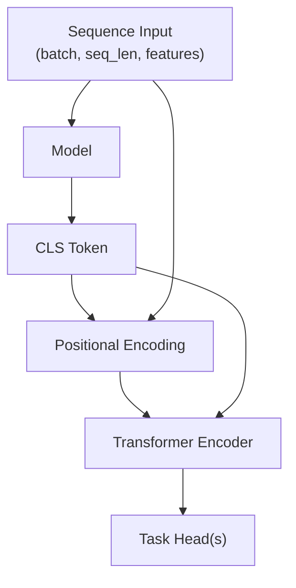

**Diagram sources**
- [transformer.py:78-199](file://ML/models/transformer.py#L78-L199)

## Detailed Component Analysis

### Transformer Encoder (Base)
The base transformer encoder provides:
- Input projection to d_model
- CLS token prepending for global aggregation
- Positional encoding with sinusoidal embeddings
- TransformerEncoder with configurable depth and width
- Classification head for 3-class direction prediction

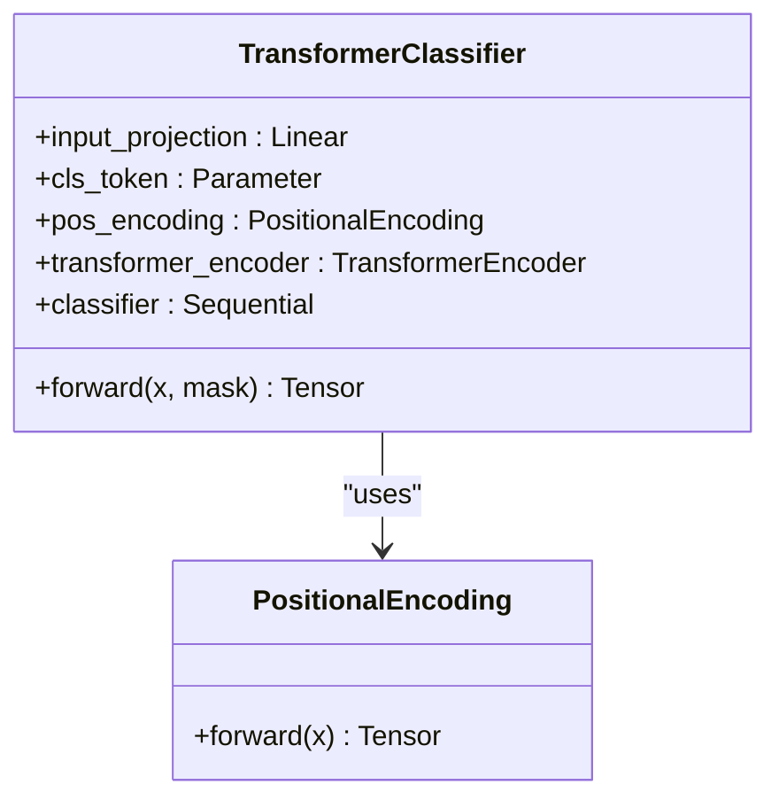

**Diagram sources**
- [transformer.py:35-199](file://ML/models/transformer.py#L35-L199)

**Section sources**
- [transformer.py:1-199](file://ML/models/transformer.py#L1-L199)

### Entry Path Transformer (Multi-task)
Entry path modeling combines:
- Sequence modeling with CLS token and positional encoding
- Fusion of sequence representation with engineered features
- Multi-task heads:
  - Returns regression (3 targets)
  - Path regression (6 targets)
  - Path classification (3 classes) with time-weighted pooling

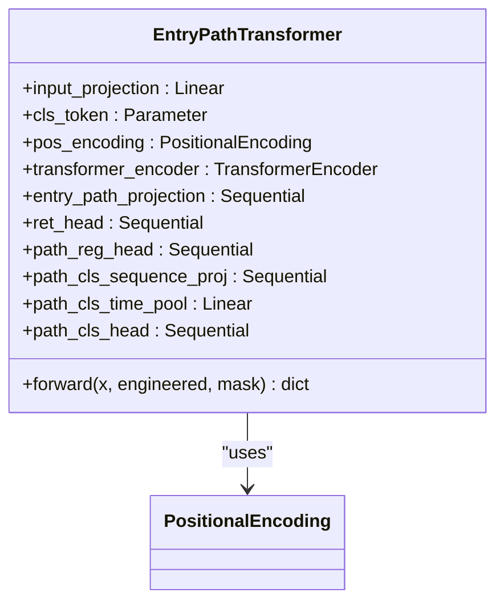

**Diagram sources**
- [entry_path_transformer.py:7-116](file://ML/models/entry_path_transformer.py#L7-L116)

**Section sources**
- [entry_path_transformer.py:1-116](file://ML/models/entry_path_transformer.py#L1-L116)
- [entry_path_task.py:1-200](file://ML/entry_path_task.py#L1-L200)

### Entry Path Dual-Stream Transformer
This variant explicitly encodes engineered features separately and fuses them with the sequence CLS token:
- Engineered encoder projects features to d_model
- Concatenation and fusion to a single representation
- Same downstream heads as the single-stream entry path transformer

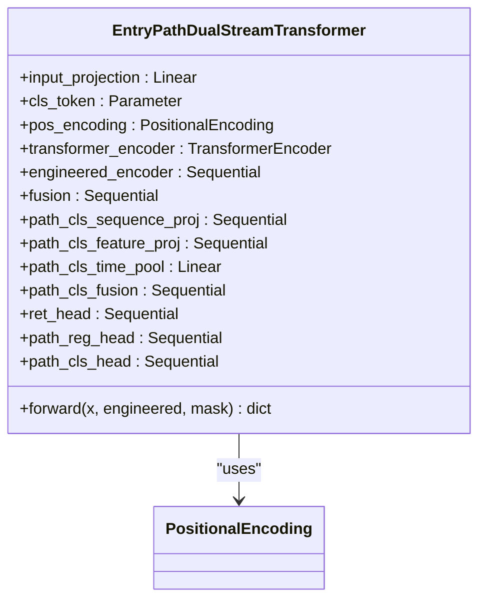

**Diagram sources**
- [entry_path_dual_stream_transformer.py:7-134](file://ML/models/entry_path_dual_stream_transformer.py#L7-L134)

**Section sources**
- [entry_path_dual_stream_transformer.py:1-134](file://ML/models/entry_path_dual_stream_transformer.py#L1-L134)

### Entry Path V1 Quantile Transformer
Extends the entry path transformer with quantile heads for returns:
- Additional heads for lower and upper quantiles
- Pinball loss computation for quantile regression
- Maintains multi-task returns/path classification outputs

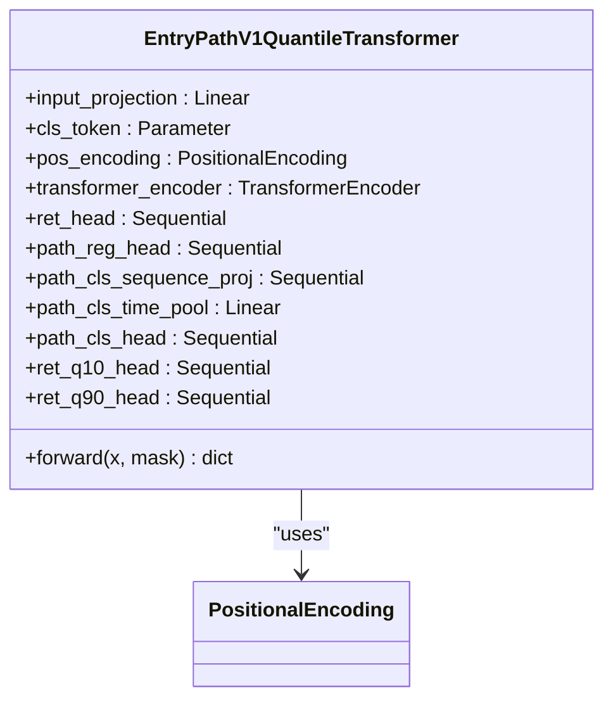

**Diagram sources**
- [entry_path_v1_quantile_transformer.py:13-125](file://ML/models/entry_path_v1_quantile_transformer.py#L13-L125)

**Section sources**
- [entry_path_v1_quantile_transformer.py:1-125](file://ML/models/entry_path_v1_quantile_transformer.py#L1-L125)

### Take/Skip Dual-Stream Transformer
A dual-stream network for take/skip v2 modeling:
- Fuses raw sequence features with engineered lib_PIC features
- Single-output head for multi-target classification/regression

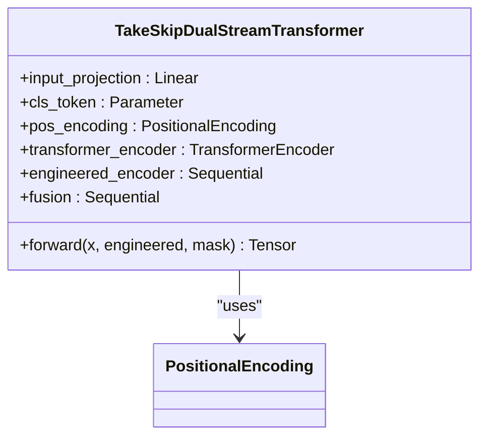

**Diagram sources**
- [take_skip_dual_stream_transformer.py:24-92](file://ML/models/take_skip_dual_stream_transformer.py#L24-L92)

**Section sources**
- [take_skip_dual_stream_transformer.py:1-92](file://ML/models/take_skip_dual_stream_transformer.py#L1-L92)

### Trailing Stop Target Quantile Transformer
Predicts quantiles for trailing stop targets:
- Three quantile heads (10th, 50th, 90th)
- Ordered quantile computation for consistent intervals

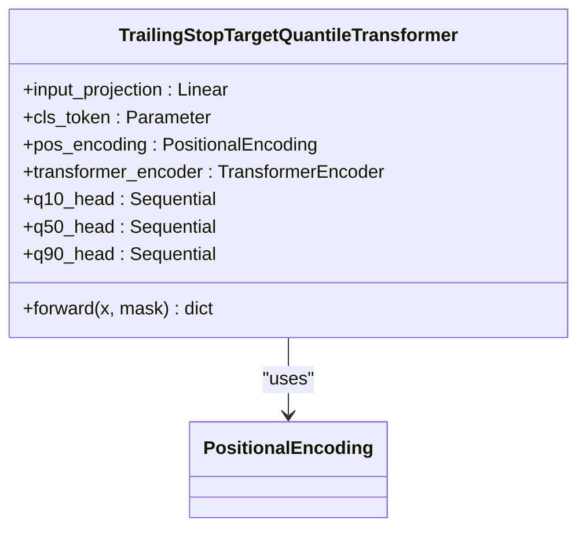

**Diagram sources**
- [trailing_stop_target_quantile_transformer.py:7-76](file://ML/models/trailing_stop_target_quantile_transformer.py#L7-L76)

**Section sources**
- [trailing_stop_target_quantile_transformer.py:1-76](file://ML/models/trailing_stop_target_quantile_transformer.py#L1-L76)

### Data Loading and Preprocessing
The data loader:
- Parses fractal sequences from CSV into 3D tensors
- Computes time-based features and ATR ratios
- Applies padding masks for variable-length sequences
- Supports caching of parsed arrays for fast reload
- Handles entry path feature profiles and engineering

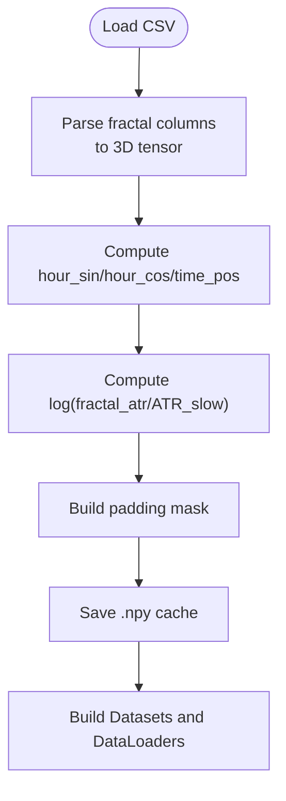

**Diagram sources**
- [data_loader.py:331-424](file://ML/data_loader.py#L331-L424)
- [data_loader.py:549-800](file://ML/data_loader.py#L549-L800)

**Section sources**
- [data_loader.py:1-1210](file://ML/data_loader.py#L1-L1210)

### Training Pipeline
Key training mechanics:
- Unified training loop supporting classification, regression, entry path, and quantile tasks
- Early stopping on macro F1 (classification), Pearson r (regression), or task-specific scores
- ReduceLROnPlateau scheduler
- Gradient clipping and weighted losses for active signals
- Validation routines for multi-task metrics and per-target scoring

```mermaid
sequenceDiagram
participant Loader as "DataLoader"
participant Model as "Transformer Model"
participant Train as "train_one_epoch()"
participant Val as "validate_*()"
participant Opt as "Optimizer"
Loader->>Train : batches (X,y,mask)
Train->>Model : forward(X, mask)
Model-->>Train : logits
Train->>Opt : backward(loss)
Opt-->>Train : update params
Train-->>Val : periodic validation
Val->>Model : eval forward(X, mask)
Model-->>Val : metrics
```

**Diagram sources**
- [train.py:176-240](file://ML/train.py#L176-L240)
- [train.py:242-441](file://ML/train.py#L242-L441)

**Section sources**
- [train.py:1-2506](file://ML/train.py#L1-L2506)

### Evaluation and Benchmarking
Out-of-sample evaluation:
- Loads checkpoints with stored model kwargs and seq_len
- Supports entry path, quantile entry path, trailing stop quantile, and generic tasks
- Computes task-appropriate metrics and generates reports
- Includes threshold analysis and trading rule simulation for outcome-aligned tasks

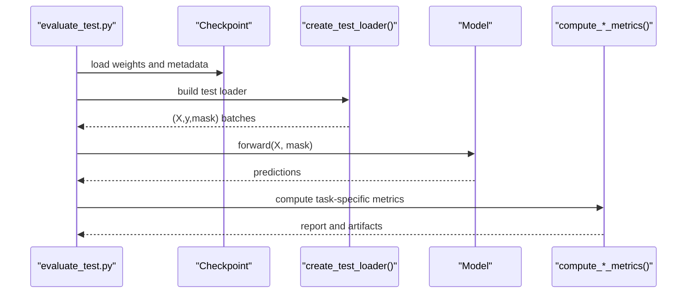

**Diagram sources**
- [evaluate_test.py:154-800](file://ML/evaluate_test.py#L154-L800)

**Section sources**
- [evaluate_test.py:1-887](file://ML/evaluate_test.py#L1-L887)

### Hyperparameter Optimization with Optuna
Optuna-based optimization:
- Searches learning rate, batch size, patience, weight decay, scheduler parameters
- Architecture-specific spaces for transformer (d_model, nhead, num_layers, dim_feedforward)
- Pruning with median-based criterion
- Saves best parameters and study history

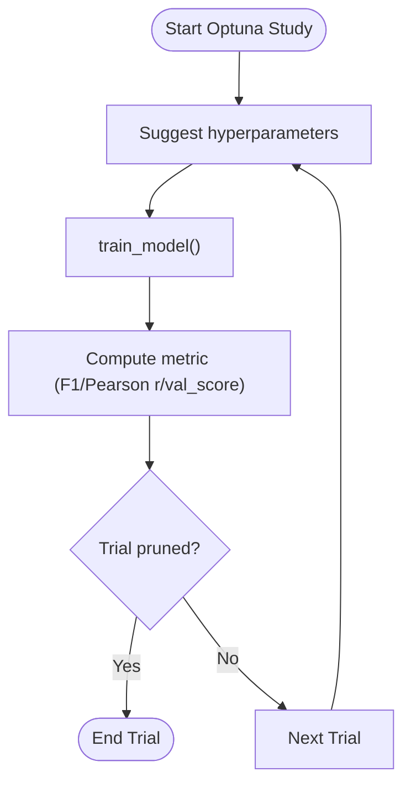

**Diagram sources**
- [optimize.py:132-201](file://ML/optimize.py#L132-L201)
- [optimize.py:207-283](file://ML/optimize.py#L207-L283)

**Section sources**
- [optimize.py:1-461](file://ML/optimize.py#L1-L461)

### Loss Functions and Metrics
- Focal Loss for imbalanced classification
- Huber Loss for robust regression
- Asymmetric Loss and Directional Asymmetric Loss for directional trading targets
- Metrics: macro F1, precision/recall per class, Pearson r, AUC, MAE/RMSE/R²

**Section sources**
- [losses.py:1-233](file://ML/losses.py#L1-L233)
- [utils.py:60-340](file://ML/utils.py#L60-L340)

## Dependency Analysis
The transformer-based models share a common positional encoding and transformer encoder, while specialized heads and fusion blocks tailor outputs to specific tasks.

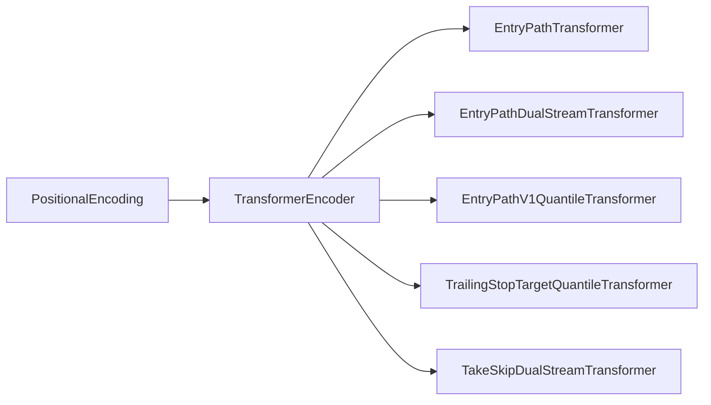

**Diagram sources**
- [transformer.py:35-199](file://ML/models/transformer.py#L35-L199)
- [entry_path_transformer.py:24-36](file://ML/models/entry_path_transformer.py#L24-L36)
- [entry_path_dual_stream_transformer.py:24-36](file://ML/models/entry_path_dual_stream_transformer.py#L24-L36)
- [entry_path_v1_quantile_transformer.py:25-37](file://ML/models/entry_path_v1_quantile_transformer.py#L25-L37)
- [take_skip_dual_stream_transformer.py:39-51](file://ML/models/take_skip_dual_stream_transformer.py#L39-L51)
- [trailing_stop_target_quantile_transformer.py:19-31](file://ML/models/trailing_stop_target_quantile_transformer.py#L19-L31)

**Section sources**
- [transformer.py:1-199](file://ML/models/transformer.py#L1-L199)
- [entry_path_transformer.py:1-116](file://ML/models/entry_path_transformer.py#L1-L116)
- [entry_path_dual_stream_transformer.py:1-134](file://ML/models/entry_path_dual_stream_transformer.py#L1-L134)
- [entry_path_v1_quantile_transformer.py:1-125](file://ML/models/entry_path_v1_quantile_transformer.py#L1-L125)
- [take_skip_dual_stream_transformer.py:1-92](file://ML/models/take_skip_dual_stream_transformer.py#L1-L92)
- [trailing_stop_target_quantile_transformer.py:1-76](file://ML/models/trailing_stop_target_quantile_transformer.py#L1-L76)

## Performance Considerations
- Use gradient clipping to stabilize training
- Apply early stopping with appropriate metrics (macro F1, Pearson r, task-specific val_score)
- Normalize features when required; leverage cached preprocessing for speed
- Prefer quantile heads for uncertainty-aware decisions and interval coverage diagnostics
- Monitor per-target metrics for multi-task models to prevent catastrophic forgetting

## Troubleshooting Guide
Common issues and resolutions:
- Empty or invalid cached arrays: clear cache and re-parse CSV
- Unsupported entry path feature profiles: validate profile names and rebuild feature bank
- Unknown class labels in entry path classification: ensure labels are mapped consistently
- Device mismatch during inference: ensure checkpoint device alignment or map to CPU/GPU
- Low signal coverage in outcome-aligned tasks: adjust score thresholds and review frozen targets

**Section sources**
- [data_loader.py:604-784](file://ML/data_loader.py#L604-L784)
- [entry_path_task.py:54-58](file://ML/entry_path_task.py#L54-L58)
- [evaluate_test.py:154-226](file://ML/evaluate_test.py#L154-L226)

## Conclusion
The SoSimple ML stack leverages transformer-based sequence modeling with task-specific heads and optional dual-stream fusion. The unified training and evaluation framework, combined with Optuna-based optimization, enables robust experimentation and deployment. Quantile heads and careful validation strategies support uncertainty-aware trading decisions and reliable benchmarking.

## Appendices

### Model Selection Criteria
- Early stopping on task-appropriate metrics (macro F1, Pearson r, val_score)
- Cross-validation strategies: time-aware splits for financial sequences; OOS evaluation on held-out test sets
- Benchmarking against baselines: dedicated baseline experiments and comparative reports
- Deployment readiness: frozen artifacts, threshold analysis, and live-safe audits

**Section sources**
- [README.md:69-183](file://ML/README.md#L69-L183)