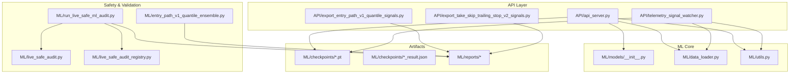
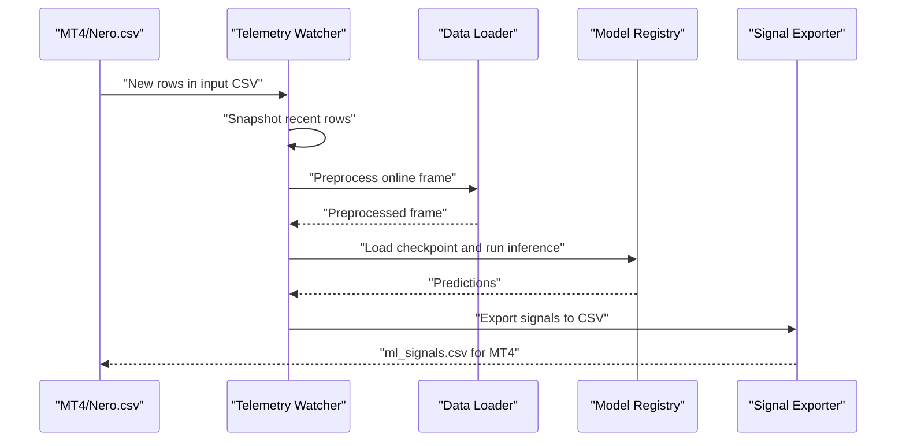
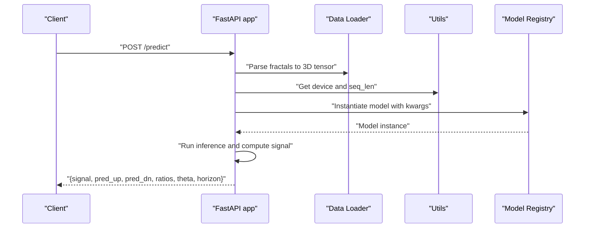
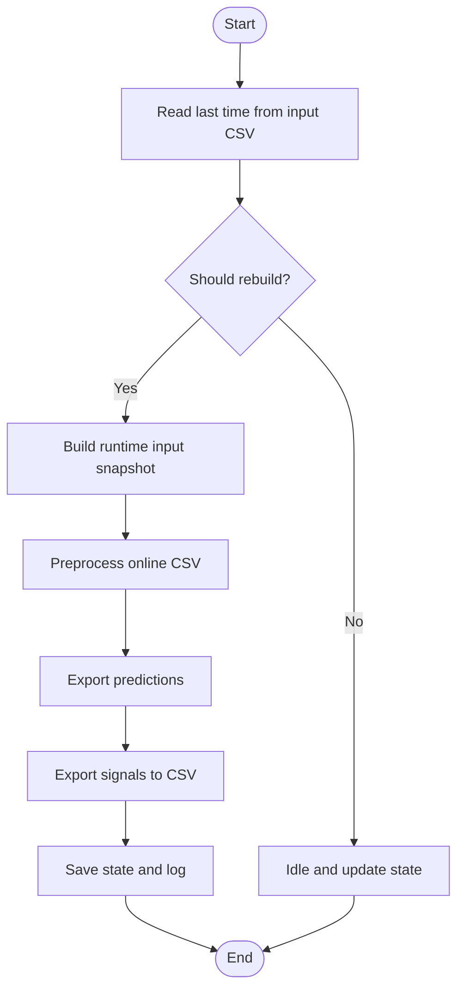
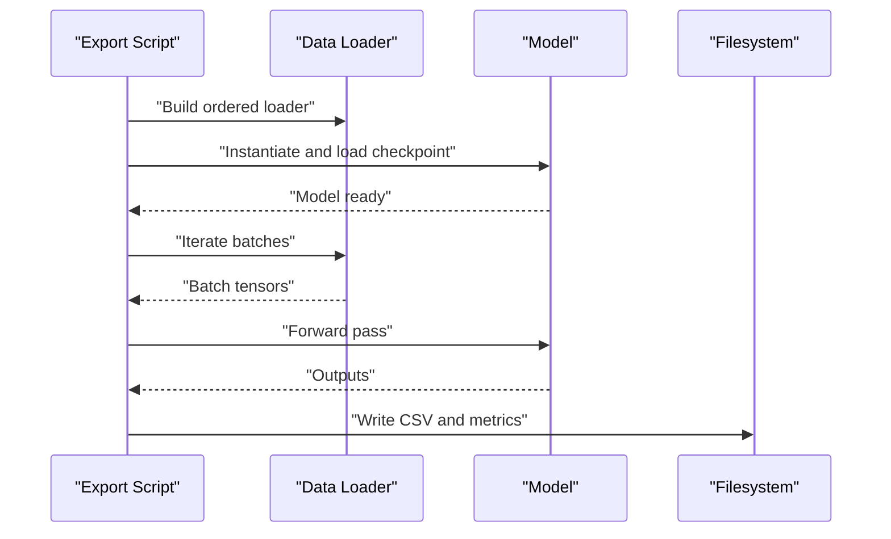
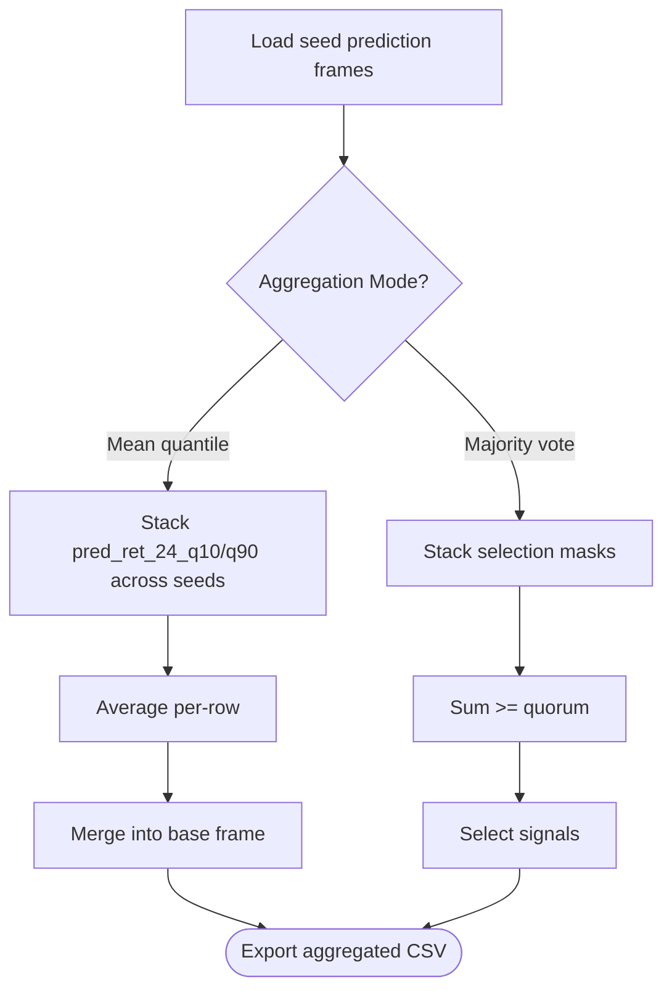
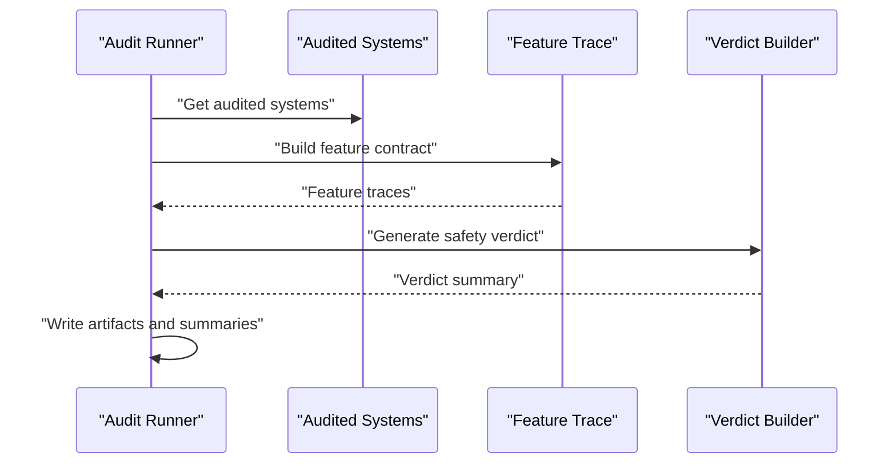
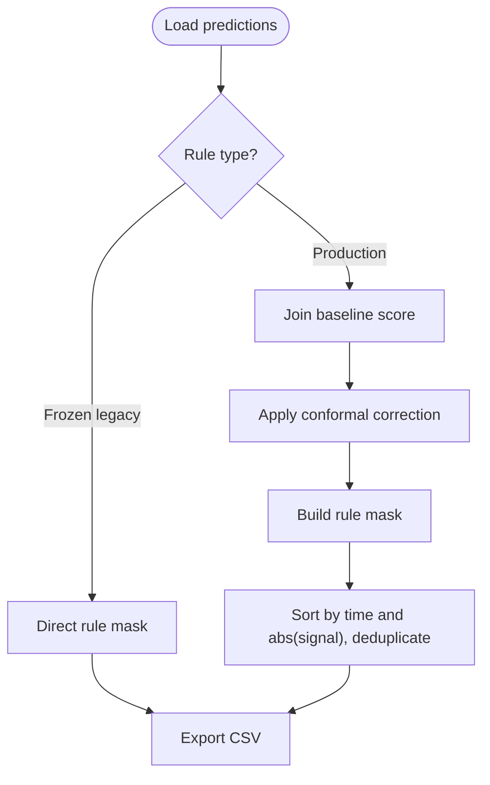
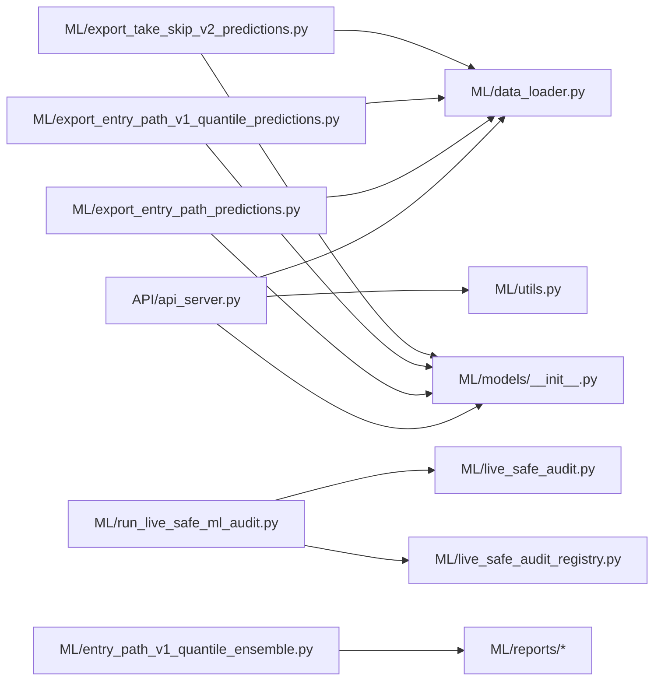

# Model Deployment and Inference

<cite>
**Referenced Files in This Document**
- [API/api_server.py](file://API/api_server.py)
- [API/telemetry_signal_watcher.py](file://API/telemetry_signal_watcher.py)
- [API/export_entry_path_v1_quantile_signals.py](file://API/export_entry_path_v1_quantile_signals.py)
- [API/export_take_skip_trailing_stop_v2_signals.py](file://API/export_take_skip_trailing_stop_v2_signals.py)
- [ML/models/__init__.py](file://ML/models/__init__.py)
- [ML/data_loader.py](file://ML/data_loader.py)
- [ML/utils.py](file://ML/utils.py)
- [ML/checkpoints/transformer_entry_path_v1_quantile_result.json](file://ML/checkpoints/transformer_entry_path_v1_quantile_result.json)
- [ML/export_entry_path_v1_quantile_predictions.py](file://ML/export_entry_path_v1_quantile_predictions.py)
- [ML/export_entry_path_predictions.py](file://ML/export_entry_path_predictions.py)
- [ML/export_take_skip_v2_predictions.py](file://ML/export_take_skip_v2_predictions.py)
- [ML/live_safe_audit.py](file://ML/live_safe_audit.py)
- [ML/live_safe_audit_registry.py](file://ML/live_safe_audit_registry.py)
- [ML/entry_path_v1_quantile_ensemble.py](file://ML/entry_path_v1_quantile_ensemble.py)
- [ML/run_live_safe_ml_audit.py](file://ML/run_live_safe_ml_audit.py)
</cite>

## Table of Contents
1. [Introduction](#introduction)
2. [Project Structure](#project-structure)
3. [Core Components](#core-components)
4. [Architecture Overview](#architecture-overview)
5. [Detailed Component Analysis](#detailed-component-analysis)
6. [Dependency Analysis](#dependency-analysis)
7. [Performance Considerations](#performance-considerations)
8. [Troubleshooting Guide](#troubleshooting-guide)
9. [Conclusion](#conclusion)
10. [Appendices](#appendices)

## Introduction
This document describes the model deployment and inference pipeline for production use. It covers checkpoint management in the checkpoints directory, model serialization and parameter storage, and version control. It explains prediction export scripts for different model types (entry path predictions, quantile predictions, and take/skip predictions), ensemble methods for quantile predictions, and aggregation strategies. It also documents live safety auditing procedures for online deployment, including feature trace analysis, legacy system replay, and safety verdict generation. Finally, it outlines deployment best practices, model validation procedures, integration with the API service, monitoring, performance tracking, and rollback procedures for production environments.

## Project Structure
The deployment pipeline spans three primary areas:
- API service for online inference and telemetry
- ML utilities for model loading, data parsing, and evaluation
- Reports and checkpoints for model artifacts and safety audits

**Diagram sources**
- [API/api_server.py:1-174](file://API/api_server.py#L1-L174)
- [API/telemetry_signal_watcher.py:1-422](file://API/telemetry_signal_watcher.py#L1-L422)
- [API/export_entry_path_v1_quantile_signals.py:1-209](file://API/export_entry_path_v1_quantile_signals.py#L1-L209)
- [API/export_take_skip_trailing_stop_v2_signals.py:1-323](file://API/export_take_skip_trailing_stop_v2_signals.py#L1-L323)
- [ML/models/__init__.py:1-49](file://ML/models/__init__.py#L1-L49)
- [ML/data_loader.py:1-200](file://ML/data_loader.py#L1-L200)
- [ML/utils.py:1-340](file://ML/utils.py#L1-L340)
- [ML/live_safe_audit.py:1-132](file://ML/live_safe_audit.py#L1-L132)
- [ML/live_safe_audit_registry.py:1-82](file://ML/live_safe_audit_registry.py#L1-L82)
- [ML/run_live_safe_ml_audit.py:1-406](file://ML/run_live_safe_ml_audit.py#L1-L406)
- [ML/entry_path_v1_quantile_ensemble.py:1-32](file://ML/entry_path_v1_quantile_ensemble.py#L1-L32)

**Section sources**
- [API/api_server.py:1-174](file://API/api_server.py#L1-L174)
- [API/telemetry_signal_watcher.py:1-422](file://API/telemetry_signal_watcher.py#L1-L422)
- [ML/models/__init__.py:1-49](file://ML/models/__init__.py#L1-L49)
- [ML/data_loader.py:1-200](file://ML/data_loader.py#L1-L200)
- [ML/utils.py:1-340](file://ML/utils.py#L1-L340)

## Core Components
- API inference server: loads a trained checkpoint, performs preprocessing, runs inference, and returns a trading signal with confidence metrics.
- Telemetry watcher: continuously monitors an input CSV, snapshots recent rows, applies causal preprocessing, runs inference, and exports signals for MT4.
- Exporters: convert prediction CSVs into MT4-ready signals using frozen rules for entry path quantile and take/skip v2 systems.
- Checkpoints and reports: serialized model state dicts, architecture parameters, and training/validation metrics.
- Safety audit: feature trace classification, registry of audited systems, and end-to-end audit runner for legacy reproduction and safety verdicts.
- Ensemble: quantile prediction aggregation across multiple seeds.

**Section sources**
- [API/api_server.py:103-169](file://API/api_server.py#L103-L169)
- [API/telemetry_signal_watcher.py:203-257](file://API/telemetry_signal_watcher.py#L203-L257)
- [API/export_entry_path_v1_quantile_signals.py:126-175](file://API/export_entry_path_v1_quantile_signals.py#L126-L175)
- [API/export_take_skip_trailing_stop_v2_signals.py:179-250](file://API/export_take_skip_trailing_stop_v2_signals.py#L179-L250)
- [ML/live_safe_audit.py:36-54](file://ML/live_safe_audit.py#L36-L54)
- [ML/live_safe_audit_registry.py:16-77](file://ML/live_safe_audit_registry.py#L16-L77)
- [ML/entry_path_v1_quantile_ensemble.py:21-31](file://ML/entry_path_v1_quantile_ensemble.py#L21-L31)

## Architecture Overview
The production pipeline integrates offline and online stages:
- Offline stage: export prediction CSVs from checkpoints for research and validation.
- Online stage: API server or telemetry watcher ingest live data, preprocess, infer, and export signals.
- Safety stage: live-safe audit validates feature contracts and generates safety verdicts.

**Diagram sources**
- [API/telemetry_signal_watcher.py:203-257](file://API/telemetry_signal_watcher.py#L203-L257)
- [ML/data_loader.py:1-200](file://ML/data_loader.py#L1-L200)
- [ML/models/__init__.py:31-48](file://ML/models/__init__.py#L31-L48)
- [API/export_take_skip_trailing_stop_v2_signals.py:179-250](file://API/export_take_skip_trailing_stop_v2_signals.py#L179-L250)

## Detailed Component Analysis

### API Inference Server
The API server initializes on startup, loads a checkpoint, constructs the model with architecture parameters, and exposes a /predict endpoint. It enforces sequence length and horizon constraints and returns a trading signal with ratios and thresholds.

**Diagram sources**
- [API/api_server.py:49-94](file://API/api_server.py#L49-L94)
- [API/api_server.py:103-169](file://API/api_server.py#L103-L169)
- [ML/data_loader.py:1-200](file://ML/data_loader.py#L1-L200)
- [ML/utils.py:326-340](file://ML/utils.py#L326-L340)
- [ML/models/__init__.py:31-48](file://ML/models/__init__.py#L31-L48)

**Section sources**
- [API/api_server.py:28-94](file://API/api_server.py#L28-L94)
- [API/api_server.py:103-169](file://API/api_server.py#L103-L169)

### Telemetry Watcher
The telemetry watcher monitors an input CSV, validates the online inference contract, snapshots recent rows, preprocesses causally, runs inference, and exports signals. It writes atomic CSVs and maintains a state file for heartbeats.

**Diagram sources**
- [API/telemetry_signal_watcher.py:203-257](file://API/telemetry_signal_watcher.py#L203-L257)
- [API/telemetry_signal_watcher.py:260-327](file://API/telemetry_signal_watcher.py#L260-L327)

**Section sources**
- [API/telemetry_signal_watcher.py:180-201](file://API/telemetry_signal_watcher.py#L180-L201)
- [API/telemetry_signal_watcher.py:203-257](file://API/telemetry_signal_watcher.py#L203-L257)

### Prediction Export Scripts
- Entry path quantile predictions: export per-split CSVs with regression, path regression/classification, and quantile predictions for q10/q90.
- Entry path predictions: export for both classic and quantile tasks on arbitrary labeled CSVs.
- Take/skip v2 predictions: export probabilistic targets for take/skip decisions with configurable modes and target columns.

**Diagram sources**
- [ML/export_entry_path_v1_quantile_predictions.py:104-171](file://ML/export_entry_path_v1_quantile_predictions.py#L104-L171)
- [ML/export_entry_path_predictions.py:84-176](file://ML/export_entry_path_predictions.py#L84-L176)
- [ML/export_take_skip_v2_predictions.py:166-221](file://ML/export_take_skip_v2_predictions.py#L166-L221)

**Section sources**
- [ML/export_entry_path_v1_quantile_predictions.py:33-171](file://ML/export_entry_path_v1_quantile_predictions.py#L33-L171)
- [ML/export_entry_path_predictions.py:41-176](file://ML/export_entry_path_predictions.py#L41-L176)
- [ML/export_take_skip_v2_predictions.py:166-221](file://ML/export_take_skip_v2_predictions.py#L166-L221)

### Ensemble Methods for Quantile Predictions
Aggregation strategies:
- Mean quantile: average q10/q90 across seeds while preserving other columns from the first frame.
- Majority vote: signal passes only if a quorum of seeds selects it.

**Diagram sources**
- [ML/entry_path_v1_quantile_ensemble.py:21-31](file://ML/entry_path_v1_quantile_ensemble.py#L21-L31)

**Section sources**
- [ML/entry_path_v1_quantile_ensemble.py:13-31](file://ML/entry_path_v1_quantile_ensemble.py#L13-L31)

### Live Safety Auditing Procedures
- Feature trace analysis: classify each feature by producer, transformation, availability time, and live-safe status.
- Registry of audited systems: lists checkpoints, rules, prediction paths, and expected risk notes.
- Audit runner: builds artifact inventory, feature contracts, safety verdicts, legacy reproduction, and legacy exports.

**Diagram sources**
- [ML/run_live_safe_ml_audit.py:138-208](file://ML/run_live_safe_ml_audit.py#L138-L208)
- [ML/live_safe_audit.py:36-54](file://ML/live_safe_audit.py#L36-L54)
- [ML/live_safe_audit_registry.py:16-77](file://ML/live_safe_audit_registry.py#L16-L77)

**Section sources**
- [ML/live_safe_audit.py:8-131](file://ML/live_safe_audit.py#L8-L131)
- [ML/live_safe_audit_registry.py:6-81](file://ML/live_safe_audit_registry.py#L6-L81)
- [ML/run_live_safe_ml_audit.py:138-208](file://ML/run_live_safe_ml_audit.py#L138-L208)

### Signal Exporters for MT4
- Entry path quantile exporter: applies production rule using baseline score and conformal correction, then deduplicates by time and preserves absolute signal magnitude during selection.
- Take/skip v2 exporter: applies frozen rule (probability threshold or top-k) to prediction CSV and optionally expands to full time series using a base CSV.

**Diagram sources**
- [API/export_entry_path_v1_quantile_signals.py:126-175](file://API/export_entry_path_v1_quantile_signals.py#L126-L175)
- [API/export_take_skip_trailing_stop_v2_signals.py:179-250](file://API/export_take_skip_trailing_stop_v2_signals.py#L179-L250)

**Section sources**
- [API/export_entry_path_v1_quantile_signals.py:43-116](file://API/export_entry_path_v1_quantile_signals.py#L43-L116)
- [API/export_take_skip_trailing_stop_v2_signals.py:93-117](file://API/export_take_skip_trailing_stop_v2_signals.py#L93-L117)

## Dependency Analysis
Key dependencies and relationships:
- API server depends on model registry and data loader for preprocessing and tensor construction.
- Exporters depend on checkpoints and task-specific model builders to produce prediction CSVs.
- Safety audit depends on feature classification and registry to derive verdicts.
- Ensemble relies on seed prediction CSVs to aggregate quantile outputs.

**Diagram sources**
- [API/api_server.py:18-21](file://API/api_server.py#L18-L21)
- [ML/models/__init__.py:17-28](file://ML/models/__init__.py#L17-L28)
- [ML/data_loader.py:39-66](file://ML/data_loader.py#L39-L66)
- [ML/export_entry_path_predictions.py:26-38](file://ML/export_entry_path_predictions.py#L26-L38)
- [ML/export_entry_path_v1_quantile_predictions.py:9-23](file://ML/export_entry_path_v1_quantile_predictions.py#L9-L23)
- [ML/export_take_skip_v2_predictions.py:26-33](file://ML/export_take_skip_v2_predictions.py#L26-L33)
- [ML/run_live_safe_ml_audit.py:12-14](file://ML/run_live_safe_ml_audit.py#L12-L14)
- [ML/live_safe_audit.py:8-12](file://ML/live_safe_audit.py#L8-L12)
- [ML/live_safe_audit_registry.py:16-77](file://ML/live_safe_audit_registry.py#L16-L77)
- [ML/entry_path_v1_quantile_ensemble.py:16-18](file://ML/entry_path_v1_quantile_ensemble.py#L16-L18)

**Section sources**
- [API/api_server.py:18-21](file://API/api_server.py#L18-L21)
- [ML/models/__init__.py:17-28](file://ML/models/__init__.py#L17-L28)
- [ML/data_loader.py:39-66](file://ML/data_loader.py#L39-L66)
- [ML/export_entry_path_predictions.py:26-38](file://ML/export_entry_path_predictions.py#L26-L38)
- [ML/export_entry_path_v1_quantile_predictions.py:9-23](file://ML/export_entry_path_v1_quantile_predictions.py#L9-L23)
- [ML/export_take_skip_v2_predictions.py:26-33](file://ML/export_take_skip_v2_predictions.py#L26-L33)
- [ML/run_live_safe_ml_audit.py:12-14](file://ML/run_live_safe_ml_audit.py#L12-L14)
- [ML/live_safe_audit_registry.py:16-77](file://ML/live_safe_audit_registry.py#L16-L77)
- [ML/entry_path_v1_quantile_ensemble.py:16-18](file://ML/entry_path_v1_quantile_ensemble.py#L16-L18)

## Performance Considerations
- Device selection: automatic GPU detection with fallback to CPU.
- Determinism: seed setting for reproducible experiments.
- Batch processing: optimized dataloaders with pinned memory and worker configuration.
- Sequence length alignment: enforce seq_len from checkpoint to avoid shape mismatches.
- Monitoring: telemetry watcher heartbeats and runtime state tracking.

**Section sources**
- [ML/utils.py:326-340](file://ML/utils.py#L326-L340)
- [ML/utils.py:42-58](file://ML/utils.py#L42-L58)
- [API/api_server.py:78-85](file://API/api_server.py#L78-L85)
- [API/telemetry_signal_watcher.py:392-417](file://API/telemetry_signal_watcher.py#L392-L417)

## Troubleshooting Guide
Common issues and resolutions:
- Missing checkpoint: ensure the checkpoint exists and matches the expected suffix for the task.
- Shape mismatch: verify seq_len from checkpoint equals the intended sequence length used during preprocessing.
- Future-derived features in online contract: the telemetry watcher blocks unsafe feature modes by default; enable overrides only for diagnostics.
- Feature leakage risks: use live-safe audit to classify features and derive safety verdicts before online deployment.
- Signal export anomalies: confirm presence of required columns in prediction CSVs and base CSVs for expansion.

**Section sources**
- [API/api_server.py:59-60](file://API/api_server.py#L59-L60)
- [API/api_server.py:78-85](file://API/api_server.py#L78-L85)
- [API/telemetry_signal_watcher.py:180-201](file://API/telemetry_signal_watcher.py#L180-L201)
- [API/telemetry_signal_watcher.py:217-227](file://API/telemetry_signal_watcher.py#L217-L227)
- [ML/live_safe_audit.py:36-54](file://ML/live_safe_audit.py#L36-L54)
- [API/export_take_skip_trailing_stop_v2_signals.py:194-198](file://API/export_take_skip_trailing_stop_v2_signals.py#L194-L198)

## Conclusion
The deployment pipeline combines robust checkpoint management, strict preprocessing, and safe inference practices. The API server and telemetry watcher provide reliable online inference, while exporters translate predictions into actionable signals for MT4. Live safety auditing ensures feature contracts remain free of future-derived inputs, and ensemble methods improve quantile prediction stability. Monitoring, validation, and rollback procedures support continuous operation and rapid remediation in production.

## Appendices

### Checkpoint Management and Version Control
- Checkpoints are stored under ML/checkpoints with task-specific suffixes and best model identifiers.
- Training result metadata is stored alongside checkpoints to track validation metrics and performance per target.
- Optuna best parameters can be loaded to reconstruct model kwargs at runtime.

**Section sources**
- [ML/checkpoints/transformer_entry_path_v1_quantile_result.json:1-23](file://ML/checkpoints/transformer_entry_path_v1_quantile_result.json#L1-L23)
- [API/api_server.py:69-76](file://API/api_server.py#L69-L76)

### Model Validation Procedures
- Offline prediction exports for train/validation/test splits with quantile coverage and interval width diagnostics.
- Binary and regression metrics computed for model outputs.
- Cross-instrument robustness and forward validation reports guide production readiness.

**Section sources**
- [ML/export_entry_path_v1_quantile_predictions.py:49-101](file://ML/export_entry_path_v1_quantile_predictions.py#L49-L101)
- [ML/utils.py:60-122](file://ML/utils.py#L60-L122)
- [ML/utils.py:125-152](file://ML/utils.py#L125-L152)

### Integration with API Service
- The API server loads the model once at startup, validates input fractal count, and returns a structured response with signal and confidence metrics.
- Integration with preprocessing ensures causal ordering and normalization.

**Section sources**
- [API/api_server.py:109-113](file://API/api_server.py#L109-L113)
- [API/api_server.py:122-141](file://API/api_server.py#L122-L141)

### Deployment Best Practices
- Pin sequence length and architecture parameters from checkpoints.
- Use deterministic seeds for reproducibility.
- Validate online inference contracts before enabling telemetry watcher.
- Maintain artifact inventories and safety verdicts for each audited system.
- Prefer majority vote or mean quantile aggregation for ensemble outputs.

**Section sources**
- [API/api_server.py:78-85](file://API/api_server.py#L78-L85)
- [ML/utils.py:42-58](file://ML/utils.py#L42-L58)
- [API/telemetry_signal_watcher.py:180-201](file://API/telemetry_signal_watcher.py#L180-L201)
- [ML/run_live_safe_ml_audit.py:138-208](file://ML/run_live_safe_ml_audit.py#L138-L208)
- [ML/entry_path_v1_quantile_ensemble.py:21-31](file://ML/entry_path_v1_quantile_ensemble.py#L21-L31)

### Model Monitoring, Performance Tracking, and Rollback
- Telemetry watcher logs heartbeats and state transitions for runtime monitoring.
- Safety audit manifests and summaries provide performance and risk tracking.
- Rollback strategy: revert to previous checkpoint by updating the symlink or configuration pointing to the prior checkpoint.

**Section sources**
- [API/telemetry_signal_watcher.py:392-417](file://API/telemetry_signal_watcher.py#L392-L417)
- [ML/run_live_safe_ml_audit.py:138-208](file://ML/run_live_safe_ml_audit.py#L138-L208)