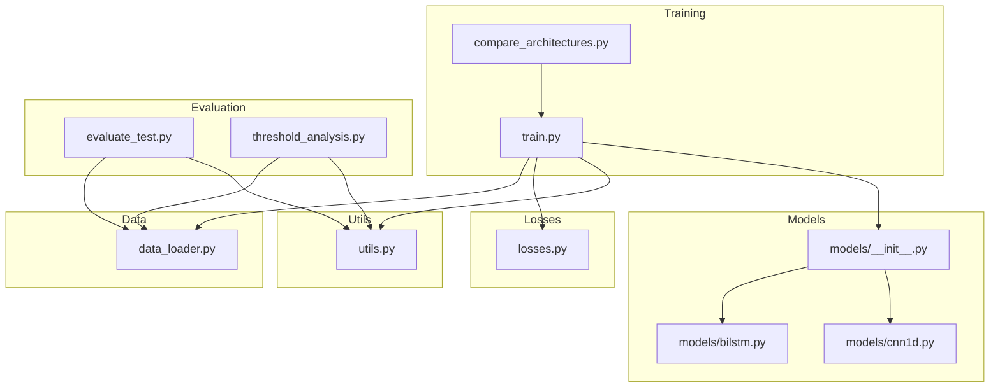
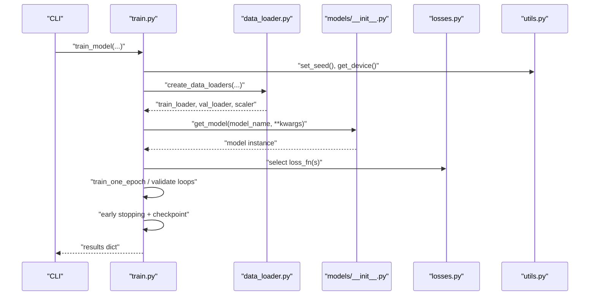
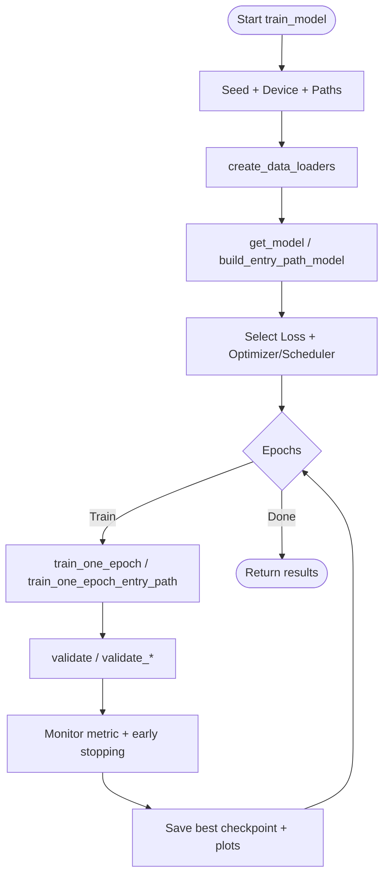
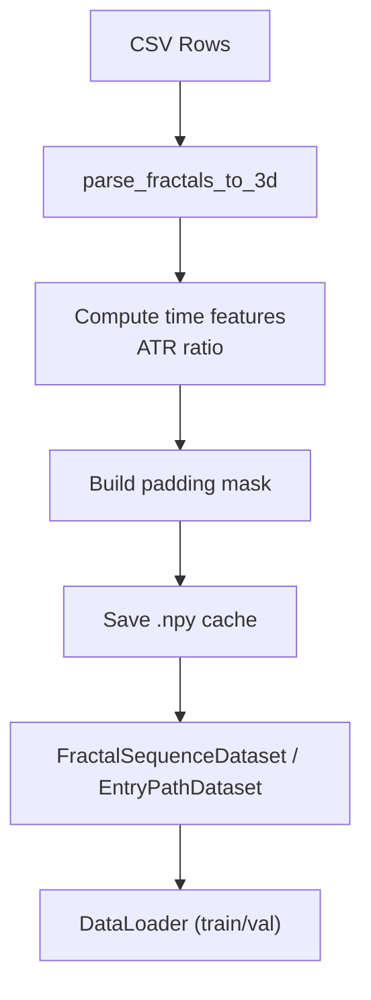
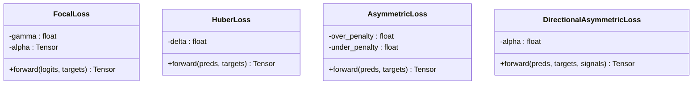
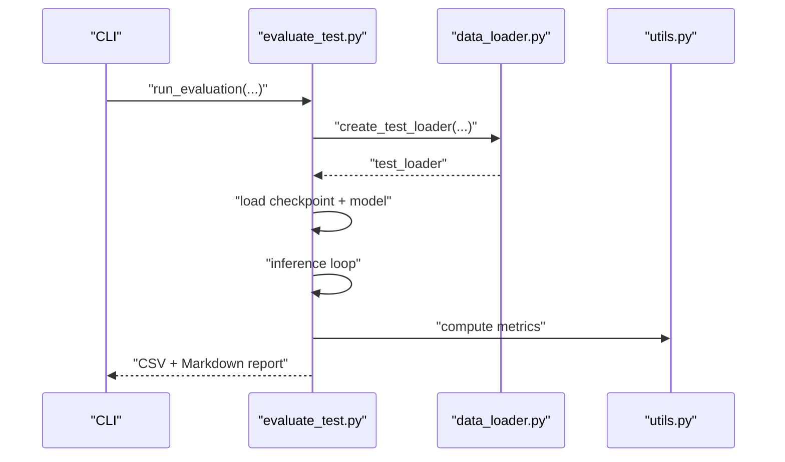
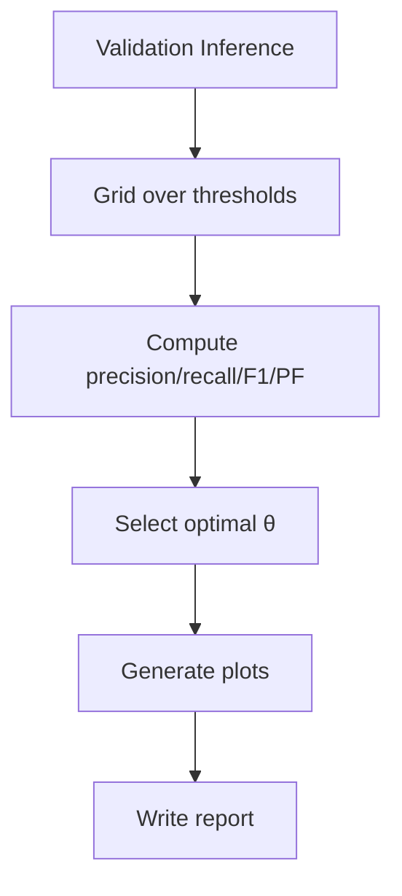
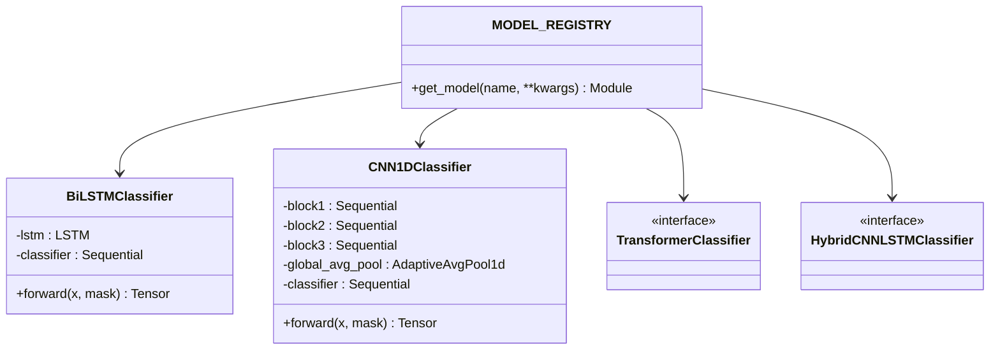
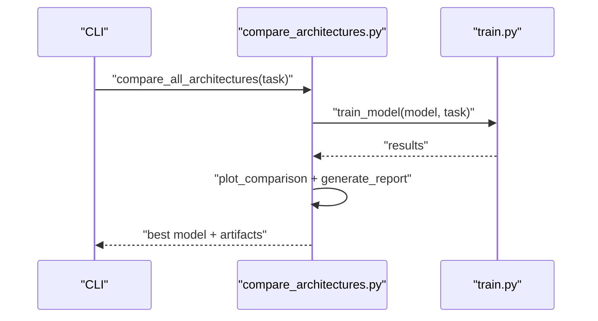
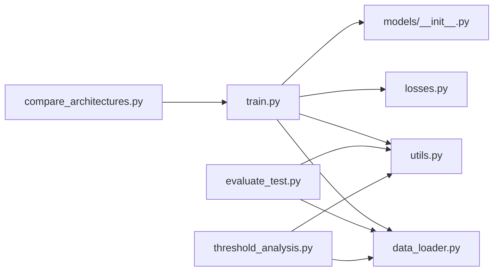

# Training and Evaluation

<cite>
**Referenced Files in This Document**
- [train.py](file://ML/train.py)
- [evaluate_test.py](file://ML/evaluate_test.py)
- [compare_architectures.py](file://ML/compare_architectures.py)
- [data_loader.py](file://ML/data_loader.py)
- [losses.py](file://ML/losses.py)
- [utils.py](file://ML/utils.py)
- [threshold_analysis.py](file://ML/threshold_analysis.py)
- [models/__init__.py](file://ML/models/__init__.py)
- [models/bilstm.py](file://ML/models/bilstm.py)
- [models/cnn1d.py](file://ML/models/cnn1d.py)
</cite>

## Table of Contents
1. [Introduction](#introduction)
2. [Project Structure](#project-structure)
3. [Core Components](#core-components)
4. [Architecture Overview](#architecture-overview)
5. [Detailed Component Analysis](#detailed-component-analysis)
6. [Dependency Analysis](#dependency-analysis)
7. [Performance Considerations](#performance-considerations)
8. [Troubleshooting Guide](#troubleshooting-guide)
9. [Conclusion](#conclusion)
10. [Appendices](#appendices)

## Introduction
This document explains the machine learning training and evaluation pipeline used for financial signal prediction and trading outcome modeling. It covers:
- Training orchestration with configurable tasks, losses, optimizers, and checkpoint management
- Out-of-sample evaluation procedures for multiple tasks and architectures
- Threshold analysis for converting regression outputs into actionable trading signals
- Efficient 3D tensor data loading and preprocessing
- Loss functions (Focal Loss, Huber Loss, Asymmetric Loss)
- Utility functions for reproducibility and metrics
- Practical guidance for hyperparameters, convergence, and overfitting prevention

## Project Structure
The ML pipeline centers around a unified training script, a dedicated evaluation script, a threshold analysis module, a data loader for 3D tensors, loss implementations, and shared utilities. Architectural comparisons are automated via a comparison script.

**Diagram sources**
- [train.py:1027-1200](file://ML/train.py#L1027-L1200)
- [compare_architectures.py:51-107](file://ML/compare_architectures.py#L51-L107)
- [evaluate_test.py:154-766](file://ML/evaluate_test.py#L154-L766)
- [threshold_analysis.py:747-800](file://ML/threshold_analysis.py#L747-L800)
- [data_loader.py:549-800](file://ML/data_loader.py#L549-L800)
- [models/__init__.py:31-49](file://ML/models/__init__.py#L31-L49)
- [losses.py:33-233](file://ML/losses.py#L33-L233)
- [utils.py:42-340](file://ML/utils.py#L42-L340)

**Section sources**
- [train.py:1027-1200](file://ML/train.py#L1027-L1200)
- [compare_architectures.py:51-107](file://ML/compare_architectures.py#L51-L107)
- [evaluate_test.py:154-766](file://ML/evaluate_test.py#L154-L766)
- [threshold_analysis.py:747-800](file://ML/threshold_analysis.py#L747-L800)
- [data_loader.py:549-800](file://ML/data_loader.py#L549-L800)
- [models/__init__.py:31-49](file://ML/models/__init__.py#L31-L49)
- [losses.py:33-233](file://ML/losses.py#L33-L233)
- [utils.py:42-340](file://ML/utils.py#L42-L340)

## Core Components
- Training orchestration: task routing, loss selection, optimizer/scheduler setup, early stopping, checkpoint saving, and plotting
- Data loading: CSV parsing to 3D tensors, time features, padding masks, caching, and task-specific targets
- Loss functions: Focal Loss (classification), Huber Loss (regression), Asymmetric Loss variants
- Evaluation: out-of-sample testing, performance metrics, and trading rule simulation
- Threshold analysis: grid search over decision thresholds and profit factor optimization
- Utilities: reproducibility, metrics computation, parameter counting, device detection

**Section sources**
- [train.py:176-240](file://ML/train.py#L176-L240)
- [data_loader.py:331-425](file://ML/data_loader.py#L331-L425)
- [losses.py:33-233](file://ML/losses.py#L33-L233)
- [evaluate_test.py:154-766](file://ML/evaluate_test.py#L154-L766)
- [threshold_analysis.py:138-213](file://ML/threshold_analysis.py#L138-L213)
- [utils.py:42-340](file://ML/utils.py#L42-L340)

## Architecture Overview
The training pipeline is task-driven and modular. It selects appropriate losses and metrics based on the task, builds models from a registry, and manages checkpoints and plots.

**Diagram sources**
- [train.py:1027-1200](file://ML/train.py#L1027-L1200)
- [data_loader.py:549-800](file://ML/data_loader.py#L549-L800)
- [models/__init__.py:31-49](file://ML/models/__init__.py#L31-L49)
- [losses.py:33-233](file://ML/losses.py#L33-L233)
- [utils.py:42-340](file://ML/utils.py#L42-L340)

## Detailed Component Analysis

### Training Orchestration (train.py)
Key responsibilities:
- Task routing: classification, regression, entry path, trailing stop, triple barrier
- Loss selection: Focal Loss for classification, Huber/Asymmetric for regression
- Optimizer and scheduler: AdamW with ReduceLROnPlateau
- Training/validation loops with gradient clipping and early stopping
- Checkpoint management: best model saving and artifacts
- Plotting: training curves, confusion matrices, regression plots

Implementation highlights:
- Training loop for single-output and multi-target regression
- Specialized entry path and quantile training/validation
- Early stopping based on task-specific metrics (macro F1, Pearson r, val_score)
- Gradient norm clipping to stabilize training

**Diagram sources**
- [train.py:1027-1200](file://ML/train.py#L1027-L1200)
- [train.py:176-240](file://ML/train.py#L176-L240)
- [train.py:242-294](file://ML/train.py#L242-L294)
- [train.py:296-365](file://ML/train.py#L296-L365)

**Section sources**
- [train.py:1027-1200](file://ML/train.py#L1027-L1200)
- [train.py:176-240](file://ML/train.py#L176-L240)
- [train.py:242-294](file://ML/train.py#L242-L294)
- [train.py:296-365](file://ML/train.py#L296-L365)

### Data Loader (data_loader.py)
Responsibilities:
- Parse fractal CSVs into 3D tensors (n_samples, 100, features)
- Compute time-based features (hour sine/cosine, time position)
- Normalize features with optional StandardScaler
- Build padding masks for Transformer sequences
- Cache parsed arrays to accelerate subsequent runs
- Support task-specific targets and entry path engineering

Processing logic:
- Vectorized parsing of 100 fractal columns per row
- ATR ratio normalization and log transform
- Mask creation for padded positions
- Optional filtering for outcome-only rows

**Diagram sources**
- [data_loader.py:331-425](file://ML/data_loader.py#L331-L425)
- [data_loader.py:473-545](file://ML/data_loader.py#L473-L545)
- [data_loader.py:549-800](file://ML/data_loader.py#L549-L800)

**Section sources**
- [data_loader.py:331-425](file://ML/data_loader.py#L331-L425)
- [data_loader.py:473-545](file://ML/data_loader.py#L473-L545)
- [data_loader.py:549-800](file://ML/data_loader.py#L549-L800)

### Loss Functions (losses.py)
- Focal Loss: mitigates class imbalance by focusing on hard examples
- Huber Loss: robust regression loss with quadratic near-zero, linear elsewhere
- Asymmetric Loss: penalizes over/under-prediction differently for regression
- Directional Asymmetric Loss: asymmetric penalties conditioned on signal direction

**Diagram sources**
- [losses.py:33-233](file://ML/losses.py#L33-L233)

**Section sources**
- [losses.py:33-233](file://ML/losses.py#L33-L233)

### Evaluation Procedures (evaluate_test.py)
Out-of-sample evaluation:
- Loads best checkpoint and rebuilds model
- Runs inference on test set
- Computes task-appropriate metrics
- Generates reports and CSV exports
- Supports entry path, quantile entry path, trailing stop, triple barrier, and outcome-aligned tasks

**Diagram sources**
- [evaluate_test.py:154-766](file://ML/evaluate_test.py#L154-L766)
- [data_loader.py:549-800](file://ML/data_loader.py#L549-L800)
- [utils.py:60-311](file://ML/utils.py#L60-L311)

**Section sources**
- [evaluate_test.py:154-766](file://ML/evaluate_test.py#L154-L766)
- [data_loader.py:549-800](file://ML/data_loader.py#L549-L800)
- [utils.py:60-311](file://ML/utils.py#L60-L311)

### Threshold Analysis (threshold_analysis.py)
Purpose:
- Convert regression outputs into trading signals by selecting decision thresholds
- Grid-search over thresholds and select optimal θ by precision/recall and profit factor
- Produce visualizations and a markdown report

Workflow:
- Inference on validation set
- Compute precision/recall/F1/profit factor across thresholds
- Plot curves and generate report

**Diagram sources**
- [threshold_analysis.py:80-109](file://ML/threshold_analysis.py#L80-L109)
- [threshold_analysis.py:138-213](file://ML/threshold_analysis.py#L138-L213)
- [threshold_analysis.py:424-468](file://ML/threshold_analysis.py#L424-L468)

**Section sources**
- [threshold_analysis.py:80-109](file://ML/threshold_analysis.py#L80-L109)
- [threshold_analysis.py:138-213](file://ML/threshold_analysis.py#L138-L213)
- [threshold_analysis.py:424-468](file://ML/threshold_analysis.py#L424-L468)

### Model Registry and Examples
- Registry maps model names to classes
- Example models: BiLSTM, 1D-CNN, Transformer, Hybrid
- Unified interface: forward(x, mask) → logits

**Diagram sources**
- [models/__init__.py:31-49](file://ML/models/__init__.py#L31-L49)
- [models/bilstm.py:30-113](file://ML/models/bilstm.py#L30-L113)
- [models/cnn1d.py:30-123](file://ML/models/cnn1d.py#L30-L123)

**Section sources**
- [models/__init__.py:31-49](file://ML/models/__init__.py#L31-L49)
- [models/bilstm.py:30-113](file://ML/models/bilstm.py#L30-L113)
- [models/cnn1d.py:30-123](file://ML/models/cnn1d.py#L30-L123)

### Architecture Comparison (compare_architectures.py)
Automates training across all models and generates:
- Best model selection
- Comparative plots
- Markdown reports

**Diagram sources**
- [compare_architectures.py:51-107](file://ML/compare_architectures.py#L51-L107)
- [train.py:1027-1200](file://ML/train.py#L1027-L1200)

**Section sources**
- [compare_architectures.py:51-107](file://ML/compare_architectures.py#L51-L107)
- [train.py:1027-1200](file://ML/train.py#L1027-L1200)

## Dependency Analysis
High-level dependencies:
- train.py depends on data_loader.py, losses.py, utils.py, and model registry
- evaluate_test.py depends on data_loader.py and utils.py
- threshold_analysis.py depends on data_loader.py and utils.py
- compare_architectures.py orchestrates train.py

**Diagram sources**
- [train.py:1027-1200](file://ML/train.py#L1027-L1200)
- [evaluate_test.py:154-766](file://ML/evaluate_test.py#L154-L766)
- [threshold_analysis.py:747-800](file://ML/threshold_analysis.py#L747-L800)
- [compare_architectures.py:51-107](file://ML/compare_architectures.py#L51-L107)

**Section sources**
- [train.py:1027-1200](file://ML/train.py#L1027-L1200)
- [evaluate_test.py:154-766](file://ML/evaluate_test.py#L154-L766)
- [threshold_analysis.py:747-800](file://ML/threshold_analysis.py#L747-L800)
- [compare_architectures.py:51-107](file://ML/compare_architectures.py#L51-L107)

## Performance Considerations
- Use GPU when available; the pipeline detects CUDA automatically
- Normalize features only when beneficial; StandardScaler is optional
- Prefer Huber Loss for regression to reduce sensitivity to outliers
- Apply gradient clipping to stabilize training
- Use early stopping with patience to prevent overfitting
- Reduce batch size if memory constrained
- Cache parsed datasets to speed up repeated experiments

[No sources needed since this section provides general guidance]

## Troubleshooting Guide
Common issues and remedies:
- Missing checkpoint: ensure the checkpoint exists or run training first
- Shape mismatches: verify task target column and sequence length
- Poor validation metrics: adjust loss weights, increase patience, or tune hyperparameters
- Overfitting: reduce model capacity, increase dropout, or apply stronger early stopping
- Device errors: confirm CUDA availability or fall back to CPU

**Section sources**
- [evaluate_test.py:180-182](file://ML/evaluate_test.py#L180-L182)
- [data_loader.py:153-159](file://ML/data_loader.py#L153-L159)
- [train.py:1190-1191](file://ML/train.py#L1190-L1191)

## Conclusion
The pipeline provides a robust, modular framework for training, evaluating, and deploying ML models for financial signal prediction. By combining efficient data loading, task-aware losses, and comprehensive evaluation/reporting, practitioners can iterate quickly while maintaining reproducibility and interpretability.

[No sources needed since this section summarizes without analyzing specific files]

## Appendices

### Training Configuration Examples
- Classification: Focal Loss, AdamW, macro F1 early stopping
- Regression: Huber Loss, AdamW, Pearson r early stopping
- Entry path: multi-task training with weighted losses
- Triple barrier: probability calibration and rule-based evaluation

Best practices:
- Fix seed for reproducibility
- Validate data parsing and feature shapes
- Monitor validation metrics and adjust patience
- Use gradient clipping and appropriate schedulers

**Section sources**
- [train.py:1027-1200](file://ML/train.py#L1027-L1200)
- [utils.py:42-58](file://ML/utils.py#L42-L58)
- [losses.py:33-233](file://ML/losses.py#L33-L233)