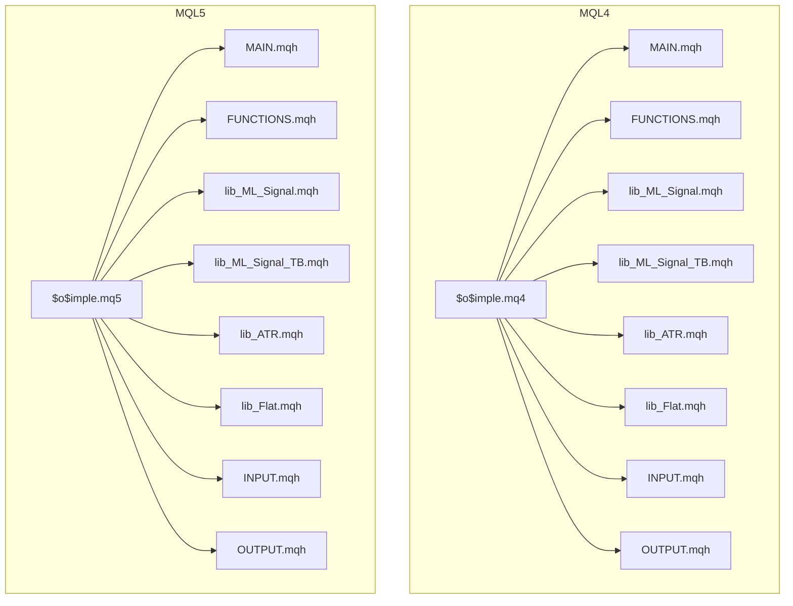
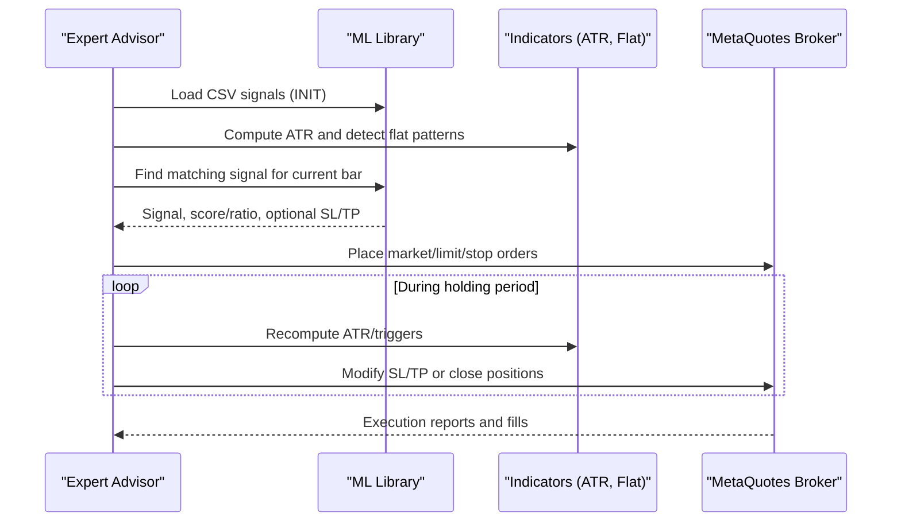
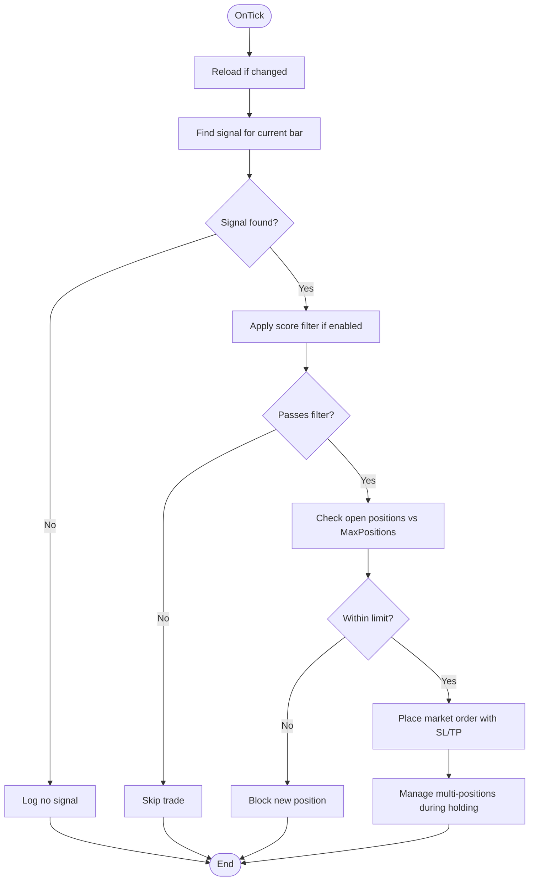
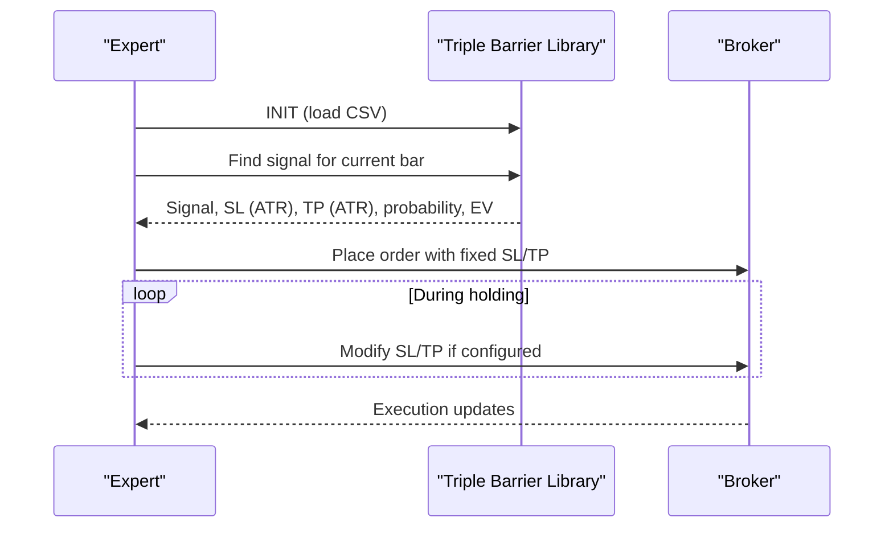
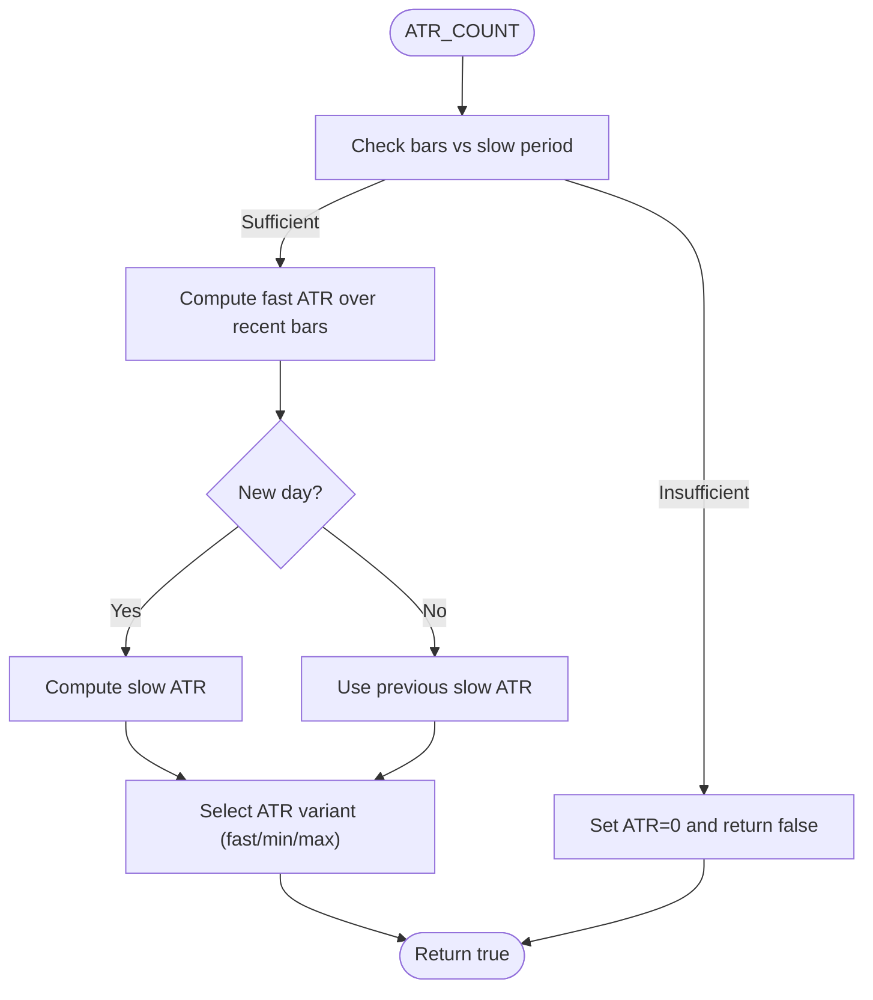
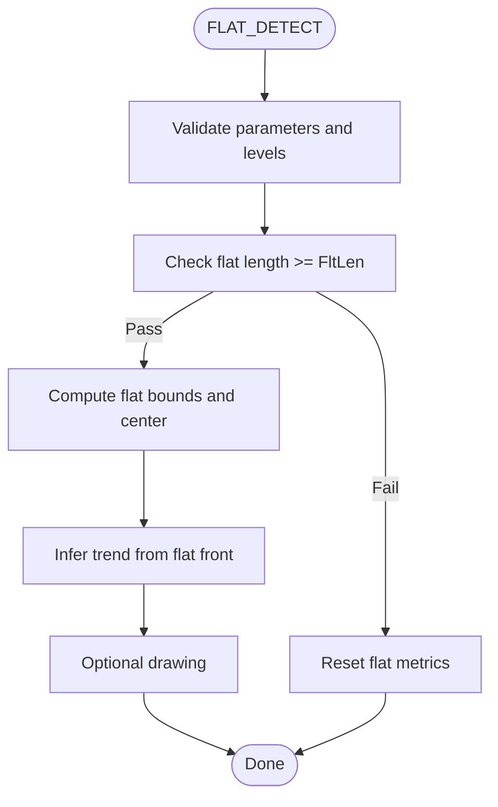
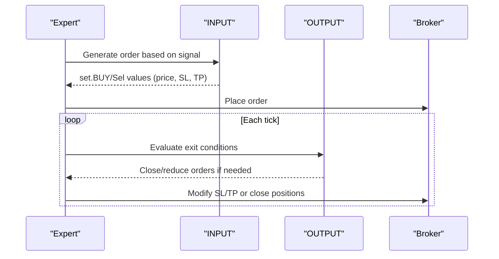
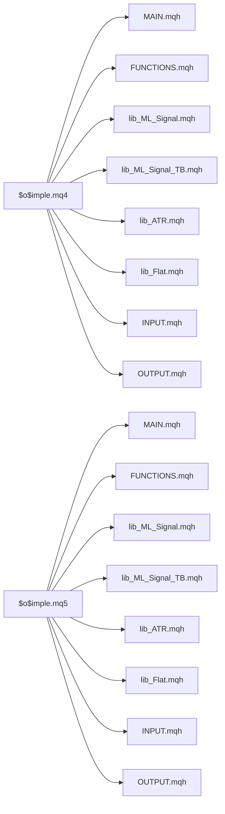

# Custom Libraries

<cite>
**Referenced Files in This Document**
- [$o$imple.mq4](file://MT/MQL4/Experts/$o$imple.mq4)
- [$o$imple.mq5](file://MT/MQL5/Experts/$o$imple.mq5)
- [lib_ML_Signal.mqh](file://MT/MQL4/Include/lib_ML_Signal.mqh)
- [lib_ML_Signal.mqh](file://MT/MQL5/Include/lib_ML_Signal.mqh)
- [lib_ML_Signal_TB.mqh](file://MT/MQL4/Include/lib_ML_Signal_TB.mqh)
- [lib_ML_Signal_TB.mqh](file://MT/MQL5/Include/lib_ML_Signal_TB.mqh)
- [lib_ATR.mqh](file://MT/MQL4/Include/lib_ATR.mqh)
- [lib_ATR.mqh](file://MT/MQL5/Include/lib_ATR.mqh)
- [lib_Flat.mqh](file://MT/MQL4/Include/lib_Flat.mqh)
- [lib_Flat.mqh](file://MT/MQL5/Include/lib_Flat.mqh)
- [FUNCTIONS.mqh](file://MT/MQL4/Include/FUNCTIONS.mqh)
- [FUNCTIONS.mqh](file://MT/MQL5/Include/FUNCTIONS.mqh)
- [MAIN.mqh](file://MT/MQL4/Include/MAIN.mqh)
- [MAIN.mqh](file://MT/MQL5/Include/MAIN.mqh)
- [INPUT.mqh](file://MT/MQL4/Include/INPUT.mqh)
- [INPUT.mqh](file://MT/MQL5/Include/INPUT.mqh)
- [OUTPUT.mqh](file://MT/MQL4/Include/OUTPUT.mqh)
- [OUTPUT.mqh](file://MT/MQL5/Include/OUTPUT.mqh)
</cite>

## Table of Contents
1. [Introduction](#introduction)
2. [Project Structure](#project-structure)
3. [Core Components](#core-components)
4. [Architecture Overview](#architecture-overview)
5. [Detailed Component Analysis](#detailed-component-analysis)
6. [Dependency Analysis](#dependency-analysis)
7. [Performance Considerations](#performance-considerations)
8. [Troubleshooting Guide](#troubleshooting-guide)
9. [Conclusion](#conclusion)

## Introduction
This document describes the custom library functions used in the SoSimple MetaTrader integration. It focuses on three primary areas:
- ML signal processing libraries for direct CSV-driven execution and Triple Barrier signals
- Technical indicator utilities for ATR computation and flat pattern detection
- Trading management components for order lifecycle, trailing stops, and position controls

The documentation explains the library architecture, function signatures, parameter requirements, return value specifications, signal interpretation algorithms, data validation procedures, error handling mechanisms, and practical usage patterns. It also covers memory management considerations, performance implications, and compatibility across MQL4 and MQL5 environments.

## Project Structure
The SoSimple integration is organized around two MetaTrader versions (MQL4 and MQL5), each with:
- An expert advisor ($o$imple.mq4/.mq5) that orchestrates the trading logic
- A shared library of reusable components under Include/
- Version-specific indicators and utilities

Key library modules:
- ML Signal Libraries: lib_ML_Signal.mqh (direct CSV execution), lib_ML_Signal_TB.mqh (Triple Barrier fixed SL/TP)
- Technical Indicators: lib_ATR.mqh (ATR computation), lib_Flat.mqh (flat pattern detection)
- Core Utilities: FUNCTIONS.mqh (common helpers), MAIN.mqh (expert orchestration), INPUT.mqh/OUTPUT.mqh (order lifecycle)

**Diagram sources**
- [$o$imple.mq4:123-149](file://MT/MQL4/Experts/$o$imple.mq4#L123-L149)
- [$o$imple.mq5:137-147](file://MT/MQL5/Experts/$o$imple.mq5#L137-L147)
- [lib_ML_Signal.mqh:1-951](file://MT/MQL4/Include/lib_ML_Signal.mqh#L1-L951)
- [lib_ML_Signal.mqh:1-325](file://MT/MQL5/Include/lib_ML_Signal.mqh#L1-L325)
- [lib_ML_Signal_TB.mqh:1-215](file://MT/MQL4/Include/lib_ML_Signal_TB.mqh#L1-L215)
- [lib_ML_Signal_TB.mqh:1-215](file://MT/MQL5/Include/lib_ML_Signal_TB.mqh#L1-L215)
- [lib_ATR.mqh:1-56](file://MT/MQL4/Include/lib_ATR.mqh#L1-L56)
- [lib_ATR.mqh:1-55](file://MT/MQL5/Include/lib_ATR.mqh#L1-L55)
- [lib_Flat.mqh:1-155](file://MT/MQL4/Include/lib_Flat.mqh#L1-L155)
- [lib_Flat.mqh:1-156](file://MT/MQL5/Include/lib_Flat.mqh#L1-L156)
- [FUNCTIONS.mqh:1-320](file://MT/MQL4/Include/FUNCTIONS.mqh#L1-L320)
- [FUNCTIONS.mqh:1-280](file://MT/MQL5/Include/FUNCTIONS.mqh#L1-L280)
- [MAIN.mqh:1-213](file://MT/MQL4/Include/MAIN.mqh#L1-L213)
- [MAIN.mqh:1-202](file://MT/MQL5/Include/MAIN.mqh#L1-L202)
- [INPUT.mqh:1-251](file://MT/MQL4/Include/INPUT.mqh#L1-L251)
- [INPUT.mqh:1-252](file://MT/MQL5/Include/INPUT.mqh#L1-L252)
- [OUTPUT.mqh:1-328](file://MT/MQL4/Include/OUTPUT.mqh#L1-L328)
- [OUTPUT.mqh:1-302](file://MT/MQL5/Include/OUTPUT.mqh#L1-L302)

**Section sources**
- [$o$imple.mq4:1-149](file://MT/MQL4/Experts/$o$imple.mq4#L1-L149)
- [$o$imple.mq5:1-157](file://MT/MQL5/Experts/$o$imple.mq5#L1-L157)

## Core Components

### ML Signal Processing Libraries
Two ML signal libraries enable direct CSV-driven trading:
- lib_ML_Signal.mqh (MQL4): Executes precomputed regression_updn signals with optional score filtering, multi-position support, and parity-check exit modes (timeout vs trailing stop).
- lib_ML_Signal.mqh (MQL5): Executes precomputed regression_updn signals with adaptive SL/TP based on predicted direction strength (ratio).
- lib_ML_Signal_TB.mqh (MQL4/5): Executes Triple Barrier signals with fixed SL/TP in ATR units.

Key capabilities:
- CSV loading with binary search lookup by bar time
- Signal validation and filtering (score threshold, trend filters, ratio thresholds)
- Dynamic order sizing and risk controls
- Exit strategies: timeout holding, trailing stops, reverse signal exits

**Section sources**
- [lib_ML_Signal.mqh:1-951](file://MT/MQL4/Include/lib_ML_Signal.mqh#L1-L951)
- [lib_ML_Signal.mqh:1-325](file://MT/MQL5/Include/lib_ML_Signal.mqh#L1-L325)
- [lib_ML_Signal_TB.mqh:1-215](file://MT/MQL4/Include/lib_ML_Signal_TB.mqh#L1-L215)
- [lib_ML_Signal_TB.mqh:1-215](file://MT/MQL5/Include/lib_ML_Signal_TB.mqh#L1-L215)

### Technical Indicator Utilities
- lib_ATR.mqh: Computes fast/slow ATR and selects appropriate ATR variant for stops. Includes safeguards against insufficient history and daily recalculation cadence.
- lib_Flat.mqh: Detects flat phases and false breakouts, supporting visual drawing and trend inference from flat boundaries.

Key capabilities:
- Robust ATR calculation with boundary checks
- Flat pattern detection with configurable length and bounce criteria
- False breakout confirmation logic with base level validation

**Section sources**
- [lib_ATR.mqh:1-56](file://MT/MQL4/Include/lib_ATR.mqh#L1-L56)
- [lib_ATR.mqh:1-55](file://MT/MQL5/Include/lib_ATR.mqh#L1-L55)
- [lib_Flat.mqh:1-155](file://MT/MQL4/Include/lib_Flat.mqh#L1-L155)
- [lib_Flat.mqh:1-156](file://MT/MQL5/Include/lib_Flat.mqh#L1-L156)

### Trading Management Components
- Functions.mqh: Provides common helpers (LOWEST/HIGHEST over ranges, MIN/MAX templates, swap, array operations, time utilities).
- MAIN.mqh: Orchestrates expert lifecycle, signal routing, and integration of ML libraries.
- INPUT.mqh: Generates orders based on signals and parameters (SL/TP deltas, trend filters).
- OUTPUT.mqh: Manages exits via impulse checks, trend changes, targets, and trailing stops.

Key capabilities:
- Centralized expert initialization and parameter synchronization
- Flexible order generation with dynamic SL/TP computation
- Comprehensive exit logic including ML-specific trailing stops

**Section sources**
- [FUNCTIONS.mqh:1-320](file://MT/MQL4/Include/FUNCTIONS.mqh#L1-L320)
- [FUNCTIONS.mqh:1-280](file://MT/MQL5/Include/FUNCTIONS.mqh#L1-L280)
- [MAIN.mqh:1-213](file://MT/MQL4/Include/MAIN.mqh#L1-L213)
- [MAIN.mqh:1-202](file://MT/MQL5/Include/MAIN.mqh#L1-L202)
- [INPUT.mqh:1-251](file://MT/MQL4/Include/INPUT.mqh#L1-L251)
- [INPUT.mqh:1-252](file://MT/MQL5/Include/INPUT.mqh#L1-L252)
- [OUTPUT.mqh:1-328](file://MT/MQL4/Include/OUTPUT.mqh#L1-L328)
- [OUTPUT.mqh:1-302](file://MT/MQL5/Include/OUTPUT.mqh#L1-L302)

## Architecture Overview
The SoSimple architecture integrates ML-driven signals with robust technical indicators and disciplined order management. The expert advisor coordinates:
- Signal ingestion from CSV via ML libraries
- Indicator computations (ATR, flat patterns)
- Order lifecycle management (entry, modification, exit)
- Risk controls and trailing stops

**Diagram sources**
- [lib_ML_Signal.mqh:457-551](file://MT/MQL4/Include/lib_ML_Signal.mqh#L457-L551)
- [lib_ML_Signal.mqh:55-131](file://MT/MQL5/Include/lib_ML_Signal.mqh#L55-L131)
- [lib_ML_Signal_TB.mqh:46-99](file://MT/MQL4/Include/lib_ML_Signal_TB.mqh#L46-L99)
- [lib_ML_Signal_TB.mqh:46-99](file://MT/MQL5/Include/lib_ML_Signal_TB.mqh#L46-L99)
- [lib_ATR.mqh:2-47](file://MT/MQL4/Include/lib_ATR.mqh#L2-L47)
- [lib_ATR.mqh:2-47](file://MT/MQL5/Include/lib_ATR.mqh#L2-L47)
- [INPUT.mqh:3-54](file://MT/MQL4/Include/INPUT.mqh#L3-L54)
- [INPUT.mqh:3-54](file://MT/MQL5/Include/INPUT.mqh#L3-L54)
- [OUTPUT.mqh:6-62](file://MT/MQL4/Include/OUTPUT.mqh#L6-L62)
- [OUTPUT.mqh:6-62](file://MT/MQL5/Include/OUTPUT.mqh#L6-L62)

## Detailed Component Analysis

### ML Signal Library (Direct CSV Execution)
This library reads precomputed signals from ml_signals.csv and executes trades accordingly. It supports:
- Binary search lookup by bar time
- Score-based filtering (optional)
- Multi-position support with exit modes (timeout or trailing stop)
- Parity-check mode with broker reconciliation logging

**Diagram sources**
- [lib_ML_Signal.mqh:553-601](file://MT/MQL4/Include/lib_ML_Signal.mqh#L553-L601)
- [lib_ML_Signal.mqh:603-753](file://MT/MQL4/Include/lib_ML_Signal.mqh#L603-L753)
- [lib_ML_Signal.mqh:269-304](file://MT/MQL4/Include/lib_ML_Signal.mqh#L269-L304)

**Section sources**
- [lib_ML_Signal.mqh:1-951](file://MT/MQL4/Include/lib_ML_Signal.mqh#L1-L951)

### ML Signal Library (Triple Barrier)
This library reads ml_signals_tb.csv containing fixed SL/TP in ATR units and applies them directly:
- CSV parsing with header validation
- Ratio-based trend filtering
- Fixed SL/TP application per signal direction

**Diagram sources**
- [lib_ML_Signal_TB.mqh:46-99](file://MT/MQL4/Include/lib_ML_Signal_TB.mqh#L46-L99)
- [lib_ML_Signal_TB.mqh:46-99](file://MT/MQL5/Include/lib_ML_Signal_TB.mqh#L46-L99)

**Section sources**
- [lib_ML_Signal_TB.mqh:1-215](file://MT/MQL4/Include/lib_ML_Signal_TB.mqh#L1-L215)
- [lib_ML_Signal_TB.mqh:1-215](file://MT/MQL5/Include/lib_ML_Signal_TB.mqh#L1-L215)

### ATR Computation Utility
Robust ATR calculation with:
- Daily recalculation cadence for slow ATR
- Boundary checks to avoid invalid periods
- Selection of ATR variant for stop placement

**Diagram sources**
- [lib_ATR.mqh:2-47](file://MT/MQL4/Include/lib_ATR.mqh#L2-L47)
- [lib_ATR.mqh:2-47](file://MT/MQL5/Include/lib_ATR.mqh#L2-L47)

**Section sources**
- [lib_ATR.mqh:1-56](file://MT/MQL4/Include/lib_ATR.mqh#L1-L56)
- [lib_ATR.mqh:1-55](file://MT/MQL5/Include/lib_ATR.mqh#L1-L55)

### Flat Pattern Detection
Supports:
- Flat phase identification with configurable length
- False breakout confirmation with base level validation
- Visual drawing aids for debugging

**Diagram sources**
- [lib_Flat.mqh:2-42](file://MT/MQL4/Include/lib_Flat.mqh#L2-L42)
- [lib_Flat.mqh:2-42](file://MT/MQL5/Include/lib_Flat.mqh#L2-L42)

**Section sources**
- [lib_Flat.mqh:1-155](file://MT/MQL4/Include/lib_Flat.mqh#L1-L155)
- [lib_Flat.mqh:1-156](file://MT/MQL5/Include/lib_Flat.mqh#L1-L156)

### Order Lifecycle Management
The INPUT and OUTPUT modules coordinate order creation and closure:
- INPUT generates orders based on signals and parameters
- OUTPUT manages exits via impulse checks, trend changes, targets, and trailing stops
- Both versions maintain consistent APIs across MQL4 and MQL5

**Diagram sources**
- [INPUT.mqh:3-54](file://MT/MQL4/Include/INPUT.mqh#L3-L54)
- [INPUT.mqh:3-54](file://MT/MQL5/Include/INPUT.mqh#L3-L54)
- [OUTPUT.mqh:6-62](file://MT/MQL4/Include/OUTPUT.mqh#L6-L62)
- [OUTPUT.mqh:6-62](file://MT/MQL5/Include/OUTPUT.mqh#L6-L62)

**Section sources**
- [INPUT.mqh:1-251](file://MT/MQL4/Include/INPUT.mqh#L1-L251)
- [INPUT.mqh:1-252](file://MT/MQL5/Include/INPUT.mqh#L1-L252)
- [OUTPUT.mqh:1-328](file://MT/MQL4/Include/OUTPUT.mqh#L1-L328)
- [OUTPUT.mqh:1-302](file://MT/MQL5/Include/OUTPUT.mqh#L1-L302)

## Dependency Analysis
The expert advisors depend on shared libraries. The dependency graph shows how MQL4 and MQL5 experts include identical library interfaces.

**Diagram sources**
- [$o$imple.mq4:100-122](file://MT/MQL4/Experts/$o$imple.mq4#L100-L122)
- [$o$imple.mq5:114-136](file://MT/MQL5/Experts/$o$imple.mq5#L114-L136)
- [MAIN.mqh:114-116](file://MT/MQL4/Include/MAIN.mqh#L114-L116)
- [MAIN.mqh:124-125](file://MT/MQL5/Include/MAIN.mqh#L124-L125)

**Section sources**
- [$o$imple.mq4:1-149](file://MT/MQL4/Experts/$o$imple.mq4#L1-L149)
- [$o$imple.mq5:1-157](file://MT/MQL5/Experts/$o$imple.mq5#L1-L157)

## Performance Considerations
- CSV loading and binary search: Efficient O(log N) lookup by bar time; initial load allocates arrays up to maximum capacity.
- ATR computation: Uses rolling sums over configured periods; daily recalculation reduces overhead.
- Memory management: Arrays resized to actual signal counts post-load; minimal allocations during runtime.
- Risk controls: Lot sizing normalized to digits; risk checks applied before order submission.
- Compatibility: MQL4 and MQL5 share identical library interfaces, enabling cross-version portability with minimal changes.

[No sources needed since this section provides general guidance]

## Troubleshooting Guide
Common issues and resolutions:
- CSV not found or wrong header: Initialization prints error and returns false; verify file path and header format.
- No signals loaded: Check signal file modification time and ensure it contains data for the current testing range.
- Insufficient history for ATR: ATR computation returns false when bars < slow period; adjust parameters or extend history.
- Order placement failures: Library retries with error checking; inspect broker logs and spreads.
- False breakout false positives: Adjust flat length and bounce thresholds; enable drawing for verification.
- ML trailing stop not activating: Verify ML_Trl_Start_ATR and ML_Trl_Step_ATR parameters; ensure positions are market type.

**Section sources**
- [lib_ML_Signal.mqh:457-551](file://MT/MQL4/Include/lib_ML_Signal.mqh#L457-L551)
- [lib_ML_Signal.mqh:55-131](file://MT/MQL5/Include/lib_ML_Signal.mqh#L55-L131)
- [lib_ATR.mqh:18-21](file://MT/MQL4/Include/lib_ATR.mqh#L18-L21)
- [lib_ATR.mqh:18-21](file://MT/MQL5/Include/lib_ATR.mqh#L18-L21)
- [lib_Flat.mqh:48-145](file://MT/MQL4/Include/lib_Flat.mqh#L48-L145)
- [lib_Flat.mqh:48-145](file://MT/MQL5/Include/lib_Flat.mqh#L48-L145)

## Conclusion
The SoSimple custom libraries provide a robust foundation for ML-driven trading in MetaTrader:
- ML libraries offer flexible signal execution with strong validation and exit controls
- Technical indicators deliver reliable ATR and flat pattern detection
- Order lifecycle management ensures disciplined entry, modification, and exit
- Cross-version compatibility enables seamless deployment on MQL4 and MQL5

Adopting the recommended integration patterns, parameter tuning, and troubleshooting steps will help achieve consistent performance and reliability across different market conditions and MetaTrader versions.