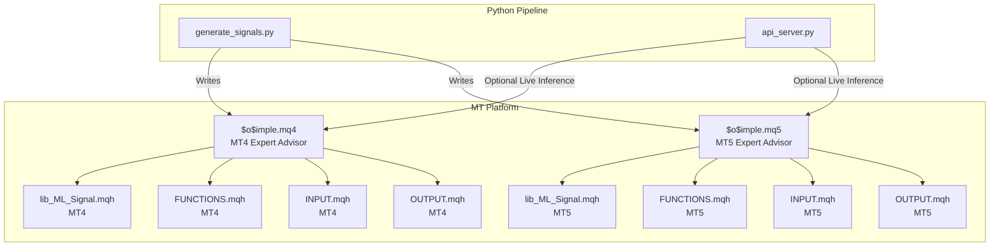
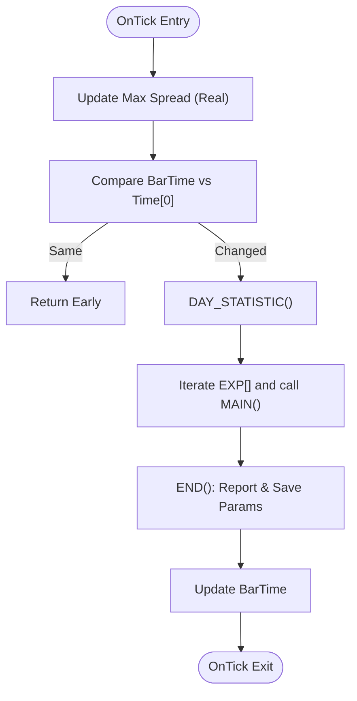
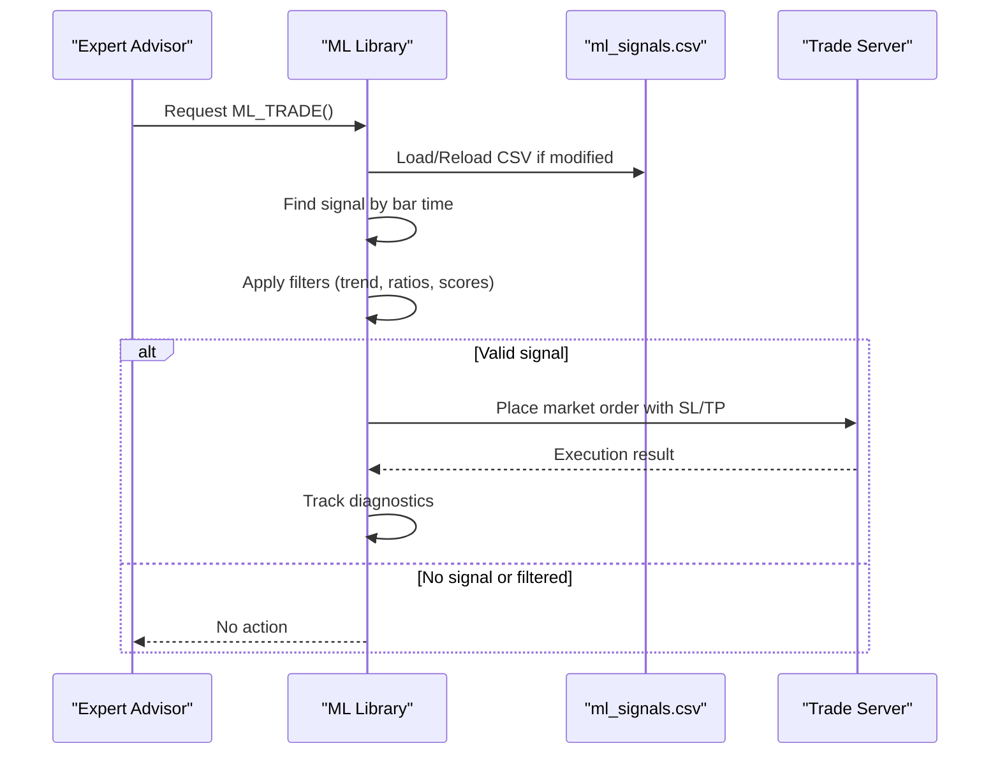
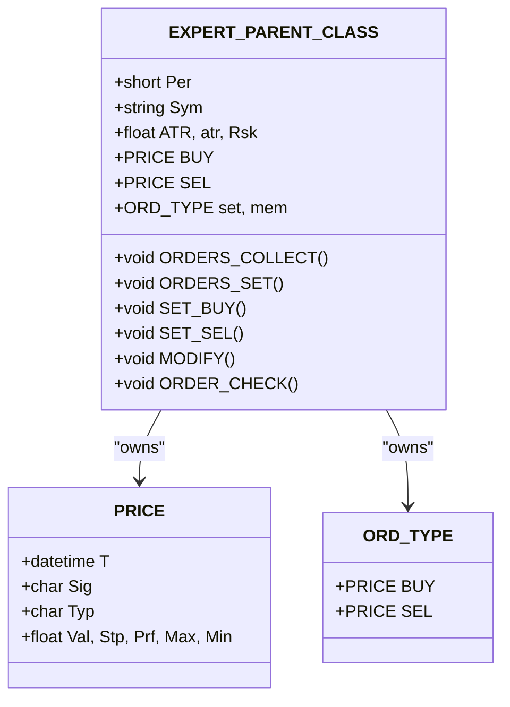
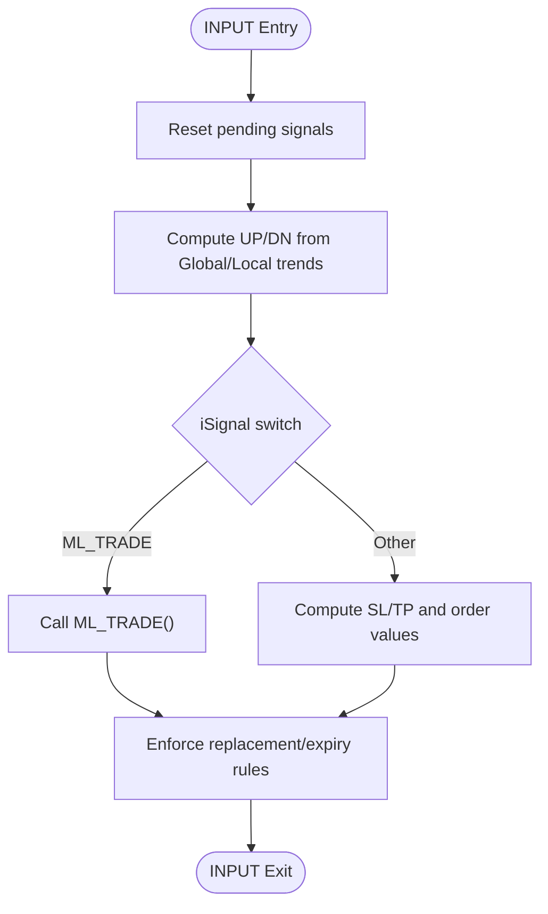
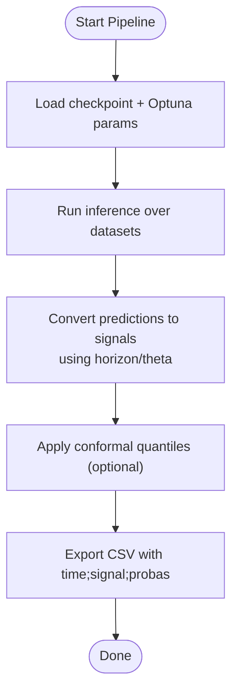
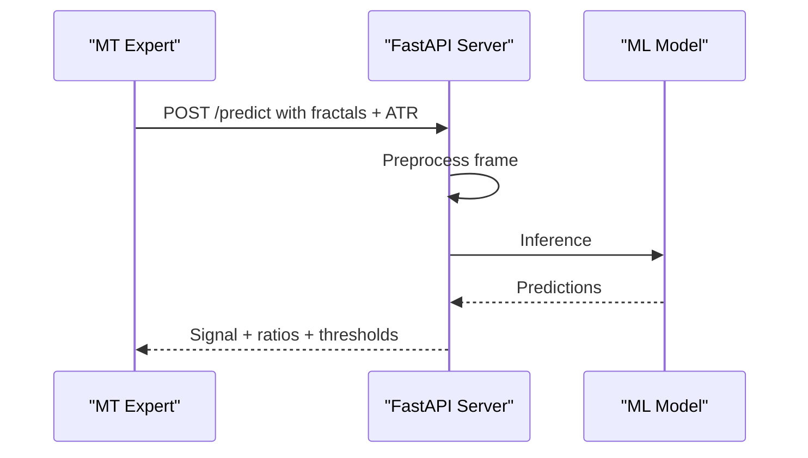
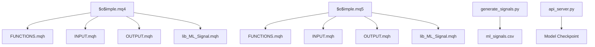

# MetaTrader Integration

<cite>
**Referenced Files in This Document**
- [$o$imple.mq4](file://MT/MQL4/Experts/$o$imple.mq4)
- [$o$imple.mq5](file://MT/MQL5/Experts/$o$imple.mq5)
- [lib_ML_Signal.mqh (MQL4)](file://MT/MQL4/Include/lib_ML_Signal.mqh)
- [lib_ML_Signal.mqh (MQL5)](file://MT/MQL5/Include/lib_ML_Signal.mqh)
- [FUNCTIONS.mqh (MQL4)](file://MT/MQL4/Include/FUNCTIONS.mqh)
- [FUNCTIONS.mqh (MQL5)](file://MT/MQL5/Include/FUNCTIONS.mqh)
- [INPUT.mqh (MQL4)](file://MT/MQL4/Include/INPUT.mqh)
- [INPUT.mqh (MQL5)](file://MT/MQL5/Include/INPUT.mqh)
- [OUTPUT.mqh (MQL4)](file://MT/MQL4/Include/OUTPUT.mqh)
- [OUTPUT.mqh (MQL5)](file://MT/MQL5/Include/OUTPUT.mqh)
- [generate_signals.py](file://API/generate_signals.py)
- [api_server.py](file://API/api_server.py)
- [opt.set](file://MT/tester/opt.set)
- [lastparameters.ini](file://MT/tester/lastparameters.ini)
</cite>

## Table of Contents
1. [Introduction](#introduction)
2. [Project Structure](#project-structure)
3. [Core Components](#core-components)
4. [Architecture Overview](#architecture-overview)
5. [Detailed Component Analysis](#detailed-component-analysis)
6. [Dependency Analysis](#dependency-analysis)
7. [Performance Considerations](#performance-considerations)
8. [Troubleshooting Guide](#troubleshooting-guide)
9. [Conclusion](#conclusion)

## Introduction
This document explains the SoSimple MetaTrader integration across MT4 and MT5 platforms. It covers the expert advisor implementation, the ML signal processing pipeline from CSV generation to order execution, custom library functions for ML integration, technical indicators, and trading logic. It also documents tester configuration files, optimization parameters, platform-specific considerations, performance optimization strategies, and troubleshooting guidance.

## Project Structure
The integration spans three primary areas:
- MetaQuotes Language (MQL) expert advisors and libraries for MT4 and MT5
- Python-based API server and signal generation pipeline
- Strategy Tester configuration files for optimization and backtesting



**Diagram sources**
- [$o$imple.mq4](file://MT/MQL4/Experts/$o$imple.mq4)
- [$o$imple.mq5](file://MT/MQL5/Experts/$o$imple.mq5)
- [lib_ML_Signal.mqh (MQL4)](file://MT/MQL4/Include/lib_ML_Signal.mqh)
- [lib_ML_Signal.mqh (MQL5)](file://MT/MQL5/Include/lib_ML_Signal.mqh)
- [FUNCTIONS.mqh (MQL4)](file://MT/MQL4/Include/FUNCTIONS.mqh)
- [FUNCTIONS.mqh (MQL5)](file://MT/MQL5/Include/FUNCTIONS.mqh)
- [INPUT.mqh (MQL4)](file://MT/MQL4/Include/INPUT.mqh)
- [INPUT.mqh (MQL5)](file://MT/MQL5/Include/INPUT.mqh)
- [OUTPUT.mqh (MQL4)](file://MT/MQL4/Include/OUTPUT.mqh)
- [OUTPUT.mqh (MQL5)](file://MT/MQL5/Include/OUTPUT.mqh)
- [generate_signals.py](file://API/generate_signals.py)
- [api_server.py](file://API/api_server.py)

**Section sources**
- [$o$imple.mq4](file://MT/MQL4/Experts/$o$imple.mq4)
- [$o$imple.mq5](file://MT/MQL5/Experts/$o$imple.mq5)

## Core Components
- Expert Advisors (MT4 and MT5): Orchestrates signal ingestion, position sizing, order placement, and exits.
- ML Signal Library: Reads precomputed CSV signals and executes trades accordingly.
- Core Functions Library: Provides shared primitives for orders, arrays, and utilities.
- Input/Output Modules: Define how signals are interpreted and how positions are managed.
- Signal Generation Pipeline: Produces CSV files consumed by the expert advisors.
- API Server: Optional real-time inference service for live trading scenarios.

Key responsibilities:
- MT4/MT5 expert advisors initialize parameters, load libraries, and iterate through bars.
- ML signal library loads CSV, matches bar timestamps, applies filters, and manages exits.
- Core functions provide order lifecycle management and utilities.
- Signal generation pipeline produces CSV with time-stamped predictions for Strategy Tester.

**Section sources**
- [lib_ML_Signal.mqh (MQL4)](file://MT/MQL4/Include/lib_ML_Signal.mqh)
- [lib_ML_Signal.mqh (MQL5)](file://MT/MQL5/Include/lib_ML_Signal.mqh)
- [FUNCTIONS.mqh (MQL4)](file://MT/MQL4/Include/FUNCTIONS.mqh)
- [FUNCTIONS.mqh (MQL5)](file://MT/MQL5/Include/FUNCTIONS.mqh)
- [INPUT.mqh (MQL4)](file://MT/MQL4/Include/INPUT.mqh)
- [INPUT.mqh (MQL5)](file://MT/MQL5/Include/INPUT.mqh)
- [OUTPUT.mqh (MQL4)](file://MT/MQL4/Include/OUTPUT.mqh)
- [OUTPUT.mqh (MQL5)](file://MT/MQL5/Include/OUTPUT.mqh)
- [generate_signals.py](file://API/generate_signals.py)
- [api_server.py](file://API/api_server.py)

## Architecture Overview
The SoSimple trading system integrates two distinct pipelines:
- Strategy Tester Pipeline: CSV-driven signals processed by the expert advisor.
- Optional Live Pipeline: Real-time inference via API server feeding signals to the expert advisor.

```mermaid
sequenceDiagram
participant GEN as "Signal Generator<br/>generate_signals.py"
participant FS as "File System<br/>ml_signals.csv"
participant EA as "Expert Advisor<br/>$o$imple.mq4/.mq5"
participant ML as "ML Signal Library<br/>lib_ML_Signal.mqh"
participant T as "Trade Server"
GEN->>FS : Write CSV with time;signal;probas
EA->>ML : Load CSV, match bar time
ML->>EA : Signal + filters + thresholds
EA->>T : Place market orders with SL/TP
T-->>EA : Execution reports
EA->>ML : Manage exits (timeout/trailing)
```

**Diagram sources**
- [generate_signals.py](file://API/generate_signals.py)
- [lib_ML_Signal.mqh (MQL4)](file://MT/MQL4/Include/lib_ML_Signal.mqh)
- [lib_ML_Signal.mqh (MQL5)](file://MT/MQL5/Include/lib_ML_Signal.mqh)
- [$o$imple.mq4](file://MT/MQL4/Experts/$o$imple.mq4)
- [$o$imple.mq5](file://MT/MQL5/Experts/$o$imple.mq5)

## Detailed Component Analysis

### Expert Advisor Implementation (MT4 and MT5)
Both MT4 and MT5 experts share a similar structure:
- Parameter declarations and synchronization
- Initialization of core variables and risk controls
- OnTick loop: day statistics, expert iteration, and end-of-bar reporting
- Recount/history initialization for historical replay

Key differences:
- MT5 includes explicit input synchronization and MQL4Compat support.
- MT5 refreshes price arrays before processing.



**Diagram sources**
- [$o$imple.mq4](file://MT/MQL4/Experts/$o$imple.mq4)
- [$o$imple.mq5](file://MT/MQL5/Experts/$o$imple.mq5)

**Section sources**
- [$o$imple.mq4](file://MT/MQL4/Experts/$o$imple.mq4)
- [$o$imple.mq5](file://MT/MQL5/Experts/$o$imple.mq5)

### ML Signal Library (MT4 and MT5)
The ML signal library handles:
- CSV loading with dynamic headers and optional score column
- Binary search for matching bar timestamps
- Signal filtering and scoring thresholds
- Position sizing and order placement with risk checks
- Exit management via timeout or trailing stops
- Broker-closed order reconciliation

MT4 library specifics:
- Supports telemetry-style parity-check mode with configurable exit modes and position limits.
- Tracks detailed diagnostics for broker reasons and holds.

MT5 library specifics:
- Reads precomputed signals with directional probability columns.
- Applies trend filters, ratio thresholds, and adaptive SL/TP computation.



**Diagram sources**
- [lib_ML_Signal.mqh (MQL4)](file://MT/MQL4/Include/lib_ML_Signal.mqh)
- [lib_ML_Signal.mqh (MQL5)](file://MT/MQL5/Include/lib_ML_Signal.mqh)

**Section sources**
- [lib_ML_Signal.mqh (MQL4)](file://MT/MQL4/Include/lib_ML_Signal.mqh)
- [lib_ML_Signal.mqh (MQL5)](file://MT/MQL5/Include/lib_ML_Signal.mqh)

### Core Functions Library (MT4 and MT5)
Provides:
- Price utilities (lowest/highest over ranges)
- Template-based helpers (min/max/sort/swaps)
- Order lifecycle primitives (OPEN_BUY/OPEN_SELL, CLOSE_BUY/CLOSE_SELL)
- Pattern and signal conversion helpers
- Shared class hierarchy for expert instances



**Diagram sources**
- [FUNCTIONS.mqh (MQL4)](file://MT/MQL4/Include/FUNCTIONS.mqh)
- [FUNCTIONS.mqh (MQL5)](file://MT/MQL5/Include/FUNCTIONS.mqh)

**Section sources**
- [FUNCTIONS.mqh (MQL4)](file://MT/MQL4/Include/FUNCTIONS.mqh)
- [FUNCTIONS.mqh (MQL5)](file://MT/MQL5/Include/FUNCTIONS.mqh)

### Input/Output Modules (MT4 and MT5)
- INPUT module: Determines whether to place orders based on signal selection and trend filters, computes SL/TP distances, and enforces order replacement rules.
- OUTPUT module: Manages exits based on impulse conditions, trend changes, and trailing stops; supports ML-specific timeout and trailing logic.



**Diagram sources**
- [INPUT.mqh (MQL4)](file://MT/MQL4/Include/INPUT.mqh)
- [INPUT.mqh (MQL5)](file://MT/MQL5/Include/INPUT.mqh)
- [OUTPUT.mqh (MQL4)](file://MT/MQL4/Include/OUTPUT.mqh)
- [OUTPUT.mqh (MQL5)](file://MT/MQL5/Include/OUTPUT.mqh)

**Section sources**
- [INPUT.mqh (MQL4)](file://MT/MQL4/Include/INPUT.mqh)
- [INPUT.mqh (MQL5)](file://MT/MQL5/Include/INPUT.mqh)
- [OUTPUT.mqh (MQL4)](file://MT/MQL4/Include/OUTPUT.mqh)
- [OUTPUT.mqh (MQL5)](file://MT/MQL5/Include/OUTPUT.mqh)

### Signal Processing Pipeline
The pipeline transforms trained models into executable CSV signals:
- Loads trained checkpoint and optional Optuna parameters
- Runs inference over train/validation/test splits
- Converts predictions to signals using horizon and theta thresholds
- Writes sorted CSV with time-stamped signals and optional confidence metrics
- Optional conformal quantile filtering



**Diagram sources**
- [generate_signals.py](file://API/generate_signals.py)

**Section sources**
- [generate_signals.py](file://API/generate_signals.py)

### API Server (Optional Live Integration)
The API server provides real-time inference:
- Accepts fractal sequences and ATR values
- Preprocesses input frames causally
- Loads the trained model and performs inference
- Returns signal with prediction ratios and thresholds



**Diagram sources**
- [api_server.py](file://API/api_server.py)

**Section sources**
- [api_server.py](file://API/api_server.py)

## Dependency Analysis
- Expert Advisors depend on core functions, input/output modules, and ML signal libraries.
- ML libraries depend on CSV files and optionally on broker history for diagnostics.
- Signal generation depends on trained model checkpoints and Optuna parameters.
- API server depends on model checkpoints and preprocessing utilities.



**Diagram sources**
- [$o$imple.mq4](file://MT/MQL4/Experts/$o$imple.mq4)
- [$o$imple.mq5](file://MT/MQL5/Experts/$o$imple.mq5)
- [FUNCTIONS.mqh (MQL4)](file://MT/MQL4/Include/FUNCTIONS.mqh)
- [FUNCTIONS.mqh (MQL5)](file://MT/MQL5/Include/FUNCTIONS.mqh)
- [INPUT.mqh (MQL4)](file://MT/MQL4/Include/INPUT.mqh)
- [INPUT.mqh (MQL5)](file://MT/MQL5/Include/INPUT.mqh)
- [OUTPUT.mqh (MQL4)](file://MT/MQL4/Include/OUTPUT.mqh)
- [OUTPUT.mqh (MQL5)](file://MT/MQL5/Include/OUTPUT.mqh)
- [lib_ML_Signal.mqh (MQL4)](file://MT/MQL4/Include/lib_ML_Signal.mqh)
- [lib_ML_Signal.mqh (MQL5)](file://MT/MQL5/Include/lib_ML_Signal.mqh)
- [generate_signals.py](file://API/generate_signals.py)
- [api_server.py](file://API/api_server.py)

**Section sources**
- [lib_ML_Signal.mqh (MQL4)](file://MT/MQL4/Include/lib_ML_Signal.mqh)
- [lib_ML_Signal.mqh (MQL5)](file://MT/MQL5/Include/lib_ML_Signal.mqh)
- [generate_signals.py](file://API/generate_signals.py)
- [api_server.py](file://API/api_server.py)

## Performance Considerations
- CSV Loading and Parsing
  - Use binary search for timestamp matching to avoid linear scans.
  - Reload CSV only when modified to reduce I/O overhead.
- Order Placement
  - Normalize lot sizes and check risk constraints before sending orders.
  - Retry placement with backoff and error checking.
- Memory Management
  - Resize arrays to actual size after loading CSV.
  - Limit signal buffer size to prevent excessive memory usage.
- MT5 Optimizations
  - Refresh price arrays before processing.
  - Use MQL4Compat for compatibility where needed.

[No sources needed since this section provides general guidance]

## Troubleshooting Guide
Common issues and resolutions:
- CSV Not Found or Empty
  - Ensure the CSV exists and contains headers: time;signal;...
  - Verify the file is not locked and accessible by the terminal.
- Signals Not Applied
  - Confirm the bar time matches the CSV timestamp.
  - Check filters: trend, ratios, and score thresholds.
- Orders Not Placed
  - Verify risk percentage and account margin constraints.
  - Ensure spreads are within acceptable limits for real trading.
- Exits Not Triggering
  - For ML timeout mode, confirm hold bars threshold.
  - For trailing stops, verify ATR multiplier and activation distance.
- API Server Issues
  - Confirm model checkpoint exists and Optuna parameters are valid.
  - Check server logs for preprocessing errors or invalid fractal counts.

**Section sources**
- [lib_ML_Signal.mqh (MQL4)](file://MT/MQL4/Include/lib_ML_Signal.mqh)
- [lib_ML_Signal.mqh (MQL5)](file://MT/MQL5/Include/lib_ML_Signal.mqh)
- [api_server.py](file://API/api_server.py)

## Conclusion
The SoSimple MetaTrader integration combines robust MQL expert advisors with a scalable Python pipeline to deliver CSV-driven ML signals and optional real-time inference. By leveraging platform-specific strengths—MT4’s simplicity and MT5’s modern APIs—the system supports efficient backtesting and live trading. Proper configuration of tester parameters, careful signal filtering, and attention to performance and error handling ensure reliable operation across environments.