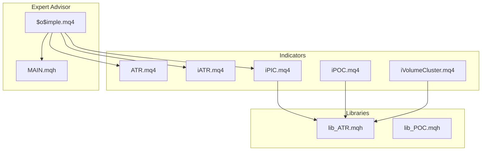
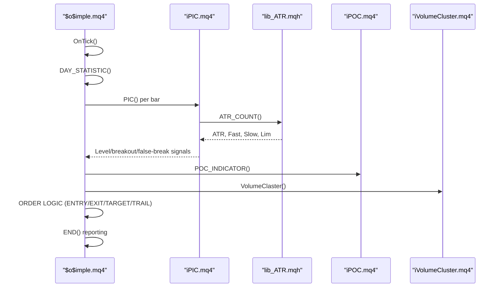
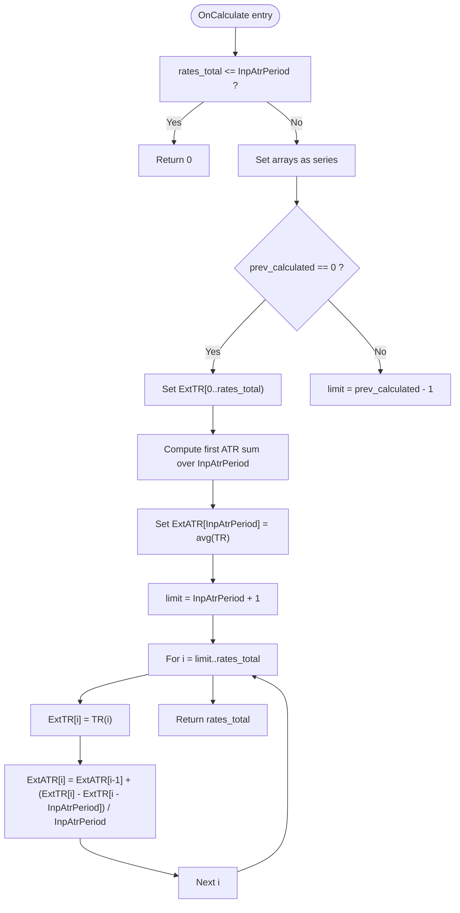
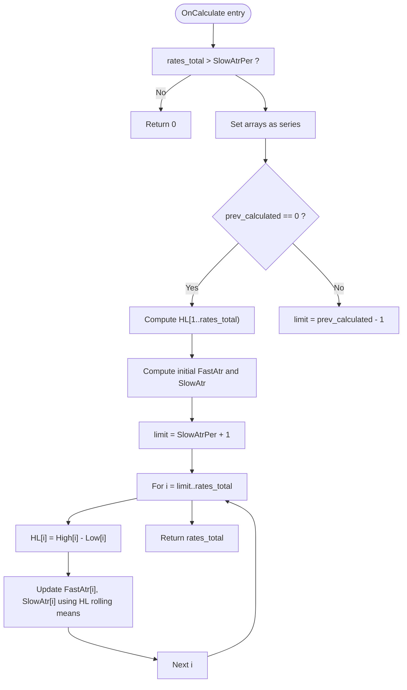
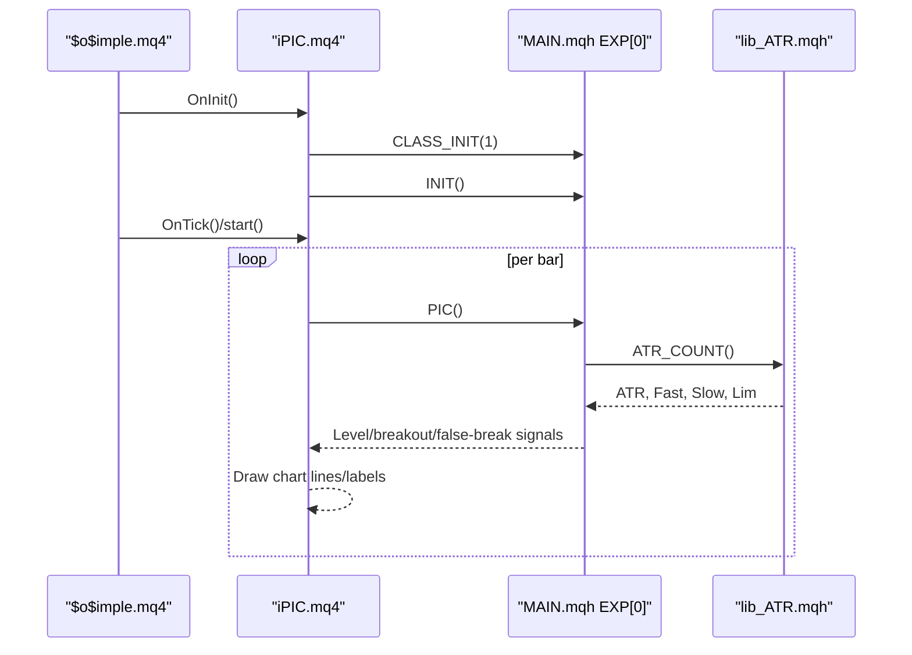
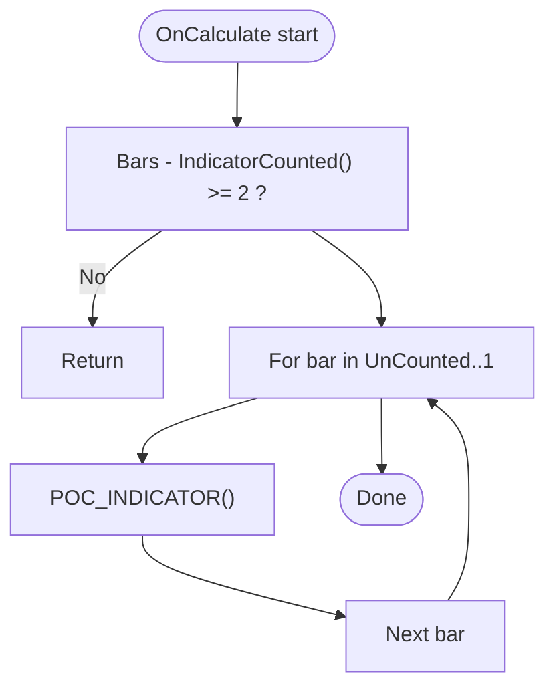
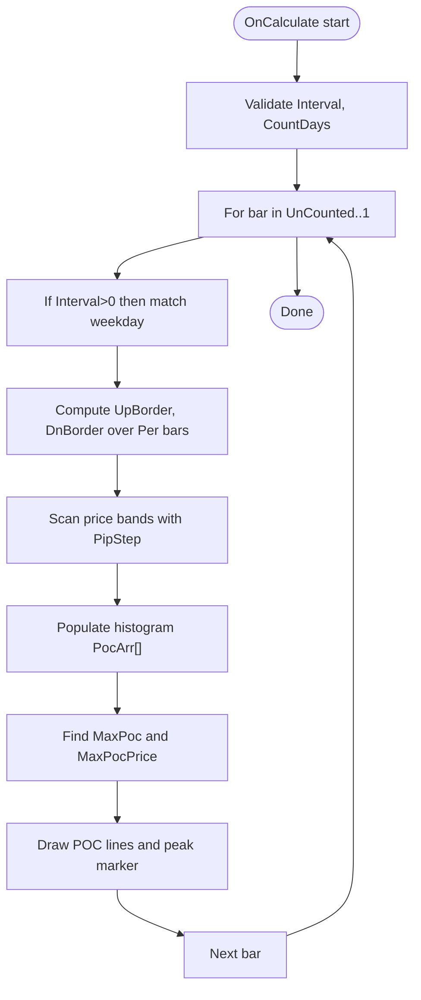
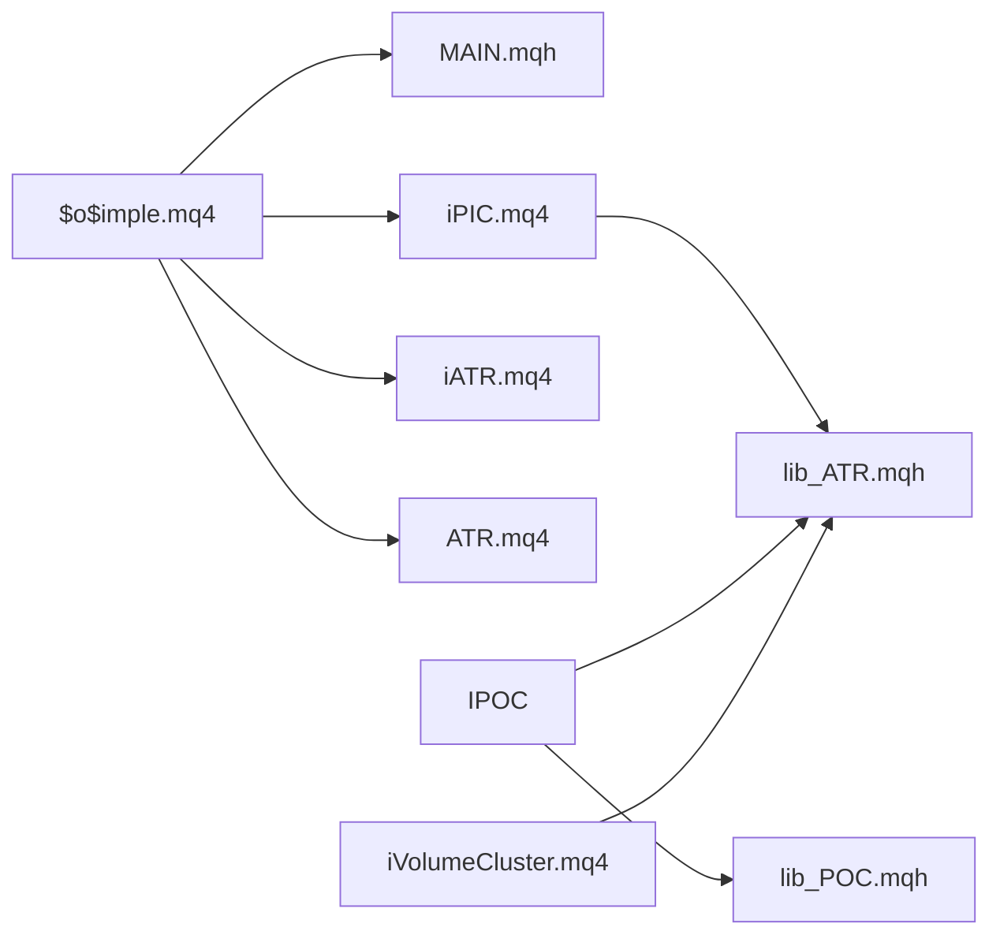

# Technical Indicators

<cite>
**Referenced Files in This Document**
- [ATR.mq4](file://MT/MQL4/Indicators/ATR.mq4)
- [iATR.mq4](file://MT/MQL4/Indicators/iATR.mq4)
- [iPIC.mq4](file://MT/MQL4/Indicators/iPIC.mq4)
- [iPOC.mq4](file://MT/MQL4/Indicators/iPOC.mq4)
- [iVolumeCluster.mq4](file://MT/MQL4/Indicators/iVolumeCluster.mq4)
- [lib_ATR.mqh](file://MT/MQL4/Include/lib_ATR.mqh)
- [$o$imple.mq4](file://MT/MQL4/Experts/$o$imple.mq4)
- [MAIN.mqh](file://MT/MQL4/Include/MAIN.mqh)
- [lib_POC.mqh](file://MT/MQL4/Trash/lib_POC.mqh)
</cite>

## Table of Contents
1. [Introduction](#introduction)
2. [Project Structure](#project-structure)
3. [Core Components](#core-components)
4. [Architecture Overview](#architecture-overview)
5. [Detailed Component Analysis](#detailed-component-analysis)
6. [Dependency Analysis](#dependency-analysis)
7. [Performance Considerations](#performance-considerations)
8. [Troubleshooting Guide](#troubleshooting-guide)
9. [Conclusion](#conclusion)

## Introduction
This document describes the technical indicators and related infrastructure used by the SoSimple trading system. It focuses on:
- ATR (Average True Range) implementations
- PIC (Price Innovation Clusters) indicator and its integration with the expert advisor
- POC (Point of Control) detection and visualization
- Volume Cluster analysis
It explains calculation algorithms, input parameters, outputs, integration with the expert advisor, signal generation workflow, visual representation guidelines, and practical guidance for optimization and robustness.

## Project Structure
The indicators are implemented as MQL4 custom indicators and leverage shared libraries and expert advisor logic:
- Indicators: ATR, iATR, iPIC, iPOC, iVolumeCluster
- Libraries: lib_ATR.mqh (ATR computation), lib_POC.mqh (POC routines)
- Expert Advisor: $o$imple.mq4 orchestrates signal generation and integrates indicator-derived signals

**Diagram sources**
- [iPIC.mq4:100-112](file://MT/MQL4/Indicators/iPIC.mq4#L100-L112)
- [iPOC.mq4:34-36](file://MT/MQL4/Indicators/iPOC.mq4#L34-L36)
- [iVolumeCluster.mq4:30-42](file://MT/MQL4/Indicators/iVolumeCluster.mq4#L30-L42)
- [lib_ATR.mqh:2-47](file://MT/MQL4/Include/lib_ATR.mqh#L2-L47)
- [$o$imple.mq4:100-122](file://MT/MQL4/Experts/$o$imple.mq4#L100-L122)
- [MAIN.mqh:78-109](file://MT/MQL4/Include/MAIN.mqh#L78-L109)

**Section sources**
- [iPIC.mq4:100-112](file://MT/MQL4/Indicators/iPIC.mq4#L100-L112)
- [iPOC.mq4:34-36](file://MT/MQL4/Indicators/iPOC.mq4#L34-L36)
- [iVolumeCluster.mq4:30-42](file://MT/MQL4/Indicators/iVolumeCluster.mq4#L30-L42)
- [lib_ATR.mqh:2-47](file://MT/MQL4/Include/lib_ATR.mqh#L2-L47)
- [$o$imple.mq4:100-122](file://MT/MQL4/Experts/$o$imple.mq4#L100-L122)
- [MAIN.mqh:78-109](file://MT/MQL4/Include/MAIN.mqh#L78-L109)

## Core Components
- ATR.mq4: Computes the Average True Range over a user-defined period and displays as a separate-line indicator.
- iATR.mq4: Computes fast and slow ATR variants and overlays them on the chart window.
- iPIC.mq4: The Price Innovation Clusters indicator that detects levels and generates signals; it includes extensive input parameters and integrates with the expert advisor via shared libraries.
- iPOC.mq4: Detects Point of Control areas and draws visual markers on the chart.
- iVolumeCluster.mq4: Draws horizontal volume distribution clusters over configurable intervals and days.

**Section sources**
- [ATR.mq4:12-47](file://MT/MQL4/Indicators/ATR.mq4#L12-L47)
- [iATR.mq4:8-44](file://MT/MQL4/Indicators/iATR.mq4#L8-L44)
- [iPIC.mq4:13-66](file://MT/MQL4/Indicators/iPIC.mq4#L13-L66)
- [iPOC.mq4:11-48](file://MT/MQL4/Indicators/iPOC.mq4#L11-L48)
- [iVolumeCluster.mq4:12-42](file://MT/MQL4/Indicators/iVolumeCluster.mq4#L12-L42)

## Architecture Overview
The SoSimple expert advisor integrates indicator outputs and computed ATR metrics to drive trade decisions. The workflow:
- OnTick, the EA initializes per-bar computations and delegates to indicator-specific logic.
- ATR computations are performed via lib_ATR.mqh to derive volatility thresholds and limits.
- iPIC performs level discovery and signal checks; iPOC and iVolumeCluster provide visual support and confirmatory levels.

**Diagram sources**
- [$o$imple.mq4:123-132](file://MT/MQL4/Experts/$o$imple.mq4#L123-L132)
- [iPIC.mq4:116-126](file://MT/MQL4/Indicators/iPIC.mq4#L116-L126)
- [lib_ATR.mqh:2-47](file://MT/MQL4/Include/lib_ATR.mqh#L2-L47)
- [iPOC.mq4:51-58](file://MT/MQL4/Indicators/iPOC.mq4#L51-L58)
- [iVolumeCluster.mq4:43-55](file://MT/MQL4/Indicators/iVolumeCluster.mq4#L43-L55)

## Detailed Component Analysis

### ATR.mq4
- Purpose: Computes Average True Range over a user-defined period and displays as a separate indicator window.
- Inputs:
  - InpAtrPeriod: ATR averaging period (integer).
- Buffers:
  - ExtATRBuffer: ATR values.
  - ExtTRBuffer: True Range values used in rolling average.
- Initialization:
  - Validates InpAtrPeriod > 0.
  - Sets draw begin to InpAtrPeriod to avoid warm-up artifacts.
- Calculation:
  - First bar sets TR and ATR to zero.
  - Accumulates first InpAtrPeriod TR values and computes initial ATR.
  - Subsequent bars update ATR using a fixed-period rolling mean of TR.

**Diagram sources**
- [ATR.mq4:51-103](file://MT/MQL4/Indicators/ATR.mq4#L51-L103)

**Section sources**
- [ATR.mq4:12-47](file://MT/MQL4/Indicators/ATR.mq4#L12-L47)
- [ATR.mq4:51-103](file://MT/MQL4/Indicators/ATR.mq4#L51-L103)

### iATR.mq4
- Purpose: Computes fast and slow ATR variants and overlays them on the chart.
- Inputs:
  - FastAtrPer: Fast ATR period.
  - SlowAtrPer: Slow ATR period.
- Buffers:
  - FastAtr: Fast ATR values.
  - SlowAtr: Slow ATR values.
  - HL: High minus Low series used for rolling averages.
- Initialization:
  - Validates FastAtrPer < SlowAtrPer.
  - Sets draw begin to SlowAtrPer.
- Calculation:
  - Initializes HL series and computes first averages.
  - Updates FastAtr and SlowAtr using fixed-period rolling means of HL.

**Diagram sources**
- [iATR.mq4:46-96](file://MT/MQL4/Indicators/iATR.mq4#L46-L96)

**Section sources**
- [iATR.mq4:8-44](file://MT/MQL4/Indicators/iATR.mq4#L8-L44)
- [iATR.mq4:46-96](file://MT/MQL4/Indicators/iATR.mq4#L46-L96)

### iPIC.mq4
- Purpose: Detects Price Innovation Clusters, identifies levels, and supports trend and breakout signals.
- Inputs: Extensive external parameters controlling fractal periods, filtering, ATR usage, target logic, and ML optimization settings.
- Integration:
  - Includes shared libraries for graphics and PIC logic.
  - Uses lib_ATR.mqh for ATR-based thresholds.
  - Calls EXP[0].INIT() and EXP[0].PIC() during initialization and execution loops.
- Execution:
  - start() iterates backwards over counted bars and invokes PIC logic per bar.
  - Draws chart objects for levels and signals.

**Diagram sources**
- [iPIC.mq4:100-112](file://MT/MQL4/Indicators/iPIC.mq4#L100-L112)
- [iPIC.mq4:116-126](file://MT/MQL4/Indicators/iPIC.mq4#L116-L126)
- [lib_ATR.mqh:2-47](file://MT/MQL4/Include/lib_ATR.mqh#L2-L47)
- [MAIN.mqh:78-109](file://MT/MQL4/Include/MAIN.mqh#L78-L109)

**Section sources**
- [iPIC.mq4:13-66](file://MT/MQL4/Indicators/iPIC.mq4#L13-L66)
- [iPIC.mq4:100-112](file://MT/MQL4/Indicators/iPIC.mq4#L100-L112)
- [iPIC.mq4:116-126](file://MT/MQL4/Indicators/iPIC.mq4#L116-L126)
- [lib_ATR.mqh:2-47](file://MT/MQL4/Include/lib_ATR.mqh#L2-L47)
- [MAIN.mqh:78-109](file://MT/MQL4/Include/MAIN.mqh#L78-L109)

### iPOC.mq4
- Purpose: Detects Point of Control areas and draws visual markers indicating the most frequently crossed price zones.
- Inputs:
  - FltLen: Minimum number of bars to qualify a consolidation for POC detection.
  - PocColor, MaxPocColor: Histogram and peak color controls.
  - PocScale: Scaling multiplier for POC line length.
  - A, a, dAtr, Ak, PicVal: ATR-related parameters influencing stop/target sizing and thresholds.
- Integration:
  - Includes lib_ATR.mqh and lib_POC.mqh.
  - Uses POC_INDICATOR() to compute and visualize POC levels.

**Diagram sources**
- [iPOC.mq4:51-58](file://MT/MQL4/Indicators/iPOC.mq4#L51-L58)

**Section sources**
- [iPOC.mq4:11-48](file://MT/MQL4/Indicators/iPOC.mq4#L11-L48)
- [iPOC.mq4:51-58](file://MT/MQL4/Indicators/iPOC.mq4#L51-L58)
- [lib_POC.mqh:1-99](file://MT/MQL4/Trash/lib_POC.mqh#L1-L99)

### iVolumeCluster.mq4
- Purpose: Visualizes volume distribution across price ranges over configurable intervals and day windows.
- Inputs:
  - Interval: Recalculation cadence (daily or weekly).
  - CountDays: Lookback window in days.
  - PipStep: Step size for scanning price ranges.
  - PocColor, MaxPocColor: Visual colors for histogram and peak area.
- Computation:
  - Determines scan range bounds over the selected lookback.
  - Builds a histogram of candle intraday range coverage per price band.
  - Identifies the peak POC price and draws supporting lines.

**Diagram sources**
- [iVolumeCluster.mq4:43-93](file://MT/MQL4/Indicators/iVolumeCluster.mq4#L43-L93)

**Section sources**
- [iVolumeCluster.mq4:12-42](file://MT/MQL4/Indicators/iVolumeCluster.mq4#L12-L42)
- [iVolumeCluster.mq4:43-93](file://MT/MQL4/Indicators/iVolumeCluster.mq4#L43-L93)

## Dependency Analysis
Key dependencies and interactions:
- iPIC.mq4 depends on lib_ATR.mqh for ATR-based thresholds and on MAIN.mqh for PIC logic and chart drawing.
- iPOC.mq4 depends on lib_ATR.mqh and lib_POC.mqh for ATR scaling and POC computation.
- iVolumeCluster.mq4 depends on lib_ATR.mqh for ATR scaling and uses chart drawing utilities.
- $o$imple.mq4 orchestrates indicator usage and integrates signals into order management.

**Diagram sources**
- [$o$imple.mq4:100-122](file://MT/MQL4/Experts/$o$imple.mq4#L100-L122)
- [iPIC.mq4:100-112](file://MT/MQL4/Indicators/iPIC.mq4#L100-L112)
- [iPOC.mq4:34-36](file://MT/MQL4/Indicators/iPOC.mq4#L34-L36)
- [iVolumeCluster.mq4:30-42](file://MT/MQL4/Indicators/iVolumeCluster.mq4#L30-L42)
- [lib_ATR.mqh:2-47](file://MT/MQL4/Include/lib_ATR.mqh#L2-L47)
- [lib_POC.mqh:1-99](file://MT/MQL4/Trash/lib_POC.mqh#L1-L99)

**Section sources**
- [$o$imple.mq4:100-122](file://MT/MQL4/Experts/$o$imple.mq4#L100-L122)
- [iPIC.mq4:100-112](file://MT/MQL4/Indicators/iPIC.mq4#L100-L112)
- [iPOC.mq4:34-36](file://MT/MQL4/Indicators/iPOC.mq4#L34-L36)
- [iVolumeCluster.mq4:30-42](file://MT/MQL4/Indicators/iVolumeCluster.mq4#L30-L42)
- [lib_ATR.mqh:2-47](file://MT/MQL4/Include/lib_ATR.mqh#L2-L47)
- [lib_POC.mqh:1-99](file://MT/MQL4/Trash/lib_POC.mqh#L1-L99)

## Performance Considerations
- ATR.mq4 and iATR.mq4 use fixed-period rolling means; ensure InpAtrPeriod and FastAtrPer/SlowAtrPer are chosen to balance responsiveness and noise.
- iPIC.mq4 and iPOC.mq4 rely on historical scans; parameter FltLen and PocScale impact computational cost and visual clarity.
- iVolumeCluster.mq4’s PipStep and CountDays directly affect performance; larger steps reduce iterations but may miss fine-grained clusters.
- Use IndicatorCounted() and prev_calculated to minimize recomputation on subsequent bars.

[No sources needed since this section provides general guidance]

## Troubleshooting Guide
Common issues and remedies:
- Wrong input parameters:
  - ATR.mq4 and iATR.mq4 validate periods; ensure InpAtrPeriod > 0 and FastAtrPer < SlowAtrPer.
  - iPOC.mq4 validates FltLen; set FltLen ≥ 1.
  - iVolumeCluster.mq4 validates Interval ∈ [0..5] and CountDays ≥ 1.
- Initialization failures:
  - iPIC.mq4 returns INIT_FAILED if external parameters are invalid; review parameter ranges.
- ATR computation edge cases:
  - lib_ATR.mqh returns false when Bars < SlowAtrPer; ensure sufficient history.
- Chart rendering:
  - iVolumeCluster.mq4 uses custom drawing utilities; ensure chart window settings accommodate drawn objects.

**Section sources**
- [ATR.mq4:38-42](file://MT/MQL4/Indicators/ATR.mq4#L38-L42)
- [iATR.mq4:38-41](file://MT/MQL4/Indicators/iATR.mq4#L38-L41)
- [iPOC.mq4:46-48](file://MT/MQL4/Indicators/iPOC.mq4#L46-L48)
- [iVolumeCluster.mq4:32-33](file://MT/MQL4/Indicators/iVolumeCluster.mq4#L32-L33)
- [lib_ATR.mqh:18-21](file://MT/MQL4/Include/lib_ATR.mqh#L18-L21)

## Conclusion
The SoSimple indicator suite combines robust ATR computation with level detection (iPIC), POC identification (iPOC), and volume clustering (iVolumeCluster). The expert advisor integrates these signals with ATR-based risk controls to generate trade decisions. Proper tuning of indicator parameters and careful handling of edge cases ensures reliable performance across market regimes.