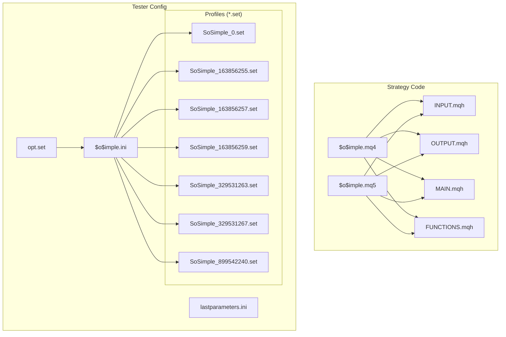
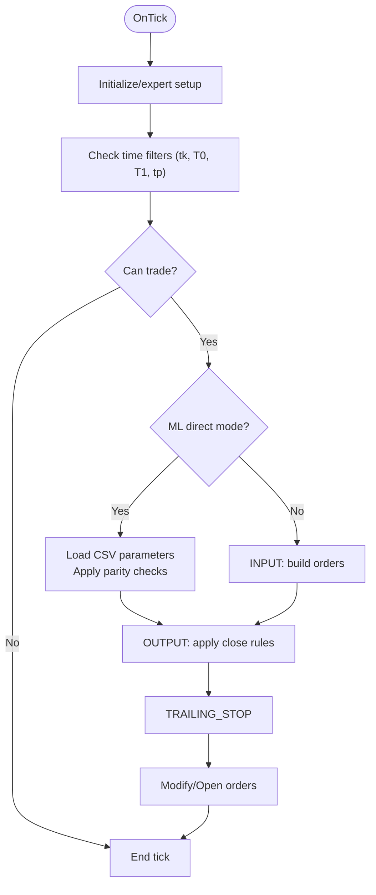
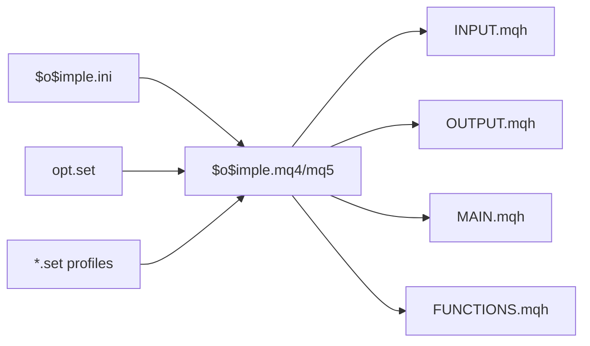

# Tester Configuration

<cite>
**Referenced Files in This Document**
- [$o$imple.mq4](file://MT/MQL4/Experts/$o$imple.mq4)
- [$o$imple.mq5](file://MT/MQL5/Experts/$o$imple.mq5)
- [INPUT.mqh](file://MT/MQL4/Include/INPUT.mqh)
- [OUTPUT.mqh](file://MT/MQL4/Include/OUTPUT.mqh)
- [MAIN.mqh](file://MT/MQL4/Include/MAIN.mqh)
- [FUNCTIONS.mqh](file://MT/MQL4/Include/FUNCTIONS.mqh)
- [SoSimple_0.set](file://MT/tester/files/SoSimple_0.set)
- [SoSimple_163856255.set](file://MT/tester/files/SoSimple_163856255.set)
- [SoSimple_163856257.set](file://MT/tester/files/SoSimple_163856257.set)
- [SoSimple_163856259.set](file://MT/tester/files/SoSimple_163856259.set)
- [SoSimple_329531263.set](file://MT/tester/files/SoSimple_329531263.set)
- [SoSimple_329531267.set](file://MT/tester/files/SoSimple_329531267.set)
- [SoSimple_899542240.set](file://MT/tester/files/SoSimple_899542240.set)
- [opt.set](file://MT/tester/opt.set)
- [$o$imple.ini](file://MT/tester/$o$imple.ini)
- [lastparameters.ini](file://MT/tester/lastparameters.ini)
</cite>

## Table of Contents
1. [Introduction](#introduction)
2. [Project Structure](#project-structure)
3. [Core Components](#core-components)
4. [Architecture Overview](#architecture-overview)
5. [Detailed Component Analysis](#detailed-component-analysis)
6. [Dependency Analysis](#dependency-analysis)
7. [Performance Considerations](#performance-considerations)
8. [Troubleshooting Guide](#troubleshooting-guide)
9. [Conclusion](#conclusion)

## Introduction
This document explains the MetaTrader tester configuration system used for SoSimple strategy optimization and backtesting. It covers parameter set configurations, optimization criteria, genetic algorithm settings, and tester profiles. It also provides guidelines for creating custom test configurations, interpreting objective functions, and validating results.

## Project Structure
The tester configuration spans three layers:
- Strategy expert code (MQL4/MQL5) defines inputs, logic, and ML integration
- Tester profile files (.set) define preset parameter sets for quick reuse
- Optimization configuration files (.ini and .set) define search spaces, genetic algorithm parameters, and fitness objectives



**Diagram sources**
- [$o$imple.mq4:1-149](file://MT/MQL4/Experts/$o$imple.mq4#L1-L149)
- [$o$imple.mq5:1-157](file://MT/MQL5/Experts/$o$imple.mq5#L1-L157)
- [INPUT.mqh:1-251](file://MT/MQL4/Include/INPUT.mqh#L1-L251)
- [OUTPUT.mqh:1-328](file://MT/MQL4/Include/OUTPUT.mqh#L1-L328)
- [MAIN.mqh:1-213](file://MT/MQL4/Include/MAIN.mqh#L1-L213)
- [FUNCTIONS.mqh:1-320](file://MT/MQL4/Include/FUNCTIONS.mqh#L1-L320)
- [opt.set:1-269](file://MT/tester/opt.set#L1-L269)
- [$o$imple.ini:1-353](file://MT/tester/$o$imple.ini#L1-L353)
- [lastparameters.ini:1-8](file://MT/tester/lastparameters.ini#L1-L8)
- [SoSimple_0.set:1-42](file://MT/tester/files/SoSimple_0.set#L1-L42)
- [SoSimple_163856255.set:1-33](file://MT/tester/files/SoSimple_163856255.set#L1-L33)
- [SoSimple_163856257.set:1-33](file://MT/tester/files/SoSimple_163856257.set#L1-L33)
- [SoSimple_163856259.set:1-33](file://MT/tester/files/SoSimple_163856259.set#L1-L33)
- [SoSimple_329531263.set:1-33](file://MT/tester/files/SoSimple_329531263.set#L1-L33)
- [SoSimple_329531267.set:1-33](file://MT/tester/files/SoSimple_329531267.set#L1-L33)
- [SoSimple_899542240.set:1-42](file://MT/tester/files/SoSimple_899542240.set#L1-L42)

**Section sources**
- [$o$imple.mq4:1-149](file://MT/MQL4/Experts/$o$imple.mq4#L1-L149)
- [$o$imple.mq5:1-157](file://MT/MQL5/Experts/$o$imple.mq5#L1-L157)
- [INPUT.mqh:1-251](file://MT/MQL4/Include/INPUT.mqh#L1-L251)
- [OUTPUT.mqh:1-328](file://MT/MQL4/Include/OUTPUT.mqh#L1-L328)
- [MAIN.mqh:1-213](file://MT/MQL4/Include/MAIN.mqh#L1-L213)
- [FUNCTIONS.mqh:1-320](file://MT/MQL4/Include/FUNCTIONS.mqh#L1-L320)
- [opt.set:1-269](file://MT/tester/opt.set#L1-L269)
- [$o$imple.ini:1-353](file://MT/tester/$o$imple.ini#L1-L353)
- [lastparameters.ini:1-8](file://MT/tester/lastparameters.ini#L1-L8)
- [SoSimple_0.set:1-42](file://MT/tester/files/SoSimple_0.set#L1-L42)
- [SoSimple_163856255.set:1-33](file://MT/tester/files/SoSimple_163856255.set#L1-L33)
- [SoSimple_163856257.set:1-33](file://MT/tester/files/SoSimple_163856257.set#L1-L33)
- [SoSimple_163856259.set:1-33](file://MT/tester/files/SoSimple_163856259.set#L1-L33)
- [SoSimple_329531263.set:1-33](file://MT/tester/files/SoSimple_329531263.set#L1-L33)
- [SoSimple_329531267.set:1-33](file://MT/tester/files/SoSimple_329531267.set#L1-L33)
- [SoSimple_899542240.set:1-42](file://MT/tester/files/SoSimple_899542240.set#L1-L42)

## Core Components
- Strategy experts define externally configurable inputs and ML-related parameters. These include pattern recognition filters, ATR settings, order sizing, time filters, and ML-specific controls for trailing stops, take profits, position limits, and score filtering.
- Tester profiles (.set files) encapsulate complete parameter sets for quick selection during optimization/backtesting.
- Optimization configuration files define the genetic algorithm, search bounds, and objective functions.

Key configuration areas:
- Pattern recognition and trend filters
- ATR calculation and sensitivity
- Order construction (entry, stop, take-profit)
- Output/close rules and trailing stops
- Time-based session filters
- ML optimization parameters (ratio thresholds, risk-reward caps, trail parameters, position sizing)

**Section sources**
- [$o$imple.mq4:8-82](file://MT/MQL4/Experts/$o$imple.mq4#L8-L82)
- [$o$imple.mq5:7-99](file://MT/MQL5/Experts/$o$imple.mq5#L7-L99)
- [INPUT.mqh:3-54](file://MT/MQL4/Include/INPUT.mqh#L3-L54)
- [OUTPUT.mqh:6-62](file://MT/MQL4/Include/OUTPUT.mqh#L6-L62)
- [MAIN.mqh:117-143](file://MT/MQL4/Include/MAIN.mqh#L117-L143)
- [SoSimple_0.set:1-42](file://MT/tester/files/SoSimple_0.set#L1-L42)
- [SoSimple_899542240.set:1-42](file://MT/tester/files/SoSimple_899542240.set#L1-L42)

## Architecture Overview
The tester orchestrates optimization via genetic algorithms using bounds and objectives defined in configuration files. The expert executes logic per bar, applying pattern recognition, ML signals, and close rules.

```mermaid
sequenceDiagram
participant User as "User"
participant Tester as "MetaQuotes Tester"
participant Ini as "$o$imple.ini"
participant Opt as "opt.set"
participant Expert as "$o$imple.mq4/mq5"
participant Inputs as "INPUT.mqh"
participant Outputs as "OUTPUT.mqh"
User->>Tester : Load profile (*.set) and start optimization
Tester->>Ini : Read global optimization settings
Ini-->>Tester : Genetic params, search bounds, objectives
Tester->>Opt : Apply optimization overrides
Tester->>Expert : Initialize with external inputs
Expert->>Inputs : Build orders based on signals and filters
Inputs-->>Expert : BUY/SELL order requests
Expert->>Outputs : Apply close rules, trailing stops, and exits
Outputs-->>Expert : Modified stops/profits or closure
Expert-->>Tester : Performance metrics (balance, drawdown, etc.)
```

**Diagram sources**
- [$o$imple.ini:1-353](file://MT/tester/$o$imple.ini#L1-L353)
- [opt.set:1-269](file://MT/tester/opt.set#L1-L269)
- [$o$imple.mq4:123-147](file://MT/MQL4/Experts/$o$imple.mq4#L123-L147)
- [$o$imple.mq5:137-147](file://MT/MQL5/Experts/$o$imple.mq5#L137-L147)
- [INPUT.mqh:3-54](file://MT/MQL4/Include/INPUT.mqh#L3-L54)
- [OUTPUT.mqh:6-62](file://MT/MQL4/Include/OUTPUT.mqh#L6-L62)

## Detailed Component Analysis

### Parameter Sets and Profiles
Each .set file represents a distinct parameter combination for SoSimple. Profiles differ primarily in:
- Signal source selection (iSignal)
- ML optimization parameters (when present)
- Time/session filters (T0, T1, tk)
- Output/close rules (oImp, oFlt, oGlb, oLoc)

Examples:
- SoSimple_0.set: Includes ML optimization parameters (ML_TrailATR, ML_TakeProfitATR, ML_MaxPositions, ML_HoldBars, ML_AllowReversal, ML_UseScoreFilter, ML_ScoreThreshold, ML_BackStopATR)
- SoSimple_163856255.set: Standard pattern recognition without ML-specific entries
- SoSimple_163856257.set: Similar to 163856255 but with different T1 value
- SoSimple_163856259.set: Similar to 163856255 but with different T1 value
- SoSimple_329531263.set: Uses iSignal=5 (ML Triple Barrier)
- SoSimple_329531267.set: Similar to 329531263 but with different T1 value
- SoSimple_899542240.set: Includes ML optimization parameters similar to 0.set

Guidelines for creating custom profiles:
- Start from a base .set (e.g., 0 or 163856255) and adjust only the parameters you want to vary
- Keep ML parameters consistent with your CSV signal pipeline if using ML modes
- Ensure time filters align with your trading sessions and avoid overlap with known market events

**Section sources**
- [SoSimple_0.set:1-42](file://MT/tester/files/SoSimple_0.set#L1-L42)
- [SoSimple_163856255.set:1-33](file://MT/tester/files/SoSimple_163856255.set#L1-L33)
- [SoSimple_163856257.set:1-33](file://MT/tester/files/SoSimple_163856257.set#L1-L33)
- [SoSimple_163856259.set:1-33](file://MT/tester/files/SoSimple_163856259.set#L1-L33)
- [SoSimple_329531263.set:1-33](file://MT/tester/files/SoSimple_329531263.set#L1-L33)
- [SoSimple_329531267.set:1-33](file://MT/tester/files/SoSimple_329531267.set#L1-L33)
- [SoSimple_899542240.set:1-42](file://MT/tester/files/SoSimple_899542240.set#L1-L42)

### Optimization Settings and Genetic Algorithm
The optimization configuration defines:
- Search bounds for each parameter group (PicPer, FltLen, PicCnt, PicPwr, PicImp, Rev, Days, MidTyp, iGlb, iFlt, iLoc, A, a, Ak, PicVal, Target, iSignal, iParam, D, Stp, Prf, oImp, oFlt, oGlb, oLoc, Trl, Wknd, tk, T0, T1, tp, and ML_* parameters)
- Objective function selection (CustMax) and constraints (balance, profit, margin level, drawdown, consecutive wins/losses)
- Genetic algorithm parameters (genetic=1, fitnes=0, method=2)

Key optimization controls:
- RF_ and PF_: Drop worst performing runs during optimization
- Opt_Trades: Number of trades considered for optimization
- CustMax: Objective to maximize (Balance, RiskFactor, inverse RiskFactor, or MO/Spread)
- ML_* parameters: Ratio thresholds, risk-reward caps, trail activation/step, position sizing, and score filtering

Best practices:
- Use RF_ and PF_ to prune poor performers early
- Align ML parameters with CSV signal quality and desired risk profile
- Set reasonable bounds for ML_MinRatio, ML_MaxRR, ML_RR_Cap, ML_Trl_Start_ATR, ML_Trl_Step_ATR
- Monitor limits in the limits section to prevent unrealistic results

**Section sources**
- [opt.set:1-269](file://MT/tester/opt.set#L1-L269)
- [$o$imple.ini:1-353](file://MT/tester/$o$imple.ini#L1-L353)
- [lastparameters.ini:1-8](file://MT/tester/lastparameters.ini#L1-L8)

### Strategy Execution Flow
The expert executes per bar:
- Initialize and count levels/patterns
- Determine trade eligibility (time filters, trend filters)
- For ML modes: load CSV-derived parameters and apply parity checks
- Build orders (entry, stop, take-profit) based on inputs
- Apply close rules (impulse checks, trend changes, proximity to peaks/volumes)
- Trail open positions according to configured rules



**Diagram sources**
- [$o$imple.mq4:123-147](file://MT/MQL4/Experts/$o$imple.mq4#L123-L147)
- [$o$imple.mq5:137-147](file://MT/MQL5/Experts/$o$imple.mq5#L137-L147)
- [INPUT.mqh:3-54](file://MT/MQL4/Include/INPUT.mqh#L3-L54)
- [OUTPUT.mqh:6-62](file://MT/MQL4/Include/OUTPUT.mqh#L6-L62)
- [MAIN.mqh:117-143](file://MT/MQL4/Include/MAIN.mqh#L117-L143)

**Section sources**
- [INPUT.mqh:3-54](file://MT/MQL4/Include/INPUT.mqh#L3-L54)
- [OUTPUT.mqh:6-62](file://MT/MQL4/Include/OUTPUT.mqh#L6-L62)
- [MAIN.mqh:117-143](file://MT/MQL4/Include/MAIN.mqh#L117-L143)
- [$o$imple.mq4:123-147](file://MT/MQL4/Experts/$o$imple.mq4#L123-L147)
- [$o$imple.mq5:137-147](file://MT/MQL5/Experts/$o$imple.mq5#L137-L147)

### ML Optimization Parameters
ML parameters control ML-driven trading behavior:
- ML_MinRatio, ML_MaxRatio: Lower/upper bounds for prediction confidence ratios
- ML_MaxRR, ML_RR_Mode, ML_RR_Cap: Risk-reward computation modes and caps
- ML_ScaleK: Scaling factor for converting predictions to ATR terms
- ML_Min_SL_ATR: Minimum stop distance in ATR
- ML_BypassTrend: Ignore trend filter when enabled
- ML_ExitEnabled, ML_ExitThreshold: Reverse-exit logic
- ML_Filter3, ML_Filter6: Directional alignment filters
- ML_Trl_Start_ATR, ML_Trl_Step_ATR: Trailing stop activation and step in ATR
- ML_TrailATR, ML_TakeProfitATR: Trail gap and take-profit in ATR
- ML_MaxPositions, ML_HoldBars: Position sizing and holding bars
- ML_AllowReversal: Allow reversals from CSV
- ML_UseScoreFilter, ML_ScoreThreshold: Score-based filtering
- ML_BackStopATR: Maximum stop distance in ATR

Recommendations:
- Start with conservative ML_MinRatio and ML_MaxRR caps
- Enable ML_UseScoreFilter and tune ML_ScoreThreshold using historical CSV quality
- Calibrate ML_Trl_Start_ATR and ML_Trl_Step_ATR to volatility regimes
- Limit ML_MaxPositions to reduce concentration risk

**Section sources**
- [$o$imple.mq4:58-81](file://MT/MQL4/Experts/$o$imple.mq4#L58-L81)
- [$o$imple.mq5:57-99](file://MT/MQL5/Experts/$o$imple.mq5#L57-L99)
- [SoSimple_0.set:33-42](file://MT/tester/files/SoSimple_0.set#L33-L42)
- [SoSimple_899542240.set:33-42](file://MT/tester/files/SoSimple_899542240.set#L33-L42)
- [opt.set:208-269](file://MT/tester/opt.set#L208-L269)

### Objective Functions and Constraints
Objective selection (CustMax):
- 0: Maximize balance
- 1: Maximize RiskFactor
- 2: Maximize inverse RiskFactor
- 3: Maximize MO/Spread

Constraints:
- Balance, profit, margin level thresholds
- Max drawdown limits
- Consecutive wins/losses limits

Guidelines:
- Choose CustMax aligned with your risk-return preference
- Use constraints to prevent overfitting to specific market conditions
- Monitor drawdown and consecutive loss limits to avoid extreme parameter combinations

**Section sources**
- [$o$imple.ini:335-352](file://MT/tester/$o$imple.ini#L335-L352)
- [opt.set:1-46](file://MT/tester/opt.set#L1-L46)

### Time Filters and Session Controls
Time filters (tk, T0, T1, tp) control when trading is allowed:
- tk: Session identifier offset
- T0, T1: Entry start and duration windows
- tp: Time-based exit trigger

Recommendations:
- Align T0/T1 with major session overlaps or known liquidity periods
- Use tp to enforce fixed holding durations or session closings
- Disable tk when trading across sessions is desired

**Section sources**
- [INPUT.mqh:18-54](file://MT/MQL4/Include/INPUT.mqh#L18-L54)
- [OUTPUT.mqh:18-59](file://MT/MQL4/Include/OUTPUT.mqh#L18-L59)
- [MAIN.mqh:185-188](file://MT/MQL4/Include/MAIN.mqh#L185-L188)

### Pattern Recognition and Trend Filters
Pattern recognition parameters (PicPer, FltLen, PicCnt, PicPwr, PicImp, Rev, Days, MidTyp) and trend filters (iGlb, iFlt, iLoc) define signal generation:
- Adjust FltLen and PicCnt to control pattern strength
- Tune MidTyp to select different peak valuation methods
- Use Rev and Days to incorporate reversal and temporal context

Recommendations:
- Start with moderate FltLen and increase gradually
- Use iGlb/iLoc to filter by global/local trend changes
- Validate with walk-forward to avoid lookahead bias

**Section sources**
- [INPUT.mqh:14-21](file://MT/MQL4/Include/INPUT.mqh#L14-L21)
- [MAIN.mqh:152-188](file://MT/MQL4/Include/MAIN.mqh#L152-L188)

## Dependency Analysis
The expert depends on include modules for input construction, output/close logic, and shared utilities. Profiles feed parameters into the expert, while optimization files define search bounds and objectives.



**Diagram sources**
- [$o$imple.mq4:100-121](file://MT/MQL4/Experts/$o$imple.mq4#L100-L121)
- [$o$imple.mq5:113-135](file://MT/MQL5/Experts/$o$imple.mq5#L113-L135)
- [INPUT.mqh:1-251](file://MT/MQL4/Include/INPUT.mqh#L1-L251)
- [OUTPUT.mqh:1-328](file://MT/MQL4/Include/OUTPUT.mqh#L1-L328)
- [MAIN.mqh:1-213](file://MT/MQL4/Include/MAIN.mqh#L1-L213)
- [FUNCTIONS.mqh:1-320](file://MT/MQL4/Include/FUNCTIONS.mqh#L1-L320)
- [$o$imple.ini:1-353](file://MT/tester/$o$imple.ini#L1-L353)
- [opt.set:1-269](file://MT/tester/opt.set#L1-L269)

**Section sources**
- [$o$imple.mq4:100-121](file://MT/MQL4/Experts/$o$imple.mq4#L100-L121)
- [$o$imple.mq5:113-135](file://MT/MQL5/Experts/$o$imple.mq5#L113-L135)
- [INPUT.mqh:1-251](file://MT/MQL4/Include/INPUT.mqh#L1-L251)
- [OUTPUT.mqh:1-328](file://MT/MQL4/Include/OUTPUT.mqh#L1-L328)
- [MAIN.mqh:1-213](file://MT/MQL4/Include/MAIN.mqh#L1-L213)
- [FUNCTIONS.mqh:1-320](file://MT/MQL4/Include/FUNCTIONS.mqh#L1-L320)
- [$o$imple.ini:1-353](file://MT/tester/$o$imple.ini#L1-L353)
- [opt.set:1-269](file://MT/tester/opt.set#L1-L269)

## Performance Considerations
- Genetic algorithm runtime scales with population size and number of generations; constrain search space to reduce compute time
- ML parameters significantly impact performance; calibrate incrementally
- Time filters and trend filters reduce false signals but may reduce trade frequency; balance sensitivity vs. robustness
- Use realistic spreads and slippage assumptions in tester settings to avoid optimistic results

## Troubleshooting Guide
Common issues and resolutions:
- Excessive drawdown or consecutive losses: Review limits in $o$imple.ini and tighten ML parameters (ML_MaxRR, ML_RR_Cap, ML_MinRatio)
- Poor ML performance: Increase ML_MinRatio, enable ML_UseScoreFilter, and tune ML_ScoreThreshold
- Overfitting: Reduce search space granularity in opt.set and add constraints
- Inconsistent results across instruments: Use walk-forward validation and instrument-wise tuning

Validation techniques:
- Split data into in-sample and out-of-sample periods
- Run multiple random seeds and compare median/percentiles
- Compare ML parity with CSV signals to ensure correct parameter loading
- Stress-test with volatile regimes and low-liquidity periods

**Section sources**
- [$o$imple.ini:335-352](file://MT/tester/$o$imple.ini#L335-L352)
- [opt.set:208-269](file://MT/tester/opt.set#L208-L269)
- [INPUT.mqh:3-54](file://MT/MQL4/Include/INPUT.mqh#L3-L54)
- [OUTPUT.mqh:6-62](file://MT/MQL4/Include/OUTPUT.mqh#L6-L62)

## Conclusion
The SoSimple tester configuration system combines expert-defined inputs, profile-based parameter sets, and genetic optimization to explore robust trading strategies. By carefully selecting objectives, constraining extremes, and validating across market conditions, teams can reliably discover parameter combinations that generalize well beyond historical backtests.