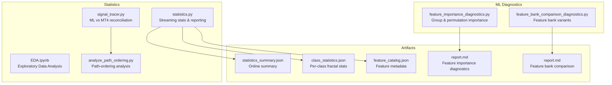
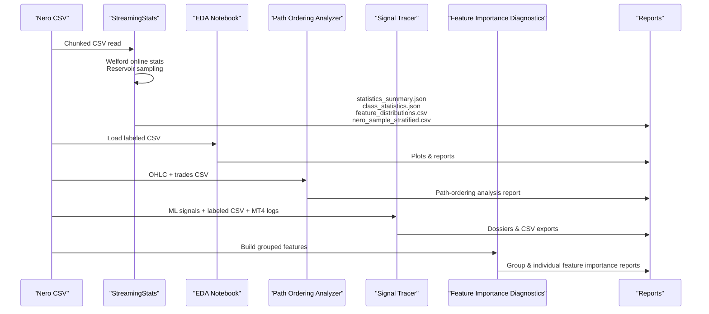
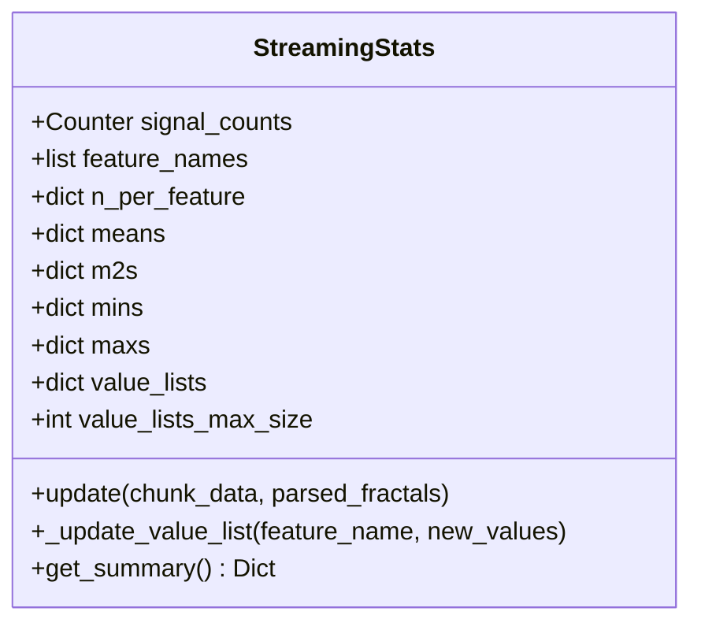
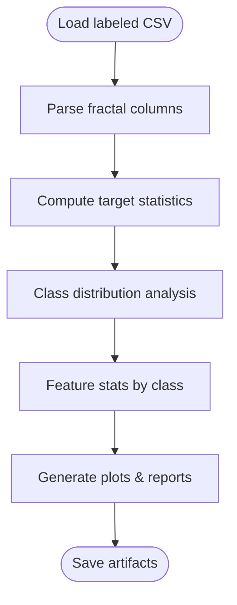
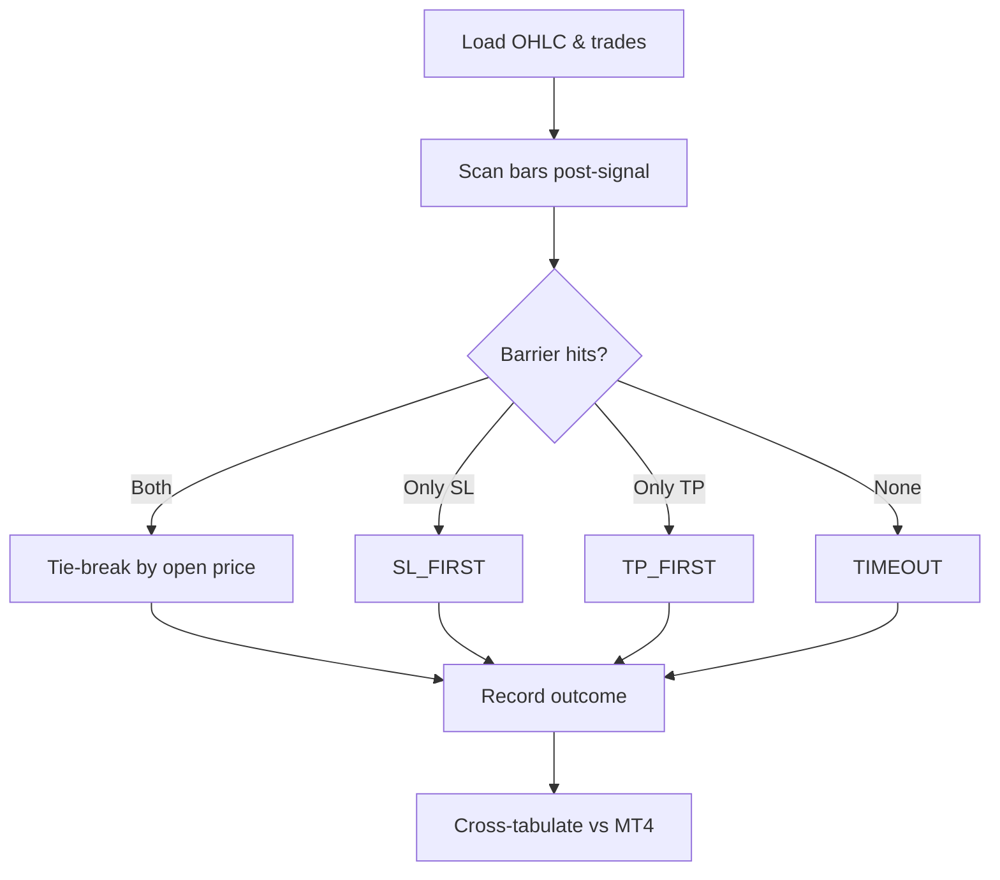
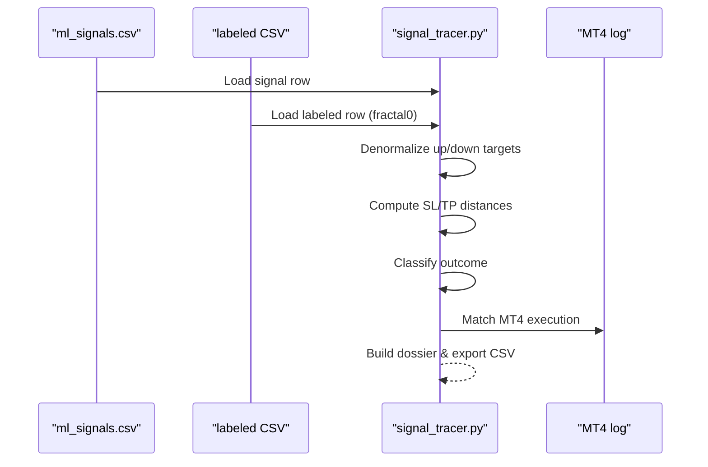
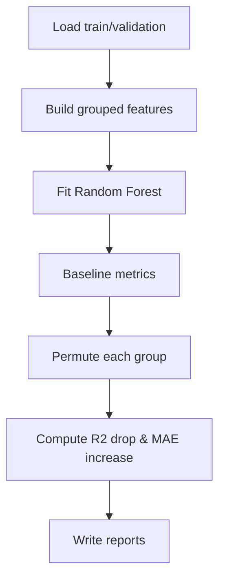
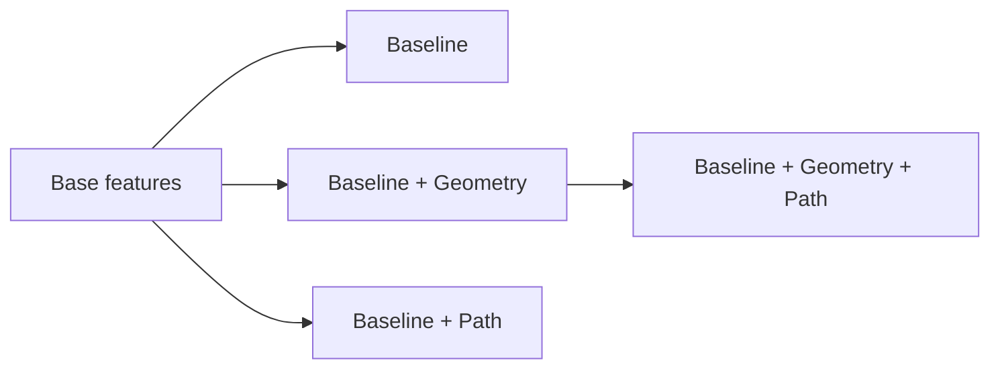
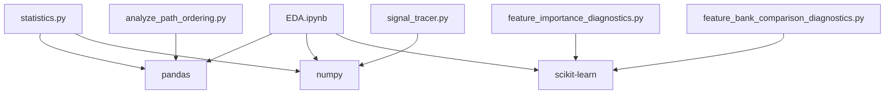

# Statistical Analysis and EDA

<cite>
**Referenced Files in This Document**
- [statistics.py](file://statistics/statistics.py)
- [EDA.ipynb](file://statistics/EDA.ipynb)
- [analyze_path_ordering.py](file://statistics/analyze_path_ordering.py)
- [signal_tracer.py](file://statistics/signal_tracer.py)
- [feature_importance_diagnostics.py](file://ML/feature_importance_diagnostics.py)
- [feature_bank_comparison_diagnostics.py](file://ML/feature_bank_comparison_diagnostics.py)
- [statistics_summary.json](file://statistics/statistics_summary.json)
- [class_statistics.json](file://statistics/class_statistics.json)
- [feature_catalog.json](file://statistics/feature_catalog.json)
- [README.md](file://statistics/README.md)
- [report.md](file://ML/reports/current_feature_importance/report.md)
- [report.md](file://ML/reports/feature_bank_comparison/report.md)
</cite>

## Table of Contents
1. [Introduction](#introduction)
2. [Project Structure](#project-structure)
3. [Core Components](#core-components)
4. [Architecture Overview](#architecture-overview)
5. [Detailed Component Analysis](#detailed-component-analysis)
6. [Dependency Analysis](#dependency-analysis)
7. [Performance Considerations](#performance-considerations)
8. [Troubleshooting Guide](#troubleshooting-guide)
9. [Conclusion](#conclusion)
10. [Appendices](#appendices)

## Introduction
This document presents a comprehensive statistical analysis framework for the SoSimple trading system. It covers exploratory data analysis (EDA), streaming statistics and reporting, feature importance diagnostics, path-ordering analysis, and reconciliation between machine learning predictions and MetaTrader4 execution. The goal is to provide practical guidance for performing statistical validation, interpreting results, and building robust automated reporting pipelines tailored to trading contexts.

## Project Structure
The statistical analysis pipeline spans three primary areas:
- Statistics module: streaming analytics, EDA notebooks, path-ordering diagnostics, and reconciliation tools
- ML diagnostics: feature importance and feature bank comparisons
- Reports and artifacts: JSON summaries, CSV distributions, and Markdown diagnostics

**Diagram sources**
- [statistics.py:1-477](file://statistics/statistics.py#L1-L477)
- [EDA.ipynb:1-800](file://statistics/EDA.ipynb#L1-L800)
- [analyze_path_ordering.py:1-197](file://statistics/analyze_path_ordering.py#L1-L197)
- [signal_tracer.py:1-800](file://statistics/signal_tracer.py#L1-L800)
- [feature_importance_diagnostics.py:1-439](file://ML/feature_importance_diagnostics.py#L1-L439)
- [feature_bank_comparison_diagnostics.py:1-245](file://ML/feature_bank_comparison_diagnostics.py#L1-L245)

**Section sources**
- [README.md:1-49](file://statistics/README.md#L1-L49)

## Core Components
- Streaming statistics engine: computes online mean, variance, min/max, and quantiles via Welford’s method and reservoir sampling; generates class distributions, feature summaries, and stratified samples
- EDA notebook: performs distribution analysis, class balance checks, and visualization of predictive targets and volatility features
- Path-ordering analyzer: determines whether stop or take-profit is hit first during bar-by-bar scanning and compares outcomes with MT4 results
- Signal tracer: reconciles ML predictions with MT4 execution logs, computes SL/TP distances, and classifies outcomes
- Feature importance diagnostics: builds grouped features from fractal sequences and evaluates group-wise importance via permutation tests
- Feature bank comparison: compares baseline feature sets augmented with geometry and path reaction banks

**Section sources**
- [statistics.py:51-442](file://statistics/statistics.py#L51-L442)
- [EDA.ipynb:150-800](file://statistics/EDA.ipynb#L150-L800)
- [analyze_path_ordering.py:43-197](file://statistics/analyze_path_ordering.py#L43-L197)
- [signal_tracer.py:149-497](file://statistics/signal_tracer.py#L149-L497)
- [feature_importance_diagnostics.py:260-336](file://ML/feature_importance_diagnostics.py#L260-L336)
- [feature_bank_comparison_diagnostics.py:107-158](file://ML/feature_bank_comparison_diagnostics.py#L107-L158)

## Architecture Overview
The statistical analysis architecture integrates data ingestion, streaming aggregation, diagnostics, and reporting into a cohesive workflow.

**Diagram sources**
- [statistics.py:208-442](file://statistics/statistics.py#L208-L442)
- [EDA.ipynb:150-800](file://statistics/EDA.ipynb#L150-L800)
- [analyze_path_ordering.py:78-197](file://statistics/analyze_path_ordering.py#L78-L197)
- [signal_tracer.py:608-800](file://statistics/signal_tracer.py#L608-L800)
- [feature_importance_diagnostics.py:260-336](file://ML/feature_importance_diagnostics.py#L260-L336)

## Detailed Component Analysis

### Streaming Statistics Engine
The streaming engine processes large CSV files in chunks, maintaining online statistics per feature and generating comprehensive summaries.

Key capabilities:
- Online mean/variance calculation per feature using Welford’s algorithm
- Quantile estimation via reservoir sampling with capped sample sizes
- Stratified sampling for rare classes and normal events
- Per-class statistics for the first fractal feature vector
- Aggregated numeric summaries for predictive targets and volatility measures

**Diagram sources**
- [statistics.py:51-167](file://statistics/statistics.py#L51-L167)

Practical workflow:
- Read CSV in chunks; parse fractal columns into structured feature vectors
- Update per-feature online statistics and collect stratified samples
- Aggregate numeric summaries for predictive targets and volatility measures
- Write JSON and CSV artifacts for downstream analysis

**Section sources**
- [statistics.py:51-167](file://statistics/statistics.py#L51-L167)
- [statistics.py:208-442](file://statistics/statistics.py#L208-L442)
- [statistics_summary.json:1-251](file://statistics/statistics_summary.json#L1-L251)
- [class_statistics.json:1-344](file://statistics/class_statistics.json#L1-L344)

### Exploratory Data Analysis (EDA)
The EDA notebook provides distributional insights, class balance diagnostics, and feature-level statistics for the labeled dataset.

Highlights:
- Distribution analysis for predictive targets and volatility indicators
- Class distribution visualization and imbalance assessment
- Feature-level descriptive statistics by class
- Visualization of distributions and boxplots for interpretability

**Diagram sources**
- [EDA.ipynb:150-800](file://statistics/EDA.ipynb#L150-L800)

**Section sources**
- [EDA.ipynb:150-800](file://statistics/EDA.ipynb#L150-L800)

### Path-Ordering Analysis
This component determines whether stop-loss or take-profit is hit first during bar-by-bar scanning and compares the results with MT4 outcomes.

Methodology:
- Scan OHLC bars after signal time up to a fixed horizon
- Determine first barrier hit based on high/low crossing and opening price tie-breakers
- Compare path-order outcomes with MT4 results and compute consistency metrics

**Diagram sources**
- [analyze_path_ordering.py:43-197](file://statistics/analyze_path_ordering.py#L43-L197)

**Section sources**
- [analyze_path_ordering.py:43-197](file://statistics/analyze_path_ordering.py#L43-L197)

### ML vs MT4 Reconciliation (Signal Tracer)
The signal tracer reconciles ML predictions with MT4 execution logs, computes SL/TP distances, and classifies outcomes.

Key steps:
- Parse ML signals and labeled CSV rows
- Denormalize up/down targets using per-row parameters
- Compute SL/TP distances using MT4 formulas and classify outcomes
- Export detailed dossiers and CSV exports for batch analysis

**Diagram sources**
- [signal_tracer.py:608-800](file://statistics/signal_tracer.py#L608-L800)

**Section sources**
- [signal_tracer.py:149-497](file://statistics/signal_tracer.py#L149-L497)
- [signal_tracer.py:608-800](file://statistics/signal_tracer.py#L608-L800)

### Feature Importance Diagnostics
This module builds grouped features from fractal sequences and evaluates group importance using permutation-based tests.

Workflow:
- Load train/validation samples and build grouped features (geometry, strength, path, etc.)
- Fit a Random Forest regressor and compute baseline metrics
- Evaluate group importance via permutation tests (R2 drop, MAE increase)
- Produce group and individual feature importance reports

**Diagram sources**
- [feature_importance_diagnostics.py:260-336](file://ML/feature_importance_diagnostics.py#L260-L336)

**Section sources**
- [feature_importance_diagnostics.py:260-336](file://ML/feature_importance_diagnostics.py#L260-L336)
- [report.md:1-71](file://ML/reports/current_feature_importance/report.md#L1-L71)

### Feature Bank Comparison
Compares baseline feature sets augmented with geometry and path reaction banks to assess incremental value.

Approach:
- Precompute base, geometry, and path feature parts once
- Assemble variants (baseline, baseline + geometry, baseline + path, baseline + geometry + path)
- Score each variant with Random Forest and rank by validation R2 and directional accuracy

**Diagram sources**
- [feature_bank_comparison_diagnostics.py:107-158](file://ML/feature_bank_comparison_diagnostics.py#L107-L158)

**Section sources**
- [feature_bank_comparison_diagnostics.py:107-158](file://ML/feature_bank_comparison_diagnostics.py#L107-L158)
- [report.md:1-32](file://ML/reports/feature_bank_comparison/report.md#L1-L32)

### Automated Reporting System
Automated reporting produces standardized artifacts for statistical insights:
- statistics_summary.json: online-derived feature summaries, class percentages, and target statistics
- class_statistics.json: per-class descriptive statistics for the first fractal feature vector
- feature_distributions.csv: feature-level descriptive statistics for reporting
- nero_sample_stratified.csv: stratified sample for manual inspection
- Feature importance reports: group and individual feature rankings with permutation metrics
- Feature bank comparison reports: comparative performance across feature bank variants
- Path-ordering analysis report: outcome cross-tabulations and consistency metrics

**Section sources**
- [statistics.py:286-442](file://statistics/statistics.py#L286-L442)
- [statistics_summary.json:1-251](file://statistics/statistics_summary.json#L1-L251)
- [class_statistics.json:1-344](file://statistics/class_statistics.json#L1-L344)
- [report.md:1-71](file://ML/reports/current_feature_importance/report.md#L1-L71)
- [report.md:1-32](file://ML/reports/feature_bank_comparison/report.md#L1-L32)
- [analyze_path_ordering.py:150-197](file://statistics/analyze_path_ordering.py#L150-L197)

## Dependency Analysis
The statistical analysis components depend on pandas, numpy, scikit-learn, and plotting libraries. The ML diagnostics rely on Random Forest for permutation-based importance.

**Diagram sources**
- [statistics.py:31-38](file://statistics/statistics.py#L31-L38)
- [EDA.ipynb:116-130](file://statistics/EDA.ipynb#L116-L130)
- [feature_importance_diagnostics.py:28-31](file://ML/feature_importance_diagnostics.py#L28-L31)
- [feature_bank_comparison_diagnostics.py:25-28](file://ML/feature_bank_comparison_diagnostics.py#L25-L28)

**Section sources**
- [statistics.py:31-38](file://statistics/statistics.py#L31-L38)
- [EDA.ipynb:116-130](file://statistics/EDA.ipynb#L116-L130)
- [feature_importance_diagnostics.py:28-31](file://ML/feature_importance_diagnostics.py#L28-L31)
- [feature_bank_comparison_diagnostics.py:25-28](file://ML/feature_bank_comparison_diagnostics.py#L25-L28)

## Performance Considerations
- Streaming statistics: O(1) memory per feature; suitable for large datasets
- Reservoir sampling: constant memory overhead for quantile estimation
- Chunked CSV processing: reduces peak memory usage
- Permutation importance: computationally intensive; tune n_estimators and chunk sizes accordingly
- Visualization: save plots to disk to avoid rendering overhead in automated runs

## Troubleshooting Guide
Common issues and resolutions:
- Missing fractal columns: ensure CSV contains expected fractal fields; parsing will skip malformed rows
- Class imbalance: verify class distribution and adjust sampling strategies
- MT4 log parsing: confirm log format matches expected patterns; handle missing fields gracefully
- Memory pressure: reduce chunk sizes or limit feature sets in diagnostics
- Inconsistent outcomes: validate barrier thresholds and tie-break rules in path-ordering analysis

**Section sources**
- [statistics.py:170-207](file://statistics/statistics.py#L170-L207)
- [signal_tracer.py:691-800](file://statistics/signal_tracer.py#L691-L800)
- [analyze_path_ordering.py:24-75](file://statistics/analyze_path_ordering.py#L24-L75)

## Conclusion
The SoSimple statistical analysis framework provides a robust foundation for validating trading features, understanding class distributions, and reconciling model predictions with execution outcomes. By leveraging streaming statistics, EDA, path-ordering diagnostics, and ML feature importance assessments, teams can iteratively refine feature sets and improve model performance while maintaining transparency and reproducibility.

## Appendices

### Practical Statistical Analysis Workflows
- Streaming statistics: process labeled CSV in chunks, compute online summaries, and export JSON/CSV artifacts
- EDA: load labeled dataset, compute descriptive statistics, and generate distribution visualizations
- Path-ordering: scan OHLC after signals, classify outcomes, and compare with MT4 results
- Feature diagnostics: build grouped features, fit models, and evaluate importance via permutation tests
- Automated reporting: produce standardized JSON/CSV/Markdown artifacts for review and auditing

**Section sources**
- [statistics.py:208-442](file://statistics/statistics.py#L208-L442)
- [EDA.ipynb:150-800](file://statistics/EDA.ipynb#L150-L800)
- [analyze_path_ordering.py:78-197](file://statistics/analyze_path_ordering.py#L78-L197)
- [feature_importance_diagnostics.py:260-336](file://ML/feature_importance_diagnostics.py#L260-L336)
- [feature_bank_comparison_diagnostics.py:107-158](file://ML/feature_bank_comparison_diagnostics.py#L107-L158)

### Statistical Significance and Uncertainty
- Use permutation-based importance to estimate uncertainty in group contributions
- Apply stratified sampling to maintain class balance in reporting subsets
- Track confidence in path-ordering outcomes via cross-tabulation and consistency metrics
- Report effect sizes (e.g., mean differences) alongside significance indicators

[No sources needed since this section provides general guidance]