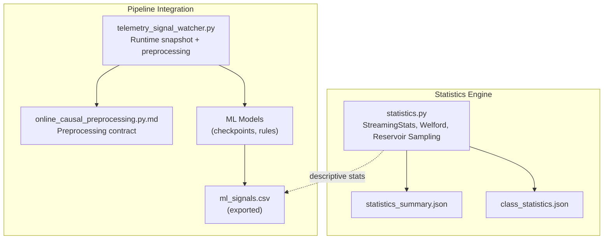
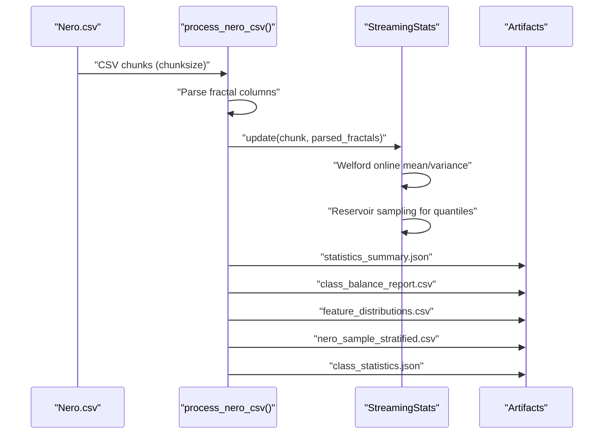
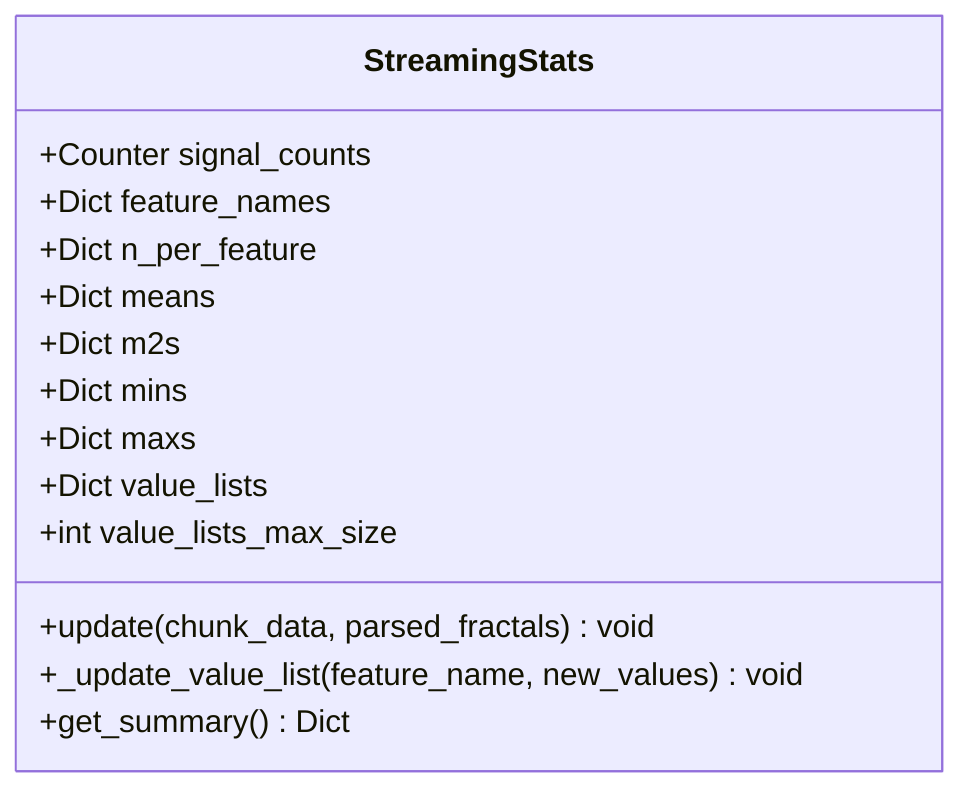
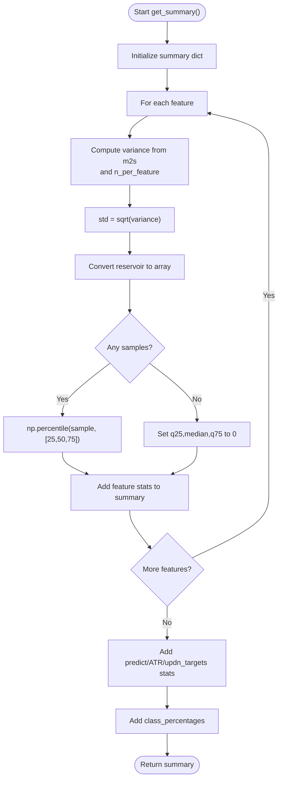
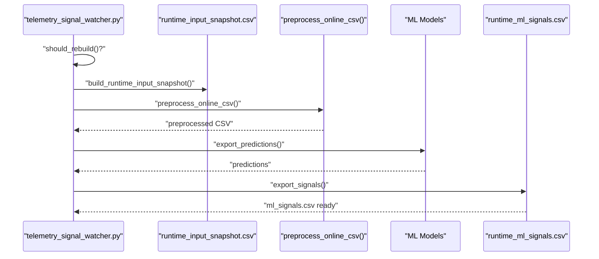
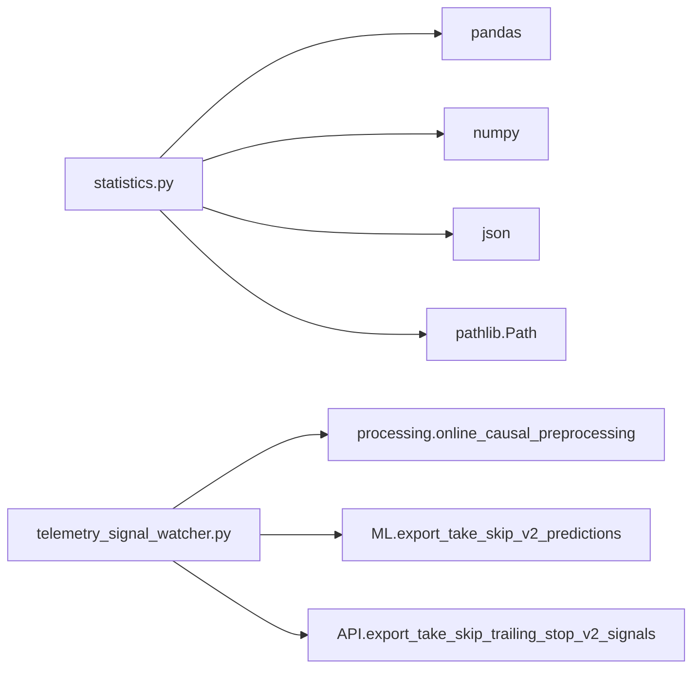

# Streaming Statistics and Metrics

<cite>
**Referenced Files in This Document**
- [statistics.py](file://statistics/statistics.py)
- [signal_tracer.py](file://statistics/signal_tracer.py)
- [README.md](file://statistics/README.md)
- [statistics_summary.json](file://statistics/statistics_summary.json)
- [class_statistics.json](file://statistics/class_statistics.json)
- [telemetry_signal_watcher.py](file://API/telemetry_signal_watcher.py)
- [online_causal_preprocessing.py.md](file://docs/processing/online_causal_preprocessing.py.md)
- [Exponential.mqh](file://MT/MQL5/Include/Math/Stat/Exponential.mqh)
- [statistics.py.md](file://docs/statistics/statistics.py.md)
</cite>

## Table of Contents
1. [Introduction](#introduction)
2. [Project Structure](#project-structure)
3. [Core Components](#core-components)
4. [Architecture Overview](#architecture-overview)
5. [Detailed Component Analysis](#detailed-component-analysis)
6. [Dependency Analysis](#dependency-analysis)
7. [Performance Considerations](#performance-considerations)
8. [Troubleshooting Guide](#troubleshooting-guide)
9. [Conclusion](#conclusion)
10. [Appendices](#appendices)

## Introduction
This document describes the streaming statistics system in SoSimple, focusing on:
- Welford's online algorithm for incremental mean and variance
- Reservoir sampling for large-scale quantile estimation
- Real-time performance metrics generation
- Statistical summaries including rolling windows, exponential smoothing, and confidence estimation
- Integration with the data processing pipeline and automated telemetry reporting
- Practical workflows for monitoring, benchmarking, and anomaly detection in real-time trading contexts

The system is designed to process massive CSV datasets incrementally, maintaining bounded memory usage while generating comprehensive descriptive statistics and supporting downstream ML and trading workflows.

## Project Structure
The streaming statistics module resides under statistics/ and integrates with the broader ML and API subsystems:
- statistics.py: Streaming statistics engine implementing Welford and Reservoir Sampling
- signal_tracer.py: Trade-level reconciliation and diagnostics (complementary to statistics)
- telemetry_signal_watcher.py: Live pipeline orchestrating preprocessing, inference, and signal export
- Output artifacts: statistics_summary.json, class_statistics.json, and CSV reports
- Documentation: inline docs and rendered explanations

**Diagram sources**
- [statistics.py:51-167](file://statistics/statistics.py#L51-L167)
- [telemetry_signal_watcher.py:203-302](file://API/telemetry_signal_watcher.py#L203-L302)
- [online_causal_preprocessing.py.md:1-33](file://docs/processing/online_causal_preprocessing.py.md#L1-L33)

**Section sources**
- [README.md:1-49](file://statistics/README.md#L1-L49)

## Core Components
- StreamingStats: Maintains per-feature online means/variances via Welford, tracks min/max, and collects a reservoir sample for quantile estimation.
- Reservoir sampling: Fixed-size reservoir with uniform replacement probability to estimate percentiles without storing all values.
- Chunked CSV processing: Pandas chunk iterator to process large files without loading entirely into memory.
- Summary generation: Aggregates per-feature stats, class distributions, and derived numeric fields (predict, ATR, updn targets).
- Output artifacts: JSON and CSV reports for downstream consumption.

Key implementation references:
- Welford update loop and variance calculation: [statistics.py:96-108](file://statistics/statistics.py#L96-L108)
- Reservoir sampling update: [statistics.py:112-131](file://statistics/statistics.py#L112-L131)
- Summary computation and quantiles: [statistics.py:132-167](file://statistics/statistics.py#L132-L167)
- Chunked processing and stratified sampling: [statistics.py:208-442](file://statistics/statistics.py#L208-L442)

**Section sources**
- [statistics.py:51-167](file://statistics/statistics.py#L51-L167)
- [statistics.py:208-442](file://statistics/statistics.py#L208-L442)

## Architecture Overview
The streaming statistics pipeline operates as follows:
- Input: Large labeled CSV (Nero_train_labeled.csv) with fractal columns and optional numeric fields
- Processing: Iterative chunk parsing, fractal column extraction, per-chunk updates to StreamingStats
- Outputs: JSON and CSV artifacts for statistical summaries and class diagnostics
- Integration: Runtime telemetry watcher builds snapshots, applies causal preprocessing, runs inference, and exports signals for real-time monitoring

**Diagram sources**
- [statistics.py:208-442](file://statistics/statistics.py#L208-L442)
- [statistics.py:51-167](file://statistics/statistics.py#L51-L167)

## Detailed Component Analysis

### StreamingStats: Welford's Online Algorithm and Reservoir Sampling
StreamingStats maintains:
- Per-feature counters: n_per_feature, means, m2s (sum of squared deviations), mins, maxs
- Per-feature reservoir lists for quantile estimation
- Fixed-size reservoir with uniform random replacement

**Diagram sources**
- [statistics.py:51-167](file://statistics/statistics.py#L51-L167)

Welford’s algorithm:
- Incremental mean update: delta = x − mean, mean = mean + delta / n
- Variance accumulation: m2 = m2 + delta × (x − mean)
- Standard deviation: sqrt(m2 / (n − 1))

Reservoir sampling:
- Fill reservoir until capacity
- After seeing n values, replace each existing element with probability k/n

Practical implications:
- Memory: O(1) per feature for Welford; O(k) for reservoir per feature
- Numerical stability: Welford reduces catastrophic cancellation
- Scalability: Works for unlimited stream length

**Section sources**
- [statistics.py:96-131](file://statistics/statistics.py#L96-L131)
- [statistics.py.md:43-94](file://docs/statistics/statistics.py.md#L43-L94)

### Statistical Summary Generation
The summary consolidates:
- Total samples and class distribution
- Per-feature descriptive statistics: mean, std, min, max, q25, median, q75
- Optional numeric fields: predict, ATR, updn_targets
- Class-wise statistics for the first fractal feature set

**Diagram sources**
- [statistics.py:132-167](file://statistics/statistics.py#L132-L167)

Outputs:
- statistics_summary.json: Complete summary with derived numeric fields
- class_statistics.json: First-fractal feature stats grouped by class
- CSV reports for balance and distributions

**Section sources**
- [statistics.py:132-322](file://statistics/statistics.py#L132-L322)
- [statistics_summary.json:1-251](file://statistics/statistics_summary.json#L1-L251)
- [class_statistics.json:1-344](file://statistics/class_statistics.json#L1-L344)

### Integration with Data Processing Pipeline and Automated Reporting
The telemetry signal watcher coordinates runtime ingestion and inference:
- Builds a recent snapshot from the source CSV
- Applies causal preprocessing to ensure no future-derived leakage
- Runs inference using ML checkpoints and rules
- Exports signals for downstream consumption

**Diagram sources**
- [telemetry_signal_watcher.py:203-302](file://API/telemetry_signal_watcher.py#L203-L302)
- [online_causal_preprocessing.py.md:1-33](file://docs/processing/online_causal_preprocessing.py.md#L1-L33)

Operational contracts:
- Live-safe preprocessing prevents future-derived features in online mode
- Contract guard blocks unsafe feature sets by default

**Section sources**
- [telemetry_signal_watcher.py:180-200](file://API/telemetry_signal_watcher.py#L180-L200)
- [online_causal_preprocessing.py.md:1-33](file://docs/processing/online_causal_preprocessing.py.md#L1-L33)

### Real-Time Performance Metrics and Confidence Estimation
While the streaming engine focuses on descriptive statistics, confidence intervals and rolling metrics can be derived from the computed moments:
- Standard error: σ / sqrt(n)
- Bootstrap-style quantile estimation: Use reservoir samples to approximate percentiles
- Rolling windows: Apply vectorized rolling functions on sequences of recent observations (see ML feature engineering for examples)

Note: The repository does not implement explicit confidence intervals or exponential moving averages in the statistics module. These can be added by extending the summary computation to include rolling means/std and exponentially weighted variants.

**Section sources**
- [statistics.py:145-167](file://statistics/statistics.py#L145-L167)

### Trade-Level Reconciliation and Diagnostics
The signal tracer complements streaming statistics by reconciling Python-side computations with MT4 outcomes:
- Loads signals, labeled rows, and updn parameters
- Computes SL/TP distances and outcome categories
- Produces detailed dossiers for diagnosis

This supports anomaly detection workflows by highlighting mismatches between predicted and realized outcomes.

**Section sources**
- [signal_tracer.py:1-120](file://statistics/signal_tracer.py#L1-L120)
- [signal_tracer.py:240-385](file://statistics/signal_tracer.py#L240-L385)

## Dependency Analysis
- Internal dependencies:
  - statistics.py depends on pandas, numpy, json, pathlib, collections
  - telemetry_signal_watcher.py depends on preprocessing and ML exporters
- External dependencies:
  - MQL5 Alglib statistics classes for offline reference (not used in streaming engine)
  - MQL5 Exponential moments for theoretical reference

**Diagram sources**
- [statistics.py:31-38](file://statistics/statistics.py#L31-L38)
- [telemetry_signal_watcher.py:38-40](file://API/telemetry_signal_watcher.py#L38-L40)

**Section sources**
- [statistics.py:31-38](file://statistics/statistics.py#L31-L38)
- [telemetry_signal_watcher.py:38-40](file://API/telemetry_signal_watcher.py#L38-L40)

## Performance Considerations
- Memory efficiency:
  - Welford maintains constant memory per feature
  - Reservoir sampling caps memory at fixed capacity per feature
  - Chunked CSV processing avoids loading entire dataset
- Throughput:
  - Vectorized operations on parsed arrays improve speed
  - Minimal intermediate copies; direct aggregation
- Numerical stability:
  - Welford reduces error accumulation compared to two-pass formulas
- Scalability:
  - Linear pass over data; suitable for real-time streaming
  - Output artifacts enable offline analysis and reporting

[No sources needed since this section provides general guidance]

## Troubleshooting Guide
Common issues and resolutions:
- Missing input file: Ensure the labeled CSV exists and is readable
- Empty chunks: Verify chunksize and CSV formatting
- Inconsistent feature counts: Validate fractal column parsing and feature names
- Contract violations in online mode: Use live-safe preprocessing and avoid future-derived features

Diagnostic aids:
- Heartbeat logging in telemetry watcher indicates processing status
- Stratified sampling helps maintain class balance for representative analysis

**Section sources**
- [telemetry_signal_watcher.py:114-126](file://API/telemetry_signal_watcher.py#L114-L126)
- [statistics.py:272-282](file://statistics/statistics.py#L272-L282)

## Conclusion
SoSimple’s streaming statistics system provides a robust, memory-efficient foundation for real-time financial data analysis. By combining Welford’s online algorithm with reservoir sampling, it enables accurate descriptive statistics over massive datasets. Integration with the telemetry pipeline ensures that live monitoring and automated reporting remain feasible and safe. Extending the system with rolling windows, exponential smoothing, and explicit confidence intervals would further enhance its capabilities for real-time trading applications.

[No sources needed since this section summarizes without analyzing specific files]

## Appendices

### Practical Workflows

- Statistical monitoring:
  - Run the statistics module to generate summary reports and stratified samples
  - Use statistics_summary.json and class_statistics.json for model health checks

- Performance benchmarking:
  - Compare rolling window features and trend indicators (vectorized) to assess recent behavior
  - Evaluate trade outcomes using signal tracer diagnostics

- Anomaly detection:
  - Flag outliers based on z-scores or percentile ranks from reservoir samples
  - Monitor class imbalance and feature drift using periodic summaries

[No sources needed since this section provides general guidance]