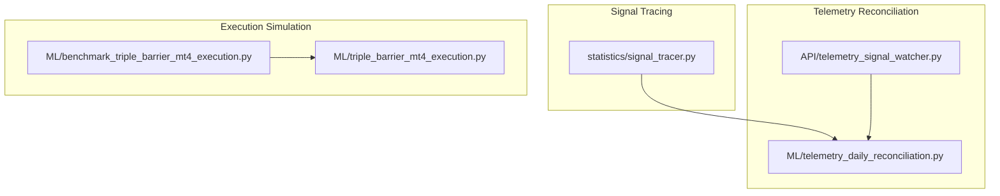
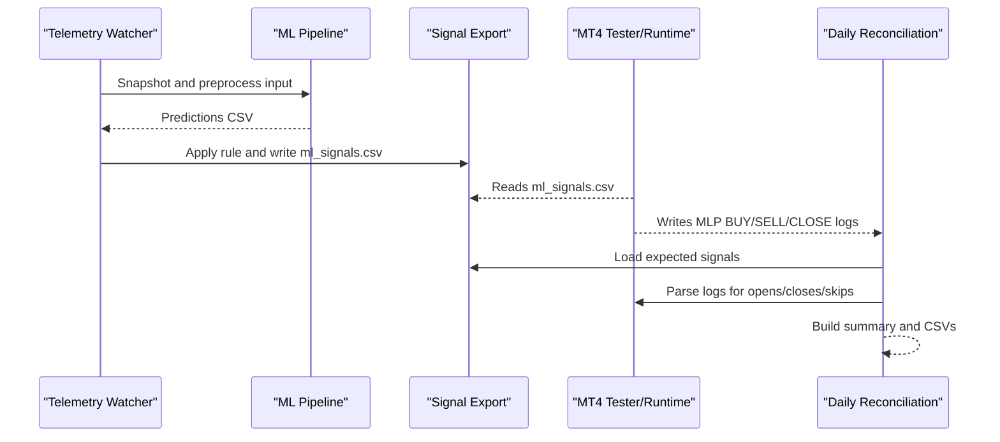
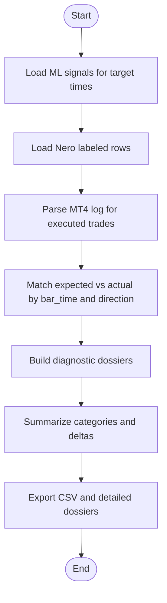
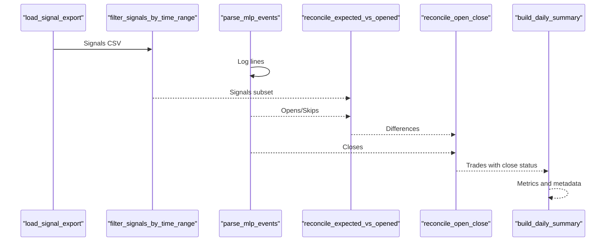
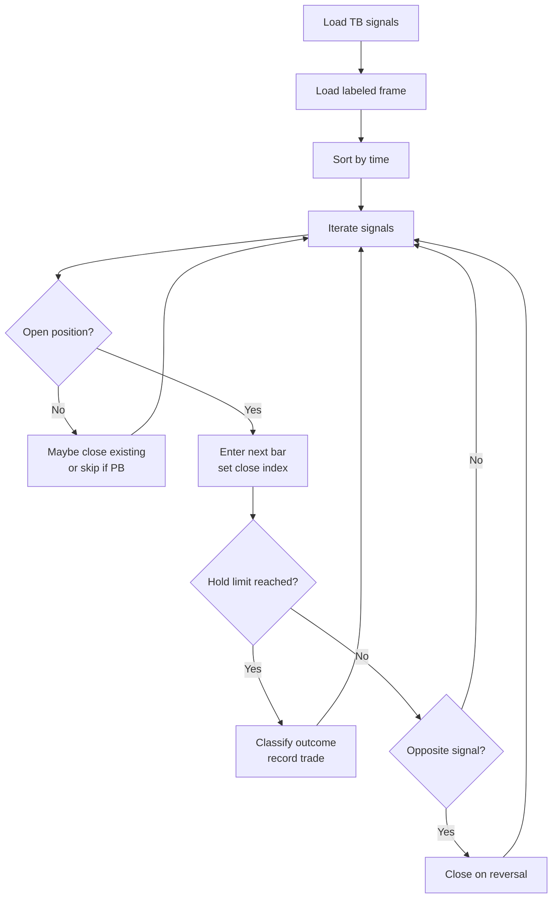
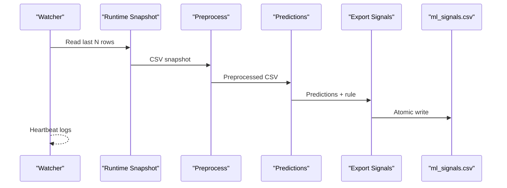
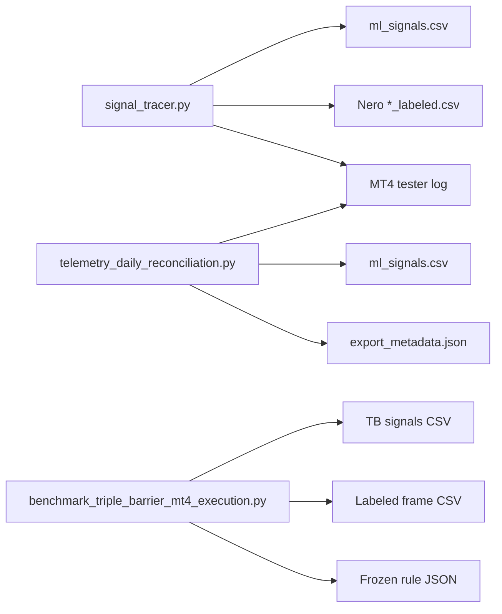

# Trade Reconciliation and Signal Tracing

<cite>
**Referenced Files in This Document**
- [statistics/signal_tracer.py](file://statistics/signal_tracer.py)
- [ML/telemetry_daily_reconciliation.py](file://ML/telemetry_daily_reconciliation.py)
- [ML/benchmark_triple_barrier_mt4_execution.py](file://ML/benchmark_triple_barrier_mt4_execution.py)
- [ML/triple_barrier_mt4_execution.py](file://ML/triple_barrier_mt4_execution.py)
- [API/telemetry_signal_watcher.py](file://API/telemetry_signal_watcher.py)
- [docs/reports/2026-04-27-telemetry-frequency-demo-launch.md](file://docs/reports/2026-04-27-telemetry-frequency-demo-launch.md)
- [docs/reports/2026-04-22-signal-export-parity.md](file://docs/reports/2026-04-22-signal-export-parity.md)
- [docs/superpowers/plans/2026-04-09-mt4-execution-trade-selection.md](file://docs/superpowers/plans/2026-04-09-mt4-execution-trade-selection.md)
- [tests/test_telemetry_daily_reconciliation.py](file://tests/test_telemetry_daily_reconciliation.py)
- [tests/test_triple_barrier_mt4_execution.py](file://tests/test_triple_barrier_mt4_execution.py)
- [wiki/research/execution-tracks.md](file://wiki/research/execution-tracks.md)
</cite>

## Table of Contents
1. [Introduction](#introduction)
2. [Project Structure](#project-structure)
3. [Core Components](#core-components)
4. [Architecture Overview](#architecture-overview)
5. [Detailed Component Analysis](#detailed-component-analysis)
6. [Dependency Analysis](#dependency-analysis)
7. [Performance Considerations](#performance-considerations)
8. [Troubleshooting Guide](#troubleshooting-guide)
9. [Conclusion](#conclusion)
10. [Appendices](#appendices)

## Introduction
This document describes the trade reconciliation and signal tracing system that validates ML-to-MT4 execution parity and operational reliability. It explains:
- How ML signals are compared to MT4 execution outcomes
- Timestamp alignment and trade matching algorithms
- Performance discrepancy analysis and reconciliation metrics
- Individual trade analysis workflows, batch top-N signal processing, and MT4 log parsing for loss analysis
- Automated reporting and daily reconciliation dashboards

The system supports two complementary reconciliation modes:
- Trade-level reconciliation for individual and batched trades
- Daily telemetry reconciliation for high-frequency signal exports and MT4 logs

## Project Structure
The reconciliation system spans three primary areas:
- Signal tracing and diagnostics for ML vs MT4 trade-level parity
- Telemetry-based daily reconciliation for frequent signal exports
- Execution simulation and benchmarking for MT4-style trade modeling

**Diagram sources**
- [statistics/signal_tracer.py:1-1127](file://statistics/signal_tracer.py#L1-L1127)
- [ML/telemetry_daily_reconciliation.py:1-364](file://ML/telemetry_daily_reconciliation.py#L1-L364)
- [API/telemetry_signal_watcher.py:1-422](file://API/telemetry_signal_watcher.py#L1-L422)
- [ML/benchmark_triple_barrier_mt4_execution.py:1-105](file://ML/benchmark_triple_barrier_mt4_execution.py#L1-L105)
- [ML/triple_barrier_mt4_execution.py:1-169](file://ML/triple_barrier_mt4_execution.py#L1-L169)

**Section sources**
- [statistics/signal_tracer.py:1-1127](file://statistics/signal_tracer.py#L1-L1127)
- [ML/telemetry_daily_reconciliation.py:1-364](file://ML/telemetry_daily_reconciliation.py#L1-L364)
- [API/telemetry_signal_watcher.py:1-422](file://API/telemetry_signal_watcher.py#L1-L422)
- [ML/benchmark_triple_barrier_mt4_execution.py:1-105](file://ML/benchmark_triple_barrier_mt4_execution.py#L1-L105)
- [ML/triple_barrier_mt4_execution.py:1-169](file://ML/triple_barrier_mt4_execution.py#L1-L169)

## Core Components
- Signal tracer: Parses MT4 logs, loads ML signals and ground truth, builds diagnostic dossiers, and supports single-trace, batch, and log-based reconciliation.
- Telemetry daily reconciliation: Compares expected signals from exports with actual MT4 open/close events and produces structured summaries and CSVs.
- Execution simulation: Benchmarks MT4-style trade execution using triple barrier labels and computes performance metrics.
- Telemetry watcher: Observably rebuilds ML predictions and signals from live MT4 input and writes atomic CSV updates.

Key capabilities:
- Timestamp alignment via bar-time matching and EA entry-on-next-bar semantics
- Trade matching by signal_time and direction
- Performance metrics: PF, win rate, net PnL ATR, critical mismatches, missing closes
- Automated reporting with markdown and CSV outputs

**Section sources**
- [statistics/signal_tracer.py:610-1127](file://statistics/signal_tracer.py#L610-L1127)
- [ML/telemetry_daily_reconciliation.py:132-364](file://ML/telemetry_daily_reconciliation.py#L132-L364)
- [ML/triple_barrier_mt4_execution.py:60-169](file://ML/triple_barrier_mt4_execution.py#L60-L169)
- [API/telemetry_signal_watcher.py:203-327](file://API/telemetry_signal_watcher.py#L203-L327)

## Architecture Overview
The reconciliation architecture integrates ML predictions, MT4 runtime logs, and telemetry exports into a unified validation pipeline.

**Diagram sources**
- [API/telemetry_signal_watcher.py:203-327](file://API/telemetry_signal_watcher.py#L203-L327)
- [ML/telemetry_daily_reconciliation.py:290-328](file://ML/telemetry_daily_reconciliation.py#L290-L328)

**Section sources**
- [docs/reports/2026-04-27-telemetry-frequency-demo-launch.md:69-117](file://docs/reports/2026-04-27-telemetry-frequency-demo-launch.md#L69-L117)
- [API/telemetry_signal_watcher.py:304-327](file://API/telemetry_signal_watcher.py#L304-L327)
- [ML/telemetry_daily_reconciliation.py:290-328](file://ML/telemetry_daily_reconciliation.py#L290-L328)

## Detailed Component Analysis

### Signal Tracer: ML vs MT4 Trade-Level Reconciliation
The signal tracer performs three reconciliation modes:
- Single-trace: Find a specific signal time and build a detailed dossier comparing ML formulas, ground truth, and MT4 outcomes.
- Batch: Select top-N signals meeting a minimum confidence threshold and produce a summary table and CSV.
- From-log: Parse MT4 tester logs to reconcile executed trades with expected signals and ground truth.

Timestamp alignment and matching:
- EA opens positions on the bar following the signal bar; the tracer attempts T and T-1 alignment.
- MT4 log entries are parsed for MLP BUY/SELL and CLOSE events keyed by bar_time and direction.

Ground truth and diagnostics:
- Legacy ML tracks: SL/TP formulas replicate MT4 logic precisely.
- Triple Barrier tracks: Outcome labels are taken from path-ordered TB labels.
- Denormalization of up/down targets per row using per-row breakpoints and caps.
- Lag bias calculation measures time between signal formation and execution.

**Diagram sources**
- [statistics/signal_tracer.py:812-945](file://statistics/signal_tracer.py#L812-L945)
- [statistics/signal_tracer.py:949-1057](file://statistics/signal_tracer.py#L949-L1057)

**Section sources**
- [statistics/signal_tracer.py:610-1127](file://statistics/signal_tracer.py#L610-L1127)

### Telemetry Daily Reconciliation: High-Frequency Export Parity
The daily reconciliation compares:
- Expected signals from exported CSV (time;signal)
- Actual MT4 opens/closes/skips parsed from logs
- Optional export metadata for integrity checks

Key steps:
- Load and deduplicate exported signals by keeping the last record per time.
- Filter by optional time range.
- Parse MLP events from logs and reconcile expected vs opened.
- Link open tickets to close events to detect missing closes.
- Build summary metrics and render markdown.

**Diagram sources**
- [ML/telemetry_daily_reconciliation.py:132-328](file://ML/telemetry_daily_reconciliation.py#L132-L328)

**Section sources**
- [ML/telemetry_daily_reconciliation.py:132-364](file://ML/telemetry_daily_reconciliation.py#L132-L364)
- [docs/reports/2026-04-27-telemetry-frequency-demo-launch.md:78-117](file://docs/reports/2026-04-27-telemetry-frequency-demo-launch.md#L78-L117)

### Execution Simulation and Benchmarking (Triple Barrier)
The triple barrier execution simulator replicates MT4 behavior:
- Loads signals and labeled frames
- Simulates entry on the next bar, applies hold windows, and classifies outcomes
- Computes PF, win rate, and yearly summaries

**Diagram sources**
- [ML/triple_barrier_mt4_execution.py:60-149](file://ML/triple_barrier_mt4_execution.py#L60-L149)

**Section sources**
- [ML/benchmark_triple_barrier_mt4_execution.py:20-101](file://ML/benchmark_triple_barrier_mt4_execution.py#L20-L101)
- [ML/triple_barrier_mt4_execution.py:31-169](file://ML/triple_barrier_mt4_execution.py#L31-L169)

### Telemetry Watcher: Observable Live Pipeline
The telemetry watcher:
- Periodically reads the latest rows from MT4-generated input CSV
- Builds runtime snapshots and preprocesses inputs
- Runs ML inference and exports filtered signals
- Writes atomic ml_signals.csv and emits heartbeat logs

**Diagram sources**
- [API/telemetry_signal_watcher.py:203-327](file://API/telemetry_signal_watcher.py#L203-L327)

**Section sources**
- [API/telemetry_signal_watcher.py:203-327](file://API/telemetry_signal_watcher.py#L203-L327)
- [docs/API/telemetry_signal_watcher.py.md:146-186](file://docs/API/telemetry_signal_watcher.py.md#L146-L186)

## Dependency Analysis
- Signal tracer depends on:
  - ML signal CSV (time;signal;pred_up;pred_dn;ratio_up;ratio_dn;sl_atr;tp_atr;prob;ev)
  - Nero labeled CSV (fractal0; up_12; dn_12; ATR; path-ordered TB labels)
  - MT4 tester log for executed trades
- Telemetry daily reconciliation depends on:
  - Exported CSV (time;signal)
  - MT4 log with MLP events
  - Optional export metadata JSON
- Execution benchmark depends on:
  - TB signals CSV
  - Labeled frame CSV
  - Frozen rule JSON

**Diagram sources**
- [statistics/signal_tracer.py:610-641](file://statistics/signal_tracer.py#L610-L641)
- [ML/telemetry_daily_reconciliation.py:132-141](file://ML/telemetry_daily_reconciliation.py#L132-L141)
- [ML/benchmark_triple_barrier_mt4_execution.py:31-39](file://ML/benchmark_triple_barrier_mt4_execution.py#L31-L39)

**Section sources**
- [statistics/signal_tracer.py:610-641](file://statistics/signal_tracer.py#L610-L641)
- [ML/telemetry_daily_reconciliation.py:132-141](file://ML/telemetry_daily_reconciliation.py#L132-L141)
- [ML/benchmark_triple_barrier_mt4_execution.py:31-39](file://ML/benchmark_triple_barrier_mt4_execution.py#L31-L39)

## Performance Considerations
- Timestamp alignment: EA entry occurs on the bar after the signal bar; the tracer attempts T and T-1 matches to minimize false negatives.
- Duplicate handling: Export CSV deduplication keeps the last record per time to align with MT4 runtime behavior.
- Time filtering: Optional start/end time filters enable focused reconciliation windows.
- Non-zero exit code: Daily reconciliation exits with non-zero status when critical mismatches are detected, enabling CI/CD gating.

[No sources needed since this section provides general guidance]

## Troubleshooting Guide
Common issues and resolutions:
- Missing expected signal opens:
  - Cause: Position blocked, score filters, or export metadata mismatch.
  - Action: Inspect skipped reasons and reconcile with export metadata.
- Wrong direction opens:
  - Cause: Opposite signal within hold window or direction mismatch.
  - Action: Verify signal_time and direction pairing; check hold window logic.
- Missing closes:
  - Cause: Tester ended with open positions.
  - Action: Confirm missing close count and ensure full period coverage.
- Export parity discrepancies:
  - Cause: Multiple rows per time in DATA; MT4 operates on time;signal pairs.
  - Action: Use parity benchmark to quantify duplicates and opened trades.

Validation utilities:
- Unit tests for daily reconciliation validate outputs and non-zero exit code behavior.
- Triple barrier execution tests validate MT4-style simulation and outcomes.

**Section sources**
- [tests/test_telemetry_daily_reconciliation.py:128-159](file://tests/test_telemetry_daily_reconciliation.py#L128-L159)
- [tests/test_triple_barrier_mt4_execution.py:13-45](file://tests/test_triple_barrier_mt4_execution.py#L13-L45)
- [docs/reports/2026-04-22-signal-export-parity.md:98-139](file://docs/reports/2026-04-22-signal-export-parity.md#L98-L139)

## Conclusion
The reconciliation system provides robust parity checks between ML predictions and MT4 execution outcomes. It offers:
- Trade-level diagnostics for individual and batched signals
- High-frequency telemetry reconciliation with automated reporting
- MT4-style execution simulation for performance benchmarking
- Observable live pipeline with heartbeat monitoring

These capabilities support continuous validation, rapid troubleshooting, and reliable operational dashboards.

[No sources needed since this section summarizes without analyzing specific files]

## Appendices

### Reconciliation Metrics and Definitions
- expected_signals: Count of non-zero signals in exported CSV
- opened_trades: Count of MLP BUY/SELL events
- closed_trades: Count of MLP CLOSE events
- critical_mismatch_count: Count of critical mismatches (e.g., missing open, wrong direction)
- missing_close_count: Count of open positions at end of period
- PF: Profit factor computed from ATR PnL
- net_pnl_atr: Net PnL in ATR terms
- win_rate: Fraction of winning trades

**Section sources**
- [ML/telemetry_daily_reconciliation.py:252-287](file://ML/telemetry_daily_reconciliation.py#L252-L287)

### Practical Workflows

#### Individual Trade Analysis
- Use single-trace mode to diagnose a specific signal time:
  - Align signal time with EA entry semantics
  - Compare MT4 SL/TP vs ML formulas and ground truth
  - Export detailed dossier for manual review

**Section sources**
- [statistics/signal_tracer.py:949-973](file://statistics/signal_tracer.py#L949-L973)

#### Batch Top-N Signal Processing
- Filter signals by minimum confidence and select top-N
- Load corresponding Nero rows and compute lag bias and outcome categories
- Export CSV for downstream analysis

**Section sources**
- [statistics/signal_tracer.py:977-1057](file://statistics/signal_tracer.py#L977-L1057)

#### MT4 Log Parsing for Loss Analysis
- Parse tester logs for MLP events
- Filter to losses-only for focused diagnostics
- Export CSV with MT4 results and formula deltas

**Section sources**
- [statistics/signal_tracer.py:812-945](file://statistics/signal_tracer.py#L812-L945)

#### Automated Reporting and Dashboards
- Daily reconciliation outputs:
  - summary.json and summary.md
  - signals_diff.csv and trades_reconciliation.csv
- Non-zero exit code flags critical issues for CI/CD

**Section sources**
- [ML/telemetry_daily_reconciliation.py:322-328](file://ML/telemetry_daily_reconciliation.py#L322-L328)
- [tests/test_telemetry_daily_reconciliation.py:128-133](file://tests/test_telemetry_daily_reconciliation.py#L128-L133)

### Execution Discrepancy Analysis
- MT4 execution parity validated via:
  - Trade simulator with MT4-style rules
  - Triple barrier benchmark comparing outcomes and hold windows
  - MT4 runtime verdicts and hardening iterations

**Section sources**
- [docs/superpowers/plans/2026-04-09-mt4-execution-trade-selection.md:217-311](file://docs/superpowers/plans/2026-04-09-mt4-execution-trade-selection.md#L217-L311)
- [tests/test_triple_barrier_mt4_execution.py:31-45](file://tests/test_triple_barrier_mt4_execution.py#L31-L45)
- [wiki/research/execution-tracks.md:35-718](file://wiki/research/execution-tracks.md#L35-L718)