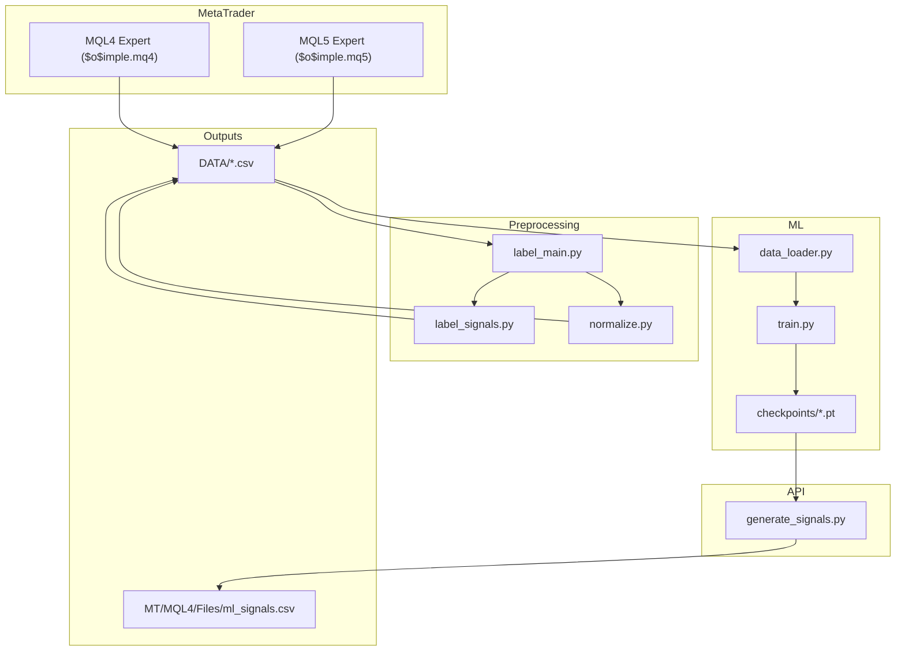
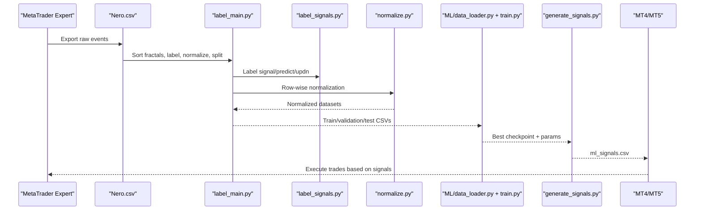
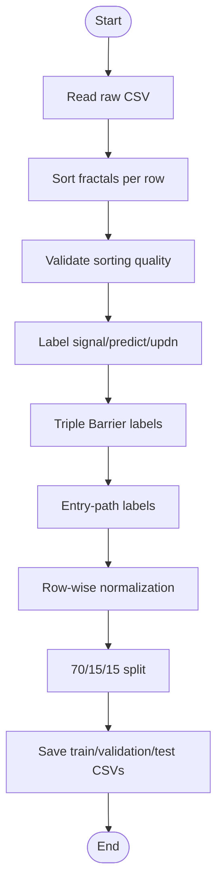
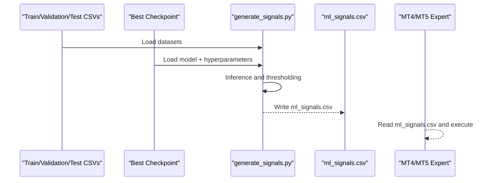
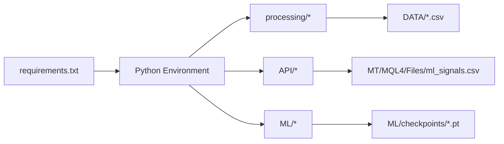

# Getting Started

<cite>
**Referenced Files in This Document**
- [README.md](file://README.md)
- [requirements.txt](file://requirements.txt)
- [docs/README.md](file://docs/README.md)
- [docs/DATA_FLOW.md](file://docs/DATA_FLOW.md)
- [processing/label_main.py](file://processing/label_main.py)
- [processing/label_signals.py](file://processing/label_signals.py)
- [processing/normalize.py](file://processing/normalize.py)
- [API/generate_signals.py](file://API/generate_signals.py)
- [MT/MQL4/Experts/$o$imple.mq4](file://MT/MQL4/Experts/$o$imple.mq4)
- [MT/MQL5/Experts/$o$imple.mq5](file://MT/MQL5/Experts/$o$imple.mq5)
- [tests/README.md](file://tests/README.md)
</cite>

## Table of Contents
1. [Introduction](#introduction)
2. [Project Structure](#project-structure)
3. [Core Components](#core-components)
4. [Architecture Overview](#architecture-overview)
5. [Detailed Component Analysis](#detailed-component-analysis)
6. [Dependency Analysis](#dependency-analysis)
7. [Performance Considerations](#performance-considerations)
8. [Troubleshooting Guide](#troubleshooting-guide)
9. [Conclusion](#conclusion)
10. [Appendices](#appendices)

## Introduction
SoSimple is a machine learning–driven Forex trading system focused on trend reversal predictions at H1 timeframe. It provides a complete pipeline from raw market events exported from MetaTrader to processed datasets, trained models, and MT4/MT5 execution via expert advisors. This guide helps you install the environment, prepare data, and run the initial processing workflow to produce labeled datasets and ML-ready CSVs.

## Project Structure
At a high level, the repository is organized into:
- Data export and preprocessing: processing/
- Machine learning training and evaluation: ML/
- API and signal generation for MT4/MT5: API/
- MetaTrader experts and libraries: MT/
- Documentation and reports: docs/, ML/reports/, statistics/
- Tests: tests/

**Diagram sources**
- [processing/label_main.py](file://processing/label_main.py)
- [processing/label_signals.py](file://processing/label_signals.py)
- [processing/normalize.py](file://processing/normalize.py)
- [API/generate_signals.py](file://API/generate_signals.py)
- [MT/MQL4/Experts/$o$imple.mq4](file://MT/MQL4/Experts/$o$imple.mq4)
- [MT/MQL5/Experts/$o$imple.mq5](file://MT/MQL5/Experts/$o$imple.mq5)

**Section sources**
- [docs/README.md](file://docs/README.md)
- [docs/DATA_FLOW.md](file://docs/DATA_FLOW.md)

## Core Components
- Data preparation pipeline: sorts, labels, normalizes, and splits raw events into train/validation/test datasets.
- Signal generation: converts model predictions into MT4-compatible CSV for strategy testing and live execution.
- MetaTrader experts: execute trades based on ML signals and parameters.

Key entry points:
- Data processing: [processing/label_main.py](file://processing/label_main.py)
- Signal labeling: [processing/label_signals.py](file://processing/label_signals.py)
- Normalization: [processing/normalize.py](file://processing/normalize.py)
- Signal export: [API/generate_signals.py](file://API/generate_signals.py)
- MT4/MT5 experts: [MT/MQL4/Experts/$o$imple.mq4](file://MT/MQL4/Experts/$o$imple.mq4), [MT/MQL5/Experts/$o$imple.mq5](file://MT/MQL5/Experts/$o$imple.mq5)

**Section sources**
- [processing/label_main.py](file://processing/label_main.py)
- [processing/label_signals.py](file://processing/label_signals.py)
- [processing/normalize.py](file://processing/normalize.py)
- [API/generate_signals.py](file://API/generate_signals.py)
- [MT/MQL4/Experts/$o$imple.mq4](file://MT/MQL4/Experts/$o$imple.mq4)
- [MT/MQL5/Experts/$o$imple.mq5](file://MT/MQL5/Experts/$o$imple.mq5)

## Architecture Overview
The end-to-end workflow transforms raw event data from MetaTrader into ML-ready datasets and then into actionable signals for MT4/MT5.

**Diagram sources**
- [docs/DATA_FLOW.md](file://docs/DATA_FLOW.md)
- [processing/label_main.py](file://processing/label_main.py)
- [processing/label_signals.py](file://processing/label_signals.py)
- [processing/normalize.py](file://processing/normalize.py)
- [API/generate_signals.py](file://API/generate_signals.py)
- [MT/MQL4/Experts/$o$imple.mq4](file://MT/MQL4/Experts/$o$imple.mq4)
- [MT/MQL5/Experts/$o$imple.mq5](file://MT/MQL5/Experts/$o$imple.mq5)

## Detailed Component Analysis

### Step-by-step Installation and Quick Start
- Prerequisites
  - Python 3.10+ (recommended)
  - Basic Python and data science familiarity (pandas/numpy)
  - Familiarity with MetaTrader 4/5 and EA parameters
- Install dependencies
  - Create and activate a virtual environment
  - Install pinned dependencies from requirements.txt
- Prepare data
  - Place the raw CSV exported by the expert into the expected location
  - Run the preprocessing pipeline to produce labeled datasets
- Generate signals for MT4/MT5
  - Use the signal generator to export ml_signals.csv
- Verify setup
  - Run unit tests to confirm environment health

Quick start commands
- Environment setup and dependencies
  - Create virtual environment and install requirements
- Data processing
  - Run the main preprocessing script with the raw CSV input
- Verification
  - Run unit tests to validate the environment

Notes
- The repository’s README provides the canonical quick start commands for environment setup and initial data processing.
- The preprocessing script expects a specific input path and produces labeled CSVs under DATA/.

**Section sources**
- [README.md](file://README.md)
- [requirements.txt](file://requirements.txt)
- [processing/label_main.py](file://processing/label_main.py)
- [tests/README.md](file://tests/README.md)

### Data Collection and Initial Processing Workflow
- MetaTrader exports raw events to a CSV file used as input to the pipeline.
- The preprocessing pipeline performs:
  - Sorting and validation of fractal rows
  - Labeling of signals, predicts, and up/dn targets
  - Triple barrier and entry-path labels
  - Row-wise normalization
  - Train/validation/test split
  - Saving normalized datasets and normalization statistics

**Diagram sources**
- [processing/label_main.py](file://processing/label_main.py)
- [processing/label_signals.py](file://processing/label_signals.py)
- [processing/normalize.py](file://processing/normalize.py)

**Section sources**
- [docs/DATA_FLOW.md](file://docs/DATA_FLOW.md)
- [processing/label_main.py](file://processing/label_main.py)
- [processing/label_signals.py](file://processing/label_signals.py)
- [processing/normalize.py](file://processing/normalize.py)

### Signal Generation for MT4/MT5
- The signal generator loads the best model checkpoint and parameters, runs inference across datasets, applies thresholds, and writes ml_signals.csv for MT4/MT5.
- MT4/MT5 experts read ml_signals.csv and execute trades according to configured parameters.

**Diagram sources**
- [API/generate_signals.py](file://API/generate_signals.py)
- [MT/MQL4/Experts/$o$imple.mq4](file://MT/MQL4/Experts/$o$imple.mq4)
- [MT/MQL5/Experts/$o$imple.mq5](file://MT/MQL5/Experts/$o$imple.mq5)

**Section sources**
- [API/generate_signals.py](file://API/generate_signals.py)
- [MT/MQL4/Experts/$o$imple.mq4](file://MT/MQL4/Experts/$o$imple.mq4)
- [MT/MQL5/Experts/$o$imple.mq5](file://MT/MQL5/Experts/$o$imple.mq5)

## Dependency Analysis
- Python packages are declared in requirements.txt and include scientific computing, ML frameworks, and web server stack.
- The preprocessing pipeline depends on pandas/numpy/scikit-learn for data manipulation and normalization.
- The signal generation module depends on PyTorch and ML utilities to load checkpoints and convert predictions to signals.

**Diagram sources**
- [requirements.txt](file://requirements.txt)
- [processing/label_main.py](file://processing/label_main.py)
- [API/generate_signals.py](file://API/generate_signals.py)
- [docs/DATA_FLOW.md](file://docs/DATA_FLOW.md)

**Section sources**
- [requirements.txt](file://requirements.txt)
- [docs/DATA_FLOW.md](file://docs/DATA_FLOW.md)

## Performance Considerations
- Preprocessing is designed to avoid leakage by splitting after labeling and normalization.
- Normalization is row-wise to prevent information from future rows influencing current rows.
- Sequential splits maintain temporal order, preserving time series integrity.
- Model training uses early stopping and scheduled learning rate reduction to improve generalization.

[No sources needed since this section provides general guidance]

## Troubleshooting Guide
Common setup and verification steps
- Virtual environment activation
  - Ensure the virtual environment is activated before installing dependencies and running scripts.
- Dependencies installation
  - Confirm all packages from requirements.txt are installed successfully.
- Data availability
  - Verify the raw CSV exists at the expected input path for the preprocessing script.
- Running tests
  - Execute unit tests to validate environment correctness and module behavior.
- Pipeline execution
  - After preprocessing, check that labeled CSVs and normalization statistics are produced under DATA/.
- Signal export
  - Confirm ml_signals.csv is generated and readable by MT4/MT5 experts.

Verification checklist
- Environment: Python version and installed packages
- Data: presence and format of input CSV
- Preprocessing: successful completion without errors
- Outputs: presence of train/validation/test CSVs and normalization stats
- Tests: pass unit tests

**Section sources**
- [tests/README.md](file://tests/README.md)
- [processing/label_main.py](file://processing/label_main.py)
- [docs/DATA_FLOW.md](file://docs/DATA_FLOW.md)

## Conclusion
You now have the essentials to install the environment, prepare data, and run the preprocessing pipeline to produce ML-ready datasets. From there, you can generate signals for MT4/MT5 and integrate with the MetaTrader experts. Use the troubleshooting guide to verify each step and refer to the documentation for deeper dives into the pipeline stages.

[No sources needed since this section summarizes without analyzing specific files]

## Appendices

### Next Steps for Further Exploration
- Explore ML training and evaluation modules
- Review signal research and telemetry reconciliation
- Examine MT4/MT5 parameter tuning and execution logic

**Section sources**
- [docs/DATA_FLOW.md](file://docs/DATA_FLOW.md)
- [MT/MQL4/Experts/$o$imple.mq4](file://MT/MQL4/Experts/$o$imple.mq4)
- [MT/MQL5/Experts/$o$imple.mq5](file://MT/MQL5/Experts/$o$imple.mq5)