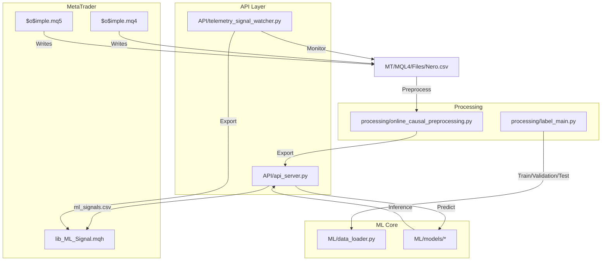
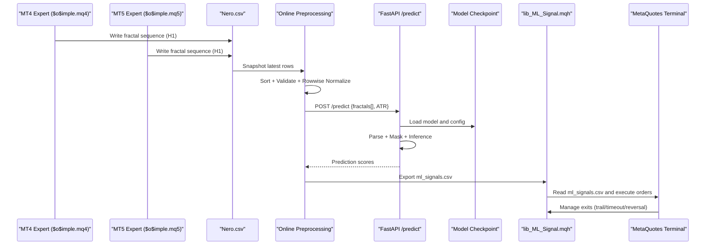
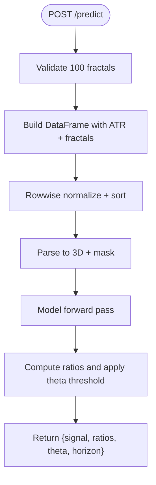
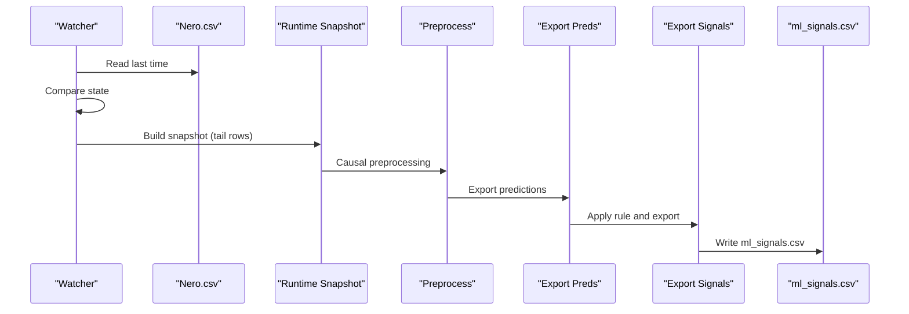
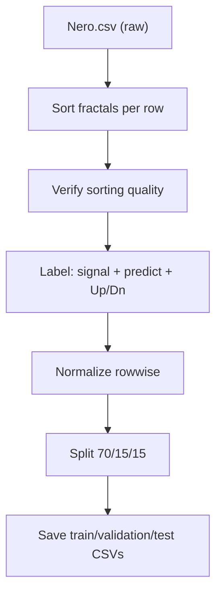
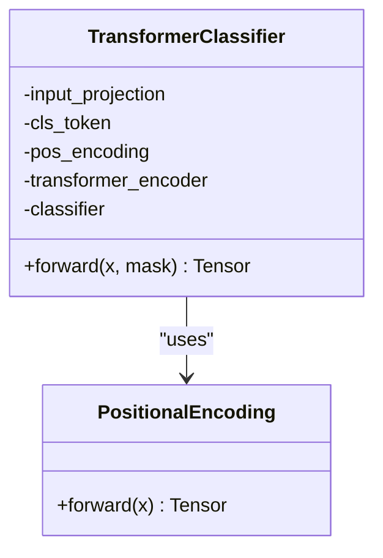
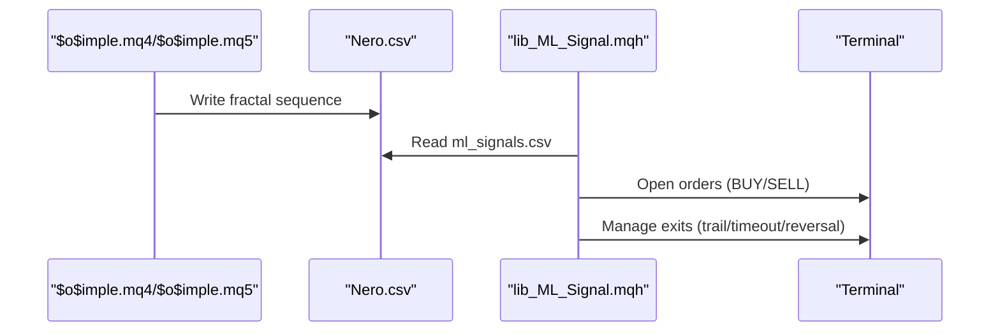
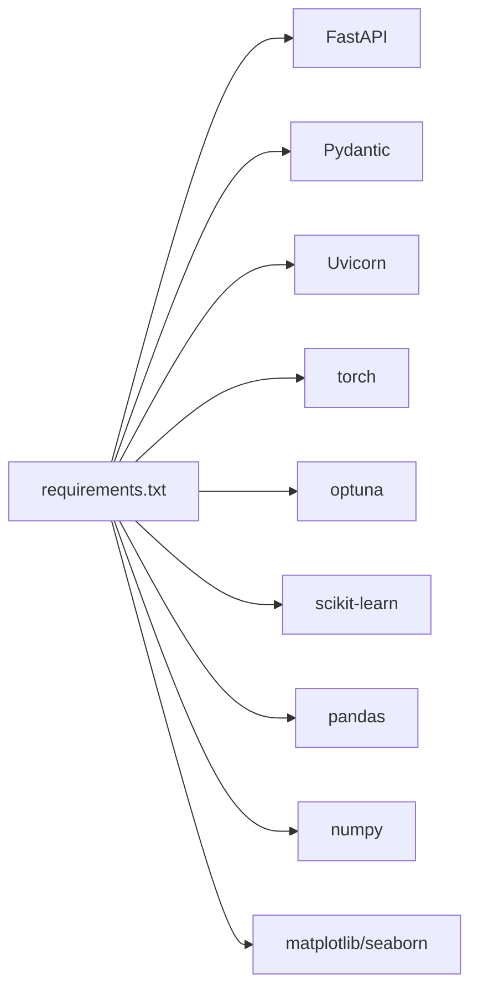

# Project Overview

<cite>
**Referenced Files in This Document**
- [README.md](file://README.md)
- [docs/README.md](file://docs/README.md)
- [docs/DATA_FLOW.md](file://docs/DATA_FLOW.md)
- [requirements.txt](file://requirements.txt)
- [API/api_server.py](file://API/api_server.py)
- [API/telemetry_signal_watcher.py](file://API/telemetry_signal_watcher.py)
- [processing/label_main.py](file://processing/label_main.py)
- [processing/online_causal_preprocessing.py](file://processing/online_causal_preprocessing.py)
- [ML/data_loader.py](file://ML/data_loader.py)
- [ML/models/__init__.py](file://ML/models/__init__.py)
- [ML/models/transformer.py](file://ML/models/transformer.py)
- [MT/MQL4/Include/lib_ML_Signal.mqh](file://MT/MQL4/Include/lib_ML_Signal.mqh)
- [MT/MQL4/Experts/$o$imple.mq4](file://MT/MQL4/Experts/$o$imple.mq4)
- [MT/MQL5/Experts/$o$imple.mq5](file://MT/MQL5/Experts/$o$imple.mq5)
</cite>

## Table of Contents
1. [Introduction](#introduction)
2. [Project Structure](#project-structure)
3. [Core Components](#core-components)
4. [Architecture Overview](#architecture-overview)
5. [Detailed Component Analysis](#detailed-component-analysis)
6. [Dependency Analysis](#dependency-analysis)
7. [Performance Considerations](#performance-considerations)
8. [Troubleshooting Guide](#troubleshooting-guide)
9. [Conclusion](#conclusion)

## Introduction
SoSimple is an ML-powered Forex trading system focused on trend reversal prediction using H1 timeframe data. The system integrates MetaTrader experts with a central ML inference service and real-time telemetry to produce executable trading signals. It combines:
- Machine learning models trained on structured fractal sequences
- MetaTrader integration via dedicated experts and shared libraries
- Real-time API services for inference and signal export

Current status: actively developed with data collection, preprocessing, EDA, and ML model development completed. The system is prepared for live trading with parity checks and telemetry.

**Section sources**
- [README.md:21-25](file://README.md#L21-L25)

## Project Structure
The repository is organized into modules that reflect the end-to-end pipeline:
- API: REST server and telemetry watcher for inference and signal export
- ML: Model registry, training, evaluation, and data loaders
- MT: MetaQuotes MQL4/MQL5 experts and shared libraries for live execution
- processing: Data preparation, labeling, normalization, and online causal preprocessing
- docs: Pipeline documentation and research artifacts
- statistics: Trade-level reconciliation and diagnostics
- tests: Unit tests for pipeline components

**Diagram sources**
- [docs/DATA_FLOW.md:8-52](file://docs/DATA_FLOW.md#L8-L52)
- [API/api_server.py:1-174](file://API/api_server.py#L1-L174)
- [API/telemetry_signal_watcher.py:1-422](file://API/telemetry_signal_watcher.py#L1-L422)
- [processing/label_main.py:1-332](file://processing/label_main.py#L1-L332)
- [processing/online_causal_preprocessing.py:1-137](file://processing/online_causal_preprocessing.py#L1-L137)
- [ML/data_loader.py:1-800](file://ML/data_loader.py#L1-L800)
- [MT/MQL4/Include/lib_ML_Signal.mqh:1-951](file://MT/MQL4/Include/lib_ML_Signal.mqh#L1-L951)
- [MT/MQL4/Experts/$o$imple.mq4:1-149](file://MT/MQL4/Experts/$o$imple.mq4#L1-L149)
- [MT/MQL5/Experts/$o$imple.mq5:1-157](file://MT/MQL5/Experts/$o$imple.mq5#L1-L157)

**Section sources**
- [docs/README.md:5-16](file://docs/README.md#L5-L16)
- [docs/DATA_FLOW.md:6-75](file://docs/DATA_FLOW.md#L6-L75)

## Core Components
- ML Inference API: FastAPI service that loads trained models and serves predictions from incoming fractal sequences.
- Telemetry Signal Watcher: Monitors the live Nero.csv, applies causal preprocessing, runs inference, and exports signals for MT4 parity checks.
- Data Preparation Pipeline: Sorts, labels, normalizes, and splits fractal sequences into train/validation/test datasets.
- Online Causal Preprocessing: Live-safe preprocessing that avoids future leakage during inference.
- Model Registry and Transformer: Modular model registry and a Transformer-based classifier for sequence modeling.
- MetaTrader Integration: MQL4/MQL5 experts and shared library for signal execution and position management.

Key capabilities:
- Trend reversal prediction using H1 fractal sequences
- Live-safe inference with causal preprocessing
- Multi-mode signal export supporting parity checks and telemetry
- Execution policies with trailing stops and fixed SL/TP options

**Section sources**
- [API/api_server.py:1-174](file://API/api_server.py#L1-L174)
- [API/telemetry_signal_watcher.py:1-422](file://API/telemetry_signal_watcher.py#L1-L422)
- [processing/label_main.py:1-332](file://processing/label_main.py#L1-L332)
- [processing/online_causal_preprocessing.py:1-137](file://processing/online_causal_preprocessing.py#L1-L137)
- [ML/models/__init__.py:1-49](file://ML/models/__init__.py#L1-L49)
- [ML/models/transformer.py:1-199](file://ML/models/transformer.py#L1-L199)
- [MT/MQL4/Include/lib_ML_Signal.mqh:1-951](file://MT/MQL4/Include/lib_ML_Signal.mqh#L1-L951)

## Architecture Overview
The system architecture connects MetaTrader data ingestion to ML inference and live execution:

**Diagram sources**
- [docs/DATA_FLOW.md:8-52](file://docs/DATA_FLOW.md#L8-L52)
- [API/api_server.py:103-169](file://API/api_server.py#L103-L169)
- [processing/online_causal_preprocessing.py:109-137](file://processing/online_causal_preprocessing.py#L109-L137)
- [MT/MQL4/Include/lib_ML_Signal.mqh:457-551](file://MT/MQL4/Include/lib_ML_Signal.mqh#L457-L551)

## Detailed Component Analysis

### ML Inference API
- Loads a trained Transformer model and optional Optuna hyperparameters
- Accepts a list of 100 fractal strings and a slow ATR value
- Applies online causal preprocessing and inference
- Returns a trading signal (BUY/SELL/FLAT) with prediction ratios and thresholds

**Diagram sources**
- [API/api_server.py:103-169](file://API/api_server.py#L103-L169)
- [ML/data_loader.py:331-424](file://ML/data_loader.py#L331-L424)

**Section sources**
- [API/api_server.py:28-94](file://API/api_server.py#L28-L94)
- [API/api_server.py:103-169](file://API/api_server.py#L103-L169)

### Telemetry Signal Watcher
- Watches for new rows in Nero.csv and triggers a rebuild when the last timestamp changes
- Builds a runtime snapshot, applies causal preprocessing, exports predictions, and writes ml_signals.csv
- Supports telemetry parity checks and online validation

**Diagram sources**
- [API/telemetry_signal_watcher.py:203-327](file://API/telemetry_signal_watcher.py#L203-L327)
- [processing/online_causal_preprocessing.py:125-137](file://processing/online_causal_preprocessing.py#L125-L137)

**Section sources**
- [API/telemetry_signal_watcher.py:1-80](file://API/telemetry_signal_watcher.py#L1-L80)
- [API/telemetry_signal_watcher.py:203-327](file://API/telemetry_signal_watcher.py#L203-L327)

### Data Preparation Pipeline
- Sorts fractals per row, validates ordering, and labels the dataset
- Normalizes features using rowwise transforms and separates train/validation/test
- Produces labeled CSVs and normalization statistics for downstream training

**Diagram sources**
- [processing/label_main.py:205-332](file://processing/label_main.py#L205-L332)
- [docs/DATA_FLOW.md:78-144](file://docs/DATA_FLOW.md#L78-L144)

**Section sources**
- [processing/label_main.py:79-131](file://processing/label_main.py#L79-L131)
- [processing/label_main.py:133-162](file://processing/label_main.py#L133-L162)
- [processing/label_main.py:165-194](file://processing/label_main.py#L165-L194)

### Online Causal Preprocessing
- Ensures preprocessing is applied only to known, past data
- Validates fractal ordering and guards against double normalization
- Produces a preprocessed snapshot suitable for inference

**Section sources**
- [processing/online_causal_preprocessing.py:57-122](file://processing/online_causal_preprocessing.py#L57-L122)

### Model Registry and Transformer
- Provides a registry of model classes and a Transformer-based classifier
- Implements positional encoding, CLS token pooling, and masked attention

**Diagram sources**
- [ML/models/transformer.py:78-199](file://ML/models/transformer.py#L78-L199)

**Section sources**
- [ML/models/__init__.py:22-49](file://ML/models/__init__.py#L22-L49)
- [ML/models/transformer.py:78-199](file://ML/models/transformer.py#L78-L199)

### MetaTrader Integration
- MQL4/MQL5 experts write H1 fractal sequences to Nero.csv
- lib_ML_Signal.mqh reads ml_signals.csv and executes trades with configurable exit modes
- Supports trailing stops, fixed SL/TP, and multi-position management

**Diagram sources**
- [MT/MQL4/Experts/$o$imple.mq4:123-149](file://MT/MQL4/Experts/$o$imple.mq4#L123-L149)
- [MT/MQL5/Experts/$o$imple.mq5:137-147](file://MT/MQL5/Experts/$o$imple.mq5#L137-L147)
- [MT/MQL4/Include/lib_ML_Signal.mqh:457-551](file://MT/MQL4/Include/lib_ML_Signal.mqh#L457-L551)

**Section sources**
- [MT/MQL4/Include/lib_ML_Signal.mqh:1-80](file://MT/MQL4/Include/lib_ML_Signal.mqh#L1-L80)
- [MT/MQL4/Include/lib_ML_Signal.mqh:603-804](file://MT/MQL4/Include/lib_ML_Signal.mqh#L603-L804)

## Dependency Analysis
Technology stack:
- Backend: FastAPI, Pydantic, Uvicorn
- ML: PyTorch, Optuna, Scikit-learn
- Data: Pandas, NumPy
- Visualization: Matplotlib, Seaborn
- Testing: Jupyter, nbconvert

**Diagram sources**
- [requirements.txt:1-17](file://requirements.txt#L1-L17)

**Section sources**
- [requirements.txt:1-17](file://requirements.txt#L1-L17)

## Performance Considerations
- Transformer encoder with CLS token pooling efficiently aggregates long-range dependencies in fractal sequences
- Padding masks ensure attention focuses only on valid positions
- Online inference uses truncated sequence lengths optimized via ablation studies
- Causal preprocessing prevents data leakage and ensures live-safe operation

[No sources needed since this section provides general guidance]

## Troubleshooting Guide
Common issues and resolutions:
- Missing model checkpoint: ensure the expected checkpoint exists and matches the configured task
- Invalid fractal count: the API expects exactly 100 fractal entries per row
- Sorting validation failures: verify that fractal timestamps are in descending order per row
- Contract violations in online inference: avoid using future-derived features in live snapshots

**Section sources**
- [API/api_server.py:59-60](file://API/api_server.py#L59-L60)
- [API/api_server.py:109-113](file://API/api_server.py#L109-L113)
- [processing/online_causal_preprocessing.py:76-82](file://processing/online_causal_preprocessing.py#L76-L82)
- [API/telemetry_signal_watcher.py:180-201](file://API/telemetry_signal_watcher.py#L180-L201)

## Conclusion
SoSimple delivers a robust, ML-driven Forex trading system centered on H1 trend reversal prediction. Its architecture cleanly separates data preparation, model inference, and live execution, with strong safeguards against data leakage and comprehensive telemetry support. The system is production-ready for live trading with parity checks and offers multiple execution modes for flexible deployment.

[No sources needed since this section summarizes without analyzing specific files]